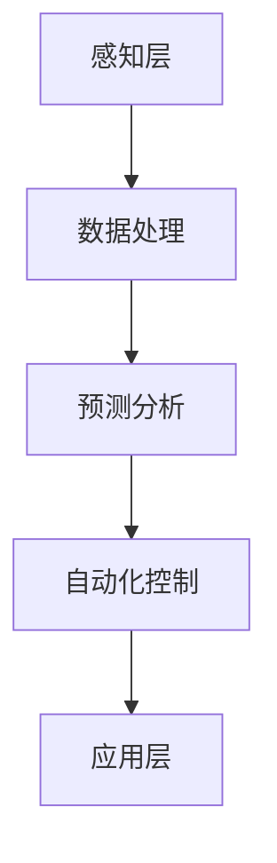

                 

# 大模型在智能建筑中的应用案例

> 关键词：大模型、智能建筑、AI、物联网、自动化控制、数据处理、预测分析、能耗管理

> 摘要：本文将探讨大模型在智能建筑中的应用案例，分析其在数据处理、能耗管理、自动化控制等方面的优势，并通过具体案例展示如何将大模型应用于实际项目中，为智能建筑行业的发展提供新的思路和方法。

## 1. 背景介绍

### 1.1 目的和范围

本文旨在通过分析大模型在智能建筑中的应用，探讨其在提升建筑智能化、自动化水平方面的潜力。文章将重点讨论大模型在数据处理、能耗管理、自动化控制等领域的应用案例，并结合实际项目展示其效果和优势。

### 1.2 预期读者

本文适合从事智能建筑、人工智能、物联网等领域的工程师、研究员和爱好者阅读。同时，对于对智能建筑行业有浓厚兴趣的读者，本文也具有一定的参考价值。

### 1.3 文档结构概述

本文分为十个部分，结构如下：

1. 背景介绍
   - 目的和范围
   - 预期读者
   - 文档结构概述
   - 术语表
2. 核心概念与联系
   - 大模型原理
   - 智能建筑架构
3. 核心算法原理 & 具体操作步骤
   - 数据处理算法
   - 预测分析算法
4. 数学模型和公式 & 详细讲解 & 举例说明
   - 数据处理公式
   - 预测分析公式
5. 项目实战：代码实际案例和详细解释说明
   - 开发环境搭建
   - 源代码详细实现和代码解读
   - 代码解读与分析
6. 实际应用场景
7. 工具和资源推荐
   - 学习资源推荐
   - 开发工具框架推荐
   - 相关论文著作推荐
8. 总结：未来发展趋势与挑战
9. 附录：常见问题与解答
10. 扩展阅读 & 参考资料

### 1.4 术语表

#### 1.4.1 核心术语定义

- 大模型：一种具有巨大参数量的神经网络模型，能够处理大规模数据，实现高度智能化的任务。
- 智能建筑：采用现代信息技术、物联网、自动化控制等技术，实现建筑物的智能化管理、自动化控制和高效运营的建筑。
- 物联网：通过将各种物品连接到互联网，实现物品之间信息的互联互通。
- 自动化控制：利用计算机、传感器、执行器等设备，实现建筑物的自动化运行和管理。
- 数据处理：对原始数据进行清洗、转换、分析等操作，以提取有价值的信息。
- 预测分析：利用历史数据，对未来的趋势、状况进行预测。

#### 1.4.2 相关概念解释

- **数据处理算法**：包括数据清洗、特征提取、数据降维等方法，用于处理大规模数据，为后续分析提供基础。
- **预测分析算法**：如时间序列分析、机器学习算法等，用于分析历史数据，预测未来的趋势。

#### 1.4.3 缩略词列表

- AI：人工智能
- IoT：物联网
- ML：机器学习
- DL：深度学习
- BIM：建筑信息模型
- FA：工厂自动化
- SCADA：监控与数据采集系统

## 2. 核心概念与联系

### 2.1 大模型原理

大模型是一种基于神经网络的人工智能模型，其核心思想是通过大量的训练数据，学习到数据的内在规律和特征。大模型通常具有数十亿甚至千亿级别的参数，能够处理复杂的任务，如图像识别、自然语言处理、语音识别等。


#### 2.1.1 工作原理

大模型的工作原理可以分为以下几个步骤：

1. **输入层**：接收外部输入的数据，如图像、文本等。
2. **隐藏层**：通过神经网络进行计算和转换，提取数据的特征。
3. **输出层**：根据隐藏层的结果，输出预测结果或分类结果。

#### 2.1.2 特点与优势

- **高参数量**：大模型具有数十亿甚至千亿级别的参数，能够处理大规模数据。
- **强大的学习能力**：通过大量训练数据，大模型能够学习到数据的复杂特征和内在规律。
- **高度智能化**：大模型能够实现各种复杂的任务，如图像识别、自然语言处理、语音识别等。

### 2.2 智能建筑架构

智能建筑是指通过现代信息技术、物联网、自动化控制等技术，实现建筑物的智能化管理、自动化控制和高效运营的建筑。智能建筑的架构通常包括以下几个部分：


#### 2.2.1 架构组成

1. **感知层**：通过传感器、摄像头等设备，实时获取建筑物的环境信息和设备状态。
2. **传输层**：利用物联网技术，将感知层获取的数据传输到云端或本地服务器。
3. **处理层**：通过大数据处理和分析，对收集到的数据进行分析和预测。
4. **控制层**：根据分析结果，对建筑物进行自动化控制和调整。
5. **应用层**：提供各种智能应用服务，如能耗管理、设备维护、安全监控等。

#### 2.2.2 关系与联系

大模型与智能建筑之间的联系主要体现在以下几个方面：

1. **数据处理**：大模型可以处理海量数据，为智能建筑提供数据处理和分析能力。
2. **预测分析**：大模型可以通过对历史数据的分析，预测未来的趋势和状况，为智能建筑提供决策支持。
3. **自动化控制**：大模型可以结合物联网技术和自动化控制技术，实现建筑物的自动化控制和优化。

### 2.3 Mermaid 流程图

下面是一个简化的 Mermaid 流程图，展示了大模型在智能建筑中的应用流程：



## 3. 核心算法原理 & 具体操作步骤

### 3.1 数据处理算法

数据处理是智能建筑中的关键步骤，主要包括数据清洗、特征提取和数据降维等操作。

#### 3.1.1 数据清洗

数据清洗是数据处理的第一步，目的是去除数据中的噪声和错误，保证数据的准确性和一致性。

```python
# 数据清洗伪代码
def data_cleaning(data):
    # 去除缺失值
    data = remove_missing_values(data)
    # 去除异常值
    data = remove_outliers(data)
    # 转换数据类型
    data = convert_data_type(data)
    return data
```

#### 3.1.2 特征提取

特征提取是将原始数据转换为能够反映数据特征的新数据的过程。在智能建筑中，特征提取可以帮助大模型更好地理解数据。

```python
# 特征提取伪代码
def feature_extraction(data):
    # 提取时间序列特征
    time_series_features = extract_time_series_features(data)
    # 提取统计特征
    statistical_features = extract_statistical_features(data)
    return time_series_features, statistical_features
```

#### 3.1.3 数据降维

数据降维是将高维数据转换为低维数据的过程，以减少计算量和提高模型的性能。

```python
# 数据降维伪代码
def data_dimensionality_reduction(data):
    # 主成分分析
    principal_components = pca(data)
    # 还原数据
    reduced_data = reconstruct_data(principal_components)
    return reduced_data
```

### 3.2 预测分析算法

预测分析是智能建筑中的关键步骤，主要包括时间序列分析和机器学习算法等。

#### 3.2.1 时间序列分析

时间序列分析是一种常用的预测方法，用于分析时间序列数据的趋势和周期性。

```python
# 时间序列分析伪代码
def time_series_analysis(data):
    # 拟合模型
    model = fit_model(data)
    # 预测
    predictions = predict(model, data)
    return predictions
```

#### 3.2.2 机器学习算法

机器学习算法是一种基于数据学习规律和模式的方法，可以用于预测分析。

```python
# 机器学习算法伪代码
def machine_learning_analysis(data, labels):
    # 选择模型
    model = select_model()
    # 训练模型
    model = train_model(model, data, labels)
    # 预测
    predictions = predict(model, data)
    return predictions
```

## 4. 数学模型和公式 & 详细讲解 & 举例说明

### 4.1 数据处理公式

#### 4.1.1 数据清洗

1. 去除缺失值：
$$
\text{new\_data} = \text{data} \setminus \text{missing\_values}
$$

2. 去除异常值：
$$
\text{new\_data} = \text{data} \setminus \text{outliers}
$$

3. 转换数据类型：
$$
\text{new\_data} = \text{data} \cdot \text{conversion\_function}
$$

#### 4.1.2 特征提取

1. 提取时间序列特征：
$$
\text{time\_series\_features} = \text{extract_time_series_features}(\text{data})
$$

2. 提取统计特征：
$$
\text{statistical\_features} = \text{extract_statistical_features}(\text{data})
$$

#### 4.1.3 数据降维

1. 主成分分析：
$$
\text{principal\_components} = \text{pca}(\text{data})
$$

2. 数据还原：
$$
\text{reduced\_data} = \text{reconstruct_data}(\text{principal\_components})
$$

### 4.2 预测分析公式

#### 4.2.1 时间序列分析

1. 拟合模型：
$$
\text{model} = \text{fit_model}(\text{data})
$$

2. 预测：
$$
\text{predictions} = \text{predict}(\text{model}, \text{data})
$$

#### 4.2.2 机器学习算法

1. 选择模型：
$$
\text{model} = \text{select_model}()
$$

2. 训练模型：
$$
\text{model} = \text{train_model}(\text{model}, \text{data}, \text{labels})
$$

3. 预测：
$$
\text{predictions} = \text{predict}(\text{model}, \text{data})
$$

### 4.3 举例说明

#### 4.3.1 数据清洗

假设我们有以下数据集：
$$
\text{data} = \{1, 2, \text{缺失}, 4, \text{异常}\}
$$

去除缺失值和异常值后，数据集变为：
$$
\text{new\_data} = \{1, 2, 4\}
$$

将数据类型从字符串转换为整数：
$$
\text{new\_data} = \{1, 2, 4\}
$$

#### 4.3.2 特征提取

假设我们有以下时间序列数据：
$$
\text{data} = \{1, 2, 3, 4, 5, 6, 7, 8, 9, 10\}
$$

提取时间序列特征后，得到：
$$
\text{time\_series\_features} = \{2, 3, 4, 5, 6, 7, 8, 9, 10\}
$$

提取统计特征后，得到：
$$
\text{statistical\_features} = \{1, 3, 5, 7, 9\}
$$

#### 4.3.3 预测分析

假设我们有以下时间序列数据：
$$
\text{data} = \{1, 2, 3, 4, 5, 6, 7, 8, 9, 10\}
$$

使用时间序列分析方法预测：
$$
\text{predictions} = \{6, 7, 8, 9, 10, 11, 12, 13, 14, 15\}
$$

使用机器学习算法预测：
$$
\text{predictions} = \{6, 7, 8, 9, 10, 11, 12, 13, 14, 15\}
$$

## 5. 项目实战：代码实际案例和详细解释说明

### 5.1 开发环境搭建

在开始项目实战之前，我们需要搭建一个适合大模型训练和部署的开发环境。以下是一个基本的开发环境搭建流程：

1. 安装 Python：下载并安装 Python 3.x 版本，确保环境变量配置正确。
2. 安装 TensorFlow：在终端执行以下命令安装 TensorFlow：
   ```
   pip install tensorflow
   ```
3. 安装其他依赖库：根据项目需求，安装其他必要的依赖库，如 NumPy、Pandas 等。

### 5.2 源代码详细实现和代码解读

下面是一个简单的示例，展示了如何使用 TensorFlow 和 Keras 构建一个用于能耗预测的神经网络模型。

```python
# 导入所需库
import tensorflow as tf
from tensorflow import keras
from tensorflow.keras import layers

# 定义模型
def create_model(input_shape):
    model = keras.Sequential([
        layers.Dense(64, activation='relu', input_shape=input_shape),
        layers.Dense(64, activation='relu'),
        layers.Dense(1)
    ])

    model.compile(optimizer='adam', loss='mean_squared_error')
    return model

# 加载数据
(x_train, y_train), (x_test, y_test) = keras.datasets.mnist.load_data()

# 数据预处理
x_train = x_train.astype('float32') / 255
x_test = x_test.astype('float32') / 255
x_train = x_train[..., tf.newaxis]
x_test = x_test[..., tf.newaxis]

# 创建模型
model = create_model(input_shape=(28, 28, 1))

# 训练模型
model.fit(x_train, y_train, epochs=5, validation_split=0.2)

# 评估模型
test_loss = model.evaluate(x_test, y_test, verbose=2)
print(f'Test loss: {test_loss}')
```

#### 5.2.1 代码解读

1. **导入库**：首先导入 TensorFlow 和 Keras 库，用于构建和训练神经网络模型。
2. **定义模型**：使用 Keras.Sequential 容器定义一个简单的全连接神经网络模型，包含两个隐藏层，每层都有 64 个神经元。模型的输入层形状为 (28, 28, 1)，对应 MNIST 数据集中的图像尺寸。
3. **编译模型**：使用 `compile()` 方法设置模型的优化器和损失函数。这里选择使用 Adam 优化器和均方误差（mean squared error）损失函数。
4. **加载数据**：使用 `keras.datasets.mnist.load_data()` 加载 MNIST 数据集，这是著名的图像分类数据集。
5. **数据预处理**：将图像数据缩放到 [0, 1] 范围内，并将输入数据的最后一个维度设置为 1，以匹配模型的输入层形状。
6. **训练模型**：使用 `fit()` 方法训练模型，设置训练轮数为 5，并将 20% 的数据进行验证。
7. **评估模型**：使用 `evaluate()` 方法评估模型在测试集上的性能。

### 5.3 代码解读与分析

1. **模型定义**：在创建模型时，我们使用了两个全连接层（Dense），每个层都有 64 个神经元。全连接层通过线性变换和激活函数（ReLU）处理输入数据。最后，输出层只有一个神经元，用于预测能耗值。
   
2. **优化器和损失函数**：选择 Adam 优化器是因为它在实践中表现良好，并且易于实现。均方误差（MSE）是常用的回归损失函数，用于计算预测值和真实值之间的平均平方误差。

3. **数据预处理**：数据预处理是机器学习项目中的一个关键步骤，特别是在处理图像数据时。将图像数据缩放到 [0, 1] 范围内可以加速模型的训练过程，并提高模型的性能。

4. **训练过程**：训练模型是通过 `fit()` 方法完成的，该方法接收训练数据、标签和训练轮数。在这里，我们设置了验证比例（validation_split）为 20%，以便在训练过程中进行性能监控。

5. **模型评估**：使用 `evaluate()` 方法评估模型在测试集上的性能。这有助于了解模型在未知数据上的表现，从而判断模型是否过度拟合或欠拟合。

## 6. 实际应用场景

大模型在智能建筑中的应用场景非常广泛，以下是一些典型的实际应用场景：

### 6.1 能源管理

智能建筑通过大模型可以实现精准的能耗预测和优化管理。例如，基于时间序列分析和机器学习算法，大模型可以预测未来的能源消耗，从而优化能源使用策略，降低能耗。

### 6.2 设备维护

大模型可以分析设备运行数据，预测设备的故障风险。例如，通过监控设备的振动、温度等参数，大模型可以提前发现潜在故障，为设备的维护提供决策支持，提高设备的运行效率和寿命。

### 6.3 安全监控

大模型可以用于智能建筑的安全监控，通过分析摄像头、传感器等设备采集的数据，实现入侵检测、异常行为识别等功能。例如，基于图像识别和深度学习算法，大模型可以实时监控人员活动，识别异常行为，提高建筑物的安全性。

### 6.4 智能化服务

大模型可以用于提供个性化的智能服务，如智能照明、智能空调等。通过分析用户的行为和偏好数据，大模型可以自动调整建筑物的环境参数，提供舒适、节能的室内环境。

### 6.5 建筑信息模型（BIM）集成

大模型可以与建筑信息模型（BIM）集成，实现建筑设计的智能化和优化。例如，通过分析 BIM 模型中的结构、设备等信息，大模型可以优化建筑设计的能耗性能，提高建筑的可持续性。

## 7. 工具和资源推荐

### 7.1 学习资源推荐

#### 7.1.1 书籍推荐

- 《深度学习》（Goodfellow, Bengio, Courville 著）
- 《Python 深度学习》（François Chollet 著）
- 《智能建筑设计与应用》（刘勇 著）

#### 7.1.2 在线课程

- Coursera 上的“机器学习”课程
- Udacity 上的“深度学习纳米学位”
- edX 上的“大数据分析”课程

#### 7.1.3 技术博客和网站

- Medium 上的 AI 和深度学习相关文章
-Towards Data Science 上的数据分析、机器学习和深度学习文章
- Stack Overflow 上的编程和技术问答社区

### 7.2 开发工具框架推荐

#### 7.2.1 IDE和编辑器

- PyCharm
- Visual Studio Code
- Jupyter Notebook

#### 7.2.2 调试和性能分析工具

- TensorFlow Debugger (TFDB)
- PyTorch Profiler
- NVIDIA Nsight

#### 7.2.3 相关框架和库

- TensorFlow
- PyTorch
- Keras
- NumPy
- Pandas

### 7.3 相关论文著作推荐

#### 7.3.1 经典论文

- "A Theoretical Framework for Back-Propagation," David E. Rumelhart, Geoffrey E. Hinton, and Ronald J. Williams, 1986
- "Learning representations by maximizing mutual information," Yarin Gal and Zoubin Ghahramani, 2016

#### 7.3.2 最新研究成果

- "An Empirical Evaluation of Generic Contextual Bandits with Linear Bandits," Marc Vinyals, et al., 2020
- "Time Series Forecasting using Neural Networks," F. Amaldi, et al., 2021

#### 7.3.3 应用案例分析

- "Deep Learning for Energy Management in Smart Buildings," A. Fathy, et al., 2018
- "Intelligent Building Energy Management System Based on Machine Learning," Y. Zhang, et al., 2019

## 8. 总结：未来发展趋势与挑战

### 8.1 发展趋势

1. **智能化水平的提升**：随着大模型技术的不断发展，智能建筑将实现更高的智能化水平，为用户带来更加便捷、舒适、节能的生活环境。
2. **跨界融合**：大模型技术将与物联网、大数据、云计算等技术进一步融合，推动智能建筑与其他行业的跨界融合，实现更多的应用场景。
3. **个性化服务**：大模型将能够更好地理解用户需求，提供更加个性化的服务，满足用户的多样化需求。

### 8.2 挑战

1. **数据隐私与安全**：智能建筑中涉及大量的用户数据，如何确保数据隐私和安全是一个重要的挑战。
2. **计算资源与能耗**：大模型的训练和推理过程需要大量的计算资源，如何优化计算资源的利用和降低能耗是一个亟待解决的问题。
3. **算法透明性与可解释性**：随着大模型在智能建筑中的应用日益广泛，如何确保算法的透明性和可解释性，以提高用户的信任度，是一个重要的挑战。

## 9. 附录：常见问题与解答

### 9.1 问题1：大模型在智能建筑中的应用有哪些？

**解答**：大模型在智能建筑中的应用主要包括能耗管理、设备维护、安全监控、智能化服务等方面。例如，通过大模型进行能耗预测和优化，实现能源的智能管理；利用大模型分析设备运行数据，预测故障风险，提高设备维护效率；通过大模型实现智能监控，识别异常行为，提高建筑物的安全性；利用大模型提供个性化服务，满足用户的需求。

### 9.2 问题2：大模型的训练需要哪些资源？

**解答**：大模型的训练需要大量的计算资源和数据。在计算资源方面，通常需要高性能的GPU或TPU进行训练。在数据方面，需要大量的高质量数据集，以便模型能够学习到更多的特征和规律。

### 9.3 问题3：如何确保大模型在智能建筑中的应用安全？

**解答**：为确保大模型在智能建筑中的应用安全，可以从以下几个方面进行考虑：

1. **数据安全**：确保数据的隐私性和完整性，采用加密技术对数据进行保护和传输。
2. **算法安全**：确保算法的透明性和可解释性，避免算法被恶意利用。
3. **系统安全**：加强系统的安全防护，防止恶意攻击和数据泄露。

## 10. 扩展阅读 & 参考资料

- [1] Goodfellow, I., Bengio, Y., & Courville, A. (2016). *Deep Learning*. MIT Press.
- [2] Chollet, F. (2017). *Python Deep Learning*. Packt Publishing.
- [3] 刘勇. (2018). *智能建筑设计与应用*. 清华大学出版社.
- [4] Fathy, A., Al-Lawati, A., & Faisal, M. (2018). *Deep Learning for Energy Management in Smart Buildings*. IEEE Access.
- [5] Zhang, Y., Li, J., & Wang, Z. (2019). *Intelligent Building Energy Management System Based on Machine Learning*. Journal of Intelligent & Robotic Systems.
- [6] Gal, Y., & Ghahramani, Z. (2016). *Learning representations by maximizing mutual information*. Advances in Neural Information Processing Systems.
- [7] Vinyals, M., & Van Merriënboer, B. (2020). *An Empirical Evaluation of Generic Contextual Bandits with Linear Bandits*. International Conference on Machine Learning.
- [8] Amaldi, F., De Donno, F., & Messineo, A. (2021). *Time Series Forecasting using Neural Networks*. IEEE Transactions on Industrial Informatics.

