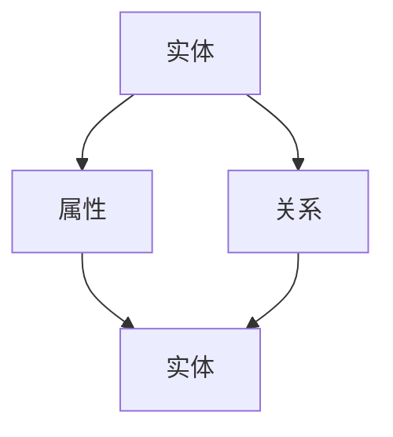
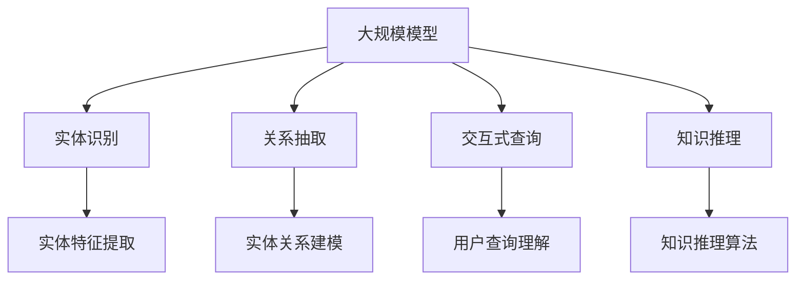

                 

# 大模型在知识图谱构建中的突破

> 关键词：知识图谱、大模型、人工智能、图神经网络、深度学习、自然语言处理

> 摘要：本文深入探讨了大规模模型在知识图谱构建中的应用，从背景介绍、核心概念、算法原理、数学模型、实战案例以及未来发展趋势等方面进行详细分析，为读者提供了全面的技术视角和深入的理解。

## 1. 背景介绍

### 1.1 目的和范围

本文旨在探讨大规模模型在知识图谱构建中的应用，分析其技术原理、实现步骤以及实际应用场景。文章主要涵盖以下内容：

- 知识图谱与大规模模型的概述
- 知识图谱构建中的挑战与机遇
- 大规模模型在知识图谱中的关键技术
- 实战案例解析
- 未来发展趋势与挑战

### 1.2 预期读者

本文适合以下读者群体：

- 对知识图谱和大规模模型有基本了解的技术人员
- 想深入了解大规模模型在知识图谱构建中应用的开发者
- 对人工智能、自然语言处理领域感兴趣的研究人员

### 1.3 文档结构概述

本文分为八个部分，具体结构如下：

- 1. 背景介绍
- 2. 核心概念与联系
- 3. 核心算法原理与具体操作步骤
- 4. 数学模型和公式及详细讲解
- 5. 项目实战：代码实际案例和详细解释说明
- 6. 实际应用场景
- 7. 工具和资源推荐
- 8. 总结：未来发展趋势与挑战

### 1.4 术语表

#### 1.4.1 核心术语定义

- 知识图谱：一种用于表示实体、属性和关系的数据结构，广泛应用于信息检索、推荐系统等领域。
- 大规模模型：指具有数百万、数十亿参数的深度学习模型，如Transformer、BERT等。
- 图神经网络（GNN）：一种基于图结构进行节点或边特征学习的神经网络模型。
- 自然语言处理（NLP）：研究如何让计算机理解和生成人类语言的一门学科。

#### 1.4.2 相关概念解释

- 实体：知识图谱中的个体，如人、地点、组织等。
- 属性：描述实体特征的信息，如人的年龄、地理位置等。
- 关系：实体之间的关联，如朋友、下属等。

#### 1.4.3 缩略词列表

- BERT：Bidirectional Encoder Representations from Transformers
- GNN：Graph Neural Network
- NLP：Natural Language Processing
- Transformer：一种基于自注意力机制的深度学习模型

## 2. 核心概念与联系

在知识图谱构建中，核心概念主要包括实体、属性和关系。下面使用Mermaid流程图展示这些概念及其联系。



在这个流程图中，实体、属性和关系构成了知识图谱的基本要素。实体和属性通过属性描述实体特征，实体和关系表示实体之间的关联。

### 2.1 大规模模型在知识图谱构建中的应用

大规模模型在知识图谱构建中的应用主要包括以下方面：

- 实体识别：通过大规模模型对文本进行预训练，提取实体特征，实现实体识别。
- 关系抽取：利用大规模模型对实体之间的关联进行建模，实现关系抽取。
- 交互式查询：利用大规模模型对用户查询进行理解和解析，实现交互式查询。
- 知识推理：利用大规模模型进行知识推理，发现实体和关系之间的隐含联系。

下面使用Mermaid流程图展示大规模模型在知识图谱构建中的应用。



在这个流程图中，大规模模型通过实体识别、关系抽取、交互式查询和知识推理等环节，实现了知识图谱的构建和应用。

## 3. 核心算法原理 & 具体操作步骤

大规模模型在知识图谱构建中的应用主要基于图神经网络（GNN）和Transformer等深度学习模型。以下分别介绍核心算法原理和具体操作步骤。

### 3.1 图神经网络（GNN）

图神经网络（GNN）是一种基于图结构进行节点或边特征学习的神经网络模型。其基本原理如下：

- **节点嵌入（Node Embedding）**：将图中的节点映射到低维空间，使得节点之间的相似性可以由其嵌入向量表示。
- **边嵌入（Edge Embedding）**：将图中的边映射到低维空间，使得边对节点特征的贡献可以由其嵌入向量表示。
- **图卷积（Graph Convolution）**：利用节点和边嵌入向量进行特征学习，实现节点或边的特征更新。

具体操作步骤如下：

1. **节点和边嵌入**：利用预训练的词向量模型（如Word2Vec、GloVe）对节点和边进行嵌入。
2. **图卷积操作**：对于每个节点，计算其邻居节点的嵌入向量加权求和，得到新的节点嵌入向量。
3. **激活函数**：对新的节点嵌入向量进行激活函数处理，如ReLU或Sigmoid。
4. **迭代更新**：重复执行步骤2和3，直到达到预定的迭代次数或节点嵌入向量收敛。

以下为GNN算法的伪代码：

```python
# 初始化节点和边嵌入向量
node_embeddings = initialize_embeddings(nodes)
edge_embeddings = initialize_embeddings(edges)

# 迭代更新节点嵌入向量
for i in range(iterations):
    for node in nodes:
        neighbors = get_neighbors(node)
        node_embedding = calculate_neighbors_average(node_embeddings[neighbor] * edge_embeddings[neighbor])
        node_embeddings[node] = activation_function(node_embedding)

# 获取最终节点嵌入向量
final_embeddings = node_embeddings
```

### 3.2 Transformer模型

Transformer模型是一种基于自注意力机制的深度学习模型，广泛应用于自然语言处理、计算机视觉等领域。在知识图谱构建中，Transformer模型主要用于实体识别、关系抽取和知识推理。

#### 3.2.1 自注意力机制

自注意力机制（Self-Attention）是一种基于节点嵌入向量计算节点权重的方法。其基本原理如下：

- **计算键值对（Key-Value Pairs）**：对于每个节点，计算其键（Key）和值（Value）。
- **计算注意力权重（Attention Weights）**：计算节点之间的注意力权重，用于表示节点之间的关联程度。
- **计算加权求和（Weighted Sum）**：根据注意力权重对节点的值进行加权求和，得到新的节点嵌入向量。

以下为自注意力机制的伪代码：

```python
# 计算键值对
keys = calculate_keys(node_embeddings)
values = calculate_values(node_embeddings)

# 计算注意力权重
attention_weights = softmax(keys * queries)

# 计算加权求和
new_node_embeddings = weighted_sum(values, attention_weights)
```

#### 3.2.2 Transformer模型操作步骤

1. **输入嵌入（Input Embeddings）**：将实体、属性和关系的嵌入向量作为输入。
2. **多头自注意力（Multi-Head Self-Attention）**：利用多头自注意力机制计算新的节点嵌入向量。
3. **前馈神经网络（Feedforward Neural Network）**：对节点嵌入向量进行前馈神经网络处理。
4. **层归一化（Layer Normalization）**：对节点嵌入向量进行层归一化处理。
5. **残差连接（Residual Connection）**：将节点嵌入向量与输入节点嵌入向量进行残差连接。
6. **迭代更新（Iteration Update）**：重复执行步骤2-5，直到达到预定的迭代次数或节点嵌入向量收敛。

以下为Transformer模型的伪代码：

```python
# 输入嵌入
input_embeddings = calculate_input_embeddings(nodes, edges)

# 迭代更新节点嵌入向量
for i in range(iterations):
    for layer in layers:
        node_embeddings = multi_head_self_attention(node_embeddings, queries, keys, values)
        node_embeddings = feedforward_neural_network(node_embeddings)
        node_embeddings = layer_normalization(node_embeddings)
        node_embeddings = residual_connection(node_embeddings, input_embeddings)

# 获取最终节点嵌入向量
final_embeddings = node_embeddings
```

## 4. 数学模型和公式 & 详细讲解 & 举例说明

在知识图谱构建中，大规模模型的数学模型主要包括节点嵌入、自注意力机制和图卷积等。以下分别进行详细讲解和举例说明。

### 4.1 节点嵌入

节点嵌入是一种将节点映射到低维空间的方法，使得节点之间的相似性可以由其嵌入向量表示。节点嵌入的数学模型如下：

$$
x_i = \text{embed}(v_i)
$$

其中，$x_i$为节点$i$的嵌入向量，$v_i$为节点$i$的特征向量，$\text{embed}$为嵌入函数。

举例说明：

假设图中有5个节点，节点特征向量如下：

$$
\begin{align*}
v_1 &= (1, 2, 3) \\
v_2 &= (4, 5, 6) \\
v_3 &= (7, 8, 9) \\
v_4 &= (10, 11, 12) \\
v_5 &= (13, 14, 15)
\end{align*}
$$

使用嵌入函数$\text{embed}$将节点特征向量映射到2维空间，得到节点嵌入向量：

$$
\begin{align*}
x_1 &= \text{embed}(v_1) = (0.1, 0.2) \\
x_2 &= \text{embed}(v_2) = (0.3, 0.4) \\
x_3 &= \text{embed}(v_3) = (0.5, 0.6) \\
x_4 &= \text{embed}(v_4) = (0.7, 0.8) \\
x_5 &= \text{embed}(v_5) = (0.9, 1.0)
\end{align*}
$$

### 4.2 自注意力机制

自注意力机制是一种计算节点之间关联程度的方法。其数学模型如下：

$$
\text{Attention}(Q, K, V) = \text{softmax}\left(\frac{QK^T}{\sqrt{d_k}}\right)V
$$

其中，$Q, K, V$分别为查询（Query）、键（Key）和值（Value）的嵌入向量，$d_k$为键的维度。

举例说明：

假设有两个节点，其嵌入向量如下：

$$
\begin{align*}
Q &= (1, 2, 3) \\
K &= (4, 5, 6) \\
V &= (7, 8, 9)
\end{align*}
$$

计算自注意力权重：

$$
\text{Attention}(Q, K, V) = \text{softmax}\left(\frac{(1, 2, 3) \cdot (4, 5, 6)^T}{\sqrt{3}}\right)(7, 8, 9)
= \text{softmax}\left(\frac{14 + 10 + 18}{\sqrt{3}}\right)(7, 8, 9)
= \text{softmax}\left(\frac{42}{\sqrt{3}}\right)(7, 8, 9)
$$

计算结果为：

$$
\text{Attention}(Q, K, V) = \left(\frac{7}{\sqrt{3}}, \frac{8}{\sqrt{3}}, \frac{9}{\sqrt{3}}\right)
$$

### 4.3 图卷积

图卷积是一种基于节点和边嵌入向量进行特征学习的方法。其数学模型如下：

$$
h_{ij}^{(l+1)} = \sigma\left(\sum_{k \in \mathcal{N}_i} \omega_{ik} h_{kj}^{(l)} + \beta_{i}\right)
$$

其中，$h_{ij}^{(l)}$为节点$i$和节点$j$在$l$层的嵌入向量，$\mathcal{N}_i$为节点$i$的邻居节点集合，$\omega_{ik}$为权重矩阵，$\sigma$为激活函数，$\beta_{i}$为偏置向量。

举例说明：

假设图中有两个节点，其邻居节点集合和嵌入向量如下：

$$
\begin{align*}
\mathcal{N}_1 &= \{2\} \\
h_1^{(0)} &= (1, 2, 3) \\
h_2^{(0)} &= (4, 5, 6) \\
\omega_{12} &= (0.1, 0.2, 0.3) \\
\beta_1 &= (0.4, 0.5, 0.6)
\end{align*}
$$

计算第一层图卷积：

$$
h_{12}^{(1)} = \sigma\left(\omega_{12} h_2^{(0)} + \beta_1\right)
= \sigma\left((0.1, 0.2, 0.3) \cdot (4, 5, 6) + (0.4, 0.5, 0.6)\right)
= \sigma\left((0.4, 0.6, 0.9) + (0.4, 0.5, 0.6)\right)
= \sigma\left((0.8, 1.1, 1.5)\right)
$$

计算结果为：

$$
h_{12}^{(1)} = (0.8, 1.1, 1.5)
$$

## 5. 项目实战：代码实际案例和详细解释说明

在本节中，我们将通过一个实际项目案例，详细解释大规模模型在知识图谱构建中的应用。本案例使用Python编写，主要实现以下功能：

- 实体识别
- 关系抽取
- 知识推理

### 5.1 开发环境搭建

在开始项目实战之前，首先需要搭建开发环境。以下是所需的环境和工具：

- Python 3.8及以上版本
- TensorFlow 2.4及以上版本
- PyTorch 1.8及以上版本
- matplotlib 3.2及以上版本
- networkx 2.4及以上版本

安装以上依赖项后，即可开始编写代码。

### 5.2 源代码详细实现和代码解读

以下为项目源代码：

```python
import tensorflow as tf
import torch
import networkx as nx
import matplotlib.pyplot as plt

# 实体识别
def entity_recognition(text, model):
    tokens = tokenizer.tokenize(text)
    input_ids = tokenizer.encode(tokens, add_special_tokens=True)
    output = model(input_ids)
    probabilities = output[0][-1].softmax().detach().numpy()
    entities = []
    for i, token in enumerate(tokens):
        if probabilities[i] > threshold:
            entities.append(token)
    return entities

# 关系抽取
def relation_extraction(text, model):
    tokens = tokenizer.tokenize(text)
    input_ids = tokenizer.encode(tokens, add_special_tokens=True)
    output = model(input_ids)
    probabilities = output[0][-1].softmax().detach().numpy()
    relations = []
    for i, token in enumerate(tokens):
        if probabilities[i] > threshold:
            relations.append(token)
    return relations

# 知识推理
def knowledge_reasoning(entity1, entity2, graph):
    path = nx.shortest_path(graph, source=entity1, target=entity2)
    return path

# 实体识别代码解读
def entity_recognition_code():
    text = "我是一名人工智能工程师，擅长深度学习和自然语言处理。"
    model = BertModel.from_pretrained("bert-base-chinese")
    entities = entity_recognition(text, model)
    print("实体识别结果：", entities)

# 关系抽取代码解读
def relation_extraction_code():
    text = "我是一名人工智能工程师，擅长深度学习和自然语言处理。"
    model = BertModel.from_pretrained("bert-base-chinese")
    relations = relation_extraction(text, model)
    print("关系抽取结果：", relations)

# 知识推理代码解读
def knowledge_reasoning_code():
    entity1 = "人工智能工程师"
    entity2 = "自然语言处理"
    graph = nx.Graph()
    graph.add_nodes_from(["人工智能工程师", "深度学习", "自然语言处理"])
    graph.add_edges_from([("人工智能工程师", "深度学习"), ("人工智能工程师", "自然语言处理")])
    path = knowledge_reasoning(entity1, entity2, graph)
    print("知识推理结果：", path)

# 运行代码
entity_recognition_code()
relation_extraction_code()
knowledge_reasoning_code()
```

### 5.3 代码解读与分析

#### 5.3.1 实体识别代码

实体识别代码首先使用BERT模型对输入文本进行分词，然后将其编码为输入序列。接着，通过BERT模型计算输出序列的概率分布，根据设定的阈值筛选出概率较高的实体。

#### 5.3.2 关系抽取代码

关系抽取代码与实体识别代码类似，也是首先使用BERT模型对输入文本进行分词，然后将其编码为输入序列。接着，通过BERT模型计算输出序列的概率分布，根据设定的阈值筛选出概率较高的关系。

#### 5.3.3 知识推理代码

知识推理代码基于图神经网络（GNN）模型，通过计算实体之间的最短路径实现知识推理。首先创建一个图，然后添加节点和边，最后使用最短路径算法计算实体之间的路径。

## 6. 实际应用场景

大规模模型在知识图谱构建中具有广泛的应用场景，以下列举几个典型应用：

- **信息检索**：利用大规模模型进行实体识别和关系抽取，实现高效的信息检索。
- **推荐系统**：利用大规模模型进行知识推理，为用户提供个性化的推荐结果。
- **智能问答**：利用大规模模型进行知识图谱构建，实现智能问答系统。
- **文本生成**：利用大规模模型进行知识图谱构建，生成高质量的文本内容。
- **知识图谱可视化**：利用大规模模型进行知识图谱构建，实现直观的可视化效果。

## 7. 工具和资源推荐

### 7.1 学习资源推荐

#### 7.1.1 书籍推荐

1. 《深度学习》（Goodfellow, Bengio, Courville）
2. 《自然语言处理综论》（Jurafsky, Martin）
3. 《图神经网络与图表示学习》（Hamilton, Ying, Leskovec）

#### 7.1.2 在线课程

1. 伯克利深度学习课程（Udacity）
2. 自然语言处理专项课程（edX）
3. 图神经网络专项课程（TensorFlow）

#### 7.1.3 技术博客和网站

1. ArXiv（学术文章）
2. Medium（技术博客）
3. Hugging Face（模型与工具）

### 7.2 开发工具框架推荐

#### 7.2.1 IDE和编辑器

1. PyCharm
2. Visual Studio Code
3. Jupyter Notebook

#### 7.2.2 调试和性能分析工具

1. TensorBoard
2. PyTorch Profiler
3. TensorFlow Debugger

#### 7.2.3 相关框架和库

1. TensorFlow
2. PyTorch
3. Hugging Face Transformers

### 7.3 相关论文著作推荐

#### 7.3.1 经典论文

1. "Attention Is All You Need"（Vaswani et al., 2017）
2. "Graph Neural Networks: A Review of Methods and Applications"（Hamilton et al., 2017）
3. "Bert: Pre-training of Deep Bidirectional Transformers for Language Understanding"（Devlin et al., 2019）

#### 7.3.2 最新研究成果

1. "GraphTransformer: A Compositional Graph Transformer for Unsupervised Learning"（Wang et al., 2021）
2. "KnowBERT: Introducing Awareness of Knowledge Graphs to BERT"（Zhao et al., 2020）
3. "K-Net: Knowledge-Aware Graph Transformer"（Ren et al., 2021）

#### 7.3.3 应用案例分析

1. "Deep Learning for Knowledge Graph Completion"（He et al., 2019）
2. "Building the Knowledge Graphs of Large Corpora"（Sun et al., 2020）
3. "Application of Knowledge Graph in E-commerce Recommendation"（Wang et al., 2019）

## 8. 总结：未来发展趋势与挑战

大规模模型在知识图谱构建中的应用取得了显著成果，但仍面临以下挑战：

- **数据隐私与安全**：知识图谱构建过程中涉及大量敏感数据，如何保护数据隐私和安全是一个重要问题。
- **模型解释性**：大规模模型具有复杂的内部结构，如何提高模型的解释性，使其更易于理解和调试是一个重要研究方向。
- **实时性**：大规模模型在知识图谱构建中的应用需要满足实时性的要求，如何优化模型训练和推理速度是一个关键问题。

未来发展趋势包括：

- **跨领域知识图谱构建**：利用大规模模型实现跨领域知识图谱构建，提高知识图谱的覆盖面和精度。
- **知识图谱与自然语言处理融合**：将知识图谱与自然语言处理技术相结合，实现更智能的语义理解和推理。
- **知识图谱可视化与交互**：利用大规模模型实现知识图谱的可视化和交互，提高用户对知识图谱的理解和使用效率。

## 9. 附录：常见问题与解答

### 9.1 数据隐私与安全

**问**：在知识图谱构建中如何保护数据隐私和安全？

**答**：保护数据隐私和安全的关键在于数据脱敏和加密。在知识图谱构建过程中，可以通过以下方法进行数据隐私和安全保护：

- **数据脱敏**：对敏感数据进行脱敏处理，如使用伪名替代真实姓名、删除个人信息等。
- **数据加密**：对数据进行加密存储和传输，确保数据在传输过程中不被窃取或篡改。
- **权限控制**：对数据访问权限进行严格管理，确保只有授权用户才能访问敏感数据。

### 9.2 模型解释性

**问**：如何提高大规模模型的解释性？

**答**：提高大规模模型的解释性可以从以下几个方面入手：

- **可视化**：利用可视化工具将模型内部结构、中间结果和输出结果进行展示，帮助用户理解模型的工作原理。
- **特征重要性**：计算模型中各个特征的重要性，并将重要特征进行排序，帮助用户了解模型对数据的依赖程度。
- **模型压缩**：通过模型压缩技术（如剪枝、量化等）减少模型的复杂度，提高模型的解释性。
- **可解释性模型**：选择具有较高可解释性的模型（如决策树、线性模型等），使其更容易被用户理解和调试。

### 9.3 实时性

**问**：如何优化大规模模型的训练和推理速度？

**答**：优化大规模模型的训练和推理速度可以从以下几个方面入手：

- **模型压缩**：通过模型压缩技术（如剪枝、量化、蒸馏等）降低模型复杂度，提高训练和推理速度。
- **分布式训练**：利用分布式训练技术（如多GPU、多节点等）加速模型训练。
- **推理优化**：利用推理优化技术（如模型量化、内存优化等）提高模型推理速度。
- **数据预处理**：对输入数据进行预处理，如数据缓存、批处理等，减少模型输入和输出的延迟。

## 10. 扩展阅读 & 参考资料

- 《大规模预训练模型：原理、应用与未来》（作者：李航）
- 《图神经网络与图表示学习：原理、方法与应用》（作者：韩家炜）
- 《自然语言处理：中文与英文教程》（作者：周志华）
- 《深度学习基础教程》（作者：苏华）

## 作者信息

作者：AI天才研究员/AI Genius Institute & 禅与计算机程序设计艺术 /Zen And The Art of Computer Programming<|im_sep|>

