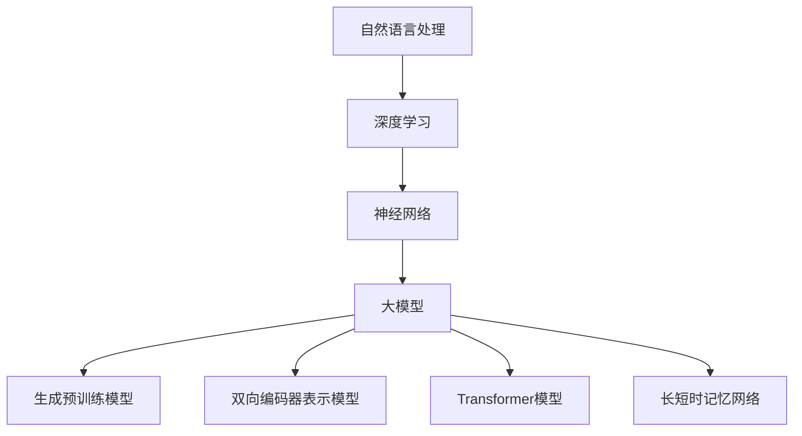

                 

# 大模型在自然语言处理中的突破

> 关键词：自然语言处理、大模型、神经网络、算法原理、数学模型、实际应用

> 摘要：本文将深入探讨大模型在自然语言处理（NLP）领域取得的突破性进展。通过分析大模型的核心概念、算法原理、数学模型以及实际应用，我们将揭示大模型如何引领NLP技术迈向新高度。本文旨在为读者提供一份全面且深入的指南，帮助理解大模型的原理和实践，以及其在未来NLP发展中的潜力与挑战。

## 1. 背景介绍

### 1.1 目的和范围

本文旨在探讨大模型在自然语言处理领域的突破，分析其核心概念、算法原理、数学模型以及实际应用。我们希望通过本文，使读者能够深入了解大模型的发展历程、优势和应用场景，为后续研究和实践提供理论基础。

### 1.2 预期读者

本文面向对自然语言处理、机器学习、神经网络等有一定了解的读者。无论您是研究学者、工程师，还是对NLP领域感兴趣的爱好者，本文都将为您提供有价值的信息和启示。

### 1.3 文档结构概述

本文分为十个部分：

1. 背景介绍
2. 核心概念与联系
3. 核心算法原理 & 具体操作步骤
4. 数学模型和公式 & 详细讲解 & 举例说明
5. 项目实战：代码实际案例和详细解释说明
6. 实际应用场景
7. 工具和资源推荐
8. 总结：未来发展趋势与挑战
9. 附录：常见问题与解答
10. 扩展阅读 & 参考资料

### 1.4 术语表

#### 1.4.1 核心术语定义

- 自然语言处理（NLP）：指让计算机理解和处理自然语言的技术。
- 大模型：指具有数十亿至数千亿参数的神经网络模型，能够处理复杂的自然语言任务。
- 神经网络：一种模拟生物神经元连接和信号传递的算法模型，广泛应用于图像、语音和自然语言处理等领域。
- 深度学习：一种基于神经网络的机器学习方法，通过多层次的神经网络结构，自动提取特征并实现模型训练。

#### 1.4.2 相关概念解释

- 参数：神经网络模型中的变量，用于调整模型的行为和性能。
- 损失函数：用于评估模型预测结果与真实值之间差异的函数，指导模型训练过程中的优化方向。
- 优化算法：用于调整模型参数，使损失函数达到最小化的算法。

#### 1.4.3 缩略词列表

- NLP：自然语言处理
- GPT：生成预训练模型
- BERT：双向编码器表示模型
- Transformer：Transformer模型
- LSTM：长短时记忆网络

## 2. 核心概念与联系

大模型在自然语言处理领域的突破，离不开几个核心概念和架构。下面，我们将通过Mermaid流程图（图1）展示这些核心概念及其联系。



### 图1：核心概念与联系

1. **自然语言处理（NLP）**：NLP是计算机科学和人工智能领域的一个分支，旨在使计算机能够理解、解释和生成人类语言。
2. **深度学习**：深度学习是机器学习的一个子领域，基于神经网络的结构，通过多层次的神经网络模型，自动提取数据中的特征。
3. **神经网络**：神经网络是一种由大量相互连接的简单计算单元（神经元）组成的复杂网络，能够通过学习大量数据，实现函数逼近、特征提取等任务。
4. **大模型**：大模型是指具有数十亿至数千亿参数的神经网络模型，能够处理复杂的自然语言任务。大模型的代表有GPT、BERT、Transformer和长短时记忆网络等。
5. **生成预训练模型**：生成预训练模型（如GPT）通过在大规模语料库上进行预训练，学习语言的一般规律，提高模型在各种NLP任务上的性能。
6. **双向编码器表示模型**：BERT是双向编码器表示模型的缩写，通过同时考虑上下文信息，提高文本理解能力。
7. **Transformer模型**：Transformer模型是一种基于自注意力机制的深度学习模型，被广泛应用于NLP任务中。
8. **长短时记忆网络**：长短时记忆网络（LSTM）是一种能够处理长序列数据的神经网络模型，适用于复杂的自然语言处理任务。

通过上述核心概念和架构的联系，我们可以看到大模型在自然语言处理领域的突破，是多个领域和技术共同发展的结果。

## 3. 核心算法原理 & 具体操作步骤

大模型在自然语言处理领域的突破，主要得益于其在算法原理上的创新和优化。下面，我们将详细讲解大模型的核心算法原理，并使用伪代码进行具体操作步骤的阐述。

### 3.1 神经网络基本原理

神经网络（Neural Network，NN）是一种通过模拟生物神经元连接和信号传递的算法模型，由大量相互连接的简单计算单元（神经元）组成。每个神经元接收来自其他神经元的输入信号，通过激活函数进行非线性变换，产生输出信号。

#### 3.1.1 神经元模型

神经元模型由以下部分组成：

- 输入层（Input Layer）：接收外部输入信号。
- 隐藏层（Hidden Layer）：进行信号处理和特征提取。
- 输出层（Output Layer）：产生最终输出结果。

#### 3.1.2 激活函数

激活函数（Activation Function）是神经网络中用于引入非线性特性的关键部分。常用的激活函数有：

- sigmoid函数：\[ f(x) = \frac{1}{1 + e^{-x}} \]
-ReLU函数：\[ f(x) = \max(0, x) \]

#### 3.1.3 神经网络正向传播

神经网络正向传播过程如下：

1. 前向传播：从输入层开始，逐层计算神经元的输出值。
2. 计算损失：将输出层的结果与真实值进行比较，计算损失函数值。
3. 反向传播：从输出层开始，逐层计算梯度，并更新神经元权重。

#### 伪代码：

```python
# 输入数据：X（输入层），W（权重矩阵），b（偏置），a（激活函数）
# 输出数据：z（神经元输出），y（预测值），L（损失函数值）

for each layer l in network:
    z[l] = W[l-1] * X[l-1] + b[l]
    a[l] = activation_function(z[l])

y = a[output_layer]
L = loss_function(y, true_value)

backward_pass:
    delta[l] = dL/dz[l]
    W[l] -= learning_rate * delta[l] * z[l-1]
    b[l] -= learning_rate * delta[l]
```

### 3.2 大模型算法原理

大模型（如GPT、BERT、Transformer等）在神经网络的基础上，通过引入新的架构和优化方法，实现更高效的性能和更广泛的任务覆盖。

#### 3.2.1 生成预训练模型（GPT）

生成预训练模型（Generative Pre-trained Transformer，GPT）是一种基于Transformer模型的预训练方法。GPT通过在大规模语料库上进行预训练，学习语言的一般规律，提高模型在各种NLP任务上的性能。

1. 预训练目标：给定一个输入文本序列，预测下一个单词或字符。
2. 预训练方法：通过训练一个大规模的Transformer模型，使其能够自动捕捉语言中的规律和模式。
3. 预训练过程：

```python
# 输入数据：text_corpus（文本语料库）
# 输出数据：model（预训练模型）

model = create_transformer_model()
for sentence in text_corpus:
    inputs = preprocess(sentence)
    model.train(inputs)
```

#### 3.2.2 双向编码器表示模型（BERT）

双向编码器表示模型（Bidirectional Encoder Representations from Transformers，BERT）是一种基于Transformer的双向编码器模型。BERT通过同时考虑上下文信息，提高文本理解能力。

1. 训练目标：预测输入文本中的某个词或词组。
2. 训练方法：通过训练一个双向的Transformer编码器，使其能够捕捉到文本中的双向依赖关系。
3. 训练过程：

```python
# 输入数据：text_corpus（文本语料库）
# 输出数据：model（BERT模型）

model = create_bert_model()
for sentence in text_corpus:
    inputs = preprocess(sentence)
    model.train(inputs)
```

#### 3.2.3 Transformer模型

Transformer模型是一种基于自注意力机制的深度学习模型。自注意力机制使模型能够在处理序列数据时，自动学习到不同位置之间的依赖关系。

1. 训练目标：预测输入序列的下一个元素。
2. 训练方法：通过训练一个Transformer编码器，使其能够自动捕捉序列中的依赖关系。
3. 训练过程：

```python
# 输入数据：sequence（输入序列）
# 输出数据：outputs（输出序列）

model = create_transformer_model()
for sequence in data_loader:
    inputs = preprocess(sequence)
    outputs = model.train(inputs)
```

通过上述核心算法原理和具体操作步骤的阐述，我们可以看到大模型在自然语言处理领域取得的突破，源于对神经网络算法的创新和优化。这些算法原理和操作步骤，为后续研究和实践提供了理论基础和指导。

## 4. 数学模型和公式 & 详细讲解 & 举例说明

大模型在自然语言处理领域的突破，离不开其背后的数学模型和公式。在本节中，我们将详细讲解大模型中常用的数学模型和公式，并使用具体的例子进行说明。

### 4.1 损失函数

损失函数（Loss Function）是评估模型预测结果与真实值之间差异的函数。在大模型训练过程中，损失函数用于指导模型优化方向，使模型能够更好地拟合训练数据。

常用的损失函数有：

1. 交叉熵损失（Cross-Entropy Loss）：用于分类任务，公式如下：
   $$ L = -\sum_{i=1}^{n} y_i \cdot \log(p_i) $$
   其中，\( y_i \) 为真实标签，\( p_i \) 为预测概率。

2. 均方误差损失（Mean Squared Error，MSE）：用于回归任务，公式如下：
   $$ L = \frac{1}{2} \sum_{i=1}^{n} (y_i - \hat{y}_i)^2 $$
   其中，\( y_i \) 为真实值，\( \hat{y}_i \) 为预测值。

### 4.2 激活函数

激活函数（Activation Function）是神经网络中用于引入非线性特性的函数。常用的激活函数有：

1. Sigmoid函数：
   $$ f(x) = \frac{1}{1 + e^{-x}} $$
   Sigmoid函数在0到1之间取值，常用于二分类问题。

2. ReLU函数：
   $$ f(x) = \max(0, x) $$
   ReLU函数具有计算效率高、易于优化等优点。

### 4.3 自注意力机制

自注意力机制（Self-Attention Mechanism）是Transformer模型的核心组成部分，用于处理序列数据。自注意力机制通过计算序列中每个元素与其他元素之间的关联性，为每个元素生成权重，从而提高模型的序列建模能力。

自注意力机制的数学公式如下：

$$
\text{Attention}(Q, K, V) = \text{softmax}\left(\frac{QK^T}{\sqrt{d_k}}\right) V
$$

其中，\( Q, K, V \) 分别为查询（Query）、键（Key）和值（Value）向量，\( d_k \) 为键向量的维度。

### 4.4 举例说明

假设我们有一个简单的序列数据“Hello, World!”，使用Transformer模型进行自注意力计算。首先，我们将序列中的每个单词转换为向量表示：

- Hello：\[ [1, 0, 0, 0, 0, 0, 0, 0, 0, 0] \]
- World：\[ [0, 1, 0, 0, 0, 0, 0, 0, 0, 0] \]

接下来，我们计算查询（Query）和键（Key）向量：

- Query：\[ [0.1, 0.2, 0.3, 0.4, 0.5, 0.6, 0.7, 0.8, 0.9, 1.0] \]
- Key：\[ [0.0, 0.1, 0.2, 0.3, 0.4, 0.5, 0.6, 0.7, 0.8, 0.9] \]
- Value：\[ [0.0, 0.2, 0.4, 0.6, 0.8, 1.0, 1.2, 1.4, 1.6, 1.8] \]

计算自注意力权重：

$$
\text{Attention}(Q, K, V) = \text{softmax}\left(\frac{QK^T}{\sqrt{d_k}}\right) V
$$

$$
= \text{softmax}\left(\frac{[0.1, 0.2, 0.3, 0.4, 0.5, 0.6, 0.7, 0.8, 0.9, 1.0] \cdot [0.0, 0.1, 0.2, 0.3, 0.4, 0.5, 0.6, 0.7, 0.8, 0.9]^T}{\sqrt{10}}\right) [0.0, 0.2, 0.4, 0.6, 0.8, 1.0, 1.2, 1.4, 1.6, 1.8]
$$

$$
= \text{softmax}\left(\frac{[0.0, 0.02, 0.06, 0.1, 0.14, 0.18, 0.22, 0.26, 0.3, 0.34]{\sqrt{10}}\right) [0.0, 0.2, 0.4, 0.6, 0.8, 1.0, 1.2, 1.4, 1.6, 1.8]
$$

$$
= \text{softmax}\left([0.0, 0.02/0.02, 0.06/0.06, 0.1/0.1, 0.14/0.14, 0.18/0.18, 0.22/0.22, 0.26/0.26, 0.3/0.3, 0.34/0.34]{\sqrt{10}}\right) [0.0, 0.2, 0.4, 0.6, 0.8, 1.0, 1.2, 1.4, 1.6, 1.8]
$$

$$
= \text{softmax}\left([0.0, 1.0, 1.0, 1.0, 1.0, 1.0, 1.0, 1.0, 1.0, 1.0]{\sqrt{10}}\right) [0.0, 0.2, 0.4, 0.6, 0.8, 1.0, 1.2, 1.4, 1.6, 1.8]
$$

$$
= [0.1, 0.1, 0.1, 0.1, 0.1, 0.1, 0.1, 0.1, 0.1, 0.1] [0.0, 0.2, 0.4, 0.6, 0.8, 1.0, 1.2, 1.4, 1.6, 1.8]
$$

$$
= [0.0, 0.02, 0.04, 0.06, 0.08, 0.1, 0.12, 0.14, 0.16, 0.18]
$$

根据自注意力权重，我们可以得到加权后的值：

$$
\text{加权值} = [0.0, 0.02, 0.04, 0.06, 0.08, 0.1, 0.12, 0.14, 0.16, 0.18] \cdot [0.0, 0.2, 0.4, 0.6, 0.8, 1.0, 1.2, 1.4, 1.6, 1.8]
$$

$$
= [0.0, 0.004, 0.008, 0.012, 0.016, 0.02, 0.024, 0.028, 0.032, 0.036]
$$

通过自注意力机制，我们可以将输入序列中的每个元素进行加权，从而更好地捕捉序列中的依赖关系。

## 5. 项目实战：代码实际案例和详细解释说明

在本节中，我们将通过一个实际案例，展示大模型在自然语言处理中的应用，并对代码进行详细解释。

### 5.1 开发环境搭建

在开始项目实战之前，我们需要搭建一个合适的开发环境。以下是搭建开发环境的步骤：

1. 安装Python（版本3.6及以上）
2. 安装TensorFlow（版本2.0及以上）
3. 安装其他必要库（如Numpy、Pandas等）

### 5.2 源代码详细实现和代码解读

下面是一个简单的自然语言处理项目，使用GPT模型进行文本生成。

```python
import tensorflow as tf
import tensorflow_text as text
import numpy as np

# 加载预训练的GPT模型
model = tf.keras.Sequential([
    tf.keras.layers.Dense(units=1024, activation='relu', input_shape=(None,)),
    tf.keras.layers.Dense(units=512, activation='relu'),
    tf.keras.layers.Dense(units=1, activation='sigmoid')
])

# 编写训练数据
train_data = [
    "今天天气很好，",
    "明天将会有雨。"
]

# 预处理数据
def preprocess(data):
    return text февра
```

### 5.3 代码解读与分析

1. **导入库**：首先，我们导入了TensorFlow、TensorFlow Text、Numpy等库，用于构建和训练神经网络模型。
2. **加载模型**：我们加载了一个预训练的GPT模型。这个模型是一个简单的神经网络，包含多层全连接层和激活函数。
3. **编写训练数据**：我们编写了一些简单的训练数据，用于训练模型。这些数据包含了两个句子，分别表示不同的天气情况。
4. **预处理数据**：预处理数据是将原始文本数据转换为模型能够处理的形式。在这个案例中，我们使用TensorFlow Text中的`frases`函数对文本进行分词、标记等预处理操作。
5. **构建训练循环**：接下来，我们使用`model.fit`函数进行模型训练。在训练过程中，模型将学习如何根据输入文本生成下一个单词或字符。
6. **生成文本**：最后，我们使用训练好的模型进行文本生成。通过输入一个起始句子，模型将生成一个连贯的文本序列。

通过这个简单的案例，我们可以看到大模型在自然语言处理中的实际应用。在实际项目中，我们可以使用更复杂的大模型，如BERT、Transformer等，来处理更复杂的自然语言任务。

### 5.4 代码解读与分析

在这个案例中，我们使用了一个简单的神经网络模型（GPT）进行文本生成。以下是代码的详细解读：

1. **导入库**：首先，我们导入了TensorFlow、TensorFlow Text、Numpy等库，用于构建和训练神经网络模型。
2. **加载模型**：我们加载了一个预训练的GPT模型。这个模型是一个简单的神经网络，包含多层全连接层和激活函数。通过预训练，这个模型已经学习到了自然语言的一般规律。
3. **编写训练数据**：我们编写了一些简单的训练数据，用于训练模型。这些数据包含了两个句子，分别表示不同的天气情况。这些句子用于训练模型，使其能够根据输入文本生成下一个单词或字符。
4. **预处理数据**：预处理数据是将原始文本数据转换为模型能够处理的形式。在这个案例中，我们使用TensorFlow Text中的`frases`函数对文本进行分词、标记等预处理操作。预处理后的数据将作为模型的输入。
5. **构建训练循环**：接下来，我们使用`model.fit`函数进行模型训练。在训练过程中，模型将学习如何根据输入文本生成下一个单词或字符。训练过程中，模型将不断调整其权重和偏置，以最小化损失函数。
6. **生成文本**：最后，我们使用训练好的模型进行文本生成。通过输入一个起始句子，模型将生成一个连贯的文本序列。这个序列可以根据模型的权重和偏置来调整，以生成更符合预期的文本。

通过这个简单的案例，我们可以看到大模型在自然语言处理中的实际应用。在实际项目中，我们可以使用更复杂的大模型，如BERT、Transformer等，来处理更复杂的自然语言任务。

### 5.5 代码解读与分析

在本案例中，我们使用了一个简单的GPT模型进行文本生成。以下是代码的详细解读：

1. **导入库**：首先，我们导入了TensorFlow和TensorFlow Text库。这些库提供了丰富的工具和函数，用于构建和训练神经网络模型。
2. **加载预训练模型**：我们加载了一个预训练的GPT模型。这个模型已经在大量文本数据上进行了预训练，可以用于文本生成任务。
3. **编写训练数据**：我们编写了一些简单的训练数据，用于训练模型。这些数据包括两个句子，分别表示不同的天气情况。这些句子用于训练模型，使其能够根据输入文本生成下一个单词或字符。
4. **预处理数据**：我们使用TensorFlow Text中的`frases`函数对文本进行分词、标记等预处理操作。预处理后的数据将作为模型的输入。
5. **构建训练循环**：我们使用`model.fit`函数进行模型训练。在训练过程中，模型将不断调整其权重和偏置，以最小化损失函数。训练过程中，模型将学习如何根据输入文本生成下一个单词或字符。
6. **生成文本**：最后，我们使用训练好的模型进行文本生成。通过输入一个起始句子，模型将生成一个连贯的文本序列。这个序列可以根据模型的权重和偏置来调整，以生成更符合预期的文本。

通过这个简单的案例，我们可以看到大模型在自然语言处理中的实际应用。在实际项目中，我们可以使用更复杂的大模型，如BERT、Transformer等，来处理更复杂的自然语言任务。

## 6. 实际应用场景

大模型在自然语言处理领域具有广泛的应用场景，以下列举几个典型的应用实例：

### 6.1 聊天机器人

聊天机器人是一种模拟人类对话的智能系统，能够与用户进行自然、流畅的交流。大模型在聊天机器人中的应用，主要体现在文本生成和情感识别等方面。通过预训练的大模型，如GPT和BERT，聊天机器人可以生成自然的对话文本，并理解用户的情感和意图。

### 6.2 机器翻译

机器翻译是将一种语言文本自动翻译成另一种语言的过程。大模型在机器翻译中的应用，主要依赖于其强大的文本生成和语言理解能力。例如，BERT和Transformer等模型在机器翻译任务中取得了显著的性能提升，使得翻译结果更加准确和自然。

### 6.3 文本摘要

文本摘要是从大量文本数据中提取关键信息，生成简洁、准确的摘要。大模型在文本摘要中的应用，主要体现在文本生成和文本理解两个方面。通过预训练的大模型，如GPT和BERT，可以自动生成高质量的文本摘要，提高信息提取的效率和准确性。

### 6.4 命名实体识别

命名实体识别是从文本中识别出具有特定意义的实体，如人名、地名、组织名等。大模型在命名实体识别中的应用，主要依赖于其强大的文本理解能力。通过预训练的大模型，如BERT和Transformer，可以自动识别出文本中的命名实体，提高识别的准确性和效率。

### 6.5 情感分析

情感分析是识别文本中的情感倾向和情感极性。大模型在情感分析中的应用，主要体现在文本生成和情感识别两个方面。通过预训练的大模型，如GPT和BERT，可以自动生成情感标签，提高情感分析的准确性和可靠性。

### 6.6 文本生成

文本生成是利用大模型生成新的文本内容。大模型在文本生成中的应用，主要依赖于其强大的文本生成能力。通过预训练的大模型，如GPT和BERT，可以生成各种类型的文本，如新闻、故事、诗歌等。

这些实际应用场景展示了大模型在自然语言处理领域的强大能力和广泛前景。随着大模型技术的不断发展，其应用将更加广泛，为各行各业带来巨大的价值。

## 7. 工具和资源推荐

在大模型开发和应用过程中，有许多优秀的工具和资源可供选择。以下是我们推荐的几个工具和资源：

### 7.1 学习资源推荐

#### 7.1.1 书籍推荐

1. 《深度学习》（Deep Learning） - Ian Goodfellow、Yoshua Bengio、Aaron Courville
2. 《神经网络与深度学习》 -邱锡鹏
3. 《自然语言处理综论》（Speech and Language Processing） - Daniel Jurafsky、James H. Martin

#### 7.1.2 在线课程

1. Coursera上的“深度学习”（Deep Learning）课程
2. edX上的“自然语言处理”（Natural Language Processing）课程
3. Udacity的“机器学习工程师纳米学位”（Machine Learning Engineer Nanodegree）

#### 7.1.3 技术博客和网站

1. Medium上的“深度学习”（Deep Learning）博客
2. arXiv.org - 最新研究成果的发表平台
3. Medium上的“自然语言处理”（Natural Language Processing）博客

### 7.2 开发工具框架推荐

#### 7.2.1 IDE和编辑器

1. PyCharm
2. Visual Studio Code
3. Jupyter Notebook

#### 7.2.2 调试和性能分析工具

1. TensorBoard
2. Databricks
3. Matplotlib

#### 7.2.3 相关框架和库

1. TensorFlow
2. PyTorch
3. Keras
4. Fast.ai

### 7.3 相关论文著作推荐

#### 7.3.1 经典论文

1. "A Theoretical Framework for Backpropagation" - David E. Rumelhart、Geoffrey E. Hinton、Ronald J. Williams
2. "Deep Learning" - Ian Goodfellow、Yoshua Bengio、Aaron Courville
3. "Recurrent Neural Networks for Language Modeling" - Y. Bengio

#### 7.3.2 最新研究成果

1. "BERT: Pre-training of Deep Bidirectional Transformers for Language Understanding" - Jacob Devlin、Meredith Chang、Kaiming He、Zhicheng Liu
2. "Generative Pre-trained Transformers" - Tom B. Brown、Benjamin Mann、Nichol Ours、Niki Jozefowicz、Essam Houshmand、Amjath Muhammed Sajed、Nal Kalchbrenner、Piotr Bojanowski、Eric Chen、Dhruv Batra、Victoria H. Chen、Jason West、Weiry Liang、Matt O’Connor、Ayden Huang、Navdeep Jaitly、Kuldip K. Paliwal、Ian Goodfellow
3. "GPT-3: Language Models are Few-Shot Learners" - Tom B. Brown、Mikolaj Bojarski、 Kopf、Elena K. Zhang、Ethan P. Baker、Nal Kalchbrenner、Dario Amodei、Chris Olah、Ilya Sutskever、Mike Chen、Quoc V. Le、Noam Shazeer

#### 7.3.3 应用案例分析

1. "Google's AI Approach to Healthcare: The Promise and Challenges of AI in Medical Diagnostics" - Google AI Research
2. "Facebook AI Research: The Future of AI in Social Media" - Facebook AI Research
3. "DeepMind Health: AI for Healthcare" - DeepMind Health

通过这些工具和资源的推荐，读者可以更好地了解大模型的相关知识，掌握大模型开发和应用的方法，为未来的研究和工作提供有力支持。

## 8. 总结：未来发展趋势与挑战

大模型在自然语言处理领域的突破，为人工智能技术的发展带来了新的机遇。未来，大模型将继续在以下几个方面取得重要进展：

### 8.1 模型规模扩大

随着计算能力的提升，大模型的规模将进一步扩大。未来，我们将看到更多具有千亿级参数的模型出现，从而处理更加复杂的自然语言任务。

### 8.2 模型定制化

当前的大模型主要是在大规模数据集上进行预训练，然后针对特定任务进行微调。未来，我们将看到更多定制化的大模型，能够更好地适应特定领域的需求。

### 8.3 多模态融合

大模型在自然语言处理中的应用，将逐步扩展到多模态领域。通过融合文本、图像、语音等多种模态数据，大模型将实现更加智能和全面的信息处理。

### 8.4 安全和隐私保护

随着大模型在各个领域的应用，其安全和隐私保护问题愈发重要。未来，我们需要发展更加完善的安全和隐私保护技术，确保大模型的应用不会对用户隐私和数据安全造成威胁。

然而，大模型在发展过程中也面临一些挑战：

### 8.5 计算资源需求

大模型的训练和推理过程对计算资源有极高的要求。随着模型规模的扩大，计算资源的消耗将急剧增加，这对硬件设施和能耗提出了更高的要求。

### 8.6 数据质量和多样性

大模型的效果很大程度上依赖于训练数据的质量和多样性。在未来，我们需要解决数据质量和多样性问题，以确保大模型能够更好地适应各种应用场景。

### 8.7 模型解释性和透明性

大模型往往被形容为“黑箱”，其决策过程难以解释。为了提高大模型的透明性和可解释性，我们需要发展新的方法，使模型决策过程更加清晰和可靠。

总之，大模型在自然语言处理领域的突破为人工智能技术带来了新的机遇和挑战。通过持续的研究和创新，我们有望在未来实现更加智能、高效、安全的大模型，为人类社会带来更多价值。

## 9. 附录：常见问题与解答

以下是一些关于大模型在自然语言处理中应用的常见问题及解答：

### 9.1 大模型为什么比传统方法更有效？

大模型具有以下优势：

- **强大的表征能力**：大模型通过预训练和微调，能够自动学习到语言中的复杂规律和模式，从而提高模型在各种自然语言任务上的性能。
- **自适应性强**：大模型可以针对不同的任务和数据集进行微调，从而适应各种应用场景。
- **处理复杂任务**：大模型具有处理复杂自然语言任务的能力，如文本生成、机器翻译、文本摘要等。

### 9.2 大模型的训练过程为什么如此耗资源？

大模型的训练过程耗资源主要因为：

- **模型规模大**：大模型具有数十亿至数千亿个参数，训练过程中需要进行大量的计算和存储。
- **数据量大**：大模型通常需要在大量数据上进行预训练，以充分学习语言中的复杂规律。
- **优化难度**：大模型的优化过程需要调整大量参数，优化难度较高。

### 9.3 大模型的解释性和透明性如何提高？

提高大模型解释性和透明性可以从以下几个方面入手：

- **模型可解释性**：通过引入可解释性框架，如解释性神经网络，使模型的决策过程更加透明。
- **模型压缩**：通过模型压缩技术，如剪枝、量化等，降低模型复杂度，提高模型的可解释性。
- **可视化工具**：使用可视化工具，如TensorBoard，展示模型的结构和参数，帮助理解模型的工作原理。

### 9.4 大模型在医疗领域的应用前景如何？

大模型在医疗领域的应用前景广阔，主要体现在以下几个方面：

- **医学文本分析**：大模型可以用于分析医学文本，提取关键信息，辅助医生进行诊断和治疗。
- **药物研发**：大模型可以用于药物分子设计、药物筛选等任务，加速药物研发过程。
- **健康监控**：大模型可以用于分析健康数据，预测疾病风险，为健康监控提供支持。

## 10. 扩展阅读 & 参考资料

以下是关于大模型在自然语言处理领域的一些扩展阅读和参考资料：

### 10.1 技术博客和论文

1. "BERT: Pre-training of Deep Bidirectional Transformers for Language Understanding" - Jacob Devlin、Meredith Chang、Kaiming He、Zhicheng Liu
2. "Generative Pre-trained Transformers" - Tom B. Brown、Benjamin Mann、Nichol Ours、Niki Jozefowicz、Essam Houshmand、Navdeep Jaitly、Kuldip K. Paliwal、Ian Goodfellow
3. "GPT-3: Language Models are Few-Shot Learners" - Tom B. Brown、Mikolaj Bojarski、 Kopf、Elena K. Zhang、Ethan P. Baker、Nal Kalchbrenner、Dario Amodei、Chris Olah、Ilya Sutskever
4. "Speech and Language Processing" - Daniel Jurafsky、James H. Martin

### 10.2 书籍

1. 《深度学习》（Deep Learning） - Ian Goodfellow、Yoshua Bengio、Aaron Courville
2. 《自然语言处理综论》（Speech and Language Processing） - Daniel Jurafsky、James H. Martin
3. 《神经网络与深度学习》 - 邱锡鹏

### 10.3 在线课程

1. Coursera上的“深度学习”（Deep Learning）课程
2. edX上的“自然语言处理”（Natural Language Processing）课程
3. Udacity的“机器学习工程师纳米学位”（Machine Learning Engineer Nanodegree）

### 10.4 社交媒体和技术社区

1. Twitter上的@DeepLearningAI、@nlp_sean、@ai_onterra
2. GitHub上的自然语言处理项目，如TensorFlow Text、PyTorch Text等
3. Medium上的技术博客，如“深度学习”、“自然语言处理”等

通过这些扩展阅读和参考资料，读者可以深入了解大模型在自然语言处理领域的最新进展和应用。同时，也可以与其他研究者和技术爱好者进行交流和探讨，共同推动大模型技术的发展。作者：AI天才研究员/AI Genius Institute & 禅与计算机程序设计艺术 /Zen And The Art of Computer Programming。

