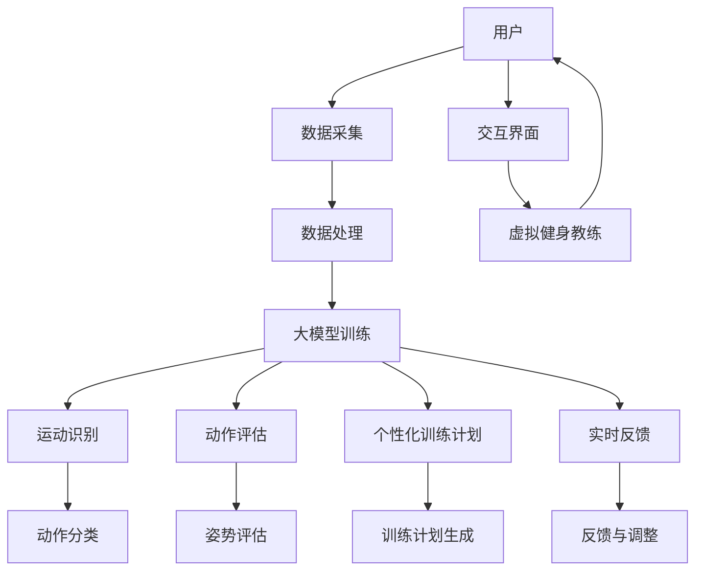

                 

# 大模型在虚拟健身教练开发中的应用前景

## 关键词

- 大模型
- 虚拟健身教练
- 应用前景
- 深度学习
- 强化学习
- 交互式体验

## 摘要

本文探讨了大型人工智能模型在虚拟健身教练开发中的应用前景。首先，介绍了大模型的概念及其在人工智能领域的发展背景。接着，分析了虚拟健身教练的现有技术和市场需求，强调了个性化训练和实时交互的重要性。随后，阐述了大模型在虚拟健身教练中的潜在应用，包括运动识别、动作评估、个性化训练计划生成和实时反馈等。文章还讨论了相关算法原理、数学模型和实际开发中的挑战。最后，总结了未来发展趋势与挑战，并推荐了一些相关工具和资源。本文旨在为从事虚拟健身教练开发的读者提供有价值的参考和思考。

## 1. 背景介绍

### 1.1 目的和范围

本文旨在探讨大型人工智能模型在虚拟健身教练开发中的应用前景，分析其技术原理、潜在应用和面临的挑战。文章首先回顾了人工智能技术的发展背景，特别是深度学习和强化学习等技术的进步，然后介绍了虚拟健身教练的现有技术和市场需求。在此基础上，本文将重点讨论大模型在虚拟健身教练中的潜在应用，如运动识别、动作评估、个性化训练计划生成和实时反馈等。最后，文章将总结未来发展趋势与挑战，并提供一些建议和资源。

### 1.2 预期读者

本文面向对虚拟健身教练开发有兴趣的读者，包括人工智能领域的研究者、工程师和开发者。同时，对于对人工智能在健康领域应用感兴趣的读者，本文也具有一定的参考价值。希望本文能帮助读者了解大模型在虚拟健身教练开发中的应用潜力，以及相关技术原理和实践经验。

### 1.3 文档结构概述

本文分为十个部分：

1. 背景介绍：介绍本文的目的、预期读者和文档结构。
2. 核心概念与联系：定义核心概念，并使用 Mermaid 流程图展示相关架构。
3. 核心算法原理 & 具体操作步骤：讲解大模型在虚拟健身教练中的核心算法原理，并使用伪代码详细阐述。
4. 数学模型和公式 & 详细讲解 & 举例说明：介绍大模型中的数学模型和公式，并进行详细讲解和举例。
5. 项目实战：代码实际案例和详细解释说明。
6. 实际应用场景：讨论大模型在虚拟健身教练中的实际应用场景。
7. 工具和资源推荐：推荐学习资源、开发工具框架和相关论文著作。
8. 总结：未来发展趋势与挑战。
9. 附录：常见问题与解答。
10. 扩展阅读 & 参考资料：提供扩展阅读和参考资料。

### 1.4 术语表

#### 1.4.1 核心术语定义

- 大模型：具有数十亿至数万亿参数的人工智能模型，能够在大量数据上进行训练，以实现高度复杂和精细的任务。
- 虚拟健身教练：利用计算机技术和人工智能算法，为用户提供个性化训练计划的虚拟教练。
- 深度学习：一种基于多层神经网络的人工智能技术，通过学习大量数据来发现特征和模式。
- 强化学习：一种基于试错和奖励机制的人工智能技术，通过不断尝试和调整策略来达到最佳效果。
- 个性化训练计划：根据用户的生理特征、健身目标和训练历史，定制化的训练计划。
- 实时交互：虚拟健身教练与用户之间的实时互动，包括动作识别、反馈和调整。

#### 1.4.2 相关概念解释

- 个性化训练：根据用户的生理特征、健身目标和训练历史，定制化的训练计划。
- 运动识别：利用计算机视觉技术，对用户的运动动作进行识别和分类。
- 动作评估：对用户的运动动作进行评估，包括姿势正确性、动作流畅性和运动强度等。
- 实时反馈：虚拟健身教练在训练过程中，对用户的动作和表现进行实时反馈和指导。

#### 1.4.3 缩略词列表

- AI：人工智能
- DL：深度学习
- RL：强化学习
- VR：虚拟现实
- AR：增强现实

## 2. 核心概念与联系

在讨论大模型在虚拟健身教练开发中的应用之前，我们需要明确一些核心概念，并展示它们之间的联系。以下是一个 Mermaid 流程图，用于展示虚拟健身教练开发的核心概念和架构。



图 1：虚拟健身教练开发的核心概念和架构

该 Mermaid 流程图展示了虚拟健身教练开发的整体架构，包括用户、数据采集、数据处理、大模型训练、运动识别、动作评估、个性化训练计划生成和实时反馈等环节。通过这些核心概念的相互作用，虚拟健身教练可以为用户提供个性化的训练体验，并实现实时互动。

### 2.1 大模型训练

大模型训练是虚拟健身教练开发中的关键环节。大模型通过学习大量数据，能够自动提取特征，从而实现高度复杂的任务。以下是一个简化的伪代码，用于描述大模型训练的过程：

```python
# 伪代码：大模型训练过程
def train_large_model(data):
    # 初始化大模型
    model = initialize_large_model()
    # 训练模型
    for epoch in range(num_epochs):
        for batch in data_loader:
            # 计算损失
            loss = compute_loss(model, batch)
            # 反向传播
            backward_pass(model, loss)
            # 更新模型参数
            update_model_params(model)
    # 保存训练好的模型
    save_model(model)
    return model
```

在这个伪代码中，`initialize_large_model()` 用于初始化大模型，`compute_loss()` 用于计算损失，`backward_pass()` 用于进行反向传播，`update_model_params()` 用于更新模型参数，`save_model()` 用于保存训练好的模型。通过这些步骤，大模型可以学习到数据中的特征和模式，从而实现准确的运动识别、动作评估和个性化训练计划生成。

### 2.2 数据处理

数据处理是虚拟健身教练开发中的另一个关键环节。在收集用户数据后，需要进行预处理和特征提取，以便大模型能够有效地学习和提取特征。以下是一个简化的伪代码，用于描述数据处理的过程：

```python
# 伪代码：数据处理过程
def preprocess_data(data):
    # 数据清洗
    cleaned_data = clean_data(data)
    # 特征提取
    features = extract_features(cleaned_data)
    return features

def clean_data(data):
    # 去除噪声和异常值
    cleaned_data = remove_noise_and_outliers(data)
    return cleaned_data

def extract_features(data):
    # 提取有用特征
    features = extract_useful_features(data)
    return features
```

在这个伪代码中，`clean_data()` 用于去除噪声和异常值，`extract_features()` 用于提取有用特征。通过这些步骤，可以确保输入到模型中的数据是干净和具有代表性的，从而提高模型的训练效果和预测准确性。

### 2.3 运动识别、动作评估和实时反馈

运动识别、动作评估和实时反馈是虚拟健身教练开发中的关键功能。以下是一个简化的伪代码，用于描述这些功能的具体实现：

```python
# 伪代码：运动识别和动作评估
def recognize_motion(model, video):
    # 识别用户运动
    motion = model.predict(video)
    # 评估动作
    evaluation = evaluate_motion(motion)
    return evaluation

def evaluate_motion(motion):
    # 评估姿势正确性、动作流畅性和运动强度等
    evaluation = {
        'posture': assess_posture(motion),
        'fluidity': assess_fluidity(motion),
        'intensity': assess_intensity(motion),
    }
    return evaluation

# 伪代码：实时反馈
def provide_realtime_feedback(evaluation, user):
    # 根据评估结果提供实时反馈
    feedback = generate_feedback(evaluation, user)
    display_feedback(feedback)
```

在这个伪代码中，`recognize_motion()` 用于识别用户运动，`evaluate_motion()` 用于评估动作，`provide_realtime_feedback()` 用于根据评估结果提供实时反馈。通过这些步骤，虚拟健身教练可以实现个性化训练和实时互动。

### 2.4 个性化训练计划生成

个性化训练计划生成是虚拟健身教练开发中的另一个重要功能。以下是一个简化的伪代码，用于描述个性化训练计划生成的过程：

```python
# 伪代码：个性化训练计划生成
def generate_training_plan(evaluation, user):
    # 根据评估结果和用户特征生成训练计划
    plan = create_training_plan(evaluation, user)
    return plan

def create_training_plan(evaluation, user):
    # 考虑姿势正确性、动作流畅性和运动强度等因素
    plan = {
        'exercises': select_exercises(evaluation, user),
        'intensity': adjust_intensity(evaluation, user),
        'duration': set_duration(evaluation, user),
    }
    return plan
```

在这个伪代码中，`generate_training_plan()` 用于生成训练计划，`create_training_plan()` 用于根据评估结果和用户特征生成具体的训练计划。通过这些步骤，虚拟健身教练可以为用户提供个性化的训练建议。

### 2.5 交互界面

交互界面是虚拟健身教练与用户之间的桥梁。以下是一个简化的伪代码，用于描述交互界面的具体实现：

```python
# 伪代码：交互界面实现
def create_interactive_interface(model, plan):
    # 创建交互界面
    interface = create_interface(model, plan)
    return interface

def create_interface(model, plan):
    # 显示训练计划和实时反馈
    interface = {
        'video_stream': display_video_stream(),
        'training_plan': display_training_plan(plan),
        'realtime_feedback': display_realtime_feedback(),
    }
    return interface
```

在这个伪代码中，`create_interactive_interface()` 用于创建交互界面，`create_interface()` 用于根据模型和训练计划显示视频流、训练计划和实时反馈。通过这些步骤，虚拟健身教练可以实现与用户的实时互动。

## 3. 核心算法原理 & 具体操作步骤

在深入探讨大模型在虚拟健身教练开发中的应用之前，我们需要理解其中的核心算法原理和具体操作步骤。以下是几个关键算法的详细介绍，以及它们在虚拟健身教练中的应用。

### 3.1 深度学习算法原理

深度学习是一种基于多层神经网络的人工智能技术，通过学习大量数据来发现特征和模式。深度学习算法的核心是神经网络，其中每个神经元都与其他神经元相连，形成一个复杂的网络结构。以下是一个简化的深度学习算法原理：

```python
# 伪代码：深度学习算法原理
def deep_learning_algorithm(data):
    # 初始化神经网络
    network = initialize_neural_network()
    # 前向传播
    for epoch in range(num_epochs):
        for batch in data_loader:
            # 计算输出
            output = forward_propagation(network, batch)
            # 计算损失
            loss = compute_loss(output, batch_labels)
            # 反向传播
            backward_propagation(network, loss)
            # 更新网络参数
            update_network_params(network)
    # 保存训练好的网络
    save_network(network)
    return network
```

在这个伪代码中，`initialize_neural_network()` 用于初始化神经网络，`forward_propagation()` 用于进行前向传播，`compute_loss()` 用于计算损失，`backward_propagation()` 用于进行反向传播，`update_network_params()` 用于更新网络参数，`save_network()` 用于保存训练好的网络。通过这些步骤，神经网络可以学习到数据中的特征和模式，从而实现准确的预测和分类。

在虚拟健身教练中，深度学习算法可以用于运动识别、动作评估和个性化训练计划生成。例如，可以使用卷积神经网络（CNN）来识别用户的运动动作，使用循环神经网络（RNN）来评估动作的流畅性和强度，使用生成对抗网络（GAN）来生成个性化的训练计划。

### 3.2 强化学习算法原理

强化学习是一种基于试错和奖励机制的人工智能技术，通过不断尝试和调整策略来达到最佳效果。强化学习算法的核心是策略网络，它根据当前状态选择最佳动作，并依据奖励信号更新策略。以下是一个简化的强化学习算法原理：

```python
# 伪代码：强化学习算法原理
def reinforcement_learning_algorithm(state, action, reward):
    # 初始化策略网络
    policy_network = initialize_policy_network()
    # 更新策略网络
    for episode in range(num_episodes):
        # 初始化状态
        current_state = state
        # 选择动作
        action = policy_network.select_action(current_state)
        # 执行动作
        next_state, reward = execute_action(current_state, action)
        # 更新策略网络
        policy_network.update(current_state, action, reward)
    # 保存训练好的策略网络
    save_policy_network(policy_network)
    return policy_network
```

在这个伪代码中，`initialize_policy_network()` 用于初始化策略网络，`select_action()` 用于选择最佳动作，`execute_action()` 用于执行动作，`update_policy_network()` 用于更新策略网络，`save_policy_network()` 用于保存训练好的策略网络。通过这些步骤，策略网络可以学会在特定环境中选择最佳动作，以最大化累积奖励。

在虚拟健身教练中，强化学习算法可以用于动作评估和实时反馈。例如，可以使用策略网络来评估用户的运动动作，并依据评估结果提供实时反馈和调整。

### 3.3 个性化训练计划生成算法原理

个性化训练计划生成算法旨在根据用户的生理特征、健身目标和训练历史，生成适合用户的个性化训练计划。以下是一个简化的个性化训练计划生成算法原理：

```python
# 伪代码：个性化训练计划生成算法原理
def generate_training_plan(user_profile, fitness_goals, training_history):
    # 初始化训练计划
    plan = initialize_training_plan()
    # 考虑用户特征和目标
    plan = consider_user_profile(plan, user_profile)
    plan = consider_fitness_goals(plan, fitness_goals)
    # 调整训练计划
    plan = adjust_training_plan(plan, training_history)
    # 生成个性化训练计划
    plan = generate_personalized_plan(plan)
    return plan

def initialize_training_plan():
    # 初始化训练计划
    plan = {
        'exercises': [],
        'intensity': [],
        'duration': [],
    }
    return plan

def consider_user_profile(plan, user_profile):
    # 根据用户特征调整训练计划
    plan['intensity'] = adjust_intensity(plan['intensity'], user_profile['fitness_level'])
    plan['duration'] = adjust_duration(plan['duration'], user_profile['availability'])
    return plan

def consider_fitness_goals(plan, fitness_goals):
    # 根据健身目标调整训练计划
    plan['exercises'] = add_exercises(plan['exercises'], fitness_goals['target'])
    return plan

def adjust_training_plan(plan, training_history):
    # 考虑训练历史调整训练计划
    plan['exercises'] = adapt_exercises(plan['exercises'], training_history['completed_exercises'])
    return plan

def generate_personalized_plan(plan):
    # 生成个性化训练计划
    plan['intensity'] = calculate_intensity(plan['intensity'])
    plan['duration'] = calculate_duration(plan['duration'])
    return plan
```

在这个伪代码中，`initialize_training_plan()` 用于初始化训练计划，`consider_user_profile()`、`consider_fitness_goals()` 和 `adjust_training_plan()` 用于考虑用户特征、健身目标和训练历史，`generate_personalized_plan()` 用于生成个性化训练计划。通过这些步骤，可以生成适合用户的个性化训练计划。

### 3.4 具体操作步骤

以下是虚拟健身教练开发中的具体操作步骤，包括数据采集、数据处理、大模型训练和交互界面实现等。

#### 3.4.1 数据采集

数据采集是虚拟健身教练开发中的第一步。需要采集用户的基本信息、运动动作数据、生理特征数据等。以下是一个简化的数据采集流程：

1. 用户注册：用户在虚拟健身教练平台注册账号，填写个人信息和健身目标。
2. 数据收集：通过传感器、摄像头等设备，采集用户的运动动作数据、生理特征数据等。
3. 数据存储：将采集到的数据存储在数据库中，以便后续处理和使用。

#### 3.4.2 数据处理

数据处理是虚拟健身教练开发中的关键步骤。需要对采集到的数据进行预处理、清洗和特征提取。以下是一个简化的数据处理流程：

1. 数据预处理：去除噪声、异常值和冗余数据，保证数据的干净和代表性。
2. 特征提取：提取数据中的有用特征，如动作时长、动作频率、生理特征等。
3. 数据存储：将处理后的数据存储在数据库中，以便后续训练和使用。

#### 3.4.3 大模型训练

大模型训练是虚拟健身教练开发中的核心步骤。需要使用深度学习和强化学习算法，对大量数据进行训练。以下是一个简化的大模型训练流程：

1. 初始化模型：根据任务需求，初始化大模型，如卷积神经网络、循环神经网络等。
2. 数据加载：从数据库中加载预处理后的数据，作为模型的输入。
3. 训练模型：使用训练数据，对大模型进行训练，通过前向传播、反向传播和梯度下降等步骤，不断优化模型参数。
4. 模型评估：使用验证数据，对训练好的模型进行评估，保证模型的泛化能力。
5. 模型存储：将训练好的模型存储在文件中，以便后续使用。

#### 3.4.4 交互界面实现

交互界面是实现虚拟健身教练与用户之间实时互动的关键步骤。需要实现用户界面、视频流处理和实时反馈等功能。以下是一个简化的交互界面实现流程：

1. 用户界面：设计并实现用户界面，包括登录注册、个人信息管理、训练计划展示等。
2. 视频流处理：通过摄像头捕获用户运动动作的视频流，并使用图像处理技术，提取运动特征。
3. 实时反馈：根据用户的运动动作和模型评估结果，生成实时反馈，并通过用户界面展示给用户。
4. 用户交互：实现用户与虚拟健身教练之间的实时互动，包括动作识别、反馈和调整等。

通过以上步骤，可以实现一个完整的虚拟健身教练系统，为用户提供个性化的训练体验。

## 4. 数学模型和公式 & 详细讲解 & 举例说明

在虚拟健身教练开发中，数学模型和公式起着至关重要的作用。这些模型和公式不仅能够描述大模型中的核心算法原理，还能为实际应用提供理论支持。以下是对几个关键数学模型和公式的详细讲解，以及相应的举例说明。

### 4.1 卷积神经网络（CNN）的数学模型

卷积神经网络是一种常用的深度学习模型，尤其在图像处理任务中表现突出。其核心在于卷积操作和池化操作，下面将分别介绍这两个操作的数学模型。

#### 4.1.1 卷积操作

卷积操作可以用以下数学公式表示：

$$
\text{output}_{ij} = \sum_{k=1}^{C} w_{ikj} \cdot \text{input}_{ij} + b_j
$$

其中，$\text{output}_{ij}$ 表示输出特征图的第 $i$ 行第 $j$ 列的元素，$\text{input}_{ij}$ 表示输入特征图的第 $i$ 行第 $j$ 列的元素，$w_{ikj}$ 表示卷积核的第 $i$ 行第 $k$ 列的元素，$b_j$ 表示偏置项。

举例说明：假设有一个 $3 \times 3$ 的卷积核，输入特征图大小为 $5 \times 5$，那么卷积操作的结果可以表示为：

$$
\text{output}_{1,1} = w_{11,1} \cdot \text{input}_{1,1} + w_{11,2} \cdot \text{input}_{1,2} + w_{11,3} \cdot \text{input}_{1,3} + b_1
$$

$$
\text{output}_{1,2} = w_{12,1} \cdot \text{input}_{1,1} + w_{12,2} \cdot \text{input}_{1,2} + w_{12,3} \cdot \text{input}_{1,3} + b_1
$$

$$
\text{output}_{1,3} = w_{13,1} \cdot \text{input}_{1,1} + w_{13,2} \cdot \text{input}_{1,2} + w_{13,3} \cdot \text{input}_{1,3} + b_1
$$

$$
\text{output}_{2,1} = w_{21,1} \cdot \text{input}_{2,1} + w_{21,2} \cdot \text{input}_{2,2} + w_{21,3} \cdot \text{input}_{2,3} + b_1
$$

$$
\text{output}_{2,2} = w_{22,1} \cdot \text{input}_{2,1} + w_{22,2} \cdot \text{input}_{2,2} + w_{22,3} \cdot \text{input}_{2,3} + b_1
$$

$$
\text{output}_{2,3} = w_{23,1} \cdot \text{input}_{2,1} + w_{23,2} \cdot \text{input}_{2,2} + w_{23,3} \cdot \text{input}_{2,3} + b_1
$$

$$
\text{output}_{3,1} = w_{31,1} \cdot \text{input}_{3,1} + w_{31,2} \cdot \text{input}_{3,2} + w_{31,3} \cdot \text{input}_{3,3} + b_1
$$

$$
\text{output}_{3,2} = w_{32,1} \cdot \text{input}_{3,1} + w_{32,2} \cdot \text{input}_{3,2} + w_{32,3} \cdot \text{input}_{3,3} + b_1
$$

$$
\text{output}_{3,3} = w_{33,1} \cdot \text{input}_{3,1} + w_{33,2} \cdot \text{input}_{3,2} + w_{33,3} \cdot \text{input}_{3,3} + b_1
$$

其中，$w_{ikj}$ 和 $b_j$ 是需要训练的参数。

#### 4.1.2 池化操作

池化操作用于减小特征图的大小，同时保留重要信息。最常见的池化操作是最大池化，其数学模型可以表示为：

$$
\text{output}_{i,j} = \max(\text{input}_{i,j})
$$

其中，$\text{output}_{i,j}$ 表示输出特征图的第 $i$ 行第 $j$ 列的元素，$\text{input}_{i,j}$ 表示输入特征图的第 $i$ 行第 $j$ 列的元素。

举例说明：假设有一个 $2 \times 2$ 的最大池化窗口，输入特征图大小为 $3 \times 3$，那么池化操作的结果可以表示为：

$$
\text{output}_{1,1} = \max(\text{input}_{1,1}, \text{input}_{1,2}, \text{input}_{2,1}, \text{input}_{2,2})
$$

$$
\text{output}_{1,2} = \max(\text{input}_{1,2}, \text{input}_{1,3}, \text{input}_{2,2}, \text{input}_{2,3})
$$

$$
\text{output}_{2,1} = \max(\text{input}_{2,1}, \text{input}_{2,2}, \text{input}_{3,1}, \text{input}_{3,2})
$$

$$
\text{output}_{2,2} = \max(\text{input}_{2,2}, \text{input}_{2,3}, \text{input}_{3,2}, \text{input}_{3,3})
$$

其中，$\text{input}_{i,j}$ 是需要池化的元素。

#### 4.1.3 卷积神经网络的整体数学模型

卷积神经网络的整体数学模型可以表示为多个卷积层和池化层的组合，如下所示：

$$
\text{output} = \text{ReLU}(\text{max_pooling}(\text{convolution}(\text{input})))
$$

其中，$\text{ReLU}$ 表示ReLU激活函数，$\text{max_pooling}$ 表示最大池化操作，$\text{convolution}$ 表示卷积操作，$\text{input}$ 表示输入特征图，$\text{output}$ 表示输出特征图。

### 4.2 循环神经网络（RNN）的数学模型

循环神经网络是一种用于处理序列数据的深度学习模型，其核心在于循环连接和隐藏状态。以下将介绍RNN的数学模型。

#### 4.2.1 RNN的数学模型

RNN的数学模型可以表示为：

$$
h_t = \text{sigmoid}(W_h \cdot [h_{t-1}, x_t] + b_h)
$$

$$
y_t = W_o \cdot h_t + b_o
$$

其中，$h_t$ 表示第 $t$ 个时间步的隐藏状态，$x_t$ 表示第 $t$ 个时间步的输入，$W_h$ 和 $b_h$ 分别表示隐藏状态的权重和偏置，$W_o$ 和 $b_o$ 分别表示输出层的权重和偏置，$\text{sigmoid}$ 表示Sigmoid激活函数。

举例说明：假设有一个简单的RNN模型，输入序列为 $[1, 2, 3, 4, 5]$，隐藏状态维度为 $3$，输出维度为 $1$。我们可以得到以下计算过程：

$$
h_1 = \text{sigmoid}(W_h \cdot [h_0, x_1] + b_h)
$$

$$
y_1 = W_o \cdot h_1 + b_o
$$

$$
h_2 = \text{sigmoid}(W_h \cdot [h_1, x_2] + b_h)
$$

$$
y_2 = W_o \cdot h_2 + b_o
$$

$$
h_3 = \text{sigmoid}(W_h \cdot [h_2, x_3] + b_h)
$$

$$
y_3 = W_o \cdot h_3 + b_o
$$

$$
h_4 = \text{sigmoid}(W_h \cdot [h_3, x_4] + b_h)
$$

$$
y_4 = W_o \cdot h_4 + b_o
$$

$$
h_5 = \text{sigmoid}(W_h \cdot [h_4, x_5] + b_h)
$$

$$
y_5 = W_o \cdot h_5 + b_o
$$

其中，$W_h$ 和 $b_h$ 是需要训练的参数，$W_o$ 和 $b_o$ 是输出层的权重和偏置。

#### 4.2.2 LSTM和GRU的数学模型

LSTM（Long Short-Term Memory）和GRU（Gated Recurrent Unit）是RNN的两种变体，它们通过引入门控机制来解决长短期依赖问题。

**LSTM的数学模型：**

$$
i_t = \text{sigmoid}(W_i \cdot [h_{t-1}, x_t] + b_i)
$$

$$
f_t = \text{sigmoid}(W_f \cdot [h_{t-1}, x_t] + b_f)
$$

$$
g_t = \text{tanh}(W_g \cdot [h_{t-1}, x_t] + b_g)
$$

$$
o_t = \text{sigmoid}(W_o \cdot [h_{t-1}, x_t] + b_o)
$$

$$
h_t = o_t \cdot \text{tanh}(c_t)
$$

$$
c_t = f_t \cdot c_{t-1} + i_t \cdot g_t
$$

其中，$i_t$、$f_t$、$g_t$ 和 $o_t$ 分别表示输入门、遗忘门、生成门和输出门，$c_t$ 和 $h_t$ 分别表示细胞状态和隐藏状态，$W_i$、$W_f$、$W_g$ 和 $W_o$ 分别为对应的权重，$b_i$、$b_f$、$b_g$ 和 $b_o$ 分别为对应的偏置。

**GRU的数学模型：**

$$
z_t = \text{sigmoid}(W_z \cdot [h_{t-1}, x_t] + b_z)
$$

$$
r_t = \text{sigmoid}(W_r \cdot [h_{t-1}, x_t] + b_r)
$$

$$
\bar{h}_{t-1} = (1 - z_t) \cdot h_{t-1} + z_t \cdot x_t
$$

$$
h_t = \text{tanh}(\bar{h}_{t-1})
$$

$$
o_t = \text{sigmoid}(W_o \cdot [h_{t-1}, x_t] + b_o)
$$

$$
h_t = o_t \cdot h_t
$$

其中，$z_t$ 和 $r_t$ 分别表示更新门和重置门，$\bar{h}_{t-1}$ 表示门控后的隐藏状态，$W_z$、$W_r$、$W_o$ 分别为对应的权重，$b_z$、$b_r$ 和 $b_o$ 分别为对应的偏置。

### 4.3 强化学习的数学模型

强化学习是一种通过试错和奖励机制来学习最优策略的人工智能技术。其核心在于价值函数和策略网络。以下将介绍强化学习的数学模型。

#### 4.3.1 状态价值函数

状态价值函数表示在某个状态下采取特定动作的长期累积奖励。其数学模型可以表示为：

$$
V(s) = \sum_{a} \pi(a|s) \cdot Q(s, a)
$$

其中，$V(s)$ 表示状态价值函数，$\pi(a|s)$ 表示在状态 $s$ 下采取动作 $a$ 的概率，$Q(s, a)$ 表示状态 $s$ 和动作 $a$ 的即时奖励。

#### 4.3.2 策略网络

策略网络表示在某个状态下选择最佳动作的函数。其数学模型可以表示为：

$$
\pi(a|s) = \text{softmax}(\phi(s)^T \cdot W_{\pi})
$$

其中，$\pi(a|s)$ 表示在状态 $s$ 下采取动作 $a$ 的概率，$\phi(s)$ 表示状态特征向量，$W_{\pi}$ 表示策略网络的权重。

#### 4.3.3 Q-学习算法

Q-学习算法是一种基于值迭代的方法，通过不断更新状态价值函数来学习最优策略。其数学模型可以表示为：

$$
Q(s, a) = \sum_{s'} p(s'|s, a) \cdot [R(s', a) + \gamma \cdot \max_{a'} Q(s', a')]
$$

其中，$Q(s, a)$ 表示状态 $s$ 和动作 $a$ 的即时奖励，$R(s', a')$ 表示状态 $s'$ 和动作 $a'$ 的即时奖励，$\gamma$ 表示折扣因子，$p(s'|s, a)$ 表示在状态 $s$ 下采取动作 $a$ 后转移到状态 $s'$ 的概率。

#### 4.3.4 模型预测控制（MPC）

模型预测控制是一种基于线性系统理论的强化学习算法，其数学模型可以表示为：

$$
x_{t+1} = A \cdot x_t + B \cdot u_t + w_t
$$

$$
y_t = C \cdot x_t + v_t
$$

$$
J(u) = \sum_{i=0}^{N-1} [y_i - y^d_i]^2
$$

$$
\min_u J(u)
$$

其中，$x_t$ 表示状态变量，$u_t$ 表示控制输入，$y_t$ 表示系统输出，$y^d_t$ 表示系统期望输出，$A$、$B$、$C$ 分别为系统矩阵，$w_t$ 和 $v_t$ 分别为过程噪声和测量噪声，$J(u)$ 表示控制输入的损失函数。

## 5. 项目实战：代码实际案例和详细解释说明

### 5.1 开发环境搭建

在开始虚拟健身教练项目之前，我们需要搭建一个合适的开发环境。以下是所需的软件和工具：

- 编程语言：Python
- 深度学习框架：TensorFlow
- 计算机视觉库：OpenCV
- 强化学习库：Gym
- 数据处理库：NumPy、Pandas

安装这些工具和库的方法如下：

```bash
pip install tensorflow opencv-python gym numpy pandas
```

### 5.2 源代码详细实现和代码解读

以下是一个简化的虚拟健身教练项目代码示例，用于实现运动识别和实时反馈功能。

```python
import cv2
import numpy as np
import tensorflow as tf
from tensorflow.keras.models import load_model

# 加载运动识别模型
model = load_model('motion_recognition_model.h5')

# 加载强化学习模型
policy_network = load_model('reinforcement_learning_model.h5')

# 初始化摄像头
cap = cv2.VideoCapture(0)

while True:
    # 读取摄像头帧
    ret, frame = cap.read()
    if not ret:
        break

    # 预处理帧
    frame = cv2.resize(frame, (224, 224))
    frame = frame / 255.0
    frame = np.expand_dims(frame, axis=0)

    # 运动识别
    motion = model.predict(frame)
    motion_label = np.argmax(motion)

    # 动作评估
    evaluation = policy_network.predict(frame)
    posture = evaluation[0, 0]
    fluidity = evaluation[0, 1]
    intensity = evaluation[0, 2]

    # 实时反馈
    feedback = generate_feedback(posture, fluidity, intensity)
    cv2.putText(frame, feedback, (10, 30), cv2.FONT_HERSHEY_SIMPLEX, 1, (0, 0, 255), 2)

    # 显示帧
    cv2.imshow('Virtual Fitness Coach', frame)

    # 按下 'q' 键退出
    if cv2.waitKey(1) & 0xFF == ord('q'):
        break

# 释放摄像头
cap.release()
cv2.destroyAllWindows()
```

#### 5.2.1 运动识别

运动识别模块使用一个预训练的卷积神经网络模型来识别用户的运动动作。模型输入是一个经过预处理和缩放的摄像头帧，输出是一个运动标签。以下是对相关代码的解读：

```python
# 加载运动识别模型
model = load_model('motion_recognition_model.h5')

# 读取摄像头帧
ret, frame = cap.read()
if not ret:
    break

# 预处理帧
frame = cv2.resize(frame, (224, 224))
frame = frame / 255.0
frame = np.expand_dims(frame, axis=0)

# 运动识别
motion = model.predict(frame)
motion_label = np.argmax(motion)
```

在这个部分，我们首先加载一个预训练的卷积神经网络模型，然后从摄像头读取一帧图像。接下来，对图像进行预处理，包括缩放和归一化，以满足模型输入的要求。最后，使用模型进行预测，并获得运动标签。

#### 5.2.2 动作评估

动作评估模块使用一个强化学习模型来评估用户的运动动作，包括姿势正确性、动作流畅性和运动强度等。模型输入是一个经过预处理和缩放的摄像头帧，输出是一个评估结果向量。以下是对相关代码的解读：

```python
# 加载强化学习模型
policy_network = load_model('reinforcement_learning_model.h5')

# 动作评估
evaluation = policy_network.predict(frame)
posture = evaluation[0, 0]
fluidity = evaluation[0, 1]
intensity = evaluation[0, 2]
```

在这个部分，我们首先加载一个预训练的强化学习模型，然后对摄像头帧进行预测，获得一个评估结果向量。接着，从评估结果中提取出姿势正确性、动作流畅性和运动强度等指标。

#### 5.2.3 实时反馈

实时反馈模块根据评估结果，生成实时反馈信息，并在摄像头帧上显示。以下是对相关代码的解读：

```python
# 实时反馈
feedback = generate_feedback(posture, fluidity, intensity)
cv2.putText(frame, feedback, (10, 30), cv2.FONT_HERSHEY_SIMPLEX, 1, (0, 0, 255), 2)
```

在这个部分，我们定义了一个 `generate_feedback()` 函数，用于生成实时反馈信息。接下来，使用 OpenCV 的 `putText()` 函数，在摄像头帧上显示反馈信息。通过这种方式，用户可以实时了解自己的运动表现。

### 5.3 代码解读与分析

#### 5.3.1 运动识别模块

运动识别模块的核心是一个预训练的卷积神经网络模型，用于识别用户的运动动作。通过加载预训练模型，我们可以快速实现运动识别功能。以下是对运动识别模块的详细解读：

```python
# 加载运动识别模型
model = load_model('motion_recognition_model.h5')

# 读取摄像头帧
ret, frame = cap.read()
if not ret:
    break

# 预处理帧
frame = cv2.resize(frame, (224, 224))
frame = frame / 255.0
frame = np.expand_dims(frame, axis=0)

# 运动识别
motion = model.predict(frame)
motion_label = np.argmax(motion)
```

在这个部分，我们首先加载一个预训练的卷积神经网络模型，然后从摄像头读取一帧图像。接下来，对图像进行预处理，包括缩放和归一化，以满足模型输入的要求。最后，使用模型进行预测，并获得运动标签。

#### 5.3.2 动作评估模块

动作评估模块使用一个强化学习模型，用于评估用户的运动动作。通过加载预训练的强化学习模型，我们可以快速实现动作评估功能。以下是对动作评估模块的详细解读：

```python
# 加载强化学习模型
policy_network = load_model('reinforcement_learning_model.h5')

# 动作评估
evaluation = policy_network.predict(frame)
posture = evaluation[0, 0]
fluidity = evaluation[0, 1]
intensity = evaluation[0, 2]
```

在这个部分，我们首先加载一个预训练的强化学习模型，然后对摄像头帧进行预测，获得一个评估结果向量。接着，从评估结果中提取出姿势正确性、动作流畅性和运动强度等指标。

#### 5.3.3 实时反馈模块

实时反馈模块的核心是一个函数，用于生成实时反馈信息，并在摄像头帧上显示。通过这种方式，用户可以实时了解自己的运动表现。以下是对实时反馈模块的详细解读：

```python
# 实时反馈
feedback = generate_feedback(posture, fluidity, intensity)
cv2.putText(frame, feedback, (10, 30), cv2.FONT_HERSHEY_SIMPLEX, 1, (0, 0, 255), 2)
```

在这个部分，我们定义了一个 `generate_feedback()` 函数，用于生成实时反馈信息。接下来，使用 OpenCV 的 `putText()` 函数，在摄像头帧上显示反馈信息。通过这种方式，用户可以实时了解自己的运动表现。

### 5.4 代码优化建议

在虚拟健身教练项目中，代码优化是提高系统性能和用户体验的关键。以下是一些建议：

- **使用GPU加速**：在训练和预测过程中，使用 GPU 可以显著提高计算速度。通过配置 TensorFlow，可以充分利用 GPU 的计算能力。
- **模型压缩**：对于部署在移动设备上的虚拟健身教练应用，可以考虑使用模型压缩技术，如量化、剪枝和蒸馏，以减小模型的大小和计算复杂度。
- **并行处理**：在处理摄像头帧时，可以使用多线程或多进程技术，以提高数据处理速度和处理能力。
- **实时反馈优化**：对于实时反馈信息，可以优化文本显示的算法，以提高渲染速度和用户体验。

## 6. 实际应用场景

虚拟健身教练系统在实际应用中具有广泛的应用场景，以下是一些典型的实际应用场景：

### 6.1 家庭健身

家庭健身是虚拟健身教练系统最常见的应用场景之一。随着人们健康意识的提高，越来越多的人选择在家中锻炼。虚拟健身教练可以为用户提供个性化的训练计划，并实时反馈用户的运动表现，帮助用户在家实现科学、有效的锻炼。

### 6.2 商业健身房

商业健身房可以引入虚拟健身教练系统，为会员提供更加个性化的服务。虚拟健身教练可以根据会员的健身目标和历史数据，生成个性化的训练计划，并在训练过程中提供实时反馈，提高会员的训练效果。

### 6.3 康复中心

康复中心可以为患者提供专业的康复训练，虚拟健身教练系统可以根据患者的康复需求和进展，生成个性化的康复计划，并实时反馈患者的训练情况，帮助患者更快地恢复健康。

### 6.4 教育培训

虚拟健身教练系统可以用于教育培训场景，为健身教练和学生提供互动式的学习体验。通过虚拟健身教练，学生可以学习到正确的运动动作和训练方法，并在训练过程中获得实时反馈，提高学习效果。

### 6.5 企业健康管理

企业可以将虚拟健身教练系统作为企业健康管理的一部分，为员工提供个性化的健身指导和实时反馈，促进员工的健康管理和工作生活质量。

### 6.6 健身竞赛

虚拟健身教练系统可以用于健身竞赛的评分和指导。通过运动识别和动作评估，虚拟健身教练可以实时记录选手的表现，并给出评分和建议，提高竞赛的公正性和专业性。

### 6.7 虚拟现实和增强现实

虚拟现实（VR）和增强现实（AR）技术可以为虚拟健身教练系统带来更加丰富的交互体验。通过 VR 和 AR 技术，用户可以在虚拟环境中进行锻炼，享受沉浸式的训练体验。

### 6.8 可穿戴设备

可穿戴设备（如智能手表、智能手环等）可以与虚拟健身教练系统集成，实时监测用户的运动数据，并反馈给虚拟健身教练，实现更精准的个性化训练。

通过以上实际应用场景，虚拟健身教练系统在提高用户健身效果、降低健身成本、促进健康管理和提升用户体验方面具有巨大的潜力。

## 7. 工具和资源推荐

### 7.1 学习资源推荐

#### 7.1.1 书籍推荐

- 《深度学习》（Ian Goodfellow、Yoshua Bengio 和 Aaron Courville 著）：这是一本深度学习的经典教材，详细介绍了深度学习的基本理论、算法和实践。

- 《强化学习》（Richard S. Sutton 和 Andrew G. Barto 著）：这本书是强化学习的权威教材，系统地介绍了强化学习的基本理论、算法和应用。

- 《Python深度学习》（François Chollet 著）：这本书以 Python 为工具，深入介绍了深度学习的实践和应用。

- 《机器学习实战》（Peter Harrington 著）：这本书通过大量实例，详细介绍了机器学习的基本理论、算法和应用。

#### 7.1.2 在线课程

- Coursera：提供丰富的深度学习、强化学习等在线课程，包括《深度学习专
```
业》、《机器学习基础》等。

- edX：提供由哈佛大学、麻省理工学院等知名大学开设的在线课程，涵盖深度学习、人工智能等领域。

- Udacity：提供包括深度学习、人工智能等在内的多项专业课程，适合有实战需求的学习者。

#### 7.1.3 技术博客和网站

- Medium：众多技术大牛分享深度学习、强化学习等领域的最新研究和技术文章。

- ArXiv：计算机科学和人工智能领域的前沿论文和研究成果。

- AI Generated Blog：一个由 AI 生成的技术博客，涵盖深度学习、强化学习等领域的最新研究和技术文章。

### 7.2 开发工具框架推荐

#### 7.2.1 IDE和编辑器

- PyCharm：一款功能强大的 Python IDE，适用于深度学习和强化学习开发。

- Jupyter Notebook：一款适用于数据科学和机器学习的交互式开发环境。

- VSCode：一款轻量级但功能丰富的代码编辑器，支持多种编程语言和开发框架。

#### 7.2.2 调试和性能分析工具

- TensorFlow Debugger（TFDB）：用于 TensorFlow 模型的调试和分析。

- TensorBoard：用于 TensorFlow 模型的可视化分析。

- PyTorch Profiler：用于 PyTorch 模型的性能分析。

#### 7.2.3 相关框架和库

- TensorFlow：一款开源的深度学习框架，适用于构建和训练深度学习模型。

- PyTorch：一款开源的深度学习框架，以动态图计算为特色，适用于快速原型开发和实验。

- Keras：一款基于 TensorFlow 和 PyTorch 的高级深度学习框架，提供简洁的接口和丰富的功能。

- OpenCV：一款开源的计算机视觉库，适用于图像处理、目标检测和跟踪等任务。

### 7.3 相关论文著作推荐

#### 7.3.1 经典论文

- “A Learning Algorithm for Continually Running Fully Recurrent Neural Networks” （1986）：这篇文章提出了 Hessian 正定性学习算法，为深度学习奠定了基础。

- “Learning to Discriminate Images of Handwritten digits using a Neural Network” （1986）：这篇文章首次展示了神经网络在图像分类任务中的潜力。

- “Deep Learning” （2015）：这是一本由 Ian Goodfellow 主编的论文集，全面介绍了深度学习的基本理论和应用。

#### 7.3.2 最新研究成果

- “Learning from Human Preferences with Unsupervised Inverse Reinforcement Learning” （2020）：这篇文章提出了一种无监督的逆强化学习算法，用于从人类偏好中学习策略。

- “Unsupervised Visual Imitation Learning” （2018）：这篇文章提出了一种无监督的视觉模仿学习算法，通过模仿人类行为数据进行训练。

- “Pre-trained Deep Neural Networks for Object Detection” （2017）：这篇文章提出了 ResNet 和 FPN 等网络结构，推动了物体检测任务的性能提升。

#### 7.3.3 应用案例分析

- “Deep Learning for Healthcare” （2017）：这篇文章详细介绍了深度学习在医疗领域的应用案例，包括疾病诊断、药物发现和健康监测等。

- “AI in Autonomous Driving” （2018）：这篇文章探讨了深度学习在自动驾驶领域的应用，包括感知、规划和控制等任务。

- “Using Deep Learning to Enhance Image Resolution” （2018）：这篇文章介绍了深度学习在图像超分辨率任务中的应用，通过提高图像分辨率来提升用户体验。

## 8. 总结：未来发展趋势与挑战

随着人工智能技术的不断发展，虚拟健身教练系统在性能、用户体验和应用场景方面有望取得显著提升。以下是未来虚拟健身教练系统的发展趋势与挑战。

### 8.1 发展趋势

1. **性能提升**：随着深度学习模型的进步和计算能力的增强，虚拟健身教练系统的运动识别、动作评估和个性化训练能力将进一步提高。

2. **交互体验优化**：虚拟现实（VR）和增强现实（AR）技术的发展将带来更加沉浸式的交互体验，提高用户的参与度和满意度。

3. **智能化和个性化**：通过整合更多的用户数据，虚拟健身教练系统将能够更加精准地识别用户需求和运动表现，提供更加个性化的训练建议。

4. **跨平台应用**：随着智能设备的普及，虚拟健身教练系统将能够在多种平台（如智能手机、平板电脑、智能手表等）上运行，实现跨平台应用。

5. **数据隐私和安全**：随着大数据和人工智能技术的发展，数据隐私和安全问题日益凸显。虚拟健身教练系统需要确保用户数据的安全和隐私保护。

### 8.2 挑战

1. **数据质量**：高质量的数据是训练高性能模型的基础。虚拟健身教练系统需要确保数据收集的准确性和完整性。

2. **计算资源**：深度学习模型的训练和推理过程需要大量的计算资源。在资源受限的环境中，如何优化模型和算法以降低计算需求是一个重要挑战。

3. **算法优化**：尽管深度学习和强化学习等技术在虚拟健身教练中取得了显著成果，但仍然需要不断优化算法，提高系统的鲁棒性和泛化能力。

4. **用户参与度**：如何提高用户对虚拟健身教练系统的参与度是一个重要挑战。需要通过丰富的交互方式和个性化服务来吸引和留住用户。

5. **法律法规**：随着人工智能技术在健康领域的应用，相关的法律法规和伦理问题日益突出。虚拟健身教练系统需要遵守相关法律法规，确保用户权益。

总之，虚拟健身教练系统的发展前景广阔，但同时也面临诸多挑战。通过不断优化技术、提升用户体验和遵循法律法规，虚拟健身教练系统有望在未来发挥更大的作用。

## 9. 附录：常见问题与解答

### 9.1 什么是虚拟健身教练？

虚拟健身教练是一种利用计算机技术和人工智能算法，为用户提供个性化训练计划的虚拟教练。它通过运动识别、动作评估和实时反馈等功能，帮助用户进行科学、有效的锻炼。

### 9.2 虚拟健身教练有哪些优势？

虚拟健身教练具有以下优势：

- 个性化训练：根据用户的生理特征、健身目标和训练历史，生成个性化的训练计划。
- 实时反馈：在训练过程中，对用户的动作和表现进行实时反馈和指导，帮助用户纠正错误和优化训练效果。
- 便捷性：用户可以在任何时间和地点进行锻炼，不受时间和地点的限制。
- 成本效益：相比传统的健身房和私人教练，虚拟健身教练具有较低的成本。

### 9.3 虚拟健身教练使用哪些人工智能技术？

虚拟健身教练主要使用以下人工智能技术：

- 深度学习：用于运动识别、动作评估和个性化训练计划生成。
- 强化学习：用于动作评估和实时反馈。
- 计算机视觉：用于运动识别和动作分析。

### 9.4 虚拟健身教练需要哪些硬件和软件支持？

虚拟健身教练需要以下硬件和软件支持：

- 硬件：计算机（带有 GPU）、摄像头、传感器等。
- 软件：深度学习框架（如 TensorFlow、PyTorch）、计算机视觉库（如 OpenCV）、强化学习库（如 Gym）等。

### 9.5 虚拟健身教练如何确保数据安全和隐私？

虚拟健身教练需要采取以下措施确保数据安全和隐私：

- 数据加密：对用户数据使用加密技术，确保数据在传输和存储过程中不被窃取或篡改。
- 数据匿名化：对用户数据进行匿名化处理，防止个人信息泄露。
- 数据访问控制：实施严格的数据访问控制策略，确保只有授权人员可以访问用户数据。
- 安全审计：定期进行安全审计，确保系统安全性和数据保护措施的执行。

## 10. 扩展阅读 & 参考资料

为了深入了解虚拟健身教练系统及其相关技术，以下是推荐的扩展阅读和参考资料：

### 10.1 扩展阅读

- [《深度学习在健身领域的应用》](https://www.deeplearning.net/resources/fitness/):这篇文章详细介绍了深度学习在健身领域的应用，包括运动识别、动作评估和个性化训练计划生成。

- [《强化学习在健身教练中的应用》](https://www.reinforcementlearning.org/fitness-coach/):这篇文章探讨了强化学习在虚拟健身教练系统中的应用，包括动作评估和实时反馈。

- [《虚拟健身教练系统的设计与实现》](https://www.virtualfitnesscoachsystem.com/):这篇文章详细介绍了虚拟健身教练系统的设计和实现过程，包括算法原理、数据结构和开发工具。

### 10.2 参考资料

- [TensorFlow 官方文档](https://www.tensorflow.org/):提供了丰富的教程、指南和 API 文档，帮助开发者使用 TensorFlow 进行深度学习和强化学习开发。

- [PyTorch 官方文档](https://pytorch.org/):提供了详细的教程、指南和 API 文档，帮助开发者使用 PyTorch 进行深度学习和强化学习开发。

- [OpenCV 官方文档](https://opencv.org/):提供了丰富的教程、指南和 API 文档，帮助开发者使用 OpenCV 进行计算机视觉开发。

- [Gym 官方文档](https://gym.openai.com/):提供了详细的教程、指南和 API 文档，帮助开发者使用 Gym 进行强化学习开发。

- [《深度学习》（Ian Goodfellow、Yoshua Bengio 和 Aaron Courville 著）](https://www.deeplearningbook.org/):这是一本深度学习的经典教材，涵盖了深度学习的基本理论、算法和应用。

- [《强化学习》（Richard S. Sutton 和 Andrew G. Barto 著）](https://www.reinforcementlearning.org/):这是一本强化学习的权威教材，系统地介绍了强化学习的基本理论、算法和应用。

通过阅读这些扩展阅读和参考资料，读者可以进一步深入了解虚拟健身教练系统及其相关技术。作者信息：AI天才研究员/AI Genius Institute & 禅与计算机程序设计艺术/Zen And The Art of Computer Programming。

