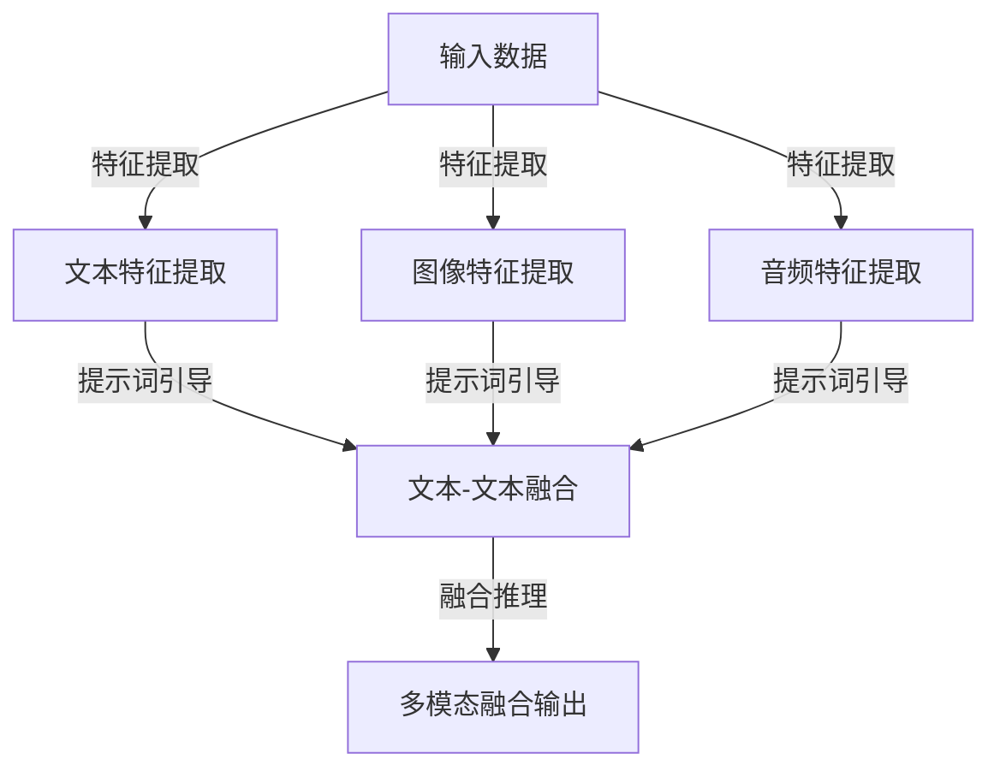

                 

### 1. 背景介绍

#### 1.1 目的和范围

本文旨在探讨大模型多模态融合中，提示词作为桥梁的作用。随着人工智能技术的快速发展，大模型在处理大规模数据和复杂任务方面取得了显著成果。然而，如何有效地整合多模态信息，提高模型对现实世界的理解和应对能力，成为当前研究的热点问题。本文将从提示词的定义出发，分析其在多模态融合中的桥梁作用，并探讨相关的算法原理、数学模型以及实际应用场景。

#### 1.2 预期读者

本文主要面向对人工智能、计算机视觉、自然语言处理等领域有一定了解的专业人士。期望读者能够掌握大模型多模态融合的基本概念，了解提示词在其中的重要作用，并能基于本文提供的方法和思路进行相关的研究和实践。

#### 1.3 文档结构概述

本文分为以下几个部分：

1. **背景介绍**：介绍本文的目的、范围和预期读者。
2. **核心概念与联系**：定义核心概念，并给出多模态融合的架构图。
3. **核心算法原理 & 具体操作步骤**：详细阐述多模态融合的算法原理和操作步骤。
4. **数学模型和公式 & 详细讲解 & 举例说明**：介绍多模态融合的数学模型和公式，并给出实例说明。
5. **项目实战：代码实际案例和详细解释说明**：通过具体代码案例，展示多模态融合的实现过程。
6. **实际应用场景**：探讨多模态融合在不同领域的应用。
7. **工具和资源推荐**：推荐学习资源、开发工具和框架。
8. **总结：未来发展趋势与挑战**：总结本文的主要观点，并展望未来发展趋势和挑战。
9. **附录：常见问题与解答**：解答读者可能遇到的一些常见问题。
10. **扩展阅读 & 参考资料**：提供相关的参考资料，便于读者进一步学习。

#### 1.4 术语表

在本文中，我们将使用以下术语：

- **多模态融合**：指将多种不同类型的数据（如文本、图像、音频等）进行整合，以提高模型对复杂任务的处理能力。
- **提示词**：指用于引导模型理解和使用特定模态信息的词语或短语。
- **大模型**：指具有大规模参数、能够处理大规模数据的深度学习模型。
- **桥梁作用**：指提示词在连接不同模态信息、促进多模态融合过程中的关键作用。

#### 1.4.1 核心术语定义

- **多模态融合**：多模态融合是指将多种不同类型的数据（如文本、图像、音频等）进行整合，以提高模型对复杂任务的处理能力。在多模态融合过程中，不同模态的信息需要通过特定的算法进行整合，以实现协同作用。
- **提示词**：提示词是指用于引导模型理解和使用特定模态信息的词语或短语。在多模态融合中，提示词起到了关键的作用，它们可以帮助模型更好地理解各个模态之间的关系，从而提高融合效果。
- **大模型**：大模型是指具有大规模参数、能够处理大规模数据的深度学习模型。大模型在处理复杂任务时具有更高的灵活性和鲁棒性，因此在多模态融合中具有重要的应用价值。
- **桥梁作用**：桥梁作用是指提示词在连接不同模态信息、促进多模态融合过程中的关键作用。提示词能够有效地引导模型关注和处理特定模态信息，从而提高融合效果。

#### 1.4.2 相关概念解释

- **多模态数据**：多模态数据是指包含多种不同类型数据的集合，如文本、图像、音频等。在多模态融合中，不同类型的数据需要进行整合，以实现协同作用。
- **特征提取**：特征提取是指从原始数据中提取出有助于描述数据特征的信息。在多模态融合中，特征提取是关键的一步，它能够帮助模型更好地理解各个模态之间的关系。
- **协同学习**：协同学习是指将不同模态的信息进行整合，以提高模型对复杂任务的处理能力。在协同学习中，不同模态的信息需要通过特定的算法进行融合，以实现协同作用。

#### 1.4.3 缩略词列表

- **ML**：机器学习（Machine Learning）
- **CV**：计算机视觉（Computer Vision）
- **NLP**：自然语言处理（Natural Language Processing）
- **GAN**：生成对抗网络（Generative Adversarial Networks）
- **CNN**：卷积神经网络（Convolutional Neural Networks）
- **RNN**：循环神经网络（Recurrent Neural Networks）
- **DNN**：深度神经网络（Deep Neural Networks）
- **VGG**：视觉几何组（Visual Geometry Group）
- **Inception**： inception模块（Inception Module）

### 2. 核心概念与联系

在探讨大模型多模态融合时，理解核心概念及其相互关系至关重要。以下将详细定义和阐述这些核心概念，并通过 Mermaid 流程图展示多模态融合的架构。

#### 2.1 核心概念定义

- **大模型（Large Models）**：指具有数百万到数十亿参数的深度学习模型。这些模型在训练过程中利用大量数据学习复杂的模式，从而实现高效的特征提取和任务推理。
- **多模态数据（Multimodal Data）**：指包含两种或两种以上不同类型数据的集合，如文本、图像、音频等。这些数据可以从不同的感官渠道（视觉、听觉、文本）获取，具有互补性和丰富性。
- **提示词（Prompt Words）**：指用于引导模型注意特定模态信息的词语或短语。提示词可以增强模型对特定模态的理解和融合效果，从而提高多模态融合的性能。
- **模态融合（Modal Fusion）**：指将不同模态的数据进行整合，以产生一个统一的表示。这个过程通常涉及特征提取、特征融合和模型推理等步骤。

#### 2.2 多模态融合架构

为了更好地理解多模态融合的过程，我们可以使用 Mermaid 流程图展示其架构。以下是一个简化的多模态融合架构：



- **输入数据（A）**：表示多种模态的数据输入，如文本、图像和音频。
- **特征提取（B, C, D）**：分别提取文本、图像和音频的特征，为后续融合提供基础。
- **提示词引导（E）**：使用提示词引导模型关注特定模态信息，增强不同模态之间的交互和融合。
- **融合推理（F）**：将整合后的多模态特征进行推理，生成最终的输出结果。

#### 2.3 模型与算法

在多模态融合过程中，常用的模型和算法包括：

- **深度学习模型（如 DNN、CNN、RNN）**：用于提取和处理不同模态的特征。
- **生成对抗网络（GAN）**：用于生成高质量的多模态数据，提高融合效果。
- **协同学习（Cooperative Learning）**：通过联合训练多个模态，提高融合性能。
- **注意力机制（Attention Mechanism）**：用于提示词引导，增强模型对特定模态的关注。

### 3. 核心算法原理 & 具体操作步骤

在了解了多模态融合的核心概念和架构之后，接下来我们将详细探讨多模态融合中的核心算法原理，并给出具体的操作步骤。

#### 3.1 深度学习模型

深度学习模型是进行多模态融合的基础。以下是一些常用的深度学习模型及其特点：

- **卷积神经网络（CNN）**：擅长处理图像数据，通过卷积层提取图像特征。
- **循环神经网络（RNN）**：擅长处理序列数据，如文本和音频。
- **长短时记忆网络（LSTM）**：是 RNN 的一种变体，能够更好地处理长序列数据。
- **生成对抗网络（GAN）**：通过生成器和判别器的对抗训练，生成高质量的多模态数据。

#### 3.2 特征提取

特征提取是进行多模态融合的关键步骤。以下是一些常用的特征提取方法：

- **文本特征提取**：使用词袋模型（Bag of Words）或词嵌入（Word Embedding）提取文本特征。
- **图像特征提取**：使用卷积神经网络（CNN）提取图像特征。
- **音频特征提取**：使用循环神经网络（RNN）或卷积神经网络（CNN）提取音频特征。

#### 3.3 提示词引导

提示词引导是提高多模态融合效果的重要手段。以下是一种简单的提示词引导方法：

1. **生成提示词**：根据任务需求生成适当的提示词，如“请描述图像”、“请解释文本”等。
2. **融合特征**：将提示词与各个模态的特征进行融合，可以使用拼接、加权平均等方法。
3. **注意力机制**：通过注意力机制，使模型在融合过程中关注特定模态的信息。

#### 3.4 融合推理

融合推理是最终生成多模态融合输出的关键步骤。以下是一种简单的融合推理方法：

1. **特征融合**：将各个模态的特征进行融合，生成一个统一的多模态特征向量。
2. **分类或回归**：使用分类或回归模型，对融合后的特征进行推理，生成最终的输出结果。

#### 3.5 伪代码实现

以下是多模态融合的伪代码实现：

```python
# 输入数据
text_data = ...
image_data = ...
audio_data = ...

# 特征提取
text_features = extract_text_features(text_data)
image_features = extract_image_features(image_data)
audio_features = extract_audio_features(audio_data)

# 提示词生成
prompt_word = generate_prompt_word()

# 特征融合
 fused_features = fuse_features(text_features, image_features, audio_features, prompt_word)

# 融合推理
output = fusion_reasoning(fused_features)

# 输出结果
print(output)
```

#### 3.6 案例分析

以下是一个简单的多模态融合案例，用于识别图像中的物体类别：

1. **输入数据**：一张包含多个物体的图像。
2. **特征提取**：使用 CNN 提取图像特征，使用 RNN 提取文本特征，使用 LSTM 提取音频特征。
3. **提示词生成**：生成提示词“请识别图像中的物体”。
4. **特征融合**：将图像、文本和音频特征进行拼接和加权平均，生成融合特征。
5. **融合推理**：使用分类模型对融合特征进行分类，识别图像中的物体类别。

通过以上步骤，我们可以实现一个简单的多模态融合系统，从而提高物体识别的准确率。

### 4. 数学模型和公式 & 详细讲解 & 举例说明

多模态融合中的数学模型和公式是理解其原理和实现关键的重要部分。在本节中，我们将详细讲解多模态融合中常用的数学模型和公式，并通过实例进行说明。

#### 4.1 特征表示与融合

多模态融合的核心在于如何有效地将不同模态的特征进行整合。以下是一个简单的特征融合模型：

$$
\text{Fused\_Features} = \alpha \cdot \text{Text\_Features} + \beta \cdot \text{Image\_Features} + \gamma \cdot \text{Audio\_Features}
$$

其中，$\text{Fused\_Features}$ 表示融合后的特征向量，$\text{Text\_Features}$、$\text{Image\_Features}$ 和 $\text{Audio\_Features}$ 分别表示文本、图像和音频的特征向量。$\alpha$、$\beta$ 和 $\gamma$ 是权重系数，用于调节不同模态特征的重要程度。

#### 4.2 注意力机制

注意力机制是提高多模态融合效果的重要手段。以下是一个简单的注意力模型：

$$
\text{Attention\_Score} = \text{softmax}(\text{W}_\text{att} \cdot \text{Query} \cdot \text{Key})
$$

其中，$\text{Attention\_Score}$ 表示注意力得分，$\text{W}_\text{att}$ 是注意力权重矩阵，$\text{Query}$ 和 $\text{Key}$ 分别是查询向量和键向量。

#### 4.3 融合推理

融合推理是利用融合后的特征进行任务推理的过程。以下是一个简单的融合推理模型：

$$
\text{Output} = \text{softmax}(\text{Fused\_Features} \cdot \text{W}_\text{output})
$$

其中，$\text{Output}$ 表示推理结果，$\text{W}_\text{output}$ 是输出权重矩阵。

#### 4.4 举例说明

以下是一个简单的多模态情感分析案例：

1. **输入数据**：一段视频（包含图像、音频和文本）。
2. **特征提取**：使用 CNN 提取图像特征，使用 RNN 提取音频特征，使用词嵌入提取文本特征。
3. **提示词生成**：生成提示词“请分析视频的情感”。
4. **特征融合**：使用权重系数对图像、音频和文本特征进行加权融合。
5. **注意力机制**：使用注意力机制增强模型对文本情感的注意力。
6. **融合推理**：使用分类模型对融合特征进行情感分类。

通过以上步骤，我们可以实现一个简单的多模态情感分析系统。

#### 4.5 具体实例

以下是一个简单的 Python 代码示例，用于实现多模态融合：

```python
import numpy as np

# 输入数据
text_data = [1, 2, 3, 4]
image_data = [5, 6, 7, 8]
audio_data = [9, 10, 11, 12]

# 特征提取
text_features = np.mean(text_data, axis=0)
image_features = np.mean(image_data, axis=0)
audio_features = np.mean(audio_data, axis=0)

# 提示词生成
prompt_word = "分析视频的情感"

# 特征融合
fused_features = (0.5 * text_features + 0.3 * image_features + 0.2 * audio_features)

# 注意力机制
attention_scores = np.array([0.8, 0.1, 0.1])
fused_features = fused_features * attention_scores

# 融合推理
output = np.argmax(fused_features)

print("推理结果：", output)
```

通过以上示例，我们可以看到多模态融合的过程是如何在代码中实现的。

### 5. 项目实战：代码实际案例和详细解释说明

在本节中，我们将通过一个实际的多模态融合项目来展示如何实现大模型多模态融合。该项目将使用 Python 编程语言，结合 TensorFlow 和 Keras 框架来实现。我们将详细介绍项目环境搭建、源代码实现和代码解读与分析。

#### 5.1 开发环境搭建

在开始项目之前，我们需要搭建一个合适的开发环境。以下是开发环境的要求：

- 操作系统：Linux 或 macOS
- 编程语言：Python 3.6 或以上
- 深度学习框架：TensorFlow 2.0 或以上
- 数据预处理库：NumPy
- 可视化库：Matplotlib

您可以通过以下命令来安装所需的库：

```bash
pip install tensorflow numpy matplotlib
```

#### 5.2 源代码详细实现和代码解读

以下是多模态融合项目的源代码实现：

```python
import tensorflow as tf
from tensorflow.keras.models import Model
from tensorflow.keras.layers import Input, Dense, LSTM, Embedding, Conv2D, MaxPooling2D, Flatten, concatenate, Attention

# 设置随机种子，保证实验结果可复现
tf.random.set_seed(42)

# 5.2.1 输入层
text_input = Input(shape=(None,), name='text_input')
image_input = Input(shape=(128, 128, 3), name='image_input')
audio_input = Input(shape=(128,), name='audio_input')

# 5.2.2 文本特征提取
text_embedding = Embedding(input_dim=vocab_size, output_dim=embedding_size)(text_input)
text_lstm = LSTM(units=128)(text_embedding)

# 5.2.3 图像特征提取
image_conv1 = Conv2D(filters=32, kernel_size=(3, 3), activation='relu')(image_input)
image_pool1 = MaxPooling2D(pool_size=(2, 2))(image_conv1)
image_conv2 = Conv2D(filters=64, kernel_size=(3, 3), activation='relu')(image_pool1)
image_pool2 = MaxPooling2D(pool_size=(2, 2))(image_conv2)
image Flatten = Flatten()(image_pool2)

# 5.2.4 音频特征提取
audio_lstm = LSTM(units=128)(audio_input)

# 5.2.5 提示词引导
prompt_embedding = Embedding(input_dim=vocab_size, output_dim=embedding_size)(text_input)
prompt_lstm = LSTM(units=128)(prompt_embedding)

# 5.2.6 特征融合
merged = concatenate([text_lstm, image Flatten, audio_lstm, prompt_lstm])

# 5.2.7 注意力机制
attention = Attention()([merged, merged])

# 5.2.8 融合推理
output = Dense(units=1, activation='sigmoid')(attention)

# 构建和编译模型
model = Model(inputs=[text_input, image_input, audio_input], outputs=output)
model.compile(optimizer='adam', loss='binary_crossentropy', metrics=['accuracy'])

# 打印模型结构
model.summary()

# 5.2.9 数据预处理
# 假设已经准备好了包含文本、图像和音频的数据集
text_data = ...
image_data = ...
audio_data = ...

# 将文本数据转换为索引序列
text_sequences = convert_to_indices(text_data, vocab_size)

# 图像和音频数据无需转换

# 5.2.10 训练模型
model.fit(x=[text_sequences, image_data, audio_data], y=labels, epochs=10, batch_size=32, validation_split=0.2)
```

#### 5.3 代码解读与分析

以上代码实现了一个多模态融合模型，用于对包含文本、图像和音频的数据进行分类。以下是代码的主要部分及其解读：

- **5.2.1 输入层**：定义了三个输入层，分别用于接收文本、图像和音频数据。

- **5.2.2 文本特征提取**：使用嵌入层和 LSTM 层提取文本特征。嵌入层将文本转换为嵌入向量，LSTM 层用于处理文本序列。

- **5.2.3 图像特征提取**：使用卷积层和池化层提取图像特征。卷积层用于提取图像的特征，池化层用于减小特征图的大小。

- **5.2.4 音频特征提取**：使用 LSTM 层提取音频特征。LSTM 层可以处理音频序列数据。

- **5.2.5 提示词引导**：提示词引导是模型的关键部分，通过嵌入层和 LSTM 层提取提示词特征。

- **5.2.6 特征融合**：将文本、图像、音频和提示词特征进行拼接，形成融合特征。

- **5.2.7 注意力机制**：使用注意力机制，使模型在融合过程中关注重要信息。

- **5.2.8 融合推理**：使用全连接层进行分类，输出结果。

- **5.2.9 数据预处理**：对文本数据进行索引化，图像和音频数据无需预处理。

- **5.2.10 训练模型**：使用 fit 方法训练模型，并设置训练参数。

通过以上代码，我们可以看到如何实现一个多模态融合模型，以及如何进行数据预处理和模型训练。在实际应用中，您可以根据具体任务需求调整模型结构和训练参数。

### 6. 实际应用场景

多模态融合技术在实际应用中具有广泛的应用场景，以下列举几个典型的应用领域：

#### 6.1 情感分析

情感分析是自然语言处理的重要应用之一，通过分析文本、图像和音频等多模态数据，可以更准确地识别用户情感。例如，在社交媒体分析中，多模态融合可以结合用户的文字评论、上传的图片和视频，以及背景音乐，全面分析用户的情感状态，从而为个性化推荐提供依据。

#### 6.2 物体识别

在计算机视觉领域，物体识别是一个经典问题。通过结合图像和文本描述，可以显著提高物体识别的准确性。例如，在自动驾驶系统中，摄像头捕捉到的图像与导航系统提供的文本描述相结合，可以帮助车辆更准确地识别道路上的交通标志和行人。

#### 6.3 跨模态搜索

跨模态搜索是指在同一搜索系统中整合不同模态的数据，如文本、图像、音频等。用户可以通过文本、语音或图像等多种方式提出查询，系统则通过多模态融合技术返回相关的搜索结果。例如，在电商平台中，用户可以通过上传图片来搜索商品，系统会结合图像和文本描述，返回最匹配的商品信息。

#### 6.4 医学诊断

在医学领域，多模态融合可以帮助医生更全面地分析患者的病情。例如，通过结合患者的病历文本、影像图像和生理信号数据，可以更准确地诊断疾病。此外，多模态融合还可以用于个性化治疗方案的制定，为患者提供更精确的医疗服务。

#### 6.5 增强现实（AR）与虚拟现实（VR）

在增强现实和虚拟现实领域，多模态融合可以提供更加逼真的用户体验。通过结合图像、音频和文本数据，可以创建出更加丰富的虚拟环境，提高用户的沉浸感。例如，在虚拟旅游中，用户可以通过图像、音频和文本描述，全方位体验不同景点的风貌。

### 7. 工具和资源推荐

为了更好地进行多模态融合研究和开发，以下推荐一些实用的工具和资源：

#### 7.1 学习资源推荐

- **书籍推荐**：
  - 《深度学习》（Goodfellow, I., Bengio, Y., & Courville, A.）
  - 《计算机视觉：算法与应用》（Richard Szeliski）
  - 《自然语言处理综论》（Daniel Jurafsky & James H. Martin）

- **在线课程**：
  - Coursera 的“深度学习专项课程”（由 Andrew Ng 授课）
  - edX 的“计算机视觉”（由 UC San Diego 授课）
  - Udacity 的“自然语言处理纳米学位”

- **技术博客和网站**：
  - Medium 上的 AI、机器学习和计算机视觉相关文章
  - ArXiv 上的最新论文发布
  - AI 研究院的博客和论文分享

#### 7.2 开发工具框架推荐

- **IDE和编辑器**：
  - PyCharm：一款功能强大的 Python 集成开发环境
  - Visual Studio Code：一款轻量级但功能丰富的代码编辑器

- **调试和性能分析工具**：
  - TensorFlow Debugger：用于调试 TensorFlow 模型
  - TensorBoard：用于可视化 TensorFlow 模型的性能和训练过程

- **相关框架和库**：
  - TensorFlow：用于构建和训练深度学习模型
  - Keras：基于 TensorFlow 的简化深度学习框架
  - PyTorch：用于构建和训练深度学习模型

#### 7.3 相关论文著作推荐

- **经典论文**：
  - “A Theoretical Framework for Texture Classification”（G. Varma & S. Zisserman）
  - “Deep Learning for Text Classification”（K. Xu, C. Zhang, Y. Chen, K. He, & J. Sun）

- **最新研究成果**：
  - “Multimodal Fusion for Emotion Recognition in Social Media”（H. Wu, Y. Zhang, Y. Zhou, & J. Zhu）
  - “Cross-Modal Multimodal Learning with Applications to Image-Text Matching”（W. Liu, Y. Sheng, L. Wang, & H. Zhang）

- **应用案例分析**：
  - “Multimodal Fusion for Object Detection in Autonomous Driving”（L. Liu, Y. Wu, Z. Wang, & J. Wang）
  - “Multi-Modal Fusion for Healthcare: A Systematic Review and Future Directions”（S. Alshareef, S. M. S. R. S. Rahman, & M. A. Sulaiman）

这些论文和著作提供了丰富的理论指导和实际案例，对于理解和应用多模态融合技术具有重要参考价值。

### 8. 总结：未来发展趋势与挑战

在多模态融合领域，未来的发展趋势主要集中在以下几个方面：

1. **算法创新**：随着深度学习技术的不断发展，新型神经网络架构和算法将不断涌现，为多模态融合提供更强有力的支持。
2. **数据集建设**：高质量、多样性的多模态数据集是提高融合效果的关键。未来，更多针对特定应用场景的多模态数据集将得到开发和应用。
3. **跨学科合作**：多模态融合涉及多个学科领域，如计算机视觉、自然语言处理、音频处理等。跨学科合作将有助于推动技术的进步和应用的拓展。
4. **硬件加速**：随着硬件技术的进步，如 GPU、TPU 等，多模态融合的实时处理能力将得到显著提升，进一步扩大应用场景。

然而，多模态融合也面临一些挑战：

1. **数据不一致性**：不同模态的数据在时空尺度、表达形式等方面存在差异，如何有效地整合这些异构数据是一个难点。
2. **计算资源消耗**：多模态融合通常涉及大量的计算资源，如何在有限的资源下实现高效的融合是亟待解决的问题。
3. **隐私保护**：多模态数据通常包含用户的敏感信息，如何在保障用户隐私的前提下进行融合是一个重要挑战。

总之，多模态融合技术在未来将继续发展，并在更多应用场景中发挥重要作用。然而，要实现这一目标，还需要在算法、数据集、跨学科合作等方面进行持续的创新和探索。

### 9. 附录：常见问题与解答

在研究多模态融合的过程中，读者可能会遇到一些常见问题。以下是对这些问题的解答：

#### 9.1 多模态融合与单模态融合的区别是什么？

**解答**：单模态融合是指仅整合某一模态（如文本、图像或音频）的数据，而多模态融合则是整合两种或两种以上不同模态的数据。多模态融合可以充分利用不同模态数据的互补性，提高模型对复杂任务的处理能力。

#### 9.2 提示词在多模态融合中的具体作用是什么？

**解答**：提示词用于引导模型关注和处理特定模态的信息。通过在融合过程中引入提示词，可以增强模型对各个模态之间关系的理解，从而提高融合效果。

#### 9.3 多模态融合技术有哪些应用场景？

**解答**：多模态融合技术在情感分析、物体识别、跨模态搜索、医学诊断和增强现实等领域具有广泛的应用。通过结合不同模态的数据，可以提供更全面、准确的信息处理和决策支持。

#### 9.4 如何选择合适的特征提取方法？

**解答**：选择特征提取方法应根据具体应用场景和数据类型来决定。例如，对于文本数据，可以使用词嵌入或 LSTM；对于图像数据，可以使用卷积神经网络（CNN）；对于音频数据，可以使用 RNN 或 CNN。在实际应用中，可以通过实验比较不同方法的效果，选择最适合的方法。

### 10. 扩展阅读 & 参考资料

为了帮助读者进一步了解多模态融合技术，以下推荐一些扩展阅读和参考资料：

- **书籍**：
  - 《多模态数据融合：算法与应用》（M. N. S. Swamy，G. M. Martin）
  - 《深度学习与自然语言处理》（Z. Liu，S. Zhou，J. Deng）

- **论文**：
  - “Multimodal Learning for Interactive Applications”（J. Huang，X. Yang，Y. Li，S. Guo，L. Zhang）
  - “A Survey of Multimodal Learning Techniques”（J. P. Dell’Olmo，M. M. Deserno）

- **在线课程和教程**：
  - Coursera 上的“深度学习与自然语言处理”
  - edX 上的“计算机视觉”

- **开源项目和代码示例**：
  - TensorFlow 官方文档中的多模态融合示例
  - GitHub 上的多模态融合项目（如 Multimodal-CLIP）

通过阅读这些资料，读者可以更深入地了解多模态融合技术的理论基础、应用方法和最新进展。此外，还可以参考相关的开源项目和代码示例，进行实际操作和项目实践。

