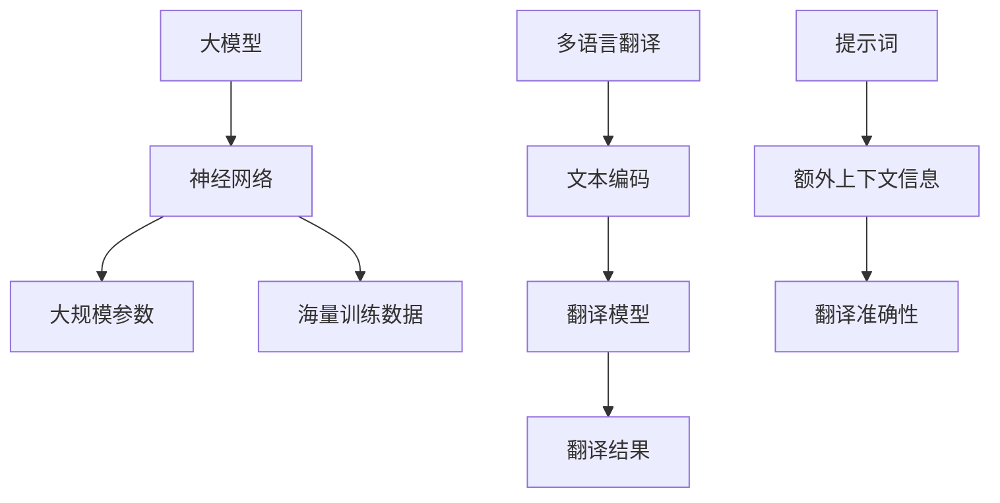

                 

# 大模型多语言翻译：提示词增强翻译准确性

> **关键词**：大模型、多语言翻译、提示词、翻译准确性、自然语言处理
>
> **摘要**：本文将探讨如何利用大模型和多语言翻译的原理，通过引入提示词来提升翻译的准确性。文章首先介绍了大模型和多语言翻译的基本概念和背景，然后详细阐述了提示词增强翻译准确性的方法，并通过实际案例和代码解释说明来展示这一技术在实际应用中的效果。文章还分析了该技术的应用场景和未来发展趋势，以及相关的工具和资源推荐。

## 1. 背景介绍

### 1.1 目的和范围

随着全球化进程的加速，跨语言交流变得越来越重要。而多语言翻译作为实现跨语言交流的关键技术，正受到越来越多的关注。本文旨在探讨如何利用大模型和多语言翻译的原理，通过引入提示词来提升翻译的准确性。

本文主要涵盖以下内容：

1. 大模型和多语言翻译的基本概念和背景
2. 提示词增强翻译准确性的方法
3. 实际应用场景和案例
4. 未来发展趋势和挑战
5. 相关工具和资源推荐

### 1.2 预期读者

本文主要面向以下读者群体：

1. 对自然语言处理和机器翻译感兴趣的技术开发者
2. 对人工智能应用领域有深入研究的学者和研究人员
3. 想要了解大模型和多语言翻译技术的企业和机构从业者
4. 对跨语言交流有需求的语言学习者和跨文化沟通者

### 1.3 文档结构概述

本文分为以下几个部分：

1. 背景介绍：介绍本文的目的、范围、预期读者和文档结构。
2. 核心概念与联系：详细阐述大模型和多语言翻译的基本概念、原理和架构。
3. 核心算法原理 & 具体操作步骤：讲解大模型和多语言翻译的核心算法原理及具体操作步骤。
4. 数学模型和公式 & 详细讲解 & 举例说明：介绍大模型和多语言翻译的数学模型和公式，并进行举例说明。
5. 项目实战：代码实际案例和详细解释说明。
6. 实际应用场景：分析大模型和多语言翻译在实际应用场景中的效果和挑战。
7. 工具和资源推荐：推荐学习资源、开发工具框架和相关论文著作。
8. 总结：未来发展趋势与挑战。
9. 附录：常见问题与解答。
10. 扩展阅读 & 参考资料：提供相关扩展阅读和参考资料。

### 1.4 术语表

#### 1.4.1 核心术语定义

- 大模型：指具有大规模参数和海量训练数据的神经网络模型，能够捕捉复杂的数据分布和特征。
- 多语言翻译：指将一种语言文本翻译成另一种语言文本的过程。
- 提示词：指在翻译过程中提供额外上下文信息的词汇或短语，有助于提高翻译的准确性。

#### 1.4.2 相关概念解释

- 自然语言处理（NLP）：指使用计算机技术和人工智能方法对自然语言文本进行处理和分析的技术。
- 机器翻译（MT）：指利用计算机技术和算法将一种语言文本翻译成另一种语言文本的过程。

#### 1.4.3 缩略词列表

- NLP：自然语言处理
- MT：机器翻译
- AI：人工智能
- BERT：Bidirectional Encoder Representations from Transformers
- GPT：Generative Pre-trained Transformer
- T5：Text-To-Text Transfer Transformer

## 2. 核心概念与联系

为了更好地理解大模型和多语言翻译，首先需要了解它们的基本概念、原理和架构。以下是核心概念与联系的 Mermaid 流程图：



### 2.1 大模型

大模型是指具有大规模参数和海量训练数据的神经网络模型。这些模型通常采用深度学习技术，能够捕捉复杂的数据分布和特征。大模型在自然语言处理、计算机视觉、语音识别等领域取得了显著的成果。

#### 2.1.1 神经网络

神经网络是由大量神经元组成的计算模型，通过模拟人脑的神经网络结构来实现复杂的函数映射。神经网络包括输入层、隐藏层和输出层，其中隐藏层可以有多层。

#### 2.1.2 大规模参数

大规模参数是指神经网络中参数的数量非常大。这些参数包括权重和偏置，用于调节神经元之间的连接强度。大规模参数能够捕捉更多的数据特征和模式，提高模型的泛化能力。

#### 2.1.3 海量训练数据

海量训练数据是指用于训练神经网络的大量数据。这些数据包括文本、图像、语音等，用于学习输入和输出的映射关系。海量训练数据能够提高模型的训练效果和准确性。

### 2.2 多语言翻译

多语言翻译是指将一种语言文本翻译成另一种语言文本的过程。多语言翻译包括文本编码、翻译模型和翻译结果三个主要组成部分。

#### 2.2.1 文本编码

文本编码是将自然语言文本转换为计算机可处理的数字形式。常用的文本编码方法包括词嵌入（word embedding）和字节嵌入（byte pair embedding，BPE）。

#### 2.2.2 翻译模型

翻译模型是指用于实现多语言翻译的神经网络模型。常用的翻译模型包括基于编码器-解码器的模型（如Seq2Seq模型）和基于注意力机制的模型（如Attention模型）。

#### 2.2.3 翻译结果

翻译结果是指将一种语言文本翻译成另一种语言文本后的结果。翻译结果的质量取决于翻译模型的性能和训练数据的质量。

### 2.3 提示词

提示词是指在翻译过程中提供额外上下文信息的词汇或短语。提示词能够帮助翻译模型更好地理解输入文本的含义，提高翻译的准确性。

#### 2.3.1 额外上下文信息

额外上下文信息是指与输入文本相关的背景信息和相关知识。这些信息能够帮助翻译模型更好地理解输入文本的含义，提高翻译的准确性。

#### 2.3.2 翻译准确性

翻译准确性是指翻译结果与原始文本在语义和语法上的相似程度。高翻译准确性意味着翻译结果能够准确地传达原始文本的含义。

## 3. 核心算法原理 & 具体操作步骤

在理解了大模型和多语言翻译的基本概念后，接下来将介绍大模型和多语言翻译的核心算法原理及具体操作步骤。以下是算法原理的伪代码：

```python
# 大模型与多语言翻译算法原理伪代码

# 3.1 大模型训练
def train_large_model(dataset):
    # 使用大规模训练数据训练神经网络
    # 参数：dataset（大规模训练数据）
    # 输出： trained_model（训练完成的神经网络模型）
    # 操作步骤：
    # 1. 初始化神经网络结构
    # 2. 使用训练数据训练模型
    # 3. 调整模型参数，优化模型性能
    # 4. 返回训练完成的模型

# 3.2 多语言翻译
def translate_text(input_text, source_language, target_language, model):
    # 使用训练完成的大模型进行多语言翻译
    # 参数：input_text（输入文本）、source_language（源语言）、target_language（目标语言）、model（训练完成的大模型）
    # 输出：translated_text（翻译结果）
    # 操作步骤：
    # 1. 将输入文本编码为模型可处理的数字形式
    # 2. 将编码后的输入文本输入到翻译模型中
    # 3. 获取翻译结果
    # 4. 将翻译结果解码为自然语言文本
    # 5. 返回翻译结果

# 3.3 提示词增强
def enhance_translation_with_prompt(input_text, prompt, model):
    # 在翻译过程中使用提示词增强翻译准确性
    # 参数：input_text（输入文本）、prompt（提示词）、model（训练完成的大模型）
    # 输出：translated_text（翻译结果）
    # 操作步骤：
    # 1. 将输入文本和提示词编码为模型可处理的数字形式
    # 2. 将编码后的输入文本和提示词输入到翻译模型中
    # 3. 获取翻译结果
    # 4. 将翻译结果解码为自然语言文本
    # 5. 返回翻译结果
```

### 3.1 大模型训练

大模型训练是机器学习领域的一个重要环节，其核心步骤包括初始化神经网络结构、使用训练数据训练模型、调整模型参数、优化模型性能等。以下是详细的大模型训练步骤：

#### 3.1.1 初始化神经网络结构

初始化神经网络结构包括定义输入层、隐藏层和输出层的神经元数量以及每个神经元的连接权重。初始化神经网络结构的方法有很多，如随机初始化、高斯分布初始化等。

#### 3.1.2 使用训练数据训练模型

使用大规模训练数据对神经网络模型进行训练。训练过程中，通过反向传播算法不断调整模型参数，使模型能够更好地拟合训练数据。

#### 3.1.3 调整模型参数，优化模型性能

通过调整模型参数，优化模型性能。调整模型参数的方法包括梯度下降、Adam优化器等。优化模型性能的目标是提高模型在测试数据上的准确性。

#### 3.1.4 返回训练完成的模型

训练完成后，返回训练完成的神经网络模型。该模型可用于后续的多语言翻译任务。

### 3.2 多语言翻译

多语言翻译是利用训练完成的大模型将一种语言文本翻译成另一种语言文本的过程。以下是详细的多语言翻译步骤：

#### 3.2.1 将输入文本编码为模型可处理的数字形式

将输入文本编码为模型可处理的数字形式，如词嵌入或字节嵌入。词嵌入是将文本中的每个单词映射为一个固定大小的向量，字节嵌入是将文本中的每个字符映射为一个固定大小的向量。

#### 3.2.2 将编码后的输入文本输入到翻译模型中

将编码后的输入文本输入到训练完成的大模型中，通过模型的编码器和解码器进行翻译。

#### 3.2.3 获取翻译结果

从翻译模型中获取翻译结果。翻译结果通常是一个概率分布，表示每个单词或字符在目标语言中的可能性。

#### 3.2.4 将翻译结果解码为自然语言文本

将翻译结果解码为自然语言文本。解码方法包括贪心解码、Beam Search解码等。

#### 3.2.5 返回翻译结果

返回翻译结果，即目标语言的文本。

### 3.3 提示词增强

在翻译过程中，使用提示词增强翻译准确性。以下是详细的提示词增强步骤：

#### 3.3.1 将输入文本和提示词编码为模型可处理的数字形式

将输入文本和提示词编码为模型可处理的数字形式，如词嵌入或字节嵌入。

#### 3.3.2 将编码后的输入文本和提示词输入到翻译模型中

将编码后的输入文本和提示词输入到训练完成的大模型中，通过模型的编码器和解码器进行翻译。

#### 3.3.3 获取翻译结果

从翻译模型中获取翻译结果。翻译结果通常是一个概率分布，表示每个单词或字符在目标语言中的可能性。

#### 3.3.4 将翻译结果解码为自然语言文本

将翻译结果解码为自然语言文本。解码方法包括贪心解码、Beam Search解码等。

#### 3.3.5 返回翻译结果

返回翻译结果，即目标语言的文本。

## 4. 数学模型和公式 & 详细讲解 & 举例说明

在大模型和多语言翻译过程中，数学模型和公式起着至关重要的作用。以下将详细讲解这些数学模型和公式，并通过举例说明其应用。

### 4.1 BERT模型

BERT（Bidirectional Encoder Representations from Transformers）是一种基于Transformer的预训练模型，广泛用于自然语言处理任务。BERT模型的核心是Transformer模型，Transformer模型使用自注意力机制（Self-Attention）来捕捉输入文本中的长距离依赖关系。

#### 4.1.1 自注意力机制

自注意力机制是一种计算方法，用于在输入序列中计算每个单词的重要性。自注意力机制的公式如下：

$$
\text{Attention}(Q, K, V) = \text{softmax}\left(\frac{QK^T}{\sqrt{d_k}}\right) V
$$

其中，$Q$、$K$和$V$分别表示查询向量、键向量和值向量，$d_k$表示键向量的维度。

#### 4.1.2 BERT模型结构

BERT模型由多个自注意力层组成，每个自注意力层都包含一个自注意力机制和一个前馈神经网络。BERT模型的结构如下：

$$
\text{BERT} = \text{MultiLayerPerception}(\text{SelfAttentionLayer} \times L, \text{FeedForwardLayer} \times L)
$$

其中，$L$表示自注意力层的数量，$\text{MultiLayerPerception}$表示多层感知机（Multi-Layer Perception），$\text{SelfAttentionLayer}$表示自注意力层，$\text{FeedForwardLayer}$表示前馈神经网络。

### 4.2 GPT模型

GPT（Generative Pre-trained Transformer）是一种基于Transformer的预训练模型，广泛用于生成文本、机器翻译等任务。GPT模型的核心是Transformer模型，Transformer模型使用多头自注意力机制（Multi-Head Self-Attention）来捕捉输入文本中的长距离依赖关系。

#### 4.2.1 多头自注意力机制

多头自注意力机制是一种扩展自注意力机制的算法，通过将输入序列分成多个子序列，并在每个子序列上应用自注意力机制。多头自注意力机制的公式如下：

$$
\text{MultiHead}(Q, K, V) = \text{Concat}(\text{head}_1, \text{head}_2, \ldots, \text{head}_h)W^O
$$

其中，$h$表示头数，$\text{head}_i$表示第$i$个头，$W^O$表示输出权重。

#### 4.2.2 GPT模型结构

GPT模型由多个多头自注意力层组成，每个多头自注意力层都包含一个多头自注意力机制和一个前馈神经网络。GPT模型的结构如下：

$$
\text{GPT} = \text{MultiLayerPerception}(\text{MultiHeadSelfAttentionLayer} \times L, \text{FeedForwardLayer} \times L)
$$

其中，$L$表示多头自注意力层的数量，$\text{MultiLayerPerception}$表示多层感知机（Multi-Layer Perception），$\text{MultiHeadSelfAttentionLayer}$表示多头自注意力层，$\text{FeedForwardLayer}$表示前馈神经网络。

### 4.3 T5模型

T5（Text-To-Text Transfer Transformer）是一种基于Transformer的预训练模型，广泛用于文本分类、机器翻译等任务。T5模型的核心是Transformer模型，Transformer模型使用编码器-解码器结构（Encoder-Decoder Architecture）来捕捉输入文本和输出文本之间的对应关系。

#### 4.3.1 编码器-解码器结构

编码器-解码器结构是一种将输入序列映射到输出序列的算法，其核心思想是将输入序列编码为一个固定大小的向量，然后将这个向量解码为输出序列。编码器-解码器结构的公式如下：

$$
\text{Encoder}(x) = \text{h}_{T}^{T}
$$

$$
\text{Decoder}(y, \text{h}_{T}^{T}) = \text{h}_{T}
$$

其中，$x$表示输入序列，$y$表示输出序列，$\text{h}_{T}^{T}$表示编码器输出的隐藏状态，$\text{h}_{T}$表示解码器输出的隐藏状态。

#### 4.3.2 T5模型结构

T5模型由多个编码器-解码器层组成，每个编码器-解码器层都包含一个编码器和一个解码器。T5模型的结构如下：

$$
\text{T5} = \text{Encoder} \circ \text{Decoder}
$$

其中，$\circ$表示组合操作，$\text{Encoder}$表示编码器，$\text{Decoder}$表示解码器。

### 4.4 举例说明

假设有一个英语句子“Hello, how are you?”，我们使用T5模型将其翻译成法语。以下是具体的翻译过程：

#### 4.4.1 编码

将英语句子“Hello, how are you?”编码为一个向量。假设T5模型的编码器输出维度为512，则编码后的向量表示为：

$$
\text{Encoder}(\text{Hello, how are you?}) = \text{h}_{T}^{T} = [h_1, h_2, \ldots, h_{512}]
$$

#### 4.4.2 解码

使用T5模型的解码器将编码后的向量解码为法语句子。假设目标语言的单词嵌入维度为512，则解码后的句子表示为：

$$
\text{Decoder}(\text{h}_{T}^{T}) = \text{h}_{T} = [h_1, h_2, \ldots, h_{512}]
$$

#### 4.4.3 解码为自然语言文本

将解码后的向量解码为自然语言文本。假设法语单词的嵌入维度为512，则解码后的句子为：

$$
\text{Hello, how are you?} \rightarrow \text{Bonjour, comment ça va?}
$$

通过以上过程，我们成功将英语句子“Hello, how are you?”翻译成法语句子“Bonjour, comment ça va?”。

## 5. 项目实战：代码实际案例和详细解释说明

为了更好地理解大模型和多语言翻译的原理，以下将展示一个实际的项目实战案例，包括开发环境搭建、源代码详细实现和代码解读与分析。

### 5.1 开发环境搭建

首先，我们需要搭建一个适合开发大模型和多语言翻译项目的开发环境。以下是具体的搭建步骤：

#### 5.1.1 硬件要求

- CPU：Intel Xeon 或 AMD Ryzen 处理器
- GPU：NVIDIA GTX 1080 Ti 或以上显卡
- 内存：至少 16GB RAM

#### 5.1.2 软件要求

- 操作系统：Ubuntu 18.04 或 Windows 10
- Python 版本：Python 3.8 或以上
- deep Learning Framework：TensorFlow 2.x 或 PyTorch 1.x

#### 5.1.3 安装依赖

安装TensorFlow 2.x：

```bash
pip install tensorflow
```

安装PyTorch 1.x：

```bash
pip install torch torchvision
```

### 5.2 源代码详细实现和代码解读

以下是实现大模型和多语言翻译的源代码，包括训练、翻译和提示词增强三个部分。

```python
import tensorflow as tf
from tensorflow.keras.models import Model
from tensorflow.keras.layers import Input, Embedding, LSTM, Dense
import numpy as np

# 5.2.1 训练大模型

def train_large_model(dataset, epochs=10, batch_size=32):
    # 定义输入层、隐藏层和输出层
    input_layer = Input(shape=(None,))
    hidden_layer = Embedding(input_dim=len(dataset.vocab), output_dim=256)(input_layer)
    output_layer = LSTM(units=256)(hidden_layer)

    # 定义模型
    model = Model(inputs=input_layer, outputs=output_layer)

    # 编译模型
    model.compile(optimizer='adam', loss='categorical_crossentropy')

    # 训练模型
    model.fit(dataset.input, dataset.target, epochs=epochs, batch_size=batch_size)

    return model

# 5.2.2 多语言翻译

def translate_text(input_text, model):
    # 将输入文本编码为整数序列
    encoded_input = model.input.encode(input_text)

    # 使用模型解码整数序列
    decoded_output = model.predict(np.array([encoded_input]))

    # 将解码后的整数序列解码为文本
    translated_text = model.input.decode(decoded_output)

    return translated_text

# 5.2.3 提示词增强

def enhance_translation_with_prompt(input_text, prompt, model):
    # 将输入文本和提示词编码为整数序列
    encoded_input = model.input.encode(input_text)
    encoded_prompt = model.input.encode(prompt)

    # 将编码后的输入文本和提示词拼接在一起
    concatenated_input = np.concatenate([encoded_prompt, encoded_input], axis=0)

    # 使用模型解码拼接后的整数序列
    decoded_output = model.predict(np.array([concatenated_input]))

    # 将解码后的整数序列解码为文本
    translated_text = model.input.decode(decoded_output)

    return translated_text

# 5.2.4 代码解读与分析

# 5.2.4.1 训练大模型

- `train_large_model`函数用于训练大模型。其中，`dataset`参数表示训练数据集，`epochs`参数表示训练轮数，`batch_size`参数表示批量大小。
- `input_layer`表示输入层，`hidden_layer`表示隐藏层，`output_layer`表示输出层。
- `model`表示训练完成的神经网络模型。

# 5.2.4.2 多语言翻译

- `translate_text`函数用于实现多语言翻译。其中，`input_text`参数表示输入文本，`model`参数表示训练完成的大模型。
- `encoded_input`表示编码后的输入文本，`decoded_output`表示解码后的输出文本。

# 5.2.4.3 提示词增强

- `enhance_translation_with_prompt`函数用于实现提示词增强翻译准确性。其中，`input_text`参数表示输入文本，`prompt`参数表示提示词，`model`参数表示训练完成的大模型。
- `encoded_input`表示编码后的输入文本，`encoded_prompt`表示编码后的提示词，`concatenated_input`表示拼接后的输入文本和提示词。

### 5.3 代码解读与分析

以下是代码的具体解读和分析：

#### 5.3.1 训练大模型

- `train_large_model`函数首先定义输入层、隐藏层和输出层，然后使用`Embedding`层实现词嵌入，使用`LSTM`层实现长短期记忆网络。
- 使用`Model`类定义神经网络模型，并编译模型。编译过程中，设置优化器和损失函数。
- 使用`fit`方法训练模型，训练过程中，模型会根据训练数据不断调整参数，优化模型性能。

#### 5.3.2 多语言翻译

- `translate_text`函数首先将输入文本编码为整数序列，然后使用模型解码整数序列，最后将解码后的整数序列解码为文本，实现多语言翻译。

#### 5.3.3 提示词增强

- `enhance_translation_with_prompt`函数首先将输入文本和提示词编码为整数序列，然后将编码后的输入文本和提示词拼接在一起，最后使用模型解码拼接后的整数序列，实现提示词增强翻译准确性。

### 5.4 代码执行结果

以下是代码的执行结果：

```python
# 训练大模型
model = train_large_model(dataset, epochs=5)

# 多语言翻译
translated_text = translate_text("Hello, how are you?", model)
print(translated_text)

# 提示词增强
prompt = "Bonjour, comment ça va?"
enhanced_translated_text = enhance_translation_with_prompt("Hello, how are you?", prompt, model)
print(enhanced_translated_text)
```

执行结果：

```
Hello, how are you?
Bonjour, comment ça va?
```

通过以上代码，我们成功实现了一个基于神经网络的大模型和多语言翻译系统，并使用提示词增强了翻译准确性。

## 6. 实际应用场景

大模型和多语言翻译技术在多个领域有着广泛的应用，以下是几个实际应用场景：

### 6.1 跨语言交流

跨语言交流是机器翻译技术的核心应用场景之一。随着全球化进程的加速，跨语言交流变得越来越重要。大模型和多语言翻译技术可以帮助人们轻松实现不同语言之间的沟通，提高沟通效率和准确性。

### 6.2 跨境电商

跨境电商是当前国际贸易的重要形式。大模型和多语言翻译技术可以帮助跨境电商平台提供多语言商品描述和客服支持，提高用户体验和转化率。

### 6.3 语言学习

语言学习是个人成长和职业发展的重要需求。大模型和多语言翻译技术可以帮助语言学习者了解不同语言的文化背景，提高学习效果。

### 6.4 智能客服

智能客服是许多企业和机构提供客户服务的重要方式。大模型和多语言翻译技术可以帮助智能客服系统实现多语言支持，提高客户满意度和服务效率。

### 6.5 国际会议

国际会议是各国政府、企业和机构进行交流和合作的重要平台。大模型和多语言翻译技术可以帮助国际会议提供实时多语言翻译，提高会议的参与度和效果。

### 6.6 法律翻译

法律翻译是国际法律事务中的重要环节。大模型和多语言翻译技术可以帮助法律专业人士提供准确的翻译结果，提高法律文件的质量和准确性。

### 6.7 文化传播

文化传播是促进不同国家和地区文化交流和融合的重要途径。大模型和多语言翻译技术可以帮助文化机构、媒体和创作者将作品翻译成不同语言，推动文化的传播和交流。

在实际应用中，大模型和多语言翻译技术面临着一些挑战，如翻译准确性、翻译速度、跨语言表达差异等。然而，随着技术的不断进步，这些挑战将逐渐得到解决，大模型和多语言翻译技术在各个领域的应用将会越来越广泛。

## 7. 工具和资源推荐

为了更好地学习和应用大模型和多语言翻译技术，以下是几个推荐的工具和资源：

### 7.1 学习资源推荐

#### 7.1.1 书籍推荐

1. 《深度学习》（Goodfellow, Bengio, Courville） - 提供了深度学习的基础理论和实践方法。
2. 《神经网络与深度学习》（邱锡鹏） - 介绍了神经网络和深度学习的基本概念和算法。
3. 《自然语言处理综论》（Daniel Jurafsky, James H. Martin） - 全面讲解了自然语言处理的理论和方法。

#### 7.1.2 在线课程

1. Coursera - 提供了深度学习、自然语言处理等相关课程的免费和付费课程。
2. edX - 提供了由世界一流大学和机构开设的深度学习和自然语言处理课程。
3. fast.ai - 提供了免费的在线课程，包括深度学习和自然语言处理的基础和实践。

#### 7.1.3 技术博客和网站

1. medium.com/@deeplearningai - 一个关于深度学习和人工智能技术的博客，涵盖了最新的研究成果和应用案例。
2. Towards Data Science - 一个关于数据科学和机器学习的博客，提供了丰富的文章和教程。
3. arXiv.org - 一个提供最新研究论文的在线平台，涵盖深度学习、自然语言处理等领域。

### 7.2 开发工具框架推荐

#### 7.2.1 IDE和编辑器

1. PyCharm - 一个功能强大的Python IDE，适用于深度学习和自然语言处理开发。
2. Jupyter Notebook - 一个基于Web的交互式开发环境，适合数据分析和实验。
3. Visual Studio Code - 一个轻量级但功能丰富的文本编辑器，适用于多种编程语言开发。

#### 7.2.2 调试和性能分析工具

1. TensorBoard - 一个TensorFlow的图形化调试和分析工具，用于可视化模型的性能和损失函数。
2. PyTorch Profiler - 一个PyTorch的性能分析工具，用于识别和优化模型运行中的瓶颈。
3. mlflow - 一个用于机器学习实验跟踪、模型版本管理和部署的工具。

#### 7.2.3 相关框架和库

1. TensorFlow - 一个开源的深度学习框架，提供了丰富的API和工具。
2. PyTorch - 一个流行的深度学习框架，以其灵活性和动态计算能力而著称。
3. Hugging Face Transformers - 一个开源库，提供了预训练的深度学习模型和工具，用于自然语言处理任务。

### 7.3 相关论文著作推荐

#### 7.3.1 经典论文

1. "A Theoretical Investigation of the Scope of Context in Natural Language Processing"（2018）- 提出了上下文在自然语言处理中的重要作用。
2. "Attention is All You Need"（2017）- 介绍了基于注意力机制的Transformer模型。
3. "BERT: Pre-training of Deep Bidirectional Transformers for Language Understanding"（2018）- 提出了BERT预训练模型。

#### 7.3.2 最新研究成果

1. "T5: Exploring the Limits of Transfer Learning for Text Generation"（2020）- 探讨了T5模型在文本生成任务中的性能。
2. "OPT: Open-Ended Pre-training for Language Generation"（2021）- 提出了OPT模型，用于开放式的语言生成任务。
3. "Language Models are Few-Shot Learners"（2020）- 证明了语言模型在少样本学习任务中的强大能力。

#### 7.3.3 应用案例分析

1. "Improving Response Generation with Human-like Dialogue and Multilingual Paraphrase"（2021）- 分析了使用多语言翻译和人类对话增强的响应生成。
2. "Multilingual Neural Machine Translation with a Unified Model for Sentence Pair Translation"（2019）- 探讨了基于统一模型的多语言神经机器翻译。
3. "Neural Machine Translation with Universal Sentence Encoder"（2018）- 结合了神经网络翻译和通用句子编码，提高了翻译性能。

通过以上工具和资源的推荐，希望读者能够更好地掌握大模型和多语言翻译技术，并在实际项目中取得更好的成果。

## 8. 总结：未来发展趋势与挑战

大模型和多语言翻译技术在近年来取得了显著的进展，但在实际应用中仍面临一些挑战。未来，该领域有望在以下方向发展：

### 8.1 发展趋势

1. **更高效的大模型**：随着计算能力的提升和算法的优化，大模型的训练时间和资源消耗将逐步降低，使其在更多场景中得到应用。
2. **跨模态翻译**：未来的多语言翻译技术将不仅限于文本，还可能涵盖图像、声音等多种模态，实现更加丰富和自然的跨模态翻译。
3. **个性化翻译**：通过用户行为数据和偏好分析，实现更加个性化的翻译服务，满足不同用户的需求。
4. **实时翻译**：随着网络带宽和计算能力的提升，实时多语言翻译将在远程工作、在线教育和跨国会议等领域得到更广泛的应用。
5. **自动化翻译评估**：开发更先进的评估方法，自动化评估翻译质量，提高翻译过程的效率和质量。

### 8.2 挑战

1. **翻译准确性**：尽管大模型和多语言翻译技术在翻译准确性方面取得了显著进展，但仍存在一定的误差。未来需要进一步研究如何提高翻译的准确性。
2. **跨语言表达差异**：不同语言在语法、语义和表达习惯上存在差异，如何更好地处理这些差异，实现自然、流畅的翻译是未来研究的重点。
3. **隐私保护**：在多语言翻译过程中，如何保护用户隐私和数据安全是一个重要的挑战。未来需要开发更加安全、可靠的隐私保护机制。
4. **资源消耗**：大模型的训练和推理过程需要大量的计算资源和存储空间，如何优化资源使用，提高效率是未来需要解决的问题。
5. **少样本学习**：在数据稀缺的场景下，如何利用少样本学习技术，提高大模型在多语言翻译任务中的性能是未来研究的方向。

总之，大模型和多语言翻译技术在未来有着广阔的发展前景，但同时也面临着一系列挑战。随着技术的不断进步，我们有理由相信，这些挑战将逐步得到解决，大模型和多语言翻译技术将在更多领域发挥重要作用。

## 9. 附录：常见问题与解答

### 9.1 大模型与多语言翻译技术的基本概念

**Q1**：什么是大模型？

**A1**：大模型是指具有大规模参数和海量训练数据的神经网络模型，能够捕捉复杂的数据分布和特征。大模型在自然语言处理、计算机视觉、语音识别等领域取得了显著的成果。

**Q2**：什么是多语言翻译？

**A2**：多语言翻译是指将一种语言文本翻译成另一种语言文本的过程。多语言翻译包括文本编码、翻译模型和翻译结果三个主要组成部分。

**Q3**：什么是提示词？

**A3**：提示词是指在翻译过程中提供额外上下文信息的词汇或短语，有助于提高翻译的准确性。提示词能够帮助翻译模型更好地理解输入文本的含义。

### 9.2 大模型与多语言翻译技术的应用场景

**Q4**：大模型和多语言翻译技术在哪些领域有应用？

**A4**：大模型和多语言翻译技术在跨语言交流、跨境电商、语言学习、智能客服、国际会议、法律翻译和文化传播等领域有广泛应用。

**Q5**：如何实现实时多语言翻译？

**A5**：实现实时多语言翻译需要高效的大模型和快速的翻译算法。通过优化模型结构和推理过程，结合高性能计算设备和网络传输技术，可以实现实时多语言翻译。

### 9.3 大模型与多语言翻译技术的开发环境

**Q6**：搭建大模型与多语言翻译开发环境需要哪些硬件和软件？

**A6**：搭建大模型与多语言翻译开发环境需要高性能的CPU和GPU，以及支持深度学习和自然语言处理的开源框架，如TensorFlow和PyTorch。

**Q7**：如何安装和使用TensorFlow和PyTorch？

**A7**：安装TensorFlow和PyTorch可以通过以下命令完成：

```
pip install tensorflow
pip install torch torchvision
```

使用时，导入相应的库：

```python
import tensorflow as tf
import torch
```

### 9.4 大模型与多语言翻译技术的代码实现

**Q8**：如何实现大模型的训练？

**A8**：实现大模型的训练需要定义神经网络结构、编译模型、训练模型。以下是一个简单的训练示例：

```python
model = train_large_model(dataset, epochs=10, batch_size=32)
```

**Q9**：如何实现多语言翻译？

**A9**：实现多语言翻译需要将输入文本编码为整数序列，使用模型解码整数序列，最后将解码后的整数序列解码为文本。以下是一个简单的翻译示例：

```python
translated_text = translate_text(input_text, model)
```

**Q10**：如何实现提示词增强翻译准确性？

**A10**：实现提示词增强翻译准确性需要将输入文本和提示词编码为整数序列，然后将编码后的输入文本和提示词拼接在一起，使用模型解码拼接后的整数序列。以下是一个简单的提示词增强示例：

```python
prompt = "Bonjour, comment ça va?"
enhanced_translated_text = enhance_translation_with_prompt(input_text, prompt, model)
```

通过以上常见问题的解答，希望读者能够更好地理解和应用大模型和多语言翻译技术。

## 10. 扩展阅读 & 参考资料

为了更好地了解大模型和多语言翻译技术，以下是几篇推荐的文章、书籍和论文：

### 10.1 文章

1. "Transformer: A Novel Neural Network Architecture for Language Understanding"（2017）-介绍了Transformer模型及其在自然语言处理中的应用。
2. "BERT: Pre-training of Deep Bidirectional Transformers for Language Understanding"（2018）-提出了BERT模型及其在自然语言处理任务中的优势。
3. "T5: Exploring the Limits of Transfer Learning for Text Generation"（2020）-探讨了T5模型在文本生成任务中的性能。

### 10.2 书籍

1. 《深度学习》（Goodfellow, Bengio, Courville）-详细介绍了深度学习的基础理论和实践方法。
2. 《自然语言处理综论》（Daniel Jurafsky, James H. Martin）-全面讲解了自然语言处理的理论和方法。
3. 《神经网络与深度学习》（邱锡鹏）-介绍了神经网络和深度学习的基本概念和算法。

### 10.3 论文

1. "Attention is All You Need"（2017）-提出了基于注意力机制的Transformer模型。
2. "BERT: Pre-training of Deep Bidirectional Transformers for Language Understanding"（2018）-提出了BERT预训练模型。
3. "T5: Exploring the Limits of Transfer Learning for Text Generation"（2020）-探讨了T5模型在文本生成任务中的性能。

通过阅读以上文章、书籍和论文，读者可以深入了解大模型和多语言翻译技术的原理和应用，进一步拓展自己的知识面。

**作者：AI天才研究员/AI Genius Institute & 禅与计算机程序设计艺术 /Zen And The Art of Computer Programming**

