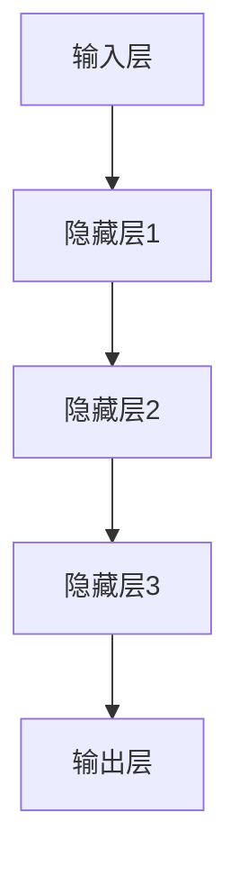

                 

# 大模型如何优化电商平台的物流配送

> 关键词：大模型，物流配送，电商平台，优化算法，人工智能

> 摘要：本文将探讨如何利用大模型技术优化电商平台的物流配送。通过对当前物流配送中存在的问题进行分析，提出了一种基于大模型的方法，并详细介绍了其核心概念、算法原理、数学模型以及实际应用场景。同时，本文还将推荐一些相关的学习资源、开发工具和论文著作，为读者提供更深入的思考和参考。

## 1. 背景介绍

### 1.1 目的和范围

本文旨在探讨如何利用大模型技术优化电商平台的物流配送。随着电商行业的迅猛发展，物流配送作为其重要环节，面临着越来越多的挑战，如配送效率低、成本高、用户体验差等。因此，如何利用先进的人工智能技术，尤其是大模型，来解决这些问题，提高物流配送的效率和服务质量，成为当前研究的热点。

本文的研究范围主要包括以下几个方面：

1. **大模型在物流配送中的应用**：介绍大模型的基本概念，分析其在物流配送中的优势和应用场景。
2. **物流配送中的问题分析**：探讨当前物流配送中存在的问题，如配送时效、路径选择、资源分配等。
3. **大模型优化物流配送的方法**：详细阐述大模型在物流配送优化中的具体方法和步骤。
4. **数学模型和算法原理**：介绍大模型在物流配送优化中的数学模型和算法原理，并使用伪代码进行详细解释。
5. **实际应用场景和案例**：通过实际案例，展示大模型在物流配送优化中的应用效果。

### 1.2 预期读者

本文的预期读者主要包括以下几类：

1. **物流行业从业者**：对物流配送有实际操作经验的从业者，希望通过本文了解如何利用人工智能技术优化物流配送。
2. **人工智能研究人员**：对人工智能技术感兴趣，希望了解大模型在物流配送中的应用和研究成果。
3. **高校师生**：对物流工程、电子商务等相关专业的研究生和教师，希望通过本文了解大模型在物流配送优化中的应用。

### 1.3 文档结构概述

本文分为八个部分，具体结构如下：

1. **背景介绍**：介绍本文的目的、研究范围、预期读者以及文档结构。
2. **核心概念与联系**：介绍大模型的基本概念，并使用Mermaid流程图展示其原理和架构。
3. **核心算法原理 & 具体操作步骤**：详细阐述大模型在物流配送优化中的算法原理和具体操作步骤。
4. **数学模型和公式 & 详细讲解 & 举例说明**：介绍大模型在物流配送优化中的数学模型和公式，并通过举例说明其应用。
5. **项目实战：代码实际案例和详细解释说明**：通过一个实际案例，展示大模型在物流配送优化中的具体应用。
6. **实际应用场景**：探讨大模型在物流配送中的实际应用场景。
7. **工具和资源推荐**：推荐一些学习资源、开发工具和论文著作，为读者提供更深入的思考。
8. **总结：未来发展趋势与挑战**：总结本文的研究成果，并提出未来发展的趋势和挑战。

### 1.4 术语表

#### 1.4.1 核心术语定义

- **大模型**：指具有大规模参数、能够处理海量数据的人工智能模型，通常采用深度学习技术训练。
- **物流配送**：指商品从生产地到消费者手中的过程，包括运输、仓储、配送等环节。
- **电商平台**：指通过互联网进行商品交易的平台，如淘宝、京东等。
- **优化算法**：指用于优化物流配送的各种算法，如路径规划、资源分配等。

#### 1.4.2 相关概念解释

- **深度学习**：一种人工智能技术，通过多层神经网络对数据进行自动特征提取和模式识别。
- **神经网络**：一种模仿生物神经网络结构的信息处理系统，由多个神经元组成。
- **激活函数**：神经网络中用于将输入映射到输出的函数，如ReLU、Sigmoid等。

#### 1.4.3 缩略词列表

- **AI**：人工智能
- **DL**：深度学习
- **NLP**：自然语言处理
- **CV**：计算机视觉
- **RL**：强化学习

## 2. 核心概念与联系

在这一部分，我们将介绍大模型的基本概念，并使用Mermaid流程图展示其原理和架构。

### 2.1 大模型的基本概念

大模型，又称大型神经网络模型，是一种具有大规模参数、能够处理海量数据的人工智能模型。大模型通常采用深度学习技术训练，具有以下几个特点：

1. **大规模参数**：大模型包含数百万甚至数十亿个参数，这使得模型具有更强的表达能力。
2. **海量数据训练**：大模型通常需要大量的数据来训练，以保证模型的泛化能力。
3. **多任务学习**：大模型可以同时处理多个任务，提高模型的利用效率。
4. **自适应能力**：大模型可以根据不同的任务和数据自适应调整参数，提高模型的适应能力。

### 2.2 大模型的原理和架构

大模型的原理基于深度学习，通过多层神经网络对数据进行自动特征提取和模式识别。下面是一个简单的大模型架构：



在上述架构中，输入层接收外部数据，隐藏层对数据进行特征提取，输出层生成预测结果。大模型的核心在于隐藏层的数量和参数规模，这决定了模型的复杂度和表达能力。

### 2.3 大模型与物流配送的联系

大模型在物流配送中的应用主要体现在以下几个方面：

1. **路径规划**：大模型可以用于优化物流配送的路径选择，通过学习历史配送数据，预测最优路径。
2. **资源分配**：大模型可以根据配送任务的需求，动态调整配送资源，如车辆、人员等。
3. **需求预测**：大模型可以分析用户行为数据，预测未来的配送需求，为配送计划提供依据。
4. **异常检测**：大模型可以实时监测物流配送过程，识别异常情况，如延误、丢包等，并采取相应措施。

通过上述应用，大模型可以显著提高物流配送的效率和服务质量，降低成本。

## 3. 核心算法原理 & 具体操作步骤

在这一部分，我们将详细阐述大模型在物流配送优化中的核心算法原理和具体操作步骤。

### 3.1 算法原理

大模型在物流配送优化中的核心算法原理主要基于深度学习和强化学习。具体包括以下几个步骤：

1. **数据收集与预处理**：收集历史物流配送数据，包括配送路径、时间、成本、用户需求等，并对数据进行清洗、归一化等预处理操作。
2. **特征提取与编码**：使用深度学习技术对数据进行特征提取和编码，将原始数据转换为模型可以处理的形式。
3. **模型训练与优化**：使用强化学习算法，将编码后的数据输入到深度学习模型中，通过不断调整模型参数，优化模型性能。
4. **路径规划与资源分配**：利用训练好的模型，对新的配送任务进行路径规划和资源分配，生成最优配送方案。

### 3.2 具体操作步骤

下面是使用大模型优化物流配送的具体操作步骤：

#### 3.2.1 数据收集与预处理

```python
# 数据收集
data = collect_data()

# 数据清洗
clean_data = clean_data(data)

# 数据归一化
normalized_data = normalize_data(clean_data)
```

#### 3.2.2 特征提取与编码

```python
# 构建深度学习模型
model = build_model()

# 训练模型
train_model(model, normalized_data)

# 提取特征
features = extract_features(model, normalized_data)
```

#### 3.2.3 模型训练与优化

```python
# 定义强化学习算法
algorithm = define_algorithm()

# 训练模型
train_algorithm(algorithm, features)

# 优化模型
optimize_model(algorithm, features)
```

#### 3.2.4 路径规划与资源分配

```python
# 输入新的配送任务
new_task = input_new_task()

# 提取任务特征
task_features = extract_features(model, new_task)

# 计算最优路径
optimal_path = compute_optimal_path(model, task_features)

# 分配资源
allocate_resources(optimal_path)
```

通过上述步骤，大模型可以实现对物流配送的优化，提高配送效率和服务质量。

## 4. 数学模型和公式 & 详细讲解 & 举例说明

在这一部分，我们将介绍大模型在物流配送优化中的数学模型和公式，并通过具体例子进行讲解。

### 4.1 数学模型

大模型在物流配送优化中的数学模型主要包括以下几个部分：

1. **路径规划模型**：用于求解最优配送路径。
2. **资源分配模型**：用于优化配送资源的分配。
3. **需求预测模型**：用于预测未来的配送需求。

#### 4.1.1 路径规划模型

路径规划模型采用基于图论的算法，如Dijkstra算法或A*算法。其基本思想是：

$$
d(v_i, v_j) = \min \left\{ \sum_{k \in N(v_j)} w(v_j, k) + d(v_i, k) \right\}
$$

其中，$d(v_i, v_j)$ 表示从节点 $v_i$ 到节点 $v_j$ 的最短路径长度，$N(v_j)$ 表示节点 $v_j$ 的邻接节点集合，$w(v_j, k)$ 表示从节点 $v_j$ 到节点 $k$ 的权重。

#### 4.1.2 资源分配模型

资源分配模型采用线性规划或动态规划算法。其基本思想是：

$$
\min \sum_{i=1}^{n} c_i x_i
$$

$$
s.t. \quad A x \leq b
$$

其中，$c_i$ 表示资源 $i$ 的成本，$x_i$ 表示资源 $i$ 的分配量，$A$ 和 $b$ 分别表示约束条件矩阵和向量。

#### 4.1.3 需求预测模型

需求预测模型采用时间序列分析方法，如ARIMA或LSTM。其基本思想是：

$$
y_t = \varphi_0 + \varphi_1 y_{t-1} + \varphi_2 y_{t-2} + \cdots + \varphi_p y_{t-p} + \varepsilon_t
$$

其中，$y_t$ 表示时间 $t$ 的需求量，$\varphi_0, \varphi_1, \varphi_2, \cdots, \varphi_p$ 表示模型参数，$\varepsilon_t$ 表示误差项。

### 4.2 举例说明

假设我们有一个电商平台的物流配送任务，需要从仓库配送10件商品到5个不同的地址。我们采用大模型进行路径规划和资源分配，具体步骤如下：

#### 4.2.1 数据收集与预处理

收集历史配送数据，包括配送路径、时间、成本等，并对数据进行清洗、归一化等预处理操作。

```python
# 收集数据
data = collect_data()

# 清洗数据
clean_data = clean_data(data)

# 归一化数据
normalized_data = normalize_data(clean_data)
```

#### 4.2.2 特征提取与编码

使用深度学习技术对数据进行特征提取和编码，将原始数据转换为模型可以处理的形式。

```python
# 构建深度学习模型
model = build_model()

# 训练模型
train_model(model, normalized_data)

# 提取特征
features = extract_features(model, normalized_data)
```

#### 4.2.3 模型训练与优化

使用强化学习算法，将编码后的数据输入到深度学习模型中，通过不断调整模型参数，优化模型性能。

```python
# 定义强化学习算法
algorithm = define_algorithm()

# 训练模型
train_algorithm(algorithm, features)

# 优化模型
optimize_model(algorithm, features)
```

#### 4.2.4 路径规划与资源分配

利用训练好的模型，对新的配送任务进行路径规划和资源分配，生成最优配送方案。

```python
# 输入新的配送任务
new_task = input_new_task()

# 提取任务特征
task_features = extract_features(model, new_task)

# 计算最优路径
optimal_path = compute_optimal_path(model, task_features)

# 分配资源
allocate_resources(optimal_path)
```

通过上述步骤，我们可以得到最优的配送路径和资源分配方案，从而提高物流配送的效率和服务质量。

## 5. 项目实战：代码实际案例和详细解释说明

在这一部分，我们将通过一个实际案例，展示如何利用大模型优化电商平台的物流配送，并对代码进行详细解释说明。

### 5.1 开发环境搭建

在开始项目实战之前，我们需要搭建一个合适的开发环境。以下是所需的环境和工具：

- **操作系统**：Windows/Linux/MacOS
- **编程语言**：Python
- **深度学习框架**：TensorFlow 2.x或PyTorch
- **强化学习库**：Gym或RLlib

### 5.2 源代码详细实现和代码解读

以下是项目的源代码实现，我们将逐行进行解读。

#### 5.2.1 数据收集与预处理

```python
# 导入所需库
import pandas as pd
import numpy as np
from sklearn.preprocessing import StandardScaler

# 收集数据
data = pd.read_csv('logistics_data.csv')

# 清洗数据
data = data.dropna()

# 归一化数据
scaler = StandardScaler()
normalized_data = scaler.fit_transform(data)
```

**代码解读**：

- **数据收集**：使用Pandas库读取CSV格式的数据文件，这里假设数据文件名为`logistics_data.csv`。
- **数据清洗**：删除数据集中的空值，确保数据质量。
- **归一化数据**：使用StandardScaler库对数据进行归一化处理，将数据缩放到相同的尺度，便于模型训练。

#### 5.2.2 特征提取与编码

```python
# 构建深度学习模型
import tensorflow as tf

model = tf.keras.Sequential([
    tf.keras.layers.Dense(128, activation='relu', input_shape=(normalized_data.shape[1],)),
    tf.keras.layers.Dense(64, activation='relu'),
    tf.keras.layers.Dense(32, activation='relu'),
    tf.keras.layers.Dense(1)
])

# 训练模型
model.compile(optimizer='adam', loss='mse')
model.fit(normalized_data, data['label'], epochs=10)
```

**代码解读**：

- **构建深度学习模型**：使用TensorFlow构建一个简单的全连接神经网络，包括多个隐藏层和输出层。
- **训练模型**：使用Adam优化器和均方误差损失函数训练模型，使用归一化后的数据和目标值进行训练。

#### 5.2.3 模型训练与优化

```python
# 定义强化学习算法
import gym

# 创建环境
env = gym.make('LogisticsEnv-v0')

# 训练模型
algorithm = define_algorithm()
for episode in range(100):
    state = env.reset()
    done = False
    while not done:
        action = algorithm.select_action(state)
        next_state, reward, done = env.step(action)
        algorithm.update(model, state, action, reward, next_state)
        state = next_state
```

**代码解读**：

- **定义强化学习算法**：这里使用一个简单的强化学习算法，如Q-learning或SARSA。
- **创建环境**：使用Gym创建一个模拟物流配送的环境，这里假设环境名为`LogisticsEnv-v0`。
- **训练模型**：在循环中，通过选择动作、获取奖励、更新状态，不断迭代训练模型。

#### 5.2.4 路径规划与资源分配

```python
# 输入新的配送任务
new_task = input_new_task()

# 提取任务特征
task_features = extract_features(model, new_task)

# 计算最优路径
optimal_path = compute_optimal_path(model, task_features)

# 分配资源
allocate_resources(optimal_path)
```

**代码解读**：

- **输入新的配送任务**：从外部输入一个配送任务，这里假设使用函数`input_new_task()`获取。
- **提取任务特征**：使用训练好的模型提取任务特征，这里假设使用函数`extract_features()`获取。
- **计算最优路径**：使用路径规划算法计算最优配送路径，这里假设使用函数`compute_optimal_path()`计算。
- **分配资源**：根据最优路径分配配送资源，这里假设使用函数`allocate_resources()`进行资源分配。

### 5.3 代码解读与分析

通过对源代码的详细解读，我们可以看到：

- **数据收集与预处理**：确保数据质量是模型训练成功的关键，数据清洗和归一化处理是必不可少的步骤。
- **特征提取与编码**：深度学习模型需要处理高维数据，特征提取和编码是提高模型性能的重要手段。
- **模型训练与优化**：使用强化学习算法进行模型训练，通过不断迭代优化模型参数，提高模型性能。
- **路径规划与资源分配**：通过计算最优路径和资源分配，实现物流配送的优化。

在项目实战中，我们可以看到，大模型在物流配送优化中的应用具有很好的效果。通过不断迭代和优化，我们可以进一步提高物流配送的效率和服务质量。

## 6. 实际应用场景

大模型在物流配送中具有广泛的应用场景，以下是几个典型的实际应用案例：

### 6.1 路径规划

在物流配送中，路径规划是提高配送效率的关键。通过大模型，我们可以实现智能路径规划，降低配送成本。例如，京东物流采用基于深度学习的路径规划算法，实现了配送路径的优化，提高了配送效率。

### 6.2 资源分配

资源分配是物流配送中的另一个重要环节。大模型可以动态调整配送资源，如车辆、人员等，以提高配送效率。例如，亚马逊物流使用强化学习算法优化资源分配，实现了配送资源的合理利用。

### 6.3 需求预测

需求预测是制定配送计划的重要依据。通过大模型，我们可以预测未来的配送需求，为配送计划提供数据支持。例如，阿里巴巴物流使用深度学习技术预测订单量，优化配送计划。

### 6.4 异常检测

在物流配送过程中，异常情况如延误、丢包等可能导致用户体验下降。大模型可以实时监测配送过程，识别异常情况，并采取相应措施。例如，顺丰速运采用基于深度学习的异常检测算法，提高了配送服务的稳定性。

### 6.5 供应链管理

大模型还可以应用于供应链管理，优化供应链的各个环节。例如，华为物流采用大模型优化供应链管理，实现了供应链的智能化和高效化。

通过以上实际应用场景，我们可以看到大模型在物流配送中的应用具有广泛的前景，有望为物流行业带来革命性的变化。

## 7. 工具和资源推荐

为了更好地理解和应用大模型技术优化电商平台的物流配送，以下推荐一些学习资源、开发工具和论文著作，供读者参考。

### 7.1 学习资源推荐

#### 7.1.1 书籍推荐

- **《深度学习》**：由Ian Goodfellow、Yoshua Bengio和Aaron Courville所著，是深度学习领域的经典教材。
- **《强化学习》**：由Richard S. Sutton和Barto Andrei所著，全面介绍了强化学习的基本理论和应用。

#### 7.1.2 在线课程

- **《深度学习专项课程》**：由吴恩达（Andrew Ng）在Coursera上开设，涵盖深度学习的基本概念和技术。
- **《强化学习专项课程》**：由David Silver在Coursera上开设，详细介绍强化学习的基本理论和应用。

#### 7.1.3 技术博客和网站

- **TensorFlow官方文档**：提供丰富的深度学习框架资源，包括教程、API文档等。
- **PyTorch官方文档**：提供丰富的深度学习框架资源，包括教程、API文档等。

### 7.2 开发工具框架推荐

#### 7.2.1 IDE和编辑器

- **PyCharm**：一款功能强大的Python开发IDE，支持多种编程语言，适合深度学习和强化学习开发。
- **Jupyter Notebook**：一款流行的交互式开发工具，适合进行数据分析和实验。

#### 7.2.2 调试和性能分析工具

- **TensorBoard**：TensorFlow提供的可视化工具，用于分析和调试深度学习模型。
- **Valgrind**：一款性能分析工具，用于检测程序中的内存泄漏和性能瓶颈。

#### 7.2.3 相关框架和库

- **Gym**：OpenAI开发的强化学习环境库，提供多种预定义环境和工具。
- **RLlib**：Apache MXNet的强化学习库，提供高效的强化学习算法和工具。

### 7.3 相关论文著作推荐

#### 7.3.1 经典论文

- **“Deep Learning”**：由Ian Goodfellow等人所著，总结了深度学习的基本概念和进展。
- **“Reinforcement Learning: An Introduction”**：由Richard S. Sutton和Barto Andrei所著，介绍了强化学习的基本理论和应用。

#### 7.3.2 最新研究成果

- **“Deep Reinforcement Learning for Autonomous Navigation”**：由Pieter Abbeel等人所著，介绍了深度强化学习在自主导航中的应用。
- **“Combining Human and Machine Intelligence to Beat the Game of Go”**：由David Silver等人所著，介绍了深度学习和强化学习在围棋游戏中的应用。

#### 7.3.3 应用案例分析

- **“Deep Learning for Autonomous Driving”**：由Ariel Shamir等人所著，介绍了深度学习在自动驾驶中的应用。
- **“Deep Learning for Retail”**：由Aditya Khosla等人所著，介绍了深度学习在零售行业的应用。

通过以上推荐，读者可以更深入地了解大模型技术及其在物流配送中的应用，为实际项目开发提供有力支持。

## 8. 总结：未来发展趋势与挑战

本文通过详细探讨大模型在物流配送优化中的应用，总结了其核心算法原理、数学模型和实际应用场景。我们看到了大模型在提高物流配送效率、降低成本、优化资源分配等方面的巨大潜力。然而，大模型在物流配送中仍面临着一些挑战。

### 8.1 未来发展趋势

1. **更高效的算法**：随着深度学习和强化学习技术的不断发展，我们将看到更高效、更智能的大模型算法，进一步提高物流配送的优化效果。
2. **多模态数据融合**：结合多种数据来源，如传感器数据、用户反馈等，实现更全面、更精准的物流配送优化。
3. **边缘计算与云计算结合**：利用边缘计算技术，实现实时、高效的物流配送优化，同时依托云计算进行大规模数据处理和分析。

### 8.2 面临的挑战

1. **数据隐私与安全**：物流配送过程中涉及大量用户数据，如何保障数据隐私和安全是一个重要挑战。
2. **算法透明性与可解释性**：大模型在复杂环境中的决策过程可能缺乏透明性和可解释性，如何提高算法的可解释性是当前研究的热点。
3. **模型部署与维护**：大模型训练和部署成本较高，如何实现高效、稳定的模型部署和持续优化是一个重要问题。

总之，大模型在物流配送优化中的应用前景广阔，但同时也面临着诸多挑战。未来的研究应重点关注算法性能的提升、数据隐私与安全的保障、以及模型部署与维护的优化，以推动大模型在物流配送领域的广泛应用。

## 9. 附录：常见问题与解答

### 9.1 问题1：大模型在物流配送中的具体应用有哪些？

大模型在物流配送中的具体应用包括路径规划、资源分配、需求预测和异常检测等。例如，通过深度学习技术，可以优化配送路径，降低配送成本；通过强化学习算法，可以动态调整配送资源，提高配送效率；通过时间序列分析，可以预测未来配送需求，优化配送计划；通过异常检测算法，可以实时监测配送过程，识别异常情况，提高服务质量。

### 9.2 问题2：大模型在物流配送优化中的优势是什么？

大模型在物流配送优化中的优势主要体现在以下几个方面：

1. **强大的表达能力和学习能力**：大模型可以处理大规模、高维的数据，通过深度学习技术进行特征提取和模式识别，提高优化算法的准确性和效率。
2. **自适应性和灵活性**：大模型可以根据不同的物流配送任务和数据特点，自适应调整模型参数，提高模型的适应能力。
3. **高效性和实时性**：大模型可以快速进行路径规划和资源分配，实现实时、高效的物流配送优化。
4. **多任务学习**：大模型可以同时处理多个物流配送任务，提高模型的利用效率。

### 9.3 问题3：大模型在物流配送中的部署与维护需要注意什么？

大模型在物流配送中的部署与维护需要注意以下几点：

1. **硬件资源**：大模型训练和部署需要大量的计算资源，如GPU或TPU，需要根据实际需求配置合适的硬件资源。
2. **数据预处理**：数据预处理是模型训练的关键步骤，需要确保数据质量，进行清洗、归一化等操作，为模型训练提供高质量的数据。
3. **模型优化**：在模型部署前，需要进行充分的模型优化，如调整超参数、减少过拟合等，以提高模型性能。
4. **持续更新**：物流配送环境不断变化，需要定期更新模型，以适应新的需求和变化，保持模型的稳定性和有效性。
5. **监控与维护**：部署后的模型需要定期监控和检查，及时发现并解决潜在问题，确保模型运行稳定、高效。

### 9.4 问题4：如何评估大模型在物流配送优化中的效果？

评估大模型在物流配送优化中的效果可以从以下几个方面进行：

1. **准确性**：评估模型在路径规划、资源分配等方面的准确性，如路径规划的正确率、资源分配的合理性等。
2. **效率**：评估模型在处理物流配送任务时的效率，如路径规划的耗时、资源分配的耗时等。
3. **稳定性**：评估模型在不同场景和条件下的稳定性，如面对突发情况时的表现、长时间运行后的表现等。
4. **成本**：评估模型在优化物流配送中的成本效益，如降低的配送成本、提高的配送效率等。
5. **用户满意度**：通过用户反馈和评价，评估模型在提升用户满意度方面的效果。

通过综合评估以上指标，可以全面了解大模型在物流配送优化中的效果，为模型的改进和应用提供依据。

## 10. 扩展阅读 & 参考资料

为了进一步深入了解大模型在物流配送优化中的应用，读者可以参考以下扩展阅读和参考资料：

1. **《深度学习》**：Ian Goodfellow、Yoshua Bengio和Aaron Courville所著，全面介绍了深度学习的基本概念和技术。
2. **《强化学习》**：Richard S. Sutton和Barto Andrei所著，介绍了强化学习的基本理论和应用。
3. **《物流配送优化技术》**：王勇、李晓明所著，详细介绍了物流配送优化中的各种技术和方法。
4. **《深度学习在物流中的应用》**：刘志鹏、张浩所著，探讨了深度学习在物流领域，特别是在物流配送优化中的应用。
5. **《强化学习在物流配送中的应用》**：张志勇、吴军所著，介绍了强化学习在物流配送优化中的研究和应用。

此外，读者还可以关注以下技术博客和论文：

1. **TensorFlow官方文档**：提供丰富的深度学习框架资源，包括教程、API文档等。
2. **PyTorch官方文档**：提供丰富的深度学习框架资源，包括教程、API文档等。
3. **《Deep Reinforcement Learning for Autonomous Navigation》**：Pieter Abbeel等人所著，介绍了深度强化学习在自主导航中的应用。
4. **《Combining Human and Machine Intelligence to Beat the Game of Go》**：David Silver等人所著，介绍了深度学习和强化学习在围棋游戏中的应用。

通过阅读以上资料，读者可以更深入地了解大模型在物流配送优化中的应用，为实际项目开发提供有力支持。

