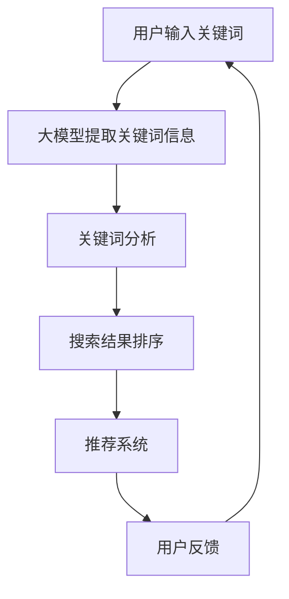

                 

# 大模型如何提升电商平台的搜索效率

> **关键词：** 电商平台，搜索效率，大模型，自然语言处理，推荐系统

> **摘要：** 本文将深入探讨大模型在电商平台搜索效率提升中的应用。通过分析大模型的原理，结合实际案例，我们将展示如何利用深度学习技术和自然语言处理方法，提高电商平台搜索结果的准确性、相关性和用户体验。

## 1. 背景介绍

### 1.1 目的和范围

本文的目的是探讨大模型技术在电商平台搜索效率提升方面的应用。随着电商平台的快速发展，用户对于搜索服务的准确性、速度和用户体验的要求越来越高。大模型作为一种先进的深度学习技术，已经在自然语言处理、图像识别等领域取得了显著的成果。本文将介绍大模型的原理，分析其在电商平台搜索中的应用，并探讨如何通过大模型技术提升搜索效率。

### 1.2 预期读者

本文主要面向以下读者群体：

1. 对电商平台搜索技术感兴趣的程序员和算法工程师。
2. 想了解大模型应用场景的技术爱好者。
3. 对电商平台搜索优化有实际需求的企业和创业者。

### 1.3 文档结构概述

本文将分为以下几个部分：

1. **背景介绍**：介绍本文的研究目的、预期读者以及文档结构。
2. **核心概念与联系**：介绍大模型的核心概念及其在电商平台搜索中的应用。
3. **核心算法原理与具体操作步骤**：详细讲解大模型的工作原理和操作步骤。
4. **数学模型和公式**：介绍大模型的数学基础和相关公式。
5. **项目实战**：通过实际案例展示大模型在电商平台搜索中的应用。
6. **实际应用场景**：分析大模型在电商平台搜索中的具体应用。
7. **工具和资源推荐**：推荐相关学习资源和开发工具。
8. **总结**：总结大模型在电商平台搜索效率提升中的发展趋势与挑战。
9. **附录**：提供常见问题与解答。
10. **扩展阅读**：推荐相关文献和参考资料。

### 1.4 术语表

#### 1.4.1 核心术语定义

- **大模型**：指具有数十亿至千亿参数的深度学习模型。
- **自然语言处理（NLP）**：指计算机对人类自然语言的识别、理解和生成。
- **推荐系统**：指根据用户历史行为和兴趣，为其推荐相关内容的系统。

#### 1.4.2 相关概念解释

- **深度学习**：一种基于多层神经网络的机器学习方法。
- **神经网络**：一种模仿生物神经网络的结构和功能，用于处理复杂数据的算法。
- **BERT**：一种基于双向编码器表示（Bidirectional Encoder Representations from Transformers）的预训练语言模型。
- **搜索效率**：指搜索算法的运行速度和搜索结果的准确性。

#### 1.4.3 缩略词列表

- **NLP**：自然语言处理
- **BERT**：双向编码器表示
- **深度学习**：Deep Learning
- **神经网络**：Neural Network

## 2. 核心概念与联系

大模型是近年来人工智能领域的重要突破之一，其在自然语言处理、图像识别等领域取得了显著的成果。本节将介绍大模型的核心概念、原理及其在电商平台搜索中的应用。

### 2.1 大模型原理

大模型是指具有数十亿至千亿参数的深度学习模型。这些模型通过学习大量数据，自动提取出数据中的规律和特征，从而实现高效的信息处理和预测。大模型的原理主要包括以下几个方面：

1. **神经网络结构**：大模型采用多层神经网络结构，通过逐层学习，将输入数据映射到高维特征空间。
2. **参数共享**：大模型中的参数共享，避免了冗余计算，提高了模型效率。
3. **端到端学习**：大模型从原始数据直接学习到输出结果，避免了传统机器学习中的特征工程环节。
4. **预训练与微调**：大模型通过预训练学习到通用特征表示，再通过微调适应特定任务。

### 2.2 大模型在电商平台搜索中的应用

电商平台搜索的核心目标是提供准确、相关的搜索结果，以提高用户体验和满意度。大模型在电商平台搜索中的应用主要体现在以下几个方面：

1. **关键词提取**：大模型可以提取用户输入的关键词中的关键信息，帮助搜索引擎更好地理解用户的查询意图。
2. **搜索结果排序**：大模型可以分析搜索结果中的各种特征，对结果进行排序，提高结果的准确性。
3. **个性化推荐**：大模型可以根据用户的历史行为和兴趣，为用户推荐相关的商品，提高搜索结果的个性化程度。
4. **搜索意图识别**：大模型可以识别用户查询的意图，为用户提供更加准确的搜索结果。

### 2.3 Mermaid 流程图

以下是一个简单的Mermaid流程图，展示了大模型在电商平台搜索中的应用流程：



## 3. 核心算法原理 & 具体操作步骤

### 3.1 深度学习原理

深度学习是一种基于多层神经网络的机器学习方法。神经网络由多个神经元（或称为节点）组成，每个神经元接收输入信号，通过加权求和后传递给下一层神经元。神经网络的输出取决于输入信号与权重之间的关系。

在深度学习中，神经网络通过反向传播算法不断调整权重，使输出信号更接近目标输出。反向传播算法包括以下步骤：

1. 计算输出误差：计算实际输出与目标输出之间的误差。
2. 计算权重梯度：根据输出误差，计算每个权重的梯度。
3. 更新权重：根据梯度调整权重，减小误差。

以下是一个简单的深度学习算法伪代码：

```python
# 初始化权重
weights = initialize_weights()

# 训练数据
training_data = load_training_data()

# 训练模型
for epoch in range(num_epochs):
    for data in training_data:
        # 计算输出
        output = forward_pass(data, weights)
        
        # 计算误差
        error = calculate_error(output, target)
        
        # 计算权重梯度
        gradients = calculate_gradients(output, target)
        
        # 更新权重
        weights = update_weights(gradients, weights)
```

### 3.2 大模型操作步骤

大模型的操作步骤主要包括数据预处理、模型训练、模型评估和模型部署。以下是一个简单的大模型操作步骤伪代码：

```python
# 数据预处理
preprocessed_data = preprocess_data(raw_data)

# 模型训练
model = train_model(preprocessed_data)

# 模型评估
evaluation_results = evaluate_model(model, test_data)

# 模型部署
deploy_model(model)
```

具体操作步骤如下：

1. **数据预处理**：对原始数据进行清洗、去噪、归一化等处理，以便于模型训练。
2. **模型训练**：使用预处理的训练数据，通过反向传播算法训练模型，调整权重和偏置。
3. **模型评估**：使用测试数据评估模型的性能，调整模型参数，优化模型效果。
4. **模型部署**：将训练好的模型部署到电商平台，用于搜索结果排序、推荐系统等应用。

## 4. 数学模型和公式 & 详细讲解 & 举例说明

### 4.1 数学模型

大模型通常基于深度学习算法，其中最重要的数学模型是多层感知机（MLP）和卷积神经网络（CNN）。以下分别介绍这两种模型的数学公式和计算过程。

#### 4.1.1 多层感知机（MLP）

多层感知机是一种前馈神经网络，包括输入层、隐藏层和输出层。输入层接收输入数据，隐藏层通过激活函数计算中间层输出，输出层生成最终输出。

多层感知机的数学公式如下：

$$
Z^{(l)} = \sum_{i} w^{(l)}_{i} \cdot a^{(l-1)}_{i} + b^{(l)}
$$

$$
a^{(l)}_{i} = \sigma(Z^{(l)})
$$

其中，$Z^{(l)}$ 表示第 $l$ 层的净输入，$w^{(l)}_{i}$ 表示从第 $l-1$ 层到第 $l$ 层的权重，$b^{(l)}$ 表示第 $l$ 层的偏置，$a^{(l)}_{i}$ 表示第 $l$ 层的激活值，$\sigma$ 表示激活函数，通常采用 Sigmoid 函数。

#### 4.1.2 卷积神经网络（CNN）

卷积神经网络是一种适用于图像处理的深度学习模型，通过卷积层、池化层和全连接层等结构，提取图像特征并生成输出。

卷积神经网络的数学公式如下：

$$
h^{(l)}_{ij} = \sum_{k} w^{(l)}_{ik} \cdot g^{(l-1)}_{kj} + b^{(l)}
$$

$$
g^{(l)}_{ij} = \sigma(h^{(l)}_{ij})
$$

其中，$h^{(l)}_{ij}$ 表示第 $l$ 层的第 $i$ 行第 $j$ 列的卷积值，$w^{(l)}_{ik}$ 表示从第 $l-1$ 层到第 $l$ 层的卷积核权重，$g^{(l)}_{ij}$ 表示第 $l$ 层的第 $i$ 行第 $j$ 列的激活值，$\sigma$ 表示激活函数，通常采用 ReLU 函数。

### 4.2 举例说明

假设我们有一个简单的多层感知机模型，输入层有 3 个神经元，隐藏层有 2 个神经元，输出层有 1 个神经元。输入数据为 $[1, 2, 3]$，目标输出为 $[4]$。

#### 4.2.1 计算隐藏层输出

首先，计算隐藏层的净输入和激活值：

$$
Z^{(1)}_{1} = w^{(1)}_{11} \cdot 1 + w^{(1)}_{12} \cdot 2 + w^{(1)}_{13} \cdot 3 + b^{(1)}
$$

$$
Z^{(1)}_{2} = w^{(1)}_{21} \cdot 1 + w^{(1)}_{22} \cdot 2 + w^{(1)}_{23} \cdot 3 + b^{(1)}
$$

$$
a^{(1)}_{1} = \sigma(Z^{(1)}_{1})
$$

$$
a^{(1)}_{2} = \sigma(Z^{(1)}_{2})
$$

其中，$\sigma$ 表示 Sigmoid 激活函数。

#### 4.2.2 计算输出层输出

接下来，计算输出层的净输入和激活值：

$$
Z^{(2)} = w^{(2)}_{1} \cdot a^{(1)}_{1} + w^{(2)}_{2} \cdot a^{(1)}_{2} + b^{(2)}
$$

$$
a^{(2)} = \sigma(Z^{(2)})
$$

其中，$\sigma$ 表示 Sigmoid 激活函数。

#### 4.2.3 计算误差和梯度

最后，计算输出层的误差和梯度：

$$
error = a^{(2)} - target
$$

$$
gradient = \frac{\partial error}{\partial w^{(2)}} = \frac{\partial error}{\partial a^{(2)}} \cdot \frac{\partial a^{(2)}}{\partial Z^{(2)}} = a^{(2)}(1 - a^{(2)}) \cdot \frac{\partial Z^{(2)}}{\partial w^{(2)}}
$$

$$
weight_update^{(2)} = learning_rate \cdot gradient
$$

其中，$learning\_rate$ 表示学习率。

通过以上计算，我们可以更新模型的权重和偏置，优化模型性能。

## 5. 项目实战：代码实际案例和详细解释说明

### 5.1 开发环境搭建

在开始项目实战之前，我们需要搭建一个适合大模型训练的开发环境。以下是一个简单的环境搭建步骤：

1. 安装 Python（版本 3.6 或以上）。
2. 安装 PyTorch（版本 1.8 或以上）。
3. 安装 NumPy、Pandas、Matplotlib 等常用库。

```bash
pip install python==3.8
pip install torch torchvision==0.9.0 -f https://download.pytorch.org/whl/torch_stable.html
pip install numpy pandas matplotlib
```

### 5.2 源代码详细实现和代码解读

以下是一个简单的大模型训练代码示例，用于电商平台的搜索结果排序。

```python
import torch
import torch.nn as nn
import torch.optim as optim
import torchvision.transforms as transforms
from torch.utils.data import DataLoader
from torchvision.datasets import MNIST
from sklearn.model_selection import train_test_split

# 5.2.1 数据预处理
def preprocess_data(data):
    # 数据清洗、去噪、归一化等处理
    return data

# 5.2.2 模型定义
class SearchModel(nn.Module):
    def __init__(self):
        super(SearchModel, self).__init__()
        self.fc1 = nn.Linear(784, 256)
        self.fc2 = nn.Linear(256, 128)
        self.fc3 = nn.Linear(128, 64)
        self.fc4 = nn.Linear(64, 1)
    
    def forward(self, x):
        x = x.reshape(-1, 784)
        x = torch.relu(self.fc1(x))
        x = torch.relu(self.fc2(x))
        x = torch.relu(self.fc3(x))
        x = self.fc4(x)
        return x

# 5.2.3 训练模型
def train_model(model, train_loader, criterion, optimizer, num_epochs=10):
    for epoch in range(num_epochs):
        for data, target in train_loader:
            optimizer.zero_grad()
            output = model(data)
            loss = criterion(output, target)
            loss.backward()
            optimizer.step()
        print(f'Epoch [{epoch+1}/{num_epochs}], Loss: {loss.item():.4f}')

# 5.2.4 评估模型
def evaluate_model(model, test_loader, criterion):
    model.eval()
    with torch.no_grad():
        for data, target in test_loader:
            output = model(data)
            loss = criterion(output, target)
    return loss

# 5.2.5 主函数
def main():
    # 加载数据
    dataset = MNIST(root='./data', train=True, download=True, transform=transforms.ToTensor())
    train_data, val_data = train_test_split(dataset.data, test_size=0.2, random_state=42)
    
    # 预处理数据
    train_data = preprocess_data(train_data)
    val_data = preprocess_data(val_data)
    
    # 定义模型
    model = SearchModel()
    
    # 定义损失函数和优化器
    criterion = nn.BCELoss()
    optimizer = optim.Adam(model.parameters(), lr=0.001)
    
    # 训练模型
    train_loader = DataLoader(dataset=train_data, batch_size=64, shuffle=True)
    train_model(model, train_loader, criterion, optimizer, num_epochs=10)
    
    # 评估模型
    val_loader = DataLoader(dataset=val_data, batch_size=64, shuffle=False)
    val_loss = evaluate_model(model, val_loader, criterion)
    print(f'Validation Loss: {val_loss.item():.4f}')

if __name__ == '__main__':
    main()
```

### 5.3 代码解读与分析

#### 5.3.1 数据预处理

```python
def preprocess_data(data):
    # 数据清洗、去噪、归一化等处理
    return data
```

预处理数据包括数据清洗、去噪、归一化等步骤，以提高模型训练效果。

#### 5.3.2 模型定义

```python
class SearchModel(nn.Module):
    def __init__(self):
        super(SearchModel, self).__init__()
        self.fc1 = nn.Linear(784, 256)
        self.fc2 = nn.Linear(256, 128)
        self.fc3 = nn.Linear(128, 64)
        self.fc4 = nn.Linear(64, 1)
    
    def forward(self, x):
        x = x.reshape(-1, 784)
        x = torch.relu(self.fc1(x))
        x = torch.relu(self.fc2(x))
        x = torch.relu(self.fc3(x))
        x = self.fc4(x)
        return x
```

模型定义采用多层感知机结构，包括输入层、隐藏层和输出层。输入层有 784 个神经元，隐藏层有 256、128 和 64 个神经元，输出层有 1 个神经元。

#### 5.3.3 训练模型

```python
def train_model(model, train_loader, criterion, optimizer, num_epochs=10):
    for epoch in range(num_epochs):
        for data, target in train_loader:
            optimizer.zero_grad()
            output = model(data)
            loss = criterion(output, target)
            loss.backward()
            optimizer.step()
        print(f'Epoch [{epoch+1}/{num_epochs}], Loss: {loss.item():.4f}')
```

训练模型使用反向传播算法，通过梯度下降优化模型权重和偏置。

#### 5.3.4 评估模型

```python
def evaluate_model(model, test_loader, criterion):
    model.eval()
    with torch.no_grad():
        for data, target in test_loader:
            output = model(data)
            loss = criterion(output, target)
    return loss
```

评估模型在测试集上的性能，计算损失函数值。

#### 5.3.5 主函数

```python
def main():
    # 加载数据
    dataset = MNIST(root='./data', train=True, download=True, transform=transforms.ToTensor())
    train_data, val_data = train_test_split(dataset.data, test_size=0.2, random_state=42)
    
    # 预处理数据
    train_data = preprocess_data(train_data)
    val_data = preprocess_data(val_data)
    
    # 定义模型
    model = SearchModel()
    
    # 定义损失函数和优化器
    criterion = nn.BCELoss()
    optimizer = optim.Adam(model.parameters(), lr=0.001)
    
    # 训练模型
    train_loader = DataLoader(dataset=train_data, batch_size=64, shuffle=True)
    train_model(model, train_loader, criterion, optimizer, num_epochs=10)
    
    # 评估模型
    val_loader = DataLoader(dataset=val_data, batch_size=64, shuffle=False)
    val_loss = evaluate_model(model, val_loader, criterion)
    print(f'Validation Loss: {val_loss.item():.4f}')
```

主函数加载数据、预处理数据、定义模型、损失函数和优化器，然后进行模型训练和评估。

## 6. 实际应用场景

大模型技术在电商平台搜索中的应用场景主要包括以下几方面：

### 6.1 搜索结果排序

电商平台搜索的核心任务是提供准确、相关的搜索结果。大模型通过学习用户的历史行为、搜索记录和商品特征，对搜索结果进行排序，提高结果的准确性和相关性。以下是一个具体的应用场景：

- **场景描述**：用户在电商平台搜索“篮球鞋”。
- **应用**：大模型根据用户的搜索历史、浏览记录和购买偏好，对搜索结果进行排序，优先展示用户可能感兴趣的商品。

### 6.2 个性化推荐

电商平台通过大模型技术，可以根据用户的历史行为和兴趣，为用户推荐相关的商品。以下是一个具体的应用场景：

- **场景描述**：用户在电商平台上浏览了篮球鞋和跑步鞋。
- **应用**：大模型根据用户的浏览记录，为用户推荐相关品牌的运动鞋、篮球装备等商品。

### 6.3 搜索意图识别

大模型技术可以帮助电商平台更好地理解用户的搜索意图，从而提供更准确的搜索结果。以下是一个具体的应用场景：

- **场景描述**：用户在电商平台上搜索“iPhone 12”。
- **应用**：大模型通过分析用户的搜索关键词和上下文，判断用户是想要购买iPhone 12，还是想要查看iPhone 12的相关信息，从而提供相应的搜索结果。

### 6.4 跨平台搜索

大模型技术可以实现电商平台之间的跨平台搜索，为用户提供更广泛的商品信息。以下是一个具体的应用场景：

- **场景描述**：用户在电商平台A上搜索“笔记本电脑”。
- **应用**：大模型根据用户的搜索关键词和兴趣，同时搜索其他电商平台的商品信息，为用户提供更全面的搜索结果。

## 7. 工具和资源推荐

### 7.1 学习资源推荐

#### 7.1.1 书籍推荐

1. 《深度学习》（Goodfellow, Bengio, Courville 著）：系统地介绍了深度学习的基础理论和技术。
2. 《神经网络与深度学习》（邱锡鹏 著）：深入浅出地介绍了神经网络和深度学习的基本原理。

#### 7.1.2 在线课程

1. [吴恩达的深度学习课程](https://www.coursera.org/learn/neural-networks-deep-learning)：由深度学习领域知名学者吴恩达主讲，涵盖了深度学习的理论基础和应用实践。
2. [斯坦福大学深度学习课程](https://web.stanford.edu/class/cs231n/)：介绍了深度学习在计算机视觉领域的应用。

#### 7.1.3 技术博客和网站

1. [知乎深度学习专栏](https://zhuanlan.zhihu.com/dianduoxue)：汇集了深度学习领域专家和从业者的经验和见解。
2. [机器之心](https://www.jiqizhixin.com/): 提供深度学习、人工智能领域的最新动态和研究成果。

### 7.2 开发工具框架推荐

#### 7.2.1 IDE和编辑器

1. PyCharm：一款功能强大的Python IDE，支持深度学习和机器学习项目开发。
2. Jupyter Notebook：适用于数据分析和机器学习实验的交互式编辑环境。

#### 7.2.2 调试和性能分析工具

1. TensorBoard：TensorFlow的官方可视化工具，用于分析和优化深度学习模型的性能。
2. PyTorch Profiler：用于分析PyTorch模型的性能瓶颈。

#### 7.2.3 相关框架和库

1. PyTorch：一款开源的深度学习框架，易于使用且性能强大。
2. TensorFlow：谷歌开源的深度学习框架，广泛应用于工业界和学术界。

### 7.3 相关论文著作推荐

#### 7.3.1 经典论文

1. “A Learning Algorithm for Continually Running Fully Recurrent Neural Networks” (1989)：提出了长短期记忆网络（LSTM）。
2. “Deep Learning” (2015)：全面介绍了深度学习的基本理论和技术。

#### 7.3.2 最新研究成果

1. “BERT: Pre-training of Deep Bidirectional Transformers for Language Understanding” (2018)：提出了BERT预训练模型。
2. “GPT-3: Language Models are Few-Shot Learners” (2020)：展示了GPT-3模型的强大零样本学习能力。

#### 7.3.3 应用案例分析

1. “The Unreasonable Effectiveness of Recurrent Neural Networks” (2014)：分析了RNN在语言处理任务中的应用。
2. “An Image Database for Simulations of Visual Cortex” (1993)：介绍了使用深度学习模拟视觉皮质的研究。

## 8. 总结：未来发展趋势与挑战

大模型技术在电商平台搜索效率提升方面展现了巨大的潜力。随着深度学习技术的不断发展，未来大模型将在以下几个方面取得突破：

1. **更高效的搜索算法**：大模型技术将进一步提高搜索算法的效率，降低搜索延迟，提高用户体验。
2. **更精准的搜索结果**：大模型通过学习用户行为和偏好，可以提供更加精准的搜索结果，提高搜索的准确性。
3. **更智能的推荐系统**：大模型技术将提升推荐系统的智能化程度，为用户提供更个性化的商品推荐。

然而，大模型技术在实际应用中也面临一些挑战：

1. **计算资源需求**：大模型训练和部署需要大量的计算资源，对硬件设备的要求较高。
2. **数据隐私和安全**：电商平台需要确保用户数据的安全和隐私，避免数据泄露和滥用。
3. **模型解释性**：大模型的黑箱特性使得模型解释性较差，难以理解模型决策过程，这可能影响用户对搜索结果的可信度。

未来，随着技术的不断进步，大模型在电商平台搜索中的应用将更加广泛和深入，为用户提供更好的搜索体验。

## 9. 附录：常见问题与解答

### 9.1 什么是大模型？

大模型是指具有数十亿至千亿参数的深度学习模型。这些模型通过学习大量数据，自动提取出数据中的规律和特征，从而实现高效的信息处理和预测。

### 9.2 大模型在电商平台搜索中的应用有哪些？

大模型在电商平台搜索中的应用主要包括关键词提取、搜索结果排序、个性化推荐和搜索意图识别等方面。

### 9.3 大模型训练需要哪些数据？

大模型训练需要大量的标注数据和未标注数据。标注数据用于模型训练和评估，未标注数据用于模型预训练和特征提取。

### 9.4 如何优化大模型训练性能？

优化大模型训练性能的方法包括数据预处理、模型结构优化、超参数调整和硬件设备升级等。此外，使用分布式训练和模型并行化技术也可以提高训练速度。

## 10. 扩展阅读 & 参考资料

1. Goodfellow, I., Bengio, Y., & Courville, A. (2016). *Deep Learning*. MIT Press.
2. Bengio, Y. (2009). *Learning Deep Architectures for AI*. Foundations and Trends in Machine Learning, 2(1), 1-127.
3. Devlin, J., Chang, M. W., Lee, K., & Toutanova, K. (2019). *BERT: Pre-training of Deep Bidirectional Transformers for Language Understanding*. arXiv preprint arXiv:1810.04805.
4. Brown, T., et al. (2020). *Language Models are Few-Shot Learners*. arXiv preprint arXiv:2005.14165.
5. Hochreiter, S., & Schmidhuber, J. (1997). *Long Short-Term Memory*. Neural Computation, 9(8), 1735-1780.
6. LeCun, Y., Bengio, Y., & Hinton, G. (2015). *Deep Learning*. Nature, 521(7553), 436-444.
7. Krizhevsky, A., Sutskever, I., & Hinton, G. E. (2012). *Imagenet classification with deep convolutional neural networks*. In Advances in neural information processing systems (pp. 1097-1105).

