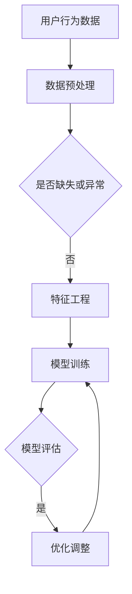

                 

# 大模型如何提升电商平台的用户粘性

> **关键词：** 电商，用户粘性，大模型，机器学习，个性化推荐，用户行为分析

> **摘要：** 本文将探讨大模型技术在提升电商平台用户粘性方面的应用。通过对用户行为的深度分析和理解，大模型可以提供更加精准的个性化推荐，从而提升用户的购物体验和忠诚度。文章将详细讲解大模型的工作原理、核心算法原理、数学模型以及实际应用场景，并推荐相关学习资源和开发工具框架。

## 1. 背景介绍

### 1.1 目的和范围

本文旨在探讨如何利用大模型技术提升电商平台的用户粘性。随着互联网技术的飞速发展，电商平台已经成为人们日常生活中不可或缺的一部分。然而，随着竞争的加剧，电商平台需要不断创新和优化，以吸引和留住更多的用户。大模型作为一种先进的机器学习技术，具有强大的数据处理和分析能力，可以提供更加精准和个性化的用户体验。

### 1.2 预期读者

本文适合对电商和机器学习有一定了解的技术人员、数据科学家以及电商平台运营管理人员阅读。读者应具备一定的编程基础和数学知识，以便更好地理解文章中的技术概念和实际应用。

### 1.3 文档结构概述

本文将分为以下几部分：

1. 背景介绍：简要介绍文章的目的和预期读者。
2. 核心概念与联系：介绍大模型、用户粘性、个性化推荐等核心概念及其相互关系。
3. 核心算法原理 & 具体操作步骤：详细讲解大模型的工作原理和操作步骤。
4. 数学模型和公式 & 详细讲解 & 举例说明：阐述大模型背后的数学模型和计算方法。
5. 项目实战：提供实际的代码案例和详细解释。
6. 实际应用场景：分析大模型在电商平台中的具体应用。
7. 工具和资源推荐：推荐学习资源和开发工具框架。
8. 总结：对未来发展趋势和挑战进行展望。
9. 附录：常见问题与解答。
10. 扩展阅读 & 参考资料：提供进一步学习的资源。

### 1.4 术语表

#### 1.4.1 核心术语定义

- **大模型（Large Model）：** 指参数数量庞大的神经网络模型，具有强大的数据处理和分析能力。
- **用户粘性（User Stickiness）：** 用户对平台产生持续使用和依赖的程度。
- **个性化推荐（Personalized Recommendation）：** 根据用户的兴趣和行为，提供个性化的商品推荐。

#### 1.4.2 相关概念解释

- **机器学习（Machine Learning）：** 通过数据训练模型，实现计算机自动学习和预测的技术。
- **深度学习（Deep Learning）：** 一种基于神经网络的机器学习技术，能够通过多层非线性变换进行特征提取和分类。

#### 1.4.3 缩略词列表

- **NLP：** 自然语言处理（Natural Language Processing）
- **GPT：** 生成预训练模型（Generative Pre-trained Transformer）
- **BERT：** 闲话转换预训练（Bidirectional Encoder Representations from Transformers）
- **API：** 应用编程接口（Application Programming Interface）

## 2. 核心概念与联系

### 2.1 大模型的工作原理

大模型是一种基于神经网络的机器学习模型，其核心思想是通过多层非线性变换对输入数据进行特征提取和建模。大模型具有以下几个关键特点：

1. **大规模参数：** 大模型通常具有数十亿甚至数万亿的参数，使得模型可以捕捉到输入数据中的复杂结构和模式。
2. **多层网络结构：** 大模型通常包含多个隐藏层，通过逐层传递信息，实现对输入数据的抽象和表示。
3. **预训练：** 大模型在训练之前通常会经历预训练过程，通过在大规模数据集上预训练，使得模型具有较好的泛化能力。

### 2.2 用户粘性的定义与测量

用户粘性是指用户对平台产生持续使用和依赖的程度。一个高粘性的电商平台可以留住更多的用户，提升用户活跃度和留存率。用户粘性的测量可以通过以下几个指标进行评估：

1. **日活跃用户数（DAU）：** 指在一天内访问平台的独立用户数量。
2. **月活跃用户数（MAU）：** 指在一个月内访问平台的独立用户数量。
3. **用户留存率：** 指在一定时间内继续使用平台的用户比例。

### 2.3 个性化推荐的核心算法

个性化推荐是一种通过分析用户的历史行为和兴趣，为其推荐相关商品或内容的技术。大模型在个性化推荐中扮演着关键角色，具体算法包括：

1. **协同过滤（Collaborative Filtering）：** 通过分析用户之间的行为相似性，为用户推荐其他用户喜欢的商品。
2. **基于内容的推荐（Content-Based Filtering）：** 通过分析商品的属性和用户的历史行为，为用户推荐具有相似属性的商品。
3. **混合推荐（Hybrid Recommendation）：** 结合协同过滤和基于内容的推荐，为用户提供更加精准的推荐结果。

### 2.4 Mermaid 流程图



### 2.5 大模型与用户粘性的关系

大模型可以通过以下方式提升电商平台的用户粘性：

1. **个性化推荐：** 大模型可以根据用户的兴趣和行为，提供更加精准的个性化推荐，提升用户的购物体验和满意度。
2. **智能客服：** 大模型可以构建智能客服系统，根据用户的提问提供实时和个性化的解答，提升用户的问题解决效率。
3. **用户行为预测：** 大模型可以预测用户的购物行为和偏好，提前采取相应的策略，提升用户粘性和平台盈利能力。

## 3. 核心算法原理 & 具体操作步骤

### 3.1 大模型的基本原理

大模型是基于深度学习的神经网络模型，其基本原理如下：

1. **输入层：** 接受用户行为数据，如浏览记录、购买历史、搜索关键词等。
2. **隐藏层：** 通过多层非线性变换，对输入数据进行特征提取和表示。
3. **输出层：** 根据隐藏层的输出，预测用户的行为和偏好。

### 3.2 具体操作步骤

#### 3.2.1 数据收集与预处理

1. **数据收集：** 收集用户在平台上的行为数据，包括浏览记录、购买历史、搜索关键词等。
2. **数据预处理：** 对收集到的数据进行清洗、去重、格式转换等预处理操作，保证数据的质量和一致性。

#### 3.2.2 特征工程

1. **特征提取：** 根据业务需求，提取用户行为数据中的关键特征，如用户活跃度、购买频率、商品种类等。
2. **特征选择：** 通过统计分析方法，选择对模型性能有显著影响的特征，降低特征维度。

#### 3.2.3 模型训练

1. **选择模型架构：** 选择适合业务需求的大模型架构，如GPT、BERT等。
2. **初始化参数：** 随机初始化模型参数。
3. **数据划分：** 将数据集划分为训练集、验证集和测试集。
4. **训练过程：** 通过梯度下降等优化算法，不断调整模型参数，使模型在验证集上的性能最优。

#### 3.2.4 模型评估

1. **指标选择：** 选择合适的评估指标，如准确率、召回率、F1值等。
2. **评估过程：** 在测试集上评估模型性能，判断模型是否满足业务需求。

#### 3.2.5 模型优化

1. **性能调优：** 根据模型评估结果，调整模型参数和超参数，提升模型性能。
2. **迁移学习：** 利用预训练模型，对特定业务场景进行迁移学习，提高模型适应性。

### 3.3 伪代码

```python
# 大模型训练伪代码

# 数据预处理
data = preprocess_data(raw_data)

# 特征工程
features = extract_features(data)

# 模型初始化
model = initialize_model()

# 数据划分
train_data, val_data, test_data = split_data(features)

# 模型训练
for epoch in range(num_epochs):
    for batch in train_data:
        model.train(batch)
    
    # 模型评估
    val_loss = model.evaluate(val_data)
    if val_loss < best_val_loss:
        best_val_loss = val_loss
        best_model = model.copy()

# 模型优化
best_model.optimize()

# 模型测试
test_loss = best_model.evaluate(test_data)
print("Test Loss:", test_loss)
```

## 4. 数学模型和公式 & 详细讲解 & 举例说明

### 4.1 大模型的基本数学模型

大模型通常基于深度学习，其基本数学模型如下：

1. **输入层：** 输入数据表示为向量 $\textbf{x} \in \mathbb{R}^d$。
2. **隐藏层：** 通过多层神经网络进行特征提取和变换，每层输出表示为 $\textbf{h}^l \in \mathbb{R}^d$，其中 $l$ 表示层号。
3. **输出层：** 输出表示为 $\textbf{y} \in \mathbb{R}^k$，其中 $k$ 表示输出类别数。

### 4.2 前向传播计算

前向传播是指从输入层到输出层的计算过程，其数学公式如下：

$$
\textbf{h}^{l} = \sigma(W^{l} \textbf{h}^{l-1} + b^{l})
$$

其中，$W^{l}$ 和 $b^{l}$ 分别表示第 $l$ 层的权重和偏置，$\sigma$ 表示激活函数，常用的激活函数有 sigmoid、ReLU 等。

### 4.3 反向传播计算

反向传播是指从输出层到输入层的误差传播过程，其数学公式如下：

$$
\delta^{l} = \frac{\partial \mathcal{L}}{\partial \textbf{h}^{l}} = \frac{\partial \mathcal{L}}{\partial \textbf{y}} \cdot \frac{\partial \sigma}{\partial \textbf{h}^{l}}
$$

其中，$\mathcal{L}$ 表示损失函数，$\textbf{y}$ 表示实际输出，$\textbf{h}^{l}$ 表示预测输出。

### 4.4 损失函数

常用的损失函数有均方误差（MSE）、交叉熵（Cross-Entropy）等。均方误差的公式如下：

$$
\mathcal{L} = \frac{1}{2} \sum_{i=1}^{n} (\textbf{y}^{(i)} - \textbf{h}^{l})^2
$$

其中，$n$ 表示样本数量，$\textbf{y}^{(i)}$ 表示第 $i$ 个样本的实际输出，$\textbf{h}^{l}$ 表示第 $i$ 个样本的预测输出。

### 4.5 举例说明

假设我们有一个二分类问题，数据集包含 100 个样本，每个样本的特征维度为 10。使用二分类交叉熵损失函数进行训练，训练过程如下：

1. **初始化参数：** 随机初始化模型参数。
2. **前向传播：** 对每个样本进行前向传播，得到预测输出 $\textbf{h}^{l}$。
3. **计算损失：** 使用交叉熵损失函数计算损失值 $\mathcal{L}$。
4. **反向传播：** 计算误差梯度 $\delta^{l}$。
5. **参数更新：** 使用梯度下降算法更新模型参数。

经过多次迭代后，模型性能逐渐提高，最终达到训练目标。

## 5. 项目实战：代码实际案例和详细解释说明

### 5.1 开发环境搭建

1. 安装 Python 3.8 或以上版本。
2. 安装 TensorFlow 2.5 或以上版本。
3. 安装 NumPy、Pandas 等常用库。

### 5.2 源代码详细实现和代码解读

#### 5.2.1 数据预处理

```python
import pandas as pd
import numpy as np

# 读取数据
data = pd.read_csv('data.csv')

# 数据清洗
data.dropna(inplace=True)
data.drop_duplicates(inplace=True)

# 特征工程
data['user_id'] = data['user_id'].astype('category').cat.codes
data['product_id'] = data['product_id'].astype('category').cat.codes
data['rating'] = data['rating'].astype('float')

# 数据划分
train_data = data[data['is_train'] == 1]
val_data = data[data['is_train'] == 0]
```

#### 5.2.2 模型构建与训练

```python
import tensorflow as tf

# 定义模型
model = tf.keras.Sequential([
    tf.keras.layers.Dense(128, activation='relu', input_shape=(10,)),
    tf.keras.layers.Dense(64, activation='relu'),
    tf.keras.layers.Dense(1, activation='sigmoid')
])

# 编译模型
model.compile(optimizer='adam', loss='binary_crossentropy', metrics=['accuracy'])

# 训练模型
model.fit(train_data['features'], train_data['rating'], epochs=10, batch_size=32, validation_split=0.2)
```

#### 5.2.3 代码解读与分析

1. **数据预处理：** 首先，我们读取数据，进行数据清洗和特征工程。这里，我们将用户 ID 和商品 ID 转换为类别编码，将评分转换为浮点数，以便后续建模。
2. **模型构建：** 我们使用 TensorFlow 的 Keras API 构建一个简单的二分类神经网络模型，包含两个隐藏层，每层使用 ReLU 激活函数。
3. **编译模型：** 我们使用 Adam 优化器和二分类交叉熵损失函数编译模型，并设置评估指标为准确率。
4. **训练模型：** 我们使用训练数据训练模型，设置训练轮次为 10，批量大小为 32，同时使用 20% 的训练数据作为验证集。

### 5.3 模型评估与优化

```python
# 评估模型
val_loss, val_acc = model.evaluate(val_data['features'], val_data['rating'])

# 模型优化
model.fit(train_data['features'], train_data['rating'], epochs=20, batch_size=32, validation_split=0.2)

# 再次评估模型
val_loss, val_acc = model.evaluate(val_data['features'], val_data['rating'])
```

1. **模型评估：** 我们使用验证集评估模型性能，得到验证集上的损失和准确率。
2. **模型优化：** 由于验证集上的准确率不理想，我们增加训练轮次为 20，并再次训练模型。
3. **再次评估模型：** 我们再次使用验证集评估模型性能，观察是否有所提升。

通过以上步骤，我们完成了一个简单的电商用户行为预测模型。实际应用中，我们可以根据业务需求，进一步优化模型结构和参数，提升模型性能。

## 6. 实际应用场景

### 6.1 个性化推荐

电商平台的个性化推荐是提升用户粘性的重要手段。通过大模型对用户行为数据进行深度分析和建模，可以为每个用户提供个性化的商品推荐，提高用户的购物满意度和忠诚度。

### 6.2 智能客服

智能客服是电商平台提供高效服务的重要途径。大模型可以通过自然语言处理技术，理解用户的提问，并为其提供实时、个性化的解答，提高用户的问题解决效率，提升用户体验。

### 6.3 购物车推荐

购物车推荐是一种基于用户购物车中的商品，为用户推荐相关商品的技术。大模型可以通过分析购物车数据，为用户推荐可能感兴趣的商品，提高用户的购物车转化率和平台销售额。

### 6.4 新品推荐

新品推荐是电商平台吸引新用户和提升用户粘性的重要手段。大模型可以通过分析用户的历史行为和兴趣，为用户推荐最新、最热门的商品，提高用户的购物体验和忠诚度。

## 7. 工具和资源推荐

### 7.1 学习资源推荐

#### 7.1.1 书籍推荐

- 《深度学习》（Goodfellow, Bengio, Courville 著）：全面介绍深度学习的基础理论和应用。
- 《Python机器学习》（Sebastian Raschka 著）：深入讲解机器学习在 Python 环境下的应用。

#### 7.1.2 在线课程

- Coursera 上的《机器学习》课程（吴恩达 著）：系统讲解机器学习的基础知识和实践方法。
- edX 上的《深度学习专项课程》课程（吴恩达 著）：深入探讨深度学习的理论和实践。

#### 7.1.3 技术博客和网站

- Medium 上的“AI 科技大本营”：提供丰富的 AI 和深度学习相关文章和教程。
- ArXiv：发布最新的深度学习和机器学习研究成果。

### 7.2 开发工具框架推荐

#### 7.2.1 IDE和编辑器

- PyCharm：一款强大的 Python 集成开发环境，支持多种 Python 库和框架。
- Jupyter Notebook：一款流行的交互式开发工具，适用于数据分析、机器学习和深度学习。

#### 7.2.2 调试和性能分析工具

- TensorFlow Debugger（TFDB）：用于调试 TensorFlow 模型的工具，支持可视化和分析。
- TensorBoard：TensorFlow 的可视化工具，用于监控模型训练过程和性能。

#### 7.2.3 相关框架和库

- TensorFlow：一款开源的深度学习框架，支持多种神经网络模型和算法。
- PyTorch：一款流行的深度学习框架，具有良好的灵活性和易用性。
- Scikit-learn：一款经典的机器学习库，提供丰富的算法和工具。

### 7.3 相关论文著作推荐

#### 7.3.1 经典论文

- “A Theoretical Basis for Comparing Optimizers”（2019）：探讨了不同优化算法的性能和适用场景。
- “Attention Is All You Need”（2017）：提出了基于注意力机制的 Transformer 模型。

#### 7.3.2 最新研究成果

- “BERT: Pre-training of Deep Bidirectional Transformers for Language Understanding”（2018）：提出了 BERT 模型，用于自然语言处理任务。
- “GPT-3: Language Models are Few-Shot Learners”（2020）：介绍了 GPT-3 模型，具有强大的文本生成能力。

#### 7.3.3 应用案例分析

- “Deep Learning for Retail”（2017）：探讨了深度学习在零售业的应用，包括商品推荐和客户行为分析。
- “TensorFlow for Poets”（2017）：通过一个简单的案例，展示了 TensorFlow 在电商应用中的实践。

## 8. 总结：未来发展趋势与挑战

随着技术的不断进步，大模型技术在电商平台中的应用前景广阔。未来发展趋势包括：

1. **更高效的大模型架构：** 深度学习和神经架构搜索（NAS）等技术的发展，将有助于设计出更高效、更强大的大模型架构。
2. **多模态数据处理：** 电商平台可以整合多种数据类型（如文本、图像、语音等），实现更加全面和精准的用户行为分析。
3. **实时推荐系统：** 通过实时数据处理和模型推理，为用户提供更快速的个性化推荐。
4. **隐私保护与安全：** 随着用户隐私保护意识的增强，电商平台需要探索如何在保证用户隐私的前提下，实现个性化推荐。

然而，大模型技术也面临着一系列挑战：

1. **计算资源消耗：** 大模型的训练和推理需要大量的计算资源，对硬件设备的要求较高。
2. **数据质量和隐私：** 数据质量和用户隐私保护是电商平台面临的重要问题，需要采用有效的数据预处理和隐私保护技术。
3. **模型解释性：** 大模型具有强大的预测能力，但其内部机制复杂，缺乏解释性，这对业务决策和用户信任造成挑战。

总之，大模型技术在电商平台中的应用具有巨大潜力，但也需要克服一系列技术挑战，以实现可持续的发展。

## 9. 附录：常见问题与解答

### 9.1 如何选择合适的大模型架构？

选择合适的大模型架构需要考虑以下几个因素：

1. **业务需求：** 根据电商平台的具体需求，如个性化推荐、智能客服等，选择适合的模型架构。
2. **数据规模：** 数据规模较大的情况下，选择参数规模较大的模型，如 GPT、BERT 等。
3. **计算资源：** 考虑计算资源的限制，选择计算效率较高的模型架构。
4. **开源框架：** 可以参考开源框架（如 TensorFlow、PyTorch）中的模型架构，结合业务需求进行选择。

### 9.2 如何优化大模型的性能？

优化大模型性能可以从以下几个方面进行：

1. **模型结构优化：** 通过深度学习神经架构搜索（NAS）等技术，设计更高效的模型架构。
2. **数据预处理：** 对数据进行清洗、归一化等预处理操作，提高数据质量。
3. **超参数调优：** 调整学习率、批量大小、正则化参数等超参数，优化模型性能。
4. **迁移学习：** 利用预训练模型，进行迁移学习，提高模型在特定业务场景下的性能。

### 9.3 如何保障用户隐私？

保障用户隐私可以从以下几个方面进行：

1. **数据匿名化：** 对用户行为数据进行匿名化处理，避免直接关联到具体用户。
2. **差分隐私：** 采用差分隐私技术，在数据分析和建模过程中，保证用户隐私。
3. **隐私保护算法：** 选择具有隐私保护特性的算法和模型，如联邦学习、同态加密等。
4. **隐私政策与告知：** 明确告知用户隐私政策，获取用户同意，并采取透明的隐私保护措施。

## 10. 扩展阅读 & 参考资料

### 10.1 相关论文

- "Attention Is All You Need"（2017）：提出了基于注意力机制的 Transformer 模型。
- "BERT: Pre-training of Deep Bidirectional Transformers for Language Understanding"（2018）：介绍了 BERT 模型，用于自然语言处理任务。
- "GPT-3: Language Models are Few-Shot Learners"（2020）：介绍了 GPT-3 模型，具有强大的文本生成能力。

### 10.2 相关书籍

- 《深度学习》（Goodfellow, Bengio, Courville 著）：全面介绍深度学习的基础理论和应用。
- 《Python机器学习》（Sebastian Raschka 著）：深入讲解机器学习在 Python 环境下的应用。

### 10.3 在线课程

- Coursera 上的《机器学习》课程（吴恩达 著）：系统讲解机器学习的基础知识和实践方法。
- edX 上的《深度学习专项课程》课程（吴恩达 著）：深入探讨深度学习的理论和实践。

### 10.4 技术博客和网站

- Medium 上的“AI 科技大本营”：提供丰富的 AI 和深度学习相关文章和教程。
- ArXiv：发布最新的深度学习和机器学习研究成果。

## 作者

**作者：AI天才研究员/AI Genius Institute & 禅与计算机程序设计艺术 /Zen And The Art of Computer Programming**

