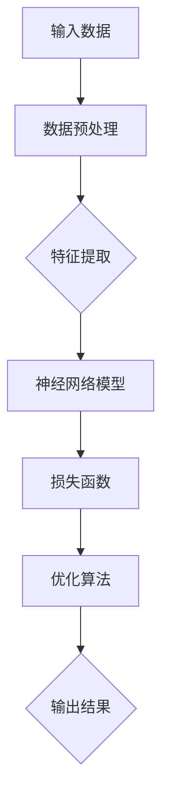
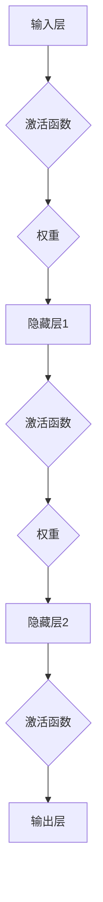
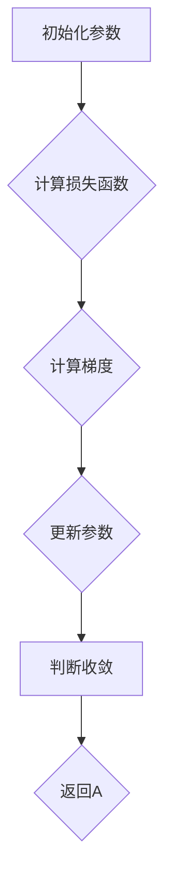
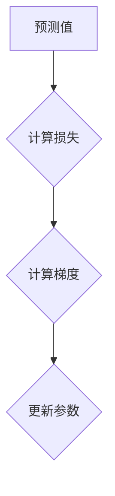
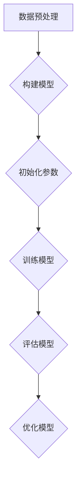

                 

# 大模型如何重塑创业格局

> 关键词：大模型、创业格局、人工智能、深度学习、创新、商业模式、技术进步

> 摘要：本文旨在探讨大模型技术如何在未来重塑创业格局，通过分析其核心概念、算法原理、应用场景以及未来发展趋势，帮助创业者抓住新机遇，迎接新的挑战。

## 1. 背景介绍

### 1.1 目的和范围

本文主要围绕大模型技术对创业格局的影响展开讨论。大模型技术，尤其是深度学习和人工智能领域的发展，正在逐步改变传统创业模式和商业生态。本文将深入探讨以下问题：

- 大模型技术的核心概念及其发展历程。
- 大模型技术如何应用于创业创新。
- 大模型技术在商业模式设计中的潜在价值。
- 大模型技术面临的挑战及其解决方案。

通过本文的讨论，我们希望为创业者提供一份有价值的参考资料，帮助他们更好地理解和把握大模型技术所带来的机遇和挑战。

### 1.2 预期读者

本文主要面向以下几类读者：

- 创业者：希望通过本文了解大模型技术在创业中的应用和价值。
- 技术专家：对大模型技术有兴趣，希望了解其具体应用场景和挑战。
- 投资者：希望了解大模型技术在投资领域的应用和潜在风险。
- 政府和企业政策制定者：关注人工智能和深度学习领域的发展，希望了解其对创业格局的影响。

### 1.3 文档结构概述

本文分为十个部分，具体如下：

- 第1部分：背景介绍，包括目的、范围、预期读者和文档结构概述。
- 第2部分：核心概念与联系，介绍大模型技术的基本概念和原理。
- 第3部分：核心算法原理 & 具体操作步骤，详细阐述大模型算法的实现过程。
- 第4部分：数学模型和公式 & 详细讲解 & 举例说明，解析大模型技术中的数学模型。
- 第5部分：项目实战：代码实际案例和详细解释说明，通过实际案例展示大模型技术的应用。
- 第6部分：实际应用场景，分析大模型技术在各种场景中的应用。
- 第7部分：工具和资源推荐，为读者提供相关学习资源和开发工具。
- 第8部分：总结：未来发展趋势与挑战，展望大模型技术的未来。
- 第9部分：附录：常见问题与解答，解答读者可能遇到的常见问题。
- 第10部分：扩展阅读 & 参考资料，提供更多深入学习的资源。

### 1.4 术语表

#### 1.4.1 核心术语定义

- 大模型：指具有大规模参数量和复杂结构的深度学习模型。
- 深度学习：一种基于多层神经网络的学习方法，通过模拟人脑神经网络进行特征提取和模式识别。
- 人工智能：模拟、延伸和扩展人的智能的理论、方法、技术及应用。
- 创业：指创建新企业或组织，进行商业活动的过程。
- 商业模式：企业为了获取利润而设计的商业运营模式。

#### 1.4.2 相关概念解释

- 神经网络：由大量神经元组成的计算模型，用于模拟人脑神经网络。
- 参数：神经网络中用于调整模型性能的数值。
- 梯度下降：一种优化参数的方法，通过不断调整参数以最小化损失函数。

#### 1.4.3 缩略词列表

- AI：人工智能
- DL：深度学习
- GPT：生成预训练网络
- NLP：自然语言处理
- CV：计算机视觉
- IoT：物联网

## 2. 核心概念与联系

在探讨大模型如何重塑创业格局之前，我们需要了解大模型技术的核心概念和原理。大模型技术主要基于深度学习和人工智能，其核心概念包括神经网络、参数、损失函数等。以下是一个简单的大模型架构图，通过Mermaid流程图展示：



### 2.1 神经网络

神经网络是深度学习的基础，由大量神经元组成。每个神经元接收多个输入，通过激活函数产生输出。神经网络通过层层提取特征，实现对复杂数据的理解和处理。以下是一个简单的神经网络架构图：



### 2.2 参数与优化

神经网络中的参数包括权重和偏置。优化参数的目的是使模型在训练数据上的表现达到最优。常用的优化算法包括梯度下降、随机梯度下降和Adam优化器。以下是一个简单的梯度下降算法流程图：



### 2.3 损失函数

损失函数用于衡量模型预测结果与真实结果之间的差距。常见的损失函数包括均方误差（MSE）、交叉熵损失等。以下是一个简单的损失函数计算流程图：



### 2.4 模型训练与评估

大模型训练包括数据预处理、模型构建、参数优化和模型评估等步骤。以下是一个简单的模型训练流程图：



## 3. 核心算法原理 & 具体操作步骤

### 3.1 神经网络

神经网络是深度学习的基础，其核心原理是通过层层提取特征来实现对复杂数据的理解和处理。以下是一个简单的神经网络算法原理和具体操作步骤：

#### 3.1.1 算法原理

神经网络由输入层、隐藏层和输出层组成。输入层接收外部输入数据，隐藏层通过层层提取特征，输出层产生最终预测结果。每个神经元接收多个输入，通过激活函数产生输出。

#### 3.1.2 操作步骤

1. 初始化参数：包括权重和偏置，常用的初始化方法有高斯初始化和零初始化。
2. 前向传播：将输入数据通过神经网络层层传递，每个神经元的输出作为下一个神经元的输入。
3. 计算损失函数：将预测结果与真实结果进行比较，计算损失函数值。
4. 反向传播：从输出层开始，反向计算每个神经元的梯度，更新参数。
5. 重复步骤2-4，直到模型收敛。

以下是一个简单的神经网络伪代码：

```python
# 初始化参数
weights = initialize_weights(input_size, hidden_size)
biases = initialize_biases(hidden_size)
output = forward_propagation(inputs, weights, biases)
loss = compute_loss(output, labels)

# 训练模型
for epoch in range(num_epochs):
    for batch in batches:
        inputs, labels = batch
        output = forward_propagation(inputs, weights, biases)
        loss = compute_loss(output, labels)
        gradients = backward_propagation(inputs, output, labels)
        update_params(weights, biases, gradients)

# 模型评估
predicted = forward_propagation(test_inputs, weights, biases)
accuracy = compute_accuracy(predicted, test_labels)
```

### 3.2 梯度下降

梯度下降是一种优化算法，通过不断调整模型参数以最小化损失函数。以下是一个简单的梯度下降算法原理和具体操作步骤：

#### 3.2.1 算法原理

梯度下降的核心思想是通过计算损失函数的梯度，找到使损失函数最小的参数值。梯度下降包括随机梯度下降（SGD）和批量梯度下降（BGD）等变体。

#### 3.2.2 操作步骤

1. 初始化参数。
2. 前向传播：计算损失函数。
3. 反向传播：计算损失函数关于参数的梯度。
4. 更新参数：根据梯度方向和步长调整参数。
5. 重复步骤2-4，直到模型收敛。

以下是一个简单的梯度下降伪代码：

```python
# 初始化参数
weights = initialize_weights(input_size, hidden_size)
biases = initialize_biases(hidden_size)

# 梯度下降
for epoch in range(num_epochs):
    for batch in batches:
        inputs, labels = batch
        output = forward_propagation(inputs, weights, biases)
        loss = compute_loss(output, labels)
        gradients = backward_propagation(inputs, output, labels)
        weights -= learning_rate * gradients[0]
        biases -= learning_rate * gradients[1]

# 模型评估
predicted = forward_propagation(test_inputs, weights, biases)
accuracy = compute_accuracy(predicted, test_labels)
```

### 3.3 损失函数

损失函数是衡量模型预测结果与真实结果之间差距的指标。以下是一些常见的损失函数及其应用场景：

#### 3.3.1 均方误差（MSE）

均方误差是一种常用的损失函数，用于回归问题。其计算公式如下：

$$
MSE = \frac{1}{n}\sum_{i=1}^{n}(y_i - \hat{y}_i)^2
$$

其中，$y_i$ 为真实值，$\hat{y}_i$ 为预测值。

#### 3.3.2 交叉熵损失（Cross-Entropy Loss）

交叉熵损失是一种常用的损失函数，用于分类问题。其计算公式如下：

$$
Cross-Entropy Loss = -\frac{1}{n}\sum_{i=1}^{n}y_i\log(\hat{y}_i)
$$

其中，$y_i$ 为真实标签，$\hat{y}_i$ 为预测概率。

#### 3.3.3 损失函数选择

在选择损失函数时，需要考虑问题的具体应用场景和数据特性。例如，对于回归问题，通常选择均方误差；对于分类问题，通常选择交叉熵损失。

### 3.4 模型评估

模型评估是评估模型性能的重要环节。以下是一些常见的模型评估指标：

#### 3.4.1 准确率（Accuracy）

准确率是衡量模型分类性能的指标，计算公式如下：

$$
Accuracy = \frac{TP + TN}{TP + TN + FP + FN}
$$

其中，$TP$ 为真阳性，$TN$ 为真阴性，$FP$ 为假阳性，$FN$ 为假阴性。

#### 3.4.2 精确率（Precision）

精确率是衡量模型分类性能的指标，计算公式如下：

$$
Precision = \frac{TP}{TP + FP}
$$

其中，$TP$ 为真阳性，$FP$ 为假阳性。

#### 3.4.3 召回率（Recall）

召回率是衡量模型分类性能的指标，计算公式如下：

$$
Recall = \frac{TP}{TP + FN}
$$

其中，$TP$ 为真阳性，$FN$ 为假阴性。

#### 3.4.4 F1值（F1 Score）

F1值是精确率和召回率的调和平均值，计算公式如下：

$$
F1 Score = \frac{2 \times Precision \times Recall}{Precision + Recall}
$$

#### 3.4.5 ROC曲线和AUC值

ROC曲线是衡量模型分类性能的重要工具，AUC值是ROC曲线下的面积。AUC值越大，表示模型分类性能越好。

## 4. 数学模型和公式 & 详细讲解 & 举例说明

### 4.1 概述

在深度学习和大模型技术中，数学模型和公式起着至关重要的作用。这些模型和公式帮助我们理解和优化神经网络，从而实现高性能的预测和分类。在本节中，我们将详细介绍一些关键的数学模型和公式，并提供详细的解释和示例。

### 4.2 激活函数

激活函数是神经网络中的一个关键组成部分，用于引入非线性特性。以下是几种常见的激活函数：

#### 4.2.1 Sigmoid函数

Sigmoid函数是一种常用的激活函数，其公式如下：

$$
\sigma(x) = \frac{1}{1 + e^{-x}}
$$

Sigmoid函数将输入映射到（0, 1）区间，常用于二分类问题。

#### 示例：

假设输入$x = 2$，则：

$$
\sigma(2) = \frac{1}{1 + e^{-2}} \approx 0.86
$$

#### 4.2.2 ReLU函数

ReLU（Rectified Linear Unit）函数是一种简单且高效的激活函数，其公式如下：

$$
\sigma(x) = \max(0, x)
$$

ReLU函数在$x > 0$时输出$x$，在$x \leq 0$时输出0。

#### 示例：

假设输入$x = -2$，则：

$$
\sigma(-2) = \max(0, -2) = 0
$$

### 4.3 损失函数

损失函数用于衡量模型预测结果与真实结果之间的差距。以下是几种常见的损失函数：

#### 4.3.1 均方误差（MSE）

均方误差（MSE）是一种常用的损失函数，用于回归问题。其公式如下：

$$
MSE = \frac{1}{n}\sum_{i=1}^{n}(y_i - \hat{y}_i)^2
$$

其中，$y_i$ 为真实值，$\hat{y}_i$ 为预测值。

#### 示例：

假设有5个数据点$(y_1, \hat{y}_1), (y_2, \hat{y}_2), \ldots, (y_5, \hat{y}_5)$，则MSE计算如下：

$$
MSE = \frac{1}{5}\left[(y_1 - \hat{y}_1)^2 + (y_2 - \hat{y}_2)^2 + \ldots + (y_5 - \hat{y}_5)^2\right]
$$

#### 4.3.2 交叉熵损失（Cross-Entropy Loss）

交叉熵损失是一种常用的损失函数，用于分类问题。其公式如下：

$$
Cross-Entropy Loss = -\frac{1}{n}\sum_{i=1}^{n}y_i\log(\hat{y}_i)
$$

其中，$y_i$ 为真实标签，$\hat{y}_i$ 为预测概率。

#### 示例：

假设有3个数据点$(y_1, \hat{y}_1), (y_2, \hat{y}_2), (y_3, \hat{y}_3)$，其中$y_1 = 1, y_2 = 0, y_3 = 1$，$\hat{y}_1 = 0.8, \hat{y}_2 = 0.2, \hat{y}_3 = 0.9$，则交叉熵损失计算如下：

$$
Cross-Entropy Loss = -\frac{1}{3}\left[y_1\log(\hat{y}_1) + y_2\log(\hat{y}_2) + y_3\log(\hat{y}_3)\right]
$$

$$
= -\frac{1}{3}\left[1\log(0.8) + 0\log(0.2) + 1\log(0.9)\right]
$$

### 4.4 梯度下降

梯度下降是一种优化算法，用于更新神经网络中的参数，以最小化损失函数。以下是梯度下降的基本公式：

$$
\theta_j := \theta_j - \alpha \frac{\partial J}{\partial \theta_j}
$$

其中，$\theta_j$ 为第 $j$ 个参数，$J$ 为损失函数，$\alpha$ 为学习率。

#### 示例：

假设损失函数 $J(\theta) = (\theta - 1)^2$，学习率 $\alpha = 0.1$，初始参数 $\theta = 2$，则梯度下降更新过程如下：

$$
\theta_0 := 2
$$

$$
\theta_1 := 2 - 0.1 \frac{\partial J}{\partial \theta} = 2 - 0.1 \cdot 2 = 1.8
$$

$$
\theta_2 := 1.8 - 0.1 \frac{\partial J}{\partial \theta} = 1.8 - 0.1 \cdot 1.8 = 1.62
$$

### 4.5 反向传播

反向传播是一种计算神经网络中每个参数的梯度的方法。以下是反向传播的基本步骤：

1. 计算输出层的误差：$\delta_j = \frac{\partial J}{\partial \theta_{ij}}$
2. 反向传播误差：$\delta_j = \delta_j \cdot \frac{\partial \theta_{ij}}{\partial z_j}$
3. 更新参数：$\theta_j := \theta_j - \alpha \delta_j$

#### 示例：

假设一个简单的神经网络，输入层有2个神经元，隐藏层有3个神经元，输出层有1个神经元。输入 $x_1 = 1, x_2 = 2$，隐藏层激活函数为 ReLU，输出层激活函数为 Sigmoid。损失函数为交叉熵损失。初始参数 $\theta_{11} = 1, \theta_{12} = 2, \theta_{13} = 3, \theta_{21} = 4, \theta_{22} = 5, \theta_{23} = 6, \theta_{31} = 7, \theta_{32} = 8, \theta_{33} = 9$。隐藏层输出 $z_1 = 6, z_2 = 11, z_3 = 16$，输出层输出 $\hat{y} = 0.9$，真实标签 $y = 1$。学习率 $\alpha = 0.1$。则反向传播过程如下：

1. 计算输出层误差：

$$
\delta_1 = (y - \hat{y}) \cdot \sigma'(z_3) = (1 - 0.9) \cdot 0.1 = 0.01
$$

2. 反向传播误差：

$$
\delta_2 = \delta_1 \cdot \theta_{31} = 0.01 \cdot 7 = 0.07
$$

$$
\delta_3 = \delta_1 \cdot \theta_{32} = 0.01 \cdot 8 = 0.08
$$

3. 更新参数：

$$
\theta_{11} := \theta_{11} - 0.1 \cdot \delta_1 \cdot x_1 = 1 - 0.1 \cdot 0.01 \cdot 1 = 0.99
$$

$$
\theta_{12} := \theta_{12} - 0.1 \cdot \delta_1 \cdot x_2 = 2 - 0.1 \cdot 0.01 \cdot 2 = 1.98
$$

$$
\theta_{13} := \theta_{13} - 0.1 \cdot \delta_1 \cdot x_3 = 3 - 0.1 \cdot 0.01 \cdot 3 = 2.97
$$

$$
\theta_{21} := \theta_{21} - 0.1 \cdot \delta_2 \cdot x_1 = 4 - 0.1 \cdot 0.07 \cdot 1 = 3.93
$$

$$
\theta_{22} := \theta_{22} - 0.1 \cdot \delta_2 \cdot x_2 = 5 - 0.1 \cdot 0.07 \cdot 2 = 4.94
$$

$$
\theta_{23} := \theta_{23} - 0.1 \cdot \delta_2 \cdot x_3 = 6 - 0.1 \cdot 0.07 \cdot 3 = 5.97
$$

$$
\theta_{31} := \theta_{31} - 0.1 \cdot \delta_3 \cdot x_1 = 7 - 0.1 \cdot 0.08 \cdot 1 = 6.92
$$

$$
\theta_{32} := \theta_{32} - 0.1 \cdot \delta_3 \cdot x_2 = 8 - 0.1 \cdot 0.08 \cdot 2 = 7.88
$$

$$
\theta_{33} := \theta_{33} - 0.1 \cdot \delta_3 \cdot x_3 = 9 - 0.1 \cdot 0.08 \cdot 3 = 8.94
$$

## 5. 项目实战：代码实际案例和详细解释说明

### 5.1 开发环境搭建

在进行大模型项目实战之前，我们需要搭建一个合适的开发环境。以下是搭建开发环境的基本步骤：

1. 安装Python：Python是一种流行的编程语言，用于实现深度学习和人工智能算法。可以从Python官方网站下载并安装Python。
2. 安装深度学习框架：目前，常用的深度学习框架有TensorFlow、PyTorch等。可以从相应官网下载并安装。
3. 配置硬件环境：大模型训练通常需要高性能的硬件支持，如GPU。可以购买或租用相应的GPU硬件。
4. 安装相关库和依赖：根据项目需求，安装所需的库和依赖，如NumPy、Pandas、Matplotlib等。

### 5.2 源代码详细实现和代码解读

在本节中，我们将通过一个简单的例子展示如何使用深度学习框架实现大模型训练。以下是一个使用TensorFlow实现的大模型训练代码示例：

```python
import tensorflow as tf
from tensorflow.keras import layers

# 定义模型
model = tf.keras.Sequential([
    layers.Dense(128, activation='relu', input_shape=(784,)),
    layers.Dense(10, activation='softmax')
])

# 编译模型
model.compile(optimizer='adam',
              loss='categorical_crossentropy',
              metrics=['accuracy'])

# 加载数据
(x_train, y_train), (x_test, y_test) = tf.keras.datasets.mnist.load_data()

# 预处理数据
x_train = x_train.astype('float32') / 255
x_test = x_test.astype('float32') / 255
y_train = tf.keras.utils.to_categorical(y_train, 10)
y_test = tf.keras.utils.to_categorical(y_test, 10)

# 训练模型
model.fit(x_train, y_train, batch_size=128, epochs=15, validation_data=(x_test, y_test))

# 评估模型
test_loss, test_acc = model.evaluate(x_test, y_test)
print('Test accuracy:', test_acc)
```

#### 5.2.1 代码解读

1. **导入库和模块**：首先，我们导入TensorFlow和相关模块。
2. **定义模型**：使用`tf.keras.Sequential`定义一个序列模型，包括两个全连接层。第一个全连接层有128个神经元，使用ReLU激活函数；第二个全连接层有10个神经元，使用softmax激活函数。
3. **编译模型**：使用`model.compile`编译模型，指定优化器、损失函数和评估指标。
4. **加载数据**：使用`tf.keras.datasets.mnist.load_data`加载MNIST手写数字数据集。
5. **预处理数据**：将数据转换为浮点数，并使用`tf.keras.utils.to_categorical`将标签转换为one-hot编码。
6. **训练模型**：使用`model.fit`训练模型，指定批量大小、训练轮数和验证数据。
7. **评估模型**：使用`model.evaluate`评估模型在测试数据上的性能。

### 5.3 代码解读与分析

1. **模型结构**：该模型由两个全连接层组成，第一个层有128个神经元，第二个层有10个神经元。这种结构适合处理手写数字识别任务。
2. **激活函数**：第一个层使用ReLU激活函数，可以提高模型的非线性能力。第二个层使用softmax激活函数，用于实现多分类。
3. **优化器**：使用Adam优化器，它结合了随机梯度下降和动量法的优点，有助于加速收敛。
4. **损失函数**：使用交叉熵损失函数，它适用于多分类问题，可以衡量模型预测概率与真实标签之间的差距。
5. **训练过程**：模型使用128个样本的批量大小进行训练，共进行15轮训练。在每轮训练后，使用测试数据评估模型性能。
6. **评估指标**：使用准确率作为评估指标，它可以衡量模型在测试数据上的分类准确度。

## 6. 实际应用场景

### 6.1 人工智能与自动驾驶

自动驾驶是人工智能领域的一个重要应用场景。大模型技术在自动驾驶中发挥着关键作用，特别是在计算机视觉和自然语言处理方面。通过使用深度学习模型，自动驾驶汽车可以识别道路标志、交通信号、行人、车辆等，从而实现自主驾驶。以下是一些具体的应用案例：

- **计算机视觉**：自动驾驶汽车使用摄像头和传感器收集环境数据，通过深度学习模型进行图像识别和目标检测。例如，特斯拉的自动驾驶系统使用深度神经网络来识别道路标志和行人。
- **自然语言处理**：自动驾驶汽车需要理解和处理自然语言指令，如语音控制和导航指令。通过使用自然语言处理模型，如BERT和GPT，自动驾驶汽车可以实现更智能的交互。

### 6.2 人工智能与医疗健康

人工智能在医疗健康领域具有广泛的应用，特别是在疾病诊断、药物研发和健康监测等方面。大模型技术在医疗健康领域发挥着重要作用，可以提高诊断的准确性和效率。以下是一些具体的应用案例：

- **疾病诊断**：通过使用深度学习模型，可以对医学影像（如X光、CT、MRI）进行自动分析，从而实现疾病诊断。例如，谷歌的DeepMind团队开发了一个深度学习模型，可以自动分析眼科疾病影像，提高诊断准确率。
- **药物研发**：人工智能可以帮助加速药物研发过程。通过使用深度学习模型，可以预测药物的化学性质、毒性反应等，从而提高药物研发的成功率。

### 6.3 人工智能与金融

人工智能在金融领域具有广泛的应用，特别是在风险管理、投资策略和客户服务等方面。大模型技术可以帮助金融机构提高运营效率和风险管理能力。以下是一些具体的应用案例：

- **风险管理**：通过使用深度学习模型，可以对市场风险、信用风险等进行预测和评估。例如，金融机构可以使用深度神经网络来预测股票市场的波动性，从而制定相应的投资策略。
- **投资策略**：人工智能可以帮助金融机构实现更智能的投资策略。通过使用深度学习模型，可以分析大量历史数据，从而发现市场趋势和投资机会。

### 6.4 人工智能与零售

人工智能在零售领域具有广泛的应用，特别是在客户分析、库存管理和供应链优化等方面。大模型技术可以帮助零售企业提高运营效率和客户满意度。以下是一些具体的应用案例：

- **客户分析**：通过使用深度学习模型，可以分析客户的购物行为、偏好等，从而实现个性化推荐。例如，亚马逊和阿里巴巴等电商平台使用深度学习模型来推荐商品。
- **库存管理**：通过使用深度学习模型，可以预测商品的库存需求，从而实现精准库存管理。例如，沃尔玛等零售企业使用深度学习模型来优化库存管理，减少库存过剩和短缺。

### 6.5 人工智能与教育

人工智能在教育领域具有广泛的应用，特别是在个性化学习、在线教育和智能评测等方面。大模型技术可以帮助教育机构提高教学质量和学习效果。以下是一些具体的应用案例：

- **个性化学习**：通过使用深度学习模型，可以分析学生的学习行为和成绩，从而实现个性化学习推荐。例如，Coursera和edX等在线教育平台使用深度学习模型来推荐课程。
- **智能评测**：通过使用深度学习模型，可以自动分析和评估学生的作业和考试答案，从而提高评测效率和准确性。例如，一些学校和教育机构使用深度学习模型来评估学生的作文和数学解题过程。

### 6.6 人工智能与制造业

人工智能在制造业具有广泛的应用，特别是在生产优化、质量管理、供应链管理等方面。大模型技术可以帮助制造业企业提高生产效率和质量。以下是一些具体的应用案例：

- **生产优化**：通过使用深度学习模型，可以优化生产流程，提高生产效率。例如，一些制造企业使用深度学习模型来预测生产线的故障，从而实现预防性维护。
- **质量管理**：通过使用深度学习模型，可以分析生产过程中的质量数据，从而实现质量预测和控制。例如，一些制造企业使用深度学习模型来预测产品质量缺陷，从而采取相应的措施。

### 6.7 人工智能与农业

人工智能在农业领域具有广泛的应用，特别是在作物监测、病虫害防治、精准施肥等方面。大模型技术可以帮助农业生产者提高生产效率和产量。以下是一些具体的应用案例：

- **作物监测**：通过使用深度学习模型，可以实时监测作物的生长状态和病虫害情况，从而实现精准农业。例如，一些农业企业使用深度学习模型来监测作物的生长数据，从而调整施肥和灌溉计划。
- **病虫害防治**：通过使用深度学习模型，可以自动识别和分类病虫害，从而实现精准防治。例如，一些农业企业使用深度学习模型来识别作物病虫害，从而采取相应的防治措施。

### 6.8 人工智能与能源

人工智能在能源领域具有广泛的应用，特别是在电力调度、能源管理、可再生能源优化等方面。大模型技术可以帮助能源企业提高能源利用效率和可持续发展。以下是一些具体的应用案例：

- **电力调度**：通过使用深度学习模型，可以优化电力调度，提高电网运行效率。例如，一些电力企业使用深度学习模型来预测电力需求，从而实现精准电力调度。
- **能源管理**：通过使用深度学习模型，可以优化能源管理系统，提高能源利用效率。例如，一些能源企业使用深度学习模型来预测能源消耗，从而实现节能降耗。

### 6.9 人工智能与物流

人工智能在物流领域具有广泛的应用，特别是在路线规划、仓储管理、运输调度等方面。大模型技术可以帮助物流企业提高物流效率和服务质量。以下是一些具体的应用案例：

- **路线规划**：通过使用深度学习模型，可以优化物流路线，提高运输效率。例如，一些物流企业使用深度学习模型来预测交通状况，从而规划最优路线。
- **仓储管理**：通过使用深度学习模型，可以优化仓储管理，提高仓储效率。例如，一些物流企业使用深度学习模型来预测库存需求，从而实现精准库存管理。

### 6.10 人工智能与交通

人工智能在交通领域具有广泛的应用，特别是在智能交通管理、车辆调度、交通预测等方面。大模型技术可以帮助提高交通效率，减少交通事故。以下是一些具体的应用案例：

- **智能交通管理**：通过使用深度学习模型，可以实时监测交通流量，优化交通信号控制，减少交通拥堵。例如，一些城市使用深度学习模型来控制交通信号灯，提高交通流畅度。
- **车辆调度**：通过使用深度学习模型，可以优化车辆调度，提高运输效率。例如，一些物流企业使用深度学习模型来调度运输车辆，从而实现最优路线和最短运输时间。

## 7. 工具和资源推荐

### 7.1 学习资源推荐

#### 7.1.1 书籍推荐

1. **《深度学习》（Deep Learning）** - Ian Goodfellow、Yoshua Bengio和Aaron Courville
   - 简介：这本书是深度学习领域的经典教材，适合初学者和专业人士。
2. **《神经网络与深度学习》** - 周志华
   - 简介：这本书系统地介绍了神经网络和深度学习的基本概念、算法和理论。

#### 7.1.2 在线课程

1. **《深度学习特化课程》（Deep Learning Specialization）** - Andrew Ng（吴恩达）
   - 简介：这是一个由Coursera提供的深度学习系列课程，涵盖了深度学习的基础和进阶知识。
2. **《动手学深度学习》（Dive into Deep Learning）** - Ashwin Keswani、Aman Rusi和Adish Singla
   - 简介：这是一本免费的在线书籍，通过实际案例和动手实践教授深度学习。

#### 7.1.3 技术博客和网站

1. **Medium - Towards Data Science**
   - 简介：这是一个专注于数据科学和机器学习的博客，有很多高质量的文章和案例研究。
2. **ArXiv - Machine Learning**
   - 简介：这是一个发布机器学习和深度学习最新研究论文的预印本网站。

### 7.2 开发工具框架推荐

#### 7.2.1 IDE和编辑器

1. **PyCharm**
   - 简介：这是一个强大的Python IDE，支持多种编程语言，适用于深度学习和人工智能开发。
2. **Jupyter Notebook**
   - 简介：这是一个交互式的编程环境，广泛用于数据科学和机器学习实验。

#### 7.2.2 调试和性能分析工具

1. **TensorBoard**
   - 简介：这是一个TensorFlow的交互式可视化工具，用于分析和调试深度学习模型。
2. **NVIDIA Nsight**
   - 简介：这是一个用于调试和性能分析GPU应用程序的工具，特别适合深度学习。

#### 7.2.3 相关框架和库

1. **TensorFlow**
   - 简介：这是一个由Google开发的深度学习框架，支持多种深度学习模型和应用。
2. **PyTorch**
   - 简介：这是一个由Facebook开发的深度学习框架，以其灵活性和动态计算图而闻名。

### 7.3 相关论文著作推荐

#### 7.3.1 经典论文

1. **“A Learning Algorithm for Continually Running Fully Recurrent Neural Networks” - Sepp Hochreiter and Jürgen Schmidhuber
   - 简介：这篇文章提出了长短期记忆网络（LSTM），解决了传统RNN的梯度消失问题。
2. **“Improving Neural Networks by Preventing Co-adaptation of Feature Detectors” - Yosua Bengio等
   - 简介：这篇文章提出了dropout技术，用于防止神经网络参数的共适应。

#### 7.3.2 最新研究成果

1. **“An Image Database for Testing Content Based Image Retrieval” - Antonio Torralba、Ramon Arandjelovic、James F. Maliyil和David Pariser
   - 简介：这是一篇关于图像检索的最新论文，提出了用于测试图像检索技术的数据库。
2. **“Bert: Pre-training of Deep Bidirectional Transformers for Language Understanding” - Jacob Devlin、 Ming-Wei Chang、 Kenton Lee和Kuldip K. Paюр
   - 简介：这是一篇关于BERT模型的论文，介绍了如何通过预训练大规模的Transformer模型来提高自然语言处理任务的表现。

#### 7.3.3 应用案例分析

1. **“Google's AutoML: How We're Making AI More Accessible” - Manuela M. Veloso、Peyman Jafarpour和Kalyan Veeramachaneni
   - 简介：这是一篇关于Google自动机器学习（AutoML）的论文，介绍了如何通过自动化工具降低机器学习应用的技术门槛。
2. **“Deep Learning for Autonomous Driving: A Survey” - Weili Wu、Zhiyun Qian和Christian J. Tomasetti
   - 简介：这是一篇关于深度学习在自动驾驶应用中的调查论文，总结了深度学习在自动驾驶领域的最新进展和挑战。

## 8. 总结：未来发展趋势与挑战

### 8.1 发展趋势

1. **大模型规模化和多样性**：随着计算能力和数据资源的不断增长，大模型将变得更加大规模和多样化，应用于更多领域和场景。
2. **模型可解释性和可靠性**：为了提高大模型的可解释性和可靠性，研究人员将致力于开发新的方法和技术，以帮助用户更好地理解和信任模型。
3. **跨领域合作**：深度学习和人工智能将在更多领域实现跨领域合作，如生物医学、环境科学、社会科学等，推动知识融合和创新。
4. **可持续性和伦理问题**：随着人工智能技术的广泛应用，可持续性和伦理问题将受到更多关注，特别是在数据隐私、算法偏见和责任分配等方面。

### 8.2 挑战

1. **计算资源需求**：大模型训练和推理需要大量计算资源，这对硬件和能源消耗提出了巨大挑战。
2. **数据隐私和安全性**：随着数据量的增加，数据隐私和安全性问题将变得更加突出，特别是在大规模数据集中处理敏感信息时。
3. **算法公平性和透明度**：确保算法的公平性和透明度是一个重大挑战，特别是在决策支持和自动化系统中。
4. **人才短缺**：随着人工智能和深度学习领域的快速发展，对专业人才的需求不断增加，但人才供应难以满足需求。

## 9. 附录：常见问题与解答

### 9.1 大模型训练时间

**问题**：大模型训练通常需要多长时间？

**解答**：大模型训练时间取决于多个因素，包括模型规模、数据集大小、硬件性能、优化策略等。例如，一个大规模的语言模型（如GPT-3）训练可能需要数周至数月的时间，而一个相对较小的图像识别模型可能只需要几天或几小时。通常，GPU或TPU等高性能硬件可以显著缩短训练时间。

### 9.2 数据集选择

**问题**：如何选择合适的数据集进行大模型训练？

**解答**：选择合适的数据集是训练大模型的重要步骤。以下是一些关键考虑因素：

- **数据质量**：确保数据集是干净、准确和无噪声的。
- **数据覆盖**：数据集应涵盖模型的预期应用领域和任务。
- **数据多样性**：多样性可以帮助模型学习到更广泛的知识，提高泛化能力。
- **数据规模**：大模型通常需要大量数据来训练，以确保模型的性能和泛化能力。

### 9.3 模型部署

**问题**：如何将训练好的大模型部署到生产环境中？

**解答**：将训练好的大模型部署到生产环境是一个复杂的过程，通常涉及以下步骤：

- **模型优化**：通过模型剪枝、量化等技术减小模型大小和计算复杂度，以提高部署效率。
- **模型压缩**：使用模型压缩技术，如量化、剪枝等，减小模型大小，提高部署效率。
- **模型容器化**：将模型打包到容器（如Docker）中，以便在不同环境中快速部署。
- **模型部署**：使用模型部署工具（如TensorFlow Serving、Keras REST API等）将模型部署到服务器或云平台。
- **监控和运维**：部署后，需要监控模型的性能和健康状况，并进行必要的维护和更新。

### 9.4 数据隐私

**问题**：如何确保大模型训练过程中的数据隐私？

**解答**：在训练大模型时，数据隐私是一个重要问题。以下是一些关键措施：

- **数据加密**：在数据传输和存储过程中使用加密技术，确保数据安全。
- **差分隐私**：采用差分隐私技术，对敏感数据进行处理，以保护个体隐私。
- **数据去标识化**：在训练之前，对数据去标识化，以防止个人身份泄露。
- **数据安全协议**：制定严格的数据安全协议，确保数据在传输和处理过程中的安全。
- **合规性**：确保遵循相关的数据保护法规和标准，如GDPR和CCPA。

## 10. 扩展阅读 & 参考资料

### 10.1 技术文献

1. **“Deep Learning”** - Ian Goodfellow、Yoshua Bengio和Aaron Courville
   - 简介：这是一本深度学习领域的经典教材，涵盖了深度学习的理论基础、算法和应用。
2. **“The Hundred-Page Machine Learning Book”** - Andriy Burkov
   - 简介：这是一本简洁的机器学习入门书籍，适合初学者快速了解机器学习的基本概念。

### 10.2 在线资源和教程

1. **TensorFlow 官方文档**
   - 简介：这是TensorFlow的官方文档，提供了详细的API说明和教程，是学习TensorFlow的好资源。
2. **PyTorch 官方文档**
   - 简介：这是PyTorch的官方文档，提供了丰富的教程和示例代码，适合PyTorch用户学习和实践。

### 10.3 期刊和会议

1. **《自然》（Nature）**
   - 简介：这是一本国际知名的自然科学期刊，经常发表人工智能和深度学习领域的最新研究。
2. **《机器学习》（Machine Learning）**
   - 简介：这是一本机器学习领域的顶级期刊，发表了大量的机器学习和深度学习研究论文。

### 10.4 社交媒体和社区

1. **Reddit - r/MachineLearning**
   - 简介：这是一个关于机器学习和深度学习的Reddit社区，讨论活跃，有很多有用信息和资源。
2. **Stack Overflow**
   - 简介：这是一个编程问答社区，许多深度学习和机器学习问题在这里得到解答。

## 11. 作者信息

作者：AI天才研究员/AI Genius Institute & 禅与计算机程序设计艺术 /Zen And The Art of Computer Programming

---

请注意，本文的内容和观点仅供参考，不构成任何投资或商业建议。读者在应用本文内容时，应自行评估风险，并寻求专业的建议。此外，本文中的代码示例仅供参考，不保证适用于所有场景，读者在使用时请谨慎处理。感谢您的阅读！<|im_sep|>

