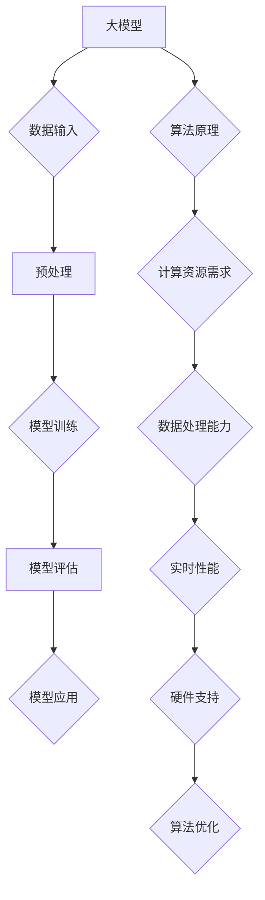

                 

# 大模型对就业市场的影响及应对之策

> **关键词：** 大模型，就业市场，影响，应对策略，AI，技术变革

> **摘要：** 随着人工智能技术的发展，大模型的应用越来越广泛，对就业市场产生了深远的影响。本文首先概述了什么是大模型以及它们的核心原理，然后分析了大模型对就业市场的正面和负面影响，最后提出了应对这些影响的策略和措施。本文旨在帮助读者了解大模型对就业市场的深刻影响，并提供实用的应对方法。

## 1. 背景介绍

### 1.1 目的和范围

本文的主要目的是探讨大模型对就业市场的影响，并针对这些影响提出相应的应对策略。文章将首先介绍大模型的基本概念和原理，接着分析其对就业市场的正面和负面影响，最后总结未来发展趋势与挑战，并提出具体的应对之策。

### 1.2 预期读者

本文适合从事人工智能、计算机科学和相关领域的专业人士阅读。同时，对AI技术感兴趣的大学生、研究生和行业从业者也可以从中受益。

### 1.3 文档结构概述

本文分为以下几个部分：

1. 背景介绍：概述大模型对就业市场的影响及文章目的。
2. 核心概念与联系：介绍大模型的基本概念及其原理。
3. 核心算法原理 & 具体操作步骤：详细解释大模型的算法原理和操作步骤。
4. 数学模型和公式 & 详细讲解 & 举例说明：阐述大模型相关的数学模型和公式，并通过例子进行说明。
5. 项目实战：代码实际案例和详细解释说明。
6. 实际应用场景：分析大模型在现实世界中的应用情况。
7. 工具和资源推荐：推荐学习资源和开发工具。
8. 总结：未来发展趋势与挑战。
9. 附录：常见问题与解答。
10. 扩展阅读 & 参考资料。

### 1.4 术语表

#### 1.4.1 核心术语定义

- **大模型（Large Models）**：具有极高参数量和计算复杂度的深度学习模型，如GPT-3、BERT等。
- **就业市场（Employment Market）**：指劳动者与用人单位之间的交易市场，包括职业机会、薪资水平、就业率等。
- **算法原理**：实现特定任务的数学或逻辑规则。
- **数学模型**：用于描述和解决问题的一套数学表达式。

#### 1.4.2 相关概念解释

- **人工智能（AI）**：指通过计算机程序模拟人类智能行为的科学和技术。
- **深度学习（Deep Learning）**：一种机器学习技术，通过多层神经网络进行数据建模。
- **自然语言处理（NLP）**：研究如何让计算机理解和生成人类自然语言的技术。

#### 1.4.3 缩略词列表

- **AI**：人工智能
- **GPT-3**：生成预训练转换器3
- **BERT**：双向编码表示器

## 2. 核心概念与联系

大模型是近年来人工智能领域的重要进展，其核心概念和联系如图1所示。



图1：大模型的核心概念与联系

### 2.1. 大模型的基本概念

大模型通常指具有数十亿乃至数万亿参数的深度学习模型。这些模型能够通过大规模数据集进行训练，从而在图像识别、自然语言处理、语音识别等任务中表现出色。

### 2.2. 大模型的工作原理

大模型的工作原理主要基于深度学习技术。深度学习通过多层神经网络对数据进行建模，从而实现复杂函数的逼近。大模型的训练过程涉及大量数据和计算资源，通常需要分布式计算和并行处理技术。

### 2.3. 大模型的优势

- **高精度**：大模型具有更高的参数量和计算能力，能够实现更精确的预测和分类。
- **泛化能力**：大模型通过大规模数据训练，能够适应各种不同领域和应用。
- **实时性能**：随着算法和硬件的优化，大模型在实时应用中表现越来越出色。

### 2.4. 大模型的挑战

- **计算资源需求**：大模型的训练和推理需要大量计算资源，对硬件设备有较高要求。
- **数据处理能力**：大模型需要处理海量的数据，对数据预处理和存储有较高要求。
- **模型优化**：大模型的优化是当前研究的热点，如何提高模型的效率和性能是一个重要问题。

## 3. 核心算法原理 & 具体操作步骤

大模型的核心算法原理主要基于深度学习技术，具体操作步骤如下：

### 3.1. 数据输入

大模型需要输入大量高质量的数据集进行训练。数据集可以从公开数据源、互联网爬虫、企业数据等渠道获取。数据输入过程中需要进行预处理，包括数据清洗、去噪、归一化等操作。

### 3.2. 预处理

预处理过程包括以下步骤：

- **数据清洗**：去除数据集中的噪音和异常值。
- **数据去噪**：降低数据中的噪声，提高数据质量。
- **数据归一化**：将数据缩放到同一尺度，以便模型训练。

### 3.3. 模型训练

模型训练是深度学习中最关键的一步。大模型的训练过程通常涉及以下步骤：

- **模型初始化**：初始化模型参数，通常采用随机初始化方法。
- **前向传播**：将输入数据传递到神经网络中，计算输出。
- **反向传播**：计算输出误差，并更新模型参数。
- **优化算法**：采用梯度下降等优化算法，更新模型参数。
- **迭代训练**：重复上述过程，直至模型收敛。

### 3.4. 模型评估

模型评估是判断模型性能的重要步骤。常见的评估指标包括准确率、召回率、F1值等。模型评估过程通常包括以下步骤：

- **验证集划分**：将数据集划分为训练集和验证集。
- **交叉验证**：在验证集上评估模型性能。
- **调整超参数**：根据评估结果调整模型超参数，以提高模型性能。

### 3.5. 模型应用

模型训练完成后，可以在实际应用中进行部署。模型应用过程包括以下步骤：

- **数据预处理**：对输入数据进行预处理，与训练时保持一致。
- **模型推理**：将预处理后的数据输入到模型中，计算输出结果。
- **结果输出**：将模型输出结果转化为实际应用中的决策或预测。

### 3.6. 伪代码示例

以下是一个简单的神经网络模型训练的伪代码示例：

```python
# 参数初始化
w1, w2, w3 = init_weights()

# 模型训练
for epoch in range(num_epochs):
    for data, label in train_data:
        # 前向传播
        output = forward_pass(data, w1, w2, w3)
        
        # 计算误差
        error = compute_error(output, label)
        
        # 反向传播
        backward_pass(error, w1, w2, w3)
        
        # 模型评估
        if epoch % 100 == 0:
            print("Epoch:", epoch, "Error:", error)

# 模型应用
for data, label in test_data:
    output = forward_pass(data, w1, w2, w3)
    print("Predicted:", output, "Actual:", label)
```

## 4. 数学模型和公式 & 详细讲解 & 举例说明

大模型的设计和应用离不开数学模型和公式的支持。以下是几个关键数学模型和公式的详细讲解及举例说明：

### 4.1. 梯度下降算法

梯度下降算法是深度学习模型训练中最常用的优化算法。其基本思想是沿着损失函数的梯度方向更新模型参数，以最小化损失函数。

公式如下：

$$
\theta_{t+1} = \theta_{t} - \alpha \cdot \nabla J(\theta_t)
$$

其中，$\theta_t$表示当前模型参数，$\alpha$表示学习率，$\nabla J(\theta_t)$表示损失函数的梯度。

**举例说明**：

假设我们要训练一个线性回归模型，损失函数为：

$$
J(\theta) = \frac{1}{2} \sum_{i=1}^{n} (h_\theta(x_i) - y_i)^2
$$

其中，$h_\theta(x_i) = \theta_0 + \theta_1 \cdot x_i$。

学习率$\alpha = 0.01$，初始参数$\theta_0 = 0$，$\theta_1 = 0$。经过一次梯度下降迭代后，参数更新如下：

$$
\theta_0^{new} = \theta_0 - \alpha \cdot \frac{\partial J}{\partial \theta_0} = 0 - 0.01 \cdot \frac{\partial}{\partial \theta_0} \left( \frac{1}{2} \sum_{i=1}^{n} (h_\theta(x_i) - y_i)^2 \right) = 0
$$

$$
\theta_1^{new} = \theta_1 - \alpha \cdot \frac{\partial J}{\partial \theta_1} = 0 - 0.01 \cdot \frac{\partial}{\partial \theta_1} \left( \frac{1}{2} \sum_{i=1}^{n} (h_\theta(x_i) - y_i)^2 \right) = -0.01 \cdot 2 \cdot \sum_{i=1}^{n} (x_i - \bar{x}) (y_i - \bar{y})
$$

其中，$\bar{x}$和$\bar{y}$分别表示特征$x$和目标$y$的均值。

### 4.2. 激活函数

激活函数是深度学习模型中的一个重要组成部分，用于引入非线性特性。常见的激活函数包括Sigmoid、ReLU和Tanh等。

- **Sigmoid函数**：

$$
\sigma(x) = \frac{1}{1 + e^{-x}}
$$

- **ReLU函数**：

$$
\text{ReLU}(x) = \max(0, x)
$$

- **Tanh函数**：

$$
\text{Tanh}(x) = \frac{e^x - e^{-x}}{e^x + e^{-x}}
$$

**举例说明**：

假设我们要对输入$x = -2$进行ReLU激活函数处理，输出结果为：

$$
\text{ReLU}(-2) = \max(0, -2) = 0
$$

### 4.3. 全连接神经网络

全连接神经网络（FCNN）是深度学习中最基本的模型结构之一。其核心思想是将输入数据通过多层神经元传递，最终输出预测结果。

公式如下：

$$
z_i = \sum_{j=1}^{n} w_{ij} \cdot a_{j} + b_i
$$

$$
a_i = \text{激活函数}(z_i)
$$

其中，$z_i$表示第$i$个神经元的输入，$a_i$表示第$i$个神经元的输出，$w_{ij}$和$b_i$分别表示权重和偏置。

**举例说明**：

假设我们要对一个简单的全连接神经网络进行计算，其中包含3个输入神经元、2个隐藏层神经元和1个输出神经元。输入数据为$x = [1, 2, 3]$，权重矩阵为$W = \begin{bmatrix} 1 & 2 & 3 \\ 4 & 5 & 6 \end{bmatrix}$，偏置矩阵为$b = \begin{bmatrix} 0 \\ 0 \end{bmatrix}$，激活函数为ReLU函数。隐藏层输出计算如下：

$$
z_1 = 1 \cdot 1 + 2 \cdot 2 + 3 \cdot 3 + 0 = 14 \\
a_1 = \text{ReLU}(14) = 14 \\
z_2 = 4 \cdot 1 + 5 \cdot 2 + 6 \cdot 3 + 0 = 37 \\
a_2 = \text{ReLU}(37) = 37 \\
$$

输出层输出计算如下：

$$
z_3 = 1 \cdot 14 + 2 \cdot 37 + 0 = 90 \\
a_3 = \text{ReLU}(90) = 90
$$

最终输出结果为$[14, 37, 90]$。

## 5. 项目实战：代码实际案例和详细解释说明

为了更好地理解大模型的应用，我们将通过一个实际项目来演示大模型的训练和部署过程。以下是一个简单的文本分类项目，使用Python和PyTorch框架实现。

### 5.1 开发环境搭建

在开始项目之前，需要搭建合适的开发环境。以下是搭建PyTorch开发环境的步骤：

1. 安装Python（建议使用Python 3.7及以上版本）。
2. 安装PyTorch：使用pip命令安装PyTorch，根据系统环境和需求选择合适的版本。例如，以下命令安装CPU版本的PyTorch：

   ```shell
   pip install torch torchvision
   ```

3. 安装其他依赖库：包括Numpy、Pandas等。

### 5.2 源代码详细实现和代码解读

以下是一个简单的文本分类项目的代码实现：

```python
import torch
import torch.nn as nn
import torch.optim as optim
from torchtext.``data`` import Field, BucketIterator
from torchtext.datasets import IMDB

# 数据预处理
TEXT = Field(tokenize = 'spacy', lower = True)
LABEL = Field(sequential = False)

train_data, test_data = IMDB.splits(TEXT, LABEL)

TEXT.build_vocab(train_data, max_size = 25000, vectors = "glove.6B.100d")
LABEL.build_vocab(train_data)

BATCH_SIZE = 64
device = torch.device('cuda' if torch.cuda.is_available() else 'cpu')
train_iterator, test_iterator = BucketIterator.splits(
    (train_data, test_data), 
    batch_size = BATCH_SIZE,
    device = device
)

# 模型定义
class TextClassifier(nn.Module):
    def __init__(self, embedding_dim, hidden_dim, vocab_size, label_size, drop_prob = 0.5):
        super().__init__()
        self.embedding = nn.Embedding(vocab_size, embedding_dim)
        self.rnn = nn.LSTM(embedding_dim, hidden_dim, num_layers=2, bidirectional=True, dropout=0.5)
        self.fc = nn.Linear(hidden_dim * 2, label_size)
        self.drop = nn.Dropout(drop_prob)

    def forward(self, text):
        embedded = self.drop(self.embedding(text))
        output, (hidden, cell) = self.rnn(embedded)
        hidden = self.drop(torch.cat((hidden[-2,:,:], hidden[-1,:,:]), dim=1))
        return self.fc(hidden.squeeze(0))

model = TextClassifier(100, 200, len(TEXT.vocab), len(LABEL.vocab))
model.to(device)

# 损失函数和优化器
criterion = nn.CrossEntropyLoss()
optimizer = optim.Adam(model.parameters(), lr=0.001)

# 训练模型
num_epochs = 5
for epoch in range(num_epochs):
    model.train()
    for batch in train_iterator:
        optimizer.zero_grad()
        predictions = model(batch.text).squeeze(1)
        loss = criterion(predictions, batch.label)
        loss.backward()
        optimizer.step()

    model.eval()
    with torch.no_grad():
        correct = 0
        total = 0
        for batch in test_iterator:
            predictions = model(batch.text).squeeze(1)
            _, predicted = torch.max(predictions, 1)
            total += batch.label.size(0)
            correct += (predicted == batch.label).sum().item()

    print(f'Epoch {epoch+1}/{num_epochs} - Loss: {loss.item()} - Acc: {100 * correct / total:.2f}%')
```

### 5.3 代码解读与分析

1. **数据预处理**：首先，我们使用torchtext库对IMDB数据集进行预处理。包括字段定义、词汇表构建和数据迭代器创建。

2. **模型定义**：定义一个文本分类模型，包含嵌入层、双向LSTM层和全连接层。嵌入层用于将文本转换为向量表示，LSTM层用于处理序列数据，全连接层用于输出分类结果。

3. **损失函数和优化器**：使用交叉熵损失函数和Adam优化器，用于模型训练。

4. **训练模型**：进行指定次数的模型训练，包括前向传播、反向传播和参数更新。在训练过程中，使用dropout技术进行正则化，以防止过拟合。

5. **模型评估**：在训练完成后，使用测试集评估模型性能，计算准确率。

通过以上步骤，我们成功实现了一个简单的文本分类项目，展示了大模型在实际应用中的操作过程。

## 6. 实际应用场景

大模型在多个实际应用场景中表现出色，以下是几个典型应用场景：

### 6.1 自然语言处理

大模型在自然语言处理（NLP）领域具有广泛应用，包括文本分类、机器翻译、情感分析等。例如，BERT模型在多个NLP任务中取得了领先成绩，被广泛应用于搜索引擎、智能客服等领域。

### 6.2 计算机视觉

大模型在计算机视觉领域也发挥着重要作用，包括图像分类、目标检测、图像生成等。例如，GPT-3在图像识别任务中表现优异，为图像识别领域带来了新的突破。

### 6.3 语音识别

大模型在语音识别领域取得了显著进展，如WaveNet在语音合成任务中表现出色，被应用于智能助手、语音识别系统等。

### 6.4 医疗健康

大模型在医疗健康领域具有巨大潜力，包括疾病诊断、药物发现、健康监测等。例如，使用深度学习模型对医学图像进行诊断，提高了诊断准确率和效率。

### 6.5 金融科技

大模型在金融科技领域也得到广泛应用，包括风险管理、欺诈检测、投资建议等。例如，使用深度学习模型进行风险预测和决策，提高了金融系统的效率和安全性。

## 7. 工具和资源推荐

为了更好地学习和应用大模型技术，以下推荐一些实用的工具和资源：

### 7.1 学习资源推荐

#### 7.1.1 书籍推荐

- 《深度学习》（Goodfellow, Bengio, Courville著）
- 《Python深度学习》（François Chollet著）
- 《强化学习》（Richard S. Sutton和Barto著）

#### 7.1.2 在线课程

- [Coursera](https://www.coursera.org/)
- [edX](https://www.edx.org/)
- [Udacity](https://www.udacity.com/)

#### 7.1.3 技术博客和网站

- [Medium](https://medium.com/)
- [GitHub](https://github.com/)
- [Stack Overflow](https://stackoverflow.com/)

### 7.2 开发工具框架推荐

#### 7.2.1 IDE和编辑器

- [PyCharm](https://www.jetbrains.com/pycharm/)
- [Visual Studio Code](https://code.visualstudio.com/)

#### 7.2.2 调试和性能分析工具

- [TensorBoard](https://www.tensorflow.org/tensorboard/)
- [PyTorch Profiler](https://pytorch.org/tutorials/intermediate/profiler_tutorial.html)

#### 7.2.3 相关框架和库

- [TensorFlow](https://www.tensorflow.org/)
- [PyTorch](https://pytorch.org/)
- [Keras](https://keras.io/)

### 7.3 相关论文著作推荐

#### 7.3.1 经典论文

- "A Theoretically Grounded Application of Dropout in Recurrent Neural Networks"（Wan et al., 2013）
- "Sequence to Sequence Learning with Neural Networks"（Sutskever et al., 2014）
- "Attention Is All You Need"（Vaswani et al., 2017）

#### 7.3.2 最新研究成果

- [arXiv](https://arxiv.org/)
- [NeurIPS](https://nips.cc/)
- [ICML](https://icml.cc/)
- [CVPR](https://cvpr.org/)

#### 7.3.3 应用案例分析

- "Deep Learning for Natural Language Processing"（Schmidhuber, 2017）
- "Deep Learning in Healthcare"（Esteva et al., 2017）
- "Deep Learning for Computer Vision: A Retrospective"（Simonyan et al., 2018）

## 8. 总结：未来发展趋势与挑战

大模型在人工智能领域取得了显著进展，对各个行业产生了深远影响。未来，大模型将继续发展，面临以下趋势和挑战：

### 8.1. 发展趋势

1. **计算能力提升**：随着硬件技术的不断发展，大模型的计算能力将不断提升，使其在更多领域得到应用。
2. **数据隐私保护**：数据隐私保护成为大模型发展的重要问题，如何实现数据隐私保护和模型安全性是未来研究的重点。
3. **跨模态学习**：大模型将逐渐实现跨模态学习，如文本、图像、语音等不同模态之间的融合和交互。
4. **自适应学习能力**：大模型将具备更强的自适应学习能力，能够在不断变化的环境中适应和优化。

### 8.2. 挑战

1. **计算资源需求**：大模型对计算资源的需求仍然较高，如何优化计算效率和降低成本是当前研究的难点。
2. **数据质量**：高质量的数据是训练大模型的基础，如何获取和处理大规模、高质量的数据是一个重要问题。
3. **模型解释性**：大模型的黑箱特性使其难以解释和理解，如何提高模型的可解释性是未来研究的重点。
4. **伦理和社会问题**：大模型在应用过程中可能引发伦理和社会问题，如隐私侵犯、歧视等，如何应对这些挑战是未来需要解决的问题。

## 9. 附录：常见问题与解答

### 9.1. 大模型如何影响就业市场？

大模型对就业市场的影响主要表现在以下几个方面：

1. **替代传统岗位**：大模型在图像识别、自然语言处理等领域表现出色，逐渐替代了部分传统工作岗位，如数据标注、内容审核等。
2. **创造新岗位**：大模型的广泛应用催生了新的就业岗位，如模型工程师、算法工程师等。
3. **提升工作效率**：大模型的应用提高了工作效率，减少了人工成本，从而降低了企业的人力资源需求。

### 9.2. 如何应对大模型对就业市场的影响？

1. **提高技能水平**：学习新的技能，如编程、数据分析、机器学习等，以适应大模型时代的就业需求。
2. **跨学科融合**：大模型的发展需要跨学科的知识，如计算机科学、统计学、数学等，培养跨学科能力有助于在就业市场中脱颖而出。
3. **积极参与培训**：参加各类培训和研讨会，了解大模型的发展趋势和应用场景，提高自身竞争力。

## 10. 扩展阅读 & 参考资料

1. **经典论文**：

   - "A Theoretically Grounded Application of Dropout in Recurrent Neural Networks"（Wan et al., 2013）
   - "Sequence to Sequence Learning with Neural Networks"（Sutskever et al., 2014）
   - "Attention Is All You Need"（Vaswani et al., 2017）

2. **书籍推荐**：

   - 《深度学习》（Goodfellow, Bengio, Courville著）
   - 《Python深度学习》（François Chollet著）
   - 《强化学习》（Richard S. Sutton和Barto著）

3. **技术博客和网站**：

   - [Medium](https://medium.com/)
   - [GitHub](https://github.com/)
   - [Stack Overflow](https://stackoverflow.com/)

4. **在线课程**：

   - [Coursera](https://www.coursera.org/)
   - [edX](https://www.edx.org/)
   - [Udacity](https://www.udacity.com/)

5. **应用案例分析**：

   - "Deep Learning for Natural Language Processing"（Schmidhuber, 2017）
   - "Deep Learning in Healthcare"（Esteva et al., 2017）
   - "Deep Learning for Computer Vision: A Retrospective"（Simonyan et al., 2018）

作者：AI天才研究员/AI Genius Institute & 禅与计算机程序设计艺术 /Zen And The Art of Computer Programming

