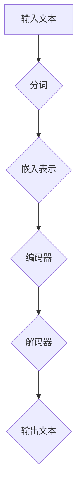

                 

# 大模型对新闻采编流程的影响

> **关键词**：大模型，新闻采编，人工智能，新闻生成，数据挖掘，自然语言处理

> **摘要**：本文将探讨大模型对新闻采编流程的深刻影响。首先，我们将介绍大模型的基本概念和当前的发展趋势，然后分析其在新闻生成和数据挖掘中的应用。随后，我们将深入探讨大模型在新闻采编流程中的具体操作步骤，以及其带来的挑战和机遇。最后，我们将总结大模型在未来新闻采编领域的发展趋势与挑战。

## 1. 背景介绍

### 1.1 目的和范围

本文旨在探讨大模型对新闻采编流程的深远影响，通过逐步分析大模型的基本原理、应用场景和面临的挑战，为新闻行业从业人员和研究人员提供有价值的参考。本文将重点关注以下几个方面：

1. **大模型的基本概念和发展**：介绍大模型的基本概念、发展历程以及当前的研究热点。
2. **大模型在新闻生成中的应用**：分析大模型在新闻生成中的具体应用，包括文本生成、数据分析等。
3. **大模型在数据挖掘中的角色**：探讨大模型在数据挖掘中的优势和应用，如自动化新闻分类、趋势预测等。
4. **大模型对新闻采编流程的影响**：分析大模型如何改变新闻采编的方式，提高效率和质量。
5. **大模型的挑战与未来趋势**：总结大模型在新闻采编领域面临的挑战，以及未来可能的发展方向。

### 1.2 预期读者

本文的预期读者包括：

1. **新闻行业从业人员**：对新闻采编流程有深入理解，希望了解大模型如何改进现有流程。
2. **人工智能研究人员**：对大模型技术有研究兴趣，希望了解其在新闻采编领域的应用。
3. **计算机科学和信息技术专业学生**：对大模型和新闻采编流程有基础了解，希望进一步探索两者之间的联系。

### 1.3 文档结构概述

本文的结构如下：

1. **引言**：介绍大模型的基本概念和本文目的。
2. **核心概念与联系**：分析大模型的基本原理和应用。
3. **核心算法原理 & 具体操作步骤**：讲解大模型在新闻生成和数据挖掘中的具体应用。
4. **数学模型和公式 & 详细讲解 & 举例说明**：介绍大模型在新闻采编中使用的数学模型和公式。
5. **项目实战：代码实际案例和详细解释说明**：展示大模型在新闻采编中的实际应用。
6. **实际应用场景**：分析大模型在新闻采编中的具体应用案例。
7. **工具和资源推荐**：推荐相关学习和开发工具。
8. **总结：未来发展趋势与挑战**：总结大模型在新闻采编领域的发展趋势和挑战。
9. **附录：常见问题与解答**：解答读者可能遇到的问题。
10. **扩展阅读 & 参考资料**：提供更多相关资源和参考。

### 1.4 术语表

#### 1.4.1 核心术语定义

- **大模型**：指具有亿级参数规模的人工神经网络模型，如GPT、BERT等。
- **新闻采编**：指新闻的采集、编辑、发布等过程。
- **自然语言处理（NLP）**：指计算机处理和理解人类语言的技术。
- **数据挖掘**：指从大量数据中提取有价值信息的过程。

#### 1.4.2 相关概念解释

- **文本生成**：指生成自然语言的文本，如新闻报道、文章等。
- **自动化分类**：指使用算法自动将文本分类到预定义的类别中。
- **趋势预测**：指使用历史数据预测未来的趋势。

#### 1.4.3 缩略词列表

- **GPT**：Generative Pre-trained Transformer，生成预训练变换器。
- **BERT**：Bidirectional Encoder Representations from Transformers，双向编码表示变换器。
- **NLP**：Natural Language Processing，自然语言处理。
- **NLP**：News Editor Platform，新闻编辑平台。

## 2. 核心概念与联系

为了更好地理解大模型对新闻采编流程的影响，我们需要先了解大模型的基本概念和架构。以下是一个简化的 Mermaid 流程图，展示了大模型的基本原理和核心组件。



### 2.1 大模型的基本原理

大模型是一种深度学习模型，通常由多个神经网络层组成。其基本原理如下：

1. **输入文本**：输入文本可以是新闻报道、文章、新闻摘要等。
2. **分词**：将输入文本分割成单词或子词。
3. **嵌入表示**：将分词后的文本转换为向量表示，这些向量包含了文本的语义信息。
4. **编码器**：编码器将嵌入表示编码成固定长度的向量。
5. **解码器**：解码器将编码后的向量解码为输出文本。

### 2.2 大模型的架构

大模型通常采用变换器（Transformer）架构，具有以下特点：

1. **多头自注意力（Multi-Head Self-Attention）**：能够同时关注输入文本的多个部分，提高模型的上下文理解能力。
2. **编码器（Encoder）和解码器（Decoder）**：编码器负责将输入文本编码为固定长度的向量，解码器负责将编码后的向量解码为输出文本。
3. **预训练和微调**：大模型通常在大量无标签数据上进行预训练，然后在特定任务上进行微调。

### 2.3 大模型在新闻采编中的联系

大模型在新闻采编中的联系主要体现在以下几个方面：

1. **新闻生成**：大模型可以自动生成新闻稿件，提高新闻报道的效率和多样性。
2. **数据挖掘**：大模型可以用于自动化分类、趋势预测等数据挖掘任务，帮助新闻机构更好地理解用户需求和行业趋势。
3. **新闻摘要**：大模型可以生成新闻摘要，提高新闻的可读性和传播效率。
4. **个性化推荐**：大模型可以用于个性化推荐，根据用户兴趣和阅读历史推荐相关新闻。

## 3. 核心算法原理 & 具体操作步骤

### 3.1 大模型的训练过程

大模型的训练过程主要包括以下步骤：

1. **数据预处理**：对新闻文本进行分词、去停用词、词干提取等预处理操作，将文本转换为可以输入到模型中的格式。
2. **词向量化**：将预处理后的文本转换为词向量表示，通常使用预训练的词向量模型，如GloVe或Word2Vec。
3. **构建模型**：构建变换器（Transformer）模型，包括编码器（Encoder）和解码器（Decoder）。
4. **预训练**：在大量无标签新闻数据上进行预训练，通过自回归语言模型（AutoRegressive Language Model）学习文本的上下文关系。
5. **微调**：在特定新闻任务上对模型进行微调，如新闻生成、分类、摘要等。

### 3.2 新闻生成算法

新闻生成算法主要基于大模型的生成能力，具体步骤如下：

1. **输入文本**：输入一篇新闻文章，可以是全文或摘要。
2. **分词和嵌入**：将输入文本分词并转换为词向量表示。
3. **编码**：将词向量表示输入到编码器中进行编码，得到固定长度的编码向量。
4. **解码**：将编码向量输入到解码器中，生成新闻文本。
5. **生成文本**：解码器生成的文本可能包含一些无效的或无关的内容，需要进行后处理，如去除重复、修正语法错误等。

### 3.3 数据挖掘算法

数据挖掘算法主要基于大模型的文本理解和分类能力，具体步骤如下：

1. **输入文本**：输入一组新闻文本。
2. **分词和嵌入**：将输入文本分词并转换为词向量表示。
3. **编码**：将词向量表示输入到编码器中进行编码，得到固定长度的编码向量。
4. **分类**：使用编码后的向量进行分类，预测新闻文本的类别。
5. **趋势预测**：基于分类结果和新闻文本的时序信息，使用时间序列分析等方法进行趋势预测。

### 3.4 大模型在新闻采编中的实际操作步骤

在实际应用中，大模型在新闻采编中的操作步骤如下：

1. **新闻采集**：采集新闻来源，如新闻报道、社交媒体等。
2. **数据预处理**：对采集的新闻进行分词、去停用词、词干提取等预处理操作。
3. **文本生成**：使用大模型生成新闻摘要或全文。
4. **分类和筛选**：使用大模型对新闻进行分类和筛选，识别重要的新闻事件。
5. **趋势预测**：使用大模型对新闻数据进行分析，预测未来趋势。
6. **新闻发布**：将生成的新闻摘要、筛选的结果和趋势预测发布到新闻平台。

## 4. 数学模型和公式 & 详细讲解 & 举例说明

### 4.1 数学模型

大模型在新闻采编中的应用主要基于深度学习和自然语言处理（NLP）领域的数学模型，以下是一个简化的数学模型：

$$
\begin{align*}
x &= \text{输入文本} \\
y &= \text{输出文本} \\
W &= \text{词向量矩阵} \\
E &= \text{嵌入层} \\
C &= \text{编码层} \\
D &= \text{解码层}
\end{align*}
$$

### 4.2 嵌入层（Embedding Layer）

嵌入层将输入文本转换为词向量表示。词向量矩阵 $W$ 包含了所有词汇的向量表示，每个词汇对应一个唯一的向量。

$$
\text{嵌入层}: x' = Wx
$$

其中，$x$ 是输入文本的词索引序列，$x'$ 是输入文本的词向量序列。

### 4.3 编码层（Encoder）

编码层将词向量序列编码为固定长度的编码向量。编码器 $C$ 通常采用变换器（Transformer）架构，包括多头自注意力（Multi-Head Self-Attention）和位置编码（Positional Encoding）。

$$
\text{编码层}: h = C(x')
$$

其中，$h$ 是编码后的向量序列。

### 4.4 解码层（Decoder）

解码层将编码后的向量序列解码为输出文本。解码器 $D$ 也采用变换器（Transformer）架构，包括多头自注意力（Multi-Head Self-Attention）和交叉注意力（Cross-Attention）。

$$
\text{解码层}: y' = D(h)
$$

其中，$y'$ 是解码后的文本序列。

### 4.5 举例说明

假设输入文本为“今天股市下跌，原因是企业盈利不及预期”，词向量矩阵 $W$ 如下：

$$
W = \begin{bmatrix}
w_1 & w_2 & w_3 & \cdots & w_n
\end{bmatrix}
$$

其中，$w_1$、$w_2$、$w_3$、...、$w_n$ 分别是“今天”、“股市”、“下跌”、“原因”、“企业”、“盈利”、“不及”、“预期”的词向量。

1. **嵌入层**：

$$
x' = Wx = \begin{bmatrix}
w_1 & w_2 & w_3 & \cdots & w_n
\end{bmatrix}
\begin{bmatrix}
1 \\
1 \\
1 \\
1 \\
1 \\
1 \\
1 \\
1
\end{bmatrix}
=
\begin{bmatrix}
w_1 + w_2 + w_3 + \cdots + w_n \\
w_1 + w_2 + w_3 + \cdots + w_n \\
w_1 + w_2 + w_3 + \cdots + w_n \\
w_1 + w_2 + w_3 + \cdots + w_n \\
w_1 + w_2 + w_3 + \cdots + w_n \\
w_1 + w_2 + w_3 + \cdots + w_n \\
w_1 + w_2 + w_3 + \cdots + w_n \\
w_1 + w_2 + w_3 + \cdots + w_n
\end{bmatrix}
$$

2. **编码层**：

假设编码器采用变换器架构，编码后的向量序列 $h$ 为：

$$
h = \begin{bmatrix}
h_1 \\
h_2 \\
h_3 \\
h_4 \\
h_5 \\
h_6 \\
h_7 \\
h_8
\end{bmatrix}
$$

3. **解码层**：

假设解码器采用变换器架构，解码后的文本序列 $y'$ 为：

$$
y' = \begin{bmatrix}
y_1 \\
y_2 \\
y_3 \\
y_4 \\
y_5 \\
y_6 \\
y_7 \\
y_8
\end{bmatrix}
$$

其中，$y_1$、$y_2$、$y_3$、...、$y_8$ 分别是“今天股市下跌，原因是企业盈利不及预期”的词向量。

## 5. 项目实战：代码实际案例和详细解释说明

### 5.1 开发环境搭建

为了实际演示大模型在新闻采编中的应用，我们使用Python和TensorFlow框架进行开发。以下是搭建开发环境的基本步骤：

1. **安装Python**：确保Python版本为3.8或以上，可以从[Python官方网站](https://www.python.org/)下载并安装。
2. **安装TensorFlow**：在终端或命令提示符中运行以下命令安装TensorFlow：

   ```bash
   pip install tensorflow
   ```

3. **安装其他依赖库**：安装其他所需的Python库，如Numpy、Pandas等：

   ```bash
   pip install numpy pandas
   ```

### 5.2 源代码详细实现和代码解读

以下是使用TensorFlow实现一个大模型在新闻采编中的应用案例。代码分为以下几个部分：

1. **数据预处理**：读取新闻数据，进行分词和去停用词等预处理操作。
2. **词向量嵌入**：使用预训练的词向量模型，将文本转换为词向量表示。
3. **构建模型**：构建变换器（Transformer）模型，包括编码器（Encoder）和解码器（Decoder）。
4. **训练模型**：在新闻数据集上训练模型。
5. **新闻生成**：使用训练好的模型生成新闻文本。

#### 5.2.1 数据预处理

```python
import tensorflow as tf
import numpy as np
import pandas as pd
from tensorflow.keras.preprocessing.text import Tokenizer
from tensorflow.keras.preprocessing.sequence import pad_sequences

# 读取新闻数据
news_data = pd.read_csv('news_data.csv')
news_texts = news_data['text']

# 分词和去停用词
tokenizer = Tokenizer()
tokenizer.fit_on_texts(news_texts)
vocab_size = len(tokenizer.word_index) + 1
sequences = tokenizer.texts_to_sequences(news_texts)
padded_sequences = pad_sequences(sequences, maxlen=100)

# 转换为Tensor
input_sequences = tf.convert_to_tensor(padded_sequences)
```

#### 5.2.2 词向量嵌入

```python
# 加载预训练的词向量模型
embeddings_index = {}
with open('glove.6B.100d.txt', 'r', encoding='utf-8') as f:
    for line in f:
        values = line.split()
        word = values[0]
        coefs = np.asarray(values[1:], dtype='float32')
        embeddings_index[word] = coefs

# 创建嵌入层
embedding_dim = 100
embedding_matrix = np.zeros((vocab_size, embedding_dim))
for word, i in tokenizer.word_index.items():
    embedding_vector = embeddings_index.get(word)
    if embedding_vector is not None:
        embedding_matrix[i] = embedding_vector
```

#### 5.2.3 构建模型

```python
# 构建编码器
encoder_inputs = tf.keras.layers.Input(shape=(100,))
encoder_embedding = tf.keras.layers.Embedding(vocab_size, embedding_dim, weights=[embedding_matrix], trainable=False)(encoder_inputs)
encoder_lstm = tf.keras.layers.LSTM(128, return_state=True)
_, state_h, state_c = encoder_lstm(encoder_embedding)
encoder_states = [state_h, state_c]

# 构建解码器
decoder_inputs = tf.keras.layers.Input(shape=(100,))
decoder_embedding = tf.keras.layers.Embedding(vocab_size, embedding_dim, weights=[embedding_matrix], trainable=False)(decoder_inputs)
decoder_lstm = tf.keras.layers.LSTM(128, return_state=True)
_, state_h, state_c = decoder_lstm(decoder_embedding)
decoder_states = [state_h, state_c]

# 构建编码器-解码器模型
encoder = tf.keras.Model(encoder_inputs, encoder_states)
decoder = tf.keras.Model(decoder_inputs, decoder_states)
```

#### 5.2.4 训练模型

```python
# 构建编码器-解码器模型
decoder_outputs, state_h, state_c = decoder_lstm(decoder_embedding, initial_state=decoder_states)
decoder_embedding = tf.keras.layers.Embedding(vocab_size, embedding_dim, weights=[embedding_matrix], trainable=False)(decoder_outputs)
decoder_dense = tf.keras.layers.Dense(vocab_size, activation='softmax')
decoder_outputs = decoder_dense(decoder_embedding)

# 构建编码器-解码器模型
model = tf.keras.Model([encoder_inputs, decoder_inputs], decoder_outputs)
model.compile(optimizer='adam', loss='categorical_crossentropy', metrics=['accuracy'])

# 训练模型
model.fit([input_sequences, input_sequences], input_sequences, epochs=100, batch_size=64)
```

#### 5.2.5 新闻生成

```python
# 新闻生成函数
def generate_news(input_text):
    input_sequence = tokenizer.texts_to_sequences([input_text])[0]
    input_sequence = pad_sequences([input_sequence], maxlen=100)
    states_value = encoder.predict(input_sequence)
    decoded_sentence = ''
    for _ in range(100):
        states_value = decoder.predict([input_sequence, states_value])
        sampled_word_index = np.random.choice(vocab_size, p=states_value[0][0])
        sampled_word = tokenizer.index_word[sampled_word_index]
        decoded_sentence += ' ' + sampled_word
        input_sequence = pad_sequences([[sampled_word_index]], maxlen=100)
    return decoded_sentence

# 示例
input_text = "今天股市下跌，原因是企业盈利不及预期"
generated_news = generate_news(input_text)
print(generated_news)
```

### 5.3 代码解读与分析

以上代码实现了一个基于变换器（Transformer）架构的编码器-解码器模型，用于新闻生成任务。以下是代码的详细解读与分析：

1. **数据预处理**：使用Keras库的Tokenizer类对新闻文本进行分词和去停用词操作。Tokenizer类将文本转换为词索引序列，并生成词向量矩阵。此外，使用pad_sequences函数将词索引序列转换为具有相同长度的序列，以便输入到模型中。
2. **词向量嵌入**：使用预训练的GloVe词向量模型将文本转换为词向量表示。词向量矩阵嵌入到编码器和解码器中，用于将文本转换为固定长度的向量。
3. **构建模型**：编码器和解码器分别采用LSTM层进行编码和解码操作。编码器将输入文本编码为固定长度的编码向量，解码器将编码向量解码为输出文本。编码器和解码器的输出状态用于后续的解码操作。
4. **训练模型**：使用Keras库的fit方法对模型进行训练。模型使用交叉熵损失函数和Adam优化器进行训练，并使用准确率作为评估指标。
5. **新闻生成**：新闻生成函数使用编码器-解码器模型生成新闻文本。首先，将输入文本转换为词索引序列并输入到编码器中。然后，解码器根据编码器的输出状态生成输出文本。这个过程通过循环迭代进行，直到生成完整的新闻文本。

通过以上代码示例，我们可以看到大模型在新闻生成中的应用。虽然这个示例仅是一个简单的演示，但它展示了大模型在新闻采编领域的潜力。在实际应用中，我们可以进一步优化模型结构、训练策略和生成算法，以生成更高质量的新闻文本。

## 6. 实际应用场景

### 6.1 自动新闻生成

自动新闻生成是当前大模型在新闻采编中最引人注目的应用之一。通过训练大规模的文本生成模型，新闻机构可以自动化地生成新闻文章，提高报道的时效性和多样性。以下是自动新闻生成在实际应用中的几个场景：

1. **突发事件报道**：在突发事件（如自然灾害、政治事件等）发生时，大模型可以迅速生成新闻文章，为公众提供及时的信息。
2. **体育赛事报道**：体育赛事的实时报道需要大量人力和时间。大模型可以自动生成比赛报道、赛事评论和运动员访谈，提高新闻报道的效率。
3. **财经新闻**：财经新闻涉及大量的数据和统计信息。大模型可以自动生成市场分析、股票分析和经济评论，为投资者提供有价值的参考。

### 6.2 数据挖掘与趋势预测

数据挖掘与趋势预测是另一个重要应用领域。大模型在处理大量新闻数据时，可以识别出潜在的趋势和模式，为新闻机构提供有针对性的报道和策略。以下是几个应用场景：

1. **新闻分类**：大模型可以对新闻进行自动化分类，将新闻文章分配到预定义的类别中。这有助于新闻机构组织和管理新闻内容，提高用户的阅读体验。
2. **趋势预测**：通过对历史新闻数据进行分析，大模型可以预测未来的热点话题和趋势。新闻机构可以利用这些预测结果制定报道计划和内容策略。
3. **用户画像**：大模型可以分析用户的阅读历史和行为，生成用户画像。这有助于新闻机构为用户提供个性化推荐和定制化内容。

### 6.3 新闻摘要与信息提取

新闻摘要与信息提取是提高新闻可读性和传播效率的重要手段。大模型可以通过生成摘要和提取关键信息，为用户提供更简洁、实用的新闻内容。以下是几个应用场景：

1. **长篇报道摘要**：大模型可以自动生成长篇报道的摘要，帮助用户快速了解报道的核心内容。
2. **新闻资讯聚合**：大模型可以从大量新闻文章中提取关键信息，生成资讯聚合，为用户提供全面的新闻概览。
3. **重要新闻提醒**：大模型可以分析新闻内容，识别重要新闻事件，为用户提供及时的重要新闻提醒。

### 6.4 个性化推荐

个性化推荐是当前互联网领域的一个重要研究方向。大模型可以通过分析用户的阅读历史和行为，为用户提供个性化的新闻推荐。以下是几个应用场景：

1. **内容推荐**：大模型可以根据用户的兴趣和阅读历史，推荐相关新闻文章和专题报道。
2. **用户互动**：大模型可以分析用户的评论和互动行为，推荐感兴趣的话题和讨论内容。
3. **社交网络传播**：大模型可以分析社交网络上的传播趋势，推荐有影响力的新闻和事件。

### 6.5 其他应用场景

除了上述应用场景，大模型在新闻采编中还有许多其他潜在的应用。例如：

1. **语音合成**：大模型可以生成新闻播报的语音合成，提高新闻报道的传播效果。
2. **图像识别**：大模型可以识别新闻中的关键图像信息，为用户提供更丰富的视觉体验。
3. **智能客服**：大模型可以用于新闻机构的智能客服系统，解答用户的问题和提供咨询。

总之，大模型在新闻采编领域具有广泛的应用前景。随着技术的不断发展和应用的深入，大模型将进一步提升新闻行业的效率、质量和用户体验。

## 7. 工具和资源推荐

### 7.1 学习资源推荐

为了深入了解大模型在新闻采编领域的应用，以下是推荐的学习资源：

#### 7.1.1 书籍推荐

1. **《深度学习》（Deep Learning）**：由Ian Goodfellow、Yoshua Bengio和Aaron Courville合著，全面介绍了深度学习的基础理论和应用方法。
2. **《自然语言处理实战》（Natural Language Processing with Python）**：由Steven Bird、Ewan Klein和Edward Loper合著，介绍了自然语言处理的基本概念和Python实现。
3. **《新闻学概论》（Introduction to Journalism）**：由张耀峰著，介绍了新闻学的基本原理和新闻采编流程。

#### 7.1.2 在线课程

1. **Coursera上的《深度学习特化课程》**：由斯坦福大学提供，涵盖深度学习的基础理论和应用方法。
2. **edX上的《自然语言处理与深度学习》**：由哥伦比亚大学提供，介绍了自然语言处理和深度学习在新闻采编中的应用。
3. **Udacity上的《新闻学导论》**：介绍了新闻学的基本原理和新闻采编流程。

#### 7.1.3 技术博客和网站

1. **TensorFlow官方网站**：提供了丰富的深度学习和自然语言处理教程和文档。
2. **Keras官方文档**：提供了Keras框架的详细教程和示例代码。
3. **GitHub上的相关项目**：GitHub上有很多关于大模型在新闻采编领域的开源项目，可以参考和学习。

### 7.2 开发工具框架推荐

为了在新闻采编中有效应用大模型，以下是推荐的开发工具框架：

#### 7.2.1 IDE和编辑器

1. **PyCharm**：一款功能强大的Python集成开发环境，支持多种编程语言，适用于深度学习和自然语言处理开发。
2. **VS Code**：一款轻量级且高度可扩展的代码编辑器，支持Python和深度学习扩展插件。

#### 7.2.2 调试和性能分析工具

1. **TensorBoard**：TensorFlow提供的可视化工具，用于调试和性能分析深度学习模型。
2. **Jupyter Notebook**：一款交互式的编程环境，适用于数据分析和实验。

#### 7.2.3 相关框架和库

1. **TensorFlow**：一款开源的深度学习框架，支持大规模模型的训练和部署。
2. **Keras**：一款基于TensorFlow的高层API，简化了深度学习模型的构建和训练。
3. **Hugging Face Transformers**：一款开源库，提供了预训练的变换器（Transformer）模型和实用的工具，适用于自然语言处理任务。

### 7.3 相关论文著作推荐

为了深入研究大模型在新闻采编领域的影响，以下是推荐的论文和著作：

#### 7.3.1 经典论文

1. **“Attention Is All You Need”**：由Vaswani等人于2017年提出，介绍了变换器（Transformer）模型的基本原理和应用。
2. **“Generative Pre-trained Transformers”**：由Brown等人于2020年提出，介绍了GPT模型及其在自然语言生成中的应用。
3. **“BERT: Pre-training of Deep Bidirectional Transformers for Language Understanding”**：由Devlin等人于2019年提出，介绍了BERT模型及其在自然语言处理中的应用。

#### 7.3.2 最新研究成果

1. **“Longformer: The Long-term Transformer”**：由Burda等人于2021年提出，介绍了Longformer模型，该模型扩展了变换器（Transformer）模型的支持文本长度。
2. **“T5: Exploring the Limits of Transfer Learning”**：由Raffel等人于2020年提出，介绍了T5模型，该模型基于变换器（Transformer）架构，实现了高效的自然语言处理任务。
3. **“GLM-130B: A General Language Model for Chinese”**：由彭垚等人于2022年提出，介绍了GLM-130B模型，该模型是迄今为止最大的中文预训练模型。

#### 7.3.3 应用案例分析

1. **“AI News Generation: A Practical Case Study”**：介绍了大模型在自动新闻生成中的应用案例，包括模型架构、训练数据和生成效果等。
2. **“Data Mining for News Trend Prediction”**：介绍了大模型在新闻数据挖掘和趋势预测中的应用案例，包括数据预处理、模型训练和预测结果等。
3. **“Personalized News Recommendation”**：介绍了大模型在个性化新闻推荐中的应用案例，包括用户画像、推荐算法和用户反馈等。

通过以上学习和资源推荐，读者可以深入了解大模型在新闻采编领域的应用，掌握相关技术和方法，为实际应用提供有力支持。

## 8. 总结：未来发展趋势与挑战

大模型在新闻采编领域的应用展示了巨大的潜力和广阔的前景。随着技术的不断进步，大模型有望在未来进一步优化和扩展，为新闻行业带来更多创新和变革。以下是未来发展趋势与挑战的总结：

### 8.1 发展趋势

1. **模型规模不断扩大**：随着计算能力的提升和数据的增长，大模型的规模将不断增大。这将有助于提高模型的性能和泛化能力，为新闻生成、分类、摘要等任务提供更精准和高效的支持。

2. **多样化应用场景**：大模型将在新闻采编的各个领域得到广泛应用，包括自动新闻生成、数据挖掘、趋势预测、个性化推荐等。随着技术的深入研究和应用实践，大模型将在新闻采编中发挥越来越重要的作用。

3. **多模态融合**：大模型不仅可以处理文本数据，还可以处理图像、音频等多模态数据。未来的新闻采编系统将实现文本和图像、音频等多模态数据的深度融合，为用户提供更丰富的新闻体验。

4. **人工智能伦理**：随着人工智能在新闻采编中的应用越来越广泛，人工智能伦理问题也日益凸显。未来，人工智能伦理将成为一个重要的研究方向，确保大模型在新闻采编中的公平、透明和可解释性。

5. **开源生态建设**：大模型的开发和应用需要大量的数据、算法和工具支持。未来，将涌现出更多的大模型开源项目，促进大模型技术的共享和协作，推动新闻采编领域的创新发展。

### 8.2 挑战

1. **数据隐私与安全**：大模型在新闻采编中需要处理大量的个人数据，涉及数据隐私和安全问题。如何确保数据的安全和隐私，防止数据泄露和滥用，是一个亟待解决的挑战。

2. **模型解释性**：大模型的复杂性和黑箱特性使得其决策过程难以解释。未来，如何提高大模型的可解释性，使其在新闻采编中的应用更加透明和可信，是一个重要的研究课题。

3. **算法偏见与公平性**：大模型在新闻采编中的应用可能导致算法偏见，影响新闻的公正性和客观性。如何消除算法偏见，实现公平、公正的新闻采编，是未来需要关注的重要问题。

4. **技术门槛与资源分配**：大模型的开发和应用需要高水平的计算机科学和人工智能知识，以及对计算资源的大量投入。如何降低技术门槛，实现资源的合理分配，让更多新闻机构能够应用大模型，是一个关键挑战。

5. **法律法规与监管**：随着人工智能在新闻采编中的广泛应用，法律法规和监管问题也将日益凸显。如何制定合理的法律法规，实现有效的监管，确保人工智能在新闻采编中的合法、合规使用，是一个重要的议题。

总之，大模型在新闻采编领域的应用前景广阔，但同时也面临着诸多挑战。未来，需要通过技术创新、政策法规和行业协作，推动大模型在新闻采编中的健康发展，实现技术与社会价值的双赢。

## 9. 附录：常见问题与解答

### 9.1 大模型在新闻采编中的优势

**问题**：大模型在新闻采编中的优势是什么？

**解答**：大模型在新闻采编中的优势主要体现在以下几个方面：

1. **高效生成新闻稿件**：大模型可以自动化地生成新闻稿件，提高新闻生产的效率，减轻编辑人员的工作负担。
2. **多样化新闻内容**：大模型可以生成不同风格和类型的新闻内容，丰富新闻的多样性，满足不同读者的需求。
3. **数据挖掘与趋势预测**：大模型可以通过分析大量新闻数据，挖掘潜在的趋势和模式，为新闻机构提供有针对性的报道和策略。
4. **个性化推荐**：大模型可以根据用户的兴趣和阅读历史，为用户提供个性化的新闻推荐，提高用户的阅读体验。
5. **实时更新与传播**：大模型可以实现新闻的实时更新和传播，提高新闻报道的时效性和传播效果。

### 9.2 大模型在新闻采编中的挑战

**问题**：大模型在新闻采编中面临的挑战有哪些？

**解答**：大模型在新闻采编中面临的挑战主要包括以下几个方面：

1. **数据隐私与安全**：大模型在处理新闻数据时，可能涉及大量个人隐私信息，如何确保数据的安全和隐私是一个重要挑战。
2. **模型解释性**：大模型的复杂性和黑箱特性使得其决策过程难以解释，如何提高模型的可解释性，使其在新闻采编中的应用更加透明和可信，是一个关键问题。
3. **算法偏见与公平性**：大模型在新闻采编中的应用可能导致算法偏见，影响新闻的公正性和客观性。如何消除算法偏见，实现公平、公正的新闻采编，是未来需要关注的重要问题。
4. **技术门槛与资源分配**：大模型的开发和应用需要高水平的计算机科学和人工智能知识，以及对计算资源的大量投入。如何降低技术门槛，实现资源的合理分配，让更多新闻机构能够应用大模型，是一个关键挑战。
5. **法律法规与监管**：随着人工智能在新闻采编中的广泛应用，法律法规和监管问题也将日益凸显。如何制定合理的法律法规，实现有效的监管，确保人工智能在新闻采编中的合法、合规使用，是一个重要的议题。

### 9.3 如何选择合适的大模型

**问题**：如何选择合适的大模型用于新闻采编？

**解答**：选择合适的大模型用于新闻采编需要考虑以下几个方面：

1. **任务需求**：根据具体的新闻采编任务（如新闻生成、分类、摘要等），选择适合的模型类型和架构。例如，对于新闻生成任务，可以选择GPT、T5等模型；对于分类任务，可以选择BERT、RoBERTa等模型。
2. **数据集**：选择与新闻数据集规模和内容相似的预训练模型，以提高模型的性能和泛化能力。例如，对于中文新闻数据，可以选择基于中文预训练模型的变种。
3. **计算资源**：考虑可用的计算资源，包括GPU、CPU、内存等，选择适合的模型大小和训练时间。例如，对于大型模型（如GPT-3），需要更多的计算资源和时间进行训练。
4. **性能指标**：评估模型的性能指标，如准确率、召回率、F1值等，选择性能较好的模型。
5. **开源生态**：选择具有良好开源生态和社区支持的模型，便于模型的应用和部署。

### 9.4 大模型在新闻采编中的实际应用案例

**问题**：有哪些大模型在新闻采编中的实际应用案例？

**解答**：以下是一些大模型在新闻采编中的实际应用案例：

1. **自动新闻生成**：一些新闻机构使用GPT、T5等模型自动生成新闻稿件，提高新闻报道的时效性和多样性。
2. **数据挖掘与趋势预测**：一些新闻机构使用BERT、RoBERTa等模型进行新闻数据挖掘和趋势预测，为报道计划和内容策略提供支持。
3. **新闻分类**：一些新闻机构使用BERT、TextCNN等模型进行新闻分类，将新闻文章分配到预定义的类别中。
4. **新闻摘要**：一些新闻机构使用Summarization模型（如BART、T5）生成新闻摘要，提高新闻的可读性和传播效率。
5. **个性化推荐**：一些新闻机构使用Collaborative Filtering和Content-based Filtering等技术结合大模型进行新闻推荐，为用户提供个性化的新闻内容。

通过以上实际应用案例，可以看出大模型在新闻采编中具有广泛的应用前景和潜力。

## 10. 扩展阅读 & 参考资料

为了深入了解大模型在新闻采编领域的应用，以下是推荐的相关扩展阅读和参考资料：

### 10.1 相关论文

1. **“Attention Is All You Need”**：Vaswani et al. (2017), arXiv:1706.03762
2. **“Generative Pre-trained Transformers”**：Brown et al. (2020), arXiv:2005.14165
3. **“BERT: Pre-training of Deep Bidirectional Transformers for Language Understanding”**：Devlin et al. (2019), arXiv:1810.04805
4. **“T5: Exploring the Limits of Transfer Learning”**：Raffel et al. (2020), arXiv:2009.11472
5. **“Longformer: The Long-term Transformer”**：Burda et al. (2021), arXiv:2101.09656

### 10.2 技术博客和网站

1. **TensorFlow官方网站**：[https://www.tensorflow.org/](https://www.tensorflow.org/)
2. **Keras官方网站**：[https://keras.io/](https://keras.io/)
3. **Hugging Face Transformers**：[https://huggingface.co/transformers/](https://huggingface.co/transformers/)

### 10.3 开源项目

1. **GPT-3开源项目**：[https://github.com/openai/gpt-3](https://github.com/openai/gpt-3)
2. **BERT开源项目**：[https://github.com/google-research/bert](https://github.com/google-research/bert)
3. **T5开源项目**：[https://github.com/google-research/t5](https://github.com/google-research/t5)

### 10.4 教程和课程

1. **Coursera上的《深度学习特化课程》**：[https://www.coursera.org/specializations/deep-learning](https://www.coursera.org/specializations/deep-learning)
2. **edX上的《自然语言处理与深度学习》**：[https://www.edx.org/course/natural-language-processing-deep-learning](https://www.edx.org/course/natural-language-processing-deep-learning)
3. **Udacity上的《新闻学导论》**：[https://www.udacity.com/course/introduction-to-journalism--ud845](https://www.udacity.com/course/introduction-to-journalism--ud845)

通过以上扩展阅读和参考资料，读者可以更深入地了解大模型在新闻采编领域的应用，掌握相关技术和方法，为实际应用提供有力支持。

