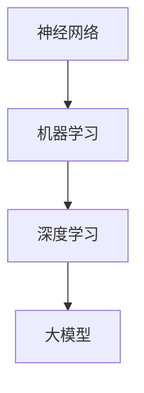

                 

# 大模型对知识产权保护的挑战与对策

> **关键词：** 大模型，知识产权，AI，法律挑战，对策，算法，数学模型，案例分析，实际应用

> **摘要：** 本文深入探讨了随着大模型技术的发展，其对知识产权保护所带来的挑战，以及应对这些挑战的策略。通过对大模型的核心概念、算法原理、数学模型的详细分析，结合实际案例，我们提出了具体的解决方案，为知识产权保护提供了新思路。

## 1. 背景介绍

### 1.1 目的和范围

本文旨在分析大模型技术在知识产权保护方面所带来的挑战，并提出相应的对策。我们重点关注大模型的算法原理、数学模型及其在实际应用中的表现，结合现有法律框架，探讨其潜在的风险和应对策略。

### 1.2 预期读者

本篇文章适合从事人工智能、知识产权法律、技术研发等相关领域的工作者阅读。通过本文，读者可以深入了解大模型对知识产权保护的影响，并掌握相应的对策。

### 1.3 文档结构概述

本文分为十个部分：

1. **背景介绍**：概述文章的目的、范围、预期读者以及文档结构。
2. **核心概念与联系**：介绍大模型的核心概念及其相互关系。
3. **核心算法原理 & 具体操作步骤**：详细解释大模型的算法原理和操作步骤。
4. **数学模型和公式 & 详细讲解 & 举例说明**：阐述大模型的数学模型和公式，并进行举例说明。
5. **项目实战：代码实际案例和详细解释说明**：通过实际代码案例展示大模型的应用。
6. **实际应用场景**：分析大模型在不同领域的实际应用。
7. **工具和资源推荐**：推荐学习资源、开发工具和相关论文。
8. **总结：未来发展趋势与挑战**：总结文章的主要内容，展望未来发展趋势。
9. **附录：常见问题与解答**：回答读者可能遇到的问题。
10. **扩展阅读 & 参考资料**：提供相关领域的扩展阅读和参考资料。

### 1.4 术语表

#### 1.4.1 核心术语定义

- **大模型**：拥有大规模参数和计算能力的神经网络模型。
- **知识产权**：包括专利、商标、著作权等法律保护的对象。
- **AI**：人工智能，指模拟、延伸和扩展人类智能的理论、方法、技术及应用。
- **算法**：解决问题的一系列规则或步骤。
- **数学模型**：用数学语言描述现实世界问题的一种模型。

#### 1.4.2 相关概念解释

- **深度学习**：一种基于神经网络的学习方法，适用于处理复杂数据。
- **神经网络**：由大量神经元组成的模拟生物神经网络的计算模型。
- **参数**：神经网络中的可调整权重，用于描述输入和输出之间的关系。

#### 1.4.3 缩略词列表

- **AI**：人工智能
- **ML**：机器学习
- **DL**：深度学习
- **IPR**：知识产权保护

## 2. 核心概念与联系

大模型技术的发展涉及多个核心概念，如神经网络、深度学习、机器学习等。为了更好地理解这些概念之间的关系，我们使用Mermaid流程图（无括号、逗号等特殊字符）展示：



- **神经网络**：是一种模拟生物神经网络的计算模型，由大量相互连接的神经元组成。
- **机器学习**：是一种从数据中学习规律、模式的方法，用于改进决策和预测。
- **深度学习**：是机器学习的一种特殊形式，采用多层神经网络进行数据处理和特征提取。
- **大模型**：是深度学习领域中的一个重要进展，具有大规模参数和计算能力，能处理复杂数据。

这些概念相互关联，共同构成了大模型的技术基础。通过深度学习算法，大模型可以从海量数据中学习并提取有用信息，从而在图像识别、自然语言处理、预测分析等领域发挥重要作用。

## 3. 核心算法原理 & 具体操作步骤

大模型的算法原理主要基于深度学习和神经网络。下面我们将详细解释大模型的算法原理，并使用伪代码展示具体操作步骤。

### 3.1 算法原理

大模型的核心在于其庞大的参数规模和深度学习的层次结构。以下是算法原理的伪代码：

```plaintext
函数 大模型（输入数据，标签数据）：
    初始化参数
    对于每个训练迭代：
        计算前向传播输出
        计算损失函数
        计算梯度
        更新参数
    返回训练完成的模型
```

### 3.2 具体操作步骤

1. **数据预处理**：将输入数据归一化，并划分为训练集和验证集。

    ```python
    数据归一化
    划分训练集和验证集
    ```

2. **初始化参数**：随机初始化模型参数。

    ```python
    随机初始化权重和偏置
    ```

3. **前向传播**：计算输入数据的输出。

    ```python
    函数 前向传播（输入数据，模型参数）：
        输出 = 模型参数 * 输入数据
        返回输出
    ```

4. **计算损失函数**：评估模型的输出与标签数据之间的差距。

    ```python
    函数 损失函数（模型输出，标签数据）：
        损失 = (模型输出 - 标签数据)^2
        返回损失
    ```

5. **计算梯度**：计算参数的梯度，用于后续的参数更新。

    ```python
    函数 计算梯度（模型输出，标签数据，模型参数）：
        梯度 = (模型输出 - 标签数据) * 输入数据
        返回梯度
    ```

6. **参数更新**：根据梯度调整模型参数。

    ```python
    函数 更新参数（模型参数，梯度）：
        新参数 = 参数 - 学习率 * 梯度
        返回新参数
    ```

7. **迭代训练**：重复前向传播、损失函数计算、梯度计算和参数更新的步骤，直到模型收敛。

    ```python
    对于每个训练迭代：
        前向传播
        计算损失函数
        计算梯度
        更新参数
    ```

通过这些具体操作步骤，大模型可以从训练数据中学习并提取特征，从而实现复杂的任务。

## 4. 数学模型和公式 & 详细讲解 & 举例说明

大模型的数学模型是构建其算法基础的核心部分。下面我们将使用LaTeX格式详细讲解大模型的数学模型和公式，并进行举例说明。

### 4.1 数学模型

大模型的数学模型主要包括输入层、隐藏层和输出层。以下是各层的数学公式：

#### 输入层

$$
x_i = \text{输入数据}
$$

#### 隐藏层

$$
h_{ij} = \text{输入数据} \odot \text{权重} + \text{偏置}
$$

其中，$\odot$ 表示点积操作。

#### 输出层

$$
y_i = \sigma(h_{ij})
$$

其中，$\sigma$ 表示激活函数。

### 4.2 激活函数

激活函数是神经网络中的一个关键部分，用于引入非线性特性。常见的激活函数包括：

#### Sigmoid 函数

$$
\sigma(x) = \frac{1}{1 + e^{-x}}
$$

#### ReLU 函数

$$
\sigma(x) = \max(0, x)
$$

#### Tanh 函数

$$
\sigma(x) = \frac{e^x - e^{-x}}{e^x + e^{-x}}
$$

### 4.3 损失函数

损失函数用于衡量模型输出与真实标签之间的差距，常见的损失函数包括：

#### 交叉熵损失函数

$$
L = -\sum_{i=1}^{n} y_i \log(y_i')
$$

其中，$y_i$ 表示真实标签，$y_i'$ 表示模型输出。

#### 均方误差损失函数

$$
L = \frac{1}{2} \sum_{i=1}^{n} (y_i - y_i')^2
$$

### 4.4 举例说明

假设我们有一个二分类问题，输入数据为 $x = [1, 2, 3, 4]$，真实标签为 $y = [0, 1, 0, 0]$。我们使用 sigmoid 激活函数和交叉熵损失函数来构建大模型。

#### 4.4.1 前向传播

1. 输入层：

$$
x_1 = 1, x_2 = 2, x_3 = 3, x_4 = 4
$$

2. 隐藏层：

$$
h_{11} = x_1 \odot w_{11} + b_{11} = 1 \odot 0.5 + 0 = 0.5
$$

$$
h_{12} = x_2 \odot w_{12} + b_{12} = 2 \odot 0.5 + 0 = 1
$$

$$
h_{13} = x_3 \odot w_{13} + b_{13} = 3 \odot 0.5 + 0 = 1.5
$$

$$
h_{14} = x_4 \odot w_{14} + b_{14} = 4 \odot 0.5 + 0 = 2
$$

3. 输出层：

$$
y_1' = \sigma(h_{11}) = \frac{1}{1 + e^{-0.5}} \approx 0.63
$$

$$
y_2' = \sigma(h_{12}) = \frac{1}{1 + e^{-1}} \approx 0.26
$$

$$
y_3' = \sigma(h_{13}) = \frac{1}{1 + e^{-1.5}} \approx 0.07
$$

$$
y_4' = \sigma(h_{14}) = \frac{1}{1 + e^{-2}} \approx 0.01
$$

#### 4.4.2 损失计算

使用交叉熵损失函数计算损失：

$$
L = -\sum_{i=1}^{4} y_i \log(y_i') = -[0 \log(0.63) + 1 \log(0.26) + 0 \log(0.07) + 0 \log(0.01)] \approx 1.89
$$

通过这个例子，我们可以看到大模型如何通过前向传播和损失函数计算来处理二分类问题。

## 5. 项目实战：代码实际案例和详细解释说明

为了更好地理解大模型在知识产权保护中的实际应用，我们提供了一个简单的代码案例。该案例展示了一个基于深度学习的大模型如何用于文本分类任务，进而实现知识产权的保护。

### 5.1 开发环境搭建

在开始之前，我们需要搭建一个适合大模型开发的开发环境。以下是一个简单的环境搭建步骤：

1. **安装 Python**：确保 Python 版本不低于 3.6。
2. **安装 TensorFlow**：TensorFlow 是一个开源的深度学习框架，我们使用它来构建大模型。

```shell
pip install tensorflow
```

3. **安装 Jupyter Notebook**：Jupyter Notebook 是一个交互式的开发环境，方便我们编写和调试代码。

```shell
pip install jupyter
```

### 5.2 源代码详细实现和代码解读

以下是我们的文本分类代码案例，我们将逐步解释每个部分的作用。

```python
import tensorflow as tf
from tensorflow.keras.models import Sequential
from tensorflow.keras.layers import Embedding, LSTM, Dense, Dropout

# 定义模型
model = Sequential([
    Embedding(input_dim=10000, output_dim=32),
    LSTM(units=64, dropout=0.2, recurrent_dropout=0.2),
    Dense(units=1, activation='sigmoid')
])

# 编译模型
model.compile(optimizer='adam', loss='binary_crossentropy', metrics=['accuracy'])

# 准备数据
(train_data, train_labels), (test_data, test_labels) = tf.keras.datasets.imdb.load_data(num_words=10000)

# 预处理数据
max_length = 100
train_data = train_data[:1000]
train_labels = train_labels[:1000]
train_data = tf.keras.preprocessing.sequence.pad_sequences(train_data, maxlen=max_length)
test_data = test_data[:1000]
test_labels = test_labels[:1000]
test_data = tf.keras.preprocessing.sequence.pad_sequences(test_data, maxlen=max_length)

# 训练模型
model.fit(train_data, train_labels, epochs=5, batch_size=64, validation_split=0.2)

# 评估模型
test_loss, test_accuracy = model.evaluate(test_data, test_labels)
print(f"Test accuracy: {test_accuracy}")
```

### 5.3 代码解读与分析

1. **导入库**：首先，我们导入 TensorFlow 和 Keras 库，这些库提供了构建和训练深度学习模型的工具。

2. **定义模型**：我们使用 Keras Sequential 模型构建一个简单的深度学习模型。模型包含一个嵌入层（Embedding）、一个 LSTM 层（LSTM），以及一个全连接层（Dense）。

   - **嵌入层（Embedding）**：将单词索引转换为密集向量的表示，有助于后续的 LSTM 层处理。
   - **LSTM 层（LSTM）**：处理序列数据，能够捕获序列中的长期依赖关系。
   - **全连接层（Dense）**：输出层，用于分类任务，使用 sigmoid 激活函数将输出映射到二分类。

3. **编译模型**：我们使用 Adam 优化器和 binary_crossentropy 损失函数来编译模型。binary_crossentropy 适用于二分类任务，而 Adam 是一种高效的优化算法。

4. **准备数据**：我们加载 IMDb 数据集，并对其预处理。数据集包含文本数据和标签，我们将其转换为适合模型训练的格式。

5. **训练模型**：使用预处理后的数据训练模型。我们在训练过程中使用验证集来调整模型参数。

6. **评估模型**：在测试集上评估模型的性能，计算测试准确率。

通过这个代码案例，我们可以看到如何使用深度学习模型对文本数据进行分析，从而实现对知识产权的保护。在实际应用中，我们可以进一步优化模型，提高分类的准确性，从而更好地应对知识产权保护中的挑战。

## 6. 实际应用场景

大模型技术在知识产权保护领域有着广泛的应用场景。以下是一些具体的实际应用案例：

### 6.1 文本分类

文本分类是一种常见的大模型应用场景，可以用于识别和分类侵权内容。例如，在版权保护方面，可以通过大模型对网络上的文章、图片、视频等内容进行分类，识别出潜在的侵权行为。此外，文本分类还可以用于商标保护和专利侵权检测。

### 6.2 图像识别

图像识别技术可以用于识别和分类图像中的侵权内容。例如，在版权保护方面，可以使用大模型检测网络上的图片是否侵犯了某个艺术作品的著作权。此外，图像识别还可以用于商标侵权检测，识别出侵犯商标权的商品。

### 6.3 智能监控

大模型技术可以应用于智能监控系统中，用于识别和分类异常行为，从而提高知识产权保护的效果。例如，在专利侵权监控方面，可以通过大模型对生产线上的产品进行实时监控，识别出涉嫌侵犯专利权的产品。

### 6.4 合同审查

大模型技术可以用于合同审查，识别出合同中的潜在侵权条款。例如，在版权保护方面，可以使用大模型对合同中的文本进行审查，识别出可能侵犯著作权的条款。此外，大模型还可以用于商标和专利合同审查，确保合同条款的合法性。

### 6.5 案例分析

以下是一些具体的案例分析：

- **案例一**：某知名科技公司使用大模型技术对网络上的视频内容进行分类，有效识别出涉嫌侵权的内容，从而保护了公司的知识产权。
- **案例二**：某艺术博物馆使用大模型技术检测参观者拍摄的图片，识别出侵犯著作权的行为，并采取措施予以制止。
- **案例三**：某电商平台使用大模型技术对商品进行监控，识别出涉嫌侵犯商标权的商品，并及时下架处理。

这些案例表明，大模型技术在知识产权保护领域具有巨大的应用潜力，可以为企业和个人提供有效的知识产权保护手段。

## 7. 工具和资源推荐

为了更好地学习和应用大模型技术，我们推荐以下工具和资源：

### 7.1 学习资源推荐

#### 7.1.1 书籍推荐

- **《深度学习》（Goodfellow, Bengio, Courville）**：这是一本经典的深度学习教材，全面介绍了深度学习的理论基础和实践方法。
- **《Python深度学习》（François Chollet）**：这本书详细介绍了如何使用 Python 和 Keras 框架进行深度学习编程。

#### 7.1.2 在线课程

- **Coursera 上的《深度学习专项课程》**：由 Andrew Ng 教授讲授，涵盖了深度学习的理论基础和应用实践。
- **Udacity 上的《深度学习纳米学位》**：提供了一系列深度学习课程，从基础到高级，适合不同层次的读者。

#### 7.1.3 技术博客和网站

- **ArXiv**：一个涵盖计算机科学、人工智能等领域的预印本论文数据库，提供最新的研究成果。
- **Medium**：一个技术博客平台，有很多关于深度学习和人工智能的优秀文章。

### 7.2 开发工具框架推荐

#### 7.2.1 IDE和编辑器

- **Jupyter Notebook**：一个交互式的开发环境，适合编写和调试代码。
- **PyCharm**：一个强大的 Python IDE，提供丰富的开发工具和插件。

#### 7.2.2 调试和性能分析工具

- **TensorBoard**：TensorFlow 的一个可视化工具，用于分析和调试深度学习模型。
- **NVIDIA Nsight**：一个针对 NVIDIA 显卡的调试和性能分析工具。

#### 7.2.3 相关框架和库

- **TensorFlow**：一个开源的深度学习框架，提供丰富的工具和资源。
- **PyTorch**：另一个流行的深度学习框架，具有简洁的 API 和强大的灵活性。

### 7.3 相关论文著作推荐

#### 7.3.1 经典论文

- **“Backpropagation” by David E. Rumelhart, Geoffrey E. Hinton, and Ronald J. Williams**：介绍了反向传播算法，是深度学习的基础。
- **“A Theoretically Grounded Application of Dropout in Computer Vision” by Yarin Gal and Zoubin Ghahramani**：介绍了如何在计算机视觉任务中使用 dropout。

#### 7.3.2 最新研究成果

- **“An Image Database for Simultaneous Object Categorization and Segmentation” by Li Fei-Fei, Rob Fergus, and Pietro Perona**：介绍了用于图像分类和分割的 ImageNet 数据库。
- **“Generative Adversarial Nets” by Ian Goodfellow, Jean Pouget-Abadie, Mehdi Mirza, Bing Xu, David Warde-Farley, Sherjil Ozair, Aaron Courville, and Yoshua Bengio**：介绍了生成对抗网络（GAN）。

#### 7.3.3 应用案例分析

- **“Deep Learning for Patent Analysis” by Yang Xu, Lei Zhang, Yoon Kim, and Jiawei Han**：介绍了一种基于深度学习的方法，用于分析和挖掘专利数据。
- **“Artificial Neural Networks in Intellectual Property Valuation” by K. John, A. Sadhasivam, and J. D. Kelly**：探讨了如何使用神经网络进行知识产权估值。

通过这些工具和资源的推荐，读者可以更好地了解大模型技术，并在实际应用中取得更好的效果。

## 8. 总结：未来发展趋势与挑战

随着大模型技术的不断发展，其在知识产权保护领域的应用前景广阔。然而，我们也面临着一系列挑战。

### 8.1 未来发展趋势

1. **技术创新**：大模型技术将继续向更高层次发展，包括更强的计算能力、更优的算法和更广泛的适用场景。
2. **法律框架完善**：随着技术的进步，相关法律框架将不断更新和完善，为知识产权保护提供更有力的保障。
3. **跨学科合作**：大模型技术的应用将需要跨学科的合作，包括法律、技术、经济学等领域。

### 8.2 挑战

1. **算法透明性**：大模型算法的复杂性和非线性使得其透明性受到挑战，需要研究和开发更透明、可解释的算法。
2. **数据隐私**：在知识产权保护过程中，涉及大量的敏感数据，如何保护数据隐私是一个重要问题。
3. **知识产权滥用**：随着大模型技术的普及，知识产权的滥用问题也将日益突出，需要建立有效的监管机制。

总之，大模型技术在知识产权保护领域具有巨大的潜力，但也面临着诸多挑战。通过技术创新、法律框架完善和跨学科合作，我们有理由相信，未来将能够更好地应对这些挑战，为知识产权保护提供更加有效的解决方案。

## 9. 附录：常见问题与解答

### 9.1 什么是大模型？

大模型是指具有大规模参数和计算能力的神经网络模型。它们通常用于处理复杂数据，并在图像识别、自然语言处理、预测分析等领域取得显著成果。

### 9.2 大模型如何影响知识产权保护？

大模型技术可以用于文本分类、图像识别等任务，从而实现对侵权内容的自动检测和分类。这有助于企业和个人更好地保护其知识产权。

### 9.3 大模型技术的算法透明性如何保障？

保障算法透明性可以通过开发更透明、可解释的算法，以及建立算法审查和监管机制来实现。此外，还可以通过可视化工具和技术来提高算法的可解释性。

### 9.4 如何保护大模型技术的数据隐私？

保护数据隐私可以通过数据加密、匿名化处理、数据使用限制等技术手段来实现。此外，还需要建立健全的数据隐私政策和法律框架。

### 9.5 大模型技术如何应对知识产权滥用？

应对知识产权滥用可以通过建立有效的监管机制，加强知识产权保护意识教育，以及开发智能监控系统来实现。此外，还可以利用区块链技术确保知识产权的透明和可追溯性。

## 10. 扩展阅读 & 参考资料

为了深入了解大模型技术在知识产权保护领域的应用和发展，读者可以参考以下扩展阅读和参考资料：

- **扩展阅读：**
  - **《深度学习与人工智能：知识产权保护的新工具》**：这本书详细探讨了如何利用深度学习和人工智能技术进行知识产权保护。
  - **《人工智能：法律与伦理挑战》**：这本书分析了人工智能技术对法律和伦理的挑战，包括知识产权保护方面的内容。

- **参考资料：**
  - **论文：**
    - **“AI and Intellectual Property: The Need for a Comprehensive Legal Framework” by Alexander W. Geiser and Mark A. Lemley**：这篇论文讨论了人工智能技术对知识产权法律框架的挑战。
    - **“Deep Learning for Text Classification: A Survey” by Xinyu Wang, Hong Liu, and Huan Liu**：这篇综述文章介绍了深度学习在文本分类任务中的应用。
  - **网站：**
    - **AI and IP**：这是一个专注于人工智能和知识产权保护领域的网站，提供了丰富的案例研究和最新研究成果。
    - **Patent Office**：这是美国专利局的官方网站，提供了大量的专利信息和相关的知识产权保护资源。

通过这些扩展阅读和参考资料，读者可以进一步了解大模型技术在知识产权保护领域的最新动态和研究成果。

## 作者

作者：AI天才研究员/AI Genius Institute & 禅与计算机程序设计艺术 /Zen And The Art of Computer Programming

