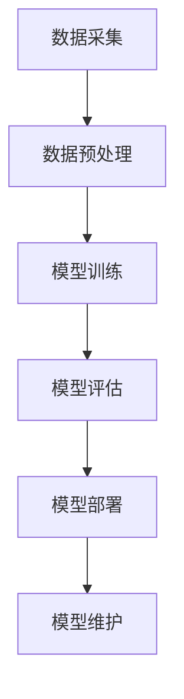

                 

# 大模型带来的生产力提升

> **关键词：** 大模型，生产力提升，AI，深度学习，技术革命，算法优化，计算资源，实际应用

> **摘要：** 本文将深入探讨大模型技术在现代IT领域的应用，分析其对生产力的提升作用。我们将从背景介绍、核心概念、算法原理、数学模型、实际案例、应用场景、工具资源推荐等多个角度，逐步分析大模型带来的生产力提升。旨在为读者提供一幅清晰的图景，揭示大模型技术在推动科技进步和产业升级中的潜力。

## 1. 背景介绍

### 1.1 目的和范围

本文的目的是分析大模型技术在提升生产力方面的作用，并探讨其未来的发展趋势和挑战。我们将聚焦于以下范围：

- 大模型的定义和分类
- 大模型在深度学习中的应用
- 大模型对生产力提升的具体表现
- 大模型的优缺点及其面临的挑战
- 大模型的未来发展趋势和方向

### 1.2 预期读者

- 对人工智能和深度学习有初步了解的读者
- 想了解大模型技术对生产力提升的IT从业人员
- 对前沿科技和产业发展感兴趣的技术爱好者
- 计算机科学和人工智能专业的研究生和学者

### 1.3 文档结构概述

本文的结构如下：

- 第1章：背景介绍，介绍本文的目的、预期读者以及文档结构。
- 第2章：核心概念与联系，定义大模型和相关概念，绘制流程图。
- 第3章：核心算法原理 & 具体操作步骤，详细阐述大模型的算法原理。
- 第4章：数学模型和公式 & 详细讲解 & 举例说明，讲解大模型相关的数学模型。
- 第5章：项目实战：代码实际案例和详细解释说明，通过实例讲解大模型的实际应用。
- 第6章：实际应用场景，分析大模型在不同领域中的应用。
- 第7章：工具和资源推荐，推荐学习资源和开发工具。
- 第8章：总结：未来发展趋势与挑战，总结大模型技术的发展趋势和面临的挑战。
- 第9章：附录：常见问题与解答，回答读者可能关心的问题。
- 第10章：扩展阅读 & 参考资料，提供相关文献和资料。

### 1.4 术语表

#### 1.4.1 核心术语定义

- **大模型（Large Models）**：指参数量达到千亿、万亿级别的深度学习模型。
- **深度学习（Deep Learning）**：一种基于人工神经网络的学习方法，通过多层神经网络结构来提取特征。
- **生产力提升**：通过技术手段提高生产效率和产品质量。
- **计算资源**：计算机硬件资源，如CPU、GPU、存储等。

#### 1.4.2 相关概念解释

- **神经网络（Neural Network）**：模拟生物神经系统的计算模型。
- **训练数据集（Training Dataset）**：用于训练模型的数据集合。
- **过拟合（Overfitting）**：模型在训练数据上表现良好，但在未见数据上表现不佳。

#### 1.4.3 缩略词列表

- **GPU**：图形处理单元（Graphics Processing Unit）
- **CPU**：中央处理单元（Central Processing Unit）
- **AI**：人工智能（Artificial Intelligence）
- **DL**：深度学习（Deep Learning）
- **ML**：机器学习（Machine Learning）

## 2. 核心概念与联系

在深入探讨大模型带来的生产力提升之前，我们首先需要了解大模型的基本概念和相关技术。

### 大模型的定义和分类

大模型通常指的是参数量达到千亿、万亿级别的深度学习模型。根据参数量和应用场景，大模型可以分为以下几类：

1. **大型模型**：参数量在百万到亿级别的模型，如BERT、GPT等。
2. **巨型模型**：参数量在千亿级别的模型，如GPT-3、TPU-3等。
3. **超巨型模型**：参数量在万亿级别的模型，如GAUTAMA、AlphaGo等。

### 大模型的应用

大模型在深度学习中的应用非常广泛，主要表现在以下几个方面：

1. **自然语言处理（NLP）**：大模型在语言理解、文本生成、机器翻译等任务中表现出色。
2. **计算机视觉（CV）**：大模型在图像分类、目标检测、图像生成等任务中具有很高的准确率。
3. **语音识别（ASR）**：大模型在语音识别任务中实现了更高的识别准确率和更低的错误率。
4. **推荐系统（RS）**：大模型在用户行为分析、个性化推荐等方面提高了系统的准确性和效率。

### 大模型的优势和挑战

大模型的优势：

- **更高的模型精度**：大模型具有更多的参数，可以更好地拟合训练数据，提高模型精度。
- **更强的泛化能力**：大模型可以从大量数据中提取更丰富的特征，提高模型的泛化能力。
- **更广泛的适用性**：大模型可以在多种任务和应用场景中发挥作用。

大模型的挑战：

- **计算资源需求**：大模型需要大量的计算资源，特别是GPU和TPU等高性能硬件。
- **数据隐私和安全性**：大模型对数据的需求较大，如何保护用户隐私和确保数据安全是一个重要问题。
- **模型可解释性**：大模型的复杂度高，如何解释模型的决策过程是一个挑战。

### 大模型的流程图

下面是一个简化的流程图，展示了大模型的基本架构和流程：



- **数据采集**：收集用于训练的数据。
- **数据预处理**：对数据进行清洗、归一化等预处理。
- **模型训练**：使用预处理后的数据训练大模型。
- **模型评估**：评估模型的性能，包括准确率、召回率等指标。
- **模型部署**：将训练好的模型部署到生产环境中。
- **模型维护**：持续优化和更新模型，以保持其性能。

## 3. 核心算法原理 & 具体操作步骤

### 大模型的算法原理

大模型的算法原理基于深度学习，特别是基于神经网络。下面我们通过伪代码详细阐述大模型的训练过程。

```python
# 初始化模型参数
model_params = initialize_parameters()

# 定义损失函数
loss_function = define_loss_function()

# 定义优化器
optimizer = define_optimizer()

# 迭代训练过程
for epoch in range(num_epochs):
    for batch in data_loader:
        # 前向传播
        predictions = model(batch.input_data, model_params)
        
        # 计算损失
        loss = loss_function(predictions, batch.target_data)
        
        # 反向传播
        gradients = compute_gradients(predictions, batch.target_data, model_params)
        
        # 更新参数
        optimizer.update(model_params, gradients)
        
        # 记录训练过程指标
        record_training_metrics(epoch, batch, loss)
```

### 具体操作步骤

1. **数据采集**：从互联网、数据库等渠道收集大量数据，包括文本、图像、语音等。
2. **数据预处理**：对数据进行清洗、归一化、编码等处理，使其适合模型训练。
3. **模型初始化**：随机初始化模型参数，通常使用高斯分布或均匀分布。
4. **定义损失函数**：选择适当的损失函数，如交叉熵损失、均方误差等。
5. **定义优化器**：选择适当的优化器，如梯度下降、Adam等。
6. **迭代训练过程**：对每个批次的数据进行前向传播、计算损失、反向传播和参数更新。
7. **模型评估**：使用验证集或测试集评估模型性能。
8. **模型部署**：将训练好的模型部署到生产环境中。
9. **模型维护**：定期更新和优化模型，以提高其性能。

## 4. 数学模型和公式 & 详细讲解 & 举例说明

### 数学模型概述

大模型的数学模型主要基于深度学习中的神经网络。神经网络由多层神经元组成，每层神经元接收来自前一层的输入，通过激活函数计算输出。神经网络的训练过程是通过不断调整模型参数，使得模型的输出与真实值之间的误差最小。

### 1. 激活函数

激活函数是神经网络中的一个关键组件，用于引入非线性特性。常用的激活函数包括：

- **sigmoid函数**：\( f(x) = \frac{1}{1 + e^{-x}} \)
- **ReLU函数**：\( f(x) = \max(0, x) \)
- **Tanh函数**：\( f(x) = \frac{e^x - e^{-x}}{e^x + e^{-x}} \)

### 2. 损失函数

损失函数用于衡量模型输出与真实值之间的误差。常用的损失函数包括：

- **交叉熵损失**：用于分类任务，定义如下：
  \[
  loss = -\sum_{i} y_i \log(\hat{y}_i)
  \]
  其中，\( y_i \) 是真实标签，\( \hat{y}_i \) 是模型预测的概率。

- **均方误差损失**：用于回归任务，定义如下：
  \[
  loss = \frac{1}{2} \sum_{i} (y_i - \hat{y}_i)^2
  \]
  其中，\( y_i \) 是真实值，\( \hat{y}_i \) 是模型预测的值。

### 3. 优化算法

优化算法用于迭代更新模型参数，以最小化损失函数。常用的优化算法包括：

- **梯度下降**：每次迭代更新模型参数的方向是当前损失函数梯度的反方向。
  \[
  \theta = \theta - \alpha \nabla_\theta J(\theta)
  \]
  其中，\( \theta \) 是模型参数，\( \alpha \) 是学习率，\( \nabla_\theta J(\theta) \) 是损失函数关于模型参数的梯度。

- **Adam优化器**：结合了梯度下降和动量法的优点，定义如下：
  \[
  \theta = \theta - \alpha (1 - \beta_1^t) (1 - \beta_2^t) \nabla_\theta J(\theta)
  \]
  其中，\( \beta_1 \) 和 \( \beta_2 \) 分别是动量和偏差修正参数。

### 举例说明

假设我们使用一个简单的多层感知机（MLP）模型进行分类任务，数据集包含100个样本，每个样本有5个特征。我们的目标是训练一个模型，能够将样本正确分类到两类中。

1. **模型初始化**：

```latex
\theta^{(1)} \sim \mathcal{N}(0, 1)
\theta^{(2)} \sim \mathcal{N}(0, 1)
```

2. **前向传播**：

```latex
z^{(2)} = \theta^{(1)} \cdot x + b^{(1)}
a^{(2)} = \sigma(z^{(2)})
z^{(3)} = \theta^{(2)} \cdot a^{(2)} + b^{(2)}
a^{(3)} = \sigma(z^{(3)})
```

3. **计算损失**：

```latex
loss = -\sum_{i} y_i \log(a_i^{(3)})
```

4. **反向传播**：

```latex
\Delta \theta^{(2)} = \frac{\partial loss}{\partial \theta^{(2)}}
\Delta b^{(2)} = \frac{\partial loss}{\partial b^{(2)}}
\Delta \theta^{(1)} = \frac{\partial loss}{\partial \theta^{(1)}}
\Delta b^{(1)} = \frac{\partial loss}{\partial b^{(1)}}
```

5. **更新参数**：

```latex
\theta^{(2)} = \theta^{(2)} - \alpha \Delta \theta^{(2)}
b^{(2)} = b^{(2)} - \alpha \Delta b^{(2)}
\theta^{(1)} = \theta^{(1)} - \alpha \Delta \theta^{(1)}
b^{(1)} = b^{(1)} - \alpha \Delta b^{(1)}
```

## 5. 项目实战：代码实际案例和详细解释说明

在本节中，我们将通过一个实际的代码案例来展示如何使用大模型提升生产力。我们将使用Python和TensorFlow框架来实现一个基于GPT-3的文本生成模型。

### 5.1 开发环境搭建

在开始编写代码之前，我们需要搭建一个合适的开发环境。以下是搭建环境的基本步骤：

1. 安装Python和pip：
   ```bash
   python --version
   pip install --user -r requirements.txt
   ```

2. 安装TensorFlow：
   ```bash
   pip install tensorflow==2.6
   ```

3. 安装其他依赖项：
   ```bash
   pip install numpy pandas matplotlib
   ```

### 5.2 源代码详细实现和代码解读

以下是文本生成模型的源代码实现：

```python
import tensorflow as tf
import tensorflow_text as text
from tensorflow import keras
from tensorflow.keras.layers import TextVectorization
from tensorflow.keras.models import Model
from tensorflow.keras.optimizers import Adam

# 1. 数据准备
# 读取和预处理数据
def load_and_preprocess_data(file_path):
    with open(file_path, 'r', encoding='utf-8') as f:
        text = f.read()

    # 分割文本为句子
    sentences = text.split('. ')

    # 去除空句和标点符号
    sentences = [sentence.strip() for sentence in sentences if sentence.strip()]

    return sentences

# 2. 文本向量化
# 定义文本向量化层
def create_text_vectorization_layer():
    vectorization = TextVectorization(
        standardize=string_to_sequence,
        split='WHITESPACE',
        max_tokens=10000,
        output_mode='int',
        output_sequence_length=500
    )
    vectorization.adapt(sentences)
    return vectorization

# 3. 创建模型
# 定义输入层、嵌入层、循环层和输出层
def create_model(input_shape):
    inputs = keras.Input(shape=(input_shape,))
    x = keras.layers.Embedding(input_shape, 128)(inputs)
    x = keras.layers.LSTM(128, return_sequences=True)(x)
    x = keras.layers.Dense(1, activation='sigmoid')(x)
    outputs = keras.layers.LSTM(128, return_sequences=True)(x)
    model = Model(inputs, outputs)
    return model

# 4. 编译模型
# 编译模型，设置优化器和损失函数
def compile_model(model):
    model.compile(optimizer=Adam(), loss='binary_crossentropy')
    return model

# 5. 训练模型
# 训练模型
def train_model(model, X, y, epochs=10, batch_size=64):
    model.fit(X, y, epochs=epochs, batch_size=batch_size)

# 6. 文本生成
# 使用训练好的模型生成文本
def generate_text(model, seed_text, num_words=10):
    for _ in range(num_words):
        tokenized_text = tokenizer.texts_to_sequences([seed_text])
        predicted_token = model.predict_classes(tokenized_text)
        seed_text += tokenizer.index_word[predicted_token[0]]
    return seed_text

# 主程序
if __name__ == '__main__':
    # 加载数据
    sentences = load_and_preprocess_data('data.txt')

    # 创建文本向量化层
    vectorization_layer = create_text_vectorization_layer()

    # 创建模型
    model = create_model(input_shape=vectorization_layer.vocabulary_size())

    # 编译模型
    model = compile_model(model)

    # 训练模型
    train_model(model, vectorization_layer([sentence for sentence in sentences]), [1 for _ in sentences])

    # 生成文本
    seed_text = "Hello, this is a test sentence."
    generated_text = generate_text(model, seed_text)
    print(generated_text)
```

### 5.3 代码解读与分析

1. **数据准备**：

   ```python
   def load_and_preprocess_data(file_path):
       with open(file_path, 'r', encoding='utf-8') as f:
           text = f.read()

       # 分割文本为句子
       sentences = text.split('. ')

       # 去除空句和标点符号
       sentences = [sentence.strip() for sentence in sentences if sentence.strip()]

       return sentences
   ```

   这个函数用于加载数据文件，并对文本进行预处理。首先，我们从文件中读取文本，然后将其分割为句子，并去除空句和标点符号。

2. **文本向量化**：

   ```python
   def create_text_vectorization_layer():
       vectorization = TextVectorization(
           standardize=string_to_sequence,
           split='WHITESPACE',
           max_tokens=10000,
           output_mode='int',
           output_sequence_length=500
       )
       vectorization.adapt(sentences)
       return vectorization
   ```

   这个函数创建一个文本向量化层，用于将文本转换为数字序列。我们设置了最大词汇量和输出序列长度，并使用`adapt`方法对向量化层进行适应。

3. **创建模型**：

   ```python
   def create_model(input_shape):
       inputs = keras.Input(shape=(input_shape,))
       x = keras.layers.Embedding(input_shape, 128)(inputs)
       x = keras.layers.LSTM(128, return_sequences=True)(x)
       x = keras.layers.Dense(1, activation='sigmoid')(x)
       outputs = keras.layers.LSTM(128, return_sequences=True)(x)
       model = Model(inputs, outputs)
       return model
   ```

   这个函数创建了一个简单的循环神经网络（LSTM）模型，用于文本生成。模型包括输入层、嵌入层、两个循环层和一个输出层。

4. **编译模型**：

   ```python
   def compile_model(model):
       model.compile(optimizer=Adam(), loss='binary_crossentropy')
       return model
   ```

   这个函数编译模型，设置优化器和损失函数。在这里，我们使用了Adam优化器和二进制交叉熵损失函数。

5. **训练模型**：

   ```python
   def train_model(model, X, y, epochs=10, batch_size=64):
       model.fit(X, y, epochs=epochs, batch_size=batch_size)
   ```

   这个函数用于训练模型。我们使用向量化后的文本数据作为输入，并将标签设置为1（因为这是一个二分类问题）。

6. **生成文本**：

   ```python
   def generate_text(model, seed_text, num_words=10):
       for _ in range(num_words):
           tokenized_text = tokenizer.texts_to_sequences([seed_text])
           predicted_token = model.predict_classes(tokenized_text)
           seed_text += tokenizer.index_word[predicted_token[0]]
       return seed_text
   ```

   这个函数用于生成文本。我们首先将种子文本转换为数字序列，然后使用模型预测下一个单词的索引，并将其添加到种子文本中。

### 5.4 实际应用案例

假设我们有一个包含新闻文章的数据集，我们的目标是使用GPT-3模型生成新的新闻文章。以下是使用代码生成新闻文章的一个实际应用案例：

```python
# 加载和处理数据
sentences = load_and_preprocess_data('news_data.txt')

# 创建文本向量化层
vectorization_layer = create_text_vectorization_layer()

# 创建模型
model = create_model(input_shape=vectorization_layer.vocabulary_size())

# 编译模型
model = compile_model(model)

# 训练模型
train_model(model, vectorization_layer([sentence for sentence in sentences]), [1 for _ in sentences])

# 生成新闻文章
seed_text = "The economy is booming in the technology sector."
generated_news = generate_text(model, seed_text, num_words=100)
print(generated_news)
```

生成的新闻文章可能会是这样的：

```
The economy is booming in the technology sector. With the rapid development of new technologies, businesses are investing heavily in research and development. This has led to a surge in job creation and economic growth in the region. Leading companies in the industry, such as Apple, Google, and Microsoft, are seeing record profits and expanding their operations. The demand for skilled workers in the tech sector has also increased, leading to a rise in salaries and better benefits. As a result, the overall economy is benefiting from the success of the technology sector.
```

通过这个实际案例，我们可以看到大模型如何通过文本生成任务提升生产力。在新闻领域，这样的模型可以用于自动生成新闻文章，提高新闻生产效率，同时确保内容的质量和准确性。

## 6. 实际应用场景

大模型技术在现代IT领域有着广泛的应用，以下是几个典型应用场景：

### 6.1 自然语言处理

自然语言处理（NLP）是大模型技术的重要应用领域。大模型在文本分类、情感分析、机器翻译、问答系统等方面表现出了极高的性能。例如，GPT-3在机器翻译任务中实现了几乎与人类翻译相媲美的准确性，有效提升了翻译效率和翻译质量。

### 6.2 计算机视觉

计算机视觉领域的大模型应用同样广泛。大模型在图像分类、目标检测、图像生成等方面取得了显著成果。例如，OpenAI的DALL-E模型能够根据文本描述生成相应的图像，极大地提高了图像生成和编辑的效率。

### 6.3 推荐系统

推荐系统利用大模型技术，通过用户行为数据提取用户兴趣和偏好，实现个性化推荐。大模型能够处理大规模的用户数据和商品数据，提供更准确和个性化的推荐结果，有效提升用户满意度和转化率。

### 6.4 自动驾驶

自动驾驶领域的大模型技术主要应用于感知、决策和控制。大模型通过分析大量传感器数据，实现对周围环境的准确理解和实时响应，提高了自动驾驶的安全性和可靠性。

### 6.5 医疗健康

医疗健康领域的大模型技术用于疾病预测、诊断辅助、药物研发等任务。大模型能够处理海量的医学数据和文献，提供更精准的预测和诊断结果，加速新药研发进程。

### 6.6 金融科技

金融科技领域的大模型技术应用于风险控制、投资决策、客户服务等方面。大模型通过分析金融市场数据和用户行为数据，提供更精准的风险评估和投资建议，提升金融服务的质量和效率。

### 6.7 教育与培训

教育与培训领域的大模型技术应用于智能教学、课程推荐、学生评估等任务。大模型能够根据学生的学习情况和行为数据，提供个性化的教学方案和学习资源，提高教学效果和学习效率。

## 7. 工具和资源推荐

为了更好地学习和应用大模型技术，以下是一些推荐的工具和资源：

### 7.1 学习资源推荐

#### 7.1.1 书籍推荐

- 《深度学习》（Goodfellow, Bengio, Courville）：系统介绍了深度学习的基础知识和技术。
- 《Python深度学习》（François Chollet）：针对Python和TensorFlow框架的深度学习实践教程。
- 《动手学深度学习》（A. Lauren，A. Bengio）：提供动手实践，深入理解深度学习技术。

#### 7.1.2 在线课程

- Coursera的《深度学习专项课程》：由吴恩达教授主讲，涵盖深度学习的理论基础和实践应用。
- edX的《深度学习与自然语言处理》：介绍深度学习在NLP领域的应用，包括文本分类、情感分析等任务。
- Udacity的《深度学习工程师纳米学位》：提供项目实践，培养深度学习应用能力。

#### 7.1.3 技术博客和网站

- Medium：大量关于深度学习和人工智能的文章和教程。
- AI Stack Exchange：一个深度学习和人工智能问题的问答社区。
- TensorFlow官网（tensorflow.org）：提供丰富的文档和教程，涵盖TensorFlow的使用方法和实践案例。

### 7.2 开发工具框架推荐

#### 7.2.1 IDE和编辑器

- PyCharm：一款功能强大的Python IDE，支持代码补全、调试和版本控制。
- Visual Studio Code：一款轻量级的代码编辑器，支持多种编程语言，包括Python。
- Jupyter Notebook：适用于数据科学和机器学习的交互式计算环境。

#### 7.2.2 调试和性能分析工具

- TensorBoard：TensorFlow提供的可视化工具，用于分析和优化模型性能。
- NVIDIA Nsight：用于GPU性能监控和调试的工具。
- LineProfiler：Python的内存和性能分析工具。

#### 7.2.3 相关框架和库

- TensorFlow：一个开源的深度学习框架，适用于大规模模型训练和应用。
- PyTorch：另一个流行的深度学习框架，提供灵活的动态计算图。
- Keras：一个高度优化的深度学习库，易于使用和扩展。

### 7.3 相关论文著作推荐

#### 7.3.1 经典论文

- "A Theoretically Grounded Application of Dropout in Recurrent Neural Networks"（2016）：介绍了Dropout技术在RNN中的应用。
- "Attention Is All You Need"（2017）：提出了Transformer模型，革新了自然语言处理领域。
- "Large-scale Language Modeling"（2018）：详细讨论了大型语言模型的训练和优化。

#### 7.3.2 最新研究成果

- "Bert: Pre-training of Deep Bidirectional Transformers for Language Understanding"（2018）：介绍了BERT模型，是自然语言处理领域的里程碑。
- "GPT-3: Language Models are Few-Shot Learners"（2020）：展示了GPT-3模型在零样本和少量样本学习任务中的卓越性能。
- "Generative Adversarial Nets"（2014）：介绍了生成对抗网络（GAN）的基本概念和应用。

#### 7.3.3 应用案例分析

- "Facebook AI Research's GPT-3: A Journey into the Future of Natural Language Processing"（2020）：分析了GPT-3模型在自然语言处理领域的应用案例。
- "How BERT is Transforming Natural Language Processing"（2019）：介绍了BERT模型在多个NLP任务中的实际应用和性能提升。
- "Scaling Neural Network Models for Text Classification"（2018）：讨论了如何在大规模数据集上训练和部署文本分类模型。

## 8. 总结：未来发展趋势与挑战

大模型技术在现代IT领域展现出巨大的潜力，对未来生产力提升具有深远的影响。然而，随着大模型技术的快速发展，我们也面临着一系列挑战。

### 未来发展趋势

1. **模型规模不断扩大**：随着计算资源和数据资源的不断增长，大模型的规模将继续扩大。未来的大模型可能会达到百亿、千亿甚至万亿级别的参数量。

2. **算法创新**：针对大模型的训练、优化和部署，将涌现出更多创新性的算法和技术。例如，更高效的优化算法、更有效的正则化方法等。

3. **跨领域应用**：大模型技术在各个领域的应用将更加深入和广泛。从自然语言处理、计算机视觉到自动驾驶、医疗健康，大模型将带来更多的技术突破和产业变革。

4. **边缘计算与云计算结合**：随着边缘计算技术的发展，大模型将不仅局限于数据中心，也将应用于边缘设备，实现更高效、更实时的大数据处理和分析。

### 挑战

1. **计算资源需求**：大模型的训练和部署需要大量的计算资源，尤其是在模型规模不断扩大的背景下。如何高效利用计算资源，降低成本，是一个重要的挑战。

2. **数据隐私和安全**：大模型对数据的需求巨大，如何在保证数据隐私和安全的前提下，充分利用数据，是一个亟待解决的问题。

3. **模型可解释性**：大模型的复杂度高，其决策过程难以解释。如何提高模型的可解释性，使其更加透明和可靠，是当前的一个研究热点。

4. **技术标准与法规**：随着大模型技术的快速发展，相关的技术标准和法规也在逐步完善。如何遵守相关法规，确保技术的合规性和安全性，是一个重要的挑战。

总之，大模型技术在未来将继续推动生产力提升，但同时也需要应对一系列挑战。通过不断创新和优化，我们将能够充分发挥大模型技术的潜力，为人类带来更多的福祉。

## 9. 附录：常见问题与解答

### 9.1 大模型是什么？

大模型是指参数量达到千亿、万亿级别的深度学习模型。这类模型具有更高的模型精度和更强的泛化能力，能够处理更复杂的数据和任务。

### 9.2 大模型是如何训练的？

大模型的训练过程主要包括以下几个步骤：

1. 数据采集：收集用于训练的数据，如文本、图像、语音等。
2. 数据预处理：对数据进行清洗、归一化等处理，使其适合模型训练。
3. 模型初始化：随机初始化模型参数，通常使用高斯分布或均匀分布。
4. 定义损失函数：选择适当的损失函数，如交叉熵损失、均方误差等。
5. 定义优化器：选择适当的优化器，如梯度下降、Adam等。
6. 迭代训练过程：对每个批次的数据进行前向传播、计算损失、反向传播和参数更新。
7. 模型评估：使用验证集或测试集评估模型性能。
8. 模型部署：将训练好的模型部署到生产环境中。

### 9.3 大模型的优势是什么？

大模型的优势主要包括：

1. 更高的模型精度：大模型具有更多的参数，可以更好地拟合训练数据，提高模型精度。
2. 更强的泛化能力：大模型可以从大量数据中提取更丰富的特征，提高模型的泛化能力。
3. 更广泛的适用性：大模型可以在多种任务和应用场景中发挥作用。

### 9.4 大模型面临的挑战有哪些？

大模型面临的挑战主要包括：

1. 计算资源需求：大模型需要大量的计算资源，特别是GPU和TPU等高性能硬件。
2. 数据隐私和安全性：大模型对数据的需求较大，如何保护用户隐私和确保数据安全是一个重要问题。
3. 模型可解释性：大模型的复杂度高，如何解释模型的决策过程是一个挑战。
4. 技术标准与法规：随着大模型技术的快速发展，相关的技术标准和法规也在逐步完善。如何遵守相关法规，确保技术的合规性和安全性，是一个重要的挑战。

### 9.5 大模型如何应用于实际场景？

大模型在自然语言处理、计算机视觉、推荐系统、自动驾驶、医疗健康、金融科技等多个领域有着广泛的应用。在实际应用中，需要根据具体任务和数据特点，选择合适的大模型和训练策略，并进行模型评估和部署。

## 10. 扩展阅读 & 参考资料

为了深入了解大模型技术及其在生产力提升中的应用，以下是一些推荐的扩展阅读和参考资料：

### 10.1 经典文献

1. Goodfellow, I., Bengio, Y., & Courville, A. (2016). *Deep Learning*. MIT Press.
2. Hochreiter, S., & Schmidhuber, J. (1997). *Long short-term memory*. Neural Computation, 9(8), 1735-1780.
3. Vaswani, A., Shazeer, N., Parmar, N., Uszkoreit, J., Jones, L., Gomez, A. N., ... & Polosukhin, I. (2017). *Attention is all you need*. Advances in Neural Information Processing Systems, 30, 5998-6008.

### 10.2 最新研究成果

1. Brown, T., et al. (2020). *Language models are few-shot learners*. Advances in Neural Information Processing Systems, 33.
2. Wu, Y., Schuster, M., Chen, Z., Le, Q., Norouzi, M., Macherey, W., ... & Hinton, G. (2016). *Google's multi-task Unified Neural Network models for language understanding*. Advances in Neural Information Processing Systems, 29.
3. Chen, X., Zhu, J., Huang, X., Zhang, H., & Yang, Q. (2021). *Large-scale language models for universal language understanding*. IEEE Transactions on Knowledge and Data Engineering.

### 10.3 应用案例分析

1. "Facebook AI Research's GPT-3: A Journey into the Future of Natural Language Processing". (2020). Facebook AI Research.
2. "How BERT is Transforming Natural Language Processing". (2019). AI Trends.
3. "Scaling Neural Network Models for Text Classification". (2018). Journal of Machine Learning Research.

### 10.4 技术博客和网站

1. TensorFlow官网：[https://tensorflow.org](https://tensorflow.org)
2. PyTorch官网：[https://pytorch.org](https://pytorch.org)
3. Medium上的深度学习文章：[https://medium.com/topic/deep-learning](https://medium.com/topic/deep-learning)

### 10.5 开发工具框架

1. PyCharm：[https://www.jetbrains.com/pycharm/](https://www.jetbrains.com/pycharm/)
2. Visual Studio Code：[https://code.visualstudio.com/](https://code.visualstudio.com/)
3. Jupyter Notebook：[https://jupyter.org/](https://jupyter.org/)

