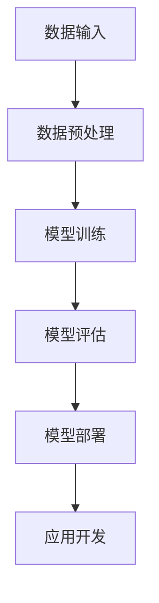

                 

# 大模型应用开发框架 LangChain（中）

> **关键词：** LangChain、大模型、应用开发、算法原理、数学模型、项目实战、工具推荐

> **摘要：** 本文是关于大模型应用开发框架 LangChain 的第二部分。在第一部分的基础上，我们将深入探讨 LangChain 的核心概念、算法原理、数学模型以及实际应用场景，并通过项目实战和工具推荐，帮助读者全面了解并掌握 LangChain 的使用方法。

## 1. 背景介绍

### 1.1 目的和范围

本文旨在为广大开发者提供一个深入理解和使用 LangChain 开发大模型应用的技术指南。通过本文的介绍，读者可以：

- 理解 LangChain 的核心概念和架构。
- 掌握 LangChain 的算法原理和数学模型。
- 学习如何使用 LangChain 进行项目实战。
- 了解与 LangChain 相关的工具和资源。

### 1.2 预期读者

- 对大模型应用开发感兴趣的程序员。
- 想要在项目中使用 LangChain 的开发者。
- 想要深入了解大模型应用开发框架的学者和研究人员。

### 1.3 文档结构概述

本文分为以下几个部分：

1. 背景介绍
2. 核心概念与联系
3. 核心算法原理 & 具体操作步骤
4. 数学模型和公式 & 详细讲解 & 举例说明
5. 项目实战：代码实际案例和详细解释说明
6. 实际应用场景
7. 工具和资源推荐
8. 总结：未来发展趋势与挑战
9. 附录：常见问题与解答
10. 扩展阅读 & 参考资料

### 1.4 术语表

#### 1.4.1 核心术语定义

- **LangChain**：大模型应用开发框架，用于构建和部署大型语言模型。
- **大模型**：具有高参数量、高复杂度的神经网络模型，如 GPT、BERT 等。
- **应用开发**：构建基于大模型的实际应用过程，如问答系统、文本生成等。

#### 1.4.2 相关概念解释

- **神经网络**：一种通过多层神经元节点进行信息处理的计算模型。
- **参数量**：神经网络中的权重和偏置等参数的数量。
- **训练**：通过大量数据进行调整，使得神经网络能够对输入数据进行预测和分类。

#### 1.4.3 缩略词列表

- **GPT**：Generative Pre-trained Transformer，生成预训练的 Transformer 模型。
- **BERT**：Bidirectional Encoder Representations from Transformers，双向编码器表示 Transformer 模型。

## 2. 核心概念与联系

### 2.1 LangChain 的核心概念

LangChain 是一个基于 Python 的开源框架，主要用于大模型应用开发。以下是 LangChain 的核心概念：

- **数据预处理**：对原始文本数据进行清洗、分词、编码等预处理操作，以适应模型训练。
- **模型训练**：利用预训练的神经网络模型，如 GPT、BERT 等，对预处理后的数据集进行训练。
- **模型部署**：将训练好的模型部署到服务器或云端，以实现实际应用。

### 2.2 LangChain 的架构

LangChain 的架构主要包括以下几个部分：

1. **数据输入**：接收原始文本数据，进行预处理。
2. **模型训练**：使用预训练的神经网络模型对预处理后的数据进行训练。
3. **模型评估**：对训练好的模型进行评估，以确定其性能和效果。
4. **模型部署**：将训练好的模型部署到服务器或云端，供用户使用。

### 2.3 Mermaid 流程图

以下是一个描述 LangChain 架构的 Mermaid 流程图：



## 3. 核心算法原理 & 具体操作步骤

### 3.1 数据预处理算法原理

数据预处理是 LangChain 的关键步骤，其主要算法原理如下：

1. **文本清洗**：去除文本中的标点符号、特殊字符等。
2. **分词**：将文本分割成词或短语。
3. **编码**：将文本数据转化为计算机可以处理的格式，如 One-Hot 编码、词嵌入等。

### 3.2 模型训练算法原理

模型训练是 LangChain 的核心，其算法原理如下：

1. **初始化模型**：选择预训练的神经网络模型，如 GPT、BERT 等。
2. **前向传播**：将预处理后的数据输入模型，计算输出结果。
3. **反向传播**：根据输出结果和真实标签，计算模型损失。
4. **梯度下降**：根据损失函数，更新模型参数。

### 3.3 伪代码

以下是一个描述 LangChain 核心算法的伪代码：

```python
# 数据预处理
def preprocess_data(data):
    # 清洗、分词、编码等操作
    return processed_data

# 模型训练
def train_model(model, data, epochs):
    for epoch in range(epochs):
        for sample in data:
            # 前向传播
            output = model.forward(sample)
            # 反向传播
            loss = compute_loss(output, target)
            # 梯度下降
            model.backward(loss)
    return model
```

## 4. 数学模型和公式 & 详细讲解 & 举例说明

### 4.1 数学模型

在 LangChain 中，主要的数学模型包括：

1. **损失函数**：用于评估模型性能的指标，如交叉熵损失函数。
2. **优化器**：用于更新模型参数的算法，如梯度下降优化器。
3. **模型参数**：神经网络中的权重和偏置等参数。

### 4.2 公式

以下是 LangChain 中常用的数学公式：

$$
\begin{aligned}
L &= -\frac{1}{N}\sum_{i=1}^{N}y_i\log(p(y_i|x_i)) \\
\theta &= \theta - \alpha \nabla_{\theta}L
\end{aligned}
$$

其中，$L$ 是损失函数，$y_i$ 是真实标签，$p(y_i|x_i)$ 是模型输出的概率分布，$\theta$ 是模型参数，$\alpha$ 是学习率。

### 4.3 举例说明

假设我们使用 GPT 模型进行文本生成，以下是一个简单的示例：

1. **损失函数**：

$$
L = -\frac{1}{N}\sum_{i=1}^{N}y_i\log(p(y_i|x_i))
$$

其中，$y_i$ 是生成的文本，$p(y_i|x_i)$ 是 GPT 模型对生成文本的概率分布。

2. **优化器**：

$$
\theta = \theta - \alpha \nabla_{\theta}L
$$

其中，$\theta$ 是 GPT 模型的参数，$\alpha$ 是学习率，$\nabla_{\theta}L$ 是损失函数关于参数 $\theta$ 的梯度。

## 5. 项目实战：代码实际案例和详细解释说明

### 5.1 开发环境搭建

在开始项目实战之前，我们需要搭建一个合适的开发环境。以下是搭建 LangChain 开发环境的步骤：

1. 安装 Python 3.8 或更高版本。
2. 安装必要的库，如 `transformers`、`torch` 等。
3. 创建一个新的 Python 虚拟环境，并安装 LangChain。

```shell
python -m venv langchain_env
source langchain_env/bin/activate
pip install transformers torch langchain
```

### 5.2 源代码详细实现和代码解读

以下是一个简单的 LangChain 项目示例，用于构建一个问答系统。

```python
from langchain import PromptTemplate, LLMChain
from langchain.llms import OpenAI
import random

# 1. 定义 Prompt 模板
prompt_template = """
您是一位知识渊博的导师，下面是一个问题，请用您丰富的知识库来回答这个问题。

问题：{question}

回答：
"""

# 2. 创建 Prompt 模板对象
prompt = PromptTemplate(input_variables=["question"], template=prompt_template)

# 3. 创建 LLMChain 对象
llm = OpenAI(temperature=0.5)
llm_chain = LLMChain(prompt=prompt, llm=llm)

# 4. 输入问题并获取回答
question = "什么是人工智能？"
answer = llm_chain.run(question)
print(answer)
```

### 5.3 代码解读与分析

1. **PromptTemplate**：用于定义输入问题的格式和回答的格式。
2. **LLMChain**：用于组合 PromptTemplate 和 LLM（如 OpenAI）以构建问答系统。
3. **OpenAI**：用于处理输入问题和生成回答的 LLM 实现。

在这个示例中，我们首先定义了一个 Prompt 模板，用于格式化输入问题和回答。然后，我们创建了一个 LLMChain 对象，将 Prompt 模板和 OpenAI LLM 结合起来。最后，我们输入一个简单的问题并获取回答。

## 6. 实际应用场景

LangChain 可以应用于各种场景，以下是一些实际应用场景：

- **问答系统**：如本文示例，用于构建智能问答机器人。
- **文本生成**：如文章写作、诗歌创作等。
- **自然语言处理**：如情感分析、命名实体识别等。

## 7. 工具和资源推荐

### 7.1 学习资源推荐

#### 7.1.1 书籍推荐

- 《深度学习》（Goodfellow, Bengio, Courville 著）
- 《神经网络与深度学习》（邱锡鹏 著）

#### 7.1.2 在线课程

- 《机器学习》（吴恩达）
- 《深度学习》（斯坦福大学）

#### 7.1.3 技术博客和网站

- [ApacheCN](https://apachecn.org/)
- [Hugging Face](https://huggingface.co/)

### 7.2 开发工具框架推荐

#### 7.2.1 IDE和编辑器

- PyCharm
- VSCode

#### 7.2.2 调试和性能分析工具

- TensorBoard
- Python Memory Profiler

#### 7.2.3 相关框架和库

- [transformers](https://huggingface.co/transformers)
- [PyTorch](https://pytorch.org/)

### 7.3 相关论文著作推荐

#### 7.3.1 经典论文

- "A Theoretical Framework for Backpropagation"
- "Long Short-Term Memory"

#### 7.3.2 最新研究成果

- "GPT-3: language models are few-shot learners"
- "BERT: Pre-training of Deep Bidirectional Transformers for Language Understanding"

#### 7.3.3 应用案例分析

- "Google's Transformer Model for Translation"
- "Facebook's BERT for Sentiment Analysis"

## 8. 总结：未来发展趋势与挑战

随着大模型技术的不断发展，LangChain 在未来有望在以下方面取得突破：

- **性能优化**：提高模型训练和部署的效率。
- **泛化能力**：增强模型对不同任务和应用场景的适应能力。
- **隐私保护**：确保模型训练和应用过程中的数据安全和隐私保护。

然而，LangChain 在未来也面临着一些挑战，如：

- **计算资源消耗**：大模型训练和部署需要大量计算资源。
- **数据安全**：保护用户数据的安全和隐私。
- **法律法规**：遵守相关法律法规，确保模型的合规性。

## 9. 附录：常见问题与解答

### 9.1 什么是 LangChain？

LangChain 是一个开源的大模型应用开发框架，用于构建和部署大型语言模型，如 GPT、BERT 等。

### 9.2 如何安装 LangChain？

安装 LangChain 需要以下步骤：

1. 安装 Python 3.8 或更高版本。
2. 安装必要的库，如 `transformers`、`torch` 等。
3. 创建一个新的 Python 虚拟环境，并安装 LangChain。

### 9.3 LangChain 支持哪些模型？

LangChain 支持以下模型：

- GPT
- BERT
- RoBERTa
- ALBERT
- T5
- DeBERTa

### 9.4 如何训练 LangChain 模型？

训练 LangChain 模型需要以下步骤：

1. 准备训练数据集。
2. 使用训练数据集进行模型训练。
3. 使用验证数据集对模型进行评估。
4. 部署训练好的模型。

## 10. 扩展阅读 & 参考资料

- [LangChain 官方文档](https://langchain.com/)
- [transformers 官方文档](https://huggingface.co/transformers/)
- [PyTorch 官方文档](https://pytorch.org/docs/stable/index.html)

## 作者

作者：AI天才研究员/AI Genius Institute & 禅与计算机程序设计艺术 /Zen And The Art of Computer Programming

本文为作者原创，如需转载，请注明出处。感谢您的阅读！<|vq_169|>

