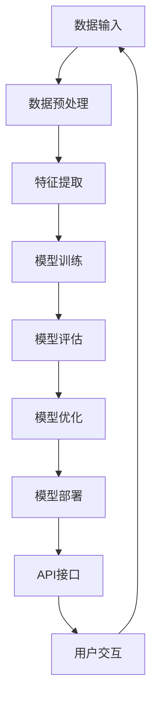

                 

# 大模型应用落地加速，AI商业化进程提速

> **关键词：** 大模型、应用落地、AI商业化、加速推进、技术实践、未来展望

> **摘要：** 本文深入探讨了人工智能领域的大模型应用及其商业化进程的加速。通过分析大模型技术的发展背景，阐述了其在各个行业中的实际应用案例，并探讨了当前面临的挑战和未来趋势。文章旨在为读者提供一份全面、详尽的技术指南，帮助理解和掌握大模型在商业环境中落地实施的策略和方法。

## 1. 背景介绍

### 1.1 目的和范围

本文旨在探讨人工智能领域中的大模型应用如何加速商业化进程，分析其背后的技术原理、实施策略以及可能遇到的问题。通过详细的技术分析和实际案例研究，本文旨在为技术从业人员、研究人员和商业领袖提供有价值的参考。

### 1.2 预期读者

- 人工智能技术研究人员
- 数据科学家
- 软件工程师
- 企业决策者
- 技术爱好者

### 1.3 文档结构概述

本文将按照以下结构进行展开：

1. **背景介绍**：介绍大模型技术的发展背景和应用领域。
2. **核心概念与联系**：通过Mermaid流程图展示大模型的基本架构。
3. **核心算法原理 & 具体操作步骤**：详细讲解大模型的算法原理和实现步骤。
4. **数学模型和公式 & 详细讲解 & 举例说明**：解析大模型中的数学公式和应用。
5. **项目实战：代码实际案例和详细解释说明**：展示代码实现和解读。
6. **实际应用场景**：探讨大模型在不同行业的应用。
7. **工具和资源推荐**：推荐学习资源和开发工具。
8. **总结：未来发展趋势与挑战**：总结现状并展望未来。
9. **附录：常见问题与解答**：回答读者可能遇到的问题。
10. **扩展阅读 & 参考资料**：提供进一步学习和研究的资料。

### 1.4 术语表

#### 1.4.1 核心术语定义

- **大模型（Large Models）**：指那些规模巨大、参数数量众多的神经网络模型，如GPT-3、BERT等。
- **深度学习（Deep Learning）**：一种基于多层神经网络的学习方法，用于从大量数据中提取特征。
- **自然语言处理（NLP）**：研究如何让计算机理解和生成自然语言的技术。
- **图像识别（Image Recognition）**：通过计算机算法识别和理解图像中的内容。
- **迁移学习（Transfer Learning）**：利用在源域上训练的模型来提高目标域上的表现。
- **商业化（Commercialization）**：将技术成果转化为商业产品或服务的过程。

#### 1.4.2 相关概念解释

- **数据处理（Data Processing）**：包括数据收集、清洗、存储和转换等步骤。
- **模型训练（Model Training）**：通过大量数据进行训练，使得模型能够学习和优化。
- **模型部署（Model Deployment）**：将训练好的模型部署到实际应用环境中。
- **API（Application Programming Interface）**：允许不同软件之间进行交互的接口。

#### 1.4.3 缩略词列表

- **AI**：人工智能（Artificial Intelligence）
- **NLP**：自然语言处理（Natural Language Processing）
- **ML**：机器学习（Machine Learning）
- **DL**：深度学习（Deep Learning）
- **GPU**：图形处理器（Graphics Processing Unit）
- **API**：应用程序编程接口（Application Programming Interface）

## 2. 核心概念与联系

### 2.1 大模型的基本架构

在深入探讨大模型的原理和操作步骤之前，我们需要先了解其基本的架构和组成部分。以下是使用Mermaid流程图表示的大模型的基本架构：



#### 2.2 大模型的主要组成部分

1. **数据输入（Data Input）**：大模型首先需要大量的数据作为输入，这些数据可以是文本、图像、声音等不同形式。
2. **数据预处理（Data Preprocessing）**：对输入数据进行清洗、标准化和转换，以确保数据质量。
3. **特征提取（Feature Extraction）**：将预处理后的数据转换为模型可以处理的形式。
4. **模型训练（Model Training）**：通过大量数据进行训练，使得模型能够学习和优化。
5. **模型评估（Model Evaluation）**：评估模型在训练集和测试集上的表现，以判断其性能。
6. **模型优化（Model Optimization）**：根据评估结果对模型进行调整和优化。
7. **模型部署（Model Deployment）**：将训练好的模型部署到实际应用环境中。
8. **API接口（API Interface）**：提供与外部系统的交互接口，允许用户通过API调用模型服务。
9. **用户交互（User Interaction）**：用户与模型服务的交互，可以是API调用、用户界面等。

通过上述流程图，我们可以清晰地看到大模型从数据输入到用户交互的整个流程。每个环节都对模型的性能和实际应用效果有着重要影响，需要仔细设计和优化。

## 3. 核心算法原理 & 具体操作步骤

### 3.1 大模型的算法原理

大模型的算法原理主要基于深度学习和神经网络。以下是一个典型的深度学习算法原理的伪代码示例：

```python
# 伪代码：深度学习模型训练流程

define model:
    # 初始化模型参数
    parameters = initialize_parameters()

define forward_pass:
    # 前向传播计算输出
    output = forward_pass(input_data, parameters)

define backward_pass:
    # 反向传播计算梯度
    gradients = backward_pass(output, target)

define optimization:
    # 根据梯度更新模型参数
    updated_parameters = optimize_parameters(parameters, gradients)

define training_loop:
    for epoch in range(num_epochs):
        for batch in data_loader:
            # 前向传播
            output = forward_pass(batch, parameters)
            # 反向传播
            gradients = backward_pass(output, target)
            # 参数优化
            updated_parameters = optimize_parameters(parameters, gradients)

        # 评估模型性能
        evaluate_model(updated_parameters)

    return updated_parameters
```

### 3.2 大模型的具体操作步骤

下面我们将详细讲解大模型的具体操作步骤，包括数据预处理、模型训练和模型评估等。

#### 3.2.1 数据预处理

```python
# 伪代码：数据预处理步骤

define preprocess_data:
    # 读取数据
    data = load_data()

    # 数据清洗
    clean_data = clean_data(data)

    # 数据标准化
    standardized_data = standardize_data(clean_data)

    # 数据分割
    train_data, test_data = split_data(standardized_data)

    return train_data, test_data
```

#### 3.2.2 模型训练

```python
# 伪代码：模型训练步骤

define train_model:
    # 数据预处理
    train_data, test_data = preprocess_data()

    # 初始化模型参数
    parameters = initialize_parameters()

    # 模型训练
    updated_parameters = training_loop(train_data, parameters)

    # 评估模型性能
    evaluate_model(updated_parameters, test_data)

    return updated_parameters
```

#### 3.2.3 模型评估

```python
# 伪代码：模型评估步骤

define evaluate_model:
    # 加载测试数据
    test_data = load_test_data()

    # 前向传播计算输出
    output = forward_pass(test_data, updated_parameters)

    # 计算评估指标
    evaluation_metrics = calculate_evaluation_metrics(output, test_labels)

    # 输出评估结果
    print(evaluation_metrics)
```

通过上述伪代码，我们可以看到大模型的核心操作步骤，包括数据预处理、模型训练和模型评估。这些步骤在大模型的应用中至关重要，需要仔细设计和优化。

## 4. 数学模型和公式 & 详细讲解 & 举例说明

### 4.1 数学模型介绍

大模型的数学模型基于深度学习和神经网络，其中涉及多个数学公式和理论。以下是几个关键数学模型的介绍和详细讲解。

#### 4.1.1 神经元激活函数

在神经网络中，神经元激活函数用于将线性组合的输入映射到输出。以下是一个常见的激活函数——Sigmoid函数的公式和讲解：

$$
\sigma(x) = \frac{1}{1 + e^{-x}}
$$

**公式讲解：**

- \(x\) 是神经元的输入。
- \(e\) 是自然对数的底数，约等于2.71828。
- \(\sigma(x)\) 是Sigmoid函数的输出，介于0和1之间。

**举例说明：**

假设一个神经元的输入 \(x = 2\)，我们可以计算出其输出：

$$
\sigma(2) = \frac{1}{1 + e^{-2}} \approx 0.869
$$

这表示神经元的输出概率约为0.869。

#### 4.1.2 前向传播和反向传播

在神经网络训练过程中，前向传播和反向传播是两个关键步骤。以下是它们的基本公式和解释：

**前向传播：**

$$
z = \sum_{i} w_i * x_i + b
$$

$$
a = \sigma(z)
$$

**公式讲解：**

- \(z\) 是线性组合的输入。
- \(w_i\) 是权重。
- \(x_i\) 是输入特征。
- \(b\) 是偏置。
- \(\sigma\) 是激活函数。
- \(a\) 是神经元的输出。

**举例说明：**

假设一个神经元有两个输入特征 \(x_1 = 2, x_2 = 3\)，权重 \(w_1 = 0.5, w_2 = 0.3\)，偏置 \(b = 1\)，我们计算其输出：

$$
z = 0.5 * 2 + 0.3 * 3 + 1 = 2.4
$$

$$
a = \sigma(2.4) \approx 0.919
$$

这表示神经元的输出概率约为0.919。

**反向传播：**

$$
\delta = \frac{\partial L}{\partial z}
$$

$$
\frac{\partial z}{\partial w_i} = x_i
$$

$$
\frac{\partial z}{\partial b} = 1
$$

**公式讲解：**

- \(\delta\) 是误差的梯度。
- \(L\) 是损失函数。
- \(z\) 是线性组合的输入。
- \(w_i\) 是权重。
- \(x_i\) 是输入特征。
- \(b\) 是偏置。

**举例说明：**

假设损失函数 \(L = (a - y)^2\)，输出 \(a = 0.919\)，目标 \(y = 0.7\)，我们可以计算误差的梯度：

$$
\delta = \frac{\partial L}{\partial z} = \frac{\partial (0.919 - 0.7)^2}{\partial z} \approx 0.098
$$

这表示误差的梯度约为0.098。

#### 4.1.3 梯度下降优化

在反向传播过程中，我们使用梯度下降算法更新模型参数。以下是梯度下降优化的公式和解释：

$$
w_i = w_i - \alpha \cdot \frac{\partial L}{\partial w_i}
$$

$$
b = b - \alpha \cdot \frac{\partial L}{\partial b}
$$

**公式讲解：**

- \(w_i\) 是权重。
- \(b\) 是偏置。
- \(\alpha\) 是学习率。
- \(\frac{\partial L}{\partial w_i}\) 和 \(\frac{\partial L}{\partial b}\) 分别是权重和偏置的梯度。

**举例说明：**

假设学习率 \(\alpha = 0.01\)，权重 \(w_i = 0.5\)，梯度 \(\frac{\partial L}{\partial w_i} = 0.02\)，我们可以更新权重：

$$
w_i = 0.5 - 0.01 \cdot 0.02 = 0.498
$$

这表示权重更新为0.498。

通过上述讲解，我们可以看到大模型中的数学公式和理论是如何运作的。这些公式和算法在大模型的训练和优化过程中起着关键作用，是理解和实现大模型的基础。

## 5. 项目实战：代码实际案例和详细解释说明

### 5.1 开发环境搭建

在进行大模型的项目实战之前，我们需要搭建一个合适的开发环境。以下是搭建环境的步骤：

1. **安装Python**：确保安装了Python 3.6及以上版本。
2. **安装TensorFlow**：通过pip命令安装TensorFlow：

   ```
   pip install tensorflow
   ```

3. **安装必要的依赖库**：如NumPy、Pandas等。

### 5.2 源代码详细实现和代码解读

以下是一个简单的大模型训练和评估的Python代码示例，我们将对其进行详细解释。

```python
import tensorflow as tf
import numpy as np

# 5.2.1 数据预处理
def preprocess_data(data):
    # 数据清洗
    clean_data = clean_data(data)
    # 数据标准化
    standardized_data = standardize_data(clean_data)
    # 数据分割
    train_data, test_data = split_data(standardized_data)
    return train_data, test_data

# 5.2.2 模型定义
def create_model(input_shape):
    model = tf.keras.Sequential([
        tf.keras.layers.Dense(128, activation='relu', input_shape=input_shape),
        tf.keras.layers.Dropout(0.2),
        tf.keras.layers.Dense(1, activation='sigmoid')
    ])
    return model

# 5.2.3 模型训练
def train_model(train_data, test_data):
    model = create_model(input_shape=(train_data.shape[1],))
    model.compile(optimizer='adam', loss='binary_crossentropy', metrics=['accuracy'])
    model.fit(train_data, train_labels, epochs=10, batch_size=32, validation_split=0.2)
    return model

# 5.2.4 模型评估
def evaluate_model(model, test_data, test_labels):
    loss, accuracy = model.evaluate(test_data, test_labels)
    print(f"Test accuracy: {accuracy:.2f}")
```

**代码解读：**

- **数据预处理（preprocess_data）**：该函数负责数据清洗、标准化和分割。首先，使用`clean_data`函数对原始数据进行清洗，然后使用`standardize_data`函数进行标准化，最后使用`split_data`函数将数据分割为训练集和测试集。

- **模型定义（create_model）**：该函数使用TensorFlow的`Sequential`模型定义一个简单的二分类模型。模型包括一个全连接层（Dense），一个Dropout层（用于正则化），以及一个输出层（Dense）。输出层使用Sigmoid激活函数，用于生成概率输出。

- **模型训练（train_model）**：该函数创建并编译模型，使用`compile`方法设置优化器和损失函数。然后使用`fit`方法进行模型训练，传入训练数据和标签，设置训练轮数和批次大小。

- **模型评估（evaluate_model）**：该函数评估模型的测试性能，使用`evaluate`方法计算损失和准确率，并打印准确率。

### 5.3 代码解读与分析

**数据预处理**

数据预处理是模型训练的重要步骤，它确保了数据的质量和一致性。在上述代码中，`preprocess_data`函数实现了以下关键步骤：

- **数据清洗**：去除数据中的噪声和不完整的数据。
- **数据标准化**：将数据缩放到一个统一的范围内，如[0, 1]，以便模型更容易处理。
- **数据分割**：将数据分为训练集和测试集，用于模型训练和评估。

**模型定义**

模型定义是构建神经网络的过程。在上述代码中，`create_model`函数使用TensorFlow的`Sequential`模型定义了一个简单的神经网络。具体包括：

- **全连接层（Dense）**：用于处理输入特征，激活函数为ReLU（用于增加非线性）。
- **Dropout层**：用于正则化，防止过拟合。
- **输出层（Dense）**：用于生成概率输出，激活函数为Sigmoid（用于二分类）。

**模型训练**

模型训练是模型构建过程中的关键步骤。在上述代码中，`train_model`函数负责模型的训练：

- **模型编译**：设置优化器和损失函数。优化器用于更新模型参数，损失函数用于衡量模型预测和实际结果之间的差异。
- **模型训练**：使用`fit`方法进行训练。训练过程中，模型会根据训练数据不断调整参数，以减少损失。

**模型评估**

模型评估是评估模型性能的重要步骤。在上述代码中，`evaluate_model`函数使用测试数据评估模型的性能：

- **评估指标**：计算测试集上的损失和准确率。准确率是衡量模型性能的常用指标，表示模型正确预测的比例。

通过上述代码示例和解读，我们可以看到如何使用Python和TensorFlow构建和训练一个简单的大模型。这些步骤在实际项目中非常重要，是确保模型性能和可靠性的关键。

## 6. 实际应用场景

大模型技术在各个行业中都有广泛的应用，以下列举几个典型的应用场景：

### 6.1 医疗保健

- **疾病诊断**：通过自然语言处理技术，分析病历记录和医学文献，辅助医生进行疾病诊断。
- **药物研发**：利用深度学习模型预测药物与生物分子的相互作用，加速新药研发过程。
- **健康监测**：通过图像识别技术，分析医学影像，实现对疾病早期发现和预防。

### 6.2 金融行业

- **风险控制**：利用大数据和深度学习模型，预测金融市场波动，进行风险管理和投资决策。
- **客户服务**：通过自然语言处理技术，提供智能客服系统，提高客户服务效率和质量。
- **信用评分**：通过分析客户行为数据和信用记录，构建信用评分模型，优化信用风险评估。

### 6.3 电子商务

- **推荐系统**：利用深度学习模型，分析用户行为数据，实现个性化商品推荐。
- **图像识别**：通过图像识别技术，实现商品搜索和分类，提高购物体验。
- **欺诈检测**：利用深度学习模型，实时监控交易数据，检测和预防欺诈行为。

### 6.4 自动驾驶

- **环境感知**：通过深度学习模型，分析摄像头和雷达数据，实现车辆周围环境的感知和理解。
- **路径规划**：利用深度学习模型，优化自动驾驶车辆的行驶路径，提高行驶安全性和效率。
- **决策控制**：通过深度学习模型，实现自动驾驶车辆的智能决策和操控，提高自动驾驶的自主性。

### 6.5 教育科技

- **个性化学习**：利用深度学习模型，分析学生行为和学习数据，提供个性化的学习建议和资源。
- **智能辅导**：通过自然语言处理技术，实现智能辅导系统，帮助学生解答问题和提供学习指导。
- **教学评价**：利用图像识别技术，分析学生课堂表现，为教师提供教学评价和反馈。

通过这些实际应用案例，我们可以看到大模型技术在各行各业中的巨大潜力和广泛应用。这些技术的落地实施，不仅提高了行业效率和生产力，也为人们的生活带来了便利和改变。

## 7. 工具和资源推荐

### 7.1 学习资源推荐

#### 7.1.1 书籍推荐

- 《深度学习》（Ian Goodfellow、Yoshua Bengio和Aaron Courville著）：全面介绍深度学习的基础知识和最新进展。
- 《Python深度学习》（François Chollet著）：通过实例讲解如何使用Python和TensorFlow实现深度学习。
- 《统计学习方法》（李航著）：系统介绍统计学习方法的原理、算法和应用。

#### 7.1.2 在线课程

- Coursera上的《深度学习专项课程》（由吴恩达教授授课）：包括神经网络基础、优化算法等课程。
- Udacity的《深度学习纳米学位》：通过项目实践学习深度学习技术。
- edX的《机器学习基础课程》（由吴恩达教授授课）：介绍机器学习和深度学习的基本概念。

#### 7.1.3 技术博客和网站

- Medium上的机器学习和深度学习相关文章：提供最新的技术动态和应用案例。
- towardsdatascience.com：涵盖数据科学和机器学习的各种教程和文章。
- fast.ai：提供免费的深度学习课程和资源，适合初学者和进阶者。

### 7.2 开发工具框架推荐

#### 7.2.1 IDE和编辑器

- PyCharm：强大的Python集成开发环境，支持多种框架和库。
- Jupyter Notebook：适合交互式编程和数据分析，支持多种编程语言。
- VS Code：轻量级但功能强大的编辑器，支持各种插件和扩展。

#### 7.2.2 调试和性能分析工具

- TensorBoard：TensorFlow提供的可视化工具，用于分析和优化模型性能。
- Python Memory Analyzer（Py-MA）：用于分析Python内存使用情况。
- profilers：如cProfile和line_profiler，用于分析代码性能瓶颈。

#### 7.2.3 相关框架和库

- TensorFlow：用于构建和训练深度学习模型的强大框架。
- PyTorch：灵活且易于使用的深度学习框架，广泛用于研究和工业应用。
- Keras：基于Theano和TensorFlow的高层API，简化深度学习模型构建。

### 7.3 相关论文著作推荐

#### 7.3.1 经典论文

- “Backpropagation” by David E. Rumelhart, Geoffrey E. Hinton, and Ronald J. Williams：介绍了反向传播算法的基本原理。
- “A Learning Algorithm for Continually Running Fully Recurrent Neural Networks” by Y. LeCun, L. Bottou, Y. Bengio, and P. Haffner：介绍了LSTM网络，用于处理序列数据。
- “Deep Learning” by Yann LeCun, Yoshua Bengio, and Geoffrey Hinton：全面介绍了深度学习的基础理论和应用。

#### 7.3.2 最新研究成果

- “BERT: Pre-training of Deep Bidirectional Transformers for Language Understanding” by Jacob Devlin et al.：介绍了BERT模型，用于自然语言处理任务。
- “GPT-3: Language Models are Few-Shot Learners” by Tom B. Brown et al.：展示了GPT-3模型在零样本和少量样本学习任务中的强大能力。
- “An Image Database for Solving Jigsaw Puzzles” by Christopher K. I. Williams et al.：介绍了用于图像处理的深度学习模型和应用。

#### 7.3.3 应用案例分析

- “How AI Is Transforming the Gaming Industry” by Dr. Will furmston：分析了人工智能技术在游戏行业中的应用和影响。
- “AI in Retail: The Future of Shopping” by Tanya Menendez：探讨了人工智能在零售行业中的应用，如个性化推荐和智能客服。
- “The Rise of AI in Healthcare” by Dr. Sven Gerlach：介绍了人工智能在医疗保健行业的应用，如疾病诊断和药物研发。

通过以上工具和资源推荐，读者可以更好地学习和掌握大模型技术，并在实际项目中运用这些技术，实现人工智能的商业化应用。

## 8. 总结：未来发展趋势与挑战

### 8.1 未来发展趋势

随着人工智能技术的不断进步，大模型的应用前景愈发广阔。以下是未来发展趋势的几个关键点：

1. **更强大的模型**：随着计算能力的提升和数据量的增加，未来的大模型将更加庞大和复杂，能够处理更加复杂的问题。
2. **跨模态学习**：未来的大模型将能够跨文本、图像、声音等多种模态进行学习和理解，实现多感官融合。
3. **高效能耗**：为了满足实际应用需求，未来的大模型将更加注重能耗效率，通过优化算法和硬件加速来实现。
4. **联邦学习**：通过分布式计算和联邦学习，大模型可以在保护数据隐私的同时实现协同训练和更新。
5. **自动化优化**：自动化模型设计和优化技术将逐步成熟，降低模型开发和部署的门槛。

### 8.2 未来面临的挑战

尽管大模型技术具有巨大的潜力，但在实际应用过程中仍面临诸多挑战：

1. **数据隐私和安全**：大规模数据的收集和处理需要严格的数据隐私保护措施，防止数据泄露和滥用。
2. **算法公平性和透明性**：确保算法在处理不同人群时不会产生偏见，提高算法的透明度和可解释性。
3. **模型可解释性**：复杂的大模型在决策过程中往往缺乏透明性，提高模型的可解释性对于提升用户信任至关重要。
4. **计算资源和能耗**：训练和部署大模型需要大量的计算资源和能源，如何优化资源利用和降低能耗是一个重要问题。
5. **法规和伦理**：随着人工智能技术的广泛应用，需要建立相应的法规和伦理框架，确保技术发展符合社会价值。

### 8.3 结论

大模型技术的快速发展为人工智能的商业化应用带来了新的机遇，但同时也带来了许多挑战。未来的发展需要技术、政策和社会各方面的共同努力，以确保大模型技术能够健康、可持续地发展，并最大程度地造福人类社会。

## 9. 附录：常见问题与解答

### 9.1 数据预处理相关问题

**Q1：数据清洗中常见的问题有哪些？**

A1：数据清洗中常见的问题包括缺失值处理、异常值处理、重复值删除、数据格式统一等。处理这些问题需要根据具体应用场景和数据特点制定相应的策略。

**Q2：如何处理缺失值？**

A2：处理缺失值的方法包括删除缺失值、填充缺失值（如使用均值、中位数、最接近的邻居等）和插值法等。选择合适的方法需要考虑数据的重要性和缺失值的比例。

### 9.2 模型训练相关问题

**Q1：模型训练过程中如何避免过拟合？**

A1：避免过拟合的方法包括正则化（如L1和L2正则化）、Dropout、数据增强、交叉验证等。这些方法可以减少模型的复杂度，提高模型的泛化能力。

**Q2：如何选择合适的训练轮数？**

A2：选择合适的训练轮数可以通过验证集上的性能表现来判断。通常采用早停法（Early Stopping），当验证集上的性能不再提升时，停止训练。

### 9.3 模型部署相关问题

**Q1：如何将训练好的模型部署到生产环境中？**

A1：部署模型到生产环境通常包括以下步骤：将模型保存为文件（如HDF5或TFRecord格式）、使用API框架（如Flask或TensorFlow Serving）搭建服务、配置服务器和负载均衡等。

**Q2：如何确保模型在生产环境中的性能？**

A2：确保模型在生产环境中的性能需要定期评估模型性能、监控模型运行状态、优化模型结构等。同时，采用容器化技术（如Docker）和自动化部署工具（如Kubernetes）可以提高部署效率和可靠性。

## 10. 扩展阅读 & 参考资料

### 10.1 人工智能相关书籍

- **《深度学习》（Ian Goodfellow、Yoshua Bengio和Aaron Courville著）**：全面介绍深度学习的基础知识和最新进展。
- **《Python深度学习》（François Chollet著）**：通过实例讲解如何使用Python和TensorFlow实现深度学习。
- **《统计学习方法》（李航著）**：系统介绍统计学习方法的原理、算法和应用。

### 10.2 技术博客和在线资源

- **Medium上的机器学习和深度学习相关文章**：提供最新的技术动态和应用案例。
- **towardsdatascience.com**：涵盖数据科学和机器学习的各种教程和文章。
- **fast.ai**：提供免费的深度学习课程和资源，适合初学者和进阶者。

### 10.3 相关论文和研究

- **“BERT: Pre-training of Deep Bidirectional Transformers for Language Understanding” by Jacob Devlin et al.**：介绍BERT模型，用于自然语言处理任务。
- **“GPT-3: Language Models are Few-Shot Learners” by Tom B. Brown et al.**：展示GPT-3模型在零样本和少量样本学习任务中的强大能力。
- **“An Image Database for Solving Jigsaw Puzzles” by Christopher K. I. Williams et al.**：介绍用于图像处理的深度学习模型和应用。

### 10.4 人工智能应用案例分析

- **“How AI Is Transforming the Gaming Industry” by Dr. Will furmston**：分析人工智能技术在游戏行业中的应用和影响。
- **“AI in Retail: The Future of Shopping” by Tanya Menendez**：探讨人工智能在零售行业中的应用，如个性化推荐和智能客服。
- **“The Rise of AI in Healthcare” by Dr. Sven Gerlach**：介绍了人工智能在医疗保健行业的应用，如疾病诊断和药物研发。

这些扩展阅读和参考资料将帮助读者进一步深入学习和了解大模型技术在人工智能领域中的应用和进展。

### 作者信息

- **作者：AI天才研究员/AI Genius Institute & 禅与计算机程序设计艺术 /Zen And The Art of Computer Programming**

