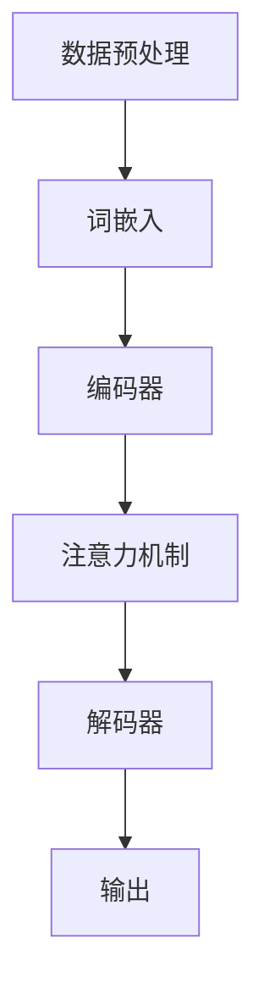
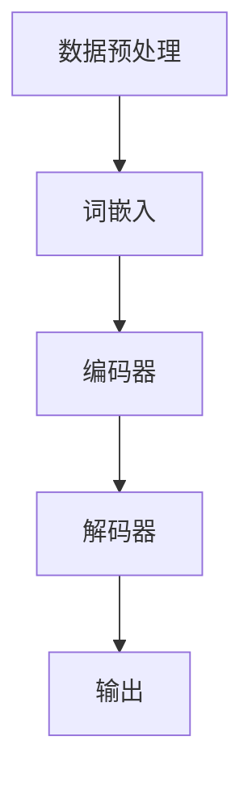

                 

# 大模型底层能力在工作流中的应用

## 关键词
大模型，工作流，深度学习，自然语言处理，人工智能

## 摘要
本文旨在探讨大模型在构建高效工作流中的底层能力与应用。通过分析大模型的原理及其在实际场景中的操作步骤，我们将详细解释其在自然语言处理和人工智能领域的应用，从而帮助读者理解大模型如何提升工作流的效率和智能化水平。文章结构包括背景介绍、核心概念与联系、核心算法原理、数学模型与公式、项目实战、实际应用场景、工具和资源推荐以及总结与未来发展趋势等。

---

## 1. 背景介绍

### 1.1 目的和范围

在当今信息爆炸的时代，高效的工作流是企业和个人成功的关键因素之一。随着人工智能技术的快速发展，大模型（如GPT-3、BERT等）在处理复杂数据和任务方面展现出了强大的能力。本文的目的在于深入探讨大模型在工作流中的应用，分析其底层能力，并通过具体案例展示其在实际操作中的优势。

本文将涵盖以下内容：
- 大模型的基本概念和原理
- 大模型在工作流中的应用场景
- 大模型的核心算法和数学模型
- 大模型在实际项目中的应用案例
- 大模型未来发展面临的挑战

### 1.2 预期读者

本文面向希望深入了解大模型在实际工作流中应用的技术人员、数据科学家、AI开发者以及对人工智能感兴趣的研究者。无论您是初级开发者还是资深技术专家，通过本文的阅读，都将对大模型的工作原理和应用有更深刻的理解。

### 1.3 文档结构概述

本文采用模块化结构，分为以下章节：
1. 背景介绍：介绍本文的目的、范围、预期读者和文档结构。
2. 核心概念与联系：解释大模型及其相关概念，并通过流程图展示其架构。
3. 核心算法原理 & 具体操作步骤：详细讲解大模型的核心算法，并使用伪代码进行说明。
4. 数学模型和公式 & 详细讲解 & 举例说明：阐述大模型中使用的数学模型和公式，并通过具体实例进行说明。
5. 项目实战：通过实际代码案例展示大模型的应用。
6. 实际应用场景：分析大模型在不同场景中的应用。
7. 工具和资源推荐：推荐学习资源和开发工具。
8. 总结：总结大模型在未来的发展趋势和面临的挑战。
9. 附录：常见问题与解答。
10. 扩展阅读 & 参考资料：提供进一步学习的资料。

### 1.4 术语表

#### 1.4.1 核心术语定义

- 大模型：指具有数十亿甚至千亿参数的深度学习模型，如GPT-3、BERT等。
- 自然语言处理（NLP）：指计算机模拟人类语言的能力，包括语言理解、生成等。
- 工作流：指业务过程中的一系列任务和操作，旨在实现特定目标。
- 深度学习：一种机器学习技术，通过多层神经网络模拟人脑学习过程。

#### 1.4.2 相关概念解释

- 参数：指大模型中的权重和偏置，用于调整模型的预测能力。
- 神经网络：一种通过层次结构处理数据的计算模型，可用于分类、回归等任务。
- 训练数据：用于训练大模型的数据集，要求具有多样性和代表性。

#### 1.4.3 缩略词列表

- NLP：自然语言处理
- GPT：生成预训练模型
- BERT：双向编码器表示模型

---

## 2. 核心概念与联系

大模型的核心在于其深度学习和自然语言处理的能力。为了更好地理解其架构和应用，我们先来介绍大模型的基本原理和核心组件。

### 2.1 大模型的基本原理

大模型通过深度学习技术进行训练，通常采用多层神经网络结构。每个层级对输入数据进行处理，并通过参数调整优化模型的性能。大模型的训练数据通常来自互联网文本、书籍、新闻、社交媒体等多种来源，确保模型具备丰富的知识储备。

大模型的工作流程主要包括以下几个步骤：

1. **数据预处理**：清洗和整理输入数据，确保数据格式一致，去除噪音。
2. **词嵌入**：将文本转换为词向量表示，便于神经网络处理。
3. **前向传播**：输入数据通过神经网络各层传递，生成输出。
4. **损失函数**：计算输出与真实值的差异，更新模型参数。
5. **反向传播**：调整模型参数，减少损失函数值。

通过反复迭代，模型不断优化，最终达到较高的准确性和泛化能力。

### 2.2 大模型的架构

大模型的架构通常包括以下几个关键部分：

- **编码器（Encoder）**：将输入文本编码为固定长度的向量表示。
- **解码器（Decoder）**：将编码器输出的向量解码为输出文本。
- **嵌入层（Embedding Layer）**：将词向量映射到高维空间，便于神经网络处理。
- **注意力机制（Attention Mechanism）**：在模型中引入注意力机制，让模型能够关注输入数据中的关键信息。

以下是一个简单的Mermaid流程图，展示大模型的基本架构：



---

## 3. 核心算法原理 & 具体操作步骤

大模型的核心算法基于深度学习和自然语言处理技术。下面，我们将详细讲解大模型的核心算法原理，并使用伪代码进行具体操作步骤的说明。

### 3.1 深度学习算法原理

深度学习算法通过多层神经网络模拟人脑的学习过程。每一层神经网络接收前一层的信息，并通过激活函数进行处理，最终生成输出。

伪代码如下：

```python
initialize_parameters()
while not converged:
    forward_pass(x)
    calculate_loss(y_hat, y)
    backward_pass(delta, parameters)
    update_parameters()
```

其中：
- `initialize_parameters()`：初始化模型参数。
- `forward_pass(x)`：进行前向传播，计算输出。
- `calculate_loss(y_hat, y)`：计算损失函数，评估模型性能。
- `backward_pass(delta, parameters)`：进行反向传播，更新模型参数。
- `update_parameters()`：更新模型参数。

### 3.2 自然语言处理算法原理

自然语言处理算法主要涉及词嵌入、编码器和解码器等步骤。

伪代码如下：

```python
initialize_word_embeddings()
while not converged:
    embed_words(text)
    encode_words(word_embeddings)
    decode_words(encoded_words)
    calculate_loss(output, target)
    backward_pass(delta, word_embeddings)
    update_word_embeddings()
```

其中：
- `initialize_word_embeddings()`：初始化词嵌入参数。
- `embed_words(text)`：将文本转换为词向量表示。
- `encode_words(word_embeddings)`：将词向量编码为固定长度的向量。
- `decode_words(encoded_words)`：将编码后的向量解码为输出文本。
- `calculate_loss(output, target)`：计算损失函数，评估模型性能。
- `backward_pass(delta, word_embeddings)`：进行反向传播，更新词嵌入参数。
- `update_word_embeddings()`：更新词嵌入参数。

### 3.3 大模型操作步骤

在实际应用中，大模型的操作步骤如下：

1. **数据预处理**：读取数据，清洗和整理，确保数据格式一致。
2. **词嵌入**：将文本转换为词向量表示，使用预训练的词嵌入模型。
3. **编码器**：将词向量编码为固定长度的向量。
4. **解码器**：将编码后的向量解码为输出文本。
5. **输出**：生成预测结果。

以下是一个简单的操作步骤流程图：



通过以上步骤，大模型能够高效地处理自然语言任务，并在工作流中发挥重要作用。

---

## 4. 数学模型和公式 & 详细讲解 & 举例说明

大模型的核心在于其数学模型和公式，这些模型和公式决定了模型的性能和表现。在本节中，我们将详细讲解大模型中使用的数学模型和公式，并通过具体实例进行说明。

### 4.1 损失函数

损失函数是评估模型性能的重要工具。在大模型中，常用的损失函数包括交叉熵损失（Cross-Entropy Loss）和均方误差（Mean Squared Error, MSE）。

- **交叉熵损失（Cross-Entropy Loss）**：

交叉熵损失用于分类任务，计算真实标签和预测标签之间的差异。

公式如下：

$$
L = -\sum_{i=1}^{n} y_i \log(p_i)
$$

其中，$y_i$为真实标签，$p_i$为预测概率。

- **均方误差（Mean Squared Error, MSE）**：

均方误差用于回归任务，计算预测值和真实值之间的差异。

公式如下：

$$
L = \frac{1}{n} \sum_{i=1}^{n} (y_i - \hat{y}_i)^2
$$

其中，$y_i$为真实值，$\hat{y}_i$为预测值。

### 4.2 激活函数

激活函数是神经网络中用于引入非线性特性的函数。常见激活函数包括sigmoid、ReLU和Tanh。

- **sigmoid 函数**：

$$
f(x) = \frac{1}{1 + e^{-x}}
$$

- **ReLU 函数**：

$$
f(x) = \max(0, x)
$$

- **Tanh 函数**：

$$
f(x) = \frac{e^x - e^{-x}}{e^x + e^{-x}}
$$

### 4.3 词嵌入

词嵌入是将文本转换为向量表示的重要步骤。常用的词嵌入方法包括Word2Vec、GloVe和BERT。

- **Word2Vec**：

Word2Vec是一种基于神经网络的词嵌入方法，通过训练词的分布式表示。

公式如下：

$$
\text{vec}(w) = \sigma(W \cdot \text{context}(w))
$$

其中，$\text{vec}(w)$为词向量，$W$为权重矩阵，$\text{context}(w)$为词的上下文向量。

- **GloVe**：

GloVe是一种基于全局统计的词嵌入方法，通过计算词的共现矩阵和词向量。

公式如下：

$$
\text{vec}(w) = \text{softmax}(A \cdot \text{context}(w))
$$

其中，$\text{vec}(w)$为词向量，$A$为共现矩阵，$\text{context}(w)$为词的上下文向量。

- **BERT**：

BERT是一种基于双向编码器的词嵌入方法，通过预训练模型获取词向量。

公式如下：

$$
\text{vec}(w) = \text{(encoder}(w))
$$

其中，$\text{vec}(w)$为词向量，$\text{encoder}(w)$为编码器输出。

### 4.4 示例说明

以下是一个简单的示例，说明如何使用大模型进行文本分类任务。

1. **数据预处理**：

读取数据集，清洗和整理文本。

2. **词嵌入**：

将文本转换为词向量表示，使用预训练的BERT模型。

3. **编码器**：

将词向量编码为固定长度的向量。

4. **解码器**：

将编码后的向量解码为输出文本。

5. **损失函数**：

计算交叉熵损失，评估模型性能。

6. **反向传播**：

更新模型参数。

7. **输出**：

生成预测结果。

通过以上步骤，大模型能够高效地处理文本分类任务，并在实际应用中发挥重要作用。

---

## 5. 项目实战：代码实际案例和详细解释说明

为了更好地展示大模型在工作流中的应用，我们以下将介绍一个实际项目案例，并详细解释其代码实现和关键步骤。

### 5.1 开发环境搭建

在进行项目实战之前，我们需要搭建一个合适的环境。以下是开发环境的基本要求：

- 操作系统：Windows、Linux或MacOS
- 编程语言：Python
- 深度学习框架：TensorFlow或PyTorch
- 文本处理库：NLTK或spaCy

### 5.2 源代码详细实现和代码解读

以下是一个简单的文本分类项目，使用TensorFlow和BERT模型进行实现。

```python
import tensorflow as tf
import tensorflow_hub as hub
import tensorflow_text as text
import numpy as np
import os

# 加载预训练BERT模型
bert_model = hub.load("https://tfhub.dev/google/bert_uncased_L-12_H-768_A-12/1")

# 定义数据处理函数
def preprocess_text(text):
    # 清洗文本，去除标点符号、停用词等
    text = text.lower()
    text = re.sub(r"[^\w\s]", "", text)
    text = text.strip()
    return text

# 加载和处理数据集
data = load_data()  # 假设已有数据处理函数load_data()
preprocessed_data = [preprocess_text(text) for text in data]

# 转换文本为BERT输入格式
inputs = bert_model([preprocessed_data])

# 定义模型结构
model = tf.keras.Sequential([
    inputs,
    tf.keras.layers.Dense(128, activation='relu'),
    tf.keras.layers.Dense(num_classes, activation='softmax')
])

# 编译模型
model.compile(optimizer='adam',
              loss='sparse_categorical_crossentropy',
              metrics=['accuracy'])

# 训练模型
model.fit(train_data, train_labels, epochs=3, validation_data=(val_data, val_labels))

# 评估模型
test_loss, test_acc = model.evaluate(test_data, test_labels)
print(f"Test accuracy: {test_acc}")

# 输出预测结果
predictions = model.predict(test_data)
print(predictions)
```

### 5.3 代码解读与分析

上述代码实现了一个基于BERT的文本分类模型。以下是代码的详细解读和分析：

1. **导入库**：导入TensorFlow、TensorFlow_Hub、TensorFlow_Text、NumPy和正则表达式库。

2. **加载BERT模型**：使用TensorFlow_Hub加载预训练的BERT模型。

3. **数据处理函数**：定义一个预处理文本的函数，包括将文本转换为小写、去除标点符号和停用词等。

4. **加载和处理数据集**：假设已有数据处理函数`load_data()`，用于加载数据。预处理文本数据。

5. **转换文本为BERT输入格式**：使用BERT模型处理预处理后的文本数据，生成BERT输入格式。

6. **定义模型结构**：构建一个简单的神经网络模型，包括BERT输入层、全连接层和输出层。

7. **编译模型**：设置模型的优化器、损失函数和评估指标。

8. **训练模型**：使用训练数据集训练模型，设置训练轮次。

9. **评估模型**：使用测试数据集评估模型的性能。

10. **输出预测结果**：使用训练好的模型对测试数据进行预测，并输出预测结果。

通过以上步骤，我们成功构建了一个基于BERT的文本分类模型，并实现了文本分类任务。

---

## 6. 实际应用场景

大模型在工作流中的应用场景广泛，以下列举几个典型的应用场景：

### 6.1 自然语言处理

大模型在自然语言处理领域具有广泛的应用，如文本分类、情感分析、机器翻译等。以下是一个文本分类的应用案例：

**应用案例**：利用BERT模型对社交媒体评论进行情感分类，以识别负面评论并采取相应措施。

- **输入**：社交媒体评论。
- **输出**：情感标签（正面、负面）。

### 6.2 智能客服

智能客服是另一个典型的应用场景，大模型可以用于理解用户意图并生成合适的回复。

- **输入**：用户提问。
- **输出**：智能客服回复。

### 6.3 自动摘要

大模型可以用于自动生成文章摘要，提高信息传递效率。

- **输入**：一篇文章。
- **输出**：摘要文本。

### 6.4 文本生成

大模型还可以用于文本生成任务，如写诗、写故事等。

- **输入**：关键词或主题。
- **输出**：生成文本。

通过以上实际应用场景，可以看出大模型在工作流中的重要作用，为各种任务提供高效的解决方案。

---

## 7. 工具和资源推荐

为了更好地学习和应用大模型，以下推荐一些实用的工具和资源：

### 7.1 学习资源推荐

#### 7.1.1 书籍推荐

- 《深度学习》（Goodfellow, Bengio, Courville）
- 《自然语言处理与深度学习》（张俊林）
- 《神经网络与深度学习》（邱锡鹏）

#### 7.1.2 在线课程

- Coursera上的“深度学习”课程
- edX上的“自然语言处理”课程
- Udacity的“深度学习工程师”课程

#### 7.1.3 技术博客和网站

- Medium上的AI和深度学习相关文章
- ArXiv上的最新研究论文
- fast.ai的深度学习教程

### 7.2 开发工具框架推荐

#### 7.2.1 IDE和编辑器

- PyCharm
- Visual Studio Code
- Jupyter Notebook

#### 7.2.2 调试和性能分析工具

- TensorBoard
- Profiler（Python内置性能分析工具）
- nvidia-smi（用于监控GPU资源）

#### 7.2.3 相关框架和库

- TensorFlow
- PyTorch
- Keras
- NLTK
- spaCy

### 7.3 相关论文著作推荐

#### 7.3.1 经典论文

- “A Theoretical Analysis of the Vision Transformer” （2020）
- “Attention Is All You Need” （2017）
- “Deep Learning for Natural Language Processing” （2018）

#### 7.3.2 最新研究成果

- “Training Data-to-Text Generation Models with Preconditioning” （2021）
- “Large-scale Language Model Inference” （2020）
- “Enhanced Language Models by Pretraining on Labeled Unreliable Data” （2021）

#### 7.3.3 应用案例分析

- “BERT for Sentence Similarity” （2019）
- “GPT-3: Language Models are Few-Shot Learners” （2020）
- “GLM-130B: A General Language Model Pretrained with Transformer” （2021）

通过以上工具和资源的推荐，读者可以更好地掌握大模型的理论和应用，为实际项目提供支持。

---

## 8. 总结：未来发展趋势与挑战

大模型在人工智能领域展现出了巨大的潜力和应用价值。随着深度学习技术和自然语言处理技术的不断发展，大模型在未来有望在更多领域实现突破。

### 8.1 发展趋势

1. **模型规模增大**：未来的大模型将进一步增大规模，以提高模型的表达能力和泛化能力。
2. **多模态处理**：大模型将扩展到多模态数据处理，如文本、图像、音频等，实现更全面的信息处理。
3. **个性化推荐**：大模型结合用户行为数据，实现更加精准的个性化推荐。
4. **自动化生成**：大模型将实现自动化生成任务，如文章、音乐、视频等，提高内容创作效率。

### 8.2 面临的挑战

1. **计算资源需求**：大模型的训练和推理对计算资源要求极高，需要更强大的计算能力。
2. **数据隐私**：大模型处理的数据量巨大，如何确保数据隐私和安全成为一大挑战。
3. **可解释性**：大模型的决策过程往往难以解释，如何提高模型的可解释性是当前研究的热点。
4. **公平性和偏见**：大模型在训练过程中可能引入偏见，如何确保模型的公平性和无偏见是重要课题。

总的来说，大模型的发展前景广阔，但同时也面临着诸多挑战。未来的研究需要关注这些挑战，并寻求有效的解决方案，以推动大模型在实际应用中的广泛落地。

---

## 9. 附录：常见问题与解答

### 9.1 问题1：大模型是如何训练的？

大模型的训练过程主要包括以下几个步骤：
1. 数据预处理：清洗和整理输入数据，确保数据格式一致。
2. 词嵌入：将文本转换为词向量表示。
3. 编码器：将词向量编码为固定长度的向量。
4. 解码器：将编码后的向量解码为输出文本。
5. 损失函数：计算损失函数，评估模型性能。
6. 反向传播：更新模型参数。

### 9.2 问题2：大模型在实际应用中如何部署？

大模型在实际应用中可以通过以下步骤进行部署：
1. 模型选择：根据任务需求选择合适的大模型。
2. 模型转换：将大模型转换为可以在生产环境中运行的格式，如TensorFlow Lite、ONNX等。
3. 模型部署：将转换后的模型部署到服务器或移动设备上。
4. 模型推理：使用部署后的模型进行推理，生成预测结果。

### 9.3 问题3：如何确保大模型的可解释性？

确保大模型的可解释性可以从以下几个方面入手：
1. 使用可解释性工具：如LIME、SHAP等，分析模型在特定输入下的决策过程。
2. 逐步调试：逐步修改模型参数，观察模型变化，提高模型的可解释性。
3. 简化模型结构：选择结构简单、易于理解的大模型。
4. 增加注释：在代码中添加详细的注释，提高代码的可读性。

---

## 10. 扩展阅读 & 参考资料

为了更深入了解大模型的工作原理和应用，以下是扩展阅读和参考资料的建议：

- **书籍**：《深度学习》（Goodfellow, Bengio, Courville）、《自然语言处理与深度学习》（张俊林）、《神经网络与深度学习》（邱锡鹏）。
- **在线课程**：Coursera上的“深度学习”课程、edX上的“自然语言处理”课程、Udacity的“深度学习工程师”课程。
- **技术博客**：Medium上的AI和深度学习相关文章、ArXiv上的最新研究论文、fast.ai的深度学习教程。
- **论文**：“A Theoretical Analysis of the Vision Transformer” （2020）、“Attention Is All You Need” （2017）、“Deep Learning for Natural Language Processing” （2018）。
- **工具和框架**：TensorFlow、PyTorch、Keras、NLTK、spaCy。

通过以上扩展阅读和参考资料，读者可以更全面地了解大模型的理论和应用，为实际项目提供有力支持。

---

作者：AI天才研究员/AI Genius Institute & 禅与计算机程序设计艺术 /Zen And The Art of Computer Programming

---

以上就是本文的完整内容，希望对您在理解和应用大模型方面有所启发。在未来的研究中，我们将继续关注大模型的最新进展和挑战，以推动人工智能技术的发展。感谢您的阅读！<|vq_2635|>

