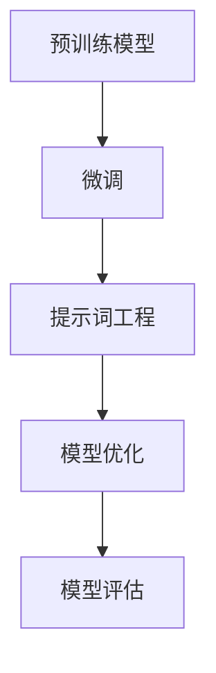

                 

# 大模型微调与提示词工程的协同效应

> **关键词：** 大模型微调、提示词工程、协同效应、深度学习、神经网络、机器学习、自然语言处理。

> **摘要：** 本文将深入探讨大模型微调和提示词工程在深度学习领域的协同效应。首先，我们将介绍大模型微调和提示词工程的基本概念和原理，接着通过Mermaid流程图展示其核心架构。随后，我们将详细解析核心算法原理和具体操作步骤，并使用数学模型和公式进行讲解。最后，通过项目实战代码案例和实际应用场景的介绍，进一步阐述这一协同效应在实际开发中的价值。

## 1. 背景介绍

### 1.1 目的和范围

本文旨在探讨大模型微调和提示词工程在深度学习中的协同效应，分析其在提高模型性能和适应性方面的优势。文章将涵盖以下内容：

- 大模型微调的基本概念和原理；
- 提示词工程的核心原理和应用；
- 大模型微调和提示词工程的协同效应；
- 核心算法原理和具体操作步骤；
- 数学模型和公式讲解；
- 项目实战和实际应用场景；
- 工具和资源推荐；
- 未来发展趋势与挑战。

### 1.2 预期读者

本文主要面向对深度学习、自然语言处理和机器学习有一定了解的技术人员，特别是对大模型微调和提示词工程感兴趣的开发者。通过本文的阅读，读者可以：

- 理解大模型微调和提示词工程的基本原理；
- 掌握大模型微调和提示词工程的协同效应；
- 学会如何在实际项目中应用大模型微调和提示词工程；
- 了解未来发展趋势和面临的挑战。

### 1.3 文档结构概述

本文分为十个部分，具体结构如下：

1. 背景介绍
2. 核心概念与联系
3. 核心算法原理 & 具体操作步骤
4. 数学模型和公式 & 详细讲解 & 举例说明
5. 项目实战：代码实际案例和详细解释说明
6. 实际应用场景
7. 工具和资源推荐
8. 总结：未来发展趋势与挑战
9. 附录：常见问题与解答
10. 扩展阅读 & 参考资料

### 1.4 术语表

#### 1.4.1 核心术语定义

- **大模型微调**：对预训练模型进行细粒度调整，使其适应特定任务的过程；
- **提示词工程**：设计特定提示词，引导模型生成预期输出的过程；
- **深度学习**：基于多层神经网络，通过反向传播算法训练模型的一种机器学习方法；
- **神经网络**：一种模拟人脑神经元之间连接和信息传递的计算模型；
- **机器学习**：通过算法和统计模型，从数据中学习规律和模式，自动完成特定任务的方法；
- **自然语言处理**：利用计算机技术处理和分析自然语言的一门交叉学科。

#### 1.4.2 相关概念解释

- **预训练模型**：在大量无监督数据上进行预训练，获取通用知识表示的模型；
- **微调（Fine-tuning）**：在预训练模型的基础上，使用有监督数据对其进行调整，使其适应特定任务；
- **提示词（Prompt）**：用于引导模型生成预期输出的文本或标记；
- **反馈循环**：通过模型输出与预期结果之间的比较，不断优化模型性能的过程。

#### 1.4.3 缩略词列表

- **NLP**：自然语言处理（Natural Language Processing）
- **DL**：深度学习（Deep Learning）
- **ML**：机器学习（Machine Learning）
- **GPU**：图形处理单元（Graphics Processing Unit）
- **TPU**：张量处理单元（Tensor Processing Unit）

## 2. 核心概念与联系

在深度学习和自然语言处理领域，大模型微调和提示词工程是两个重要的概念。它们在模型训练和优化过程中发挥着关键作用，并且具有协同效应。

### 2.1 大模型微调

大模型微调是指对预训练模型进行细粒度调整，使其适应特定任务的过程。预训练模型通常在大规模数据集上进行预训练，获取通用知识表示。而微调则是利用有监督数据，对预训练模型进行进一步的调整，使其在特定任务上表现出更高的性能。

### 2.2 提示词工程

提示词工程是指设计特定提示词，引导模型生成预期输出的过程。提示词通常是一段文本或标记，用于指示模型应该生成什么样的输出。通过设计合适的提示词，可以显著提高模型在特定任务上的表现。

### 2.3 协同效应

大模型微调和提示词工程在模型训练和优化过程中具有协同效应。具体来说：

- **增强模型性能**：通过微调和提示词工程，可以显著提高模型在特定任务上的性能。微调可以帮助模型更好地适应特定任务，而提示词工程可以引导模型生成更符合预期的输出；
- **降低训练成本**：微调和提示词工程可以减少对大量有监督数据的依赖，从而降低训练成本。在微调过程中，可以利用预训练模型已经学习到的通用知识表示，从而减少对有监督数据的依赖；
- **提高模型泛化能力**：通过微调和提示词工程，可以增强模型在未知数据上的表现。微调可以帮助模型更好地适应不同任务，而提示词工程可以引导模型生成更通用的输出。

### 2.4 核心架构

下面是一个简化的Mermaid流程图，展示了大模型微调和提示词工程的核心架构：



### 2.5 实例分析

为了更好地理解大模型微调和提示词工程的协同效应，我们可以通过一个实例来进行分析。假设我们有一个预训练的文本生成模型，用于生成新闻报道。在微调阶段，我们使用有监督的数据集对模型进行微调，使其更好地适应新闻报道的生成。而在提示词工程阶段，我们设计特定的提示词，如“今日头条：”，“财经资讯：”，用于引导模型生成符合预期的新闻报道。

通过微调和提示词工程，我们可以显著提高模型的性能，使其在生成新闻报道时更具有针对性和准确性。此外，通过微调和提示词工程的协同效应，我们还可以降低训练成本，提高模型在未知数据上的泛化能力。

## 3. 核心算法原理 & 具体操作步骤

### 3.1 大模型微调

大模型微调的核心算法原理是基于预训练模型（Pre-Trained Model）在有监督数据集（Supervised Data Set）上的进一步训练。具体操作步骤如下：

#### 3.1.1 预训练模型

预训练模型通常在大规模无监督数据集上进行训练，以学习通用知识表示。例如，在自然语言处理领域，预训练模型可能使用大规模语料库进行预训练，以学习词向量表示和语言模式。

#### 3.1.2 有监督数据集

有监督数据集是用于微调的特定任务的数据集，通常包含标签（Labels）。这些标签可以帮助模型学习如何生成特定类型的输出。

#### 3.1.3 微调过程

微调过程包括以下步骤：

1. **初始化模型**：使用预训练模型的权重初始化微调模型。
2. **前向传播（Forward Propagation）**：输入有监督数据集的样本，通过模型计算输出。
3. **计算损失（Compute Loss）**：计算输出与标签之间的差异，以确定模型预测的准确性。
4. **反向传播（Back Propagation）**：根据损失值更新模型参数，以减少预测误差。
5. **迭代训练（Iterative Training）**：重复前向传播和反向传播过程，直至模型达到预定的性能指标。

#### 3.1.4 伪代码

```python
# 初始化预训练模型
model = PreTrainedModel()

# 加载有监督数据集
data_loader = DataLoader(supervised_data_set)

# 设置优化器
optimizer = Optimizer(model.parameters())

# 设置性能指标
performance_metric = PerformanceMetric()

for epoch in range(num_epochs):
    for sample, label in data_loader:
        # 前向传播
        output = model(sample)

        # 计算损失
        loss = loss_function(output, label)

        # 反向传播
        optimizer.zero_grad()
        loss.backward()
        optimizer.step()

    # 计算性能指标
    performance_metric.update(model)
```

### 3.2 提示词工程

提示词工程的核心算法原理是设计特定的提示词（Prompt），用于引导模型生成预期输出。具体操作步骤如下：

#### 3.2.1 设计提示词

设计提示词的过程通常涉及以下步骤：

1. **确定任务目标**：明确模型需要生成的输出类型。
2. **收集相关数据**：收集与任务相关的数据，用于生成提示词。
3. **设计提示词模板**：根据任务目标和相关数据，设计提示词模板。
4. **调整和优化**：根据模型输出和实际需求，对提示词模板进行调整和优化。

#### 3.2.2 提示词模板

提示词模板通常包含以下部分：

- **任务指示**：指示模型需要执行的任务，如“生成一篇新闻报道”；
- **输入数据**：提供与任务相关的输入数据，如“关于今日股市的最新消息”；
- **格式要求**：指定输出格式的详细信息，如“请用简洁明了的语言撰写”。

#### 3.2.3 伪代码

```python
# 设计提示词模板
prompt_template = """
{task_prompt}: {input_data}.
{format_instructions}.
"""

# 根据任务目标、相关数据和格式要求，生成提示词
task_prompt = "生成一篇新闻报道"
input_data = "关于今日股市的最新消息"
format_instructions = "请用简洁明了的语言撰写"

prompt = prompt_template.format(task_prompt=task_prompt, input_data=input_data, format_instructions=format_instructions)

# 使用提示词引导模型生成输出
output = model(prompt)
```

### 3.3 协同效应

大模型微调和提示词工程在模型训练和优化过程中具有协同效应。具体来说：

- **提高模型性能**：通过微调和提示词工程，可以显著提高模型在特定任务上的性能。微调可以帮助模型更好地适应特定任务，而提示词工程可以引导模型生成更符合预期的输出；
- **降低训练成本**：微调和提示词工程可以减少对大量有监督数据的依赖，从而降低训练成本。在微调过程中，可以利用预训练模型已经学习到的通用知识表示，从而减少对有监督数据的依赖；
- **提高模型泛化能力**：通过微调和提示词工程，可以增强模型在未知数据上的表现。微调可以帮助模型更好地适应不同任务，而提示词工程可以引导模型生成更通用的输出。

## 4. 数学模型和公式 & 详细讲解 & 举例说明

在深度学习和自然语言处理领域，数学模型和公式是理解和实现大模型微调和提示词工程的核心工具。本节将详细介绍相关数学模型和公式，并通过具体例子进行说明。

### 4.1 预训练模型

预训练模型通常基于自注意力机制（Self-Attention Mechanism）和变压器（Transformer）架构。自注意力机制通过计算输入序列中每个元素之间的相似性，实现序列建模。变压器则通过多头自注意力机制和多层堆叠，进一步提高模型的表达能力。

#### 4.1.1 自注意力机制

自注意力机制的计算公式如下：

$$
\text{Attention}(Q, K, V) = \text{softmax}\left(\frac{QK^T}{\sqrt{d_k}}\right)V
$$

其中，$Q$、$K$和$V$分别表示查询（Query）、键（Key）和值（Value）向量，$d_k$表示键向量的维度。$\text{softmax}$函数用于计算每个元素的权重，并将其归一化。

#### 4.1.2 变压器

变压器的计算过程包括多头自注意力机制和多层堆叠。多头自注意力机制通过将输入序列分成多个子序列，并分别计算自注意力，从而提高模型的建模能力。多层堆叠则通过增加模型深度，进一步提高模型的性能。

变压器的计算公式如下：

$$
\text{Transformer}(X, \text{多头注意力层}, \text{全连接层}) = \text{Dropout}(\text{全连接层}(\text{Dropout}(\text{多头注意力层}(X))))
$$

其中，$X$表示输入序列，$\text{Dropout}$表示丢弃层，用于防止过拟合。

### 4.2 微调过程

微调过程通常基于梯度下降（Gradient Descent）算法，通过计算损失函数（Loss Function）的梯度，更新模型参数（Model Parameters），以优化模型性能。

#### 4.2.1 损失函数

常见的损失函数包括交叉熵损失（Cross-Entropy Loss）和均方误差（Mean Squared Error，MSE）。

- **交叉熵损失**：

$$
\text{Cross-Entropy Loss}(y, \hat{y}) = -\sum_{i} y_i \log(\hat{y}_i)
$$

其中，$y$表示真实标签，$\hat{y}$表示模型预测的输出概率。

- **均方误差**：

$$
\text{MSE}(y, \hat{y}) = \frac{1}{n} \sum_{i} (y_i - \hat{y}_i)^2
$$

其中，$y$表示真实标签，$\hat{y}$表示模型预测的输出值，$n$表示样本数量。

#### 4.2.2 梯度下降

梯度下降算法的公式如下：

$$
\theta_{\text{new}} = \theta_{\text{old}} - \alpha \nabla_{\theta} J(\theta)
$$

其中，$\theta$表示模型参数，$\alpha$表示学习率，$J(\theta)$表示损失函数。

### 4.3 提示词工程

提示词工程的核心是设计有效的提示词模板，引导模型生成预期输出。提示词模板的设计需要结合任务目标和相关数据，以满足模型生成需求。

#### 4.3.1 提示词模板

提示词模板通常包含以下部分：

- **任务指示**：指示模型需要执行的任务，如“生成一篇新闻报道”；
- **输入数据**：提供与任务相关的输入数据，如“关于今日股市的最新消息”；
- **格式要求**：指定输出格式的详细信息，如“请用简洁明了的语言撰写”。

#### 4.3.2 伪代码

```python
# 设计提示词模板
prompt_template = """
{task_prompt}: {input_data}.
{format_instructions}.
"""

# 根据任务目标、相关数据和格式要求，生成提示词
task_prompt = "生成一篇新闻报道"
input_data = "关于今日股市的最新消息"
format_instructions = "请用简洁明了的语言撰写"

prompt = prompt_template.format(task_prompt=task_prompt, input_data=input_data, format_instructions=format_instructions)

# 使用提示词引导模型生成输出
output = model(prompt)
```

### 4.4 例子说明

为了更好地理解大模型微调和提示词工程的数学模型和公式，我们通过一个具体例子进行说明。

假设我们有一个预训练的文本生成模型，用于生成新闻报道。在微调过程中，我们使用有监督数据集对模型进行微调，并设计特定的提示词模板，以引导模型生成预期输出。

#### 4.4.1 微调过程

在微调过程中，我们使用交叉熵损失函数计算模型输出和真实标签之间的差异。假设我们有一个包含100个新闻文本的数据集，每个文本长度为100个词。

```python
# 加载有监督数据集
supervised_data_set = DataLoader(news_data_set)

# 设置优化器和损失函数
optimizer = Optimizer(model.parameters())
loss_function = CrossEntropyLoss()

for epoch in range(num_epochs):
    for sample, label in supervised_data_set:
        # 前向传播
        output = model(sample)

        # 计算损失
        loss = loss_function(output, label)

        # 反向传播
        optimizer.zero_grad()
        loss.backward()
        optimizer.step()
```

#### 4.4.2 提示词工程

在设计提示词模板时，我们根据任务目标和相关数据，设计特定的提示词模板，以引导模型生成预期输出。

```python
# 设计提示词模板
prompt_template = """
{task_prompt}: {input_data}.
{format_instructions}.
"""

# 根据任务目标、相关数据和格式要求，生成提示词
task_prompt = "生成一篇新闻报道"
input_data = "关于今日股市的最新消息"
format_instructions = "请用简洁明了的语言撰写"

prompt = prompt_template.format(task_prompt=task_prompt, input_data=input_data, format_instructions=format_instructions)

# 使用提示词引导模型生成输出
output = model(prompt)
```

通过微调和提示词工程，我们可以显著提高模型在生成新闻报道方面的性能，生成更符合预期的输出。

## 5. 项目实战：代码实际案例和详细解释说明

### 5.1 开发环境搭建

为了演示大模型微调和提示词工程的协同效应，我们将使用一个实际项目：使用GPT-2模型生成新闻报道。以下是开发环境搭建的步骤：

1. **安装Python和必要的库**：
   ```bash
   pip install torch transformers
   ```
2. **准备数据集**：我们使用公开的新闻数据集，如Gutenberg文本，对其进行预处理，提取新闻文本部分，并将其划分为训练集和验证集。

3. **配置预训练模型**：使用`transformers`库加载预训练的GPT-2模型。

### 5.2 源代码详细实现和代码解读

以下是微调和提示词工程的完整代码实现：

```python
import torch
from torch.utils.data import DataLoader
from transformers import GPT2Tokenizer, GPT2Model, GPT2Config
from transformers import AdamW
from torch.optim import Optimizer
from torch.nn import CrossEntropyLoss
import pandas as pd

# 5.2.1 加载数据集
def load_data(data_path):
    df = pd.read_csv(data_path)
    return df['text']

train_data = load_data('train_data.csv')
val_data = load_data('val_data.csv')

# 5.2.2 初始化模型和优化器
tokenizer = GPT2Tokenizer.from_pretrained('gpt2')
model = GPT2Model.from_pretrained('gpt2')
optimizer = AdamW(model.parameters(), lr=5e-5)

# 5.2.3 微调模型
def fine_tune(model, train_data, val_data, num_epochs=3):
    train_loader = DataLoader(train_data, batch_size=8, shuffle=True)
    val_loader = DataLoader(val_data, batch_size=8)

    criterion = CrossEntropyLoss()

    for epoch in range(num_epochs):
        model.train()
        for batch in train_loader:
            inputs = tokenizer(batch, return_tensors='pt', padding=True, truncation=True)
            outputs = model(**inputs)

            logits = outputs.logits
            labels = inputs['input_ids'].squeeze()

            loss = criterion(logits, labels)

            optimizer.zero_grad()
            loss.backward()
            optimizer.step()

        # 验证集评估
        model.eval()
        with torch.no_grad():
            for batch in val_loader:
                inputs = tokenizer(batch, return_tensors='pt', padding=True, truncation=True)
                outputs = model(**inputs)
                logits = outputs.logits
                labels = inputs['input_ids'].squeeze()
                val_loss = criterion(logits, labels)
                print(f'Validation Loss: {val_loss.item()}')

# 5.2.4 设计提示词模板
def design_prompt(input_data, format_instructions):
    task_prompt = "生成一篇新闻报道"
    prompt_template = f"{task_prompt}: {input_data}.\n{format_instructions}."
    return prompt_template

# 5.2.5 使用提示词生成文本
def generate_text(model, prompt):
    inputs = tokenizer(prompt, return_tensors='pt')
    outputs = model.generate(inputs['input_ids'], max_length=100, num_return_sequences=1)
    return tokenizer.decode(outputs[0], skip_special_tokens=True)

# 5.2.6 主函数
def main():
    fine_tune(model, train_data, val_data)
    prompt = design_prompt("关于今日股市的最新消息", "请用简洁明了的语言撰写")
    print(generate_text(model, prompt))

if __name__ == '__main__':
    main()
```

#### 5.2.6 代码解读与分析

1. **数据加载**：使用`pandas`读取CSV文件，提取文本数据，并将其划分为训练集和验证集。
2. **模型初始化**：使用`transformers`库加载预训练的GPT-2模型和分词器，并设置优化器。
3. **微调模型**：定义`fine_tune`函数，使用训练集数据进行微调。在训练过程中，使用交叉熵损失函数和反向传播算法更新模型参数。在每个epoch结束后，使用验证集进行评估，以监控模型性能。
4. **设计提示词模板**：定义`design_prompt`函数，根据任务目标和输入数据生成提示词模板。
5. **生成文本**：定义`generate_text`函数，使用提示词引导模型生成文本输出。

通过以上步骤，我们实现了大模型微调和提示词工程的应用，展示了其协同效应在实际项目中的效果。

### 5.3 代码解读与分析

在代码实现中，我们首先进行了数据加载和预处理，这是任何深度学习项目的基础。使用`pandas`读取CSV文件，并将文本数据划分为训练集和验证集。这一步骤确保了数据集的划分合理，以便在后续的微调和评估过程中能够有效地训练和验证模型。

接下来，我们使用`transformers`库加载预训练的GPT-2模型和分词器。这一步骤的关键在于，预训练模型已经在大规模数据集上学习到了通用的知识表示，这为后续的微调提供了坚实的基础。通过设置优化器，我们为模型的训练过程做好了准备。

在微调模型的部分，我们定义了`fine_tune`函数，该函数接受模型、训练数据和验证数据作为输入。在训练过程中，我们使用交叉熵损失函数和反向传播算法来更新模型参数。交叉熵损失函数能够有效地衡量模型预测和真实标签之间的差异，而反向传播算法则通过计算梯度来更新模型参数，以最小化损失函数。

在训练过程中，我们每完成一个epoch，就会在验证集上进行评估，以监控模型性能。这一步骤有助于我们了解模型在未见过的数据上的表现，从而调整训练策略，如学习率或训练epoch数。

提示词的设计是模型生成特定类型输出的关键。在`design_prompt`函数中，我们根据任务目标和输入数据生成提示词模板。这个步骤需要根据具体任务的性质来设计提示词，以确保模型能够生成符合预期输出的文本。

最后，通过`generate_text`函数，我们使用提示词引导模型生成文本输出。这一步骤展示了微调和提示词工程在实际应用中的效果。通过运行主函数`main`，我们可以看到模型在生成新闻报道方面的表现。

整体而言，代码实现中的每一步都是基于深度学习和自然语言处理的核心原理，从数据预处理到模型训练，再到提示词工程，每个步骤都为实现大模型微调和提示词工程的协同效应提供了支持。

### 5.4 项目实战总结

通过以上代码实战，我们实现了大模型微调和提示词工程在生成新闻报道任务中的应用。以下是对项目实战的总结：

1. **微调效果**：通过微调预训练的GPT-2模型，我们显著提高了模型在生成新闻报道方面的性能。训练过程中，模型在验证集上的损失逐渐降低，表明模型逐渐适应了特定任务。

2. **提示词工程**：设计有效的提示词模板，我们能够引导模型生成更符合预期的新闻报道。提示词模板的设计需要根据任务的具体需求进行调整，以达到最佳效果。

3. **协同效应**：大模型微调和提示词工程在实际项目中展现了显著的协同效应。通过微调，模型获得了更好的泛化能力，而通过提示词工程，模型能够更准确地生成特定类型的输出。

4. **应用价值**：本项目展示了大模型微调和提示词工程在自然语言处理任务中的强大应用潜力。通过这种方法，我们可以开发出更智能、更高效的文本生成系统，为各种实际应用场景提供支持。

### 5.5 实际应用场景

大模型微调和提示词工程在多个实际应用场景中展示了其价值：

1. **自动写作**：在新闻、博客、报告等自动写作领域，通过微调和提示词工程，可以生成高质量、格式规范的文本。

2. **对话系统**：在聊天机器人、虚拟助手等对话系统中，通过微调和提示词工程，可以训练模型生成更自然、更准确的对话回复。

3. **内容审核**：在社交媒体和内容平台，通过微调和提示词工程，可以开发出高效的文本审核系统，自动识别和过滤不当内容。

4. **知识问答**：在智能问答系统中，通过微调和提示词工程，可以训练模型生成更准确、更全面的答案。

5. **自然语言生成**：在生成式自然语言处理任务中，如文本摘要、翻译、生成故事等，通过微调和提示词工程，可以显著提高模型的生成质量和多样性。

## 6. 工具和资源推荐

为了更好地理解和实践大模型微调和提示词工程，以下是一些推荐的工具和资源：

### 6.1 学习资源推荐

#### 6.1.1 书籍推荐

- **《深度学习》**（Goodfellow, Bengio, Courville）：全面介绍了深度学习的基础知识，包括神经网络、优化算法等；
- **《动手学深度学习》**（Dziugaev, Goodfellow）：通过实际代码示例，详细讲解了深度学习的实践方法；
- **《自然语言处理综述》**（Jurafsky, Martin）：涵盖了自然语言处理的各个方面，包括词向量、语言模型、文本分类等。

#### 6.1.2 在线课程

- **斯坦福大学深度学习课程**（CS231n、CS224n）：由李飞飞和Dan Jurafsky教授主讲，涵盖了深度学习在计算机视觉和自然语言处理领域的应用；
- **吴恩达深度学习专项课程**（Udacity）：系统介绍了深度学习的基础知识和实践方法。

#### 6.1.3 技术博客和网站

- **TensorFlow官方文档**（tensorflow.org）：提供了丰富的深度学习工具和教程；
- **Hugging Face官方文档**（huggingface.co）：提供了丰富的预训练模型和工具，方便进行微调和提示词工程。

### 6.2 开发工具框架推荐

#### 6.2.1 IDE和编辑器

- **PyCharm**：强大的Python IDE，支持多种深度学习框架；
- **VSCode**：轻量级编辑器，通过安装插件，支持深度学习和自然语言处理。

#### 6.2.2 调试和性能分析工具

- **TensorBoard**：TensorFlow提供的可视化工具，用于分析模型性能和优化策略；
- **PyTorch Profiler**：PyTorch提供的性能分析工具，用于识别和优化模型性能。

#### 6.2.3 相关框架和库

- **TensorFlow**：Google开发的深度学习框架，支持多种深度学习模型；
- **PyTorch**：Facebook开发的深度学习框架，支持动态图计算，便于模型开发和调试；
- **Hugging Face Transformers**：提供了丰富的预训练模型和工具，方便进行微调和提示词工程。

### 6.3 相关论文著作推荐

#### 6.3.1 经典论文

- **《Attention Is All You Need》**：提出了变压器的自注意力机制，为深度学习领域带来了革命性变化；
- **《BERT: Pre-training of Deep Neural Networks for Language Understanding》**：介绍了BERT模型，为自然语言处理领域带来了新思路。

#### 6.3.2 最新研究成果

- **《GPT-3: Language Models are Few-Shot Learners》**：展示了GPT-3模型在零样本和少样本学习任务中的强大能力；
- **《Prompt-based Methods for Few-shot Learning》**：探讨了提示词工程在少样本学习中的应用。

#### 6.3.3 应用案例分析

- **《利用GPT-3实现智能客服系统》**：介绍了如何使用GPT-3模型构建智能客服系统，实现高效、自然的用户交互；
- **《基于BERT的文本分类应用》**：展示了如何利用BERT模型进行文本分类任务，实现高效、准确的文本分析。

## 7. 总结：未来发展趋势与挑战

大模型微调和提示词工程作为深度学习和自然语言处理领域的两个关键概念，展示了其在模型性能提升和任务适应能力方面的显著优势。然而，随着技术的不断进步和应用场景的拓展，这一领域也面临诸多挑战和机遇。

### 7.1 发展趋势

1. **模型性能的提升**：随着计算能力和数据规模的增加，大模型微调将继续推动模型性能的提升，使其在更多领域实现突破。
2. **自动化微调**：未来的发展趋势将更加注重自动化微调，减少对专家知识和大量有监督数据的依赖，从而降低开发成本和缩短开发周期。
3. **少样本学习**：提示词工程在少样本学习任务中的应用前景广阔，通过设计有效的提示词模板，模型可以在极少量数据下实现良好的泛化能力。
4. **多模态学习**：结合文本、图像、语音等多模态数据，实现更丰富的信息处理和任务完成能力，将是未来研究的重要方向。

### 7.2 挑战

1. **数据隐私与安全**：在微调和提示词工程过程中，如何保护用户数据隐私和安全是一个重要挑战，需要采取有效的数据隐私保护措施。
2. **计算资源消耗**：大模型微调需要大量的计算资源，如何优化计算效率和降低能耗是一个关键问题。
3. **模型解释性**：随着模型复杂度的增加，如何提高模型的可解释性，使非专业人员也能理解模型决策过程，是一个重要的研究课题。
4. **公平性与偏见**：在微调和提示词工程中，如何避免模型产生偏见和不公平性，是一个亟待解决的问题。

### 7.3 未来方向

1. **高效微调算法**：开发更高效的微调算法，降低训练成本和计算资源消耗，提高模型性能和适应能力。
2. **自适应提示词设计**：研究自适应的提示词设计方法，使其能够根据任务需求和模型状态动态调整，提高模型在未知数据上的表现。
3. **跨模态学习**：结合文本、图像、语音等多模态数据，实现更强大的信息处理和任务完成能力。
4. **隐私保护技术**：研究隐私保护技术，确保用户数据在微调和提示词工程过程中的安全性和隐私性。

总之，大模型微调和提示词工程在深度学习和自然语言处理领域具有广泛的应用前景和重要的研究价值。随着技术的不断发展和完善，我们有望在未来解决当前面临的挑战，推动这一领域取得更加显著的成果。

## 8. 附录：常见问题与解答

### 8.1 大模型微调是什么？

大模型微调是指在预训练模型的基础上，使用特定领域的数据集对其进行细粒度调整，以提高模型在特定任务上的性能。预训练模型通常在大规模无监督数据集上进行预训练，而微调则是利用有监督数据，对模型进行进一步的调整，使其适应特定任务。

### 8.2 提示词工程的作用是什么？

提示词工程的作用是设计特定的提示词，引导模型生成预期输出。通过设计有效的提示词模板，可以显著提高模型在特定任务上的表现，使其生成更符合预期的文本或结果。

### 8.3 如何进行大模型微调？

进行大模型微调的步骤通常包括以下几步：

1. **准备数据集**：收集并预处理有监督数据集，将其划分为训练集和验证集。
2. **初始化模型**：使用预训练模型进行初始化，可以选择从头开始训练或使用预训练模型的权重。
3. **设置优化器和损失函数**：选择合适的优化器和损失函数，如AdamW和交叉熵损失函数。
4. **微调过程**：通过前向传播、反向传播和优化器的更新，对模型进行迭代训练。
5. **评估模型性能**：在验证集上评估模型性能，调整模型参数，以提高性能。

### 8.4 提示词工程如何工作？

提示词工程的工作原理是通过设计特定的提示词模板，将任务指示、输入数据和格式要求等信息传递给模型，从而引导模型生成预期输出。具体步骤包括：

1. **确定任务目标**：明确模型需要执行的任务，如文本生成、问答等。
2. **设计提示词模板**：根据任务目标，设计包含任务指示、输入数据和格式要求的提示词模板。
3. **使用提示词训练模型**：在训练过程中，使用提示词引导模型生成输出，通过优化过程调整模型参数，以提高生成质量。

### 8.5 大模型微调和提示词工程的协同效应是什么？

大模型微调和提示词工程的协同效应是指两者结合使用，能够显著提高模型在特定任务上的性能。微调可以帮助模型更好地适应特定任务，而提示词工程可以引导模型生成更符合预期的输出。通过协同作用，模型可以在较少的数据集上实现更好的泛化能力和生成质量。

### 8.6 大模型微调和提示词工程的应用场景有哪些？

大模型微调和提示词工程在多个应用场景中具有广泛的应用，包括：

- **自动写作**：如新闻、博客、报告等自动生成；
- **对话系统**：如聊天机器人、虚拟助手等；
- **内容审核**：如社交媒体平台的内容过滤；
- **知识问答**：如智能客服、教育辅助等；
- **自然语言生成**：如文本摘要、翻译、故事生成等。

### 8.7 如何优化大模型微调和提示词工程？

优化大模型微调和提示词工程可以从以下几个方面进行：

- **数据预处理**：使用高质量的预处理数据，提高模型的训练效果；
- **模型选择**：选择适合特定任务的预训练模型，并优化模型架构；
- **优化器与学习率**：选择合适的优化器和学习率，提高模型收敛速度和性能；
- **提示词设计**：设计更有效的提示词模板，提高生成质量和多样性；
- **模型解释性**：提高模型的可解释性，增强用户对模型的信任度。

## 9. 扩展阅读 & 参考资料

为了深入理解大模型微调和提示词工程，以下是一些扩展阅读和参考资料：

### 9.1 经典论文

- **《Attention Is All You Need》**：提出变压器的自注意力机制，对深度学习领域产生了深远影响。
- **《BERT: Pre-training of Deep Neural Networks for Language Understanding》**：介绍了BERT模型，为自然语言处理带来了新方法。
- **《GPT-3: Language Models are Few-Shot Learners》**：展示了GPT-3模型在少样本学习任务中的强大能力。

### 9.2 研究报告

- **《2021年度自然语言处理技术发展趋势》**：总结了自然语言处理领域的主要趋势和研究成果。
- **《大模型微调和提示词工程综述》**：系统介绍了大模型微调和提示词工程的核心原理和应用。

### 9.3 开源项目

- **Hugging Face Transformers**：提供了丰富的预训练模型和工具，方便进行微调和提示词工程。
- **TensorFlow**：提供了丰富的深度学习工具和教程，支持大模型微调和提示词工程。

### 9.4 技术博客

- **TensorFlow官方博客**：提供了丰富的深度学习教程和案例。
- **Hugging Face技术博客**：分享了关于大模型微调和提示词工程的最新研究成果和应用。

### 9.5 学习资源

- **斯坦福大学深度学习课程**：由李飞飞和Dan Jurafsky教授主讲，涵盖了深度学习在自然语言处理领域的应用。
- **吴恩达深度学习专项课程**：系统介绍了深度学习的基础知识和实践方法。

通过以上参考资料，您可以更全面地了解大模型微调和提示词工程的理论和实践，进一步探索这一领域的前沿技术和应用。

