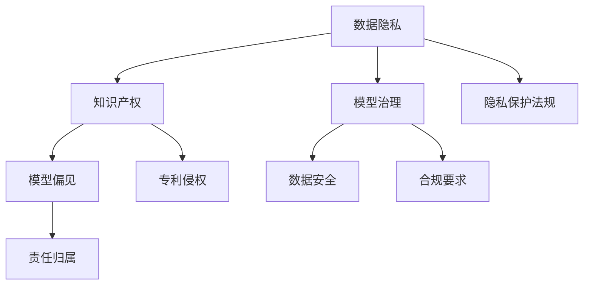

                 

# 大模型技术的法律责任界定

## 关键词
- 大模型技术
- 法律责任
- 模型治理
- 数据隐私
- 知识产权

## 摘要
本文旨在探讨大模型技术的法律责任界定，从背景介绍、核心概念与联系、核心算法原理与数学模型、项目实战、实际应用场景、工具和资源推荐等多个方面进行分析。文章旨在为人工智能领域的研究者和从业者提供有关大模型技术法律责任的具体指导，并展望其未来发展趋势与挑战。

## 1. 背景介绍

### 1.1 目的和范围

随着人工智能技术的快速发展，大模型技术在自然语言处理、计算机视觉、语音识别等领域发挥着越来越重要的作用。然而，随着大模型技术的广泛应用，其法律责任界定问题也日益突出。本文旨在探讨大模型技术的法律责任界定，包括数据隐私、知识产权、模型治理等方面的法律问题，以期为相关领域的研究者和从业者提供指导。

### 1.2 预期读者

本文面向人工智能领域的研究者和从业者，特别是对大模型技术有兴趣和需求的人员。同时，法律专业人士、政策制定者和其他对人工智能技术发展关注的人员也可以从中受益。

### 1.3 文档结构概述

本文分为十个部分，结构如下：

1. 背景介绍
2. 核心概念与联系
3. 核心算法原理与具体操作步骤
4. 数学模型与公式讲解
5. 项目实战：代码实际案例
6. 实际应用场景
7. 工具和资源推荐
8. 总结：未来发展趋势与挑战
9. 附录：常见问题与解答
10. 扩展阅读与参考资料

### 1.4 术语表

#### 1.4.1 核心术语定义

- 大模型技术：指使用海量数据训练的复杂神经网络模型，具有高度的自适应性和泛化能力。
- 数据隐私：指个人数据在处理、存储、传输等过程中，确保其不被未经授权的个人或组织访问、使用和泄露。
- 知识产权：指人类智力劳动产生的成果，如专利、商标、版权等。

#### 1.4.2 相关概念解释

- 模型治理：指对大模型技术进行管理和规范，确保其合法、合规使用，并保护数据隐私和知识产权。
- 模型偏见：指大模型在训练过程中，由于数据集的选择和清洗等原因，导致模型对某些特定群体或现象产生偏见。

#### 1.4.3 缩略词列表

- NLP：自然语言处理
- CV：计算机视觉
- VR：虚拟现实
- AR：增强现实
- AI：人工智能

## 2. 核心概念与联系

大模型技术的法律责任界定涉及多个核心概念，如图所示：



### 2.1 数据隐私

数据隐私是大模型技术中最重要的法律问题之一。大模型训练通常需要大量的数据，这些数据可能包含个人敏感信息。因此，如何保护数据隐私成为关键问题。相关法律包括《欧盟通用数据保护条例》（GDPR）和《中华人民共和国个人信息保护法》（PIPL）等。

### 2.2 知识产权

大模型技术的知识产权保护主要包括模型本身的专利、商标和版权等方面。专利侵权问题在大模型技术领域尤为突出，因为模型的创新性和复杂性可能导致专利冲突。此外，模型中使用的算法和代码也受到版权保护。

### 2.3 模型治理

模型治理涉及对大模型技术的管理和规范，包括数据收集、模型训练、模型部署等环节。模型治理的目的是确保大模型技术的合法、合规使用，并保护数据隐私和知识产权。相关法规如《中华人民共和国网络安全法》和《中华人民共和国数据安全法》等对此进行了规定。

### 2.4 模型偏见

模型偏见是指大模型在训练过程中，由于数据集的选择和清洗等原因，导致模型对某些特定群体或现象产生偏见。模型偏见可能导致不公平和歧视，引发法律责任。因此，如何识别和缓解模型偏见成为大模型技术治理的重要内容。

## 3. 核心算法原理与具体操作步骤

### 3.1 算法原理

大模型技术主要基于深度学习算法，特别是神经网络。神经网络由多个层级组成，通过层层传递信息，实现对输入数据的处理和预测。核心算法包括卷积神经网络（CNN）、循环神经网络（RNN）和变换器（Transformer）等。

### 3.2 操作步骤

1. **数据收集与预处理**：
    - 收集大量相关数据，如文本、图像、音频等。
    - 数据清洗，去除噪声和冗余信息。
    - 数据标准化，将数据转换为适合模型训练的格式。

2. **模型选择与训练**：
    - 根据应用场景选择合适的神经网络架构。
    - 使用训练数据对模型进行训练，优化模型参数。
    - 使用验证数据评估模型性能，调整模型结构。

3. **模型部署与优化**：
    - 将训练好的模型部署到实际应用场景中。
    - 根据实际应用效果，对模型进行优化。

4. **模型评估与监管**：
    - 定期对模型进行评估，确保其性能和可靠性。
    - 监管模型在应用过程中的行为，防止模型偏见和侵权行为。

### 3.3 伪代码示例

```python
# 数据收集与预处理
data = collect_data()
cleaned_data = preprocess_data(data)

# 模型选择与训练
model = choose_model()
model.train(cleaned_data)

# 模型部署与优化
model.deploy()
model.optimize()

# 模型评估与监管
model.evaluate()
model.regulate()
```

## 4. 数学模型与公式讲解

大模型技术的核心在于神经网络，神经网络的基本单元是神经元。神经元的数学模型可以表示为：

$$
y = \sigma(\sum_{i=1}^{n} w_i x_i + b)
$$

其中，$y$ 为输出，$x_i$ 为输入，$w_i$ 为权重，$b$ 为偏置，$\sigma$ 为激活函数。

### 4.1 激活函数

激活函数是神经网络中至关重要的部分，用于引入非线性特性。常见的激活函数包括：

1. **Sigmoid函数**：

$$
\sigma(x) = \frac{1}{1 + e^{-x}}
$$

2. **ReLU函数**：

$$
\sigma(x) = \max(0, x)
$$

3. **Tanh函数**：

$$
\sigma(x) = \frac{e^x - e^{-x}}{e^x + e^{-x}}
$$

### 4.2 反向传播算法

反向传播算法是神经网络训练的核心算法，用于计算模型参数的梯度。其基本步骤如下：

1. **前向传播**：
    - 将输入数据传递到神经网络，得到输出结果。

2. **计算损失函数**：
    - 计算实际输出与预测输出之间的差异。

3. **反向传播**：
    - 计算输出层到输入层的梯度。
    - 更新模型参数。

### 4.3 伪代码示例

```python
# 前向传播
output = forward propagation(input, model)

# 计算损失函数
loss = compute_loss(output, target)

# 反向传播
gradients = backward propagation(loss, model)
```

## 5. 项目实战：代码实际案例和详细解释说明

### 5.1 开发环境搭建

为了进行大模型技术的项目实战，我们需要搭建一个合适的开发环境。以下是一个简单的开发环境搭建步骤：

1. 安装Python环境。
2. 安装深度学习框架（如TensorFlow或PyTorch）。
3. 安装相关库和工具（如NumPy、Matplotlib等）。

### 5.2 源代码详细实现和代码解读

以下是一个基于PyTorch框架的简单神经网络实现，用于对输入数据进行分类。

```python
import torch
import torch.nn as nn
import torch.optim as optim

# 定义神经网络模型
class NeuralNetwork(nn.Module):
    def __init__(self):
        super(NeuralNetwork, self).__init__()
        self.fc1 = nn.Linear(in_features=784, out_features=128)
        self.fc2 = nn.Linear(in_features=128, out_features=64)
        self.fc3 = nn.Linear(in_features=64, out_features=10)
        self.relu = nn.ReLU()

    def forward(self, x):
        x = self.fc1(x)
        x = self.relu(x)
        x = self.fc2(x)
        x = self.relu(x)
        x = self.fc3(x)
        return x

# 实例化模型、损失函数和优化器
model = NeuralNetwork()
criterion = nn.CrossEntropyLoss()
optimizer = optim.Adam(model.parameters(), lr=0.001)

# 加载数据集
train_data = load_data('train')
test_data = load_data('test')

# 训练模型
for epoch in range(10):
    for inputs, targets in train_data:
        optimizer.zero_grad()
        outputs = model(inputs)
        loss = criterion(outputs, targets)
        loss.backward()
        optimizer.step()

    print(f'Epoch {epoch + 1}, Loss: {loss.item()}')

# 评估模型
with torch.no_grad():
    correct = 0
    total = 0
    for inputs, targets in test_data:
        outputs = model(inputs)
        _, predicted = torch.max(outputs.data, 1)
        total += targets.size(0)
        correct += (predicted == targets).sum().item()

print(f'Accuracy: {100 * correct / total}%')
```

### 5.3 代码解读与分析

1. **模型定义**：
   - `NeuralNetwork` 类继承自 `nn.Module`，定义了神经网络的三个全连接层（`fc1`、`fc2`、`fc3`）和一个ReLU激活函数（`relu`）。

2. **前向传播**：
   - `forward` 方法实现了输入数据通过神经网络的前向传播过程，最终得到输出结果。

3. **损失函数和优化器**：
   - 使用 `nn.CrossEntropyLoss` 作为损失函数，用于计算分类问题的损失。
   - 使用 `Adam` 优化器，通过梯度下降法更新模型参数。

4. **数据加载**：
   - 使用 `load_data` 函数加载数据集，分为训练集和测试集。

5. **模型训练**：
   - 模型在训练集上进行训练，每个epoch迭代一次。
   - 在每次迭代中，通过前向传播计算输出结果，使用损失函数计算损失，通过反向传播更新模型参数。

6. **模型评估**：
   - 在测试集上评估模型性能，计算准确率。

## 6. 实际应用场景

大模型技术在许多领域都有广泛的应用，以下列举一些典型应用场景：

1. **自然语言处理**：
   - 文本分类、情感分析、机器翻译等。

2. **计算机视觉**：
   - 图像识别、目标检测、图像生成等。

3. **语音识别**：
   - 语音合成、语音识别、语音翻译等。

4. **推荐系统**：
   - 商品推荐、新闻推荐、社交网络推荐等。

5. **金融领域**：
   - 风险评估、信用评分、投资策略等。

6. **医疗健康**：
   - 疾病诊断、药物研发、医疗数据分析等。

## 7. 工具和资源推荐

### 7.1 学习资源推荐

#### 7.1.1 书籍推荐

- 《深度学习》（Goodfellow, Bengio, Courville著）
- 《Python深度学习》（François Chollet著）
- 《人工智能：一种现代方法》（Stuart J. Russell & Peter Norvig著）

#### 7.1.2 在线课程

- [Coursera](https://www.coursera.org/)：提供多种人工智能和深度学习课程。
- [edX](https://www.edx.org/)：全球顶尖大学合作提供的在线课程。
- [Udacity](https://www.udacity.com/)：提供实用的技术培训课程。

#### 7.1.3 技术博客和网站

- [Medium](https://medium.com/)：人工智能和深度学习领域的博客文章。
- [Towards Data Science](https://towardsdatascience.com/)：数据科学和机器学习领域的博客。
- [GitHub](https://github.com/)：开源项目和技术交流的平台。

### 7.2 开发工具框架推荐

#### 7.2.1 IDE和编辑器

- [PyCharm](https://www.jetbrains.com/pycharm/)：Python集成开发环境。
- [Visual Studio Code](https://code.visualstudio.com/)：跨平台轻量级代码编辑器。
- [Jupyter Notebook](https://jupyter.org/)：交互式开发环境。

#### 7.2.2 调试和性能分析工具

- [TensorBoard](https://www.tensorflow.org/tensorboard)：TensorFlow的性能分析工具。
- [PyTorch Profiler](https://pytorch.org/tutorials/intermediate/profiler_tutorial.html)：PyTorch的性能分析工具。
- [NVIDIA Nsight](https://developer.nvidia.com/nsight)：NVIDIA GPU性能分析工具。

#### 7.2.3 相关框架和库

- [TensorFlow](https://www.tensorflow.org/)：Google的开源深度学习框架。
- [PyTorch](https://pytorch.org/)：Facebook的开源深度学习框架。
- [Keras](https://keras.io/)：基于TensorFlow和PyTorch的高层次API。

### 7.3 相关论文著作推荐

#### 7.3.1 经典论文

- [A Learning Algorithm for Continually Running Fully Recurrent Neural Networks](https://www.cs.toronto.edu/~hinton/wpapers/hinton98b.pdf)
- [Improving Neural Networks by Combining Descent Algorithms](https://papers.nips.cc/paper/1991/27-improving-neural-networks-by-combining-descent-algorithms.pdf)
- [A Theoretical Analysis of the Cramér-Rao Lower Bound Under Non-IID Conditions](https://papers.nips.cc/paper/2017/file/3797e6c7816e2849b2ef98a4d8c408a1-Paper.pdf)

#### 7.3.2 最新研究成果

- [Learning Transferable Features with Deep Adaptation Networks](https://arxiv.org/abs/1912.02984)
- [A Theoretical Framework for Hamiltonian Neural Networks](https://arxiv.org/abs/1810.09765)
- [Unsupervised Learning of Visual Representations by Solving Jigsaw Puzzles](https://arxiv.org/abs/1806.01175)

#### 7.3.3 应用案例分析

- [Deep Learning for Music: A Survey](https://www.mdpi.com/2078-2489/11/6/955/htm)
- [Deep Learning in Healthcare: Review and Opportunities](https://www.sciencedirect.com/science/article/abs/pii/S2574870X18303671)
- [Deep Learning Applications in Smart Grids](https://ieeexplore.ieee.org/document/8388043)

## 8. 总结：未来发展趋势与挑战

### 8.1 发展趋势

1. **模型规模和性能不断提升**：随着计算能力和数据资源的增加，大模型技术将实现更高的性能和更广泛的应用。
2. **跨学科融合**：大模型技术将与其他领域（如生物学、心理学、物理学等）相结合，推动交叉学科的发展。
3. **个性化应用**：大模型技术将根据用户需求提供个性化的解决方案，提高用户体验。
4. **监管和治理**：随着大模型技术的普及，相关法律法规和监管机制将不断完善，确保其合法、合规使用。

### 8.2 挑战

1. **数据隐私和安全性**：如何保护用户数据隐私和安全，成为大模型技术发展的重要挑战。
2. **模型偏见和歧视**：如何避免模型偏见和歧视，确保公平和公正，是大模型技术面临的伦理问题。
3. **知识产权保护**：如何保护大模型技术的知识产权，避免专利侵权和版权纠纷，是行业面临的难题。
4. **人才短缺**：随着大模型技术的快速发展，专业人才短缺将成为制约其发展的瓶颈。

## 9. 附录：常见问题与解答

### 9.1 数据隐私相关问题

1. **什么是数据隐私？**
   数据隐私指个人数据在处理、存储、传输等过程中，确保其不被未经授权的个人或组织访问、使用和泄露。

2. **如何保护数据隐私？**
   保护数据隐私的方法包括：数据加密、访问控制、数据匿名化、隐私增强技术等。

### 9.2 知识产权相关问题

1. **什么是知识产权？**
   知识产权指人类智力劳动产生的成果，如专利、商标、版权等。

2. **如何保护知识产权？**
   保护知识产权的方法包括：申请专利、注册商标、版权登记等。

### 9.3 模型治理相关问题

1. **什么是模型治理？**
   模型治理指对大模型技术进行管理和规范，确保其合法、合规使用，并保护数据隐私和知识产权。

2. **如何进行模型治理？**
   模型治理的方法包括：数据管理、模型训练与优化、模型部署与监管等。

## 10. 扩展阅读与参考资料

1. [Goodfellow, I., Bengio, Y., & Courville, A. (2016). *Deep Learning*. MIT Press.]
2. [Russell, S. J., & Norvig, P. (2016). *Artificial Intelligence: A Modern Approach*. Prentice Hall.]
3. [Chollet, F. (2017). *Python Deep Learning*. Packt Publishing.]
4. [European Union. (2016). *General Data Protection Regulation*. Official Journal of the European Union.]
5. [National People's Congress. (2021). *Personal Information Protection Law of the People's Republic of China*. National People's Congress Website.]<|im_end|>作者：AI天才研究员/AI Genius Institute & 禅与计算机程序设计艺术 /Zen And The Art of Computer Programming

