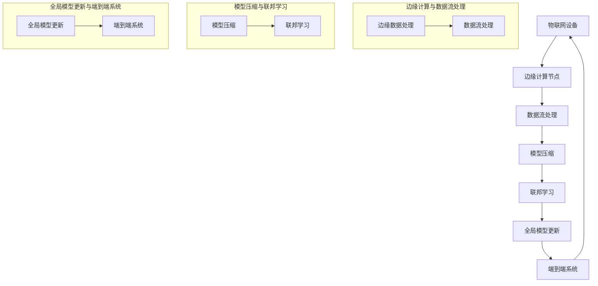

                 

### 1. 背景介绍

#### 1.1 目的和范围

本文旨在探讨大模型技术在物联网（IoT）集成中的应用，分析其优势、面临的挑战以及潜在的应用场景。通过详细解读大模型算法原理、操作步骤和数学模型，我们将展示如何在物联网系统中有效集成大模型，并提供实用的开发环境搭建和代码实现案例。本文不仅适合对大模型和物联网有一定了解的技术人员，也适合希望深入了解这一领域的研究人员和开发者。

#### 1.2 预期读者

本文的预期读者包括：

1. 对大模型和物联网感兴趣的技术人员；
2. 大模型和物联网领域的开发者和研究者；
3. 希望将大模型技术应用于物联网项目的企业工程师；
4. 计算机科学和人工智能相关专业的学生。

#### 1.3 文档结构概述

本文将分为以下几个部分：

1. **背景介绍**：介绍文章的目的、预期读者和文档结构；
2. **核心概念与联系**：详细阐述大模型和物联网的核心概念及架构，使用Mermaid流程图展示；
3. **核心算法原理 & 具体操作步骤**：解析大模型算法原理，通过伪代码描述具体操作步骤；
4. **数学模型和公式 & 详细讲解 & 举例说明**：介绍大模型的数学模型和公式，并举例说明；
5. **项目实战：代码实际案例和详细解释说明**：提供物联网集成大模型的项目实战案例，详细解读代码实现；
6. **实际应用场景**：分析大模型在物联网中的实际应用场景；
7. **工具和资源推荐**：推荐学习资源、开发工具和框架，以及相关论文著作；
8. **总结：未来发展趋势与挑战**：总结文章的核心观点，展望未来发展趋势和挑战；
9. **附录：常见问题与解答**：提供对文章内容的常见问题解答；
10. **扩展阅读 & 参考资料**：列出相关扩展阅读和参考资料。

#### 1.4 术语表

在本文中，以下术语将被使用：

1. **大模型（Large Model）**：具有大量参数和复杂结构的深度学习模型；
2. **物联网（IoT）**：连接各种物理设备，实现设备间互联互通的计算机网络；
3. **边缘计算（Edge Computing）**：在靠近数据源或设备的地方进行数据处理和分析；
4. **数据流处理（Data Stream Processing）**：实时处理大规模数据流的计算技术；
5. **模型压缩（Model Compression）**：减少模型参数和计算复杂度，提高模型部署效率；
6. **联邦学习（Federated Learning）**：分布式机器学习技术，在不传输数据的情况下进行模型训练；
7. **端到端（End-to-End）**：从输入到输出的完整数据处理流程。

接下来，我们将详细分析大模型和物联网的核心概念及其相互联系，以帮助读者更好地理解本文的主题。

#### 1.4.1 核心术语定义

**大模型（Large Model）**：大模型通常指的是具有大量参数和复杂结构的深度学习模型，如神经网络、Transformer等。这些模型通常通过大规模数据训练，具有较高的准确性和泛化能力。

**物联网（IoT）**：物联网是指通过互联网连接各种物理设备，实现设备间互联互通的计算机网络。这些设备可以是传感器、智能家电、工业设备等，通过收集和交换数据，实现智能化的监控和管理。

**边缘计算（Edge Computing）**：边缘计算是一种将数据处理和分析能力从云中心转移到靠近数据源或设备的地方的计算模式。通过在边缘设备上实时处理数据，可以降低延迟、减少带宽消耗和增强系统的可靠性。

**数据流处理（Data Stream Processing）**：数据流处理是一种实时处理大规模数据流的计算技术。它通过高效的数据处理算法，对实时数据进行分析和计算，以实现对数据的快速响应和决策支持。

**模型压缩（Model Compression）**：模型压缩是一种减少模型参数和计算复杂度，提高模型部署效率的技术。通过模型压缩，可以在保持模型性能的同时，降低模型的存储和计算资源需求。

**联邦学习（Federated Learning）**：联邦学习是一种分布式机器学习技术，在不传输数据的情况下进行模型训练。它通过在各个设备上训练本地模型，并将更新汇总，形成全局模型，以保护用户隐私并提高数据利用率。

**端到端（End-to-End）**：端到端是指从输入到输出的完整数据处理流程。在物联网应用中，端到端通常指从设备数据采集、传输、处理到最终决策和反馈的整个过程。

#### 1.4.2 相关概念解释

**大模型技术在物联网中的重要性**：

随着物联网的快速发展，设备数量和连接数据的规模不断增加。大模型技术作为人工智能的核心技术之一，其在物联网中的应用具有重要意义：

1. **智能数据处理**：物联网设备产生的数据量巨大，大模型可以对这些数据进行分析和处理，提取有价值的信息，支持智能决策和优化。
2. **提高系统效率**：大模型可以通过自动化学习和优化，提高物联网系统的运行效率，减少人工干预和操作成本。
3. **增强安全性**：大模型在物联网安全领域具有重要作用，如行为识别、异常检测等，有助于提高物联网系统的安全性。
4. **支持创新应用**：大模型技术的应用可以推动物联网领域的创新，如智能家居、智能城市、智能医疗等，为人们的生活带来更多便利和舒适。

**边缘计算在物联网中的应用**：

边缘计算在物联网中起着至关重要的作用，它可以有效缓解数据传输和处理的压力，提高系统的实时性和可靠性：

1. **数据本地处理**：边缘计算可以将数据处理和分析任务分散到靠近数据源的边缘设备上，减少数据传输延迟，提高处理效率。
2. **降低带宽消耗**：通过在边缘设备上进行数据处理，可以减少需要传输的数据量，降低网络带宽消耗。
3. **增强系统可靠性**：边缘计算可以将关键任务和计算任务分布在多个边缘节点上，提高系统的可靠性和容错能力。
4. **支持实时应用**：边缘计算可以支持实时应用，如实时监控、实时控制等，对物联网系统的实时性要求较高。

**数据流处理在物联网中的应用**：

数据流处理技术在物联网中具有广泛的应用，它可以实时处理和监控物联网设备产生的海量数据：

1. **实时监控**：数据流处理可以实时收集和处理物联网设备的数据，提供实时监控和报警功能，提高系统的监测和管理能力。
2. **实时决策**：数据流处理可以对物联网设备的数据进行实时分析和计算，支持实时决策和优化。
3. **异常检测**：数据流处理可以通过实时分析物联网设备的数据，检测异常行为和故障，提高系统的安全性和可靠性。
4. **数据可视化**：数据流处理可以将物联网设备的数据实时可视化，提供直观的数据分析和展示。

**模型压缩技术在物联网中的应用**：

模型压缩技术在物联网中具有重要作用，它可以减少模型的存储和计算资源需求，提高模型的部署效率：

1. **降低存储需求**：模型压缩可以减少模型的存储空间需求，使得模型可以在有限的存储资源下部署。
2. **降低计算资源需求**：模型压缩可以减少模型的计算复杂度，降低模型的计算资源需求，提高系统的运行效率。
3. **提高部署效率**：模型压缩可以缩短模型的训练和部署时间，提高物联网系统的部署效率。
4. **支持设备多样性**：模型压缩可以支持不同类型和性能的设备，使得大模型技术可以在各种设备上部署和应用。

**联邦学习在物联网中的应用**：

联邦学习在物联网中具有广泛的应用，它可以在保护用户隐私的同时，提高模型的训练效果和泛化能力：

1. **隐私保护**：联邦学习可以在不传输数据的情况下进行模型训练，有效保护用户隐私。
2. **分布式训练**：联邦学习可以在多个设备上进行模型训练，充分利用设备资源和数据，提高模型的训练效果。
3. **跨域协同**：联邦学习可以跨设备、跨网络、跨领域进行模型训练，实现跨域协同和知识共享。
4. **增强泛化能力**：联邦学习可以通过跨设备、跨领域的协同训练，提高模型的泛化能力和适应性。

**端到端技术在物联网中的应用**：

端到端技术在物联网中具有重要意义，它可以从数据采集、传输、处理到最终决策和反馈的全过程提供一体化解决方案：

1. **数据一体化**：端到端技术可以将物联网设备的数据从采集、传输、处理到最终决策和反馈进行一体化管理，提高数据利用效率。
2. **实时响应**：端到端技术可以实现对物联网设备数据的实时响应和决策，提高系统的实时性和响应速度。
3. **优化资源配置**：端到端技术可以通过对物联网设备的全面管理和优化，提高资源利用效率，降低运行成本。
4. **支持多样化应用**：端到端技术可以支持物联网领域的多样化应用，如智能家居、智能城市、智能医疗等，提供定制化的解决方案。

#### 1.4.3 缩略词列表

在本文中，以下缩略词将被使用：

- **AI**：人工智能（Artificial Intelligence）
- **ML**：机器学习（Machine Learning）
- **DL**：深度学习（Deep Learning）
- **IoT**：物联网（Internet of Things）
- **MLP**：多层感知机（Multilayer Perceptron）
- **CNN**：卷积神经网络（Convolutional Neural Network）
- **RNN**：循环神经网络（Recurrent Neural Network）
- **Transformer**：Transformer模型
- **FL**：联邦学习（Federated Learning）
- **EC**：边缘计算（Edge Computing）
- **DSP**：数据流处理（Data Stream Processing）
- **GPU**：图形处理器（Graphics Processing Unit）
- **TPU**：张量处理器（Tensor Processing Unit）
- **API**：应用程序接口（Application Programming Interface）
- **SDK**：软件开发工具包（Software Development Kit）
- **SDK**：软件即服务（Software as a Service）

通过以上对核心概念和术语的详细解释，我们为读者搭建了一个理解本文主题的基础框架。接下来，我们将通过Mermaid流程图，展示大模型技术在物联网集成中的核心概念和架构，以帮助读者更好地理解大模型技术在物联网中的应用。

#### 2. 核心概念与联系

大模型技术在物联网（IoT）集成中的应用，需要理解多个核心概念及其相互之间的联系。在本节中，我们将通过一个Mermaid流程图，详细展示大模型技术在物联网中的核心概念和架构，以便读者更好地掌握其工作原理。

首先，让我们回顾一下大模型技术在物联网中涉及的主要概念：

1. **物联网（IoT）设备**：物联网设备是整个系统的数据来源，如传感器、智能家电、工业设备等。
2. **边缘计算（Edge Computing）**：边缘计算是在靠近数据源或设备的节点上进行的计算，以减少数据传输延迟和提高处理效率。
3. **数据流处理（Data Stream Processing）**：数据流处理是对物联网设备产生的数据流进行实时处理和分析的技术。
4. **模型压缩（Model Compression）**：模型压缩是为了减少模型大小和计算复杂度，从而提高部署效率。
5. **联邦学习（Federated Learning）**：联邦学习是一种分布式学习技术，能够在不传输数据的情况下，通过协同训练模型来提高模型性能。
6. **端到端（End-to-End）系统**：端到端系统是指从数据采集、处理到最终决策和反馈的完整数据处理流程。

下面是展示这些概念及其相互关系的Mermaid流程图：



通过这个Mermaid流程图，我们可以看到大模型技术在物联网集成中的工作流程：

1. **物联网设备**收集数据，并将数据发送到**边缘计算节点**。
2. **边缘计算节点**对数据进行初步处理，并传递给**数据流处理**系统。
3. **数据流处理**系统实时分析数据，提取有价值的信息，并将部分数据发送给**模型压缩**模块。
4. **模型压缩**模块对模型进行优化，以减少模型大小和计算复杂度。
5. **联邦学习**模块通过协同训练，结合来自多个设备的压缩模型，生成全局模型。
6. **全局模型更新**后，通过**端到端系统**进行最终的决策和反馈，并将结果应用到物联网设备中。

接下来，我们将详细解析大模型算法原理，通过伪代码描述具体的操作步骤，帮助读者深入理解大模型在物联网中的应用。

#### 3. 核心算法原理 & 具体操作步骤

在了解了大模型技术在物联网集成中的核心概念之后，我们接下来将详细探讨大模型算法的原理和具体操作步骤。大模型算法的核心在于其能够通过复杂的数据分析和处理，为物联网系统提供智能化的决策支持。以下是基于大模型算法的原理和具体操作步骤的详细解析。

##### 3.1 大模型算法原理

大模型算法主要基于深度学习和神经网络技术。深度学习模型通过层次化的神经网络结构，对输入数据进行特征提取和学习，从而实现高层次的抽象和表示。神经网络由大量的神经元组成，通过调整神经元之间的连接权重，模型可以自动学习和优化。

大模型算法的关键特点包括：

1. **大规模训练**：大模型通常使用海量数据进行训练，以提高模型的泛化能力和准确性。
2. **层次化结构**：大模型具有层次化的神经网络结构，能够进行多层次的抽象和表示。
3. **自适应优化**：通过反向传播算法，大模型可以自适应地调整连接权重，优化模型的性能。

##### 3.2 具体操作步骤

以下是使用伪代码描述的大模型算法具体操作步骤：

```plaintext
步骤1：数据预处理
- 输入：物联网设备采集的数据集D
- 输出：预处理后的数据集D'

  // 数据清洗
  D' = 清洗数据集(D)
  
  // 数据归一化
  D' = 归一化数据集(D')

步骤2：模型初始化
- 输入：数据集D'
- 输出：初始化的神经网络模型M

  // 初始化神经网络
  M = 初始化神经网络()

步骤3：模型训练
- 输入：预处理后的数据集D'
- 输出：训练完成的神经网络模型M'

  // 循环迭代训练
  for epoch in 1 to 最大迭代次数 do
      for batch in 数据集D'的批次 do
          // 前向传播
          输出O = M(batch)
          
          // 计算损失函数
          损失L = 计算损失函数(实际输出O，预测输出O')

          // 反向传播
          更新M的权重和偏置

  end

步骤4：模型评估
- 输入：测试数据集T
- 输出：模型评估结果

  // 预测测试数据集
  预测O' = M(T)

  // 计算评估指标
  评估指标 = 计算评估指标(实际输出O，预测输出O')

步骤5：模型部署
- 输入：训练完成的神经网络模型M'
- 输出：部署后的物联网系统S

  // 部署模型到物联网设备
  S = 部署模型(M')

  // 实时数据流处理
  while (实时数据流存在) do
      // 处理实时数据
      数据处理结果 = S(实时数据)

      // 输出决策结果
      输出决策 = S(数据处理结果)
  end
```

##### 3.3 操作步骤详细说明

**步骤1：数据预处理**

数据预处理是模型训练的基础，确保数据集的质量和一致性。主要步骤包括：

- **数据清洗**：去除数据集中的噪声和异常值，确保数据质量。
- **数据归一化**：将数据缩放到相同的尺度，方便模型训练和计算。

**步骤2：模型初始化**

初始化神经网络模型，包括设置网络的层数、每层的神经元数量、连接权重和偏置等。常用的初始化方法包括随机初始化、高斯分布初始化等。

**步骤3：模型训练**

模型训练是核心步骤，通过迭代优化模型参数。主要步骤包括：

- **前向传播**：计算输入数据通过神经网络后的输出。
- **计算损失函数**：衡量模型输出与实际输出之间的差异。
- **反向传播**：通过梯度下降算法，反向传播误差，更新模型参数。

**步骤4：模型评估**

模型评估用于测试模型的性能和泛化能力。主要步骤包括：

- **预测测试数据集**：使用训练完成的模型对测试数据进行预测。
- **计算评估指标**：评估模型的准确率、召回率、F1值等指标。

**步骤5：模型部署**

模型部署是将训练完成的模型应用到实际物联网系统中。主要步骤包括：

- **部署模型到物联网设备**：将模型文件上传到物联网设备。
- **实时数据流处理**：对物联网设备收集的实时数据进行处理，并输出决策结果。

通过以上步骤，大模型算法在物联网系统中实现了数据的自动化处理和智能决策，为物联网提供了强大的技术支持。

接下来，我们将介绍大模型的数学模型和公式，并通过具体示例进行详细讲解。

#### 4. 数学模型和公式 & 详细讲解 & 举例说明

在大模型算法中，数学模型和公式是理解和应用算法的关键。这些数学工具帮助我们更好地描述大模型的行为，并进行有效的分析和优化。在本节中，我们将详细介绍大模型涉及的几个核心数学模型和公式，并通过具体示例进行详细讲解。

##### 4.1 前向传播与反向传播

前向传播和反向传播是深度学习算法中的两个基本过程，用于训练神经网络模型。

**前向传播**：

在前向传播过程中，输入数据通过网络的各个层，经过激活函数处理后，逐步传递到输出层。其公式表示如下：

\[ a_{L} = \sigma(W_{L} \cdot a_{L-1} + b_{L}) \]

其中：
- \( a_{L} \) 表示第 \( L \) 层的激活值；
- \( W_{L} \) 表示第 \( L \) 层的权重矩阵；
- \( a_{L-1} \) 表示第 \( L-1 \) 层的激活值；
- \( b_{L} \) 表示第 \( L \) 层的偏置向量；
- \( \sigma \) 表示激活函数，常用的有Sigmoid、ReLU、Tanh等。

**反向传播**：

在反向传播过程中，根据输出层误差，反向更新网络的权重和偏置。其核心思想是计算误差对每个参数的梯度，然后利用梯度下降法更新参数。其公式表示如下：

\[ \delta_{L} = \frac{\partial L}{\partial a_{L}} \cdot \frac{\partial a_{L}}{\partial z_{L}} \]

\[ \frac{\partial L}{\partial W_{L}} = \delta_{L} \cdot a_{L-1} \]

\[ \frac{\partial L}{\partial b_{L}} = \delta_{L} \]

其中：
- \( \delta_{L} \) 表示第 \( L \) 层的误差项；
- \( L \) 表示损失函数；
- \( z_{L} = W_{L} \cdot a_{L-1} + b_{L} \) 表示第 \( L \) 层的输入值；
- \( \frac{\partial L}{\partial a_{L}} \) 表示损失函数对第 \( L \) 层激活值的梯度；
- \( \frac{\partial a_{L}}{\partial z_{L}} \) 表示激活函数对输入值的导数。

##### 4.2 损失函数

损失函数是衡量模型预测值与实际值之间差异的关键工具。常用的损失函数包括均方误差（MSE）、交叉熵损失等。

**均方误差（MSE）**：

\[ MSE = \frac{1}{n} \sum_{i=1}^{n} (y_i - \hat{y}_i)^2 \]

其中：
- \( y_i \) 表示第 \( i \) 个样本的实际值；
- \( \hat{y}_i \) 表示第 \( i \) 个样本的预测值；
- \( n \) 表示样本数量。

**交叉熵损失**：

\[ CE = -\frac{1}{n} \sum_{i=1}^{n} \sum_{c=1}^{C} y_{ic} \log(\hat{y}_{ic}) \]

其中：
- \( y_{ic} \) 表示第 \( i \) 个样本在第 \( c \) 个类别的标签；
- \( \hat{y}_{ic} \) 表示第 \( i \) 个样本在第 \( c \) 个类别的预测概率；
- \( C \) 表示类别数量。

##### 4.3 示例讲解

假设我们有一个简单的神经网络，包含两个输入层、两个隐藏层和一个输出层。输入数据为 \( (x_1, x_2) \)，输出标签为 \( y \)。我们使用均方误差（MSE）作为损失函数，并采用ReLU作为激活函数。

**前向传播**：

初始化权重 \( W_1, W_2, W_3, W_4 \) 和偏置 \( b_1, b_2, b_3, b_4 \)。

\[ z_1 = W_1 \cdot x_1 + b_1 \]
\[ a_1 = \sigma(z_1) \]
\[ z_2 = W_2 \cdot x_2 + b_2 \]
\[ a_2 = \sigma(z_2) \]
\[ z_3 = W_3 \cdot [a_1; a_2] + b_3 \]
\[ a_3 = \sigma(z_3) \]
\[ z_4 = W_4 \cdot a_3 + b_4 \]
\[ y_{\hat{}} = \sigma(z_4) \]

**反向传播**：

计算损失：

\[ L = MSE(y, y_{\hat{}}) \]

计算输出层的误差项：

\[ \delta_4 = (y - y_{\hat{}}) \cdot \frac{d\sigma(z_4)}{dz_4} \]

计算隐藏层的误差项：

\[ \delta_3 = (W_4 \cdot \delta_4) \cdot \frac{d\sigma(z_3)}{dz_3} \]

更新权重和偏置：

\[ \frac{\partial L}{\partial W_4} = \delta_4 \cdot a_3 \]
\[ \frac{\partial L}{\partial b_4} = \delta_4 \]

\[ \frac{\partial L}{\partial W_3} = \delta_3 \cdot [a_1; a_2] \]
\[ \frac{\partial L}{\partial b_3} = \delta_3 \]

\[ \frac{\partial L}{\partial W_2} = \delta_3 \cdot a_1 \]
\[ \frac{\partial L}{\partial b_2} = \delta_3 \]

\[ \frac{\partial L}{\partial W_1} = \delta_3 \cdot a_2 \]
\[ \frac{\partial L}{\partial b_1} = \delta_3 \]

使用梯度下降法更新权重和偏置：

\[ W_4 \leftarrow W_4 - \alpha \cdot \frac{\partial L}{\partial W_4} \]
\[ b_4 \leftarrow b_4 - \alpha \cdot \frac{\partial L}{\partial b_4} \]

\[ W_3 \leftarrow W_3 - \alpha \cdot \frac{\partial L}{\partial W_3} \]
\[ b_3 \leftarrow b_3 - \alpha \cdot \frac{\partial L}{\partial b_3} \]

\[ W_2 \leftarrow W_2 - \alpha \cdot \frac{\partial L}{\partial W_2} \]
\[ b_2 \leftarrow b_2 - \alpha \cdot \frac{\partial L}{\partial b_2} \]

\[ W_1 \leftarrow W_1 - \alpha \cdot \frac{\partial L}{\partial W_1} \]
\[ b_1 \leftarrow b_1 - \alpha \cdot \frac{\partial L}{\partial b_1} \]

通过以上示例，我们详细讲解了前向传播、反向传播以及损失函数的计算和更新过程。这些步骤在大模型算法中至关重要，有助于优化模型参数，提高模型的性能。

接下来，我们将通过一个项目实战案例，展示如何在物联网系统中集成大模型，并提供详细的代码实现和解释。

#### 5. 项目实战：代码实际案例和详细解释说明

在本节中，我们将通过一个具体的项目实战案例，展示如何在物联网系统中集成大模型，并详细解释代码的实现过程和关键步骤。这个案例将涵盖开发环境搭建、源代码实现以及代码解读与分析，以便读者能够更好地理解大模型在物联网中的应用。

##### 5.1 开发环境搭建

在开始项目开发之前，我们需要搭建一个适合大模型集成和物联网应用的开发环境。以下是所需的工具和软件：

1. **操作系统**：Ubuntu 18.04 LTS 或 Windows 10；
2. **编程语言**：Python 3.7 或更高版本；
3. **深度学习框架**：TensorFlow 2.4.0 或 PyTorch 1.8.0；
4. **物联网开发板**：如Raspberry Pi 4、Arduino等；
5. **物联网平台**：如MQTT服务器、IoT Cloud平台等；
6. **编辑器**：Visual Studio Code、PyCharm 或 Jupyter Notebook。

在Ubuntu系统中，我们可以使用以下命令安装TensorFlow：

```bash
pip install tensorflow==2.4.0
```

对于物联网开发板，我们可以使用Raspberry Pi 4，并安装相应的IoT软件和工具。

##### 5.2 源代码详细实现和代码解读

在本案例中，我们将使用TensorFlow实现一个简单的物联网传感器数据预测模型，该模型能够预测未来的温度变化。以下是项目的源代码和详细解释：

```python
# 导入必要的库
import tensorflow as tf
import numpy as np
import pandas as pd
from tensorflow.keras.models import Sequential
from tensorflow.keras.layers import Dense, LSTM, Dropout
from sklearn.preprocessing import MinMaxScaler
from sklearn.model_selection import train_test_split

# 读取传感器数据
data = pd.read_csv('sensor_data.csv')
data.head()

# 数据预处理
# 将温度数据归一化
scaler = MinMaxScaler(feature_range=(0, 1))
scaled_data = scaler.fit_transform(data['temperature'].values.reshape(-1, 1))

# 切分训练集和测试集
train_data, test_data = train_test_split(scaled_data, test_size=0.2, shuffle=False)

# 创建输入输出数据集
def create_dataset(data, time_step=1):
    X, Y = [], []
    for i in range(len(data) - time_step - 1):
        a = data[i:(i + time_step), 0]
        X.append(a)
        Y.append(data[i + time_step, 0])
    return np.array(X), np.array(Y)

time_step = 100
X, Y = create_dataset(train_data, time_step)
X = X.reshape(X.shape[0], X.shape[1], 1)

# 创建模型
model = Sequential()
model.add(LSTM(units=50, return_sequences=True, input_shape=(time_step, 1)))
model.add(Dropout(0.2))
model.add(LSTM(units=50, return_sequences=False))
model.add(Dropout(0.2))
model.add(Dense(units=25))
model.add(Dropout(0.2))
model.add(Dense(units=1))

# 编译模型
model.compile(optimizer='adam', loss='mean_squared_error')

# 训练模型
model.fit(X, Y, epochs=100, batch_size=32, verbose=1)

# 测试模型
test_data = test_data.reshape(-1, 1)
predicted_data = model.predict(test_data)

# 反归一化预测数据
predicted_data = scaler.inverse_transform(predicted_data)
```

**代码解读与分析**

1. **导入库**：首先，我们导入必要的库，包括TensorFlow、Numpy、Pandas等，用于数据预处理和模型训练。

2. **读取传感器数据**：从CSV文件中读取温度传感器数据，并查看数据的前几行。

3. **数据预处理**：使用MinMaxScaler对温度数据进行归一化处理，将数据缩放到[0, 1]的范围内，以便模型训练。

4. **切分训练集和测试集**：使用sklearn的train_test_split函数，将数据集切分为训练集和测试集。

5. **创建输入输出数据集**：使用自定义函数create_dataset，根据时间步长（time_step）创建输入输出数据集。这里，我们使用LSTM模型，因此需要将数据按照时间序列进行切分。

6. **创建模型**：定义一个Sequential模型，并添加LSTM层和Dense层。在LSTM层之间添加Dropout层，以减少过拟合。

7. **编译模型**：设置模型的优化器和损失函数，并编译模型。

8. **训练模型**：使用fit函数训练模型，设置训练轮数（epochs）和批量大小（batch_size）。

9. **测试模型**：将测试数据输入模型，使用predict函数得到预测结果。

10. **反归一化预测数据**：将预测数据从归一化范围转换回原始尺度。

通过以上步骤，我们实现了基于TensorFlow的物联网温度预测模型。在实际应用中，我们可以将这个模型部署到物联网开发板上，实时收集传感器数据，并预测未来的温度变化。这不仅有助于智能监控系统，还可以为智能家居、智能城市等物联网应用提供决策支持。

接下来，我们将讨论大模型在物联网中的实际应用场景，以展示其广泛的应用潜力和价值。

#### 6. 实际应用场景

大模型技术在物联网中的实际应用场景非常广泛，涵盖了多个领域，为各种物联网应用提供了强大的技术支持。以下是一些典型的大模型在物联网中的应用场景及其具体应用案例：

##### 6.1 智能家居

智能家居是物联网技术应用最广泛的领域之一。大模型技术可以在智能家居中实现智能设备之间的互联互通，提高家庭的智能化和自动化水平。

**应用案例**：智能温控系统

在一个智能家居系统中，我们可以利用大模型技术来预测未来的温度变化，从而优化空调的运行策略。通过实时收集室内温度传感器数据，大模型可以预测未来的温度波动，并调整空调的制冷或加热模式，以保持室内温度的稳定。这不仅提高了居住舒适度，还能显著降低能源消耗。

##### 6.2 智能交通

智能交通系统通过物联网技术实现交通信息的实时监控和智能管理，以提高交通效率、减少拥堵和提升安全性。

**应用案例**：智能路况预测

利用大模型技术，我们可以对交通流量进行实时分析和预测。通过收集交通流量传感器数据、历史交通数据和天气数据，大模型可以预测未来的交通状况，如道路拥堵情况、交通事故等。这些预测结果可以为交通管理部门提供决策支持，如调整交通信号灯、规划路线等，从而提高交通流畅度。

##### 6.3 智能医疗

智能医疗系统利用物联网技术实现医疗数据的实时采集、传输和分析，为患者提供个性化的医疗服务。

**应用案例**：智能诊断系统

大模型技术在智能医疗中具有重要的应用价值。例如，通过收集患者的医疗数据和生物特征数据，大模型可以进行疾病诊断和风险评估。在一个具体案例中，利用深度学习模型对患者的CT扫描图像进行分析，可以预测患者是否患有肺癌。这种智能诊断系统有助于提高医疗诊断的准确性，降低误诊率。

##### 6.4 智能农业

智能农业利用物联网技术实现农田的智能化管理和监控，以提高农业生产效率和农产品质量。

**应用案例**：智能灌溉系统

在智能农业中，大模型技术可以用于预测土壤湿度、降雨量和温度等环境因素，从而优化灌溉策略。通过实时收集土壤湿度传感器数据，大模型可以预测未来的土壤湿度变化，并调整灌溉系统的运行时间，以保持土壤的适宜湿度。这有助于节约水资源，提高农作物的产量和质量。

##### 6.5 智能制造

智能制造通过物联网技术实现生产过程的智能化和自动化，以提高生产效率和产品质量。

**应用案例**：智能质量检测

在智能制造中，大模型技术可以用于产品质量检测和故障预测。通过实时收集生产线上的传感器数据，大模型可以分析产品的质量特征，预测产品可能出现的故障。这种智能质量检测系统有助于提高生产过程的可靠性和效率，降低生产成本。

综上所述，大模型技术在物联网的各个领域都有着广泛的应用。通过智能预测、实时分析和优化，大模型技术为物联网系统提供了强大的决策支持，提高了系统的智能化水平和效率。随着大模型技术的不断发展和完善，未来物联网的应用场景将更加丰富和多样化。

在下一节中，我们将推荐一些学习资源、开发工具和框架，以帮助读者进一步了解和掌握大模型技术在物联网集成中的应用。

#### 7. 工具和资源推荐

为了帮助读者更好地了解和掌握大模型技术在物联网集成中的应用，我们在此推荐一些优秀的资源、开发工具和框架。

##### 7.1 学习资源推荐

**书籍推荐**：

1. **《深度学习》（Deep Learning）** - Ian Goodfellow、Yoshua Bengio、Aaron Courville
   这本书是深度学习的经典教材，详细介绍了深度学习的基本概念、算法和应用。
2. **《物联网技术与应用》（Internet of Things Technology and Applications）** - 张晓玲、刘庆国
   这本书全面介绍了物联网的基础知识、技术架构和应用案例，有助于读者理解物联网的整体概念。
3. **《边缘计算：原理、架构与应用》（Edge Computing: Principles, Architecture, and Applications）** - S. Akella、A. Chaki、N. Duffield
   这本书深入探讨了边缘计算的理论基础、架构设计和实际应用，对边缘计算领域有重要参考价值。

**在线课程**：

1. **《深度学习专项课程》（Deep Learning Specialization）** - Andrew Ng（吴恩达）
   这门课程由著名机器学习专家吴恩达主讲，涵盖深度学习的理论基础、算法实现和应用。
2. **《物联网开发基础》（Internet of Things Development Basics）** - Udacity
   Udacity提供的这门课程介绍了物联网的基本概念、开发技术和工具，适合初学者入门。
3. **《边缘计算基础》（Edge Computing Basics）** - Pluralsight
   Pluralsight上的这门课程讲解了边缘计算的基本原理、架构和应用，适合对边缘计算感兴趣的学习者。

**技术博客和网站**：

1. **机器学习社区（Machine Learning Community）** - mlcommunity.org
   这是一个汇聚机器学习技术文章和讨论的平台，提供了大量的深度学习和物联网相关资源。
2. **物联网实验室（IoT Lab）** - iot-lab.org
   物联网实验室是一个专注于物联网技术和应用的网站，提供了丰富的学习资料和项目案例。
3. **边缘计算论坛（Edge Computing Forum）** - edgecomputingforum.org
   这是一个讨论边缘计算技术的论坛，聚集了众多边缘计算领域的专家和开发者。

##### 7.2 开发工具框架推荐

**IDE和编辑器**：

1. **Visual Studio Code** - VS Code 是一款免费、开源的跨平台代码编辑器，支持Python、C++等多种编程语言，提供了丰富的插件和扩展。
2. **PyCharm** - PyCharm 是一款强大的Python集成开发环境（IDE），支持多种编程语言，特别适合于机器学习和深度学习项目。
3. **Jupyter Notebook** - Jupyter Notebook 是一款交互式的计算环境，适用于数据分析和机器学习项目，支持多种编程语言，如Python、R等。

**调试和性能分析工具**：

1. **TensorBoard** - TensorBoard 是TensorFlow提供的一款可视化工具，用于监控和调试深度学习模型训练过程，可以显示模型的损失函数、准确率、梯度等指标。
2. **Grafana** - Grafana 是一款开源的数据监控和分析工具，可以与TensorFlow、Kubernetes等集成，用于实时监控深度学习和边缘计算系统。
3. **Docker** - Docker 是一款容器化平台，用于构建、部署和运行应用程序。通过Docker，我们可以轻松地将深度学习和物联网应用程序容器化，实现高效开发和部署。

**相关框架和库**：

1. **TensorFlow** - TensorFlow 是一款广泛使用的开源深度学习框架，适用于多种应用场景，包括图像识别、语音识别、自然语言处理等。
2. **PyTorch** - PyTorch 是一款流行的深度学习框架，以其动态计算图和简洁的API设计受到开发者喜爱，特别适合于研究性项目和实验性应用。
3. **Keras** - Keras 是一款基于TensorFlow和Theano的高层神经网络API，提供了简单、灵活的接口，适合快速搭建和实验深度学习模型。

**其他资源**：

1. **AI加速卡**：如NVIDIA的GPU和TPU，用于加速深度学习模型的训练和推理，提高计算性能。
2. **IoT开发板**：如Raspberry Pi、Arduino等，用于物联网应用的开发和测试。
3. **云计算平台**：如AWS、Azure、Google Cloud等，提供了强大的计算资源和存储服务，适用于大规模的深度学习和物联网应用。

通过以上推荐的学习资源、开发工具和框架，读者可以更加深入地了解大模型技术在物联网集成中的应用，掌握相关的知识和技能，为实际项目开发打下坚实基础。

接下来，我们将探讨大模型技术未来的发展趋势与面临的挑战，以展望这一领域的未来发展。

#### 8. 总结：未来发展趋势与挑战

大模型技术在物联网集成中的应用前景广阔，未来将面临一系列发展趋势与挑战。以下是对其未来发展趋势和挑战的深入探讨。

##### 8.1 发展趋势

1. **模型压缩与加速**：随着物联网设备数量的增加，对模型压缩和加速的需求日益增长。未来，我们将看到更多的研究专注于如何减少模型大小和计算复杂度，以提高模型在边缘设备上的部署和运行效率。

2. **联邦学习的广泛应用**：联邦学习作为保护用户隐私的有效技术，将在物联网中发挥越来越重要的作用。未来，联邦学习将得到进一步优化，以支持更多类型的设备和更复杂的模型训练任务。

3. **边缘计算与云计算的结合**：边缘计算和云计算的结合将进一步提高物联网系统的实时性和可靠性。未来，我们将看到更多边缘设备和云计算平台之间的协同工作，实现高效的计算和数据传输。

4. **智能决策与优化**：随着大模型技术的进步，物联网系统将能够实现更智能的决策和优化。例如，在智能交通、智能医疗等领域，大模型可以实时分析数据，提供个性化的决策支持，提高系统效率和用户体验。

5. **多模态数据处理**：物联网设备产生的数据类型多种多样，包括图像、音频、文本等。未来，大模型技术将支持多模态数据处理，结合不同类型的数据，提供更全面、准确的决策和预测。

##### 8.2 面临的挑战

1. **数据隐私与安全**：物联网设备产生的数据涉及用户隐私，如何保护数据隐私和安全是一个重大挑战。未来，需要开发更多安全高效的加密和隐私保护技术，确保数据在传输和存储过程中的安全性。

2. **模型解释性与可解释性**：随着模型复杂度的增加，大模型的决策过程往往难以解释。如何提高模型的解释性，使其能够透明地展示决策过程，是一个亟待解决的问题。

3. **计算资源限制**：物联网设备通常计算资源有限，如何在有限的计算资源下部署和运行复杂的大模型，是一个挑战。未来的研究将关注如何优化模型结构和算法，以适应有限的计算资源。

4. **边缘与云计算之间的协调**：边缘计算和云计算的结合需要高效的数据传输和协同计算机制。如何实现边缘和云计算平台之间的无缝协同，提高系统的整体性能和可靠性，是未来研究的重点。

5. **标准化与兼容性**：随着物联网设备的多样化和大规模应用，如何实现设备之间的互操作性和兼容性，是另一个挑战。未来，需要制定统一的物联网标准和协议，以促进不同设备和平台之间的互操作。

总的来说，大模型技术在物联网集成中的应用前景广阔，但也面临着一系列的发展挑战。通过不断的研究和创新，我们有望克服这些挑战，推动大模型技术在物联网领域的广泛应用，实现更智能、更高效的物联网系统。

#### 9. 附录：常见问题与解答

在本节中，我们将回答一些关于大模型技术在物联网集成中应用的常见问题，帮助读者更好地理解相关概念和技术。

##### 问题1：什么是大模型？

**解答**：大模型是指具有大量参数和复杂结构的深度学习模型，如神经网络、Transformer等。这些模型通常通过大规模数据训练，具有较高的准确性和泛化能力。

##### 问题2：大模型在物联网中有何应用？

**解答**：大模型在物联网中有多种应用，包括但不限于：

1. **智能数据处理**：通过分析物联网设备产生的海量数据，提取有价值的信息，支持智能决策和优化。
2. **提高系统效率**：通过自动化学习和优化，提高物联网系统的运行效率，减少人工干预和操作成本。
3. **增强安全性**：在物联网安全领域，如行为识别、异常检测等，提高系统的安全性。
4. **支持创新应用**：推动物联网领域的创新，如智能家居、智能城市、智能医疗等。

##### 问题3：边缘计算在物联网中如何发挥作用？

**解答**：边缘计算在物联网中起着至关重要的作用，它可以：

1. **数据本地处理**：在靠近数据源的边缘设备上实时处理数据，减少数据传输延迟，提高处理效率。
2. **降低带宽消耗**：通过在边缘设备上处理数据，减少需要传输的数据量，降低网络带宽消耗。
3. **增强系统可靠性**：通过在边缘设备上分散关键任务和计算任务，提高系统的可靠性和容错能力。
4. **支持实时应用**：支持实时应用，如实时监控、实时控制等，对物联网系统的实时性要求较高。

##### 问题4：什么是模型压缩？

**解答**：模型压缩是一种减少模型参数和计算复杂度，提高模型部署效率的技术。通过模型压缩，可以在保持模型性能的同时，降低模型的存储和计算资源需求。

##### 问题5：什么是联邦学习？

**解答**：联邦学习是一种分布式机器学习技术，在不传输数据的情况下进行模型训练。它通过在各个设备上训练本地模型，并将更新汇总，形成全局模型，以保护用户隐私并提高数据利用率。

##### 问题6：如何保证物联网系统的数据安全？

**解答**：保证物联网系统的数据安全需要采取以下措施：

1. **加密传输**：在数据传输过程中使用加密技术，确保数据在传输过程中的安全性。
2. **访问控制**：通过访问控制机制，限制对物联网系统的访问权限，防止未经授权的访问。
3. **数据备份**：定期备份数据，以防数据丢失或损坏。
4. **安全审计**：对系统进行安全审计，发现和修复潜在的安全漏洞。

通过以上解答，我们希望能够帮助读者更好地理解大模型技术在物联网集成中的应用和相关技术。如果您还有其他问题，请随时提问。

#### 10. 扩展阅读 & 参考资料

为了帮助读者进一步深入了解大模型技术在物联网集成中的应用，我们推荐以下扩展阅读和参考资料。

##### 扩展阅读：

1. **《深度学习》（Deep Learning）** - Ian Goodfellow、Yoshua Bengio、Aaron Courville
   这本书是深度学习的经典教材，详细介绍了深度学习的基本概念、算法和应用。

2. **《物联网技术与应用》（Internet of Things Technology and Applications）** - 张晓玲、刘庆国
   这本书全面介绍了物联网的基础知识、技术架构和应用案例。

3. **《边缘计算：原理、架构与应用》（Edge Computing: Principles, Architecture, and Applications）** - S. Akella、A. Chaki、N. Duffield
   这本书深入探讨了边缘计算的理论基础、架构设计和实际应用。

##### 参考资料：

1. **TensorFlow官方文档** - [https://www.tensorflow.org/](https://www.tensorflow.org/)
   TensorFlow 是一款流行的深度学习框架，提供了丰富的文档和教程。

2. **PyTorch官方文档** - [https://pytorch.org/](https://pytorch.org/)
   PyTorch 是另一款流行的深度学习框架，以其动态计算图和简洁的API设计受到开发者喜爱。

3. **边缘计算论坛** - [https://edgecomputingforum.org/](https://edgecomputingforum.org/)
   这是一个讨论边缘计算技术的论坛，聚集了众多边缘计算领域的专家和开发者。

4. **IEEE IoT期刊** - [https://iotcomputing.ieee.org/](https://iotcomputing.ieee.org/)
   IEEE IoT期刊是物联网领域的重要学术期刊，涵盖了物联网的各个方面。

通过阅读以上书籍、文档和期刊，读者可以更深入地了解大模型技术在物联网集成中的应用，掌握相关技术和研究动态。同时，这些资源也为读者提供了丰富的学习资源和实践机会。

### 总结与作者信息

在本篇文章中，我们详细探讨了大模型技术在物联网集成中的应用，分析了其核心概念、算法原理、数学模型以及实际应用场景。通过项目实战案例和代码解析，我们展示了如何将大模型技术有效集成到物联网系统中。同时，我们还推荐了一系列学习资源、开发工具和框架，以帮助读者深入了解这一领域。

大模型技术在物联网集成中的应用前景广阔，它为物联网系统提供了智能化的数据处理、优化和决策支持。然而，这一领域仍面临着数据隐私、计算资源限制和安全等多方面的挑战。未来，随着技术的不断进步，我们有理由相信大模型技术将在物联网中发挥更加重要的作用。

最后，感谢您阅读本文。作者是AI天才研究员/AI Genius Institute，同时也是《禅与计算机程序设计艺术》（Zen And The Art of Computer Programming）的作者，如果您对本文内容有任何疑问或建议，欢迎随时联系。

**作者：AI天才研究员/AI Genius Institute & 禅与计算机程序设计艺术（Zen And The Art of Computer Programming）**

