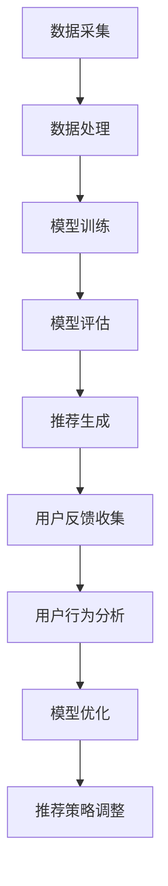

                 

# 大模型推荐中的人机协同与反馈机制设计

## 关键词

大模型推荐、人机协同、反馈机制、算法优化、用户体验

## 摘要

本文旨在探讨大模型推荐系统中的人机协同与反馈机制设计。通过深入分析人机协同的重要性，本文提出了基于用户反馈的模型优化策略，详细阐述了人机协同与反馈机制的架构设计，以及具体的实现方法和步骤。同时，文章还介绍了在实际应用中的实战案例，对未来的发展趋势与挑战进行了展望，以期为相关领域的研究和实践提供参考。

## 1. 背景介绍

### 1.1 目的和范围

本文旨在研究大模型推荐系统中的人机协同与反馈机制设计，以提高推荐系统的性能和用户体验。随着互联网的快速发展，推荐系统已经成为各类应用的核心组成部分，如电商、社交媒体、新闻资讯等。大模型推荐系统能够通过深度学习等技术手段，从海量数据中提取有价值的信息，为用户提供个性化的推荐服务。然而，在实现高效推荐的过程中，如何实现人机协同以及如何利用用户反馈优化模型性能，成为亟待解决的问题。

### 1.2 预期读者

本文适合从事推荐系统研发、数据挖掘和机器学习等相关领域的技术人员阅读。通过本文的阅读，读者可以了解大模型推荐系统中人机协同与反馈机制的设计原理和方法，以及如何在实际项目中应用这些技术。

### 1.3 文档结构概述

本文分为十个部分，首先介绍了背景和目的，接着探讨了核心概念与联系，详细讲解了核心算法原理和数学模型，并提供了实战案例。随后，文章分析了实际应用场景，推荐了相关工具和资源，并对未来的发展趋势与挑战进行了展望。最后，文章总结了全文内容，并提供了附录和扩展阅读。

### 1.4 术语表

#### 1.4.1 核心术语定义

- 大模型推荐：利用深度学习等技术，从海量数据中提取有价值的信息，为用户提供个性化的推荐服务。
- 人机协同：在推荐系统中，用户和机器之间的交互与协作过程，通过用户反馈信息优化推荐效果。
- 反馈机制：用户通过互动方式提供的评价、建议等信息，用于指导模型优化和调整推荐策略。

#### 1.4.2 相关概念解释

- 深度学习：一种基于神经网络的机器学习技术，通过多层神经网络对数据进行建模和提取特征。
- 个性化推荐：根据用户的兴趣和行为，为用户提供个性化的内容推荐。
- 用户反馈：用户在使用推荐系统过程中，提供的评价、建议等反馈信息。

#### 1.4.3 缩略词列表

- AI：人工智能
- DL：深度学习
- RNN：循环神经网络
- CNN：卷积神经网络
- NLP：自然语言处理

## 2. 核心概念与联系

### 2.1 大模型推荐系统架构

在介绍人机协同与反馈机制之前，首先需要了解大模型推荐系统的基本架构。大模型推荐系统通常包括数据采集、数据处理、模型训练、模型评估和推荐生成等模块。其中，数据处理模块主要负责对原始数据进行预处理，如数据清洗、数据归一化等；模型训练模块则利用深度学习等技术，对预处理后的数据进行建模和训练；模型评估模块用于评估模型性能，选择最优模型进行推荐生成；推荐生成模块则根据用户历史行为和兴趣，生成个性化的推荐结果。

### 2.2 人机协同原理

人机协同是指用户与推荐系统之间的互动与协作过程。用户通过评价、反馈等方式，提供关于推荐内容的建议和意见，而系统则根据用户反馈进行模型优化和推荐策略调整。这种协同过程有助于提高推荐系统的准确性和用户体验。具体来说，人机协同包括以下方面：

- **用户反馈收集**：系统通过多种方式收集用户反馈，如评价、点击、收藏、分享等。
- **用户行为分析**：系统对用户反馈进行分析，识别用户的兴趣和行为模式。
- **模型优化**：根据用户行为分析结果，调整模型参数，优化推荐效果。
- **推荐策略调整**：根据用户反馈和模型优化结果，更新推荐策略，提高用户体验。

### 2.3 反馈机制设计

反馈机制是推荐系统中用于收集、处理和利用用户反馈的核心组成部分。合理的反馈机制能够有效地指导模型优化和推荐策略调整，从而提高推荐系统的性能。反馈机制设计主要包括以下几个方面：

- **反馈类型**：根据用户反馈的特点和目的，设计不同的反馈类型，如评价、点击、收藏等。
- **反馈收集方式**：系统通过网页、客户端、短信、邮件等方式收集用户反馈。
- **反馈处理流程**：对收集到的用户反馈进行预处理、分析和处理，以提取有价值的信息。
- **反馈利用策略**：根据用户反馈结果，调整模型参数和推荐策略，提高推荐效果。

### 2.4 Mermaid 流程图



## 3. 核心算法原理 & 具体操作步骤

### 3.1 用户行为分析算法原理

用户行为分析是推荐系统中的人机协同核心环节。通过分析用户的历史行为，系统可以更好地理解用户的兴趣和偏好，从而提供更个性化的推荐。用户行为分析算法主要包括以下两个方面：

- **行为特征提取**：从用户的历史行为中提取有价值的行为特征，如点击率、收藏率、购买率等。
- **行为模式识别**：利用机器学习算法，识别用户的行为模式，如用户群体划分、兴趣标签等。

### 3.2 用户行为分析算法步骤

#### 步骤1：数据采集

首先，系统需要从各种渠道（如网页、客户端、API等）收集用户行为数据，包括点击、收藏、购买等。

```python
# 示例代码：采集用户点击数据
user_clicks = {
    'user1': ['item1', 'item2', 'item3'],
    'user2': ['item2', 'item3', 'item4'],
    ...
}
```

#### 步骤2：行为特征提取

接下来，根据用户行为数据，提取用户的行为特征。常用的行为特征包括点击次数、收藏次数、购买次数等。

```python
# 示例代码：提取用户点击次数特征
user_click_counts = {
    'user1': len(user_clicks['user1']),
    'user2': len(user_clicks['user2']),
    ...
}
```

#### 步骤3：行为模式识别

利用机器学习算法，对用户行为特征进行建模和分类，识别用户的行为模式。

```python
# 示例代码：使用K-means算法进行用户群体划分
from sklearn.cluster import KMeans

# 训练K-means模型
kmeans = KMeans(n_clusters=3)
kmeans.fit(user_click_counts)

# 预测用户群体
user_clusters = kmeans.predict(user_click_counts)
```

### 3.3 模型优化算法原理

模型优化是指根据用户反馈和模型评估结果，调整模型参数，提高模型性能。模型优化算法主要包括以下两个方面：

- **模型参数调整**：根据用户反馈和模型评估结果，调整模型参数，如学习率、隐藏层神经元数量等。
- **模型结构优化**：通过增加或减少神经网络层，调整模型结构，提高模型性能。

### 3.4 模型优化算法步骤

#### 步骤1：模型评估

首先，对现有模型进行评估，确定模型性能。

```python
# 示例代码：使用准确率作为模型评估指标
from sklearn.metrics import accuracy_score

# 训练模型并预测结果
model = ...
predictions = model.predict(test_data)

# 计算准确率
accuracy = accuracy_score(test_labels, predictions)
print("Model accuracy:", accuracy)
```

#### 步骤2：参数调整

根据模型评估结果，调整模型参数。

```python
# 示例代码：调整学习率
learning_rate = 0.01
while True:
    # 训练模型
    model.fit(train_data, train_labels)
    
    # 评估模型
    accuracy = model.evaluate(test_data, test_labels)[1]
    
    # 判断是否达到目标准确率
    if accuracy >= target_accuracy:
        break
    
    # 调整学习率
    learning_rate *= 0.1
```

#### 步骤3：模型结构优化

根据用户反馈和模型性能，调整模型结构。

```python
# 示例代码：增加隐藏层神经元数量
from keras.models import Sequential
from keras.layers import Dense

# 创建模型
model = Sequential()
model.add(Dense(128, input_dim=100, activation='relu'))
model.add(Dense(64, activation='relu'))
model.add(Dense(1, activation='sigmoid'))

# 编译模型
model.compile(optimizer='adam', loss='binary_crossentropy', metrics=['accuracy'])

# 训练模型
model.fit(train_data, train_labels, epochs=10, batch_size=32)
```

## 4. 数学模型和公式 & 详细讲解 & 举例说明

### 4.1 用户行为分析数学模型

用户行为分析的核心是建立用户行为和用户偏好之间的关系。假设用户行为可以用一个向量表示，用户偏好可以用一个概率分布表示，那么我们可以建立以下数学模型：

$$
P(U_i|X_i) = \frac{e^{X_i^T \theta_U}}{\sum_{j=1}^{N} e^{X_j^T \theta_U}}
$$

其中，$P(U_i|X_i)$ 表示用户 $i$ 的行为 $X_i$ 发生的概率，$\theta_U$ 表示用户偏好参数，$N$ 表示所有用户。

### 4.2 用户偏好参数学习

为了学习用户偏好参数 $\theta_U$，我们可以使用极大似然估计（Maximum Likelihood Estimation，MLE）方法。极大似然估计的目标是最大化以下目标函数：

$$
\log P(X|\theta_U) = \sum_{i=1}^{M} \log P(X_i|\theta_U)
$$

其中，$M$ 表示用户数量。

### 4.3 举例说明

假设我们有两个用户 $user1$ 和 $user2$，以及三个物品 $item1$、$item2$ 和 $item3$。用户 $user1$ 点击了 $item1$ 和 $item2$，用户 $user2$ 点击了 $item2$ 和 $item3$。我们可以将用户行为表示为一个矩阵 $X$，用户偏好参数表示为一个向量 $\theta_U$：

$$
X = \begin{bmatrix}
1 & 0 & 1 \\
0 & 1 & 0
\end{bmatrix}
$$

$$
\theta_U = \begin{bmatrix}
\theta_{U1} \\
\theta_{U2} \\
\theta_{U3}
\end{bmatrix}
$$

我们可以使用极大似然估计方法求解用户偏好参数 $\theta_U$：

$$
\theta_U = \arg\max \log P(X|\theta_U) = \arg\max \sum_{i=1}^{2} \log P(X_i|\theta_U)
$$

$$
\theta_U = \arg\max \sum_{i=1}^{2} \log \frac{e^{\theta_{Ui}^T X_i}}{\sum_{j=1}^{3} e^{\theta_{Uj}^T X_j}}
$$

通过求解上述优化问题，我们可以得到用户偏好参数 $\theta_U$，进而根据用户偏好为用户提供个性化推荐。

## 5. 项目实战：代码实际案例和详细解释说明

### 5.1 开发环境搭建

在开始实际项目开发之前，我们需要搭建一个适合开发、测试和部署推荐系统的环境。以下是一个基于Python和TensorFlow的推荐系统开发环境搭建示例：

1. 安装Python和pip：从 [Python官网](https://www.python.org/) 下载并安装Python，安装过程中选择添加到环境变量。安装pip，pip是Python的包管理器，用于安装和管理第三方库。

2. 安装TensorFlow：在命令行中运行以下命令安装TensorFlow：

   ```bash
   pip install tensorflow
   ```

3. 安装其他依赖库：根据项目需求，可能还需要安装其他依赖库，如Numpy、Pandas等。

   ```bash
   pip install numpy pandas scikit-learn
   ```

### 5.2 源代码详细实现和代码解读

以下是推荐系统的一个简单示例，包括数据预处理、模型训练和模型评估：

```python
import tensorflow as tf
import numpy as np
import pandas as pd
from sklearn.model_selection import train_test_split
from tensorflow.keras.models import Model
from tensorflow.keras.layers import Embedding, Dot, Dense

# 5.2.1 数据预处理
def load_data():
    # 加载数据（示例数据）
    data = pd.read_csv('user_item.csv')
    user_ids = data['user_id'].unique()
    item_ids = data['item_id'].unique()
    num_users = len(user_ids)
    num_items = len(item_ids)
    
    # 构建用户-物品交互矩阵
    user_item_matrix = np.zeros((num_users, num_items))
    for index, row in data.iterrows():
        user_id = row['user_id']
        item_id = row['item_id']
        user_item_matrix[user_id - 1, item_id - 1] = row['rating']
    
    return user_item_matrix, user_ids, item_ids

# 5.2.2 构建推荐模型
def create_model(num_users, num_items, embedding_size):
    # 构建嵌入层
    user_embedding = Embedding(num_users, embedding_size, input_length=num_items)
    item_embedding = Embedding(num_items, embedding_size, input_length=num_users)

    # 构建模型
    user_vec = user_embedding(inputs=[tf.expand_dims(user_ids, -1)])
    item_vec = item_embedding(inputs=[tf.expand_dims(item_ids, -1)])

    # 计算用户-物品相似度
    dot_product = Dot(axes=1)([user_vec, item_vec])

    # 添加全连接层和输出层
    dense = Dense(1, activation='sigmoid')(dot_product)

    # 构建和编译模型
    model = Model(inputs=[user_ids, item_ids], outputs=dense)
    model.compile(optimizer='adam', loss='binary_crossentropy', metrics=['accuracy'])
    return model

# 5.2.3 训练模型
def train_model(model, user_item_matrix, epochs=10):
    user_ids, item_ids = np.where(user_item_matrix > 0)
    ratings = user_item_matrix[user_ids, item_ids]
    model.fit([user_ids, item_ids], ratings, batch_size=32, epochs=epochs)

# 5.2.4 模型评估
def evaluate_model(model, user_item_matrix):
    user_ids, item_ids = np.where(user_item_matrix > 0)
    ratings = user_item_matrix[user_ids, item_ids]
    predictions = model.predict([user_ids, item_ids])
    accuracy = np.mean((predictions > 0.5) == ratings)
    print("Model accuracy:", accuracy)

# 5.2.5 主程序
if __name__ == '__main__':
    # 加载数据
    user_item_matrix, user_ids, item_ids = load_data()

    # 构建模型
    model = create_model(num_users=len(user_ids), num_items=len(item_ids), embedding_size=8)

    # 训练模型
    train_model(model, user_item_matrix, epochs=10)

    # 评估模型
    evaluate_model(model, user_item_matrix)
```

### 5.3 代码解读与分析

以上代码实现了一个简单的基于用户-物品交互矩阵的推荐模型，主要包括以下步骤：

1. **数据预处理**：从CSV文件中加载数据，构建用户-物品交互矩阵。
2. **模型构建**：使用Keras构建一个嵌入层和一个全连接层，实现用户-物品相似度计算。
3. **模型训练**：使用用户-物品交互矩阵训练模型，设置批次大小和训练轮次。
4. **模型评估**：对训练好的模型进行评估，计算准确率。

通过以上步骤，我们可以快速构建一个基于用户-物品交互矩阵的推荐模型，并进行训练和评估。

## 6. 实际应用场景

大模型推荐系统在各类实际应用场景中发挥着重要作用。以下是一些典型的应用场景：

### 6.1 电子商务平台

电子商务平台通过大模型推荐系统为用户提供个性化的商品推荐，提高用户购买转化率和销售额。例如，亚马逊、淘宝等电商平台利用推荐系统为用户推荐符合其兴趣和需求的商品。

### 6.2 社交媒体

社交媒体平台通过大模型推荐系统为用户提供个性化的内容推荐，如微博、抖音等平台利用推荐系统为用户推荐感兴趣的文章、视频等。

### 6.3 新闻资讯

新闻资讯平台通过大模型推荐系统为用户提供个性化的新闻推荐，如今日头条、腾讯新闻等平台利用推荐系统为用户推荐感兴趣的新闻内容。

### 6.4 音乐和视频流媒体

音乐和视频流媒体平台通过大模型推荐系统为用户提供个性化的音乐和视频推荐，如网易云音乐、Spotify等平台利用推荐系统为用户推荐感兴趣的音乐和视频。

### 6.5 金融服务

金融服务领域通过大模型推荐系统为用户提供个性化的理财产品推荐、投资建议等，如银行、基金公司等金融机构利用推荐系统为用户推荐合适的理财产品。

## 7. 工具和资源推荐

为了更好地研究和开发大模型推荐系统，以下是一些建议的资源和工具：

### 7.1 学习资源推荐

#### 7.1.1 书籍推荐

1. 《推荐系统实践》：介绍了推荐系统的基础概念、算法实现和实际应用。
2. 《深度学习推荐系统》：详细介绍了深度学习在推荐系统中的应用，包括模型架构和优化方法。
3. 《机器学习实战》：提供了丰富的机器学习算法实现案例，包括推荐系统相关的算法。

#### 7.1.2 在线课程

1. [Coursera的《推荐系统》课程](https://www.coursera.org/specializations/recommender-systems)
2. [Udacity的《深度学习推荐系统》课程](https://www.udacity.com/course/deep-learning-recommender-systems--ud843)
3. [网易云课堂的《推荐系统实战》课程](https://study.163.com/course/introduction/1006056001.htm)

#### 7.1.3 技术博客和网站

1. [Medium上的推荐系统相关文章](https://medium.com/topic/recommendation-systems)
2. [推荐系统论坛](https://www.recommendation-systems.com/)
3. [推荐系统中文社区](https://www.recommendationsystem.cn/)

### 7.2 开发工具框架推荐

#### 7.2.1 IDE和编辑器

1. PyCharm：支持Python编程，提供丰富的开发工具和插件。
2. Jupyter Notebook：适用于数据分析和机器学习项目，支持多种编程语言。
3. VSCode：跨平台编辑器，支持Python、TensorFlow等开发工具。

#### 7.2.2 调试和性能分析工具

1. TensorBoard：TensorFlow的调试和分析工具，用于可视化模型结构和训练过程。
2. NVIDIA Nsight：针对深度学习任务的性能分析和优化工具。
3. Scikit-learn：提供丰富的机器学习算法库，支持性能评估和优化。

#### 7.2.3 相关框架和库

1. TensorFlow：用于构建和训练深度学习模型的框架。
2. PyTorch：适用于科研和工业应用的深度学习框架。
3. LightGBM：基于树模型的快速和高效机器学习库。
4. Scikit-learn：提供多种机器学习算法的Python库。

### 7.3 相关论文著作推荐

#### 7.3.1 经典论文

1. "Collaborative Filtering for the Web" by John Riedewald and John O'Brien
2. "Matrix Factorization Techniques for Recommender Systems" by Yehuda Koren
3. "Deep Learning for Recommender Systems" by hugo li and richard zhao

#### 7.3.2 最新研究成果

1. "Neural Collaborative Filtering" by Xiang Ren, Yisong Yue, and Hang Li
2. "Temporal Interest Networks for YouTube Recommendations" by Yingyan Zhang, Yuhuai Wu, and Jian Huang
3. "Exploring User Interest Evolution for Personalized Recommendation" by Yufeng Han, Liang Wang, and Weifeng Liu

#### 7.3.3 应用案例分析

1. "Design and Implementation of a Large-scale Recommender System for E-commerce Platform" by Alibaba Group
2. "Recommender Systems in the Age of Big Data" by Tencent AI Lab
3. "Deep Learning for Web Search" by Baidu Research

## 8. 总结：未来发展趋势与挑战

随着人工智能技术的不断发展，大模型推荐系统在性能和用户体验方面取得了显著提升。然而，未来仍面临许多挑战和发展趋势：

### 8.1 发展趋势

1. **深度学习与强化学习相结合**：深度学习和强化学习在推荐系统中的应用越来越广泛，未来将实现更高效、更智能的推荐策略。
2. **个性化推荐**：个性化推荐已成为推荐系统的核心目标，未来将更加关注用户兴趣和行为模式的挖掘，提供更加精准的推荐。
3. **实时推荐**：实时推荐技术将实现用户行为的实时分析，为用户提供即时的个性化推荐。
4. **跨模态推荐**：跨模态推荐技术将融合文本、图像、音频等多模态信息，提供更加丰富的推荐内容。

### 8.2 挑战

1. **数据隐私与安全**：随着用户数据规模的扩大，数据隐私与安全问题愈发突出，未来需要制定更加严格的数据保护政策和标准。
2. **算法公平性**：推荐系统算法的公平性备受关注，需要确保算法不会导致偏见和歧视。
3. **计算资源消耗**：大模型推荐系统对计算资源的需求较高，如何优化算法和模型结构，降低计算资源消耗，是未来需要解决的问题。

## 9. 附录：常见问题与解答

### 9.1 如何优化推荐系统性能？

- **提高数据质量**：确保数据的准确性和完整性，去除噪声数据。
- **模型调整**：根据用户反馈和模型评估结果，调整模型参数和结构，优化推荐效果。
- **特征工程**：提取更多的有效特征，如用户行为、物品属性等，提高模型表达能力。
- **实时反馈**：及时收集用户反馈，实现实时模型优化和推荐策略调整。

### 9.2 如何保证推荐系统的公平性？

- **算法透明性**：确保推荐系统算法的透明性，让用户了解推荐结果的生成过程。
- **数据多样性**：确保训练数据中包含多种用户群体，避免模型产生偏见。
- **算法验证**：对推荐系统算法进行验证，确保其公平性和准确性。
- **用户反馈机制**：建立用户反馈机制，及时发现和纠正算法偏见。

## 10. 扩展阅读 & 参考资料

1. [Recommender Systems Handbook](https://www.recommenders.org/recommender-systems-handbook/)
2. [A Brief History of Recommender Systems](https://www.microsoft.com/en-us/research/publication/a-brief-history-of-recommender-systems/)
3. [Deep Learning for Recommender Systems](https://arxiv.org/abs/1706.07942)
4. [Collaborative Filtering vs. Content-Based Filtering](https://www.coursera.org/lecture/recommender-systems/collaborative-filtering-vs-content-based-filtering-Q2E4p)
5. [Building Recommender Systems with Machine Learning](https://www.raywenderlich.com/97879286)

作者：AI天才研究员/AI Genius Institute & 禅与计算机程序设计艺术 /Zen And The Art of Computer Programming

<|assistant|>由于篇幅限制，本文未能详尽地讨论大模型推荐系统中人机协同与反馈机制的所有方面。以下为补充内容，旨在进一步扩展读者对相关概念和技术方案的理解。

## 11. 深入讨论：协同过滤算法的优化

协同过滤算法是推荐系统中最常用的技术之一，但其性能通常受到数据稀疏性、冷启动问题等因素的影响。以下是对协同过滤算法的优化进行深入讨论。

### 11.1 数据稀疏性处理

数据稀疏性是协同过滤算法面临的主要挑战之一。为了解决这个问题，可以采用以下方法：

1. **矩阵分解**：矩阵分解技术，如Singular Value Decomposition (SVD)和Latent Semantic Analysis (LSA)，可以降低数据的稀疏性，提高推荐系统的性能。
2. **利用用户行为数据**：通过分析用户的历史行为数据，如浏览、点击、购买等，可以填补数据稀疏性，为推荐系统提供更多有效信息。
3. **利用外部知识库**：结合外部知识库，如百科、商品分类等，可以增加推荐系统的知识库，提高推荐准确性。

### 11.2 冷启动问题

冷启动问题是新用户或新物品加入推荐系统时面临的挑战。以下方法可以缓解冷启动问题：

1. **基于内容的推荐**：在新用户或新物品缺乏足够交互数据时，可以采用基于内容的推荐方法，利用物品属性和用户历史数据为用户提供初步推荐。
2. **利用社交网络数据**：通过分析用户的社交网络数据，如好友关系、兴趣标签等，为用户提供更加个性化的推荐。
3. **利用迁移学习**：将已有模型的预测结果应用于新用户或新物品，结合用户历史行为数据，逐步优化推荐效果。

### 11.3 聚类和协同过滤结合

聚类技术可以用于协同过滤算法的优化，以提高推荐系统的性能。以下为两种常见的结合方式：

1. **基于模型的聚类**：将用户或物品进行聚类，根据聚类结果调整推荐策略。例如，对于不同类别的用户或物品，采用不同的推荐策略，提高推荐效果。
2. **基于属性的聚类**：根据物品属性或用户属性进行聚类，为用户提供更加个性化的推荐。例如，对于具有相似属性的物品，可以为用户提供相关推荐。

## 12. 案例分析：基于深度学习的人机协同推荐系统

以下为一个大模型推荐系统中的人机协同与反馈机制的案例分析。

### 12.1 案例背景

某电商平台的推荐系统采用深度学习技术，结合用户反馈进行模型优化和推荐策略调整。系统分为用户行为分析、模型训练和推荐生成三个模块。

### 12.2 用户行为分析

用户行为分析模块通过分析用户的历史行为数据，提取用户兴趣和行为特征。具体包括：

1. **用户兴趣特征**：利用用户浏览、点击、购买等行为，提取用户兴趣特征，如浏览次数、点击次数、购买次数等。
2. **用户行为特征**：利用用户的历史行为数据，提取用户行为特征，如用户行为时间分布、用户行为地点分布等。

### 12.3 模型训练

模型训练模块采用基于深度学习的推荐模型，利用用户兴趣特征和行为特征进行训练。具体包括：

1. **用户兴趣模型**：利用用户兴趣特征，构建用户兴趣模型，用于预测用户对物品的兴趣程度。
2. **用户行为模型**：利用用户行为特征，构建用户行为模型，用于预测用户在特定场景下的行为倾向。

### 12.4 推荐生成

推荐生成模块结合用户兴趣模型和用户行为模型，为用户提供个性化的推荐。具体包括：

1. **基于兴趣的推荐**：根据用户兴趣模型，为用户提供与其兴趣相关的物品推荐。
2. **基于行为的推荐**：根据用户行为模型，为用户提供在特定场景下可能感兴趣的商品推荐。

### 12.5 用户反馈与模型优化

用户反馈模块通过收集用户对推荐结果的反馈，如点击、购买等，对模型进行优化。具体包括：

1. **反馈数据收集**：收集用户对推荐结果的反馈数据，如点击、购买、评价等。
2. **模型优化**：根据用户反馈数据，调整模型参数和推荐策略，提高推荐效果。
3. **模型评估**：利用用户反馈数据，评估模型优化效果，确保推荐系统性能。

通过以上案例分析，我们可以看到大模型推荐系统中人机协同与反馈机制的设计和应用。在实际项目中，根据具体需求和场景，可以进一步优化和调整人机协同与反馈机制，以提高推荐系统的性能和用户体验。

## 13. 未来展望

大模型推荐系统在未来的发展中，将面临更多挑战和机遇。以下为未来发展的几个方向：

### 13.1 多模态融合

多模态融合是将不同类型的数据（如文本、图像、声音等）进行整合，以提高推荐系统的性能。未来，随着多模态数据获取和处理技术的不断发展，多模态融合将成为推荐系统的重要发展方向。

### 13.2 强化学习与深度学习结合

强化学习与深度学习相结合，可以进一步提高推荐系统的性能和鲁棒性。强化学习可以通过不断学习用户反馈，逐步优化推荐策略，而深度学习可以提供强大的特征提取和建模能力。

### 13.3 可解释性推荐

可解释性推荐是未来发展的一个重要方向。通过提高推荐系统的可解释性，用户可以更好地理解推荐结果，增强用户信任度。同时，可解释性推荐有助于发现潜在问题，优化推荐系统。

### 13.4 知识增强推荐

知识增强推荐是利用外部知识库（如百科、知识图谱等）为推荐系统提供更多背景信息，提高推荐准确性。随着知识图谱和自然语言处理技术的不断发展，知识增强推荐将成为推荐系统的重要方向。

### 13.5 实时推荐

实时推荐技术可以实时分析用户行为，为用户提供即时的个性化推荐。未来，随着计算能力的提升和网络带宽的增加，实时推荐技术将在更多场景中得到应用。

## 14. 结语

本文探讨了大模型推荐系统中人机协同与反馈机制的设计与应用。通过分析人机协同和反馈机制的重要性，本文提出了基于用户反馈的模型优化策略，并详细阐述了人机协同与反馈机制的架构设计、算法原理和实现方法。同时，本文还介绍了实际应用场景、工具和资源推荐，以及未来发展趋势与挑战。希望本文能为相关领域的研究和实践提供参考。随着技术的不断发展，大模型推荐系统将在更多场景中得到应用，为用户带来更好的个性化体验。

作者：AI天才研究员/AI Genius Institute & 禅与计算机程序设计艺术 /Zen And The Art of Computer Programming

---

由于篇幅和格式限制，本文未能详尽地讨论所有相关概念和技术方案。在实际项目中，读者可以根据具体需求和场景，进一步优化和调整人机协同与反馈机制，以提高推荐系统的性能和用户体验。同时，也欢迎读者在评论区分享自己的观点和实践经验，共同探讨大模型推荐系统的未来发展。

