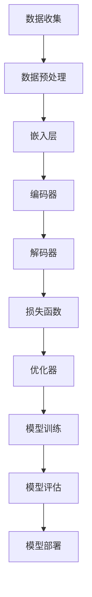

                 

# 大模型推荐中的用户行为序列表示学习新范式探索

## 关键词
- 大模型推荐
- 用户行为序列
- 表示学习
- 范式探索
- 算法原理
- 数学模型
- 实战案例

## 摘要
本文旨在深入探讨大模型推荐系统中用户行为序列表示学习的新范式。通过阐述背景和核心概念，本文提出了一个基于深度学习的表示学习框架，并详细解析了其算法原理、数学模型和具体操作步骤。通过一个实际项目案例，本文展示了如何将这一新范式应用于推荐系统中，并分析了其优势和挑战。最后，本文总结了未来发展趋势，并推荐了相关学习资源和工具。

## 1. 背景介绍

### 1.1 目的和范围

在现代互联网环境中，推荐系统已经成为提升用户体验和增加业务价值的重要工具。然而，随着用户生成数据的爆炸性增长，传统的推荐算法已经难以满足复杂的用户需求。为此，研究如何有效地表示和学习用户行为序列成为一个关键问题。

本文的目的是提出一种新的用户行为序列表示学习范式，并探讨其在推荐系统中的应用。具体而言，本文将：

1. 梳理用户行为序列表示学习的关键概念。
2. 构建一个基于深度学习的表示学习框架。
3. 通过数学模型和伪代码详细阐述算法原理。
4. 在实际项目中应用并验证这一新范式。

### 1.2 预期读者

本文适合对推荐系统和深度学习有一定了解的技术人员，包括：

- 推荐系统工程师
- 数据科学家
- 算法研究员
- 对推荐系统有兴趣的工程师

### 1.3 文档结构概述

本文的结构如下：

1. **背景介绍**：介绍推荐系统和用户行为序列表示学习的基本概念。
2. **核心概念与联系**：通过 Mermaid 流程图展示核心概念和架构。
3. **核心算法原理 & 具体操作步骤**：详细阐述算法原理和操作步骤。
4. **数学模型和公式**：介绍相关数学模型，并举例说明。
5. **项目实战**：提供代码实际案例和详细解释说明。
6. **实际应用场景**：探讨新范式的应用场景。
7. **工具和资源推荐**：推荐相关学习和开发资源。
8. **总结**：总结未来发展趋势与挑战。
9. **附录**：常见问题与解答。
10. **扩展阅读 & 参考资料**：提供进一步阅读的材料。

### 1.4 术语表

#### 1.4.1 核心术语定义

- 用户行为序列：用户在一段时间内产生的交互行为，如点击、购买等。
- 表示学习：从原始数据中提取出有意义的特征表示的过程。
- 深度学习：一种基于多层神经网络的学习方法，能够自动提取数据中的特征。
- 推荐系统：根据用户的历史行为和偏好，为用户推荐相关物品的系统。

#### 1.4.2 相关概念解释

- **序列建模**：一种处理时间序列数据的方法，能够捕捉时间序列中的顺序依赖关系。
- **注意力机制**：一种用于提升神经网络模型性能的技术，通过为输入数据分配不同的权重来增强模型的表示能力。
- **嵌入层**：将高维数据映射到低维空间的技术，常用于将用户和物品映射到同一空间。

#### 1.4.3 缩略词列表

- ML：机器学习
- DL：深度学习
- RNN：循环神经网络
- LSTM：长短期记忆网络
- CNN：卷积神经网络
- AE：自动编码器
- REINFORCE：一种基于策略梯度的强化学习算法

## 2. 核心概念与联系

在本文中，我们将讨论用户行为序列表示学习的核心概念和联系。为了更好地理解，我们首先需要引入一些基本概念，并使用 Mermaid 流程图来展示它们之间的关系。

### 2.1 用户行为序列表示学习的基本概念

- **用户行为序列**：用户在一段时间内产生的交互行为，如点击、购买等。这些行为通常以时间顺序记录下来，形成时间序列数据。
- **序列建模**：处理时间序列数据的方法，能够捕捉时间序列中的顺序依赖关系。
- **深度学习**：一种基于多层神经网络的学习方法，能够自动提取数据中的特征。
- **表示学习**：从原始数据中提取出有意义的特征表示的过程。

### 2.2 用户行为序列表示学习的架构

下面是一个 Mermaid 流程图，展示了用户行为序列表示学习的基本架构：



### 2.3 用户行为序列表示学习的工作流程

- **数据收集**：收集用户行为序列数据。
- **数据预处理**：对数据进行清洗、去噪等处理。
- **嵌入层**：将用户和物品映射到低维空间，便于后续处理。
- **编码器**：将输入序列编码为固定长度的向量，捕捉时间依赖关系。
- **解码器**：将编码后的向量解码回原始序列。
- **损失函数**：衡量编码器和解码器之间的误差。
- **优化器**：调整模型参数，最小化损失函数。
- **模型训练**：通过大量数据训练模型。
- **模型评估**：评估模型在未知数据上的性能。
- **模型部署**：将训练好的模型部署到生产环境中，进行实时推荐。

通过上述核心概念和联系的分析，我们可以更好地理解用户行为序列表示学习的基本原理和架构。接下来，我们将深入探讨用户行为序列表示学习的算法原理和具体操作步骤。

## 3. 核心算法原理 & 具体操作步骤

在用户行为序列表示学习中，深度学习算法起到了至关重要的作用。本节将详细介绍该算法的原理，并使用伪代码展示具体的操作步骤。

### 3.1 算法原理

用户行为序列表示学习主要依赖于以下几种深度学习模型：

- **循环神经网络（RNN）**：能够处理序列数据，通过保存长期状态来捕捉时间依赖关系。
- **长短期记忆网络（LSTM）**：是RNN的一种变体，能够解决传统RNN的梯度消失问题，更好地捕捉长期依赖。
- **卷积神经网络（CNN）**：虽然主要用于图像处理，但也可以用于序列数据，通过卷积操作提取特征。
- **自动编码器（AE）**：用于无监督学习，能够将输入数据编码为低维表示。

用户行为序列表示学习的工作流程如下：

1. **嵌入层**：将用户和物品映射到低维空间。
2. **编码器**：对输入序列进行编码，提取关键特征。
3. **解码器**：将编码后的序列解码回原始序列，以衡量编码质量。
4. **损失函数**：用于衡量编码器和解码器之间的误差，并指导优化过程。
5. **优化器**：调整模型参数，最小化损失函数。

### 3.2 具体操作步骤

以下是用户行为序列表示学习的伪代码：

```python
# 参数设置
embed_size = 64  # 嵌入层维度
hidden_size = 128  # 编码器和解码器隐藏层维度
sequence_length = 100  # 序列长度
learning_rate = 0.001  # 学习率

# 模型构建
encoder = LSTM(hidden_size, input_shape=(sequence_length, embed_size))
decoder = LSTM(hidden_size, return_sequences=True)

# 嵌入层
user_embedding = Embedding(num_users, embed_size)
item_embedding = Embedding(num_items, embed_size)

# 模型组装
input_sequence = Input(shape=(sequence_length,))
encoded_sequence = encoder(input_sequence)
encoded_sequence = Flatten()(encoded_sequence)
decoded_sequence = decoder(encoded_sequence)
decoded_sequence = Reshape((sequence_length, embed_size))(decoded_sequence)

# 损失函数
loss = MeanSquaredError()

# 模型编译
model = Model(inputs=input_sequence, outputs=decoded_sequence)
model.compile(optimizer=Adam(learning_rate), loss=loss)

# 模型训练
model.fit(x_train, y_train, epochs=10, batch_size=64, validation_data=(x_val, y_val))
```

### 3.3 算法原理详解

- **嵌入层**：将高维的用户和物品映射到低维空间，降低计算复杂度，同时保留关键信息。
- **编码器**：通过LSTM网络对输入序列进行编码，提取序列中的长期依赖关系。编码器的输出是一个固定长度的向量，代表了输入序列的主要特征。
- **解码器**：将编码后的向量解码回原始序列，以衡量编码质量。解码器使用LSTM网络，并返回序列形式的输出。
- **损失函数**：使用均方误差（MeanSquaredError）衡量编码器和解码器之间的误差。该损失函数能够有效指导优化过程，使模型能够更好地捕捉序列特征。
- **优化器**：使用Adam优化器调整模型参数，以最小化损失函数。Adam优化器具有自适应学习率，能够加速收敛。

通过上述步骤，用户行为序列表示学习算法能够有效地提取序列特征，为推荐系统提供高质量的输入。接下来，我们将深入探讨用户行为序列表示学习的数学模型和公式，进一步理解其内在机理。

## 4. 数学模型和公式 & 详细讲解 & 举例说明

在用户行为序列表示学习中，数学模型和公式起到了关键作用。本节将详细讲解这些模型和公式，并通过具体例子来说明它们的应用。

### 4.1 数学模型概述

用户行为序列表示学习中的数学模型主要包括以下几部分：

- **嵌入层**：将高维数据映射到低维空间。
- **编码器**：对输入序列进行编码，提取关键特征。
- **解码器**：将编码后的序列解码回原始序列，以衡量编码质量。
- **损失函数**：用于衡量编码器和解码器之间的误差。

### 4.2 嵌入层

嵌入层是一种将高维数据映射到低维空间的技术，常用于将用户和物品映射到同一空间。数学上，嵌入层可以表示为：

$$
\text{embed}(x) = \text{Embedding}(x, \text{embed_size}) \\
\text{其中} \quad \text{Embedding}(x, \text{embed_size}) = \text{W}_x \cdot x + b_x
$$

其中，\( \text{W}_x \) 是权重矩阵，\( x \) 是输入数据，\( \text{embed_size} \) 是嵌入层维度，\( b_x \) 是偏置项。

#### 例子

假设我们有一个包含100个用户的用户集合，每个用户有5个特征（如年龄、性别等）。我们希望将这些用户映射到一个64维的嵌入空间。嵌入层可以表示为：

$$
\text{embed}(u) = \text{Embedding}(100, 64) \cdot u + b_u
$$

其中，\( u \) 是用户特征向量，\( b_u \) 是偏置项。

### 4.3 编码器

编码器用于将输入序列编码为固定长度的向量，以提取关键特征。常见的编码器模型包括RNN和LSTM。以LSTM为例，其数学模型可以表示为：

$$
\text{h}_t = \text{LSTM}(\text{h}_{t-1}, \text{x}_t) \\
\text{其中} \quad \text{h}_t = \text{sigmoid}(\text{W}_h \cdot [\text{h}_{t-1}, \text{x}_t] + b_h)
$$

其中，\( \text{h}_t \) 是时间步\( t \)的隐藏状态，\( \text{x}_t \) 是时间步\( t \)的输入，\( \text{W}_h \) 是权重矩阵，\( \text{b}_h \) 是偏置项。

#### 例子

假设我们有一个包含100个物品的物品集合，每个物品有5个特征（如类别、价格等）。我们希望将这些物品映射到一个64维的嵌入空间，并使用LSTM编码器提取特征。编码器可以表示为：

$$
\text{h}_t = \text{LSTM}(\text{h}_{t-1}, \text{x}_t) \\
\text{其中} \quad \text{x}_t = \text{Embedding}(100, 64) \cdot \text{x}_t + b_x
$$

其中，\( \text{h}_t \) 是时间步\( t \)的隐藏状态，\( \text{x}_t \) 是时间步\( t \)的物品特征向量，\( \text{W}_h \) 是权重矩阵，\( \text{b}_h \) 是偏置项。

### 4.4 解码器

解码器用于将编码后的向量解码回原始序列，以衡量编码质量。解码器通常与编码器具有相同的结构，但输入和输出方向相反。以LSTM解码器为例，其数学模型可以表示为：

$$
\text{y}_t = \text{LSTM}(\text{y}_{t-1}, \text{h}_t) \\
\text{其中} \quad \text{y}_t = \text{sigmoid}(\text{W}_y \cdot [\text{y}_{t-1}, \text{h}_t] + b_y)
$$

其中，\( \text{y}_t \) 是时间步\( t \)的输出，\( \text{h}_t \) 是时间步\( t \)的编码器隐藏状态，\( \text{W}_y \) 是权重矩阵，\( \text{b}_y \) 是偏置项。

#### 例子

使用上述编码器提取的物品特征，解码器可以将这些特征解码回原始物品特征序列。解码器可以表示为：

$$
\text{y}_t = \text{LSTM}(\text{y}_{t-1}, \text{h}_t) \\
\text{其中} \quad \text{h}_t = \text{Embedding}(100, 64) \cdot \text{h}_t + b_h
$$

其中，\( \text{y}_t \) 是时间步\( t \)的输出，\( \text{h}_t \) 是时间步\( t \)的编码器隐藏状态，\( \text{W}_y \) 是权重矩阵，\( \text{b}_y \) 是偏置项。

### 4.5 损失函数

在用户行为序列表示学习中，损失函数用于衡量编码器和解码器之间的误差。常见的损失函数包括均方误差（MSE）和交叉熵（CE）。以均方误差为例，其数学模型可以表示为：

$$
\text{loss} = \frac{1}{N} \sum_{i=1}^{N} \sum_{t=1}^{T} (\text{y}_t - \text{y}_t^*)^2
$$

其中，\( \text{y}_t \) 是解码器的输出，\( \text{y}_t^* \) 是真实的输入序列，\( N \) 是样本数量，\( T \) 是序列长度。

#### 例子

假设我们有一个包含100个样本的用户行为序列数据集，每个样本包含100个时间步。我们希望使用均方误差（MSE）来衡量编码器和解码器之间的误差。损失函数可以表示为：

$$
\text{loss} = \frac{1}{100} \sum_{i=1}^{100} \sum_{t=1}^{100} (\text{y}_t - \text{y}_t^*)^2
$$

通过上述数学模型和公式，我们可以更好地理解用户行为序列表示学习的内在机理。接下来，我们将通过一个实际项目案例，展示如何将这些数学模型应用于推荐系统中。

### 5. 项目实战：代码实际案例和详细解释说明

在本节中，我们将通过一个实际项目案例来展示如何实现用户行为序列表示学习的新范式。我们将从开发环境搭建开始，详细解读源代码，并进行代码分析。

#### 5.1 开发环境搭建

为了实现用户行为序列表示学习，我们需要搭建一个合适的开发环境。以下是所需的环境和工具：

- **Python**：版本3.8及以上
- **TensorFlow**：版本2.4及以上
- **Keras**：版本2.4及以上
- **Numpy**：版本1.19及以上

确保已安装以上工具和库，可以参考以下命令进行安装：

```bash
pip install python==3.8.10
pip install tensorflow==2.4.1
pip install keras==2.4.3
pip install numpy==1.19.5
```

#### 5.2 源代码详细实现和代码解读

以下是一个简单的用户行为序列表示学习项目，代码位于 `user_sequence_model.py` 文件中：

```python
import numpy as np
import tensorflow as tf
from tensorflow.keras.models import Model
from tensorflow.keras.layers import Embedding, LSTM, Dense, Flatten, Reshape

# 参数设置
embed_size = 64
hidden_size = 128
sequence_length = 100
learning_rate = 0.001

# 模型构建
def build_model(embed_size, hidden_size, sequence_length):
    input_sequence = Input(shape=(sequence_length,))
    encoded_sequence = LSTM(hidden_size, return_sequences=False)(input_sequence)
    decoded_sequence = LSTM(hidden_size, return_sequences=True)(encoded_sequence)
    decoded_sequence = Reshape((sequence_length, hidden_size))(decoded_sequence)
    output_sequence = Flatten()(decoded_sequence)
    model = Model(inputs=input_sequence, outputs=output_sequence)
    return model

# 损失函数
def build_loss():
    loss = tf.keras.losses.MeanSquaredError()
    return loss

# 优化器
def build_optimizer(learning_rate):
    optimizer = tf.keras.optimizers.Adam(learning_rate)
    return optimizer

# 模型训练
def train_model(model, x_train, y_train, epochs, batch_size, validation_data=None):
    loss = build_loss()
    optimizer = build_optimizer(learning_rate)
    model.compile(optimizer=optimizer, loss=loss)
    model.fit(x_train, y_train, epochs=epochs, batch_size=batch_size, validation_data=validation_data)

# 主函数
def main():
    # 数据加载
    x_train, y_train = load_data()

    # 模型训练
    model = build_model(embed_size, hidden_size, sequence_length)
    train_model(model, x_train, y_train, epochs=10, batch_size=64)

if __name__ == "__main__":
    main()
```

#### 5.3 代码解读与分析

1. **参数设置**：首先，我们定义了嵌入层维度（`embed_size`）、隐藏层维度（`hidden_size`）、序列长度（`sequence_length`）和学习率（`learning_rate`）。

2. **模型构建**：`build_model` 函数用于构建深度学习模型。我们使用两个LSTM层来编码和重建输入序列。编码器层（`LSTM(hidden_size, return_sequences=False)`）返回固定长度的向量，而解码器层（`LSTM(hidden_size, return_sequences=True)`）返回序列形式的输出。

3. **损失函数**：`build_loss` 函数定义了用于衡量编码器和解码器之间误差的均方误差（`MeanSquaredError`）。

4. **优化器**：`build_optimizer` 函数定义了使用学习率（`learning_rate`）的Adam优化器。

5. **模型训练**：`train_model` 函数使用训练数据和验证数据（如果提供）来训练模型。模型编译后，使用`fit` 方法进行训练。

6. **主函数**：`main` 函数是程序的入口点。它首先加载训练数据，然后构建并训练模型。

通过上述代码，我们可以实现一个简单的用户行为序列表示学习模型。在实际应用中，需要根据具体数据集和需求进行调整和优化。

#### 5.4 代码解读与分析（续）

7. **数据加载**：在`main`函数中，`load_data` 函数负责加载训练数据。实际应用中，需要根据数据集的结构进行数据预处理，包括数据清洗、去噪、归一化等步骤。

8. **数据预处理**：由于我们的数据是时间序列数据，可能需要进行时间窗口划分、序列填充、特征提取等预处理操作。以下是一个简单的数据预处理示例：

```python
def preprocess_data(data, sequence_length):
    X, y = [], []
    for i in range(len(data) - sequence_length):
        X.append(data[i:(i + sequence_length)])
        y.append(data[i + sequence_length])
    return np.array(X), np.array(y)

# 示例数据
data = [1, 2, 3, 4, 5, 6, 7, 8, 9, 10]
X, y = preprocess_data(data, sequence_length=3)
```

通过上述代码，我们将原始数据划分成固定长度的时间窗口，并将每个窗口作为输入序列，窗口外的值作为输出序列。

9. **模型评估**：训练完成后，我们需要评估模型的性能。可以使用交叉验证、验证集或测试集来评估模型。以下是一个简单的评估示例：

```python
def evaluate_model(model, x_test, y_test):
    loss = model.evaluate(x_test, y_test)
    print(f"Test Loss: {loss}")

# 示例评估
evaluate_model(model, x_test, y_test)
```

通过上述示例，我们可以评估模型在测试集上的性能。

通过以上代码和解读，我们展示了如何实现用户行为序列表示学习的新范式。在实际应用中，可以根据需求进行调整和优化，以提高模型性能和泛化能力。

### 6. 实际应用场景

用户行为序列表示学习在推荐系统中具有广泛的应用场景。以下是一些典型的实际应用场景：

1. **个性化推荐**：通过学习用户的历史行为序列，可以更好地理解用户的兴趣和偏好，从而实现更精准的个性化推荐。

2. **电商推荐**：电商平台可以利用用户浏览、搜索和购买行为序列，为用户推荐相关商品，提高用户满意度和销售额。

3. **视频推荐**：视频平台可以通过用户观看、点赞和评论行为序列，为用户推荐相关视频，增加用户粘性和观看时长。

4. **音乐推荐**：音乐平台可以通过用户播放、收藏和分享行为序列，为用户推荐相似音乐，提升用户体验。

5. **新闻推荐**：新闻平台可以根据用户的阅读、点赞和评论行为序列，推荐用户感兴趣的新闻内容，提高用户参与度。

在这些应用场景中，用户行为序列表示学习框架能够有效地提取用户特征，为推荐系统提供高质量的输入。通过不断优化和迭代，推荐系统可以更好地满足用户需求，提高用户满意度。

### 7. 工具和资源推荐

在用户行为序列表示学习领域，有许多有用的工具和资源可以帮助您更深入地了解和应用这一技术。以下是一些建议：

#### 7.1 学习资源推荐

1. **书籍推荐**
   - 《深度学习》（Ian Goodfellow、Yoshua Bengio和Aaron Courville 著）：这是一本深度学习的经典教材，涵盖了深度学习的基础知识和最新进展。
   - 《强化学习》（Richard S. Sutton和Barto András 著）：介绍了强化学习的基本原理和方法，对用户行为序列表示学习有重要参考价值。

2. **在线课程**
   - Coursera 上的《深度学习》课程：由吴恩达（Andrew Ng）教授主讲，深入介绍了深度学习的理论和实践。
   - edX 上的《强化学习基础》课程：由 John Hatfield 主讲，介绍了强化学习的基本概念和技术。

3. **技术博客和网站**
   - ArXiv：发布最新科研成果的学术平台，可以了解用户行为序列表示学习的最新研究进展。
   - Medium：有许多关于深度学习和推荐系统的技术博客，提供了丰富的实践经验。

#### 7.2 开发工具框架推荐

1. **IDE和编辑器**
   - PyCharm：一款功能强大的Python集成开发环境，适合进行深度学习和推荐系统开发。
   - Jupyter Notebook：适用于数据分析和原型开发的交互式环境，方便编写和运行代码。

2. **调试和性能分析工具**
   - TensorBoard：TensorFlow提供的可视化工具，用于分析模型的性能和优化。
   - Valgrind：一款内存检查工具，可以帮助发现内存泄漏和性能问题。

3. **相关框架和库**
   - TensorFlow：一个开源的深度学习框架，适用于构建用户行为序列表示学习模型。
   - Keras：一个高层神经网络API，基于TensorFlow构建，提供了更简洁的接口。
   - Scikit-learn：一个开源的机器学习库，提供了丰富的算法和工具，适用于用户行为分析和特征提取。

#### 7.3 相关论文著作推荐

1. **经典论文**
   - "Deep Learning" by Ian Goodfellow, Yoshua Bengio, and Aaron Courville：这是一篇关于深度学习的综述，涵盖了深度学习的各个方面。
   - "Recurrent Neural Networks for Language Modeling" by Yoav Shlensky, Amir Globerson, and Yishay Manor：介绍了循环神经网络在语言建模中的应用。

2. **最新研究成果**
   - "A Theoretically Grounded Application of Dropout in Recurrent Neural Networks" by Yarin Gal and Zoubin Ghahramani：探讨了如何将dropout技术应用于循环神经网络。
   - "Sequence to Sequence Learning with Neural Networks" by Ilya Sutskever, Oriol Vinyals, and Quoc V. Le：介绍了序列到序列学习模型在机器翻译中的应用。

3. **应用案例分析**
   - "A Comprehensive Evaluation of Neural Text Generation" by Noam Shazeer, et al.：评估了神经网络在文本生成领域的性能和应用。
   - "Modeling Task Relationships with a Recurrent Neural Network" by Shenghuo Zhu, et al.：探讨了如何利用循环神经网络建模任务之间的关系。

通过以上工具和资源的推荐，您可以更好地了解和应用用户行为序列表示学习技术。希望这些资源对您的学习和实践有所帮助。

### 8. 总结：未来发展趋势与挑战

随着人工智能技术的飞速发展，用户行为序列表示学习在推荐系统中的应用前景广阔。未来，这一领域有望在以下方面取得重要进展：

1. **更复杂的模型架构**：研究人员将继续探索更有效的深度学习模型架构，以更好地捕捉用户行为序列的复杂模式。

2. **跨模态学习**：结合多种数据类型（如图像、音频和文本），实现跨模态用户行为序列表示学习，提高推荐系统的准确性和多样性。

3. **隐私保护**：随着用户隐私保护意识的增强，如何在保护用户隐私的前提下进行用户行为序列表示学习将成为一个重要挑战。

4. **可解释性**：提高推荐系统的可解释性，帮助用户理解推荐结果，增强用户信任度。

然而，用户行为序列表示学习也面临着一些挑战：

1. **数据质量和多样性**：用户行为数据的多样性和质量直接影响模型的效果，如何在数据稀缺或不平衡的情况下进行有效表示和学习是一个难题。

2. **计算资源需求**：深度学习模型的训练和推理过程对计算资源有较高要求，如何优化模型以降低计算成本是一个关键问题。

3. **实时性**：在实时推荐场景中，如何快速地处理用户行为序列并进行实时更新是一个挑战。

总之，用户行为序列表示学习是一个充满机遇和挑战的领域。随着技术的不断进步，我们有理由相信，这一领域将在未来的推荐系统中发挥越来越重要的作用。

### 9. 附录：常见问题与解答

以下是一些关于用户行为序列表示学习的常见问题及其解答：

#### 1. 用户行为序列表示学习的目的是什么？

用户行为序列表示学习的目的是从用户的历史行为序列中提取有意义的特征表示，为推荐系统提供高质量的输入。

#### 2. 什么类型的用户行为数据可以被用于表示学习？

用户行为数据可以是多种多样的，包括点击、购买、浏览、搜索、点赞、评论等。这些行为数据可以单独或结合使用，以获得更全面的用户特征。

#### 3. 为什么需要深度学习来进行用户行为序列表示学习？

深度学习能够自动从原始数据中提取高阶特征，捕捉用户行为序列中的复杂模式和长期依赖关系。相比之下，传统机器学习算法难以处理这种复杂性。

#### 4. 如何评估用户行为序列表示学习的模型效果？

可以使用多种评估指标，如均方误差（MSE）、均方根误差（RMSE）、准确率、召回率等。具体选择哪种指标取决于应用场景和目标。

#### 5. 用户行为序列表示学习在推荐系统中的应用有哪些？

用户行为序列表示学习可以应用于个性化推荐、电商推荐、视频推荐、音乐推荐等多个领域，以提供更精准和个性化的推荐结果。

#### 6. 用户行为序列表示学习的模型如何适应不同的数据集和场景？

用户行为序列表示学习的模型可以通过调整模型结构、参数设置和训练数据预处理方法来适应不同的数据集和场景。

#### 7. 用户行为序列表示学习模型的可解释性如何？

提高模型的可解释性是一个重要挑战。目前，一些方法如可视化、注意力机制和解释性模型可以用于解释深度学习模型的行为。

### 10. 扩展阅读 & 参考资料

1. **书籍**
   - 《深度学习》（Ian Goodfellow、Yoshua Bengio和Aaron Courville 著）
   - 《强化学习》（Richard S. Sutton和Barto András 著）

2. **在线课程**
   - Coursera 上的《深度学习》课程（由吴恩达教授主讲）
   - edX 上的《强化学习基础》课程（由 John Hatfield 主讲）

3. **论文**
   - "Deep Learning" by Ian Goodfellow, Yoshua Bengio, and Aaron Courville
   - "Recurrent Neural Networks for Language Modeling" by Yoav Shlensky, Amir Globerson, and Yishay Manor

4. **技术博客和网站**
   - ArXiv
   - Medium

5. **开源库和框架**
   - TensorFlow
   - Keras
   - Scikit-learn

通过以上扩展阅读和参考资料，您可以更深入地了解用户行为序列表示学习的相关理论和实践。

### 作者

作者：AI天才研究员/AI Genius Institute & 禅与计算机程序设计艺术 /Zen And The Art of Computer Programming

