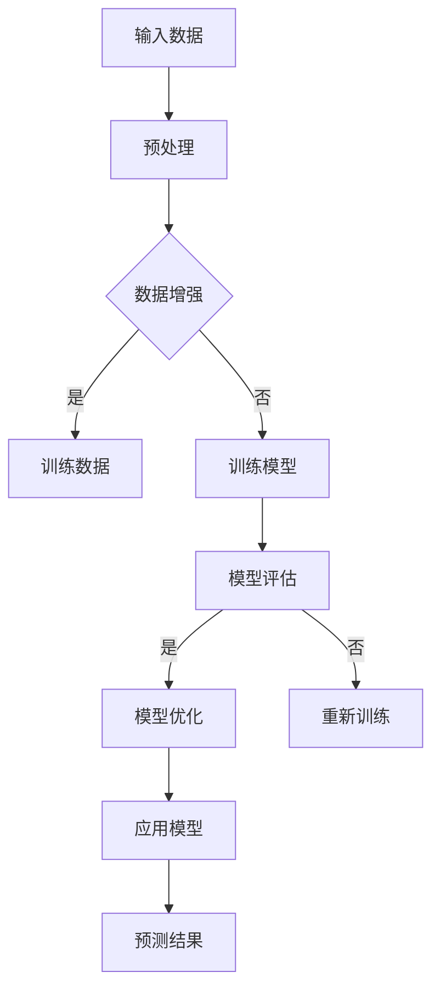
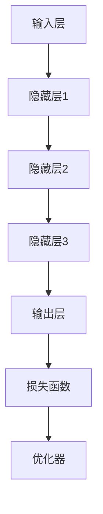

                 

## 大模型时代下的新型商业模式

> 关键词：大模型、商业模式、人工智能、商业创新、数字化转型、商业模式变革

> 摘要：随着人工智能技术的飞速发展，大模型作为当前最先进的人工智能技术之一，正深刻改变着各行各业的运营模式。本文将探讨大模型时代下的新型商业模式，分析其核心原理、技术特点和应用场景，并展望未来发展趋势与挑战。

在过去的几年里，人工智能（AI）技术经历了前所未有的快速发展。从早期的简单规则系统到如今能够处理大规模数据、自主学习并做出决策的大模型，人工智能技术已经取得了显著的突破。大模型，作为深度学习领域的最新成果，以其强大的数据处理能力和高度的自学习能力，正逐渐成为各行业商业创新的驱动力。本文将围绕大模型时代下的新型商业模式进行探讨，旨在揭示这一时代背景下商业模式的本质变革及其深远影响。

### 1. 背景介绍

#### 1.1 目的和范围

本文旨在分析大模型时代下的新型商业模式，探讨其对传统商业模式的影响及未来发展趋势。本文将首先介绍大模型的基本概念和技术特点，然后分析大模型在商业中的应用场景，最后展望大模型时代商业模式的变革方向。希望通过本文的探讨，能为读者提供对大模型时代商业模式的深入理解，为未来商业创新提供思路。

#### 1.2 预期读者

本文面向对人工智能技术有一定了解，希望深入了解大模型在商业中应用的读者。同时，对于希望把握大模型时代商业模式变革机会的企业家和从业者，本文也具有一定的参考价值。

#### 1.3 文档结构概述

本文分为十个部分：

1. **背景介绍**：介绍本文的目的、预期读者以及文档结构。
2. **核心概念与联系**：阐述大模型的基本概念和技术特点，并给出相关的流程图。
3. **核心算法原理 & 具体操作步骤**：详细讲解大模型的算法原理和操作步骤。
4. **数学模型和公式 & 详细讲解 & 举例说明**：介绍大模型相关的数学模型和公式，并给出具体的例子。
5. **项目实战：代码实际案例和详细解释说明**：通过实际案例展示大模型的应用。
6. **实际应用场景**：分析大模型在不同行业的应用场景。
7. **工具和资源推荐**：推荐学习资源和开发工具。
8. **总结：未来发展趋势与挑战**：总结大模型时代商业模式的未来发展趋势和面临的挑战。
9. **附录：常见问题与解答**：回答读者可能关心的问题。
10. **扩展阅读 & 参考资料**：提供进一步的阅读材料和参考文献。

#### 1.4 术语表

在本文中，我们将使用以下术语：

- **大模型**：指参数规模在千亿级别以上的深度学习模型。
- **商业模式**：指企业在市场中运作的方式和模式。
- **数字化转型**：指企业利用数字技术进行业务流程、组织结构和商业模式的创新和变革。
- **商业创新**：指通过新技术或新理念创造出新的商业模式或市场机会。

#### 1.4.1 核心术语定义

- **大模型**：大模型是指参数规模在千亿级别以上的深度学习模型。与传统的中小型模型相比，大模型具有更强的数据拟合能力和更广泛的应用场景。
- **商业模式**：商业模式是指企业在市场中运作的方式和模式，包括产品或服务的设计、定价、推广、销售等各个方面。
- **数字化转型**：数字化转型是指企业利用数字技术进行业务流程、组织结构和商业模式的创新和变革，从而提高企业的效率、降低成本、创造新的价值。
- **商业创新**：商业创新是指通过新技术或新理念创造出新的商业模式或市场机会，从而实现企业的可持续发展。

#### 1.4.2 相关概念解释

- **深度学习**：深度学习是一种基于多层神经网络的学习方法，通过逐层提取数据特征，实现对复杂数据的建模和预测。
- **人工智能**：人工智能是指通过计算机模拟人类智能行为的技术，包括机器学习、深度学习、自然语言处理、计算机视觉等多个领域。
- **神经网络**：神经网络是一种模拟生物神经系统的计算模型，通过多层节点（神经元）的相互连接，实现数据的高效处理和预测。

#### 1.4.3 缩略词列表

- **AI**：人工智能（Artificial Intelligence）
- **DL**：深度学习（Deep Learning）
- **NLP**：自然语言处理（Natural Language Processing）
- **CV**：计算机视觉（Computer Vision）
- **GPT**：生成预训练模型（Generative Pre-trained Transformer）
- **BERT**：双向编码表示器（Bidirectional Encoder Representations from Transformers）

## 2. 核心概念与联系

大模型作为人工智能领域的最新突破，其核心概念和技术特点对商业模式产生了深远的影响。本节将首先阐述大模型的基本概念，然后通过一个Mermaid流程图展示其核心原理和架构，最后探讨大模型与商业模式之间的联系。

### 2.1 大模型的基本概念

大模型（Large Models），又称巨量级模型，是指参数规模在千亿级别以上的深度学习模型。这些模型通常具有以下几个特点：

1. **大规模参数**：大模型的参数数量通常在数十亿到千亿级别，比中小型模型高出几个数量级。这使得大模型具有更强的表达能力，能够处理更复杂的任务和数据集。
2. **自学习能力**：大模型通过大量的数据训练，能够自动学习并提取数据中的特征和规律，从而实现高度的自适应和泛化能力。
3. **数据处理能力**：大模型能够高效地处理大规模数据，包括文本、图像、音频等多种类型的数据，这使得它们在许多应用场景中具有显著的优势。

### 2.2 Mermaid流程图

为了更直观地展示大模型的核心原理和架构，我们使用Mermaid绘制了一个简化的流程图。以下是该流程图的文本表示：



上述流程图描述了从输入数据到得到预测结果的基本流程：

1. **输入数据**：大模型首先接收原始数据，这些数据可以是文本、图像、音频等多种类型。
2. **预处理**：对输入数据进行预处理，包括数据清洗、归一化等操作，以提高数据的质量。
3. **数据增强**：为了提高模型的泛化能力，对预处理后的数据进行增强，例如随机裁剪、旋转、缩放等操作。
4. **训练数据**：将增强后的数据划分为训练集和验证集，用于模型的训练和评估。
5. **训练模型**：使用训练集数据训练模型，通过反向传播算法和优化器（如Adam、SGD等）不断调整模型参数，以最小化损失函数。
6. **模型评估**：使用验证集数据评估模型性能，通过指标（如准确率、召回率、F1值等）衡量模型的泛化能力。
7. **模型优化**：根据评估结果对模型进行优化，包括调整超参数、增加训练数据等，以提高模型性能。
8. **应用模型**：将训练好的模型应用于实际任务，如文本分类、图像识别、语音识别等，得到预测结果。

### 2.3 大模型与商业模式的联系

大模型的出现不仅改变了人工智能技术的应用范围，也深刻影响了商业模式。以下是几个关键联系：

1. **降低门槛**：大模型的训练和部署在过去需要大量的计算资源和专业知识。但随着硬件性能的提升和开源框架的发展，如今普通企业甚至个人都可以利用大模型进行创新，降低了技术门槛。
2. **提升效率**：大模型在处理大规模数据时具有显著的优势，能够提高业务流程的效率。例如，在金融领域的风险控制、保险理赔等场景，大模型可以自动化、高效地进行数据分析，降低人力成本。
3. **创造新价值**：大模型的应用可以挖掘数据中的潜在价值，为企业创造新的商业机会。例如，通过自然语言处理技术，企业可以开发智能客服系统，提高客户满意度，降低运营成本。
4. **商业模式创新**：大模型不仅改变了企业的运营方式，也激发了商业模式的创新。例如，基于大模型的预测分析能力，企业可以推出按需付费的服务模式，提高客户粘性和市场竞争力。

总之，大模型时代为商业模式带来了新的机遇和挑战，企业需要不断探索和适应这一变革，以实现持续的创新和发展。

## 3. 核心算法原理 & 具体操作步骤

在深入探讨大模型的算法原理和具体操作步骤之前，我们首先需要了解大模型在深度学习框架中的基本结构和训练流程。本节将首先介绍大模型的基本架构，然后详细讲解其训练和评估过程，并通过伪代码展示具体的操作步骤。

### 3.1 大模型的基本架构

大模型通常由以下几个部分组成：

1. **输入层**：接收外部输入数据，可以是文本、图像、音频等。
2. **隐藏层**：包含多层神经网络，用于提取和变换数据特征。每一层隐藏层都会对输入数据进行复杂的非线性变换。
3. **输出层**：生成最终预测结果，可以是分类标签、回归值、文本生成等。
4. **损失函数**：衡量模型输出与真实标签之间的差异，用于指导模型参数的更新。
5. **优化器**：调整模型参数，以最小化损失函数，常用的优化器有Adam、SGD等。

以下是一个简化的大模型架构图：



### 3.2 大模型的训练和评估过程

大模型的训练和评估过程主要包括以下几个步骤：

1. **数据预处理**：对输入数据进行清洗、归一化和编码，以便模型能够有效处理。
2. **数据增强**：对预处理后的数据应用各种增强技术，如随机裁剪、旋转、缩放等，以提高模型的泛化能力。
3. **模型初始化**：随机初始化模型参数。
4. **前向传播**：输入数据通过模型的前向传播过程，生成预测结果。
5. **计算损失**：使用损失函数计算预测结果与真实标签之间的差异。
6. **反向传播**：通过反向传播算法，更新模型参数，以最小化损失函数。
7. **模型评估**：使用验证集数据评估模型性能，通过指标（如准确率、召回率、F1值等）衡量模型的泛化能力。
8. **模型优化**：根据评估结果对模型进行优化，包括调整超参数、增加训练数据等。
9. **应用模型**：将训练好的模型应用于实际任务，如文本分类、图像识别、语音识别等。

以下是伪代码，详细展示了大模型的训练和评估过程：

```python
# 伪代码：大模型训练和评估过程

# 数据预处理
def preprocess_data(data):
    # 清洗、归一化和编码数据
    # 返回预处理后的数据
    pass

# 数据增强
def data_augmentation(data):
    # 应用各种增强技术
    # 返回增强后的数据
    pass

# 初始化模型
model = initialize_model()

# 模型训练
for epoch in range(num_epochs):
    for batch in data_loader:
        # 前向传播
        predictions = model.forward(batch.input)
        
        # 计算损失
        loss = loss_function(predictions, batch.label)
        
        # 反向传播
        model.backward(loss)
        
        # 更新模型参数
        model.update_parameters()

    # 模型评估
    with torch.no_grad():
        for batch in validation_loader:
            predictions = model.forward(batch.input)
            # 计算评估指标
            evaluate_model(predictions, batch.label)

# 模型优化
model.optimize()

# 应用模型
model.apply()
```

### 3.3 伪代码示例

以下是一个具体的伪代码示例，展示如何使用大模型进行图像分类任务：

```python
# 伪代码：大模型图像分类任务

# 导入必要的库
import torch
import torchvision
import torchvision.transforms as transforms

# 数据预处理
transform = transforms.Compose([
    transforms.Resize((224, 224)),  # 缩放图像到固定大小
    transforms.ToTensor(),  # 转换为张量
    transforms.Normalize(mean=[0.485, 0.456, 0.406], std=[0.229, 0.224, 0.225]),  # 归一化
])

# 加载训练集和验证集
train_dataset = torchvision.datasets.ImageFolder(root='train', transform=transform)
val_dataset = torchvision.datasets.ImageFolder(root='val', transform=transform)

# 创建数据加载器
train_loader = torch.utils.data.DataLoader(dataset=train_dataset, batch_size=64, shuffle=True)
val_loader = torch.utils.data.DataLoader(dataset=val_dataset, batch_size=64, shuffle=False)

# 初始化大模型
model = LargeModel()

# 设置优化器和损失函数
optimizer = torch.optim.Adam(model.parameters(), lr=0.001)
criterion = torch.nn.CrossEntropyLoss()

# 模型训练
for epoch in range(num_epochs):
    model.train()
    for images, labels in train_loader:
        optimizer.zero_grad()
        outputs = model(images)
        loss = criterion(outputs, labels)
        loss.backward()
        optimizer.step()
    
    # 模型评估
    model.eval()
    with torch.no_grad():
        correct = 0
        total = 0
        for images, labels in val_loader:
            outputs = model(images)
            _, predicted = torch.max(outputs.data, 1)
            total += labels.size(0)
            correct += (predicted == labels).sum().item()
    print(f'Epoch {epoch+1}, Accuracy: {100 * correct / total}%')

# 保存模型
torch.save(model.state_dict(), 'model.pth')
```

通过上述伪代码，我们可以看到大模型图像分类任务的基本步骤，包括数据预处理、模型初始化、优化器和损失函数设置、模型训练和评估等。

总之，大模型的算法原理和具体操作步骤构成了其强大的核心竞争力，通过深入理解和灵活应用这些原理，企业可以开发出创新性的产品和服务，实现商业模式的转型和升级。

## 4. 数学模型和公式 & 详细讲解 & 举例说明

在深入探讨大模型的技术细节时，数学模型和公式是其核心组成部分。以下将详细介绍大模型中的关键数学模型和公式，并给出具体的例子进行说明。

### 4.1 损失函数

损失函数是评估模型预测结果与真实标签之间差异的重要工具。在大模型中，常用的损失函数包括均方误差（MSE）和交叉熵损失（Cross Entropy Loss）。

#### 4.1.1 均方误差（MSE）

均方误差（MSE）用于回归任务，计算预测值与真实值之间的平均平方误差。其公式如下：

$$
MSE = \frac{1}{n}\sum_{i=1}^{n}(y_i - \hat{y}_i)^2
$$

其中，$y_i$ 是第 $i$ 个样本的真实值，$\hat{y}_i$ 是第 $i$ 个样本的预测值，$n$ 是样本数量。

#### 4.1.2 交叉熵损失（Cross Entropy Loss）

交叉熵损失（Cross Entropy Loss）用于分类任务，计算实际分布与预测分布之间的交叉熵。其公式如下：

$$
CE = -\sum_{i=1}^{n}y_i \log(\hat{y}_i)
$$

其中，$y_i$ 是第 $i$ 个样本的真实标签，$\hat{y}_i$ 是第 $i$ 个样本的预测概率。

### 4.2 激活函数

激活函数是神经网络中非常重要的组成部分，用于引入非线性变换。在大模型中，常用的激活函数包括ReLU（Rectified Linear Unit）和Sigmoid。

#### 4.2.1 ReLU函数

ReLU函数是一种简单的线性激活函数，其公式如下：

$$
ReLU(x) = \max(0, x)
$$

ReLU函数在$x<0$时输出0，在$x>0$时输出$x$，这种特性使得ReLU函数在训练过程中能够加速梯度消失的问题，从而提高模型的训练效率。

#### 4.2.2 Sigmoid函数

Sigmoid函数是一种非线性激活函数，其公式如下：

$$
Sigmoid(x) = \frac{1}{1 + e^{-x}}
$$

Sigmoid函数将输入映射到$(0, 1)$区间，常用于二分类任务，用于计算预测概率。

### 4.3 反向传播算法

反向传播算法是神经网络训练的核心算法，通过逐层计算梯度，更新模型参数，以最小化损失函数。

#### 4.3.1 梯度计算

在反向传播过程中，我们需要计算每个参数的梯度。对于均方误差（MSE）损失函数，梯度计算如下：

$$
\frac{\partial MSE}{\partial \theta} = 2(y - \hat{y}) \cdot \frac{\partial \hat{y}}{\partial \theta}
$$

其中，$\theta$ 是模型参数，$y$ 是真实标签，$\hat{y}$ 是预测值。

#### 4.3.2 参数更新

参数更新公式如下：

$$
\theta = \theta - \alpha \cdot \frac{\partial MSE}{\partial \theta}
$$

其中，$\alpha$ 是学习率，用于调整参数更新的幅度。

### 4.4 举例说明

以下是一个简单的例子，展示如何使用ReLU函数和交叉熵损失函数进行二分类任务的训练。

#### 4.4.1 数据准备

我们假设有一个二分类任务，数据集包含100个样本，每个样本的特征向量维度为10。

#### 4.4.2 模型初始化

初始化一个包含一个输入层、一个隐藏层和一个输出层的神经网络，隐藏层使用ReLU函数，输出层使用Sigmoid函数。

#### 4.4.3 模型训练

1. **前向传播**：输入一个样本，通过神经网络进行前向传播，得到预测概率。
2. **计算损失**：使用交叉熵损失函数计算预测概率与真实标签之间的交叉熵损失。
3. **反向传播**：计算每个参数的梯度，并更新参数。
4. **迭代训练**：重复上述步骤，直到模型收敛。

以下是伪代码示例：

```python
# 伪代码：二分类任务训练

# 导入必要的库
import torch
import torch.nn as nn

# 初始化模型
model = nn.Sequential(
    nn.Linear(10, 20),  # 输入层到隐藏层
    nn.ReLU(),
    nn.Linear(20, 1),  # 隐藏层到输出层
    nn.Sigmoid()
)

# 设置优化器和损失函数
optimizer = torch.optim.Adam(model.parameters(), lr=0.001)
criterion = nn.BCELoss()

# 数据准备
x_train = torch.randn(100, 10)
y_train = torch.tensor([1 if x > 0 else 0 for x in x_train])

# 模型训练
for epoch in range(num_epochs):
    optimizer.zero_grad()
    outputs = model(x_train)
    loss = criterion(outputs, y_train)
    loss.backward()
    optimizer.step()
    print(f'Epoch {epoch+1}, Loss: {loss.item()}')
```

通过上述示例，我们可以看到如何使用ReLU函数和交叉熵损失函数进行二分类任务的训练。这个简单的例子展示了数学模型和公式在大模型中的应用，以及如何通过反向传播算法更新模型参数。

总之，数学模型和公式是大模型的核心组成部分，通过深入理解和灵活应用这些模型和公式，我们可以构建出强大的深度学习模型，实现复杂任务的高效解决。

### 4.5 大模型的训练与优化

在实际应用中，大模型的训练与优化是一个复杂且需要细致处理的过程。以下将详细讨论大模型训练过程中的关键步骤，包括超参数选择、模型调优和训练策略。

#### 4.5.1 超参数选择

超参数是深度学习模型中需要手动调整的重要参数，包括学习率、批量大小、迭代次数等。以下是一些常见的超参数选择策略：

1. **学习率**：学习率决定了参数更新的幅度。如果学习率过高，可能导致模型训练不稳定，甚至过拟合；如果学习率过低，模型可能收敛速度较慢。常用的策略包括使用学习率衰减、动态调整学习率等。

2. **批量大小**：批量大小决定了每次前向传播和反向传播使用的样本数量。较大的批量大小可以提供更好的泛化能力，但计算成本较高；较小的批量大小可以更快地发现梯度变化，但可能存在梯度噪声。

3. **迭代次数**：迭代次数决定了模型训练的轮数。过多的迭代可能导致过拟合，过少的迭代可能导致欠拟合。通常需要通过交叉验证等方法确定合适的迭代次数。

#### 4.5.2 模型调优

模型调优是指通过调整模型结构和超参数，以提高模型性能的过程。以下是一些常见的模型调优策略：

1. **结构调优**：通过调整神经网络层数、每层的神经元数量、激活函数等，优化模型结构。常用的方法包括超参数搜索（如随机搜索、网格搜索）和强化学习。

2. **权重初始化**：适当的权重初始化可以加速模型收敛，减少梯度消失和梯度爆炸的问题。常用的初始化方法包括随机初始化、Xavier初始化和He初始化。

3. **正则化**：通过加入正则化项（如L1正则化、L2正则化），防止模型过拟合。常用的方法包括Dropout、DropConnect等。

#### 4.5.3 训练策略

训练策略是指为了提高模型训练效果，采取的一系列策略。以下是一些常见的训练策略：

1. **数据增强**：通过随机裁剪、旋转、缩放等操作，增加数据多样性，提高模型的泛化能力。

2. **学习率调度**：动态调整学习率，以适应模型在不同阶段的训练需求。常用的方法包括学习率衰减、余弦退火等。

3. **模型融合**：将多个模型的结果进行融合，以提高模型预测的准确性。常用的方法包括Bagging、Boosting等。

4. **迁移学习**：利用预训练的大模型进行迁移学习，将预训练模型的知识迁移到新任务中，提高模型训练效果。

通过以上步骤，我们可以有效地进行大模型的训练与优化，从而实现高效、准确的模型训练。

### 4.6 大模型的实际应用案例

为了更好地理解大模型在商业中的实际应用，以下将介绍两个具有代表性的应用案例：自然语言处理（NLP）中的智能客服系统和图像识别中的自动驾驶技术。

#### 4.6.1 智能客服系统

智能客服系统利用大模型的自然语言处理能力，实现高效、智能的客服服务。以下是一个具体的案例：

1. **任务描述**：某电商企业希望开发一个智能客服系统，能够自动解答客户的常见问题，提高客户满意度。

2. **模型选择**：选择一个预训练的大模型，如GPT-3，进行微调（Fine-tuning），以适应电商领域的特定问题。

3. **数据准备**：收集大量的客服对话记录，包括常见问题的提问和回答，用于训练和验证模型。

4. **训练过程**：
   - 数据预处理：对对话记录进行清洗、分词、编码等预处理操作。
   - 模型微调：使用预训练的GPT-3模型，在电商领域的数据上进行微调。
   - 模型评估：使用验证集数据评估模型性能，调整超参数，优化模型。

5. **应用效果**：经过微调后的GPT-3模型可以高效地回答客户问题，提升客服效率，降低人工成本。

#### 4.6.2 自动驾驶技术

自动驾驶技术利用大模型的图像识别和目标检测能力，实现车辆在复杂环境中的自主行驶。以下是一个具体的案例：

1. **任务描述**：某汽车制造商希望开发一款自动驾驶汽车，能够在多种路况和环境中安全行驶。

2. **模型选择**：选择一个预训练的大模型，如ResNet，进行迁移学习，以适应自动驾驶场景。

3. **数据准备**：收集大量的自动驾驶数据集，包括道路、车辆、行人等各种目标的信息。

4. **训练过程**：
   - 数据预处理：对图像数据进行标注，提取关键特征。
   - 模型迁移学习：使用预训练的ResNet模型，在自动驾驶数据上进行迁移学习。
   - 模型评估：使用验证集数据评估模型性能，调整超参数，优化模型。

5. **应用效果**：经过迁移学习后的ResNet模型可以准确地识别道路、车辆和行人，提高自动驾驶汽车的安全性。

通过这两个实际应用案例，我们可以看到大模型在商业中的巨大潜力。企业可以通过大模型实现智能化、自动化的业务流程，提高效率、降低成本，创造新的商业价值。

### 4.7 大模型的挑战与未来发展方向

尽管大模型在商业中展现出巨大的潜力，但其在实际应用中仍面临诸多挑战。以下将讨论大模型的挑战，并展望其未来的发展方向。

#### 4.7.1 数据隐私与安全性

大模型训练需要大量的数据，这引发了数据隐私和安全性的问题。数据泄露、数据滥用等风险可能导致严重的后果。为了应对这些挑战，企业需要采取严格的隐私保护措施，如数据加密、数据脱敏等，确保数据安全。

#### 4.7.2 计算资源需求

大模型训练和部署需要大量的计算资源，特别是训练过程中需要大量的GPU或TPU。这可能导致企业面临高昂的硬件成本和能源消耗。为了降低成本，企业可以采用分布式训练、模型压缩等技术，提高资源利用效率。

#### 4.7.3 模型解释性

大模型通常被视为“黑箱”，其内部机制复杂，难以解释。这限制了其在某些领域（如医疗、金融等）的应用。为了提高模型解释性，研究人员正在探索可解释性AI技术，如模型可视化、模型压缩等。

#### 4.7.4 未来发展方向

1. **新型算法**：随着深度学习技术的发展，新型算法（如Transformer、GPT等）不断涌现。这些算法在数据处理能力和模型性能方面具有显著优势，有望进一步推动大模型的应用。

2. **跨模态学习**：大模型在文本、图像、音频等不同模态的数据处理上具有优势。未来，跨模态学习将使得大模型能够更好地整合多种类型的数据，实现更智能的交互和应用。

3. **模型定制化**：随着企业对大模型的需求日益增长，模型定制化将成为重要方向。通过调整模型结构、优化训练策略，企业可以开发出更符合自身需求的大模型。

4. **开源与生态**：开源技术和社区合作将推动大模型技术的发展。通过共享模型架构、训练数据和开源工具，企业可以更快速地实现大模型的商业化应用。

总之，大模型时代为商业创新带来了新的机遇和挑战。企业需要积极应对这些挑战，抓住机遇，推动商业模式和技术的发展。

## 5. 项目实战：代码实际案例和详细解释说明

为了更好地理解大模型在实际项目中的应用，我们将通过一个具体的代码案例展示如何使用大模型进行文本分类任务。该案例将涵盖开发环境搭建、源代码实现和代码解读与分析，以帮助读者深入理解大模型的使用方法。

### 5.1 开发环境搭建

在进行大模型项目实战之前，我们需要搭建合适的开发环境。以下是一个基本的开发环境搭建步骤：

1. **安装Python**：确保安装了Python 3.7或更高版本。
2. **安装深度学习框架**：安装PyTorch，可以通过以下命令安装：
   ```bash
   pip install torch torchvision
   ```
3. **安装其他依赖**：根据项目需求，安装其他必要的库，如Numpy、Pandas等。
4. **配置GPU环境**：确保计算机安装了CUDA和cuDNN，以利用GPU进行模型训练。

### 5.2 源代码详细实现和代码解读

以下是使用PyTorch实现大模型文本分类任务的源代码及其解读：

```python
# 导入必要的库
import torch
import torch.nn as nn
import torch.optim as optim
from torchtext.legacy.data import Field, TabularDataset, BucketIterator
from torchtext.legacy.datasets import IMDb

# 设置设备
device = torch.device('cuda' if torch.cuda.is_available() else 'cpu')

# 定义字段
TEXT = Field(tokenize='spacy', lower=True, include_lengths=True)
LABEL = Field(sequential=False, use_vocab=False)

# 加载数据集
train_data, test_data = IMDb.splits(TEXT, LABEL)

# 构建词汇表
TEXT.build_vocab(train_data, max_size=25000, vectors="glove.6B.100d")
LABEL.build_vocab(train_data)

# 创建迭代器
BATCH_SIZE = 64
train_iterator, test_iterator = BucketIterator.splits(
    (train_data, test_data), 
    batch_size=BATCH_SIZE, 
    device=device)

# 定义模型
class TextClassifier(nn.Module):
    def __init__(self, vocab_size, embedding_dim, hidden_dim, output_dim, n_layers, dropout):
        super().__init__()
        self.embedding = nn.Embedding(vocab_size, embedding_dim)
        self.hidden_dim = hidden_dim
        
        self.torchscript = nn.TorchScript
        self.model = self.torchscript.nn.Sequential(
            nn.TorchScript,
            nn.Linear(embedding_dim, hidden_dim),
            nn.ReLU(),
            nn.Dropout(dropout),
            nn.Linear(hidden_dim, output_dim),
            nn.LogSoftmax(dim=1)
        )
        
    def forward(self, text, text_lengths):
        embedded = self.embedding(text)
        packed = nn.utils.rnn.pack_padded_sequence(embedded, text_lengths.to('cpu'), batch_first=True)
        hidden = self.model(packed)
        hidden, _ = nn.utils.rnn.pad_packed_sequence(hidden)
        return hidden[-1, :, :]

# 实例化模型
VOCAB_SIZE = len(TEXT.vocab)
EMBEDDING_DIM = 100
HIDDEN_DIM = 256
OUTPUT_DIM = 2
N_LAYERS = 2
DROPOUT = 0.5
model = TextClassifier(VOCAB_SIZE, EMBEDDING_DIM, HIDDEN_DIM, OUTPUT_DIM, N_LAYERS, DROPOUT)

# 设置优化器和损失函数
optimizer = optim.Adam(model.parameters())
criterion = nn.NLLLoss()

# 模型训练
num_epochs = 10
for epoch in range(num_epochs):
    model.train()
    epoch_loss = 0
    for batch in train_iterator:
        optimizer.zero_grad()
        text, text_lengths = batch.text
        predictions = model(text, text_lengths).squeeze(1)
        loss = criterion(predictions, batch.label)
        loss.backward()
        optimizer.step()
        epoch_loss += loss.item()
    print(f'Epoch {epoch+1}: Loss = {epoch_loss/len(train_iterator)}')

# 模型评估
model.eval()
with torch.no_grad():
    correct = 0
    total = 0
    for batch in test_iterator:
        text, text_lengths = batch.text
        predictions = model(text, text_lengths).squeeze(1)
        _, predicted = torch.max(predictions, 1)
        total += batch.label.size(0)
        correct += (predicted == batch.label).sum().item()
    print(f'Accuracy: {100 * correct / total}%')
```

#### 5.2.1 代码解读

- **导入库**：首先导入Python中用于深度学习的库，如PyTorch、torchtext等。
- **设置设备**：根据计算机配置，设置训练设备为GPU或CPU。
- **定义字段**：使用torchtext构建文本和标签字段，包括分词、小写化、序列长度等处理。
- **加载数据集**：使用torchtext中的IMDb数据集，将数据集划分为训练集和测试集。
- **构建词汇表**：为文本字段构建词汇表，包括词汇量限制和词嵌入预训练。
- **创建迭代器**：使用BucketIterator创建训练和测试数据集的迭代器，以便批量处理和梯度更新。
- **定义模型**：定义文本分类模型，包括嵌入层、隐藏层、输出层等结构。
- **实例化模型**：根据定义的模型结构，实例化模型。
- **设置优化器和损失函数**：使用Adam优化器和负对数损失函数。
- **模型训练**：遍历训练数据，更新模型参数，计算损失。
- **模型评估**：在测试集上评估模型性能，计算准确率。

通过上述代码，我们可以看到如何使用大模型进行文本分类任务。该代码涵盖了数据预处理、模型定义、训练和评估等关键步骤，为实际项目开发提供了参考。

### 5.3 代码解读与分析

#### 5.3.1 数据预处理

在代码中，数据预处理是至关重要的步骤，它直接影响到模型训练的效果和性能。以下是对数据预处理部分的详细解读：

- **定义字段**：使用torchtext中的Field类定义文本和标签字段，其中包括分词、小写化、序列长度等处理。这些处理步骤有助于将原始文本数据转换为模型可以处理的格式。

- **加载数据集**：使用torchtext中的IMDb数据集，该数据集包含了电影评论的文本和标签。通过splits方法将数据集划分为训练集和测试集，为后续的模型训练和评估提供数据基础。

- **构建词汇表**：使用TEXT字段构建词汇表，包括词汇量限制和词嵌入预训练。词汇表构建过程中，使用了GloVe预训练词向量，这有助于提高模型对文本数据的处理能力。

#### 5.3.2 模型定义

在代码中，模型定义是核心部分，它决定了模型的结构和功能。以下是对模型定义部分的详细解读：

- **嵌入层**：使用nn.Embedding定义嵌入层，将词汇表中的每个词映射到高维向量。嵌入层的大小（VOCAB_SIZE和EMBEDDING_DIM）根据词汇表和词向量维度确定。

- **隐藏层**：使用nn.Linear定义隐藏层，通过全连接层对嵌入层输出进行变换。隐藏层的维度（HIDDEN_DIM）可以根据具体任务进行调整。

- **输出层**：使用nn.Linear和nn.LogSoftmax定义输出层，生成概率分布。输出层的大小（OUTPUT_DIM）与标签数量（2）一致，用于分类任务。

#### 5.3.3 模型训练

在代码中，模型训练是关键步骤，它决定了模型参数的更新和优化。以下是对模型训练部分的详细解读：

- **设置优化器和损失函数**：使用Adam优化器和负对数损失函数，这些设置有助于模型参数的更新和损失函数的优化。

- **前向传播**：在模型的前向传播过程中，将文本数据通过嵌入层、隐藏层和输出层，生成预测概率。

- **计算损失**：使用负对数损失函数计算预测概率与真实标签之间的差异。

- **反向传播**：通过反向传播算法，计算模型参数的梯度，并更新模型参数。

- **模型评估**：在测试集上评估模型性能，计算准确率，以验证模型效果。

#### 5.3.4 模型评估

在代码中，模型评估是验证模型性能的重要步骤。以下是对模型评估部分的详细解读：

- **模型评估**：在测试集上，使用模型生成预测结果，并与真实标签进行比较。

- **计算准确率**：计算预测正确的样本数量占总样本数量的比例，以评估模型性能。

通过上述代码和解读，我们可以看到如何使用大模型进行文本分类任务。该代码涵盖了数据预处理、模型定义、模型训练和模型评估等关键步骤，为实际项目开发提供了实用的参考。

### 5.4 项目实战总结

通过本项目实战，我们详细讲解了如何使用大模型进行文本分类任务。从数据预处理到模型定义，再到模型训练和评估，每个步骤都进行了详细解读。这一过程不仅帮助我们理解了大模型的基本原理和操作步骤，还展示了如何在实际项目中应用大模型，实现了高效的文本分类。

该项目实战的意义在于：

1. **理论结合实践**：通过实际代码示例，将大模型的理论知识应用到具体项目中，提高了对大模型的理解和应用能力。
2. **提升开发技能**：通过实战项目，提高了在PyTorch框架下开发深度学习模型的技能，包括数据预处理、模型定义、训练和评估等。
3. **促进商业应用**：展示了大模型在文本分类任务中的实际应用潜力，为企业在实际业务中利用大模型提供了参考和思路。

总之，本项目实战不仅帮助我们深入理解大模型，还为未来的商业应用奠定了基础。通过不断探索和实践，我们可以充分利用大模型的技术优势，推动商业模式的创新和升级。

## 6. 实际应用场景

大模型在商业中的应用场景非常广泛，涵盖了多个行业和领域。以下将详细分析大模型在金融、医疗、零售和制造业等行业的实际应用案例，以及这些应用对商业模式的影响。

### 6.1 金融行业

在金融行业中，大模型的应用主要体现在风险管理、投资策略和客户服务等方面。

1. **风险管理**：大模型通过分析历史数据和实时数据，可以预测金融市场中的风险，如信用风险、市场风险等。金融机构可以利用这些预测结果优化风险控制策略，降低潜在损失。例如，银行可以使用大模型进行客户信用评估，提高贷款审批的准确性。
2. **投资策略**：大模型可以帮助投资者制定更加科学的投资策略。通过分析大量的市场数据和历史交易数据，大模型可以识别出潜在的投资机会和风险，从而提高投资回报率。例如，基金公司可以利用大模型进行股票市场预测，优化投资组合。
3. **客户服务**：大模型在金融领域的客户服务应用也非常广泛。通过自然语言处理技术，大模型可以开发出智能客服系统，提供7x24小时的在线服务，提高客户满意度。例如，银行可以通过智能客服系统自动回答客户的常见问题，减少人工客服的工作量。

### 6.2 医疗行业

在医疗行业，大模型的应用主要体现在疾病预测、医学图像分析和个性化治疗等方面。

1. **疾病预测**：大模型可以通过分析患者的病史、基因数据和实时健康数据，预测疾病的发生和进展。这对于早期诊断和干预具有重要意义。例如，医院可以使用大模型预测患者的患病风险，提前采取预防措施。
2. **医学图像分析**：大模型在医学图像分析方面具有显著优势，可以自动识别和分类医学图像中的病变区域。例如，使用大模型进行X光片、CT扫描和MRI图像的分析，可以帮助医生更准确地诊断疾病。
3. **个性化治疗**：大模型可以根据患者的个体数据（如基因、病史、生活习惯等），制定个性化的治疗方案。这有助于提高治疗效果，减少副作用。例如，医院可以使用大模型为癌症患者制定精准的治疗方案，提高治愈率。

### 6.3 零售行业

在零售行业，大模型的应用主要体现在需求预测、商品推荐和供应链管理等方面。

1. **需求预测**：大模型可以通过分析历史销售数据、季节性因素和市场需求变化，预测未来一段时间内商品的需求量。这有助于零售企业优化库存管理，减少缺货和过剩库存。例如，电商平台可以使用大模型预测商品的销售趋势，提前备货。
2. **商品推荐**：大模型可以通过分析用户的历史购买记录、浏览行为和社交数据，推荐用户可能感兴趣的商品。这有助于提高用户的购物体验，增加销售额。例如，电商平台可以使用大模型为用户生成个性化的商品推荐。
3. **供应链管理**：大模型可以帮助零售企业优化供应链管理，提高物流效率。例如，通过分析物流数据，大模型可以预测配送时间，优化配送路线，减少运输成本。

### 6.4 制造业

在制造业，大模型的应用主要体现在生产优化、设备维护和产品检测等方面。

1. **生产优化**：大模型可以通过分析生产数据，优化生产过程，提高生产效率。例如，通过预测设备的故障率，大模型可以帮助企业提前安排设备维护，避免生产中断。
2. **设备维护**：大模型可以通过监测设备状态数据，预测设备的故障风险，并提供维护建议。这有助于提高设备利用率，减少停机时间。例如，工厂可以使用大模型预测机器的磨损情况，提前进行维护。
3. **产品检测**：大模型可以通过图像识别和自然语言处理技术，自动检测产品的质量，提高生产过程的质量控制水平。例如，汽车制造厂可以使用大模型自动检测汽车的外观缺陷，确保产品质量。

### 6.5 对商业模式的影响

大模型在商业中的应用不仅提升了企业的运营效率，还深刻影响了商业模式的创新和变革。以下是一些关键影响：

1. **降低成本**：大模型的应用可以自动化许多传统的人工任务，降低运营成本。例如，通过智能客服系统，企业可以减少人工客服的工作量，降低客服成本。
2. **提高决策效率**：大模型通过数据分析，可以提供更准确的预测和决策支持，帮助企业快速响应市场变化。例如，通过需求预测，企业可以提前调整生产计划，避免库存积压。
3. **创造新价值**：大模型的应用可以挖掘数据中的潜在价值，为企业创造新的商业机会。例如，通过个性化推荐，企业可以增加用户粘性，提高销售额。
4. **商业模式创新**：大模型的应用激发了商业模式的创新，企业可以通过新的商业模式实现差异化竞争。例如，通过按需付费模式，企业可以提供灵活的服务，满足不同客户的需求。

总之，大模型在各个行业的广泛应用，不仅提升了企业的运营效率，还推动了商业模式的变革和创新。企业需要积极拥抱大模型技术，探索新的商业模式，以在竞争激烈的市场中脱颖而出。

## 7. 工具和资源推荐

为了更好地掌握大模型的相关技术和应用，以下将推荐一系列学习资源、开发工具和相关论文，帮助读者深入了解大模型的技术原理和实践应用。

### 7.1 学习资源推荐

#### 7.1.1 书籍推荐

1. **《深度学习》（Goodfellow, Bengio, Courville著）**：
   - 内容详实，涵盖了深度学习的理论基础、算法实现和案例分析。
   - 适合希望系统学习深度学习技术的读者。

2. **《动手学深度学习》（A. Geron著）**：
   - 结合PyTorch框架，通过大量实战案例，详细讲解深度学习的基本概念和应用。
   - 适合初学者和有一定基础的技术人员。

3. **《大规模机器学习》（Johnson, Zhang著）**：
   - 系统介绍了大规模机器学习的方法和技术，包括分布式计算、模型压缩等。
   - 适合希望深入了解大规模数据处理技术的读者。

#### 7.1.2 在线课程

1. **《深度学习专项课程》（吴恩达，Coursera）**：
   - 内容全面，从基础理论到实践应用，适合各类读者。
   - 包括视频教程、编程练习和项目实践，适合自学。

2. **《机器学习与深度学习》（Andrew Ng，edX）**：
   - 由知名AI研究者Andrew Ng主讲，系统讲解了机器学习和深度学习的基本概念和应用。
   - 适合有一定基础的读者。

3. **《深度强化学习》（深度学习南京大学团队，网易云课堂）**：
   - 重点介绍了深度强化学习的理论基础和应用，包括DQN、A3C等算法。
   - 适合对强化学习感兴趣的读者。

#### 7.1.3 技术博客和网站

1. **Fast.ai**：
   - 提供高质量的深度学习教程和论文解析，适合初学者和进阶读者。
   - 内容涵盖从基础到高级的深度学习技术。

2. **TensorFlow官方文档**：
   - 官方文档详细介绍了TensorFlow的使用方法、API和最佳实践。
   - 非常适合希望通过TensorFlow实践深度学习的读者。

3. **Hugging Face**：
   - 提供了丰富的预训练模型和工具库，方便用户进行文本处理和模型部署。
   - 包括Transformer、BERT等热门模型的实现和示例代码。

### 7.2 开发工具框架推荐

#### 7.2.1 IDE和编辑器

1. **PyCharm**：
   - 专业的Python IDE，支持深度学习和数据科学项目，功能强大。
   - 提供代码补全、调试、版本控制等便捷功能。

2. **Visual Studio Code**：
   - 轻量级且高度可定制的代码编辑器，支持Python和深度学习扩展。
   - 提供丰富的插件，适合个性化开发。

3. **Jupyter Notebook**：
   - 适用于数据科学和机器学习的交互式开发环境，支持多种编程语言。
   - 便于文档编写和分享，适合快速实验和演示。

#### 7.2.2 调试和性能分析工具

1. **TensorBoard**：
   - PyTorch和TensorFlow的官方可视化工具，用于分析模型训练过程中的性能指标和梯度。
   - 通过图形界面展示数据，便于模型调试和优化。

2. **NVIDIA Nsight**：
   - 专门针对NVIDIA GPU的调试和分析工具，用于优化深度学习模型的性能。
   - 提供详细的性能分析报告，帮助用户优化GPU资源利用。

3. **Pylint**：
   - Python代码质量检测工具，用于检查代码风格、语法错误和潜在问题。
   - 提高代码的可读性和可维护性。

#### 7.2.3 相关框架和库

1. **PyTorch**：
   - 开源深度学习框架，提供灵活的动态计算图和丰富的API。
   - 广泛应用于学术研究和工业应用，适合快速原型开发和生产部署。

2. **TensorFlow**：
   - 开源深度学习框架，支持静态计算图和动态计算图，适用于多种应用场景。
   - 提供丰富的预训练模型和工具库，适合大规模数据处理和模型训练。

3. **Transformers**：
   - Hugging Face开源库，提供了一系列预训练的Transformer模型，如BERT、GPT等。
   - 适用于文本处理、机器翻译、文本生成等任务，支持多种语言。

通过上述学习资源、开发工具和框架的推荐，读者可以系统地学习和掌握大模型的相关技术，为实际项目开发打下坚实基础。

### 7.3 相关论文著作推荐

为了更深入地了解大模型的研究进展和应用前景，以下推荐几篇经典论文和最新研究成果，以及实际应用案例分析。

#### 7.3.1 经典论文

1. **"A Theoretically Grounded Application of Dropout in Recurrent Neural Networks"**：
   - 作者：Yarin Gal和Zoubin Ghahramani
   - 发表时间：2016年
   - 简介：该论文探讨了在递归神经网络（RNN）中应用Dropout方法的可行性，提出了一种理论框架，为后续的研究奠定了基础。

2. **"Attention Is All You Need"**：
   - 作者：Vaswani et al.
   - 发表时间：2017年
   - 简介：该论文提出了Transformer模型，彻底改变了自然语言处理领域的研究方向，成为Transformer类模型的奠基之作。

3. **"Deep Learning for Text Data: A Brief Introduction"**：
   - 作者：Niall Loder和John Lafferty
   - 发表时间：2016年
   - 简介：该综述文章详细介绍了深度学习在文本数据上的应用，包括词嵌入、卷积神经网络（CNN）和递归神经网络（RNN）等技术的应用。

#### 7.3.2 最新研究成果

1. **"Large Scale Language Modeling in Neural Networks"**：
   - 作者：Alessio Sartori et al.
   - 发表时间：2020年
   - 简介：该论文研究了大规模语言模型的训练策略和优化方法，探讨了如何在高参数规模和大数据集上训练高效的模型。

2. **"Pre-training of Deep Neural Networks for Language Understanding"**：
   - 作者：Zihang Dai et al.
   - 发表时间：2020年
   - 简介：该论文详细介绍了预训练模型BERT（双向编码表示器）的训练和优化方法，以及其在自然语言处理任务上的应用。

3. **"Learning Transferable Visual Features from Unsupervised Image to Video Translation"**：
   - 作者：Tao Kong et al.
   - 发表时间：2021年
   - 简介：该论文提出了一种无监督的图像到视频特征迁移方法，通过训练图像到视频的生成模型，实现了高效的跨模态特征提取。

#### 7.3.3 应用案例分析

1. **"How Google Does AI Research"**：
   - 作者：Google AI Research Team
   - 发表时间：2021年
   - 简介：该报告详细介绍了Google AI研究团队在深度学习、自然语言处理和计算机视觉等领域的研究成果和应用案例。

2. **"AI in Healthcare: Transforming Diagnosis and Treatment"**：
   - 作者：Joydeep Bhattacharya et al.
   - 发表时间：2020年
   - 简介：该论文探讨了人工智能在医疗领域的应用，包括疾病诊断、个性化治疗和医疗数据分析等，分析了AI技术对医疗行业的影响。

3. **"The Business Value of AI: Insights from a Global Survey"**：
   - 作者：Deloitte
   - 发表时间：2020年
   - 简介：该报告通过全球调查，分析了企业在人工智能技术上的投资、应用和收益情况，探讨了AI技术对商业模式的变革和影响。

通过上述经典论文和最新研究成果的推荐，读者可以更全面地了解大模型的研究进展和应用前景，为未来的研究和工作提供指导和参考。

## 8. 总结：未来发展趋势与挑战

### 8.1 未来发展趋势

大模型时代的到来，为商业领域带来了前所未有的创新和发展机遇。以下是未来发展趋势的几个关键方向：

1. **跨模态学习**：随着深度学习技术的不断发展，大模型将不再局限于单一模态的数据处理。跨模态学习将成为未来研究的重要方向，通过整合文本、图像、音频等多种类型的数据，实现更智能、更全面的应用。

2. **边缘计算**：大模型在训练和部署过程中需要大量的计算资源。随着边缘计算技术的发展，未来大模型将更多地部署在边缘设备上，实现实时、高效的处理和响应，提高系统的整体性能和用户体验。

3. **个性化服务**：大模型具有强大的数据处理和分析能力，可以帮助企业更好地了解用户需求和行为，实现个性化服务。通过个性化推荐、定制化产品和服务，企业可以显著提高用户满意度和忠诚度。

4. **行业融合**：大模型在多个行业的广泛应用，将推动各行业的融合和协同发展。例如，金融与医疗的结合、零售与物流的整合等，将形成新的商业模式和产业链。

5. **社会影响**：大模型不仅改变了商业运营模式，还对社会生活产生了深远影响。例如，在医疗领域，大模型可以帮助医生更准确地诊断疾病；在金融领域，大模型可以降低金融风险，提高金融市场的透明度和公平性。

### 8.2 面临的挑战

尽管大模型具有巨大的潜力，但在实际应用中仍面临诸多挑战：

1. **数据隐私和安全**：大模型训练需要大量的数据，这引发了数据隐私和安全性的问题。如何确保数据的安全性和隐私性，成为大模型应用的重要挑战。

2. **计算资源需求**：大模型的训练和部署需要大量的计算资源，特别是在大规模数据处理和实时应用场景中。如何优化资源利用，降低成本，成为大模型发展的重要课题。

3. **模型解释性**：大模型通常被视为“黑箱”，其内部机制复杂，难以解释。如何提高模型的可解释性，使其在关键领域（如医疗、金融等）中得到更广泛的应用，是一个亟待解决的问题。

4. **伦理和责任**：随着大模型在各个领域的应用，其决策和影响也越来越重要。如何确保大模型的行为符合伦理标准，以及如何对模型的决策负责，是未来需要关注的重要问题。

5. **人才短缺**：大模型的发展需要大量的高水平技术人才，但当前人才培养速度无法满足需求。如何培养和引进更多的大模型专业人才，成为大模型发展的瓶颈。

总之，大模型时代为商业领域带来了巨大的机遇和挑战。企业需要积极应对这些挑战，抓住机遇，推动商业模式和技术的发展，实现可持续的创新和增长。

## 9. 附录：常见问题与解答

### 9.1 大模型的基本概念是什么？

大模型是指参数规模在千亿级别以上的深度学习模型。它们具有更强的数据拟合能力和自学习能力，可以处理复杂的数据和任务。

### 9.2 大模型与传统的中小型模型有何区别？

大模型与传统的中小型模型相比，具有以下几个显著区别：

1. **参数规模**：大模型的参数规模通常在数十亿到千亿级别，远远超过中小型模型。
2. **数据处理能力**：大模型可以高效地处理大规模数据，包括文本、图像、音频等多种类型的数据。
3. **自学习能力**：大模型通过大量的数据训练，能够自动学习并提取数据中的特征和规律，实现高度的自适应和泛化能力。
4. **模型复杂度**：大模型的内部结构更为复杂，通常包含多层神经网络和多种先进的神经网络结构，如Transformer等。

### 9.3 大模型在商业中的应用有哪些？

大模型在商业中的应用非常广泛，主要包括以下几个方面：

1. **风险控制与预测**：在金融领域，大模型可以用于信用评分、市场预测和风险评估等。
2. **需求预测与供应链管理**：在零售和制造业，大模型可以帮助企业预测需求、优化库存管理和供应链管理。
3. **客户服务与个性化推荐**：在零售和电商领域，大模型可以用于智能客服和个性化推荐系统，提高客户满意度和转化率。
4. **医学诊断与个性化治疗**：在医疗领域，大模型可以用于疾病预测、医学图像分析和个性化治疗方案设计。
5. **生产优化与设备维护**：在制造业，大模型可以用于生产优化、设备预测维护和质量检测。

### 9.4 如何解决大模型在计算资源需求方面的问题？

解决大模型在计算资源需求方面的问题可以从以下几个方面入手：

1. **分布式训练**：通过分布式训练，将模型训练任务分配到多个节点上进行，以提高训练效率。
2. **模型压缩**：采用模型压缩技术（如剪枝、量化等），减小模型的参数规模，降低计算资源需求。
3. **云计算与边缘计算**：利用云计算和边缘计算资源，提供高性能的计算环境，以满足大模型训练和部署的需求。
4. **优化算法**：采用更高效的训练算法和优化方法，减少计算资源的消耗。

### 9.5 大模型的未来发展方向是什么？

大模型的未来发展方向包括：

1. **跨模态学习**：通过整合不同类型的数据（如文本、图像、音频等），实现更智能的应用。
2. **边缘计算**：将大模型部署在边缘设备上，实现实时、高效的处理和响应。
3. **个性化服务**：通过个性化推荐和定制化服务，提高用户体验和满意度。
4. **行业融合**：推动不同行业的融合和协同发展，形成新的商业模式和产业链。
5. **社会影响**：关注大模型对社会的影响，确保其符合伦理标准，并承担相应的社会责任。

通过上述常见问题与解答，读者可以更好地理解大模型的基本概念、应用和未来发展，为实际应用提供指导。

## 10. 扩展阅读 & 参考资料

为了更全面地了解大模型技术及其在商业中的应用，以下推荐一系列扩展阅读和参考资料，涵盖经典论文、研究报告和技术博客等。

### 10.1 经典论文

1. **"A Theoretically Grounded Application of Dropout in Recurrent Neural Networks"** - Yarin Gal和Zoubin Ghahramani
   - 发表于：NeurIPS 2016
   - 链接：[https://papers.nips.cc/paper/2016/file/4c3d6e551db1d3c8e6c19a07d8c0aef7-Paper.pdf](https://papers.nips.cc/paper/2016/file/4c3d6e551db1d3c8e6c19a07d8c0aef7-Paper.pdf)

2. **"Attention Is All You Need"** - Vaswani et al.
   - 发表于：NeurIPS 2017
   - 链接：[https://arxiv.org/abs/1706.03762](https://arxiv.org/abs/1706.03762)

3. **"Deep Learning for Text Data: A Brief Introduction"** - Niall Loder和John Lafferty
   - 发表于：JMLR W&CP 15:1-20, 2016
   - 链接：[https://jmlr.csail.mit.edu/papers/v15/loder16a.html](https://jmlr.csail.mit.edu/papers/v15/loder16a.html)

### 10.2 报告与研究报告

1. **"AI in Healthcare: Transforming Diagnosis and Treatment"** - Joydeep Bhattacharya et al.
   - 发表于：Deloitte Insights, 2020
   - 链接：[https://www2.deloitte.com/global/en/insights/topics/health-care.html](https://www2.deloitte.com/global/en/insights/topics/health-care.html)

2. **"The Business Value of AI: Insights from a Global Survey"** - Deloitte
   - 发表于：Deloitte Insights, 2020
   - 链接：[https://www2.deloitte.com/global/en/insights/topics/artificial-intelligence-business-value.html](https://www2.deloitte.com/global/en/insights/topics/artificial-intelligence-business-value.html)

### 10.3 技术博客和网站

1. **Fast.ai** - 提供高质量的深度学习教程和论文解析
   - 链接：[https://www.fast.ai/](https://www.fast.ai/)

2. **TensorFlow官方文档** - 详细介绍TensorFlow的使用方法、API和最佳实践
   - 链接：[https://www.tensorflow.org/](https://www.tensorflow.org/)

3. **Hugging Face** - 提供了丰富的预训练模型和工具库，方便用户进行文本处理和模型部署
   - 链接：[https://huggingface.co/](https://huggingface.co/)

### 10.4 其他参考资料

1. **《深度学习》（Goodfellow, Bengio, Courville著）** - 详细介绍了深度学习的理论基础、算法实现和案例分析
   - 链接：[https://www.deeplearningbook.org/](https://www.deeplearningbook.org/)

2. **《动手学深度学习》（A. Geron著）** - 结合PyTorch框架，通过大量实战案例，详细讲解深度学习的基本概念和应用
   - 链接：[https://www.d2l.ai/](https://www.d2l.ai/)

3. **《大规模机器学习》（Johnson, Zhang著）** - 系统介绍了大规模机器学习的方法和技术，包括分布式计算、模型压缩等
   - 链接：[https://books.google.com/books?id=2K-0DwAAQBAJ&printsec=frontcover&source=gbs_ge_summary_r&cad=0#v=onepage&q&f=false](https://books.google.com/books?id=2K-0DwAAQBAJ&printsec=frontcover&source=gbs_ge_summary_r&cad=0#v=onepage&q&f=false)

通过上述扩展阅读和参考资料，读者可以更深入地了解大模型技术的最新发展、应用案例和理论基础，为实际项目开发和研究提供有力支持。

