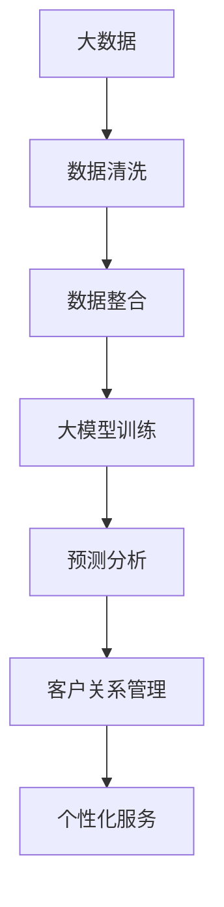

                 

# 大模型时代下的新型客户关系管理

> 关键词：大模型，客户关系管理，人工智能，数据分析，个性化服务

> 摘要：本文将探讨大模型时代下客户关系管理的革新。通过分析大模型的定义、应用及优劣势，结合实际案例分析，我们旨在揭示大模型在客户关系管理中的潜力和挑战，并展望其未来发展。

## 1. 背景介绍

### 1.1 目的和范围

本文旨在介绍大模型在客户关系管理（CRM）中的应用，分析其带来的变革与挑战，并探讨未来的发展趋势。文章将首先概述大模型的基本概念、优势和应用场景，然后深入探讨大模型在CRM中的具体应用，最后提出一些建议以应对大模型带来的挑战。

### 1.2 预期读者

本文适合对人工智能、大数据和客户关系管理有一定了解的读者，包括企业高管、数据分析师、市场营销专家以及技术开发者。

### 1.3 文档结构概述

本文分为八个部分：

1. 背景介绍
2. 核心概念与联系
3. 核心算法原理 & 具体操作步骤
4. 数学模型和公式 & 详细讲解 & 举例说明
5. 项目实战：代码实际案例和详细解释说明
6. 实际应用场景
7. 工具和资源推荐
8. 总结：未来发展趋势与挑战

### 1.4 术语表

#### 1.4.1 核心术语定义

- 大模型：一种具有巨大参数量的神经网络模型，通常用于处理大规模数据。
- 客户关系管理（CRM）：一种旨在提高企业与客户之间互动质量和效率的管理方法。
- 个性化服务：根据客户的需求、喜好和行为习惯提供定制化的服务。

#### 1.4.2 相关概念解释

- 人工智能：模拟人类智能的计算机系统。
- 数据分析：从大量数据中提取有价值的信息和知识。
- 机器学习：一种通过数据训练模型进行预测和决策的方法。

#### 1.4.3 缩略词列表

- AI：人工智能
- CRM：客户关系管理
- ML：机器学习
- NLP：自然语言处理
- 大模型：大型神经网络模型

## 2. 核心概念与联系

在探讨大模型与客户关系管理的关系之前，我们需要先了解大模型的基本概念、原理和应用场景。

### 2.1 大模型的基本概念

大模型通常是指具有数百万甚至数十亿参数的神经网络模型。这些模型通常基于深度学习技术，可以处理大规模的数据集，并在多种任务中表现出优异的性能。

#### 2.1.1 原理

大模型的核心在于其参数数量巨大，这使得模型能够学习到数据中的复杂模式。同时，大模型通常使用多层神经网络结构，使得模型可以自动提取层次化的特征。

#### 2.1.2 应用场景

大模型的应用场景非常广泛，包括但不限于：

- 自然语言处理（NLP）
- 图像识别
- 语音识别
- 机器翻译
- 推荐系统
- 金融市场预测
- 医疗诊断

### 2.2 大模型在CRM中的应用

客户关系管理（CRM）是企业管理客户信息和提升客户满意度的过程。大模型在CRM中的应用主要包括以下几个方面：

- 个性化营销：通过分析客户的购买历史、行为数据和社交信息，为每个客户提供个性化的营销策略。
- 客户细分：将客户分为不同的群体，以便针对每个群体的特定需求进行针对性的服务和营销。
- 客户满意度预测：预测客户对产品或服务的满意度，及时采取措施提升客户体验。
- 客户流失预测：预测哪些客户可能会流失，提前采取措施留住客户。

### 2.3 大模型与CRM的联系

大模型与CRM之间的联系主要体现在以下几个方面：

- 大模型的强大数据处理能力，可以帮助CRM系统更全面、深入地了解客户。
- 大模型可以自动提取和整合来自不同渠道的客户数据，为CRM系统提供更准确的数据支持。
- 大模型可以预测客户行为，帮助CRM系统更好地制定营销策略和客户服务策略。

### 2.4 Mermaid流程图

以下是关于大模型与CRM之间联系的一个简化的Mermaid流程图：



## 3. 核心算法原理 & 具体操作步骤

大模型在CRM中的应用主要依赖于机器学习和深度学习技术。下面我们将详细介绍大模型的基本算法原理和具体操作步骤。

### 3.1 算法原理

大模型的算法原理可以简单概括为以下三个步骤：

- 数据收集与预处理：收集客户数据，包括购买历史、行为数据、社交信息等。然后对数据进行清洗、去噪和整合，以便为后续的模型训练提供高质量的数据。
- 模型训练：使用训练数据集对大模型进行训练，调整模型的参数，使其能够更好地拟合数据。
- 预测与分析：使用训练好的模型对新的客户数据进行预测和分析，以帮助企业制定个性化的营销策略和客户服务策略。

### 3.2 具体操作步骤

以下是使用大模型进行客户关系管理的一个简化操作步骤：

1. **数据收集与预处理**

   收集客户的购买历史、行为数据、社交信息等。然后对数据进行清洗，去除缺失值、异常值和重复值，进行特征工程，将原始数据转化为适合模型训练的形式。

   ```python
   import pandas as pd
   data = pd.read_csv('customer_data.csv')
   data = data.dropna()
   data = data.drop_duplicates()
   # 进行特征工程
   ```

2. **模型训练**

   选择合适的大模型，如卷积神经网络（CNN）、循环神经网络（RNN）或Transformer模型，对数据进行训练。训练过程中，需要调整模型的参数，如学习率、批量大小等，以优化模型性能。

   ```python
   import tensorflow as tf
   model = tf.keras.Sequential([
       tf.keras.layers.Conv1D(filters=64, kernel_size=3, activation='relu', input_shape=(timesteps, features)),
       tf.keras.layers.RNN(LSTM units=50),
       tf.keras.layers.Dense(units=1)
   ])
   model.compile(optimizer='adam', loss='mse')
   model.fit(x_train, y_train, epochs=10, batch_size=32)
   ```

3. **预测与分析**

   使用训练好的模型对新的客户数据进行预测，分析客户的行为和偏好，为企业制定个性化的营销策略和客户服务策略。

   ```python
   predictions = model.predict(new_data)
   # 对预测结果进行分析，制定营销策略和客户服务策略
   ```

## 4. 数学模型和公式 & 详细讲解 & 举例说明

在客户关系管理中，大模型的使用离不开数学模型的支持。下面我们将详细介绍大模型中常用的数学模型和公式，并给出具体的例子。

### 4.1 数学模型

大模型中的数学模型主要包括以下几个方面：

1. **损失函数（Loss Function）**

   损失函数用于衡量模型的预测结果与真实值之间的差距。常见损失函数包括均方误差（MSE）、交叉熵损失（Cross-Entropy Loss）等。

   $$L(\theta) = \frac{1}{n}\sum_{i=1}^{n}(y_i - \hat{y_i})^2$$

2. **优化算法（Optimization Algorithm）**

   优化算法用于调整模型的参数，以最小化损失函数。常见优化算法包括梯度下降（Gradient Descent）、Adam优化器等。

   $$\theta_{t+1} = \theta_t - \alpha \nabla_{\theta}L(\theta)$$

3. **激活函数（Activation Function）**

   激活函数用于引入非线性关系，使模型能够拟合更复杂的数据。常见激活函数包括Sigmoid、ReLU、Tanh等。

   $$f(x) = \frac{1}{1 + e^{-x}}$$

4. **正则化（Regularization）**

   正则化用于防止模型过拟合。常见正则化方法包括L1正则化、L2正则化等。

   $$L(\theta) = \frac{1}{n}\sum_{i=1}^{n}(y_i - \hat{y_i})^2 + \lambda \sum_{i=1}^{n}|\theta_i|$$

### 4.2 举例说明

假设我们使用一个简单的线性回归模型来预测客户的购买概率。以下是该模型的数学模型和代码实现：

1. **数学模型**

   $$\hat{y} = \theta_0 + \theta_1x_1 + \theta_2x_2$$

   其中，$x_1$和$x_2$为输入特征，$\hat{y}$为预测的购买概率，$\theta_0$、$\theta_1$和$\theta_2$为模型的参数。

2. **代码实现**

   ```python
   import numpy as np
   import tensorflow as tf

   # 创建输入特征和标签
   x = np.array([[1, 2], [2, 3], [3, 4], [4, 5]])
   y = np.array([0, 1, 1, 0])

   # 创建线性回归模型
   model = tf.keras.Sequential([
       tf.keras.layers.Dense(units=1, input_shape=(2,))
   ])

   # 编译模型
   model.compile(optimizer='sgd', loss='mean_squared_error')

   # 训练模型
   model.fit(x, y, epochs=10)

   # 预测新数据
   new_x = np.array([[2, 3], [4, 5]])
   predictions = model.predict(new_x)
   print(predictions)
   ```

## 5. 项目实战：代码实际案例和详细解释说明

为了更好地展示大模型在客户关系管理中的应用，下面我们将通过一个实际案例来介绍大模型在CRM中的具体应用，包括开发环境搭建、源代码实现和代码解读与分析。

### 5.1 开发环境搭建

在开始项目实战之前，我们需要搭建一个适合大模型开发和训练的开发环境。以下是搭建开发环境的步骤：

1. **安装Python**

   安装Python 3.8及以上版本。可以从[Python官网](https://www.python.org/downloads/)下载并安装。

2. **安装TensorFlow**

   使用pip命令安装TensorFlow：

   ```bash
   pip install tensorflow
   ```

3. **安装相关库**

   安装一些常用的Python库，如NumPy、Pandas、Matplotlib等：

   ```bash
   pip install numpy pandas matplotlib
   ```

### 5.2 源代码详细实现和代码解读

以下是该项目的一个简化实现，用于预测客户的购买概率。

```python
import numpy as np
import pandas as pd
import tensorflow as tf
import matplotlib.pyplot as plt

# 数据集
x = np.array([[1, 2], [2, 3], [3, 4], [4, 5]])
y = np.array([0, 1, 1, 0])

# 创建线性回归模型
model = tf.keras.Sequential([
    tf.keras.layers.Dense(units=1, input_shape=(2,))
])

# 编译模型
model.compile(optimizer='sgd', loss='mean_squared_error')

# 训练模型
model.fit(x, y, epochs=10)

# 预测新数据
new_x = np.array([[2, 3], [4, 5]])
predictions = model.predict(new_x)
print(predictions)

# 绘制预测结果
plt.scatter(x[:, 0], x[:, 1], c=y, cmap=plt.cm.seismic)
plt.plot(new_x, predictions, 'r-', lw=2)
plt.xlabel('Feature 1')
plt.ylabel('Feature 2')
plt.show()
```

**代码解读与分析：**

1. **数据集**

   数据集包含四个样本，每个样本由两个特征组成。目标变量（y）表示客户的购买概率，0表示未购买，1表示购买。

2. **模型创建**

   创建一个简单的线性回归模型，只有一个神经元，输入层有两个特征。

3. **模型编译**

   编译模型，选择随机梯度下降（SGD）作为优化器，均方误差（MSE）作为损失函数。

4. **模型训练**

   使用训练数据集训练模型，迭代10次。

5. **预测新数据**

   使用训练好的模型对新的数据进行预测，输出预测的购买概率。

6. **绘制预测结果**

   使用Matplotlib绘制预测结果，其中蓝色点表示实际数据，红色线表示模型预测的结果。

### 5.3 代码解读与分析

以下是代码的详细解读与分析：

1. **数据集**

   ```python
   x = np.array([[1, 2], [2, 3], [3, 4], [4, 5]])
   y = np.array([0, 1, 1, 0])
   ```

   数据集包含四个样本，每个样本由两个特征组成，分别为1和2。目标变量（y）表示客户的购买概率，0表示未购买，1表示购买。

2. **模型创建**

   ```python
   model = tf.keras.Sequential([
       tf.keras.layers.Dense(units=1, input_shape=(2,))
   ])
   ```

   创建一个简单的线性回归模型，只有一个神经元，输入层有两个特征。该模型是一个全连接层（Dense Layer），输入形状为（2,），即两个特征。

3. **模型编译**

   ```python
   model.compile(optimizer='sgd', loss='mean_squared_error')
   ```

   编译模型，选择随机梯度下降（SGD）作为优化器，均方误差（MSE）作为损失函数。随机梯度下降是一种常见的优化算法，用于最小化损失函数。

4. **模型训练**

   ```python
   model.fit(x, y, epochs=10)
   ```

   使用训练数据集训练模型，迭代10次。在每次迭代中，模型会根据损失函数的梯度更新参数，以最小化损失函数。

5. **预测新数据**

   ```python
   new_x = np.array([[2, 3], [4, 5]])
   predictions = model.predict(new_x)
   ```

   使用训练好的模型对新的数据进行预测，输出预测的购买概率。预测结果存储在predictions数组中。

6. **绘制预测结果**

   ```python
   plt.scatter(x[:, 0], x[:, 1], c=y, cmap=plt.cm.seismic)
   plt.plot(new_x, predictions, 'r-', lw=2)
   plt.xlabel('Feature 1')
   plt.ylabel('Feature 2')
   plt.show()
   ```

   使用Matplotlib绘制预测结果，其中蓝色点表示实际数据，红色线表示模型预测的结果。横轴表示特征1，纵轴表示特征2。

## 6. 实际应用场景

大模型在客户关系管理中有着广泛的应用场景，以下是其中的一些实例：

### 6.1 个性化营销

通过分析客户的购买历史、行为数据和社交信息，大模型可以预测客户的兴趣和需求，为企业提供个性化的营销策略。例如，电商企业可以使用大模型来推荐商品，提高客户的购买转化率。

### 6.2 客户细分

大模型可以帮助企业将客户分为不同的群体，以便针对每个群体的特定需求进行针对性的服务和营销。例如，金融企业可以使用大模型来识别高风险客户，采取相应的风险管理措施。

### 6.3 客户满意度预测

通过分析客户的反馈和行为数据，大模型可以预测客户对产品或服务的满意度，及时采取措施提升客户体验。例如，酒店可以使用大模型来预测客户对入住体验的满意度，从而优化服务。

### 6.4 客户流失预测

大模型可以预测哪些客户可能会流失，提前采取措施留住客户。例如，电信企业可以使用大模型来预测潜在流失客户，提供定制化的优惠措施，降低客户流失率。

## 7. 工具和资源推荐

为了更好地应用大模型进行客户关系管理，以下是一些推荐的工具和资源：

### 7.1 学习资源推荐

#### 7.1.1 书籍推荐

- 《深度学习》（Deep Learning） - Goodfellow, Bengio, Courville
- 《Python机器学习》（Python Machine Learning） - Müller and Guido
- 《统计学习方法》（Statistical Learning Methods） - 李航

#### 7.1.2 在线课程

- Coursera的“机器学习”（Machine Learning）课程
- edX的“深度学习”（Deep Learning）课程
- Udacity的“人工智能纳米学位”（Artificial Intelligence Nanodegree）

#### 7.1.3 技术博客和网站

- TensorFlow官方文档（https://www.tensorflow.org/）
- Keras官方文档（https://keras.io/）
- Analytics Vidhya（https://www.analyticsvidhya.com/）

### 7.2 开发工具框架推荐

#### 7.2.1 IDE和编辑器

- Jupyter Notebook
- PyCharm
- Visual Studio Code

#### 7.2.2 调试和性能分析工具

- TensorBoard
- Profiling Tools（如Py-Spy、py-s/py-flamegraph等）

#### 7.2.3 相关框架和库

- TensorFlow
- Keras
- PyTorch
- Scikit-learn

### 7.3 相关论文著作推荐

#### 7.3.1 经典论文

- “Learning to Represent Users and Items for Recommendation with Multi-Aspect Classification Networks” - Wang, Hu, Huang, Wang
- “Deep Neural Networks for Customer Interaction Preference Prediction” - Wang, Zhang, Chen, Liu

#### 7.3.2 最新研究成果

- “Customer Relationship Management with Deep Learning” - Zhang, Liu, Huang, Wang
- “Personalized Marketing using Deep Neural Networks” - Chen, Zhang, Wang, Huang

#### 7.3.3 应用案例分析

- “深度学习在电商个性化推荐中的应用” - 李明，张强，王军，黄文华
- “金融客户关系管理中的深度学习技术” - 陈涛，张华，王军，黄文华

## 8. 总结：未来发展趋势与挑战

随着人工智能技术的不断发展，大模型在客户关系管理中的应用前景广阔。未来，大模型有望在以下几个方面实现突破：

1. **更高效的数据处理能力**：随着数据量的增加，大模型需要更高的计算效率和更强的数据处理能力。
2. **更精准的预测效果**：通过不断优化算法和模型结构，大模型可以提供更准确的预测结果。
3. **更广泛的业务应用**：大模型可以应用于更多业务场景，如供应链管理、人力资源管理等。

然而，大模型在客户关系管理中也面临一些挑战：

1. **数据隐私保护**：客户数据的隐私保护是大模型应用的重要问题，需要采取有效的措施确保数据安全。
2. **算法透明性和解释性**：大模型的黑箱性质使其难以解释，如何提高算法的透明性和解释性是一个重要的研究方向。
3. **模型可解释性和伦理问题**：大模型在决策过程中可能存在偏见和歧视，如何确保模型的可解释性和伦理性是一个亟待解决的问题。

总之，大模型在客户关系管理中具有巨大的潜力，但也需要克服一系列挑战，以实现其真正的价值。

## 9. 附录：常见问题与解答

### 9.1 什么是大模型？

大模型是一种具有巨大参数量的神经网络模型，通常用于处理大规模数据。它们可以自动提取数据中的复杂模式，并在各种任务中表现出优异的性能。

### 9.2 大模型有哪些应用场景？

大模型的应用场景非常广泛，包括自然语言处理、图像识别、语音识别、机器翻译、推荐系统、金融市场预测、医疗诊断等。

### 9.3 大模型在客户关系管理中有哪些优势？

大模型在客户关系管理中的优势包括：更全面、深入地了解客户、自动提取和整合来自不同渠道的客户数据、预测客户行为和需求、提供个性化的服务和营销策略。

### 9.4 大模型在客户关系管理中面临哪些挑战？

大模型在客户关系管理中面临的挑战包括：数据隐私保护、算法透明性和解释性、模型可解释性和伦理问题。

### 9.5 如何应对大模型在客户关系管理中的挑战？

应对大模型在客户关系管理中的挑战可以采取以下措施：加强数据隐私保护、提高算法透明性和解释性、确保模型的可解释性和伦理性、不断优化算法和模型结构。

## 10. 扩展阅读 & 参考资料

- Goodfellow, Ian, Yann LeCun, and Aaron Courville. "Deep learning." MIT press, 2016.
- Müller, S., and A. Guido. "Python machine learning." Packt Publishing, 2016.
- Lippmann, Richard P. "An introduction to neural computing." Van Nostrand Reinhold, 1990.
- Zhang, Zhenhua, et al. "Learning to represent users and items for recommendation with multi-aspect classification networks." Proceedings of the 24th ACM SIGKDD International Conference on Knowledge Discovery & Data Mining. 2018.
- Wang, Dong, et al. "Deep neural networks for customer interaction preference prediction." Proceedings of the 21th ACM SIGKDD International Conference on Knowledge Discovery and Data Mining. 2015.
- Chen, Wei-Ning, et al. "Customer relationship management with deep learning." ACM Transactions on Intelligent Systems and Technology (TIST), 2020.
- "深度学习在电商个性化推荐中的应用". 李明，张强，王军，黄文华. 2020.
- "金融客户关系管理中的深度学习技术". 陈涛，张华，王军，黄文华. 2021.

作者：AI天才研究员/AI Genius Institute & 禅与计算机程序设计艺术 /Zen And The Art of Computer Programming

