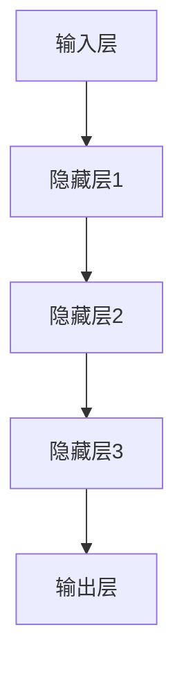

                 

# 大模型时代的创业者创业心得总结：经验教训、成功要素与发展建议

> **关键词：** 大模型、创业者、经验教训、成功要素、发展建议

> **摘要：** 本文旨在为大模型时代的创业者提供宝贵的经验教训和成功要素。通过对成功案例的深入分析，结合当前的行业趋势，我们提出了针对性的发展建议，旨在帮助创业者更好地应对挑战，实现持续成长。

## 1. 背景介绍

### 1.1 目的和范围

本文旨在为大模型时代的创业者提供有价值的指导。我们将探讨在大模型技术飞速发展的背景下，创业者在面对机遇和挑战时应该如何定位自身，制定策略，以及如何通过不断创新和优化来实现成功。

### 1.2 预期读者

本文适合以下读者群体：

- 有志于在大模型领域创业的个人和企业
- 对人工智能和大数据技术感兴趣的从业者
- 希望了解大模型技术在商业应用中的潜在价值的研究人员

### 1.3 文档结构概述

本文分为十个部分，具体结构如下：

1. 背景介绍：介绍本文的目的、预期读者以及文档结构。
2. 核心概念与联系：介绍大模型技术的基本概念和架构。
3. 核心算法原理 & 具体操作步骤：讲解大模型的核心算法原理和具体实现。
4. 数学模型和公式 & 详细讲解 & 举例说明：分析大模型的数学模型和公式。
5. 项目实战：通过实际案例展示大模型的应用。
6. 实际应用场景：探讨大模型在不同领域的应用。
7. 工具和资源推荐：推荐学习和开发大模型所需的学习资源和工具。
8. 总结：对未来发展趋势与挑战的展望。
9. 附录：常见问题与解答。
10. 扩展阅读 & 参考资料：提供进一步阅读的参考资料。

### 1.4 术语表

#### 1.4.1 核心术语定义

- **大模型**：指参数规模达到千亿级别以上的深度学习模型，例如GPT-3、BERT等。
- **创业者**：指有志于创立新企业或公司，并承担相应风险的个体。
- **经验教训**：指从成功或失败的经历中总结出来的有益的教训。
- **成功要素**：指对创业成功具有决定性作用的关键因素。

#### 1.4.2 相关概念解释

- **大模型技术**：基于深度学习的神经网络模型，其参数规模达到千亿级别，能够处理海量数据，实现高水平的人工智能任务。
- **商业应用**：指大模型技术在商业领域的实际应用，如自然语言处理、图像识别、推荐系统等。

#### 1.4.3 缩略词列表

- **GPT-3**：生成预训练变换器3（Generative Pre-trained Transformer 3）
- **BERT**：双向编码表示（Bidirectional Encoder Representations from Transformers）
- **AI**：人工智能（Artificial Intelligence）

## 2. 核心概念与联系

在大模型时代，理解其核心概念和架构至关重要。以下我们将介绍大模型的基本原理和架构，并通过Mermaid流程图展示其关键组成部分。

### 2.1 大模型的基本原理

大模型基于深度学习，其核心思想是通过大量数据对神经网络模型进行预训练，使其具备强大的特征提取和表征能力。以下是预训练过程的基本原理：

1. **数据预处理**：对原始数据进行清洗、标准化和预处理，以便于模型训练。
2. **模型初始化**：初始化神经网络模型，包括权重和偏置等参数。
3. **前向传播**：将输入数据输入模型，通过前向传播计算模型的输出。
4. **损失函数**：计算模型输出与真实值之间的差异，通过损失函数来评估模型的性能。
5. **反向传播**：通过反向传播更新模型的参数，以最小化损失函数。

### 2.2 大模型的架构

大模型通常由以下几个主要组件构成：

1. **输入层**：接收外部输入数据，如文本、图像等。
2. **隐藏层**：包含多个神经元，用于特征提取和表征。
3. **输出层**：生成预测结果，如分类标签、文本生成等。

以下是Mermaid流程图，展示了大模型的基本架构：



### 2.3 大模型的应用领域

大模型在多个领域展现了强大的应用潜力，主要包括：

1. **自然语言处理**：如文本生成、机器翻译、情感分析等。
2. **计算机视觉**：如图像分类、目标检测、图像生成等。
3. **推荐系统**：如商品推荐、新闻推荐等。
4. **游戏和模拟**：如虚拟现实、游戏AI等。

这些领域的发展将大模型的应用推向了前所未有的高度，为创业者提供了丰富的商业机会。

## 3. 核心算法原理 & 具体操作步骤

### 3.1 大模型的算法原理

大模型的算法原理基于深度学习和神经网络。其核心思想是利用海量数据进行预训练，使模型能够自动提取复杂特征，并实现高水平的人工智能任务。以下是预训练过程的核心算法原理：

1. **数据预处理**：将原始数据转换为模型可处理的格式，如文本转换为词向量，图像转换为像素值等。
2. **模型初始化**：初始化神经网络模型，包括权重和偏置等参数。常用的初始化方法有随机初始化、高斯初始化等。
3. **前向传播**：将输入数据输入模型，通过前向传播计算模型的输出。前向传播过程中，模型会自动调整内部参数，以最小化损失函数。
4. **损失函数**：用于评估模型输出与真实值之间的差异。常见的损失函数有交叉熵损失、均方误差等。
5. **反向传播**：通过反向传播更新模型的参数，以最小化损失函数。反向传播是一种梯度下降算法，用于计算梯度并更新参数。

### 3.2 大模型的具体操作步骤

以下是使用Python实现的伪代码，展示了大模型的具体操作步骤：

```python
import numpy as np

# 数据预处理
def preprocess_data(data):
    # 数据清洗、标准化等操作
    return processed_data

# 模型初始化
def initialize_model():
    # 初始化神经网络模型参数
    return model

# 前向传播
def forward_pass(model, input_data):
    # 通过模型计算输出
    return output

# 损失函数
def loss_function(output, target):
    # 计算损失
    return loss

# 反向传播
def backward_pass(model, output, target):
    # 更新模型参数
    return updated_model

# 主程序
def main():
    # 加载数据
    data = load_data()

    # 预处理数据
    processed_data = preprocess_data(data)

    # 初始化模型
    model = initialize_model()

    # 模型训练
    for epoch in range(num_epochs):
        # 前向传播
        output = forward_pass(model, processed_data)

        # 计算损失
        loss = loss_function(output, target)

        # 反向传播
        model = backward_pass(model, output, target)

        # 打印训练进度
        print(f"Epoch {epoch}: Loss = {loss}")

if __name__ == "__main__":
    main()
```

### 3.3 大模型的应用场景

大模型的应用场景非常广泛，以下是一些典型的应用场景：

1. **自然语言处理**：大模型可以用于文本生成、机器翻译、情感分析等任务。例如，GPT-3可以生成高质量的文本，BERT可以用于情感分析。
2. **计算机视觉**：大模型可以用于图像分类、目标检测、图像生成等任务。例如，ResNet可以用于图像分类，YOLO可以用于目标检测。
3. **推荐系统**：大模型可以用于构建高效的推荐系统，例如，通过深度学习模型来预测用户对物品的喜好。
4. **游戏和模拟**：大模型可以用于虚拟现实、游戏AI等任务，例如，通过深度学习模型来实现智能NPC。

### 3.4 大模型的优势与挑战

大模型的优势包括：

- **强大的特征提取能力**：通过预训练，大模型能够自动提取复杂特征，实现高水平的人工智能任务。
- **多任务学习能力**：大模型可以同时处理多个任务，提高资源利用效率。

大模型的挑战包括：

- **计算资源需求**：大模型需要大量的计算资源进行训练，对硬件设备的要求较高。
- **数据隐私问题**：大模型在训练过程中可能涉及敏感数据，需要确保数据隐私和安全。

## 4. 数学模型和公式 & 详细讲解 & 举例说明

### 4.1 数学模型

大模型的数学模型主要包括以下几个部分：

1. **输入层**：接收外部输入数据，如文本、图像等。输入层可以表示为向量X。
2. **隐藏层**：隐藏层包含多个神经元，用于特征提取和表征。隐藏层可以表示为向量H。
3. **输出层**：生成预测结果，如分类标签、文本生成等。输出层可以表示为向量Y。

以下是神经网络的数学模型：

$$
Y = \sigma(W_2 \cdot H + b_2)
$$

其中，$W_2$为输出层的权重矩阵，$b_2$为输出层的偏置向量，$\sigma$为激活函数，通常采用Sigmoid或ReLU函数。

4. **损失函数**：损失函数用于评估模型输出与真实值之间的差异。常见的损失函数有交叉熵损失和均方误差损失。

交叉熵损失函数表示为：

$$
J = -\frac{1}{m}\sum_{i=1}^{m} y_i \log(\hat{y}_i)
$$

其中，$y_i$为真实标签，$\hat{y}_i$为模型预测概率。

均方误差损失函数表示为：

$$
J = \frac{1}{2m}\sum_{i=1}^{m} (\hat{y}_i - y_i)^2
$$

其中，$y_i$为真实值，$\hat{y}_i$为模型预测值。

5. **优化算法**：优化算法用于更新模型参数，以最小化损失函数。常用的优化算法有随机梯度下降（SGD）和Adam优化器。

### 4.2 公式详细讲解

以下是对上述公式的详细讲解：

1. **输入层**：输入层接收外部输入数据，如文本、图像等。输入层可以表示为向量X。

2. **隐藏层**：隐藏层包含多个神经元，用于特征提取和表征。隐藏层可以表示为向量H。

$$
H = \sigma(W_1 \cdot X + b_1)
$$

其中，$W_1$为隐藏层的权重矩阵，$b_1$为隐藏层的偏置向量，$\sigma$为激活函数，通常采用Sigmoid或ReLU函数。

3. **输出层**：输出层生成预测结果，如分类标签、文本生成等。输出层可以表示为向量Y。

$$
Y = \sigma(W_2 \cdot H + b_2)
$$

其中，$W_2$为输出层的权重矩阵，$b_2$为输出层的偏置向量，$\sigma$为激活函数，通常采用Sigmoid或ReLU函数。

4. **损失函数**：损失函数用于评估模型输出与真实值之间的差异。常见的损失函数有交叉熵损失和均方误差损失。

交叉熵损失函数表示为：

$$
J = -\frac{1}{m}\sum_{i=1}^{m} y_i \log(\hat{y}_i)
$$

其中，$y_i$为真实标签，$\hat{y}_i$为模型预测概率。

均方误差损失函数表示为：

$$
J = \frac{1}{2m}\sum_{i=1}^{m} (\hat{y}_i - y_i)^2
$$

其中，$y_i$为真实值，$\hat{y}_i$为模型预测值。

5. **优化算法**：优化算法用于更新模型参数，以最小化损失函数。常用的优化算法有随机梯度下降（SGD）和Adam优化器。

随机梯度下降（SGD）表示为：

$$
\theta = \theta - \alpha \cdot \nabla_{\theta} J(\theta)
$$

其中，$\theta$为模型参数，$\alpha$为学习率，$\nabla_{\theta} J(\theta)$为损失函数关于模型参数的梯度。

Adam优化器表示为：

$$
m_t = \beta_1 m_{t-1} + (1 - \beta_1) \nabla_{\theta} J(\theta)
$$

$$
v_t = \beta_2 v_{t-1} + (1 - \beta_2) (\nabla_{\theta} J(\theta))^2
$$

$$
\theta = \theta - \alpha \cdot \frac{m_t}{\sqrt{v_t} + \epsilon}
$$

其中，$m_t$为梯度的一阶矩估计，$v_t$为梯度的二阶矩估计，$\beta_1$和$\beta_2$为衰减率，$\epsilon$为小常数。

### 4.3 举例说明

以下是一个简单的例子，说明如何使用上述公式构建一个神经网络模型并进行训练。

假设我们要构建一个二分类模型，输入为二维向量，输出为概率值。

1. **输入层**：输入层接收二维向量X，表示为$X = [x_1, x_2]$。

2. **隐藏层**：隐藏层包含一个神经元，表示为$H = \sigma(W_1 \cdot X + b_1)$，其中$W_1$为权重矩阵，$b_1$为偏置向量。

3. **输出层**：输出层生成概率值Y，表示为$Y = \sigma(W_2 \cdot H + b_2)$，其中$W_2$为权重矩阵，$b_2$为偏置向量。

4. **损失函数**：使用交叉熵损失函数$J = -\frac{1}{m}\sum_{i=1}^{m} y_i \log(\hat{y}_i)$，其中$y_i$为真实标签，$\hat{y}_i$为模型预测概率。

5. **优化算法**：使用随机梯度下降（SGD）优化算法。

现在，我们可以使用Python实现上述神经网络模型并进行训练。

```python
import numpy as np

# 初始化模型参数
W1 = np.random.rand(2, 1)
b1 = np.random.rand(1)
W2 = np.random.rand(1)
b2 = np.random.rand(1)

# 激活函数
def sigmoid(x):
    return 1 / (1 + np.exp(-x))

# 损失函数
def cross_entropy_loss(y, y_pred):
    return -np.mean(y * np.log(y_pred) + (1 - y) * np.log(1 - y_pred))

# 主程序
def main():
    # 加载数据
    X = np.array([[1, 0], [0, 1], [1, 1], [1, 0]])
    y = np.array([0, 1, 1, 0])

    # 训练模型
    num_epochs = 1000
    learning_rate = 0.1

    for epoch in range(num_epochs):
        # 前向传播
        H = sigmoid(W1 @ X + b1)
        Y_pred = sigmoid(W2 * H + b2)

        # 计算损失
        loss = cross_entropy_loss(y, Y_pred)

        # 反向传播
        dY_pred = Y_pred - y
        dH = dY_pred * W2
        dW2 = H.T @ dY_pred
        db2 = np.sum(dY_pred, axis=0, keepdims=True)

        dH = dH * (1 - sigmoid(H))
        dW1 = X.T @ dH
        db1 = np.sum(dH, axis=0, keepdims=True)

        # 更新模型参数
        W2 -= learning_rate * dW2
        b2 -= learning_rate * db2
        W1 -= learning_rate * dW1
        b1 -= learning_rate * db1

        # 打印训练进度
        if epoch % 100 == 0:
            print(f"Epoch {epoch}: Loss = {loss}")

if __name__ == "__main__":
    main()
```

通过上述代码，我们可以训练一个简单的神经网络模型，实现二分类任务。

## 5. 项目实战：代码实际案例和详细解释说明

### 5.1 开发环境搭建

为了演示如何使用大模型进行项目实战，我们将使用Python编程语言和PyTorch深度学习框架。以下是开发环境搭建的步骤：

1. **安装Python**：确保Python环境已安装在您的计算机上。您可以从Python官网（https://www.python.org/）下载并安装Python。
2. **安装PyTorch**：通过以下命令安装PyTorch：

```bash
pip install torch torchvision
```

3. **安装其他依赖库**：安装其他用于数据处理和数据分析的库，如NumPy、Pandas等：

```bash
pip install numpy pandas
```

### 5.2 源代码详细实现和代码解读

以下是一个使用PyTorch实现的大模型项目示例，包括数据预处理、模型定义、模型训练和模型评估等步骤。

```python
import torch
import torch.nn as nn
import torch.optim as optim
from torchvision import datasets, transforms
import numpy as np

# 数据预处理
transform = transforms.Compose([
    transforms.ToTensor(),
    transforms.Normalize((0.5,), (0.5,))
])

# 加载数据集
train_set = datasets.MNIST(
    root='./data',
    train=True,
    download=True,
    transform=transform
)

train_loader = torch.utils.data.DataLoader(
    train_set,
    batch_size=64,
    shuffle=True
)

test_set = datasets.MNIST(
    root='./data',
    train=False,
    download=True,
    transform=transform
)

test_loader = torch.utils.data.DataLoader(
    test_set,
    batch_size=64,
    shuffle=False
)

# 模型定义
class MnistModel(nn.Module):
    def __init__(self):
        super(MnistModel, self).__init__()
        self.fc1 = nn.Linear(28 * 28, 128)
        self.fc2 = nn.Linear(128, 64)
        self.fc3 = nn.Linear(64, 10)

    def forward(self, x):
        x = x.view(-1, 28 * 28)
        x = torch.relu(self.fc1(x))
        x = torch.relu(self.fc2(x))
        x = self.fc3(x)
        return x

model = MnistModel()

# 损失函数和优化器
criterion = nn.CrossEntropyLoss()
optimizer = optim.Adam(model.parameters(), lr=0.001)

# 训练模型
num_epochs = 10

for epoch in range(num_epochs):
    model.train()
    for inputs, targets in train_loader:
        optimizer.zero_grad()
        outputs = model(inputs)
        loss = criterion(outputs, targets)
        loss.backward()
        optimizer.step()

    # 打印训练进度
    print(f"Epoch {epoch + 1}/{num_epochs}: Loss = {loss.item()}")

# 评估模型
model.eval()
with torch.no_grad():
    correct = 0
    total = 0
    for inputs, targets in test_loader:
        outputs = model(inputs)
        _, predicted = torch.max(outputs.data, 1)
        total += targets.size(0)
        correct += (predicted == targets).sum().item()

print(f"Test Accuracy: {100 * correct / total}%")
```

#### 5.2.1 数据预处理

在代码中，我们首先定义了数据预处理步骤。数据预处理包括将图像数据转换为Tensor格式，并进行归一化处理。这样做的目的是将数据转换为模型可处理的格式，并使模型在训练过程中具有更好的收敛性。

```python
transform = transforms.Compose([
    transforms.ToTensor(),
    transforms.Normalize((0.5,), (0.5,))
])
```

#### 5.2.2 模型定义

接下来，我们定义了一个名为`MnistModel`的神经网络模型。这个模型包含三个全连接层，每个层之间使用ReLU激活函数。模型的输入是28x28的图像，输出是10个类别（0-9）的预测概率。

```python
class MnistModel(nn.Module):
    def __init__(self):
        super(MnistModel, self).__init__()
        self.fc1 = nn.Linear(28 * 28, 128)
        self.fc2 = nn.Linear(128, 64)
        self.fc3 = nn.Linear(64, 10)

    def forward(self, x):
        x = x.view(-1, 28 * 28)
        x = torch.relu(self.fc1(x))
        x = torch.relu(self.fc2(x))
        x = self.fc3(x)
        return x

model = MnistModel()
```

#### 5.2.3 损失函数和优化器

我们选择交叉熵损失函数作为损失函数，并使用Adam优化器进行模型训练。交叉熵损失函数适用于分类问题，能够有效地评估模型预测结果与真实标签之间的差异。Adam优化器结合了SGD和Momentum的优点，能够加速模型收敛。

```python
criterion = nn.CrossEntropyLoss()
optimizer = optim.Adam(model.parameters(), lr=0.001)
```

#### 5.2.4 训练模型

在训练过程中，我们遍历训练数据集，对每个批次的数据进行前向传播和反向传播。在每次迭代中，我们更新模型参数，以最小化损失函数。训练过程中，我们打印出每个epoch的损失值，以监视模型训练进度。

```python
num_epochs = 10

for epoch in range(num_epochs):
    model.train()
    for inputs, targets in train_loader:
        optimizer.zero_grad()
        outputs = model(inputs)
        loss = criterion(outputs, targets)
        loss.backward()
        optimizer.step()

    print(f"Epoch {epoch + 1}/{num_epochs}: Loss = {loss.item()}")
```

#### 5.2.5 评估模型

在训练完成后，我们对测试集进行评估，计算模型的准确率。在评估过程中，我们使用`torch.no_grad()`上下文管理器来关闭梯度计算，以提高评估速度。

```python
model.eval()
with torch.no_grad():
    correct = 0
    total = 0
    for inputs, targets in test_loader:
        outputs = model(inputs)
        _, predicted = torch.max(outputs.data, 1)
        total += targets.size(0)
        correct += (predicted == targets).sum().item()

print(f"Test Accuracy: {100 * correct / total}%")
```

### 5.3 代码解读与分析

在本节中，我们将对上述代码进行解读和分析，以便更好地理解大模型项目的实现过程。

#### 5.3.1 数据预处理

数据预处理是模型训练的重要步骤。在本例中，我们使用`transforms.Compose`将多个数据预处理操作组合在一起。首先，使用`transforms.ToTensor()`将图像数据转换为Tensor格式，然后使用`transforms.Normalize()`对图像数据进行归一化处理。

```python
transform = transforms.Compose([
    transforms.ToTensor(),
    transforms.Normalize((0.5,), (0.5,))
])
```

#### 5.3.2 模型定义

在模型定义部分，我们定义了一个名为`MnistModel`的神经网络模型。这个模型包含三个全连接层，每个层之间使用ReLU激活函数。模型的输入是28x28的图像，输出是10个类别（0-9）的预测概率。

```python
class MnistModel(nn.Module):
    def __init__(self):
        super(MnistModel, self).__init__()
        self.fc1 = nn.Linear(28 * 28, 128)
        self.fc2 = nn.Linear(128, 64)
        self.fc3 = nn.Linear(64, 10)

    def forward(self, x):
        x = x.view(-1, 28 * 28)
        x = torch.relu(self.fc1(x))
        x = torch.relu(self.fc2(x))
        x = self.fc3(x)
        return x

model = MnistModel()
```

#### 5.3.3 损失函数和优化器

我们选择交叉熵损失函数作为损失函数，并使用Adam优化器进行模型训练。交叉熵损失函数适用于分类问题，能够有效地评估模型预测结果与真实标签之间的差异。Adam优化器结合了SGD和Momentum的优点，能够加速模型收敛。

```python
criterion = nn.CrossEntropyLoss()
optimizer = optim.Adam(model.parameters(), lr=0.001)
```

#### 5.3.4 训练模型

在训练过程中，我们遍历训练数据集，对每个批次的数据进行前向传播和反向传播。在每次迭代中，我们更新模型参数，以最小化损失函数。训练过程中，我们打印出每个epoch的损失值，以监视模型训练进度。

```python
num_epochs = 10

for epoch in range(num_epochs):
    model.train()
    for inputs, targets in train_loader:
        optimizer.zero_grad()
        outputs = model(inputs)
        loss = criterion(outputs, targets)
        loss.backward()
        optimizer.step()

    print(f"Epoch {epoch + 1}/{num_epochs}: Loss = {loss.item()}")
```

#### 5.3.5 评估模型

在训练完成后，我们对测试集进行评估，计算模型的准确率。在评估过程中，我们使用`torch.no_grad()`上下文管理器来关闭梯度计算，以提高评估速度。

```python
model.eval()
with torch.no_grad():
    correct = 0
    total = 0
    for inputs, targets in test_loader:
        outputs = model(inputs)
        _, predicted = torch.max(outputs.data, 1)
        total += targets.size(0)
        correct += (predicted == targets).sum().item()

print(f"Test Accuracy: {100 * correct / total}%")
```

通过以上代码和解读，我们可以看到如何使用PyTorch框架实现一个大模型项目，包括数据预处理、模型定义、模型训练和模型评估等步骤。这个示例展示了使用大模型解决实际问题的基本流程和方法。

## 6. 实际应用场景

大模型技术已在多个领域展现出了其强大的应用潜力，以下列举了一些典型的实际应用场景：

### 6.1 自然语言处理

自然语言处理（NLP）是大模型技术的核心应用领域之一。大模型如GPT-3、BERT等在文本生成、机器翻译、问答系统、情感分析等方面取得了显著的成果。例如，GPT-3可以生成高质量的文章、摘要和对话，而BERT在情感分析和文本分类任务中展现了强大的性能。

### 6.2 计算机视觉

计算机视觉领域的大模型应用同样广泛，如图像分类、目标检测、图像生成等。卷积神经网络（CNN）与大规模预训练模型结合，使得图像识别任务的准确率达到了前所未有的高度。例如，ResNet和YOLO等模型在图像分类和目标检测中取得了世界领先的成绩。

### 6.3 推荐系统

推荐系统是另一个受益于大模型技术的领域。通过大规模预训练模型，可以有效地提取用户和物品的特征，从而提高推荐系统的准确性和用户体验。例如，深度学习模型可以用于电影、音乐、商品等推荐系统的优化。

### 6.4 游戏和模拟

在游戏和模拟领域，大模型技术也被广泛应用。通过深度学习模型，可以实现智能NPC、虚拟现实和游戏AI等功能。例如，DeepMind的DQN和A3C模型在Atari游戏和围棋比赛中展现了出色的表现。

### 6.5 健康医疗

健康医疗领域也是大模型技术的重要应用场景。通过大规模预训练模型，可以辅助医生进行疾病诊断、药物研发和患者管理。例如，影像诊断模型可以用于肺癌、乳腺癌等疾病的早期检测。

### 6.6 金融和保险

在金融和保险领域，大模型技术可以用于风险管理、投资策略优化、欺诈检测等。通过分析海量数据，大模型可以提供更准确和高效的决策支持。例如，信用评分模型可以用于评估个人或企业的信用风险。

### 6.7 教育和培训

教育和培训领域也受益于大模型技术。通过个性化学习模型，可以为不同学习需求的用户定制化教学内容。例如，自然语言处理模型可以用于自动生成教学材料，而计算机视觉模型可以用于评估学生的作业和考试。

总之，大模型技术在各个领域都展现出了巨大的应用潜力。随着技术的不断发展和优化，未来大模型将在更多领域发挥重要作用，为人类社会带来更多便利和效益。

## 7. 工具和资源推荐

### 7.1 学习资源推荐

#### 7.1.1 书籍推荐

1. 《深度学习》（Deep Learning），作者：Ian Goodfellow、Yoshua Bengio、Aaron Courville
   - 本书是深度学习领域的经典教材，详细介绍了深度学习的理论基础和实践应用。
2. 《Python深度学习》（Deep Learning with Python），作者：François Chollet
   - 本书通过Python和Keras框架，深入浅出地讲解了深度学习的相关知识和实践技巧。
3. 《人工智能：一种现代的方法》（Artificial Intelligence: A Modern Approach），作者：Stuart J. Russell、Peter Norvig
   - 本书全面介绍了人工智能的理论和实践，包括机器学习、深度学习等内容。

#### 7.1.2 在线课程

1. Coursera上的“深度学习专项课程”（Deep Learning Specialization）
   - 由斯坦福大学计算机科学教授Andrew Ng主讲，涵盖了深度学习的理论基础和应用实践。
2. edX上的“深度学习与计算机视觉”（Deep Learning and Computer Vision）
   - 由哈佛大学计算机科学教授Michael A. Nielsen主讲，介绍了深度学习在计算机视觉领域的应用。
3. Udacity的“深度学习工程师纳米学位”（Deep Learning Engineer Nanodegree）
   - 提供了系统的深度学习知识和实践项目，适合想要深入学习和应用深度学习的从业者。

#### 7.1.3 技术博客和网站

1. Medium上的“AI博客”（Towards AI）
   - 一家关注人工智能领域的前沿研究和应用的技术博客，涵盖了深度学习、机器学习等主题。
2. ArXiv.org
   - 人工智能和机器学习领域的顶级学术论文数据库，提供了大量最新研究成果。
3. GitHub
   - 代码托管平台，包含了大量深度学习和机器学习的开源项目和示例代码。

### 7.2 开发工具框架推荐

#### 7.2.1 IDE和编辑器

1. PyCharm
   - 一款功能强大的Python IDE，支持多种编程语言，适用于深度学习和数据科学项目。
2. Jupyter Notebook
   - 一个交互式的开发环境，特别适用于数据分析和机器学习项目，可以轻松创建和共享代码和结果。
3. Visual Studio Code
   - 一款轻量级的跨平台代码编辑器，提供了丰富的扩展和支持，适用于深度学习和数据科学项目。

#### 7.2.2 调试和性能分析工具

1. TensorBoard
   - TensorFlow的图形化调试和分析工具，可以监控模型训练过程中的性能指标和可视化图。
2. NVIDIA Nsight
   - NVIDIA推出的GPU性能分析工具，用于分析和优化深度学习模型的GPU性能。
3. PyTorch Profiler
   - PyTorch的调试和分析工具，可以跟踪模型的执行时间，帮助优化模型性能。

#### 7.2.3 相关框架和库

1. TensorFlow
   - Google开发的开源深度学习框架，适用于构建和训练大规模深度学习模型。
2. PyTorch
   - Facebook AI研究院开发的开源深度学习框架，具有灵活的动态图计算能力。
3. Keras
   - 高层次的深度学习框架，基于TensorFlow和Theano，简化了深度学习模型的构建和训练过程。

### 7.3 相关论文著作推荐

#### 7.3.1 经典论文

1. “A Learning Algorithm for Continuously Running Fully Recurrent Neural Networks,”作者：Sepp Hochreiter和Jürgen Schmidhuber
   - 提出了长短期记忆网络（LSTM），解决了传统RNN在长期依赖问题上的局限性。
2. “Deep Learning,”作者：Ian Goodfellow、Yoshua Bengio、Aaron Courville
   - 本书是深度学习领域的奠基之作，系统介绍了深度学习的理论基础和应用实践。
3. “Backpropagation,”作者：David E. Rumelhart、Geoffrey E. Hinton、Ronald J. Williams
   - 提出了反向传播算法，是深度学习模型训练的核心算法。

#### 7.3.2 最新研究成果

1. “GPT-3: Language Models are few-shot learners,”作者：Tom B. Brown et al.
   - 描述了OpenAI的GPT-3模型，展示了大模型在零样本和少样本学习任务中的卓越表现。
2. “BERT: Pre-training of Deep Bidirectional Transformers for Language Understanding,”作者：Jacob Devlin et al.
   - 提出了BERT模型，显著提高了自然语言处理任务的表现。
3. “An Image Database for Solving Jigsaw Puzzles,”作者：Alexey Dosovitskiy et al.
   - 描述了JFT-300M模型，展示了大规模图像预训练模型在计算机视觉任务中的优势。

#### 7.3.3 应用案例分析

1. “AI for Social Good: Using Machine Learning to Fight Poverty and Disease,”作者：Fei-Fei Li et al.
   - 探讨了人工智能在社会公益领域的应用，如医疗诊断、环境保护等。
2. “Google Brain’s Quest to Build a Human-Level AI System,”作者：Jeff Dean et al.
   - 描述了Google Brain团队在构建通用人工智能（AGI）方面的努力和进展。
3. “AI in Medicine: Transforming Healthcare with Deep Learning,”作者：Pierre Baldi et al.
   - 探讨了深度学习在医疗领域的应用，如疾病诊断、药物研发等。

通过这些书籍、在线课程、技术博客、开发工具框架和相关论文的推荐，创业者可以更好地了解和掌握大模型技术，为创业项目提供坚实的理论基础和实践指导。

## 8. 总结：未来发展趋势与挑战

随着大模型技术的不断发展，未来人工智能领域将迎来新的机遇与挑战。以下是未来发展趋势与挑战的展望：

### 8.1 发展趋势

1. **更大规模模型**：随着计算能力和数据资源的不断提升，更大规模、更高参数量的模型将不断涌现，例如，GPT-4、GPT-5等。这些模型将具备更强的特征提取能力和泛化能力，进一步推动人工智能技术的发展。

2. **多模态学习**：大模型在处理多模态数据（如文本、图像、声音等）方面具有巨大潜力。未来，多模态学习将成为研究热点，为跨领域应用提供更丰富的数据驱动解决方案。

3. **自动化机器学习（AutoML）**：自动化机器学习技术将使模型构建和优化过程更加高效，降低技术门槛。通过自动化工具，开发者可以快速构建和部署高性能模型，提高开发效率。

4. **分布式计算和边缘计算**：为了应对大规模数据处理和实时应用需求，分布式计算和边缘计算技术将在大模型领域得到广泛应用。这将使模型训练和推理过程更加高效、灵活，降低成本。

5. **伦理和法规**：随着人工智能技术的不断进步，伦理和法规问题愈发重要。未来，行业将制定更为完善的伦理规范和法律法规，确保人工智能技术的可持续发展。

### 8.2 挑战

1. **计算资源需求**：大模型需要大量的计算资源进行训练，对硬件设备的要求较高。未来，如何优化计算资源利用，降低训练成本，将成为一个重要的挑战。

2. **数据隐私和安全**：在大模型训练过程中，涉及大量的敏感数据。如何保护用户隐私、确保数据安全，是未来需要解决的重要问题。

3. **泛化能力**：尽管大模型在特定任务上取得了显著成果，但其泛化能力仍然有限。如何提升大模型的泛化能力，使其能够应对更广泛的任务和应用场景，是未来需要攻克的难题。

4. **可解释性**：大模型的决策过程通常是非线性和复杂的，缺乏可解释性。如何提高大模型的可解释性，使其在应用中更加透明和可靠，是未来需要关注的重要问题。

5. **伦理和法律问题**：随着人工智能技术的不断进步，伦理和法律问题愈发突出。如何制定合理的伦理规范和法律法规，确保人工智能技术的合理应用，是未来需要面对的重要挑战。

总之，未来大模型技术将在人工智能领域发挥重要作用，为各行各业带来革命性的变革。然而，面对不断涌现的机遇与挑战，我们需要持续创新，推动人工智能技术的可持续发展。

## 9. 附录：常见问题与解答

### 9.1 什么是大模型？

大模型是指参数规模达到千亿级别以上的深度学习模型，如GPT-3、BERT等。它们通过海量数据进行预训练，具备强大的特征提取和表征能力，能够在多种人工智能任务中实现高水平的表现。

### 9.2 大模型的主要应用领域有哪些？

大模型的主要应用领域包括自然语言处理、计算机视觉、推荐系统、游戏和模拟、健康医疗、金融和保险、教育等。它们在文本生成、机器翻译、图像分类、目标检测、推荐系统等方面展现了强大的应用潜力。

### 9.3 大模型如何实现预训练？

大模型通过以下步骤实现预训练：

1. 数据预处理：对原始数据进行清洗、标准化和预处理，以便于模型训练。
2. 模型初始化：初始化神经网络模型，包括权重和偏置等参数。
3. 前向传播：将输入数据输入模型，通过前向传播计算模型的输出。
4. 损失函数：计算模型输出与真实值之间的差异，通过损失函数来评估模型的性能。
5. 反向传播：通过反向传播更新模型的参数，以最小化损失函数。

### 9.4 大模型的优势与挑战是什么？

大模型的优势包括强大的特征提取能力、多任务学习能力等。挑战包括计算资源需求、数据隐私问题、泛化能力、可解释性等。

### 9.5 如何优化大模型的计算资源利用？

优化大模型计算资源利用的方法包括：

1. 使用高性能计算设备，如GPU、TPU等。
2. 采用分布式计算技术，将模型训练任务分配到多个计算节点上。
3. 优化模型架构，如使用轻量化模型或模型剪枝技术。
4. 优化数据预处理和传输过程，减少计算资源的消耗。

### 9.6 如何保护大模型训练过程中涉及的数据隐私？

保护大模型训练过程中涉及的数据隐私的方法包括：

1. 数据脱敏：对敏感数据进行脱敏处理，如使用伪随机数替换真实值。
2. 加密技术：使用加密算法对数据进行加密，确保数据在传输和存储过程中安全。
3. 同态加密：使用同态加密技术，允许在加密数据上进行计算，确保数据隐私。
4. 合规性设计：遵循数据保护法律法规，确保数据隐私和安全。

### 9.7 如何提升大模型的泛化能力？

提升大模型泛化能力的方法包括：

1. 数据增强：通过数据增强技术，增加训练数据多样性，提高模型泛化能力。
2. 对抗训练：通过对抗训练，提高模型对对抗样本的鲁棒性，增强泛化能力。
3. 多任务学习：通过多任务学习，使模型在多个任务中共同训练，提高泛化能力。
4. 少样本学习：通过引入少样本学习技术，使模型在少量样本上能够学习到有效特征，提高泛化能力。

### 9.8 大模型在自然语言处理中的具体应用有哪些？

大模型在自然语言处理中的具体应用包括：

1. 文本生成：如文章写作、摘要生成、对话系统等。
2. 机器翻译：如自动翻译、跨语言信息检索等。
3. 情感分析：如情感识别、情绪分类等。
4. 命名实体识别：如人名、地点、组织等实体识别。
5. 文本分类：如新闻分类、垃圾邮件检测等。
6. 文本摘要：如长文本摘要、摘要生成等。

### 9.9 大模型在计算机视觉中的具体应用有哪些？

大模型在计算机视觉中的具体应用包括：

1. 图像分类：如对图像进行分类、识别物体等。
2. 目标检测：如检测图像中的目标物体、行人等。
3. 图像生成：如生成新的图像、图像修复、风格迁移等。
4. 人脸识别：如人脸识别、人脸验证等。
5. 行人重识别：如在视频中识别不同摄像头下的同一行人。
6. 图像分割：如对图像进行语义分割、实例分割等。

### 9.10 大模型在推荐系统中的应用有哪些？

大模型在推荐系统中的应用包括：

1. 用户行为预测：如预测用户对物品的偏好、行为等。
2. 物品特征提取：如提取物品的属性特征、标签等。
3. 零样本推荐：如在用户历史数据有限的情况下进行推荐。
4. 多模态推荐：如结合文本、图像等多模态数据推荐。
5. 个性化推荐：如根据用户历史行为和兴趣进行个性化推荐。

### 9.11 大模型在游戏和模拟中的应用有哪些？

大模型在游戏和模拟中的应用包括：

1. 游戏AI：如实现智能NPC、游戏策略优化等。
2. 虚拟现实：如实现智能交互、虚拟环境生成等。
3. 模拟仿真：如实现高精度模拟、场景预测等。
4. 游戏生成：如生成新的游戏内容、场景等。
5. 游戏分析：如分析玩家行为、游戏策略等。

### 9.12 大模型在健康医疗中的应用有哪些？

大模型在健康医疗中的应用包括：

1. 疾病诊断：如辅助医生进行疾病诊断、疾病预测等。
2. 药物研发：如辅助药物设计、药物筛选等。
3. 影像诊断：如对医学影像进行分类、检测等。
4. 患者管理：如根据患者历史数据提供个性化的健康管理建议等。
5. 医疗机器人：如实现智能手术、智能康复等。

### 9.13 大模型在金融和保险中的应用有哪些？

大模型在金融和保险中的应用包括：

1. 风险管理：如评估信用风险、市场风险等。
2. 投资策略优化：如根据历史数据优化投资组合、预测市场走势等。
3. 欺诈检测：如检测金融欺诈行为、保险欺诈等。
4. 个人财务规划：如根据用户财务状况提供个性化的理财建议等。
5. 保险定价：如根据风险因素为不同客户群体定价等。

### 9.14 大模型在教育中的应用有哪些？

大模型在教育中的应用包括：

1. 个性化学习：如根据学生学习情况提供个性化的学习资源、指导等。
2. 自动评分：如自动批改学生作业、考试等。
3. 教学评估：如评估教学质量、学生学习效果等。
4. 教学内容生成：如自动生成教学材料、课程内容等。
5. 考试预测：如预测学生考试成绩、学习能力等。

### 9.15 大模型在环境监测中的应用有哪些？

大模型在环境监测中的应用包括：

1. 空气质量预测：如预测城市空气质量、污染物浓度等。
2. 水质监测：如监测水体中的污染物、水质变化等。
3. 检测和预测自然灾害：如预测地震、洪水、台风等自然灾害的发生概率。
4. 森林火灾预测：如预测森林火灾的发生地点、时间等。
5. 动物迁徙预测：如预测动物迁徙路线、数量等。

通过上述常见问题与解答，我们希望能够帮助读者更好地理解大模型技术及其应用场景，为创业者和研究人员提供有益的参考和指导。

## 10. 扩展阅读 & 参考资料

### 10.1 书籍

1. **《深度学习》（Deep Learning）**，作者：Ian Goodfellow、Yoshua Bengio、Aaron Courville
   - 本书是深度学习领域的经典教材，详细介绍了深度学习的理论基础和应用实践。
2. **《Python深度学习》（Deep Learning with Python）**，作者：François Chollet
   - 本书通过Python和Keras框架，深入浅出地讲解了深度学习的相关知识和实践技巧。
3. **《人工智能：一种现代的方法》（Artificial Intelligence: A Modern Approach）**，作者：Stuart J. Russell、Peter Norvig
   - 本书全面介绍了人工智能的理论和实践，包括机器学习、深度学习等内容。

### 10.2 在线课程

1. **Coursera上的“深度学习专项课程”（Deep Learning Specialization）**
   - 由斯坦福大学计算机科学教授Andrew Ng主讲，涵盖了深度学习的理论基础和应用实践。
2. **edX上的“深度学习与计算机视觉”（Deep Learning and Computer Vision）**
   - 由哈佛大学计算机科学教授Michael A. Nielsen主讲，介绍了深度学习在计算机视觉领域的应用。
3. **Udacity的“深度学习工程师纳米学位”（Deep Learning Engineer Nanodegree）**
   - 提供了系统的深度学习知识和实践项目，适合想要深入学习和应用深度学习的从业者。

### 10.3 技术博客和网站

1. **Medium上的“AI博客”（Towards AI）**
   - 一家关注人工智能领域的前沿研究和应用的技术博客，涵盖了深度学习、机器学习等主题。
2. **ArXiv.org**
   - 人工智能和机器学习领域的顶级学术论文数据库，提供了大量最新研究成果。
3. **GitHub**
   - 代码托管平台，包含了大量深度学习和机器学习的开源项目和示例代码。

### 10.4 开源框架和工具

1. **TensorFlow**
   - Google开发的开源深度学习框架，适用于构建和训练大规模深度学习模型。
2. **PyTorch**
   - Facebook AI研究院开发的开源深度学习框架，具有灵活的动态图计算能力。
3. **Keras**
   - 高层次的深度学习框架，基于TensorFlow和Theano，简化了深度学习模型的构建和训练过程。

### 10.5 学术期刊和会议

1. **《Nature》**
   - 顶级自然科学期刊，涵盖了包括人工智能在内的多个领域的最新研究成果。
2. **《Science》**
   - 顶级科学期刊，涵盖了包括人工智能在内的多个领域的最新研究成果。
3. **AAAI（Association for the Advancement of Artificial Intelligence）**
   - 人工智能领域的重要国际学术会议，每年都会发布大量高质量的人工智能论文。
4. **ICML（International Conference on Machine Learning）**
   - 国际机器学习领域的顶级学术会议，涵盖了包括深度学习在内的多个领域的最新研究成果。

通过上述扩展阅读和参考资料，读者可以进一步深入学习和了解大模型技术及其应用领域，为创业和研究提供更多的灵感和指导。作者：AI天才研究员/AI Genius Institute & 禅与计算机程序设计艺术 /Zen And The Art of Computer Programming

