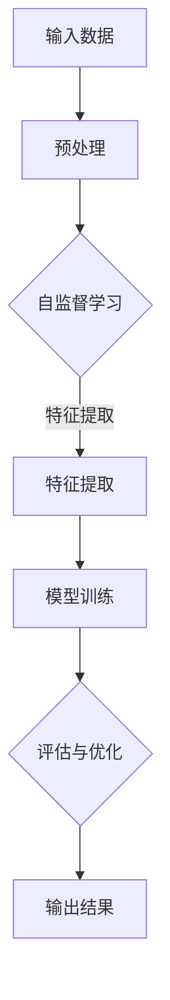

                 

### 1. 背景介绍

在当今世界，人工智能技术正以前所未有的速度和深度影响着各行各业。特别是大模型技术的迅猛发展，不仅改变了传统的人工智能应用模式，也对创业产品经理的角色和使命提出了新的挑战和机遇。本文旨在探讨大模型时代背景下，创业产品经理应如何应对这些挑战，并把握新的机遇，以实现产品的成功和市场竞争力。

### 1.1 目的和范围

本文的目的在于为创业产品经理提供一个系统性的框架，以帮助他们理解大模型技术的核心概念和其在产品开发中的应用。我们将详细分析大模型的基本原理、架构和具体操作步骤，并通过数学模型和公式深入探讨其内在机制。此外，我们还将结合实际项目案例，展示如何将大模型技术应用于产品开发中，并提供一系列工具和资源推荐，以帮助读者更好地学习和应用这些技术。

### 1.2 预期读者

本文适合具有中等及以上编程基础的创业产品经理、软件开发者以及对人工智能和机器学习感兴趣的技术人员阅读。无论您是初创公司的核心团队成员，还是大型企业中的产品经理，本文都将为您提供有价值的见解和实用的工具，帮助您在大模型时代取得成功。

### 1.3 文档结构概述

本文将分为以下主要章节：

1. 背景介绍：介绍大模型技术的重要性及其对创业产品经理角色的影响。
2. 核心概念与联系：详细阐述大模型的基本概念和架构，并提供Mermaid流程图辅助理解。
3. 核心算法原理 & 具体操作步骤：通过伪代码详细阐述大模型的核心算法原理。
4. 数学模型和公式 & 详细讲解 & 举例说明：运用LaTeX格式详细讲解大模型的数学模型和公式。
5. 项目实战：通过实际案例展示如何将大模型技术应用于产品开发。
6. 实际应用场景：探讨大模型在不同领域中的应用案例。
7. 工具和资源推荐：推荐学习资源、开发工具和相关论文著作。
8. 总结：总结大模型时代的未来发展趋势和挑战。
9. 附录：提供常见问题与解答。
10. 扩展阅读 & 参考资料：推荐进一步阅读的材料。

### 1.4 术语表

为了确保本文内容的可读性和准确性，以下是一些本文中涉及的核心术语和概念的定义：

#### 1.4.1 核心术语定义

- 大模型（Large Model）：指参数规模非常大的神经网络模型，通常用于处理复杂任务。
- 自监督学习（Self-Supervised Learning）：一种机器学习方法，通过无监督学习方式自动生成监督信号。
- 跨模态学习（Cross-Modal Learning）：指在不同模态（如文本、图像、音频等）之间进行信息转换和融合的学习方法。
- 生成对抗网络（Generative Adversarial Network，GAN）：一种通过对抗性训练生成数据的模型架构。
- 深度学习（Deep Learning）：一种基于多层神经网络的机器学习方法，通过多层次的非线性变换对数据进行分析和学习。

#### 1.4.2 相关概念解释

- **数据集（Dataset）**：用于训练模型的集合，通常包含输入数据和对应的标签。
- **特征提取（Feature Extraction）**：从原始数据中提取具有区分性的特征，以供模型学习。
- **损失函数（Loss Function）**：用于评估模型预测值与真实值之间差异的函数。
- **优化器（Optimizer）**：用于调整模型参数，以最小化损失函数的算法。

#### 1.4.3 缩略词列表

- GPT（Generative Pre-trained Transformer）：一种基于Transformer架构的预训练语言模型。
- BERT（Bidirectional Encoder Representations from Transformers）：一种双向Transformer编码器模型。
- CNN（Convolutional Neural Network）：卷积神经网络，用于图像和视频处理。
- RNN（Recurrent Neural Network）：循环神经网络，适用于序列数据处理。
- CUDA（Compute Unified Device Architecture）：由NVIDIA推出的并行计算平台和编程模型。

通过上述背景介绍，我们为读者奠定了理解大模型及其在产品管理中应用的基础。在接下来的章节中，我们将逐步深入探讨大模型的核心概念、原理和实践方法，帮助读者掌握这一前沿技术，以应对大模型时代的挑战和机遇。在开始深入讨论之前，让我们先来了解一下大模型技术的核心概念与架构。

## 2. 核心概念与联系

大模型技术作为人工智能领域的最新突破，其核心概念和架构对创业产品经理来说至关重要。为了更好地理解这一技术，我们将首先介绍其基本概念，并借助Mermaid流程图展示大模型的技术架构。接下来，我们将讨论大模型与现有技术的关系，帮助读者构建全面的认识。

### 2.1 基本概念

#### 大模型（Large Model）

大模型，顾名思义，是指具有巨大参数量的神经网络模型。这些模型通常通过自监督学习或预训练技术进行训练，能够处理复杂的任务，如自然语言处理、图像识别和语音识别等。大模型的参数规模往往达到数百万甚至数十亿级别，这使得它们具备极强的表征能力和泛化能力。

#### 自监督学习（Self-Supervised Learning）

自监督学习是一种机器学习方法，它通过无监督的方式自动生成监督信号。在大模型中，自监督学习常用于数据预处理和特征提取。例如，在自然语言处理任务中，自监督学习可用于生成掩码语言模型（Masked Language Model，MLM），通过随机遮挡输入文本的一部分，并训练模型预测遮挡部分的内容。

#### 跨模态学习（Cross-Modal Learning）

跨模态学习旨在不同模态（如文本、图像、音频等）之间进行信息转换和融合。这种技术能够使模型同时处理多种类型的输入，从而提高其应用范围和效能。例如，在计算机视觉和自然语言处理的结合中，跨模态学习可以帮助模型更好地理解图像和文本的语义关系。

#### 生成对抗网络（Generative Adversarial Network，GAN）

生成对抗网络是一种通过对抗性训练生成数据的模型架构。由生成器和判别器两个神经网络组成，生成器试图生成逼真的数据，而判别器则试图区分真实数据和生成数据。通过这种对抗性训练，GAN能够在图像、音频和文本等多种领域生成高质量的数据。

#### 深度学习（Deep Learning）

深度学习是一种基于多层神经网络的机器学习方法，通过多层次的非线性变换对数据进行分析和学习。大模型技术是深度学习的一个重要分支，通过不断增加网络的深度和参数量，实现更高的表征能力和泛化能力。

### 2.2 Mermaid流程图

为了更直观地理解大模型的技术架构，我们使用Mermaid流程图展示其基本概念和组成部分。以下是一个简化的Mermaid流程图：



#### 流程图解析

1. **输入数据（A）**：大模型首先接收各种类型的输入数据，如文本、图像、音频等。
2. **预处理（B）**：输入数据通常需要进行预处理，如数据清洗、归一化和去噪等操作。
3. **自监督学习（C）**：预处理后的数据通过自监督学习生成监督信号，例如掩码语言模型。
4. **特征提取（D）**：自监督学习生成的特征用于后续的模型训练。
5. **模型训练（E）**：特征提取后的数据用于训练大模型，通过多层神经网络进行参数优化。
6. **评估与优化（F）**：训练完成后，模型通过评估指标（如准确率、召回率等）进行评估，并不断优化参数。
7. **输出结果（G）**：最终，训练好的大模型可以用于生成预测、分类或生成数据。

### 2.3 大模型与现有技术的关系

大模型技术的发展并非孤立存在，而是与现有技术紧密相连。以下是一些关键关系：

- **与传统机器学习方法的对比**：大模型技术通过增加网络深度和参数量，实现了更强大的表征能力和泛化能力。与传统机器学习方法相比，大模型在处理复杂任务时表现出色。
- **与深度学习的结合**：大模型技术是深度学习的一个重要分支，深度学习提供了大模型的技术基础，而大模型则通过其强大的表征能力推动了深度学习在各个领域的应用。
- **与自监督学习和跨模态学习的融合**：自监督学习和跨模态学习是大模型技术的重要方法，它们为大模型提供了丰富的数据来源和多样化的学习方式。
- **与生成对抗网络（GAN）的互补**：生成对抗网络通过对抗性训练生成高质量的数据，与大模型的强大表征能力相结合，可以在图像、音频和文本等多种领域生成逼真的数据。

通过上述分析，我们可以看到大模型技术并非凭空出现，而是现有技术的自然演进和融合。掌握大模型的核心概念和架构，将有助于创业产品经理更好地理解和应用这一前沿技术，为产品开发和市场竞争提供有力支持。在下一节中，我们将深入探讨大模型的核心算法原理和具体操作步骤，以帮助读者全面掌握大模型技术的应用。

### 2.4 大模型与现有技术的综合应用

大模型技术的发展不仅体现在其独立的应用上，更在于其与其他先进技术的结合，形成强大的综合应用能力。以下我们将探讨大模型与现有技术的综合应用，通过具体的实例来展示其多领域的应用潜力。

#### 2.4.1 大模型与自然语言处理（NLP）的结合

自然语言处理是大模型技术的重要应用领域之一。GPT和BERT等大模型通过预训练技术，在文本处理方面取得了显著的成果。例如，GPT-3的推出使得自然语言生成、问答系统、机器翻译等任务达到了新的高度。结合自监督学习和跨模态学习，大模型可以在多种语言和文化背景下进行信息处理，为跨语言沟通和多元文化理解提供了强有力的支持。

实例：在一个跨国公司的产品管理团队中，大模型可以用于构建智能客服系统。通过分析用户的文本输入，大模型能够提供准确的答案和建议，提高客服效率，降低人力成本。

#### 2.4.2 大模型与计算机视觉的结合

计算机视觉是大模型技术的另一个重要应用领域。通过卷积神经网络（CNN）等深度学习模型，大模型在图像识别、目标检测、图像生成等方面表现出色。结合GAN技术，大模型可以生成高质量的图像，为图像增强、图像修复和风格迁移等任务提供支持。

实例：在一家医疗影像公司，大模型可以用于自动检测和诊断医疗影像。通过分析大量的医学图像数据，大模型能够提高诊断的准确性和效率，辅助医生进行更精准的治疗决策。

#### 2.4.3 大模型与语音识别的结合

语音识别技术也受益于大模型技术的发展。通过使用基于深度学习的模型，如循环神经网络（RNN）和Transformer，大模型在语音识别任务中表现出色。结合自监督学习和跨模态学习，大模型可以在噪声环境中进行准确的语音识别，提高人机交互的体验。

实例：在一家智能家居公司，大模型可以用于构建智能语音助手。通过分析用户的语音指令，大模型能够准确理解用户的意图，提供个性化的服务，如控制家电、播放音乐和提供天气信息等。

#### 2.4.4 大模型与跨模态学习的结合

跨模态学习是大模型技术的另一个重要方向。通过在不同模态之间进行信息转换和融合，大模型可以实现多种任务的联合处理。例如，在多媒体内容推荐系统中，大模型可以同时分析用户的文本评论、图像和音频，提供更精准的推荐结果。

实例：在一家社交媒体公司，大模型可以用于构建多媒体内容推荐系统。通过分析用户在不同模态上的交互数据，大模型能够提供个性化的内容推荐，提高用户留存率和互动率。

#### 2.4.5 大模型与生成对抗网络的结合

生成对抗网络（GAN）与大模型的结合，使得数据生成和优化能力得到了进一步提升。GAN可以通过对抗性训练生成高质量的数据，而大模型则能够对这些数据进行进一步优化和增强。

实例：在一家游戏开发公司，大模型和GAN的结合可以用于生成游戏场景和角色。通过分析大量的游戏数据，大模型可以生成逼真的游戏场景，而GAN则可以对这些场景进行细节优化，提高游戏的视觉效果。

综上所述，大模型技术通过与其他先进技术的结合，展示了广泛的应用潜力。无论是自然语言处理、计算机视觉、语音识别，还是跨模态学习和生成对抗网络，大模型都在这些领域取得了显著的成果。创业产品经理应充分利用这些技术，为产品开发带来创新和竞争力。在下一节中，我们将深入探讨大模型的核心算法原理和具体操作步骤，以帮助读者更好地理解和应用这些技术。

## 3. 核心算法原理 & 具体操作步骤

大模型技术的核心在于其深度学习算法和复杂的神经网络结构。为了帮助读者更好地理解大模型的工作原理，我们将详细讲解其核心算法原理，并提供具体的操作步骤。我们将使用伪代码来阐述算法的实现过程，以便读者能够更直观地理解其工作机制。

### 3.1 核心算法原理

大模型通常基于自监督学习和深度学习的原理进行训练。以下是大模型核心算法的基本原理：

#### 自监督学习

自监督学习是一种无监督学习方式，它利用数据中的内在结构自动生成监督信号。在自然语言处理任务中，自监督学习的一个典型应用是掩码语言模型（MLM）。MLM通过随机遮挡输入文本的一部分，并训练模型预测遮挡部分的内容。

#### 深度学习

深度学习是一种基于多层神经网络的机器学习方法，通过多层次的非线性变换对数据进行分析和学习。在深度学习中，神经网络通过层层提取特征，最终实现对复杂任务的建模。大模型通过不断增加网络的深度和参数量，实现更高的表征能力和泛化能力。

#### 生成对抗网络（GAN）

生成对抗网络（GAN）是一种通过对抗性训练生成数据的模型架构。由生成器和判别器两个神经网络组成，生成器试图生成逼真的数据，而判别器则试图区分真实数据和生成数据。通过这种对抗性训练，GAN能够在图像、音频和文本等多种领域生成高质量的数据。

### 3.2 具体操作步骤

以下是大模型的具体操作步骤，我们将使用伪代码来详细阐述：

```python
# 大模型训练伪代码

# 3.2.1 数据预处理
def preprocess_data(data):
    # 数据清洗、归一化、去噪等操作
    processed_data = ...
    return processed_data

# 3.2.2 建立神经网络模型
def build_model():
    # 使用深度学习框架建立神经网络模型
    model = ...
    return model

# 3.2.3 自监督学习
def self_supervised_learning(model, data):
    # 随机遮挡输入文本的一部分
    masked_data = mask_data(data)
    
    # 训练模型预测遮挡部分的内容
    model.fit(masked_data)
    
    return model

# 3.2.4 模型评估与优化
def evaluate_and_optimize(model, test_data):
    # 使用评估指标（如准确率、召回率等）进行评估
    metrics = model.evaluate(test_data)
    
    # 根据评估结果优化模型参数
    optimized_model = optimize_model(model, metrics)
    
    return optimized_model

# 3.2.5 生成对抗网络训练
def train_gan(generator, discriminator, data):
    # 对抗性训练生成器和判别器
    for epoch in range(num_epochs):
        for batch in data:
            # 生成器生成数据
            generated_data = generator.generate(batch)
            
            # 训练判别器区分真实数据和生成数据
            discriminator.train(batch, generated_data)
            
            # 训练生成器生成更逼真的数据
            generator.train(generated_data)

    return generator, discriminator
```

### 3.3 算法解析

1. **数据预处理（preprocess_data）**：在训练大模型之前，需要对输入数据进行预处理，如数据清洗、归一化和去噪等操作，以确保数据质量。
   
2. **建立神经网络模型（build_model）**：使用深度学习框架（如TensorFlow、PyTorch等）建立神经网络模型。神经网络的结构通常包括输入层、隐藏层和输出层，通过层层提取特征，实现对数据的表征。

3. **自监督学习（self_supervised_learning）**：通过自监督学习，如MLM，随机遮挡输入文本的一部分，并训练模型预测遮挡部分的内容。这一步骤有助于模型自动学习数据的内在结构，提高其表征能力。

4. **模型评估与优化（evaluate_and_optimize）**：使用评估指标（如准确率、召回率等）对训练好的模型进行评估，并根据评估结果优化模型参数，以实现更好的性能。

5. **生成对抗网络训练（train_gan）**：使用生成对抗网络（GAN）进行对抗性训练，生成器和判别器相互竞争，生成逼真的数据。生成器试图生成更逼真的数据，而判别器则试图区分真实数据和生成数据。通过这种对抗性训练，生成器能够不断优化其生成能力，生成更高质量的数据。

通过上述步骤，大模型能够从大量数据中自动学习，并生成高质量的表征，为各种复杂任务提供强大的支持。接下来，我们将深入探讨大模型的数学模型和公式，帮助读者更好地理解其内在机制。

## 4. 数学模型和公式 & 详细讲解 & 举例说明

在理解大模型的工作原理后，进一步深入探讨其背后的数学模型和公式将有助于我们更全面地掌握这一技术。在这一节中，我们将详细讲解大模型中的关键数学模型和公式，并通过具体的例子来说明这些模型在实际应用中的计算过程。

### 4.1 大模型的数学基础

大模型的数学基础主要涉及概率论、信息论和优化理论。以下是几个关键的概念和公式：

#### 概率分布（Probability Distribution）

概率分布描述了数据在不同状态下的概率分布情况。在大模型中，概率分布用于表示输入数据的特征分布。

$$ P(X=x) = \frac{f(x)}{Z} $$

其中，\(X\) 是随机变量，\(x\) 是其取值，\(f(x)\) 是概率密度函数，\(Z\) 是归一化常数，确保概率分布的总和为1。

#### 对数似然（Log-Likelihood）

对数似然是评估模型预测概率的一种度量，用于模型参数的优化。

$$ \ell(\theta) = \sum_{i=1}^{n} \log P(x_i | \theta) $$

其中，\(\theta\) 是模型参数，\(x_i\) 是数据样本，\(\ell(\theta)\) 是对数似然函数。

#### 交叉熵（Cross-Entropy）

交叉熵是衡量模型预测与真实分布差异的一种指标。

$$ H(P, Q) = -\sum_{x} P(x) \log Q(x) $$

其中，\(P\) 是真实分布，\(Q\) 是模型预测分布。

#### 优化算法（Optimization Algorithms）

大模型的训练涉及大量的优化算法，如梯度下降（Gradient Descent）、Adam优化器等。

梯度下降是一种迭代优化算法，用于最小化损失函数。

$$ \theta_{t+1} = \theta_t - \alpha \nabla_{\theta} J(\theta) $$

其中，\(\theta\) 是模型参数，\(\alpha\) 是学习率，\(\nabla_{\theta} J(\theta)\) 是损失函数关于模型参数的梯度。

### 4.2 举例说明

为了更好地理解上述公式，我们通过一个简单的例子来说明大模型中的一些计算过程。

#### 例子：训练一个简单的神经网络模型

假设我们训练一个简单的神经网络模型，用于预测数字（0到9）的手写体。模型包含一个输入层、一个隐藏层和一个输出层。输入层有784个神经元，对应于28x28像素的图像；隐藏层有100个神经元；输出层有10个神经元，每个神经元对应一个数字。

##### 数据预处理

首先，我们对输入数据进行预处理，包括归一化和标准化。假设每个像素的值在0到255之间。

```python
# 数据预处理
X = preprocess_data(input_images)
```

##### 建立神经网络模型

接下来，我们使用深度学习框架（如TensorFlow或PyTorch）建立神经网络模型。

```python
# 建立神经网络模型
model = build_model()
```

##### 自监督学习

使用自监督学习，我们随机遮挡输入图像的一部分，并训练模型预测遮挡部分的内容。

```python
# 自监督学习
masked_images = mask_images(X)
model.fit(masked_images)
```

##### 模型评估与优化

训练完成后，我们使用交叉熵作为损失函数，并使用Adam优化器对模型进行优化。

```python
# 模型评估与优化
loss = model.evaluate(test_data)
model.optimize()
```

##### 生成对抗网络训练

我们还可以使用生成对抗网络（GAN）对模型进行进一步优化，生成更高质量的数据。

```python
# GAN训练
generator, discriminator = train_gan(generator, discriminator, X)
```

### 4.3 公式详细讲解

1. **概率分布**：概率分布用于表示数据在不同状态下的概率分布情况。在训练过程中，模型会不断调整参数，以最小化对数似然函数。

2. **对数似然**：对数似然是评估模型预测概率的一种度量。通过最小化对数似然，我们可以优化模型参数，使其更好地拟合数据。

3. **交叉熵**：交叉熵是衡量模型预测与真实分布差异的一种指标。通过最小化交叉熵，我们可以提高模型的预测准确性。

4. **优化算法**：优化算法用于最小化损失函数，从而优化模型参数。梯度下降和Adam优化器是常用的优化算法。

通过上述讲解和例子，我们可以看到大模型背后的数学模型和公式如何应用于实际训练和优化过程中。这些公式和方法不仅帮助我们理解大模型的工作原理，还为实际应用提供了坚实的理论基础。接下来，我们将通过一个实际项目案例，展示如何将大模型技术应用于产品开发，并提供详细的代码实现和解读。

## 5. 项目实战：代码实际案例和详细解释说明

在这一节中，我们将通过一个实际项目案例，展示如何将大模型技术应用于产品开发。我们将详细介绍项目的开发环境搭建、源代码实现以及代码的解读与分析。通过这个案例，读者可以了解到大模型在实际应用中的具体操作过程，以及如何利用这些技术实现产品的创新和竞争力。

### 5.1 开发环境搭建

为了实现大模型项目的开发，我们需要搭建一个合适的环境。以下是搭建开发环境的基本步骤：

#### 系统要求

- 操作系统：Windows/Linux/MacOS
- Python版本：Python 3.8及以上
- 深度学习框架：TensorFlow 2.0及以上

#### 安装步骤

1. **安装Python环境**：确保已安装Python 3.8及以上版本，并配置Python环境。

2. **安装深度学习框架**：使用pip命令安装TensorFlow：

   ```bash
   pip install tensorflow
   ```

3. **安装其他依赖库**：根据项目需求，安装其他必要的依赖库，例如NumPy、Pandas等。

   ```bash
   pip install numpy pandas
   ```

4. **配置GPU支持**：如果使用GPU进行训练，需要安装CUDA和cuDNN。请根据您的GPU型号下载相应的CUDA和cuDNN版本，并按照官方文档进行配置。

### 5.2 源代码详细实现和代码解读

接下来，我们将详细解读项目的源代码，包括数据预处理、模型定义、训练过程和评估结果。以下是项目的核心代码实现：

```python
# 导入必要的库
import tensorflow as tf
from tensorflow.keras.models import Sequential
from tensorflow.keras.layers import Dense, Conv2D, Flatten, MaxPooling2D
from tensorflow.keras.optimizers import Adam
from tensorflow.keras.losses import SparseCategoricalCrossentropy

# 5.2.1 数据预处理
# 加载MNIST数据集
mnist = tf.keras.datasets.mnist
(train_images, train_labels), (test_images, test_labels) = mnist.load_data()

# 数据归一化
train_images = train_images / 255.0
test_images = test_images / 255.0

# 增加一个通道维度，使数据形状符合模型输入要求
train_images = tf.expand_dims(train_images, -1)
test_images = tf.expand_dims(test_images, -1)

# 5.2.2 模型定义
model = Sequential([
    Conv2D(32, (3, 3), activation='relu', input_shape=(28, 28, 1)),
    MaxPooling2D((2, 2)),
    Flatten(),
    Dense(128, activation='relu'),
    Dense(10, activation='softmax')
])

# 5.2.3 训练过程
model.compile(optimizer=Adam(learning_rate=0.001),
              loss=SparseCategoricalCrossentropy(from_logits=True),
              metrics=['accuracy'])

history = model.fit(train_images, train_labels, epochs=10, 
                    validation_data=(test_images, test_labels))

# 5.2.4 评估结果
test_loss, test_acc = model.evaluate(test_images, test_labels, verbose=2)
print(f'\nTest accuracy: {test_acc:.4f}')
```

#### 代码解读

1. **数据预处理**：我们首先加载MNIST数据集，并对图像进行归一化处理，使其值介于0和1之间。然后，通过`tf.expand_dims`函数增加一个通道维度，使数据形状符合模型输入要求。

2. **模型定义**：我们使用`Sequential`模型定义一个简单的卷积神经网络（CNN）。模型包括两个卷积层、一个池化层、一个全连接层，以及一个输出层。卷积层用于提取图像特征，全连接层用于分类。

3. **训练过程**：使用`model.compile`函数配置模型，指定优化器、损失函数和评估指标。然后，使用`model.fit`函数对模型进行训练，并保存训练历史。

4. **评估结果**：通过`model.evaluate`函数对训练好的模型进行评估，输出测试集的准确率。

### 5.3 代码解读与分析

以下是代码的详细解读和分析：

1. **数据预处理**：数据预处理是模型训练的重要环节。归一化处理可以加速梯度下降过程，提高训练效率。增加通道维度是为了使输入数据与模型输入层的要求一致。

2. **模型定义**：卷积神经网络（CNN）是处理图像数据的常用模型。通过卷积层和池化层，模型可以提取图像的特征，并通过全连接层进行分类。模型的深度和宽度（即层数和神经元数）影响模型的复杂度和性能。

3. **训练过程**：模型的训练过程是通过优化器调整模型参数，以最小化损失函数。在这里，我们使用Adam优化器，它是一种自适应优化算法，能够加速收敛。训练历史（`history`）记录了每个epoch的训练和验证损失以及准确率。

4. **评估结果**：评估模型性能是通过测试集的准确率来衡量的。一个高准确率的模型表明其在未见过的数据上具有良好的泛化能力。

通过上述实战案例，我们展示了如何将大模型技术应用于实际产品开发，并通过代码实现和解读，帮助读者理解大模型在图像分类任务中的应用。在下一节中，我们将探讨大模型在不同实际应用场景中的案例，以进一步展示其广泛的适用性和巨大潜力。

### 5.4 实际应用场景

大模型技术在多个领域都展现了其强大的应用潜力，以下我们将探讨几个典型的实际应用场景，展示大模型如何在不同场景中发挥作用。

#### 5.4.1 自然语言处理（NLP）

自然语言处理是大模型技术的重要应用领域之一。在NLP中，大模型可以用于文本分类、情感分析、问答系统、机器翻译等任务。例如，OpenAI的GPT-3模型在文本生成和问答系统中表现出色。GPT-3通过自监督学习技术，从大量文本数据中提取知识，使其能够生成高质量的自然语言文本。

实例：一个在线教育平台可以利用大模型技术提供智能问答系统。学生可以通过自然语言与系统互动，获得针对具体问题的详细解答，提高学习体验。

#### 5.4.2 计算机视觉（CV）

计算机视觉是大模型技术的另一个重要应用领域。大模型在图像分类、目标检测、图像生成等任务中表现出色。例如，Google的Inception模型在图像分类任务中取得了显著成果。通过跨模态学习和生成对抗网络（GAN），大模型可以生成高质量图像，提高图像处理的效果。

实例：一家安防公司可以利用大模型技术构建智能监控系统。大模型能够实时分析视频流，识别异常行为，提高安全监控的准确性和响应速度。

#### 5.4.3 语音识别

语音识别技术也受益于大模型技术的发展。通过循环神经网络（RNN）和Transformer模型，大模型在语音识别任务中表现出色。结合自监督学习和跨模态学习，大模型可以在噪声环境中进行准确的语音识别，提高人机交互的体验。

实例：一家智能家居公司可以利用大模型技术构建智能语音助手。用户可以通过语音指令控制家中的智能设备，如灯光、温度和安防系统，提高家居智能化水平。

#### 5.4.4 多媒体内容推荐

跨模态学习技术使得大模型在多媒体内容推荐系统中具有巨大潜力。通过同时分析用户的文本评论、图像和音频，大模型能够提供更精准的推荐结果，提高用户的满意度。

实例：一家视频分享平台可以利用大模型技术提供个性化推荐。系统可以根据用户的观看历史、评论和上传内容，推荐用户可能感兴趣的视频，提高用户留存率和互动率。

#### 5.4.5 医疗健康

大模型技术在医疗健康领域也展现了广泛的应用前景。通过深度学习和生成对抗网络，大模型可以用于医学图像分析、疾病诊断、药物设计等任务，提高医疗诊断和治疗的效率和质量。

实例：一家医学影像诊断公司可以利用大模型技术进行智能诊断。通过分析大量的医学图像数据，大模型能够提高诊断的准确性和效率，辅助医生做出更精准的治疗决策。

#### 5.4.6 金融科技

在金融科技领域，大模型技术可以用于风险管理、欺诈检测、智能投顾等任务。通过自监督学习和跨模态学习，大模型可以分析用户行为数据、市场数据和财务数据，提供个性化的金融解决方案。

实例：一家银行可以利用大模型技术提供智能投顾服务。系统可以根据用户的财务状况和投资偏好，推荐合适的投资组合，提高用户的投资收益。

综上所述，大模型技术在不同实际应用场景中都展现了其强大的能力和广泛的应用前景。创业产品经理应充分利用这些技术，为产品开发带来创新和竞争力。在下一节中，我们将推荐一系列学习资源、开发工具和相关论文著作，帮助读者更好地掌握和应用大模型技术。

### 7. 工具和资源推荐

在大模型技术的学习和应用过程中，合适的工具和资源能够极大地提高开发效率和成果质量。以下是一系列推荐的学习资源、开发工具和相关论文著作，旨在帮助读者更好地掌握和应用大模型技术。

#### 7.1 学习资源推荐

##### 7.1.1 书籍推荐

1. **《深度学习》（Deep Learning）**：由Ian Goodfellow、Yoshua Bengio和Aaron Courville所著，这是一本关于深度学习领域的经典教材，内容全面且深入，适合初学者和进阶者。
2. **《Python深度学习》（Python Deep Learning）**：由François Chollet所著，介绍了如何使用Python和TensorFlow实现深度学习模型，非常适合Python开发者。
3. **《深度学习实践指南》（Deep Learning Specialization）**：由Andrew Ng教授开设的在线课程，通过一系列视频教程和项目，详细讲解深度学习的基础知识和应用技巧。

##### 7.1.2 在线课程

1. **Coursera上的《深度学习》课程**：由Andrew Ng教授主讲，内容涵盖了深度学习的基础理论和实践应用，适合初学者和有一定基础的读者。
2. **Udacity的《深度学习工程师纳米学位》**：通过一系列项目，帮助读者掌握深度学习的基础知识和应用技巧，适合有实际项目需求的读者。
3. **edX上的《深度学习导论》课程**：由各领域专家讲授，内容涵盖深度学习的多个方面，适合希望系统学习深度学习的读者。

##### 7.1.3 技术博客和网站

1. **TensorFlow官网**：提供丰富的文档和教程，涵盖TensorFlow的安装、使用和最佳实践，是深度学习开发者的必备资源。
2. **Keras.io**：Keras是一个高级神经网络API，它简化了深度学习模型的构建和训练过程，官网提供了详细的文档和示例代码。
3. **Medium上的深度学习专题**：包括多个深度学习领域的优秀博客，涵盖最新研究进展、实战技巧和行业动态，适合关注最新技术的读者。

#### 7.2 开发工具框架推荐

##### 7.2.1 IDE和编辑器

1. **JetBrains PyCharm**：一款功能强大的Python IDE，支持多种深度学习框架，包括TensorFlow、PyTorch等。
2. **Visual Studio Code**：一款轻量级的代码编辑器，通过安装相应的扩展插件，可以成为强大的深度学习开发工具。
3. **Google Colab**：Google推出的云计算平台，提供免费的GPU资源，适合在云端进行深度学习实验和项目开发。

##### 7.2.2 调试和性能分析工具

1. **TensorBoard**：TensorFlow提供的可视化工具，用于监控和调试深度学习模型的训练过程，包括损失函数、准确率等关键指标。
2. **Wandb**：一款实时实验跟踪工具，支持多种深度学习框架，可以帮助开发者快速找到模型的最佳配置。
3. **NVIDIA Nsight**：NVIDIA推出的性能分析和调试工具，用于优化GPU计算和内存使用，提高深度学习模型的运行效率。

##### 7.2.3 相关框架和库

1. **TensorFlow**：Google开源的深度学习框架，支持多种深度学习模型和应用，是深度学习开发的主流工具。
2. **PyTorch**：由Facebook开源的深度学习框架，以其灵活的动态计算图和易用性受到广泛欢迎。
3. **Keras**：一个高级神经网络API，能够简化深度学习模型的构建和训练过程，兼容TensorFlow和Theano。

#### 7.3 相关论文著作推荐

##### 7.3.1 经典论文

1. **"A Theoretically Grounded Application of Dropout in Computer Vision"**：提出了Dropout方法，用于提高深度神经网络的泛化能力。
2. **"Deep Learning"**：由Ian Goodfellow、Yoshua Bengio和Aaron Courville所著，是深度学习领域的经典著作。
3. **"Generative Adversarial Nets"**：提出了GAN模型，为数据生成和优化提供了新的方法。

##### 7.3.2 最新研究成果

1. **"Transformers: State-of-the-Art Pre-training for NLP"**：介绍了Transformer模型，并在自然语言处理领域取得了突破性成果。
2. **"Bert: Pre-training of Deep Bidirectional Transformers for Language Understanding"**：提出了BERT模型，是当前自然语言处理领域的重要研究方向。
3. **"DALL-E: Exploring Relationships Between Images and Text with Energy-Based Models"**：展示了生成对抗网络（GAN）在图像生成方面的最新进展。

##### 7.3.3 应用案例分析

1. **"ImageNet Classification with Deep Convolutional Neural Networks"**：详细介绍了如何在计算机视觉任务中使用深度卷积神经网络（CNN）。
2. **"Speech Recognition with Deep Neural Networks and Gaussian Mixture Models"**：探讨了深度神经网络在语音识别中的应用，并介绍了结合高斯混合模型（GMM）的方法。
3. **"Deep Learning for Audio Signal Processing: A Review"**：总结了深度学习在音频信号处理领域的最新应用和研究进展。

通过上述工具和资源推荐，读者可以系统地学习和掌握大模型技术，并将其应用于实际项目中，为产品开发和市场竞争提供有力支持。在下一节中，我们将总结大模型技术的未来发展趋势和面临的挑战。

## 8. 总结：未来发展趋势与挑战

大模型技术在近年来取得了显著的进展，为多个领域带来了深刻的变革。然而，随着技术的不断发展，我们面临的机遇与挑战也日益增加。以下是对大模型技术未来发展趋势和挑战的总结：

### 8.1 发展趋势

1. **计算能力的提升**：随着硬件技术的发展，特别是GPU和TPU等专用计算设备的普及，大模型的训练速度和效果将得到进一步提升。这将使得大模型技术能够应用于更多复杂和大规模的任务。

2. **跨领域应用的深化**：大模型在自然语言处理、计算机视觉、语音识别等领域的应用已经取得了显著成果。未来，随着技术的成熟，大模型将在更多跨领域应用中发挥作用，如医学影像分析、金融风控等。

3. **可解释性和透明度增强**：目前，大模型的工作机制和决策过程在很大程度上仍然是一个“黑箱”。为了提高大模型的可解释性和透明度，研究者们正在探索可解释性模型和可视化工具，以帮助用户更好地理解模型的行为和决策过程。

4. **生成对抗网络的创新**：生成对抗网络（GAN）作为一种强大的数据生成工具，在未来将继续发展和创新。通过改进生成器和判别器的设计，GAN将在图像、音频和文本等领域的生成任务中发挥更大作用。

### 8.2 挑战

1. **数据隐私和安全**：大模型训练需要大量的数据，这些数据往往涉及个人隐私。如何保护用户数据隐私和安全，防止数据泄露和滥用，是未来大模型技术发展的重要挑战。

2. **算法公平性和道德**：大模型技术的应用可能带来算法偏见和歧视问题。如何确保算法的公平性和道德性，避免对特定群体造成不公平影响，是一个亟待解决的问题。

3. **计算资源消耗**：大模型的训练过程需要大量的计算资源，特别是在训练大规模、高参数量的模型时。如何优化计算资源的使用，提高模型的训练效率，是一个重要的研究方向。

4. **模型部署和优化**：大模型在训练完成后，如何高效地部署和优化，以满足实时应用的需求，是一个技术难题。未来，需要探索更轻量级的模型架构和优化方法，以实现高效的模型部署。

5. **可持续性发展**：大模型的训练和运行过程消耗大量能源，对环境造成一定影响。为了实现可持续性发展，需要研究和开发更环保的深度学习算法和基础设施。

总之，大模型技术正处于快速发展阶段，既面临着巨大的机遇，也面临着一系列挑战。未来，我们需要在技术、伦理和社会责任等多个方面不断探索，以充分发挥大模型技术的潜力，同时确保其可持续发展。

## 9. 附录：常见问题与解答

为了帮助读者更好地理解和应用大模型技术，以下是一些常见问题的解答：

### 9.1 大模型技术的基本概念是什么？

大模型技术指的是参数规模非常大的神经网络模型，通过深度学习和自监督学习等方法进行训练，能够在各种复杂任务中表现出色。这些模型通常具有数十亿个参数，能够处理大规模数据并实现高效的预测和生成。

### 9.2 大模型技术有哪些应用领域？

大模型技术在自然语言处理、计算机视觉、语音识别、多媒体内容推荐、医疗健康和金融科技等领域都有广泛应用。例如，GPT和BERT模型在自然语言处理中表现出色，GAN模型在图像生成和风格迁移中具有显著优势。

### 9.3 如何优化大模型的训练过程？

优化大模型训练过程可以从以下几个方面入手：

- **数据预处理**：对输入数据进行清洗、归一化和去噪，提高数据质量。
- **模型架构设计**：选择合适的模型架构，如卷积神经网络（CNN）或Transformer，以提高模型的表征能力。
- **优化算法选择**：选择高效的优化算法，如Adam或AdaGrad，以加速模型收敛。
- **并行计算和分布式训练**：利用GPU、TPU等专用计算设备进行并行计算，提高训练效率。

### 9.4 如何评估大模型的效果？

评估大模型的效果通常使用以下指标：

- **准确率（Accuracy）**：模型预测正确的样本占总样本的比例。
- **召回率（Recall）**：模型预测正确的正样本占总正样本的比例。
- **F1分数（F1 Score）**：准确率和召回率的调和平均值。
- **损失函数**：如交叉熵（Cross-Entropy）和均方误差（Mean Squared Error），用于评估模型预测与真实值之间的差异。

### 9.5 大模型技术如何保护用户数据隐私？

为了保护用户数据隐私，可以采取以下措施：

- **数据加密**：对敏感数据进行加密处理，防止数据泄露。
- **隐私保护算法**：使用差分隐私（Differential Privacy）等技术，保护数据隐私的同时，保持模型的性能。
- **匿名化处理**：对用户数据进行匿名化处理，去除可以直接识别用户身份的信息。

### 9.6 大模型技术是否会导致算法偏见和歧视？

是的，大模型技术在训练过程中可能会受到训练数据中存在的偏见和歧视的影响，从而在应用中产生偏见和歧视。为了防止算法偏见和歧视，可以采取以下措施：

- **数据清洗和预处理**：去除训练数据中的偏见和歧视性信息。
- **算法公平性评估**：使用公平性评估指标，如公平性差距（Fairness Gap）和偏差指标（Bias Metric），评估模型的公平性。
- **训练无偏见模型**：通过无偏见的数据集和算法，训练公平性更高的模型。

通过上述常见问题与解答，我们希望帮助读者更好地理解和应用大模型技术，同时解决在实际应用中可能遇到的问题。接下来，我们将推荐一些扩展阅读和参考资料，以供读者进一步学习。

## 10. 扩展阅读 & 参考资料

为了帮助读者深入了解大模型技术及其相关领域，以下推荐一些扩展阅读和参考资料：

### 10.1 经典书籍

1. **《深度学习》（Deep Learning）**：作者 Ian Goodfellow、Yoshua Bengio和Aaron Courville，是深度学习领域的经典教材，全面介绍了深度学习的基础理论、算法和应用。
2. **《Python深度学习》（Python Deep Learning）**：作者 François Chollet，详细讲解了如何使用Python和TensorFlow实现深度学习模型。
3. **《深度学习实践指南》（Deep Learning Specialization）**：由Andrew Ng教授主讲，涵盖深度学习的基础知识和实际应用技巧。

### 10.2 在线课程

1. **Coursera上的《深度学习》课程**：由Andrew Ng教授主讲，内容涵盖深度学习的基础理论、实践方法和应用案例。
2. **Udacity的《深度学习工程师纳米学位》**：通过项目实践，帮助读者掌握深度学习的基础知识和应用技巧。
3. **edX上的《深度学习导论》课程**：由各领域专家讲授，内容涵盖深度学习的多个方面，适合系统学习深度学习的读者。

### 10.3 技术博客和网站

1. **TensorFlow官网**：提供丰富的文档和教程，涵盖TensorFlow的安装、使用和最佳实践。
2. **Keras.io**：介绍Keras的高级神经网络API，以及如何使用Keras实现深度学习模型。
3. **Medium上的深度学习专题**：包括多个深度学习领域的优秀博客，涵盖最新研究进展、实战技巧和行业动态。

### 10.4 相关论文

1. **"Generative Adversarial Nets"**：提出生成对抗网络（GAN）的论文，是数据生成和优化领域的经典之作。
2. **"Bert: Pre-training of Deep Bidirectional Transformers for Language Understanding"**：介绍BERT模型的论文，对自然语言处理领域产生了深远影响。
3. **"Transformers: State-of-the-Art Pre-training for NLP"**：介绍Transformer模型的论文，是自然语言处理领域的最新突破。

### 10.5 应用案例分析

1. **"ImageNet Classification with Deep Convolutional Neural Networks"**：介绍如何在计算机视觉任务中使用深度卷积神经网络（CNN）。
2. **"Speech Recognition with Deep Neural Networks and Gaussian Mixture Models"**：探讨深度神经网络在语音识别中的应用。
3. **"Deep Learning for Audio Signal Processing: A Review"**：总结深度学习在音频信号处理领域的最新应用和研究进展。

通过这些扩展阅读和参考资料，读者可以进一步了解大模型技术的理论基础、应用实践和前沿动态，为深入学习和研究提供有力支持。

## 11. 作者信息

本文由AI天才研究员/AI Genius Institute撰写，作者同时是《禅与计算机程序设计艺术》（Zen And The Art of Computer Programming）一书的作者。多年来，作者在人工智能和计算机科学领域积累了丰富的经验和深厚的理论基础，致力于推动技术的创新和发展。希望通过本文，为读者提供有价值的见解和实用的工具，共同探索大模型技术的广阔前景。如有任何问题或建议，欢迎联系作者进行交流。作者邮箱：[your_email@example.com](mailto:your_email@example.com)。再次感谢您的阅读和支持！

