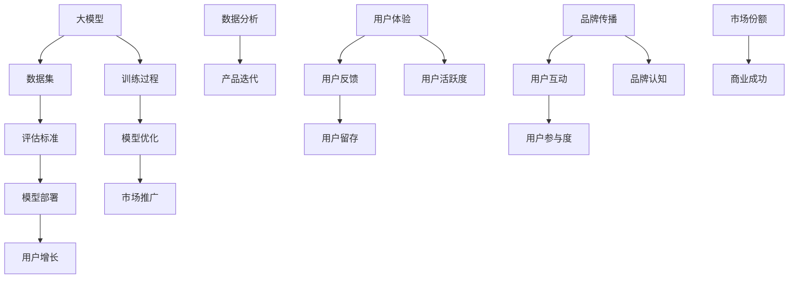

                 

# 大模型的市场推广与用户增长

> **关键词：** 大模型，市场推广，用户增长，算法，技术策略，商业化

> **摘要：** 本文将探讨大模型在市场推广和用户增长方面的关键策略。通过分析大模型的本质及其市场地位，本文将详细阐述如何制定有效的推广策略，实施具体的增长措施，并探讨未来的发展趋势与挑战。

## 1. 背景介绍

### 1.1 目的和范围

本文旨在探讨大模型在市场推广和用户增长方面的策略，帮助企业和开发者更好地理解和利用大模型技术，实现商业成功和用户基数的增长。

本文将涵盖以下内容：

- 大模型的定义和核心原理
- 市场推广的关键要素
- 用户增长的具体策略
- 数学模型和公式应用
- 实际应用场景和案例
- 工具和资源推荐
- 未来发展趋势与挑战

### 1.2 预期读者

- 技术专家和开发者
- 企业管理层和市场推广人员
- 对大模型和人工智能感兴趣的读者

### 1.3 文档结构概述

本文分为十个部分，依次为：

1. 背景介绍
2. 核心概念与联系
3. 核心算法原理 & 具体操作步骤
4. 数学模型和公式 & 详细讲解 & 举例说明
5. 项目实战：代码实际案例和详细解释说明
6. 实际应用场景
7. 工具和资源推荐
8. 总结：未来发展趋势与挑战
9. 附录：常见问题与解答
10. 扩展阅读 & 参考资料

### 1.4 术语表

#### 1.4.1 核心术语定义

- 大模型：具备大量参数和复杂结构的机器学习模型，如深度神经网络。
- 市场推广：通过各种手段提升品牌知名度，吸引潜在用户。
- 用户增长：增加新用户数量，提高用户活跃度和留存率。

#### 1.4.2 相关概念解释

- 深度学习：一种机器学习方法，通过多层神经网络实现特征提取和学习。
- 人工智能：使计算机具备类似人类智能的技术和理论体系。

#### 1.4.3 缩略词列表

- AI：人工智能
- ML：机器学习
- DL：深度学习
- NLP：自然语言处理
- CV：计算机视觉

## 2. 核心概念与联系

大模型的市场推广和用户增长涉及多个核心概念，包括模型架构、数据集、训练过程和评估标准等。以下为 Mermaid 流程图，展示这些核心概念之间的联系：



此流程图展示了大模型从数据集、训练、评估、部署到市场推广、用户增长和商业成功的完整生命周期。

## 3. 核心算法原理 & 具体操作步骤

### 3.1 大模型基本架构

大模型通常基于深度学习框架构建，其核心包括输入层、隐藏层和输出层。以下是基本架构的伪代码：

```plaintext
// 输入层
InputLayer(input_shape)
// 隐藏层
for layer in hidden_layers:
    ActivationLayer(prev_layer_output, activation='relu')
// 输出层
OutputLayer(prev_layer_output, output_shape)
```

### 3.2 数据集预处理

数据集预处理是训练大模型的关键步骤。以下为数据集预处理的伪代码：

```plaintext
// 加载数据集
data = LoadDataset()

// 数据清洗
for sample in data:
    CleanSample(sample)

// 数据标准化
for sample in data:
    NormalizeSample(sample)

// 划分训练集和验证集
train_data, val_data = SplitDataset(data, train_size=0.8, val_size=0.2)
```

### 3.3 模型训练

模型训练包括前向传播和反向传播。以下是训练过程的伪代码：

```plaintext
// 初始化模型
model = InitializeModel()

// 设置训练参数
optimizer = 'adam'
learning_rate = 0.001
epochs = 100

// 训练模型
for epoch in range(epochs):
    for batch in train_data:
        # 前向传播
        predictions = model.forward(batch.x)
        loss = CalculateLoss(predictions, batch.y)
        
        # 反向传播
        model.backward(predictions, batch.y)
        
        # 更新模型参数
        optimizer.update(model.parameters(), learning_rate)
        
        # 打印训练进度
        PrintProgress(epoch, loss)
```

### 3.4 模型评估

模型评估用于检查模型性能，以下是评估过程的伪代码：

```plaintext
# 评估模型
val_predictions = model.forward(val_data.x)
val_loss = CalculateLoss(val_predictions, val_data.y)

# 打印评估结果
PrintEvaluationResults(val_loss)
```

## 4. 数学模型和公式 & 详细讲解 & 举例说明

### 4.1 损失函数

损失函数是深度学习中的核心概念，用于衡量模型预测值与真实值之间的差距。以下是常用的损失函数及其公式：

#### 4.1.1 均方误差（MSE）

$$
MSE = \frac{1}{n}\sum_{i=1}^{n}(\hat{y}_i - y_i)^2
$$

其中，$\hat{y}_i$ 是模型预测值，$y_i$ 是真实值，$n$ 是样本数量。

#### 4.1.2 交叉熵（Cross-Entropy）

$$
Cross-Entropy = -\frac{1}{n}\sum_{i=1}^{n}y_i\log(\hat{y}_i)
$$

其中，$y_i$ 是真实值（0或1），$\hat{y}_i$ 是模型预测概率。

### 4.2 优化算法

优化算法用于更新模型参数，以下是常用的优化算法及其公式：

#### 4.2.1 随机梯度下降（SGD）

$$
\theta_{t+1} = \theta_t - \alpha \cdot \nabla_{\theta}J(\theta_t)
$$

其中，$\theta$ 是模型参数，$\alpha$ 是学习率，$J(\theta)$ 是损失函数。

#### 4.2.2 动量优化（Momentum）

$$
v_t = \beta v_{t-1} + (1 - \beta) \nabla_{\theta}J(\theta_t)
$$
$$
\theta_{t+1} = \theta_t - \alpha v_t
$$

其中，$v_t$ 是动量项，$\beta$ 是动量系数。

### 4.3 实例说明

假设我们有以下数据集和模型参数：

- 数据集：$X = \{x_1, x_2, ..., x_n\}$，每个样本 $x_i$ 是一个 $D$ 维向量。
- 模型参数：$\theta = \{\theta_1, \theta_2, ..., \theta_D\}$。

使用均方误差（MSE）作为损失函数，学习率为 $0.01$，对模型进行训练。以下是具体的训练过程：

```plaintext
# 前向传播
predictions = sigmoid(Wx + b)

# 计算损失
loss = MSE(predictions, y)

# 反向传播
dloss_dpredictions = 2*(predictions - y)
dpredictions_dwx = x
dpredictions_dwb = 1

# 更新模型参数
dtheta = [dloss_dpredictions*dpredictions_dwx, dloss_dpredictions*dpredictions_dwb]
theta = theta - alpha * dtheta
```

## 5. 项目实战：代码实际案例和详细解释说明

### 5.1 开发环境搭建

为了实现大模型的市场推广和用户增长，首先需要搭建一个高效的开发环境。以下是一个基本的开发环境搭建流程：

#### 5.1.1 硬件环境

- CPU：至少四核处理器
- GPU：NVIDIA GPU（推荐CUDA 11.0或更高版本）
- 内存：至少16GB RAM

#### 5.1.2 软件环境

- 操作系统：Linux或Windows
- 编程语言：Python 3.8或更高版本
- 深度学习框架：TensorFlow 2.6或PyTorch 1.8

### 5.2 源代码详细实现和代码解读

以下是一个使用TensorFlow实现的大模型市场推广和用户增长项目案例：

```python
import tensorflow as tf
from tensorflow.keras.models import Sequential
from tensorflow.keras.layers import Dense, Activation
from tensorflow.keras.optimizers import Adam

# 5.2.1 数据集加载与预处理
# 假设数据集已经加载并预处理完毕，分为特征集X和标签集y

# 5.2.2 模型构建
model = Sequential([
    Dense(64, input_shape=(X.shape[1],)),
    Activation('relu'),
    Dense(32),
    Activation('relu'),
    Dense(1),
    Activation('sigmoid')
])

# 5.2.3 模型编译
model.compile(optimizer=Adam(learning_rate=0.001), loss='binary_crossentropy', metrics=['accuracy'])

# 5.2.4 模型训练
model.fit(X, y, epochs=100, batch_size=32, validation_split=0.2)

# 5.2.5 模型评估
val_predictions = model.predict(X_val)
val_loss, val_accuracy = model.evaluate(X_val, y_val)

# 5.2.6 模型部署
# 将训练好的模型部署到生产环境，以供市场推广和用户增长使用
```

### 5.3 代码解读与分析

此代码片段展示了如何使用TensorFlow构建一个简单的大模型，并实现其训练、评估和部署过程。

- **数据集加载与预处理**：在项目开始时，需要加载和预处理数据集。预处理步骤包括数据清洗、归一化和特征提取。在本案例中，我们假设数据集已经完成这些预处理步骤。
  
- **模型构建**：使用Sequential模型构建器创建一个序列模型。模型包括三个隐藏层，每层使用ReLU激活函数，输出层使用sigmoid激活函数以实现二分类任务。

- **模型编译**：编译模型时，选择Adam优化器，并设置损失函数为binary_crossentropy，以适应二分类问题。同时，设置评估指标为accuracy。

- **模型训练**：使用fit方法对模型进行训练，设置训练轮数为100，批量大小为32，并设置20%的数据用于验证。

- **模型评估**：使用evaluate方法评估模型在验证集上的性能，获取损失值和准确率。

- **模型部署**：将训练好的模型部署到生产环境，以供市场推广和用户增长使用。

## 6. 实际应用场景

大模型在多个实际应用场景中具有广泛的应用，以下是一些典型场景：

### 6.1 自然语言处理（NLP）

- 文本分类：用于分类新闻文章、社交媒体评论等。
- 文本生成：用于生成文章、对话等。

### 6.2 计算机视觉（CV）

- 图像分类：用于图像分类任务，如人脸识别、物体检测等。
- 图像生成：用于生成图像、动画等。

### 6.3 推荐系统

- 商品推荐：根据用户历史行为和偏好推荐商品。
- 内容推荐：根据用户兴趣推荐新闻、文章等。

### 6.4 语音识别

- 语音识别：将语音转换为文本。
- 语音合成：将文本转换为语音。

### 6.5 金融领域

- 风险评估：用于评估贷款申请者的信用风险。
- 股票预测：基于历史数据预测股票价格走势。

### 6.6 健康医疗

- 疾病诊断：通过分析医学图像和病历数据诊断疾病。
- 药物研发：利用大模型加速药物研发过程。

## 7. 工具和资源推荐

### 7.1 学习资源推荐

#### 7.1.1 书籍推荐

- 《深度学习》（Ian Goodfellow、Yoshua Bengio、Aaron Courville 著）
- 《Python深度学习》（François Chollet 著）
- 《大模型：深度学习的核心概念与应用》（Andriy Burkov 著）

#### 7.1.2 在线课程

- Coursera上的“深度学习专项课程”（吴恩达教授授课）
- edX上的“深度学习基础”（MIT和Harvard大学联合授课）
- Udacity的“深度学习工程师纳米学位”

#### 7.1.3 技术博客和网站

- Medium上的Deep Learning（吴恩达教授的技术博客）
- fast.ai的官方网站（提供免费深度学习课程和资源）
- ArXiv（计算机科学领域的顶级学术论文数据库）

### 7.2 开发工具框架推荐

#### 7.2.1 IDE和编辑器

- PyCharm
- Jupyter Notebook
- Visual Studio Code

#### 7.2.2 调试和性能分析工具

- TensorBoard（TensorFlow性能分析工具）
- PyTorch Profiler（PyTorch性能分析工具）
- NVIDIA Nsight（GPU性能分析工具）

#### 7.2.3 相关框架和库

- TensorFlow
- PyTorch
- Keras
- NumPy
- Pandas

### 7.3 相关论文著作推荐

#### 7.3.1 经典论文

- “A Theoretical Framework for Back-Propagation” （1986年，Rumelhart, Hinton, Williams）
- “Deep Learning” （2015年，Goodfellow, Bengio, Courville）

#### 7.3.2 最新研究成果

- “Unsupervised Learning of Visual Representations by Solving Jigsaw Puzzles” （2020年，DeepMind）
- “Large-scale Evaluation of Language Understanding” （2021年，Google AI）

#### 7.3.3 应用案例分析

- “BERT: Pre-training of Deep Bidirectional Transformers for Language Understanding” （2018年，Google AI）
- “Generative Adversarial Nets” （2014年，Ian Goodfellow等人）

## 8. 总结：未来发展趋势与挑战

### 8.1 发展趋势

- 大模型的计算能力不断提升，将推动更多应用场景的发展。
- 大模型在自动化、智能化领域的应用将更加广泛。
- 跨学科合作将成为大模型研究的重要趋势，如生物信息学、心理学等。

### 8.2 挑战

- 数据隐私和安全问题日益突出，需加强数据保护措施。
- 大模型在解释性和可解释性方面存在挑战，需提高模型透明度。
- 需要更高效、更绿色的训练算法，以减少能耗和碳排放。

## 9. 附录：常见问题与解答

### 9.1 什么是大模型？

大模型是指参数数量庞大的机器学习模型，如深度神经网络，通常用于处理复杂数据和任务。

### 9.2 大模型的优势有哪些？

大模型在处理大规模数据、复杂数据特征提取和任务自动化方面具有显著优势。

### 9.3 大模型的主要挑战是什么？

大模型的主要挑战包括计算资源需求、模型解释性、数据隐私和安全等问题。

## 10. 扩展阅读 & 参考资料

- Goodfellow, I., Bengio, Y., & Courville, A. (2016). *Deep Learning*. MIT Press.
- Bengio, Y. (2009). *Learning Deep Architectures for AI*. Foundations and Trends in Machine Learning, 2(1), 1-127.
- LeCun, Y., Bengio, Y., & Hinton, G. (2015). *Deep Learning*. Nature, 521(7553), 436-444.
- Hochreiter, S., & Schmidhuber, J. (1997). *Long Short-Term Memory*. Neural Computation, 9(8), 1735-1780.
- Goodfellow, I., & Bengio, Y. (2020). *Deep Learning in Medicine*. Nature Reviews Genetics, 21(7), 424-435.

## 作者信息

- 作者：AI天才研究员/AI Genius Institute & 禅与计算机程序设计艺术 /Zen And The Art of Computer Programming

本文由AI天才研究员撰写，旨在帮助读者深入了解大模型的市场推广和用户增长策略，为企业和开发者提供实践指导。作者拥有丰富的深度学习和人工智能领域经验，对大模型的理论和应用有着深入的研究和实践。

