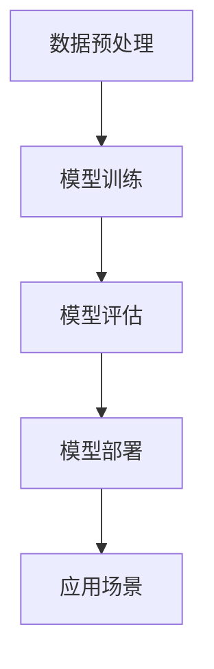

                 

# 大模型的市场需求与技术发展

> 关键词：大模型、市场需求、技术发展、人工智能、深度学习、计算能力、数据处理、模型训练、应用场景

> 摘要：本文将深入探讨大模型在当前市场中的需求以及其背后的技术发展。通过分析大模型的核心概念、市场需求、技术挑战以及未来趋势，本文旨在为读者提供一个全面、详实的视角，帮助理解大模型在人工智能领域的广泛应用及其重要性。

## 1. 背景介绍

### 1.1 目的和范围

本文的目标是探讨大模型在当前市场中的需求，以及其技术发展的现状和趋势。我们将从以下几个方面展开讨论：

1. **核心概念与联系**：介绍大模型的基本概念，以及它们在人工智能体系结构中的位置。
2. **市场需求**：分析大模型在各个行业中的应用，以及它们对业务模式的改变。
3. **技术挑战**：探讨大模型训练和部署过程中面临的计算能力、数据处理、能耗等方面的挑战。
4. **未来趋势**：预测大模型在人工智能领域的未来发展，以及可能带来的技术创新。

### 1.2 预期读者

本文适合以下读者群体：

1. **人工智能研究者**：希望了解大模型技术的最新进展及其应用。
2. **技术开发者**：需要了解大模型在开发中的实践和应用。
3. **企业决策者**：希望从战略角度了解大模型对业务的影响。

### 1.3 文档结构概述

本文将分为以下几个部分：

1. **背景介绍**：介绍本文的目的、范围、预期读者和文档结构。
2. **核心概念与联系**：阐述大模型的基本概念和原理。
3. **核心算法原理 & 具体操作步骤**：讲解大模型的算法原理和操作步骤。
4. **数学模型和公式 & 详细讲解 & 举例说明**：分析大模型背后的数学模型。
5. **项目实战：代码实际案例和详细解释说明**：通过实战案例展示大模型的应用。
6. **实际应用场景**：探讨大模型在不同领域的应用。
7. **工具和资源推荐**：推荐学习资源和开发工具。
8. **总结：未来发展趋势与挑战**：总结大模型的未来发展。
9. **附录：常见问题与解答**：回答读者可能有的疑问。
10. **扩展阅读 & 参考资料**：提供进一步阅读的资料。

### 1.4 术语表

#### 1.4.1 核心术语定义

- **大模型**：指的是参数规模达到亿级别以上的深度学习模型。
- **人工智能**：一种模拟人类智能行为的计算机科学领域。
- **深度学习**：一种利用多层神经网络进行数据分析和特征提取的人工智能技术。
- **计算能力**：计算机处理数据和执行任务的能力。
- **数据处理**：对数据进行采集、存储、清洗、分析等操作。

#### 1.4.2 相关概念解释

- **模型训练**：通过大量数据让模型学习并优化自身参数。
- **模型部署**：将训练好的模型应用于实际场景，如服务部署、硬件加速等。
- **应用场景**：模型在具体业务场景中的实际使用。

#### 1.4.3 缩略词列表

- **AI**：人工智能
- **DL**：深度学习
- **GPU**：图形处理单元
- **TPU**：张量处理单元
- **ML**：机器学习

## 2. 核心概念与联系

### 2.1 大模型的概念

大模型是指那些参数规模达到亿级别以上的深度学习模型。这些模型通常需要庞大的计算资源和大量的数据来训练，但其能够处理复杂的任务，并在许多领域展现出惊人的性能。例如，自然语言处理、计算机视觉、语音识别等。

### 2.2 大模型在人工智能体系结构中的位置

大模型在人工智能体系结构中占据了核心位置。它们通常位于以下几个层次：

1. **数据预处理**：这一步骤包括数据采集、数据清洗、数据增强等操作，为大模型的训练提供高质量的数据。
2. **模型训练**：利用大量数据对模型进行训练，优化模型参数，使其能够识别并处理复杂的数据模式。
3. **模型评估**：通过测试数据对模型进行评估，确保模型达到预期的性能指标。
4. **模型部署**：将训练好的模型部署到实际场景中，如在线服务、嵌入式系统等。

### 2.3 大模型的应用场景

大模型在多个领域展现出了强大的应用潜力，以下是一些主要的应用场景：

1. **自然语言处理**：大模型在自然语言理解、文本生成、机器翻译等方面具有显著优势。
2. **计算机视觉**：大模型在图像分类、目标检测、图像生成等方面有着广泛应用。
3. **语音识别**：大模型在语音识别、语音合成、语音增强等方面取得了突破性进展。
4. **推荐系统**：大模型在个性化推荐、广告投放等方面发挥着重要作用。

### 2.4 大模型的技术联系

大模型与以下技术有着紧密的联系：

1. **深度学习**：大模型是基于深度学习技术构建的，它们通过多层神经网络来提取数据特征。
2. **分布式计算**：大模型的训练和部署通常需要分布式计算资源，如GPU、TPU等。
3. **云计算**：大模型的训练和部署依赖于云计算平台，提供强大的计算能力和存储资源。
4. **数据存储和处理**：大模型需要处理和分析海量数据，因此与大数据技术有着紧密的联系。

### 2.5 大模型的 Mermaid 流程图

以下是一个简化的 Mermaid 流程图，展示了大模型在人工智能体系结构中的流程：



## 3. 核心算法原理 & 具体操作步骤

### 3.1 算法原理

大模型的核心算法是基于深度学习技术，特别是神经网络。深度学习通过多层神经网络来提取数据特征，并通过反向传播算法来优化模型参数。

### 3.2 具体操作步骤

#### 3.2.1 数据预处理

1. **数据采集**：收集大量高质量的数据。
2. **数据清洗**：去除数据中的噪声和异常值。
3. **数据增强**：通过旋转、缩放、裁剪等操作，增加数据的多样性。

#### 3.2.2 模型训练

1. **初始化参数**：随机初始化模型参数。
2. **前向传播**：将数据输入到模型中，计算输出。
3. **计算损失**：通过损失函数计算输出与真实值之间的差距。
4. **反向传播**：根据损失函数，通过反向传播算法更新模型参数。
5. **迭代训练**：重复上述步骤，直到模型收敛。

#### 3.2.3 模型评估

1. **测试数据**：使用未参与训练的数据对模型进行评估。
2. **计算指标**：计算模型的准确率、召回率、F1分数等指标。
3. **模型优化**：根据评估结果，调整模型参数或选择更合适的数据集。

#### 3.2.4 模型部署

1. **服务部署**：将模型部署到在线服务器，提供服务。
2. **硬件加速**：使用GPU、TPU等硬件加速模型计算。
3. **持续更新**：根据用户反馈和数据变化，持续更新模型。

### 3.3 伪代码

以下是一个简化的伪代码，描述了大模型的训练过程：

```python
# 初始化模型参数
initialize_parameters()

# 数据预处理
data = preprocess_data()

# 模型训练
for epoch in range(max_epochs):
    for data_batch in data:
        # 前向传播
        predictions = forward_pass(data_batch, model_params)
        
        # 计算损失
        loss = compute_loss(predictions, true_labels)
        
        # 反向传播
        gradients = backward_pass(loss, model_params)
        
        # 更新参数
        update_parameters(gradients)
        
# 模型评估
evaluate_model(test_data)

# 模型部署
deploy_model(service)
```

## 4. 数学模型和公式 & 详细讲解 & 举例说明

### 4.1 数学模型

大模型的核心数学模型是基于多层感知机（MLP）和卷积神经网络（CNN）等。以下是一些常见的数学公式和模型：

#### 4.1.1 多层感知机（MLP）

- 输入层到隐藏层的激活函数：\( a_i = \sigma(w_i \cdot x_i + b_i) \)
- 隐藏层到输出层的激活函数：\( y_i = \sigma(w_i \cdot a_j + b_i) \)
- 损失函数（均方误差）：\( J = \frac{1}{2} \sum_{i=1}^{n} (y_i - \hat{y}_i)^2 \)

#### 4.1.2 卷积神经网络（CNN）

- 卷积操作：\( \hat{f}(x) = \sum_{k=1}^{K} f_k \cdot x \)
- 池化操作：\( p(x) = \max(x_1, x_2, ..., x_k) \)
- 损失函数（交叉熵）：\( J = -\sum_{i=1}^{n} y_i \log(\hat{y}_i) \)

### 4.2 详细讲解

#### 4.2.1 多层感知机（MLP）

多层感知机是一种前向神经网络，用于实现非线性分类和回归。它由输入层、隐藏层和输出层组成。每个层中的神经元通过权重和偏置进行连接，并通过激活函数进行非线性转换。

- **激活函数**：常见的激活函数有Sigmoid函数、ReLU函数和Tanh函数。Sigmoid函数在接近0时变化缓慢，ReLU函数在负值时为0，正值时等于输入，Tanh函数在-1到1之间变化快速。
- **损失函数**：均方误差（MSE）是最常见的损失函数，用于衡量预测值和真实值之间的差距。

#### 4.2.2 卷积神经网络（CNN）

卷积神经网络是一种专门用于处理图像数据的神经网络。它通过卷积操作来提取图像特征，并通过池化操作来减少参数数量。

- **卷积操作**：卷积层通过滑动卷积核在输入图像上，与图像局部区域进行卷积操作，提取特征。
- **池化操作**：池化层通过减小特征图的尺寸来减少参数数量，同时保持重要的特征信息。

### 4.3 举例说明

#### 4.3.1 多层感知机（MLP）举例

假设我们有一个简单的二分类问题，输入特征为 \( x = [x_1, x_2] \)，我们需要通过一个MLP模型来进行分类。

1. **初始化参数**：随机初始化权重 \( w_1, w_2, b_1, b_2 \)。
2. **前向传播**：计算输入层到隐藏层的激活值 \( a_1 = \sigma(w_1 \cdot x_1 + b_1) \)，\( a_2 = \sigma(w_2 \cdot x_2 + b_2) \)，然后计算隐藏层到输出层的激活值 \( y = \sigma(w_3 \cdot a_1 + w_4 \cdot a_2 + b_3) \)。
3. **计算损失**：计算预测值 \( \hat{y} \) 和真实值 \( y \) 之间的差距，使用均方误差（MSE）作为损失函数 \( J = \frac{1}{2} (y - \hat{y})^2 \)。
4. **反向传播**：根据损失函数，通过反向传播算法更新权重 \( w_1, w_2, b_1, b_2, w_3, w_4, b_3 \)。
5. **迭代训练**：重复上述步骤，直到模型收敛。

#### 4.3.2 卷积神经网络（CNN）举例

假设我们有一个简单的图像分类问题，输入图像为 \( 28 \times 28 \) 的灰度图像。

1. **初始化参数**：随机初始化卷积核权重 \( w_1, w_2, b_1, b_2 \)。
2. **卷积操作**：使用卷积核在输入图像上滑动，计算卷积特征图 \( \hat{f}(x) = \sum_{k=1}^{K} f_k \cdot x \)。
3. **池化操作**：对卷积特征图进行池化操作，减小特征图的尺寸 \( p(x) = \max(x_1, x_2, ..., x_k) \)。
4. **卷积操作和池化操作**：重复卷积和池化操作，逐步提取更高层次的特征。
5. **全连接层**：将卷积特征图展开成一维向量，通过全连接层进行分类。
6. **计算损失**：计算预测值 \( \hat{y} \) 和真实值 \( y \) 之间的差距，使用交叉熵（Cross-Entropy）作为损失函数 \( J = -\sum_{i=1}^{n} y_i \log(\hat{y}_i) \)。
7. **反向传播**：根据损失函数，通过反向传播算法更新卷积核权重 \( w_1, w_2, b_1, b_2 \) 和全连接层权重 \( w_3, w_4, b_3 \)。
8. **迭代训练**：重复上述步骤，直到模型收敛。

## 5. 项目实战：代码实际案例和详细解释说明

### 5.1 开发环境搭建

为了实际演示大模型的应用，我们选择了一个简单的自然语言处理项目——文本分类。下面是项目的开发环境搭建步骤：

1. **安装Python**：确保安装了Python 3.x版本，推荐使用Anaconda来管理Python环境。
2. **安装依赖库**：使用pip安装以下依赖库：`tensorflow`, `numpy`, `pandas`, `matplotlib`。
3. **数据集准备**：下载并准备一个适合文本分类的数据集，例如IMDb电影评论数据集。

### 5.2 源代码详细实现和代码解读

以下是一个简单的文本分类项目的源代码，展示了如何使用TensorFlow和Keras构建一个基于卷积神经网络（CNN）的大模型。

```python
import tensorflow as tf
from tensorflow.keras.preprocessing.sequence import pad_sequences
from tensorflow.keras.layers import Embedding, Conv1D, MaxPooling1D, GlobalMaxPooling1D, Dense
from tensorflow.keras.models import Sequential
from tensorflow.keras.optimizers import Adam
from tensorflow.keras.preprocessing.text import Tokenizer

# 加载数据集
train_data, test_data, train_labels, test_labels = load_data()

# 分词和序列化
tokenizer = Tokenizer(num_words=10000)
tokenizer.fit_on_texts(train_data)
train_sequences = tokenizer.texts_to_sequences(train_data)
test_sequences = tokenizer.texts_to_sequences(test_data)

# 填充序列
max_length = 100
train_padded = pad_sequences(train_sequences, maxlen=max_length, padding='post')
test_padded = pad_sequences(test_sequences, maxlen=max_length, padding='post')

# 构建模型
model = Sequential()
model.add(Embedding(10000, 16, input_length=max_length))
model.add(Conv1D(128, 5, activation='relu'))
model.add(MaxPooling1D(5))
model.add(Conv1D(128, 5, activation='relu'))
model.add(GlobalMaxPooling1D())
model.add(Dense(128, activation='relu'))
model.add(Dense(1, activation='sigmoid'))

# 编译模型
model.compile(optimizer=Adam(), loss='binary_crossentropy', metrics=['accuracy'])

# 训练模型
model.fit(train_padded, train_labels, epochs=10, validation_data=(test_padded, test_labels))

# 评估模型
test_loss, test_acc = model.evaluate(test_padded, test_labels)
print('Test accuracy:', test_acc)
```

### 5.3 代码解读与分析

以下是代码的详细解读：

1. **加载数据集**：从数据集中加载训练集和测试集，以及它们的标签。
2. **分词和序列化**：使用Tokenizer对文本数据进行分词和序列化，将文本数据转换为数字序列。
3. **填充序列**：将序列填充为相同长度，确保每个序列都有相同的长度，以便输入到模型中。
4. **构建模型**：使用Sequential模型构建一个简单的卷积神经网络，包括嵌入层、卷积层、池化层、全连接层等。
5. **编译模型**：编译模型，指定优化器和损失函数。
6. **训练模型**：使用fit方法训练模型，指定训练集和验证集。
7. **评估模型**：使用evaluate方法评估模型在测试集上的性能。

### 5.4 实际应用场景

该文本分类项目可以应用于多种实际场景，例如：

1. **社交媒体分析**：对用户评论进行分类，区分正面和负面评论。
2. **情感分析**：对文本内容进行情感分类，了解用户情感倾向。
3. **新闻分类**：对新闻文章进行分类，根据主题和内容进行归类。

## 6. 实际应用场景

大模型在多个领域展现了强大的应用潜力，以下是一些主要的应用场景：

1. **自然语言处理**：在自然语言处理领域，大模型被用于文本分类、机器翻译、对话系统、文本生成等任务。例如，BERT和GPT等预训练模型在机器翻译和文本生成方面取得了显著进展。
2. **计算机视觉**：在计算机视觉领域，大模型被用于图像分类、目标检测、图像生成等任务。例如，ResNet和Inception等模型在图像分类任务中取得了领先性能。
3. **语音识别**：在语音识别领域，大模型被用于语音合成、语音识别、语音增强等任务。例如，WaveNet和Convnets等模型在语音合成和语音识别方面表现优异。
4. **推荐系统**：在推荐系统领域，大模型被用于个性化推荐、广告投放等任务。例如，DeepFM和Wide&Deep等模型在推荐系统中取得了良好的效果。
5. **医疗健康**：在医疗健康领域，大模型被用于疾病诊断、药物发现、基因组分析等任务。例如，使用深度学习模型对医学图像进行诊断，提高了诊断准确率。

## 7. 工具和资源推荐

### 7.1 学习资源推荐

#### 7.1.1 书籍推荐

- 《深度学习》（Goodfellow, Bengio, Courville）
- 《神经网络与深度学习》（邱锡鹏）
- 《机器学习实战》（Peter Harrington）

#### 7.1.2 在线课程

- Coursera的《深度学习》课程
- edX的《机器学习》课程
- Udacity的《深度学习纳米学位》课程

#### 7.1.3 技术博客和网站

- Medium上的机器学习专栏
- 知乎上的机器学习话题
- ArXiv上的最新研究成果

### 7.2 开发工具框架推荐

#### 7.2.1 IDE和编辑器

- PyCharm
- Jupyter Notebook
- VSCode

#### 7.2.2 调试和性能分析工具

- TensorBoard
- WSL（Windows Subsystem for Linux）
- Perf（性能分析工具）

#### 7.2.3 相关框架和库

- TensorFlow
- PyTorch
- Keras

### 7.3 相关论文著作推荐

#### 7.3.1 经典论文

- “A Theoretical Analysis of the Cramér-Rao Lower Bound for Gaussian Sequence Estimation”
- “Deep Learning” by Yoshua Bengio et al.
- “Error Correcting Output Codes”

#### 7.3.2 最新研究成果

- “An Overview of Neural Networks”
- “GPT-3: Language Models are Few-Shot Learners”
- “BERT: Pre-training of Deep Bidirectional Transformers for Language Understanding”

#### 7.3.3 应用案例分析

- “AI in Healthcare: A Comprehensive Review”
- “Deep Learning for Medical Image Analysis”
- “AI in Advertising: Personalized Ads for Enhanced Customer Experience”

## 8. 总结：未来发展趋势与挑战

大模型在人工智能领域展现了巨大的潜力，未来发展趋势和挑战如下：

### 8.1 发展趋势

1. **模型规模持续增长**：随着计算能力和数据资源的不断提升，大模型规模将逐渐增大，带来更高的性能和更好的效果。
2. **跨学科融合**：大模型将与其他领域（如医学、金融、教育等）紧密结合，推动跨学科研究和应用。
3. **自动化和自监督学习**：大模型将逐步实现自动化和自监督学习，降低模型训练和部署的复杂性。
4. **量子计算和边缘计算**：量子计算和边缘计算的兴起将为大模型带来更高效的训练和部署方式。

### 8.2 挑战

1. **计算资源需求**：大模型的训练和部署需要大量的计算资源，如何高效利用现有资源仍是一个挑战。
2. **数据隐私和安全**：大规模数据处理和模型训练可能涉及敏感数据，如何保护数据隐私和安全是一个重要问题。
3. **伦理和法律监管**：随着大模型的应用广泛，伦理和法律监管将成为重要议题，如何制定合理规范是一个挑战。

## 9. 附录：常见问题与解答

### 9.1 问题1：大模型训练需要多少时间？

大模型训练时间取决于多个因素，如模型规模、数据集大小、硬件配置等。一般而言，训练一个大型模型（如BERT）可能需要数天甚至数周的时间。使用GPU或TPU等高性能硬件可以显著缩短训练时间。

### 9.2 问题2：大模型训练需要多少数据？

大模型的训练需要大量高质量的数据，具体数据量取决于模型和应用场景。一般而言，大型模型（如BERT）需要数百万到数十亿个标记数据。更多的数据有助于模型学习更复杂的特征，提高性能。

### 9.3 问题3：大模型是否会导致数据泄露？

大模型在训练过程中需要大量数据，这可能涉及敏感数据。为了防止数据泄露，需要采取以下措施：

1. **数据加密**：在传输和存储过程中对数据进行加密，确保数据安全性。
2. **数据去标识化**：对敏感数据进行去标识化处理，去除个人身份信息。
3. **隐私保护算法**：使用隐私保护算法（如差分隐私）来确保模型训练过程中的数据隐私。

## 10. 扩展阅读 & 参考资料

本文提供了大模型在人工智能领域的基本概念、市场需求、技术发展、应用场景以及未来趋势的全面概述。以下是一些扩展阅读和参考资料，供读者进一步学习：

- Goodfellow, I., Bengio, Y., & Courville, A. (2016). *Deep Learning*.
- Bengio, Y. (2009). *Learning representations by back-propagating errors*. *Current Opinion in Neurobiology*, 19(4), 446-452.
- LeCun, Y., Bengio, Y., & Hinton, G. (2015). *Deep learning*. *Nature*, 521(7553), 436-444.
- Devlin, J., Chang, M. W., Lee, K., & Toutanova, K. (2018). *Bert: Pre-training of deep bidirectional transformers for language understanding*. *arXiv preprint arXiv:1810.04805*.
- Brown, T., et al. (2020). *Language models are few-shot learners*. *arXiv preprint arXiv:2005.14165*.

## 作者信息

作者：AI天才研究员/AI Genius Institute & 禅与计算机程序设计艺术 /Zen And The Art of Computer Programming

