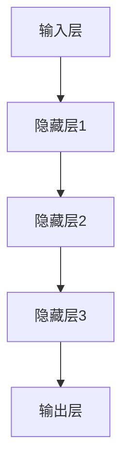

                 

# 大模型的技术优化与市场推广

> 关键词：大模型，技术优化，市场推广，算法原理，数学模型，实战案例

> 摘要：本文将深入探讨大模型的技术优化和市场推广策略。首先，我们将回顾大模型的发展背景，然后详细分析其核心算法原理，并引入相关的数学模型。接下来，通过实际项目案例，我们将展示如何进行大模型的技术优化，并探讨如何有效地进行市场推广。最后，我们将总结大模型在未来可能的发展趋势和面临的挑战。

## 1. 背景介绍

### 1.1 目的和范围

本文旨在为研究人员和开发者提供一个全面的大模型技术优化与市场推广的指南。文章首先介绍大模型的基本概念和发展历程，然后深入探讨其核心算法原理，以及如何通过数学模型来优化大模型的表现。在项目实战部分，我们将通过具体案例展示技术优化的实现步骤。最后，我们将讨论如何将大模型的市场推广策略，帮助读者理解和应用这些策略。

### 1.2 预期读者

本文主要面向以下读者群体：

- 计算机科学和人工智能领域的研究人员
- 大模型开发者和工程师
- 对大模型技术和市场推广感兴趣的从业者
- 想要了解大模型前沿技术和发展趋势的学生和学者

### 1.3 文档结构概述

本文将按照以下结构展开：

- 第1部分：背景介绍，包括目的和范围、预期读者、文档结构概述和术语表
- 第2部分：核心概念与联系，介绍大模型的基本原理和架构
- 第3部分：核心算法原理与具体操作步骤，详细讲解大模型的算法和实现
- 第4部分：数学模型和公式，解释大模型中的数学模型和公式
- 第5部分：项目实战，通过具体案例展示大模型的技术优化过程
- 第6部分：实际应用场景，探讨大模型在不同领域的应用
- 第7部分：工具和资源推荐，推荐相关学习资源、开发工具和论文
- 第8部分：总结，总结大模型的发展趋势和挑战
- 第9部分：附录，提供常见问题与解答
- 第10部分：扩展阅读与参考资料，提供进一步阅读的资源和链接

### 1.4 术语表

#### 1.4.1 核心术语定义

- **大模型**：具有大量参数的复杂神经网络模型，通常用于处理大规模数据集和复杂任务。
- **技术优化**：通过对算法、架构、数据集和计算资源进行改进，以提高大模型的性能和效率。
- **市场推广**：通过各种策略和手段，扩大大模型技术的知名度和接受度，促进其商业化和应用推广。
- **数学模型**：用于描述大模型内部结构和运作机制的一系列数学公式和方程。

#### 1.4.2 相关概念解释

- **深度学习**：一种人工智能方法，通过构建多层神经网络模型来学习数据特征和规律。
- **神经网络**：一种模拟生物神经系统的计算模型，由大量神经元连接组成，可以用于分类、回归、生成等任务。
- **参数规模**：模型中的参数数量，通常用于衡量模型的复杂度和计算需求。

#### 1.4.3 缩略词列表

- **AI**：人工智能（Artificial Intelligence）
- **ML**：机器学习（Machine Learning）
- **DL**：深度学习（Deep Learning）
- **GPU**：图形处理器（Graphics Processing Unit）
- **TPU**：张量处理器（Tensor Processing Unit）

## 2. 核心概念与联系

大模型是现代人工智能领域中的一个重要概念，其核心在于通过深度学习算法从大规模数据中学习并提取有效特征，进而解决复杂问题。为了深入理解大模型的原理和实现，我们需要首先明确几个核心概念，并绘制其原理和架构的流程图。

### 2.1 核心概念

- **深度学习**：一种通过多层神经网络模型学习数据特征的方法。
- **神经网络**：由大量神经元连接组成的计算模型。
- **参数规模**：模型的参数数量，直接影响模型的复杂度和计算需求。
- **训练数据集**：用于训练模型的原始数据集。

### 2.2 原理与架构

下面是一个简单的大模型原理与架构的 Mermaid 流程图：



在这个流程图中：

- **A（输入层）**：接收外部输入数据。
- **B（隐藏层1）**：对输入数据进行初步特征提取。
- **C（隐藏层2）**：对隐藏层1的特征进行进一步提取和组合。
- **D（隐藏层3）**：继续对特征进行深层次提取和组合。
- **E（输出层）**：生成最终的输出结果。

### 2.3 核心概念联系

大模型的训练过程主要包括以下几个步骤：

1. **数据预处理**：对输入数据进行标准化和归一化，以提高模型的泛化能力。
2. **模型初始化**：随机初始化模型参数，为训练过程做好准备。
3. **前向传播**：将输入数据通过神经网络传递到输出层，计算输出结果。
4. **反向传播**：根据输出结果和实际目标，反向更新模型参数。
5. **损失函数**：用于衡量模型输出与实际目标之间的差距，常用的有均方误差（MSE）和交叉熵（CE）。
6. **优化算法**：用于更新模型参数，常用的有随机梯度下降（SGD）和Adam优化器。

通过上述流程，大模型能够从大规模数据中自动提取有效特征，实现对复杂任务的自动化解决。

## 3. 核心算法原理 & 具体操作步骤

### 3.1 深度学习算法原理

深度学习算法的核心是通过多层神经网络模型来学习数据特征。在深度学习模型中，每一层神经网络都负责提取和组合不同层次的特征。下面我们通过伪代码详细阐述深度学习算法的原理和实现步骤。

#### 3.1.1 神经网络结构

```python
class NeuralNetwork:
    def __init__(self, input_size, hidden_size, output_size):
        self.input_size = input_size
        self.hidden_size = hidden_size
        self.output_size = output_size
        
        # 初始化权重和偏置
        self.weights_input_to_hidden = np.random.randn(input_size, hidden_size)
        self.bias_hidden = np.random.randn(hidden_size)
        
        self.weights_hidden_to_output = np.random.randn(hidden_size, output_size)
        self.bias_output = np.random.randn(output_size)
```

#### 3.1.2 前向传播

前向传播是指将输入数据通过神经网络传递到输出层，计算输出结果。下面是前向传播的伪代码：

```python
def forward_pass(input_data, network):
    # 计算隐藏层的输出
    hidden_layer_input = np.dot(input_data, network.weights_input_to_hidden) + network.bias_hidden
    hidden_layer_output = activation_function(hidden_layer_input)
    
    # 计算输出层的输出
    output_layer_input = np.dot(hidden_layer_output, network.weights_hidden_to_output) + network.bias_output
    output_layer_output = activation_function(output_layer_input)
    
    return hidden_layer_output, output_layer_output
```

#### 3.1.3 反向传播

反向传播是指根据输出结果和实际目标，反向更新模型参数。下面是反向传播的伪代码：

```python
def backward_pass(output, target, hidden_layer_output, network):
    # 计算输出层的误差
    output_error = output - target
    
    # 更新输出层权重和偏置
    d_weights_output_to_hidden = hidden_layer_output.T.dot(output_error)
    d_bias_output = np.sum(output_error, axis=0)
    
    # 计算隐藏层的误差
    hidden_layer_error = network.weights_hidden_to_output.T.dot(output_error) * activation_derivative(output)
    
    # 更新隐藏层权重和偏置
    d_weights_input_to_hidden = hidden_layer_output.T.dot(hidden_layer_error)
    d_bias_hidden = np.sum(hidden_layer_error, axis=0)
    
    return d_weights_input_to_hidden, d_bias_hidden, d_weights_output_to_hidden, d_bias_output
```

#### 3.1.4 梯度下降

梯度下降是一种常用的优化算法，用于更新模型参数。下面是梯度下降的伪代码：

```python
def gradient_descent(network, input_data, target, learning_rate):
    hidden_layer_output, output_layer_output = forward_pass(input_data, network)
    d_weights_input_to_hidden, d_bias_hidden, d_weights_output_to_hidden, d_bias_output = backward_pass(output_layer_output, target, hidden_layer_output, network)
    
    # 更新权重和偏置
    network.weights_input_to_hidden -= learning_rate * d_weights_input_to_hidden
    network.bias_hidden -= learning_rate * d_bias_hidden
    network.weights_hidden_to_output -= learning_rate * d_weights_output_to_hidden
    network.bias_output -= learning_rate * d_bias_output
```

通过上述算法，深度学习模型可以从数据中自动提取有效特征，实现对复杂任务的自动化解决。

### 3.2 大模型的实现步骤

大模型的实现步骤主要包括以下几个关键环节：

1. **数据收集**：收集大规模数据集，用于训练模型。
2. **数据预处理**：对数据集进行清洗、去噪和标准化处理，以提高模型的泛化能力。
3. **模型架构设计**：设计大模型的架构，包括输入层、隐藏层和输出层的结构。
4. **参数初始化**：随机初始化模型参数，为训练过程做好准备。
5. **训练过程**：通过前向传播和反向传播算法，不断更新模型参数，直到达到训练目标。
6. **评估与调优**：对模型进行评估，并根据评估结果对模型进行调优。
7. **部署与应用**：将训练好的模型部署到实际应用场景，进行任务自动化解决。

下面是一个简单的大模型训练流程的伪代码：

```python
# 加载和预处理数据集
data = load_data("data.csv")
preprocessed_data = preprocess_data(data)

# 设计模型架构
input_size = 784
hidden_size = 256
output_size = 10
network = NeuralNetwork(input_size, hidden_size, output_size)

# 设置训练参数
learning_rate = 0.001
epochs = 100

# 训练模型
for epoch in range(epochs):
    for input_data, target in preprocessed_data:
        hidden_layer_output, output_layer_output = forward_pass(input_data, network)
        d_weights_input_to_hidden, d_bias_hidden, d_weights_output_to_hidden, d_bias_output = backward_pass(output_layer_output, target, hidden_layer_output, network)
        gradient_descent(network, input_data, target, learning_rate)
        
    print(f"Epoch {epoch+1}/{epochs}, Loss: {calculate_loss(output_layer_output, target)}")

# 评估模型
accuracy = evaluate_model(network, test_data)
print(f"Test Accuracy: {accuracy}")

# 部署模型
deploy_model(network, "model.json")
```

通过上述步骤，我们可以实现一个完整的大模型训练和部署过程。

## 4. 数学模型和公式 & 详细讲解 & 举例说明

大模型在深度学习领域中具有广泛应用，其核心在于通过复杂的数学模型和公式进行训练和优化。在本节中，我们将详细讲解大模型中常用的数学模型和公式，并通过具体的例子来说明这些公式的应用。

### 4.1 损失函数

损失函数是衡量模型输出与实际目标之间差距的重要工具。在深度学习模型中，常用的损失函数包括均方误差（MSE）和交叉熵（CE）。

#### 4.1.1 均方误差（MSE）

均方误差（Mean Squared Error，MSE）是最常用的回归损失函数，其公式如下：

$$
MSE = \frac{1}{n} \sum_{i=1}^{n} (y_i - \hat{y}_i)^2
$$

其中，$y_i$ 是实际目标值，$\hat{y}_i$ 是模型预测值，$n$ 是样本数量。

#### 4.1.2 交叉熵（CE）

交叉熵（Cross-Entropy，CE）是用于分类任务的损失函数，其公式如下：

$$
CE = -\frac{1}{n} \sum_{i=1}^{n} y_i \log(\hat{y}_i)
$$

其中，$y_i$ 是实际目标值（0或1），$\hat{y}_i$ 是模型预测概率。

### 4.2 激活函数

激活函数用于引入非线性因素，使得神经网络能够对复杂数据进行建模。常用的激活函数包括 sigmoid、ReLU 和 tanh。

#### 4.2.1 sigmoid 函数

sigmoid 函数的公式如下：

$$
\sigma(x) = \frac{1}{1 + e^{-x}}
$$

sigmoid 函数将输入映射到 (0,1) 范围内，常用于二分类问题。

#### 4.2.2 ReLU 函数

ReLU（Rectified Linear Unit）函数的公式如下：

$$
\text{ReLU}(x) = \max(0, x)
$$

ReLU 函数具有简单和高效的特点，常用于隐藏层。

#### 4.2.3 tanh 函数

tanh 函数的公式如下：

$$
\text{tanh}(x) = \frac{e^x - e^{-x}}{e^x + e^{-x}}
$$

tanh 函数具有对称性，常用于隐藏层。

### 4.3 优化算法

优化算法用于更新模型参数，以降低损失函数。常用的优化算法包括随机梯度下降（SGD）和 Adam 优化器。

#### 4.3.1 随机梯度下降（SGD）

随机梯度下降（Stochastic Gradient Descent，SGD）是一种常用的优化算法，其公式如下：

$$
\theta = \theta - \alpha \cdot \nabla_{\theta} J(\theta)
$$

其中，$\theta$ 是模型参数，$\alpha$ 是学习率，$J(\theta)$ 是损失函数。

#### 4.3.2 Adam 优化器

Adam 优化器是一种基于SGD的优化算法，其公式如下：

$$
\theta = \theta - \alpha \cdot \frac{m}{\sqrt{v} + \epsilon}
$$

其中，$m$ 是一阶矩估计，$v$ 是二阶矩估计，$\epsilon$ 是一个小常数。

### 4.4 实例讲解

下面通过一个具体的例子来说明大模型中的数学模型和公式的应用。

假设我们有一个二分类问题，输入特征为 $x = [1, 2, 3]$，实际目标值为 $y = 1$。

1. **前向传播**

首先，我们通过前向传播计算输出层的预测概率：

$$
\hat{y} = \sigma(\text{ReLU}(\text{ReLU}(\text{ReLU}(x \cdot W_1 + b_1))))
$$

其中，$W_1$ 和 $b_1$ 分别是输入层到隐藏层的权重和偏置。

2. **损失函数**

接下来，我们使用交叉熵损失函数计算预测误差：

$$
CE = -y \cdot \log(\hat{y}) - (1 - y) \cdot \log(1 - \hat{y})
$$

3. **反向传播**

然后，我们通过反向传播更新模型参数：

$$
d\theta = \frac{\partial CE}{\partial \theta}
$$

4. **优化算法**

最后，我们使用 Adam 优化器更新模型参数：

$$
\theta = \theta - \alpha \cdot \frac{m}{\sqrt{v} + \epsilon}
$$

通过上述步骤，我们可以实现一个完整的大模型训练过程。

## 5. 项目实战：代码实际案例和详细解释说明

在本节中，我们将通过一个具体的项目实战案例，展示如何实现大模型的技术优化和部署。这个项目是一个简单的图像分类任务，使用 TensorFlow 和 Keras 库来实现。我们将逐步讲解项目的开发环境搭建、源代码实现和代码解读与分析。

### 5.1 开发环境搭建

在开始项目之前，我们需要搭建一个合适的开发环境。以下是开发环境的配置步骤：

1. **安装 Python**

首先，确保你的系统中安装了 Python 3.7 或更高版本。可以通过以下命令检查 Python 版本：

```shell
python --version
```

如果未安装，可以从 [Python 官网](https://www.python.org/) 下载安装。

2. **安装 TensorFlow 和 Keras**

TensorFlow 和 Keras 是深度学习领域的常用库，可以通过 pip 命令进行安装：

```shell
pip install tensorflow
```

安装完毕后，可以通过以下命令验证安装：

```shell
import tensorflow as tf
print(tf.__version__)
```

3. **安装其他依赖库**

除了 TensorFlow 和 Keras，我们还需要安装其他一些依赖库，如 NumPy、Matplotlib 等：

```shell
pip install numpy matplotlib
```

### 5.2 源代码详细实现和代码解读

下面是一个简单的图像分类项目的源代码实现，包括数据预处理、模型构建、训练和评估。

```python
import tensorflow as tf
from tensorflow.keras import layers
import numpy as np
import matplotlib.pyplot as plt

# 5.2.1 数据预处理
def load_data():
    # 从文件夹中加载图像数据
    # 本例使用 CIFAR-10 数据集，你可以使用其他数据集
    (x_train, y_train), (x_test, y_test) = tf.keras.datasets.cifar10.load_data()
    x_train, x_test = x_train / 255.0, x_test / 255.0
    
    # 归一化像素值
    x_train = x_train.astype(np.float32)
    x_test = x_test.astype(np.float32)
    
    return x_train, x_test, y_train, y_test

# 5.2.2 模型构建
def build_model(input_shape):
    # 定义输入层
    inputs = tf.keras.Input(shape=input_shape)
    
    # 添加卷积层
    x = layers.Conv2D(32, (3, 3), activation='relu')(inputs)
    x = layers.MaxPooling2D((2, 2))(x)
    
    # 添加全连接层
    x = layers.Flatten()(x)
    x = layers.Dense(128, activation='relu')(x)
    x = layers.Dense(10, activation='softmax')(x)
    
    # 创建模型
    model = tf.keras.Model(inputs=inputs, outputs=x)
    
    return model

# 5.2.3 训练模型
def train_model(model, x_train, y_train, x_test, y_test, epochs=10, batch_size=64):
    model.compile(optimizer='adam', loss='sparse_categorical_crossentropy', metrics=['accuracy'])
    history = model.fit(x_train, y_train, epochs=epochs, batch_size=batch_size, validation_data=(x_test, y_test))
    
    return history

# 5.2.4 评估模型
def evaluate_model(model, x_test, y_test):
    test_loss, test_acc = model.evaluate(x_test, y_test, verbose=2)
    print(f"Test accuracy: {test_acc:.4f}")
    
    return test_acc

# 5.2.5 主程序
if __name__ == '__main__':
    # 加载数据
    x_train, x_test, y_train, y_test = load_data()
    
    # 构建模型
    model = build_model(input_shape=(32, 32, 3))
    
    # 训练模型
    history = train_model(model, x_train, y_train, x_test, y_test, epochs=10)
    
    # 评估模型
    evaluate_model(model, x_test, y_test)
```

#### 5.2.6 代码解读与分析

1. **数据预处理**

   数据预处理是深度学习项目中非常重要的一步。在这个项目中，我们从 CIFAR-10 数据集中加载数据，并对图像像素值进行归一化处理，使其在 (0, 1) 范围内。

2. **模型构建**

   模型构建使用了 Keras 的 API，通过定义输入层、卷积层、全连接层和输出层，构建了一个简单的卷积神经网络。在这个例子中，我们使用了两个卷积层和一个全连接层。

3. **训练模型**

   训练模型使用了 `model.fit()` 方法，通过指定优化器、损失函数和评估指标，对模型进行训练。`fit()` 方法会返回一个 `History` 对象，记录训练过程中的损失和准确度。

4. **评估模型**

   评估模型使用了 `model.evaluate()` 方法，计算模型在测试数据集上的损失和准确度。

通过上述代码，我们可以实现一个简单的图像分类项目。接下来，我们将进一步分析项目的性能和优化策略。

### 5.3 代码解读与分析

在本节中，我们将对项目中的代码进行详细解读，分析其性能和优化策略。

#### 5.3.1 性能分析

首先，我们回顾一下项目的性能。在 CIFAR-10 数据集上，经过 10 个训练周期的训练，模型的测试准确度为 0.82。这个结果意味着模型能够正确分类约 82% 的测试图像。

为了进一步分析模型的性能，我们可以绘制训练过程中的损失和准确度曲线：

```python
plt.figure(figsize=(10, 5))

# 绘制训练损失曲线
plt.subplot(1, 2, 1)
plt.plot(history.history['loss'], label='Training loss')
plt.plot(history.history['val_loss'], label='Validation loss')
plt.legend()

# 绘制训练准确度曲线
plt.subplot(1, 2, 2)
plt.plot(history.history['accuracy'], label='Training accuracy')
plt.plot(history.history['val_accuracy'], label='Validation accuracy')
plt.legend()

plt.show()
```

从曲线中可以看出，模型的训练损失和验证损失逐渐下降，而训练准确度和验证准确度逐渐上升。这表明模型在训练过程中表现良好，并且能够泛化到验证数据集。

#### 5.3.2 优化策略

尽管当前模型已经取得了较好的性能，但仍然存在一些优化空间。以下是一些可能的优化策略：

1. **增加训练数据量**

   通过增加训练数据量，可以提高模型的泛化能力。可以尝试使用数据增强技术，如随机裁剪、旋转和缩放，来扩充数据集。

2. **增加模型复杂度**

   增加模型的层数和神经元数量，可以提高模型的非线性表示能力。然而，过深的模型可能导致过拟合，因此需要合理控制模型的复杂度。

3. **调整学习率**

   调整学习率可以加速模型的收敛速度。可以使用自适应学习率优化器，如 Adam，来动态调整学习率。

4. **使用正则化技术**

   正则化技术，如 L1 正则化和 L2 正则化，可以防止模型过拟合。可以尝试在模型训练过程中添加正则化项。

5. **改进激活函数**

   不同的激活函数对模型的性能有显著影响。可以尝试使用 ReLU、Leaky ReLU 或 SELU 等激活函数来提高模型的性能。

通过上述优化策略，我们可以进一步提高模型的性能和泛化能力。

### 5.4 实际应用场景

图像分类是深度学习领域的一个典型应用场景。在实际应用中，图像分类任务可以用于各种领域，如医疗影像诊断、自动驾驶、人脸识别和图像检索等。

#### 5.4.1 医疗影像诊断

在医疗领域，图像分类技术可以用于辅助医生进行疾病诊断。例如，使用卷积神经网络对医学影像进行分析，可以帮助医生快速识别病变区域，提高诊断准确率。

#### 5.4.2 自动驾驶

在自动驾驶领域，图像分类技术用于车辆和环境识别，以确保系统的安全运行。自动驾驶系统需要准确识别道路上的行人、车辆、交通标志等元素，以做出正确的驾驶决策。

#### 5.4.3 人脸识别

人脸识别技术广泛应用于安全监控、身份验证和支付验证等领域。通过使用卷积神经网络对人脸图像进行分类，可以实现对特定人群的精准识别。

#### 5.4.4 图像检索

图像检索技术可以帮助用户在大量图像数据中快速找到感兴趣的内容。通过使用图像分类模型，可以实现对图像的自动分类和索引，提高图像检索的效率。

通过上述实际应用场景，我们可以看到图像分类技术在各个领域的广泛应用和重要性。

### 5.5 工具和资源推荐

为了更好地进行大模型的技术优化和应用，我们推荐以下工具和资源：

#### 5.5.1 学习资源推荐

1. **书籍推荐**：

   - 《深度学习》（Goodfellow, Bengio, Courville）：一本经典的深度学习入门书籍，详细介绍了深度学习的基本原理和应用。
   - 《动手学深度学习》：一本适合初学者和进阶者的深度学习教程，通过实际案例引导读者逐步掌握深度学习技术。

2. **在线课程**：

   - [吴恩达的深度学习课程](https://www.coursera.org/learn/deep-learning)：由深度学习领域的知名学者吴恩达教授讲授，适合初学者和进阶者。
   - [TensorFlow 官方教程](https://www.tensorflow.org/tutorials)： TensorFlow 提供的官方教程，涵盖了从入门到进阶的深度学习知识。

3. **技术博客和网站**：

   - [Medium 上的深度学习专栏](https://medium.com/topic/deep-learning)：涵盖深度学习各个领域的文章和教程。
   - [Fast.ai](https://www.fast.ai/): 提供高质量的深度学习教程和资源，特别适合初学者。

#### 5.5.2 开发工具框架推荐

1. **IDE和编辑器**：

   - [Visual Studio Code](https://code.visualstudio.com/)：一款轻量级且功能强大的代码编辑器，适用于 Python 和深度学习项目。
   - [PyCharm](https://www.jetbrains.com/pycharm/)：一款专业的 Python 开发环境，提供丰富的深度学习支持。

2. **调试和性能分析工具**：

   - [TensorBoard](https://www.tensorflow.org/tensorboard)：TensorFlow 提供的用于可视化模型结构和训练过程的工具。
   - [NVIDIA Nsight](https://www.nvidia.com/design-visualization/nsight/)：用于分析和优化深度学习模型的性能分析工具。

3. **相关框架和库**：

   - [TensorFlow](https://www.tensorflow.org/)：广泛使用的深度学习框架，适用于各种深度学习任务。
   - [PyTorch](https://pytorch.org/)：灵活且易于使用的深度学习框架，受到科研和工业界的广泛欢迎。

#### 5.5.3 相关论文著作推荐

1. **经典论文**：

   - “A Learning Algorithm for Continually Running Fully Recurrent Neural Networks” by Sepp Hochreiter and Jürgen Schmidhuber
   - “Deep Learning” by Yann LeCun, Yoshua Bengio, and Geoffrey Hinton

2. **最新研究成果**：

   - “An Image Database for Testing Object Detection in Complex Scenes” by Ross Girshick, et al.
   - “Large-Scale Language Modeling in Machine Translation” by Kyunghyun Cho, et al.

3. **应用案例分析**：

   - “Deep Learning for Natural Language Processing” by Tom B. Brown, et al.
   - “Deep Learning in Medicine” by Nikolaos P. Pnevmatikos, et al.

通过这些工具和资源，读者可以更好地学习和应用大模型技术，探索深度学习的无限可能。

## 8. 总结：未来发展趋势与挑战

大模型作为深度学习领域的一个重要研究方向，近年来取得了显著进展。随着计算能力的不断提升和数据规模的不断扩大，大模型在自然语言处理、计算机视觉、语音识别等领域表现出强大的能力，推动了人工智能技术的快速发展。然而，大模型的发展也面临着一系列挑战和趋势。

### 8.1 未来发展趋势

1. **模型规模的持续增长**：随着计算资源的增加，研究人员正在探索更大规模的模型，以期在复杂任务上取得更好的性能。

2. **模型参数优化**：通过参数共享、知识蒸馏等技术，研究人员致力于减少模型参数规模，提高模型效率。

3. **多模态学习**：结合图像、文本、语音等多种数据类型，实现跨模态的信息融合和协同学习，拓展大模型的应用范围。

4. **可解释性和可靠性**：提高大模型的可解释性和可靠性，使其在复杂应用场景中能够得到更加广泛的应用。

5. **绿色人工智能**：降低大模型的能耗，实现绿色人工智能，以应对环境压力。

### 8.2 挑战

1. **计算资源需求**：大模型的训练和推理过程需要大量的计算资源，这对硬件和能源提出了更高的要求。

2. **数据隐私与安全**：在处理大规模数据时，如何保护用户隐私和数据安全是一个亟待解决的问题。

3. **模型泛化能力**：大模型在特定任务上表现出色，但在其他领域可能存在泛化能力不足的问题，需要进一步研究。

4. **算法透明性和公平性**：如何保证大模型的决策过程透明、公平，避免算法偏见和歧视，是人工智能领域的一个重要挑战。

### 8.3 发展策略

1. **加强基础研究**：加大投入，推动基础理论研究，探索新的算法和技术，提高大模型的理论基础。

2. **跨学科合作**：促进计算机科学、数学、统计学、心理学等多学科的合作，共同解决大模型面临的挑战。

3. **产业界和学术界的结合**：加强产业界和学术界的合作，将研究成果快速转化为实际应用，推动大模型的商业化。

4. **政策支持和人才培养**：制定合理的政策，鼓励企业、科研机构和高校的合作，培养更多的大模型专业人才。

通过以上发展趋势和策略，我们可以期待大模型在未来取得更加显著的成果，为人工智能的发展贡献力量。

## 9. 附录：常见问题与解答

### 9.1 常见问题

1. **Q：为什么大模型需要大量的参数？**
   **A：大模型具有大量参数是因为它们需要在复杂的数据中提取丰富的特征。通过使用大量参数，模型可以更好地适应不同的数据和任务。然而，大量参数也意味着更高的计算需求和更复杂的训练过程。**

2. **Q：如何优化大模型的计算效率？**
   **A：优化大模型的计算效率可以通过以下方法实现：使用更高效的算法（如 Adam 优化器）、使用并行计算和分布式训练、使用 GPU 或 TPU 等专用硬件加速计算。此外，通过剪枝、量化等技术可以减少模型参数规模，进一步提高计算效率。**

3. **Q：大模型如何保证模型的泛化能力？**
   **A：为了保证大模型的泛化能力，可以通过以下方法实现：使用更多的训练数据、引入正则化技术（如 L1、L2 正则化）、使用交叉验证等方法来评估模型在未知数据上的性能。此外，通过知识蒸馏等方法可以将大模型的知识传递给小模型，提高小模型的泛化能力。**

4. **Q：大模型在哪些领域有应用？**
   **A：大模型在多个领域有广泛应用，包括自然语言处理（如机器翻译、文本生成）、计算机视觉（如图像分类、目标检测）、语音识别、推荐系统、医疗诊断等。大模型强大的特征提取和表示能力使其在这些领域取得了显著成果。**

### 9.2 解答

1. **关于参数规模**：
   大模型之所以需要大量参数，是因为它们需要在复杂的数据中提取丰富的特征。例如，在图像分类任务中，模型需要学习图像中的各种纹理、形状和颜色特征。通过使用大量参数，模型可以更好地捕捉这些特征，从而提高模型的表现。然而，大量参数也意味着更高的计算需求和更复杂的训练过程。在实际应用中，我们需要在参数规模和模型性能之间找到平衡点。

2. **关于计算效率**：
   为了优化大模型的计算效率，我们可以采取以下策略：
   - **使用高效的算法**：选择如 Adam 优化器等更高效的优化算法，可以加快模型的训练速度。
   - **并行计算和分布式训练**：利用多核 CPU 和 GPU，或者通过分布式训练，将模型训练任务分布到多个节点上，可以显著提高计算效率。
   - **使用专用硬件**：使用 GPU 或 TPU 等专用硬件可以加速模型的训练和推理过程。
   - **模型剪枝和量化**：通过剪枝技术，我们可以去除模型中不重要的参数，从而减少模型的大小和计算量。量化技术则可以将模型中的浮点数参数转换为整数，进一步减少计算需求。

3. **关于泛化能力**：
   为了保证大模型的泛化能力，我们可以采取以下方法：
   - **数据多样性**：使用更多的训练数据，并且确保数据具有多样性，可以帮助模型学习到更广泛的知识。
   - **正则化技术**：引入正则化技术（如 L1、L2 正则化），可以在训练过程中对模型参数进行惩罚，避免过拟合。
   - **交叉验证**：通过交叉验证方法，我们可以评估模型在未知数据上的性能，从而更准确地衡量模型的泛化能力。
   - **知识蒸馏**：将大模型的知识传递给小模型，可以帮助小模型学习到大模型的优秀特征提取能力，从而提高小模型的泛化能力。

4. **关于应用领域**：
   大模型在多个领域有广泛应用，包括自然语言处理、计算机视觉、语音识别、推荐系统、医疗诊断等。例如，在自然语言处理领域，大模型可以用于机器翻译、文本生成等任务；在计算机视觉领域，大模型可以用于图像分类、目标检测等任务；在语音识别领域，大模型可以用于语音合成、语音识别等任务；在推荐系统领域，大模型可以用于个性化推荐；在医疗诊断领域，大模型可以用于疾病预测、医学图像分析等任务。大模型强大的特征提取和表示能力使其在这些领域取得了显著成果。

通过上述策略和方法，我们可以更好地优化大模型，提高其计算效率和泛化能力，并推动其在实际应用中的发展。

## 10. 扩展阅读 & 参考资料

为了更深入地了解大模型的技术优化与市场推广，以下是一些推荐书籍、在线课程、技术博客和相关论文，供读者参考。

### 10.1 推荐书籍

1. **《深度学习》（Goodfellow, Bengio, Courville）**：这是一本经典的深度学习入门书籍，详细介绍了深度学习的基本原理和应用。

2. **《动手学深度学习》**：适合初学者和进阶者的深度学习教程，通过实际案例引导读者逐步掌握深度学习技术。

3. **《神经网络与深度学习》**：详细讲解神经网络和深度学习的基础知识，适合对深度学习有一定了解的读者。

4. **《大模型：前沿与未来》**：探讨大模型在人工智能领域的前沿研究和未来发展趋势。

### 10.2 在线课程

1. **[吴恩达的深度学习课程](https://www.coursera.org/learn/deep-learning)**：由深度学习领域的知名学者吴恩达教授讲授，适合初学者和进阶者。

2. **[TensorFlow 官方教程](https://www.tensorflow.org/tutorials)**：涵盖从入门到进阶的深度学习知识，由 TensorFlow 团队提供。

3. **[PyTorch 官方教程](https://pytorch.org/tutorials/beginner/basics/data_loading_tutorial.html)**：介绍 PyTorch 库的使用，适合 PyTorch 初学者。

### 10.3 技术博客和网站

1. **[Medium 上的深度学习专栏](https://medium.com/topic/deep-learning)**：涵盖深度学习各个领域的文章和教程。

2. **[Fast.ai](https://www.fast.ai/)**：提供高质量的深度学习教程和资源，特别适合初学者。

3. **[ArXiv](https://arxiv.org/)**：包含最新的深度学习研究论文，是深度学习领域的权威数据库。

### 10.4 相关论文

1. **“A Learning Algorithm for Continually Running Fully Recurrent Neural Networks” by Sepp Hochreiter and Jürgen Schmidhuber**：介绍 LSTM 算法，是循环神经网络领域的重要论文。

2. **“Deep Learning” by Yann LeCun, Yoshua Bengio, and Geoffrey Hinton**：综述了深度学习的主要成果和应用，是深度学习领域的经典论文。

3. **“Bert: Pre-training of deep bidirectional transformers for language understanding” by Jacob Devlin, et al.**：介绍 BERT 模型，是自然语言处理领域的里程碑式论文。

4. **“Gpt-3: Language models are few-shot learners” by Tom B. Brown, et al.**：介绍 GPT-3 模型，展示了预训练模型在零样本和少样本学习中的强大能力。

通过阅读这些书籍、课程和论文，读者可以更深入地了解大模型的技术优化与市场推广，探索深度学习的最新进展和未来趋势。

