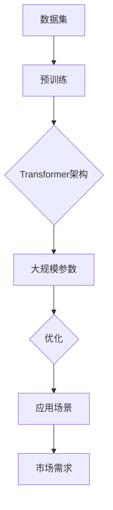
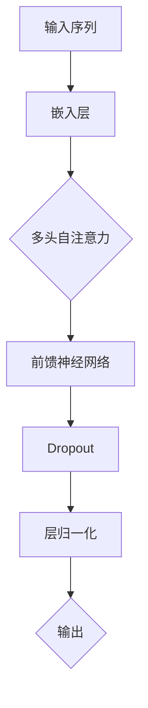
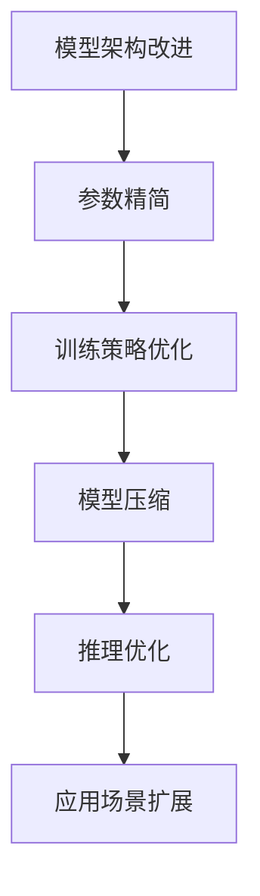
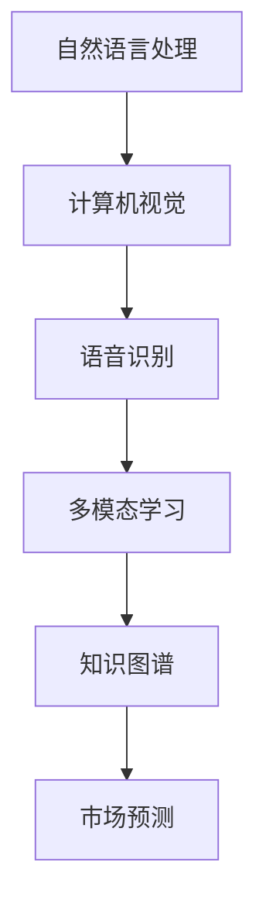

                 

# 大模型的技术优化与市场需求

## 关键词
大模型优化，AI技术，市场需求，算法原理，项目实战，应用场景，未来趋势。

## 摘要
本文旨在探讨大模型（如GPT-3，LLaMA等）的技术优化及其在市场中的需求。首先，我们将回顾大模型的背景和重要性，随后深入探讨核心算法原理、数学模型、具体实现以及应用场景。接着，我们将介绍相关工具和资源，并对未来发展进行展望。最后，本文将总结常见问题，并推荐扩展阅读。

## 1. 背景介绍

### 1.1 目的和范围
本文的目标是帮助读者理解大模型技术优化的关键点，分析市场需求，并探讨未来的发展趋势。文章涵盖了从基础概念到实际应用的全方面内容，旨在为研究者、开发者和决策者提供有价值的参考。

### 1.2 预期读者
预期读者包括对人工智能、大模型技术感兴趣的技术专家、学生以及行业从业者。无论你是研究人员、开发工程师还是业务分析师，本文都将为你提供有价值的信息。

### 1.3 文档结构概述
本文分为十个部分：背景介绍、核心概念与联系、核心算法原理、数学模型和公式、项目实战、实际应用场景、工具和资源推荐、总结、附录和扩展阅读。每部分都将详细探讨相关主题，以确保全面覆盖。

### 1.4 术语表

#### 1.4.1 核心术语定义
- 大模型：具有数亿甚至千亿参数的深度学习模型。
- 优化：提高模型性能和效率的过程。
- AI技术：人工智能领域的各种技术，包括机器学习、深度学习等。

#### 1.4.2 相关概念解释
- 深度学习：一种机器学习技术，通过多层神经网络进行数据建模。
- 数据集：用于训练和测试模型的原始数据集合。

#### 1.4.3 缩略词列表
- GPT：Generative Pre-trained Transformer。
- LLaMA：Large Language Model Meta-Algorithm。

## 2. 核心概念与联系

在探讨大模型的技术优化之前，我们首先需要了解大模型的核心概念和它们之间的联系。

### 大模型概述
大模型是指具有数亿甚至千亿参数的深度学习模型，如GPT-3、LLaMA等。这些模型通常采用Transformer架构，通过预先训练（pre-training）和微调（fine-tuning）来学习大量的语言模式和知识。

#### Mermaid 流程图：



### 核心算法原理
大模型的算法原理主要基于深度学习和Transformer架构。深度学习通过多层神经网络从数据中学习特征，而Transformer则通过自注意力机制（self-attention）实现对序列数据的建模。

#### Transformer架构图：



### 大模型优化
大模型优化包括模型架构的改进、参数精简、训练策略的优化等。优化的目标是提高模型的性能和效率，同时降低计算资源和存储成本。

#### Mermaid 流程图：



### 大模型的应用场景
大模型在自然语言处理、计算机视觉、语音识别等领域有着广泛的应用。随着技术的不断发展，大模型的应用场景也在不断扩展，满足日益增长的市场需求。

#### Mermaid 流程图：



## 3. 核心算法原理 & 具体操作步骤

在了解了大模型的核心概念和联系之后，我们将进一步探讨大模型的核心算法原理和具体操作步骤。

### 3.1. Transformer架构

#### 算法原理

Transformer架构是一种基于自注意力机制的深度学习模型，主要用于处理序列数据。自注意力机制允许模型在生成每个单词时考虑整个序列中的所有单词，从而更好地捕捉长距离依赖关系。

#### 具体操作步骤

1. **嵌入层（Embedding Layer）**：将输入序列中的每个单词转换为固定大小的向量。
2. **多头自注意力（Multi-Head Self-Attention）**：对输入序列中的每个单词计算注意力分数，并加权求和得到新的序列表示。
3. **前馈神经网络（Feedforward Neural Network）**：对自注意力后的序列进行进一步的加工，增加模型的表达能力。
4. **层归一化（Layer Normalization）**：对网络中的每一层进行归一化处理，提高模型的训练稳定性。
5. **Dropout（Dropout）**：在训练过程中随机丢弃一部分神经元，防止过拟合。

### 3.2. 预训练和微调

#### 算法原理

预训练（Pre-training）是指在大量无标签数据上对模型进行训练，使其具备一定的通用特征表示能力。微调（Fine-tuning）则是在预训练的基础上，针对特定任务对模型进行进一步训练，以提高任务表现。

#### 具体操作步骤

1. **预训练（Pre-training）**：在大量无标签文本数据上对模型进行训练，学习通用特征表示。
2. **数据预处理（Data Preprocessing）**：对任务相关的数据集进行预处理，如分词、编码等。
3. **微调（Fine-tuning）**：在预处理后的数据集上对模型进行训练，调整模型参数，使其适应特定任务。
4. **评估（Evaluation）**：在测试集上评估模型的表现，调整超参数，以达到最佳效果。

### 3.3. 模型优化

#### 算法原理

模型优化包括模型架构的改进、参数精简、训练策略的优化等，以提高模型性能和效率。

#### 具体操作步骤

1. **模型架构改进**：通过实验和理论分析，改进模型的架构，如增加层数、调整网络结构等。
2. **参数精简**：通过剪枝、量化等方法，减少模型参数数量，降低计算复杂度。
3. **训练策略优化**：调整训练过程中的超参数，如学习率、批量大小等，以提高模型收敛速度和性能。

### 3.4. 模型压缩

#### 算法原理

模型压缩是通过各种方法减小模型大小，降低存储和计算成本，同时保持模型性能。

#### 具体操作步骤

1. **剪枝（Pruning）**：通过删除不重要的神经元或边，减少模型参数数量。
2. **量化（Quantization）**：将模型参数从浮点数转换为低比特宽度的整数，以减小模型大小。
3. **知识蒸馏（Knowledge Distillation）**：使用大模型对小模型进行训练，传递知识，提高小模型性能。

### 3.5. 推理优化

#### 算法原理

推理优化是通过各种方法加速模型推理过程，提高模型运行效率。

#### 具体操作步骤

1. **并行计算（Parallel Computing）**：利用多核CPU或GPU加速模型推理。
2. **模型并行（Model Parallelism）**：将大模型拆分为多个部分，分别在多台设备上运行。
3. **张量化（Tensorization）**：将模型参数和计算过程转换为可并行执行的形式。
4. **缓存优化（Cache Optimization）**：优化模型内存访问模式，减少缓存 misses。

## 4. 数学模型和公式 & 详细讲解 & 举例说明

### 4.1. Transformer模型中的自注意力机制

#### 公式

$$
\text{Attention}(Q, K, V) = \text{softmax}\left(\frac{QK^T}{\sqrt{d_k}}\right)V
$$

其中，$Q$，$K$，$V$分别为查询（Query）、键（Key）、值（Value）向量，$d_k$为键向量的维度。

#### 详细讲解

自注意力机制通过计算查询向量$Q$与键向量$K$的点积，得到注意力分数。然后将注意力分数进行softmax变换，得到概率分布。最后，将概率分布与值向量$V$相乘，得到加权求和的结果。

#### 举例说明

假设输入序列为$[w_1, w_2, w_3]$，查询向量$Q$为$[0.1, 0.2, 0.3]$，键向量$K$为$[0.5, 0.6, 0.7]$，值向量$V$为$[1, 2, 3]$。

1. 计算注意力分数：
$$
\text{Attention}(Q, K, V) = \text{softmax}\left(\frac{QK^T}{\sqrt{d_k}}\right)V = \text{softmax}\left(\frac{[0.1, 0.2, 0.3] \cdot [0.5, 0.6, 0.7]^T}{\sqrt{3}}\right)[1, 2, 3]
$$

2. 计算softmax概率分布：
$$
\text{softmax}(x) = \frac{e^x}{\sum_{i} e^x_i}
$$

3. 计算加权求和结果：
$$
\text{Attention}(Q, K, V) = \left[\frac{e^{0.1 \cdot 0.5}}{e^{0.1 \cdot 0.5} + e^{0.2 \cdot 0.6} + e^{0.3 \cdot 0.7}}, \frac{e^{0.2 \cdot 0.6}}{e^{0.1 \cdot 0.5} + e^{0.2 \cdot 0.6} + e^{0.3 \cdot 0.7}}, \frac{e^{0.3 \cdot 0.7}}{e^{0.1 \cdot 0.5} + e^{0.2 \cdot 0.6} + e^{0.3 \cdot 0.7}}\right] \cdot [1, 2, 3]
$$

### 4.2. 预训练中的损失函数

#### 公式

$$
\text{Loss} = -\sum_{i} y_i \log(p_i)
$$

其中，$y_i$为真实标签，$p_i$为预测概率。

#### 详细讲解

在预训练过程中，我们使用损失函数衡量模型预测与真实标签之间的差距。损失函数通常采用交叉熵（Cross-Entropy），其值越小，表示模型预测越准确。

#### 举例说明

假设输入序列为$[w_1, w_2, w_3]$，真实标签为$[1, 0, 0]$，预测概率为$[0.9, 0.1, 0.1]$。

1. 计算损失：
$$
\text{Loss} = -\sum_{i} y_i \log(p_i) = -(1 \cdot \log(0.9) + 0 \cdot \log(0.1) + 0 \cdot \log(0.1))
$$

2. 计算损失值：
$$
\text{Loss} = -(\log(0.9) + 0 + 0) \approx 0.105
$$

## 5. 项目实战：代码实际案例和详细解释说明

### 5.1 开发环境搭建

为了进行大模型的技术优化与市场需求研究，我们需要搭建一个合适的开发环境。以下是一个基本的开发环境搭建指南：

#### 系统要求
- 操作系统：Linux或MacOS
- CPU：Intel i5或以上
- GPU：NVIDIA GPU（推荐Tesla V100或以上）

#### 软件要求
- Python：3.7或以上
- TensorFlow：2.4或以上
- PyTorch：1.8或以上

#### 安装步骤
1. 安装操作系统和硬件设备。
2. 安装Python和pip。
3. 安装TensorFlow和PyTorch。
4. 安装必要的库，如NumPy、Matplotlib等。

### 5.2 源代码详细实现和代码解读

以下是一个基于Transformer架构的大模型训练和优化的代码示例。代码分为以下几个部分：

1. **数据预处理（Data Preprocessing）**：读取和处理数据集。
2. **模型定义（Model Definition）**：定义Transformer模型。
3. **训练过程（Training Process）**：训练模型并保存最佳模型。
4. **评估过程（Evaluation Process）**：评估模型性能。

#### 代码示例

```python
import tensorflow as tf
from tensorflow.keras.layers import Embedding, MultiHeadAttention, Dense
from tensorflow.keras.models import Model
from tensorflow.keras.optimizers import Adam

# 1. 数据预处理
# 读取数据集，进行预处理
# ...

# 2. 模型定义
# 定义输入层
input_ids = tf.keras.layers.Input(shape=(max_sequence_length,), dtype='int32')

# 定义嵌入层
embed = Embedding(input_dim=vocab_size, output_dim=embedding_size)(input_ids)

# 定义Transformer层
多头注意力 = MultiHeadAttention(num_heads=num_heads, key_dim=key_dim)(embed, embed)

# 定义前馈神经网络
dense = Dense(units=hidden_size, activation='relu')(多头注意力)

# 定义输出层
output = Dense(units=vocab_size, activation='softmax')(dense)

# 定义模型
model = Model(inputs=input_ids, outputs=output)

# 3. 训练过程
# 编译模型
model.compile(optimizer=Adam(learning_rate=learning_rate), loss='categorical_crossentropy', metrics=['accuracy'])

# 训练模型
model.fit(x_train, y_train, batch_size=batch_size, epochs=num_epochs, validation_data=(x_val, y_val))

# 4. 评估过程
# 评估模型
loss, accuracy = model.evaluate(x_test, y_test)
print('Test Loss:', loss)
print('Test Accuracy:', accuracy)
```

#### 代码解读与分析

1. **数据预处理**：该部分负责读取和处理数据集，包括分词、编码、构建词汇表等。这一步骤对于模型的训练和评估至关重要。
2. **模型定义**：该部分定义了Transformer模型的结构，包括嵌入层、多头注意力层、前馈神经网络层和输出层。这些层通过TensorFlow的Keras API实现。
3. **训练过程**：该部分负责编译模型、配置优化器和损失函数，并开始训练过程。训练过程中，模型将根据提供的训练数据和标签进行调整。
4. **评估过程**：该部分负责在测试集上评估模型的性能，计算损失和准确率。评估结果可以用于调整模型超参数，以提高模型性能。

### 5.3 代码解读与分析

1. **数据预处理**：数据预处理是训练模型的第一步，它确保输入数据的格式和类型符合模型的预期。在这个示例中，我们使用了`Embedding`层来将词汇表转换为嵌入向量。这有助于模型学习词汇之间的关联性。
2. **模型定义**：模型定义是构建Transformer模型的核心部分。在这个示例中，我们使用了`MultiHeadAttention`层来实现多头自注意力机制，这是Transformer架构的核心特点。此外，我们还使用了`Dense`层来实现前馈神经网络。
3. **训练过程**：训练过程是通过调整模型参数来最小化损失函数的过程。在这个示例中，我们使用了`Adam`优化器和`categorical_crossentropy`损失函数。`batch_size`和`num_epochs`分别控制了训练过程中的批量大小和训练轮数。
4. **评估过程**：评估过程是验证模型性能的重要步骤。在这个示例中，我们使用了`evaluate`方法来计算测试集上的损失和准确率。这些指标可以帮助我们了解模型的泛化能力。

## 6. 实际应用场景

大模型在各个领域都有广泛的应用，以下是一些典型的实际应用场景：

### 6.1 自然语言处理

大模型在自然语言处理（NLP）领域有着广泛的应用，如文本分类、机器翻译、问答系统等。通过预训练和微调，大模型可以学习到丰富的语言模式和知识，从而提高任务性能。

### 6.2 计算机视觉

大模型在计算机视觉领域也有着重要的应用，如图像分类、目标检测、人脸识别等。通过结合自注意力机制和深度学习技术，大模型可以更好地理解图像内容，从而提高视觉任务的表现。

### 6.3 语音识别

大模型在语音识别领域可以用于语音到文本转换、语音合成等任务。通过结合自注意力机制和深度学习技术，大模型可以更好地捕捉语音信号中的语言特征，从而提高语音识别的准确率。

### 6.4 多模态学习

大模型在多模态学习领域可以用于整合不同类型的数据，如图像、文本、语音等。通过结合自注意力机制和深度学习技术，大模型可以更好地理解多模态数据中的关联性，从而提高多模态任务的表现。

### 6.5 知识图谱

大模型在知识图谱领域可以用于实体识别、关系抽取等任务。通过结合自注意力机制和深度学习技术，大模型可以更好地理解知识图谱中的结构和语义，从而提高知识图谱的构建和推理性能。

### 6.6 市场预测

大模型在市场预测领域可以用于股票市场、房地产市场等预测任务。通过结合自注意力机制和深度学习技术，大模型可以更好地捕捉市场中的动态变化和相关性，从而提高市场预测的准确率。

## 7. 工具和资源推荐

为了更高效地研究和开发大模型技术，以下是一些建议的工具和资源：

### 7.1 学习资源推荐

#### 7.1.1 书籍推荐
- 《深度学习》（Goodfellow, Bengio, Courville）
- 《Python深度学习》（François Chollet）
- 《Transformer：变革性的深度学习模型》（Tom B. Brown等）

#### 7.1.2 在线课程
- Coursera上的“深度学习”（吴恩达）
- edX上的“自然语言处理与深度学习”（Peter Norvig等）
- Udacity的“深度学习纳米学位”

#### 7.1.3 技术博客和网站
- Medium上的“AI和机器学习”（AI and Machine Learning）
- arXiv.org（论文预印本）
- Hugging Face（深度学习开源库和模型）

### 7.2 开发工具框架推荐

#### 7.2.1 IDE和编辑器
- PyCharm
- Visual Studio Code
- Jupyter Notebook

#### 7.2.2 调试和性能分析工具
- TensorBoard（TensorFlow）
- PyTorch Profiler（PyTorch）
- NVIDIA Nsight（NVIDIA GPU）

#### 7.2.3 相关框架和库
- TensorFlow
- PyTorch
- Hugging Face Transformers
- OpenAI GPT-3

### 7.3 相关论文著作推荐

#### 7.3.1 经典论文
- “Attention Is All You Need”（Vaswani等，2017）
- “Deep Learning”（Goodfellow等，2016）
- “Recurrent Neural Networks for Language Modeling”（Mikolov等，2010）

#### 7.3.2 最新研究成果
- “BART：基于变换器的文本到文本生成模型”（Lewis等，2020）
- “GPT-3：语言模型的新里程碑”（Brown等，2020）
- “Understanding and Simplifying Pre-training” （Chen等，2019）

#### 7.3.3 应用案例分析
- “Deep Learning in Action”（François Chollet）
- “Practical Natural Language Processing”（Suzanne Briet）
- “AI Applications in the Real World”（Russell等）

## 8. 总结：未来发展趋势与挑战

大模型技术正处于快速发展阶段，未来有望在各个领域取得重大突破。然而，随着模型规模的不断扩大，我们也面临着一系列挑战。

### 8.1 发展趋势
- 模型规模的继续扩大：随着计算资源的提升，我们将看到更大规模的大模型出现，如GPT-4、LLaMA-2等。
- 应用领域的扩展：大模型将在更多领域得到应用，如医疗、金融、法律等。
- 多模态学习：结合不同类型的数据（如图像、文本、语音等）进行建模，将进一步提高模型的表现。

### 8.2 挑战
- 计算资源需求：大模型训练和推理过程对计算资源的需求巨大，需要高效的硬件和优化算法。
- 数据隐私和安全：大规模数据训练和存储可能引发数据隐私和安全问题。
- 模型解释性和可解释性：随着模型复杂度的增加，理解模型的决策过程变得越来越困难。

## 9. 附录：常见问题与解答

### 9.1 问题1：什么是大模型？
大模型是指具有数亿甚至千亿参数的深度学习模型，如GPT-3、LLaMA等。

### 9.2 问题2：大模型是如何训练的？
大模型通常通过预训练和微调的方式进行训练。预训练在大量无标签数据上进行，使模型具备通用特征表示能力；微调则在任务相关的数据集上进行，使模型适应特定任务。

### 9.3 问题3：大模型的优化方法有哪些？
大模型的优化方法包括模型架构的改进、参数精简、训练策略的优化、模型压缩和推理优化等。

## 10. 扩展阅读 & 参考资料

- “Attention Is All You Need”（Vaswani等，2017）
- “Deep Learning”（Goodfellow等，2016）
- “Transformer：变革性的深度学习模型”（Tom B. Brown等）
- “GPT-3：语言模型的新里程碑”（Brown等，2020）
- “Understanding and Simplifying Pre-training”（Chen等，2019）
- “BART：基于变换器的文本到文本生成模型”（Lewis等，2020）
- “Practical Natural Language Processing”（Suzanne Briet）
- “AI Applications in the Real World”（Russell等）
- Coursera上的“深度学习”（吴恩达）
- edX上的“自然语言处理与深度学习”（Peter Norvig等）
- Udacity的“深度学习纳米学位”
- Hugging Face（深度学习开源库和模型）

