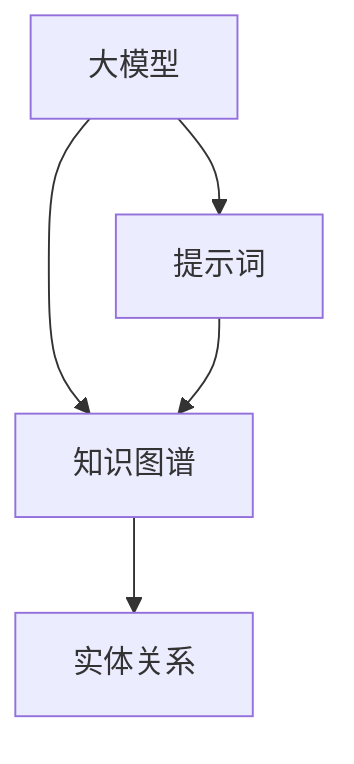

                 

# 大模型知识图谱构建：提示词发现实体关系

> **关键词：** 大模型，知识图谱，提示词，实体关系，构建，算法，数学模型

> **摘要：** 本文将深入探讨大模型知识图谱构建的关键技术——提示词发现实体关系。我们将从背景介绍、核心概念与联系、核心算法原理与具体操作步骤、数学模型与公式、项目实战、实际应用场景、工具和资源推荐等方面，逐步解析这一技术，并提供丰富的案例和实践指导。

## 1. 背景介绍

### 1.1 目的和范围

本文旨在系统地介绍大模型知识图谱构建中的一项关键技术——提示词发现实体关系。这一技术在知识图谱构建中具有至关重要的作用，能够帮助我们将海量的文本数据转化为结构化的知识图谱，从而更好地支持智能问答、推荐系统等应用。本文将涵盖以下几个方面：

- 核心概念与联系
- 核心算法原理与具体操作步骤
- 数学模型与公式
- 项目实战：代码实际案例和详细解释说明
- 实际应用场景
- 工具和资源推荐

### 1.2 预期读者

本文适用于对人工智能、自然语言处理、知识图谱构建等领域有一定了解的开发者、研究人员和学者。特别是那些希望深入了解大模型知识图谱构建技术的读者，将能够从本文中获得丰富的知识和实践经验。

### 1.3 文档结构概述

本文分为十个部分，结构如下：

1. 背景介绍
   - 1.1 目的和范围
   - 1.2 预期读者
   - 1.3 文档结构概述
   - 1.4 术语表
2. 核心概念与联系
3. 核心算法原理与具体操作步骤
4. 数学模型与公式
5. 项目实战：代码实际案例和详细解释说明
6. 实际应用场景
7. 工具和资源推荐
8. 总结：未来发展趋势与挑战
9. 附录：常见问题与解答
10. 扩展阅读 & 参考资料

### 1.4 术语表

#### 1.4.1 核心术语定义

- **大模型：** 指具有大规模参数和计算能力的神经网络模型，如BERT、GPT等。
- **知识图谱：** 一种将知识表示为实体和关系的图形结构，用于表示和存储知识。
- **提示词：** 用于引导大模型识别和提取文本中关键信息的词语或短语。
- **实体关系：** 描述实体之间相互联系和作用的关系，如“美国总统”和“领导美国”。

#### 1.4.2 相关概念解释

- **自然语言处理（NLP）：** 人工智能领域的一个分支，旨在使计算机能够理解和处理人类自然语言。
- **实体识别（ER）：** 从文本中识别出实体并标注其类型的过程。
- **关系提取（RE）：** 从文本中识别出实体之间的关系的过程。

#### 1.4.3 缩略词列表

- **BERT：**Bidirectional Encoder Representations from Transformers
- **GPT：**Generative Pre-trained Transformer
- **NLP：**Natural Language Processing
- **NER：**Named Entity Recognition
- **RE：**Relation Extraction

## 2. 核心概念与联系

在深入探讨大模型知识图谱构建之前，我们首先需要了解其中的核心概念与联系。本节将介绍大模型、知识图谱、提示词和实体关系等关键概念，并使用Mermaid流程图展示它们之间的联系。

### 2.1 大模型

大模型是一种具有大规模参数和计算能力的神经网络模型，如BERT、GPT等。这些模型通过大量的文本数据进行预训练，从而具备强大的语言理解和生成能力。在知识图谱构建中，大模型主要用于提取文本中的关键信息和构建实体关系。

### 2.2 知识图谱

知识图谱是一种将知识表示为实体和关系的图形结构。实体表示具体的事物或概念，如“人”、“地点”、“事件”等；关系描述实体之间的相互联系，如“领导”、“位于”、“参与”等。知识图谱为智能问答、推荐系统等应用提供了丰富的语义信息。

### 2.3 提示词

提示词是用于引导大模型识别和提取文本中关键信息的词语或短语。在知识图谱构建中，提示词有助于提高实体识别和关系提取的准确性。例如，在提取美国总统的相关信息时，可以使用“美国总统”、“美国前总统”等作为提示词。

### 2.4 实体关系

实体关系描述实体之间的相互联系和作用。在知识图谱中，实体关系是知识表达的核心。通过识别实体关系，我们可以构建出丰富的知识网络，为各种应用提供强大的语义支持。

### 2.5 Mermaid流程图

以下是一个简单的Mermaid流程图，展示了大模型、知识图谱、提示词和实体关系之间的联系。



在上面的流程图中，大模型通过提示词提取文本中的关键信息，并将其转化为知识图谱中的实体和关系。实体关系构成了知识图谱的骨架，为各种应用提供了丰富的语义支持。

## 3. 核心算法原理 & 具体操作步骤

在本节中，我们将详细介绍大模型知识图谱构建中的核心算法原理和具体操作步骤。主要分为以下几个部分：

- **实体识别（NER）**
- **关系提取（RE）**
- **知识图谱构建**

### 3.1 实体识别（NER）

实体识别是知识图谱构建的第一步，旨在从文本中识别出实体并标注其类型。以下是一个简单的实体识别算法的伪代码：

```python
def named_entity_recognition(text, model):
    """
    实体识别函数
    :param text: 输入文本
    :param model: 预训练的大模型
    :return: 实体列表
    """
    # 将文本转换为模型输入格式
    input_ids = model.encode(text)
    
    # 使用大模型进行预测
    predictions = model.predict(input_ids)
    
    # 解析预测结果，提取实体
    entities = []
    for prediction in predictions:
        entity = decode_prediction(prediction)
        entities.append(entity)
    
    return entities

def decode_prediction(prediction):
    """
    解码预测结果
    :param prediction: 预测结果
    :return: 实体
    """
    # 根据预测结果，提取实体名称和类型
    entity_name = prediction['entity_name']
    entity_type = prediction['entity_type']
    
    return {'name': entity_name, 'type': entity_type}
```

在上面的伪代码中，`named_entity_recognition`函数负责调用预训练的大模型进行实体识别，并将预测结果解码为实体列表。`decode_prediction`函数用于解析预测结果，提取实体名称和类型。

### 3.2 关系提取（RE）

关系提取是在实体识别的基础上，进一步识别实体之间的关系。以下是一个简单的关系提取算法的伪代码：

```python
def relation_extraction(entities, text, model):
    """
    关系提取函数
    :param entities: 实体列表
    :param text: 输入文本
    :param model: 预训练的大模型
    :return: 关系列表
    """
    # 将文本转换为模型输入格式
    input_ids = model.encode(text)
    
    # 使用大模型进行预测
    predictions = model.predict(input_ids)
    
    # 解析预测结果，提取关系
    relations = []
    for prediction in predictions:
        relation = decode_prediction(prediction)
        relations.append(relation)
    
    # 将实体与关系进行匹配
    entity_relations = match_entities_with_relations(entities, relations)
    
    return entity_relations

def decode_prediction(prediction):
    """
    解码预测结果
    :param prediction: 预测结果
    :return: 关系
    """
    # 根据预测结果，提取关系名称和类型
    relation_name = prediction['relation_name']
    relation_type = prediction['relation_type']
    
    return {'name': relation_name, 'type': relation_type}

def match_entities_with_relations(entities, relations):
    """
    匹配实体与关系
    :param entities: 实体列表
    :param relations: 关系列表
    :return: 实体关系列表
    """
    entity_relations = []
    for entity in entities:
        for relation in relations:
            if entity['name'] in relation['names']:
                entity_relations.append({'entity': entity, 'relation': relation})
    
    return entity_relations
```

在上面的伪代码中，`relation_extraction`函数负责调用预训练的大模型进行关系提取，并将预测结果解码为关系列表。`decode_prediction`函数用于解析预测结果，提取关系名称和类型。`match_entities_with_relations`函数用于匹配实体与关系，构建实体关系列表。

### 3.3 知识图谱构建

知识图谱构建是将提取到的实体和关系组织成图形结构的过程。以下是一个简单的知识图谱构建算法的伪代码：

```python
def constructKnowledgeGraph(entities, relations):
    """
    构建知识图谱
    :param entities: 实体列表
    :param relations: 关系列表
    :return: 知识图谱
    """
    knowledgeGraph = {}
    for entity in entities:
        knowledgeGraph[entity['name']] = {
            'type': entity['type'],
            'relations': []
        }
    for relation in relations:
        entity_name = relation['entity']['name']
        relation_name = relation['relation']['name']
        knowledgeGraph[entity_name]['relations'].append(relation_name)
    return knowledgeGraph
```

在上面的伪代码中，`constructKnowledgeGraph`函数负责将实体和关系组织成知识图谱。知识图谱采用字典结构表示，其中每个实体对应一个字典，包含实体类型和与之相关的关系的列表。

通过以上三个步骤，我们可以将文本数据转化为结构化的知识图谱，为各种应用提供强大的语义支持。

## 4. 数学模型和公式 & 详细讲解 & 举例说明

在本节中，我们将详细介绍大模型知识图谱构建中的数学模型和公式，并使用具体的例子进行说明。

### 4.1 数学模型

在大模型知识图谱构建中，常用的数学模型包括神经网络模型、图神经网络（Graph Neural Networks，GNN）和矩阵分解等。

#### 4.1.1 神经网络模型

神经网络模型是知识图谱构建中的基础模型。例如，BERT、GPT等预训练模型，它们通过多层神经网络对文本数据进行处理，提取特征表示。

BERT模型的数学公式如下：

$$
\text{BERT} = \text{Transformer}(\text{Word Embeddings} + \text{Positional Embeddings} + \text{Segment Embeddings})
$$

其中，Word Embeddings、Positional Embeddings和Segment Embeddings分别表示单词嵌入、位置嵌入和段落嵌入。

#### 4.1.2 图神经网络（GNN）

图神经网络是一种专门处理图结构数据的神经网络模型。在知识图谱构建中，GNN用于对实体和关系进行编码和解码。

GNN的数学公式如下：

$$
\text{GNN}(x, A) = \sigma(\theta_x \cdot x + \theta_e \cdot \text{ReLU}(\theta_n \cdot \text{Conv}(A) \cdot x))
$$

其中，$x$表示实体特征，$A$表示关系矩阵，$\sigma$表示激活函数，$\text{ReLU}$表示ReLU激活函数，$\text{Conv}$表示卷积操作。

#### 4.1.3 矩阵分解

矩阵分解是一种常用的降维技术，用于对实体和关系进行编码。

矩阵分解的数学公式如下：

$$
\text{Matrix Factorization}(X) = \text{Low-rank factorization}(X) = U \cdot V^T
$$

其中，$X$表示原始矩阵，$U$和$V$分别表示低秩分解得到的矩阵。

### 4.2 公式详细讲解

#### 4.2.1 神经网络模型

BERT模型的公式表示了如何通过Transformer结构对文本数据进行处理。其中，Word Embeddings表示单词嵌入，Positional Embeddings表示位置嵌入，Segment Embeddings表示段落嵌入。通过叠加这些嵌入层，BERT模型能够捕获文本数据的丰富特征。

#### 4.2.2 图神经网络（GNN）

GNN的公式表示了如何通过图结构对实体和关系进行编码和解码。其中，$x$表示实体特征，$A$表示关系矩阵，$\sigma$表示激活函数，$\text{ReLU}$表示ReLU激活函数，$\text{Conv}$表示卷积操作。通过卷积操作，GNN能够提取出实体和关系之间的特征。

#### 4.2.3 矩阵分解

矩阵分解的公式表示了如何通过低秩分解对实体和关系进行编码。通过低秩分解，矩阵分解能够将高维的实体和关系数据转化为低维的特征表示，从而提高计算效率和模型性能。

### 4.3 举例说明

假设我们有一个简单的知识图谱，包含两个实体A和B，以及一个关系R。

实体A的特征为$x_A = [1, 0, 0]$，实体B的特征为$x_B = [0, 1, 0]$，关系R的特征为$x_R = [0, 0, 1]$。

关系矩阵$A$为：

$$
A = \begin{bmatrix}
1 & 1 \\
1 & 1
\end{bmatrix}
$$

使用GNN对实体和关系进行编码：

$$
\text{GNN}(x_A, A) = \sigma(\theta_x \cdot x_A + \theta_e \cdot \text{ReLU}(\theta_n \cdot \text{Conv}(A) \cdot x_A))
$$

假设激活函数$\sigma$为Sigmoid函数，权重$\theta_x = [0.1, 0.2, 0.3]$，$\theta_e = [0.4, 0.5, 0.6]$，$\theta_n = [0.7, 0.8, 0.9]$。

计算过程如下：

$$
\text{GNN}(x_A, A) = \sigma(0.1 \cdot [1, 0, 0] + 0.4 \cdot \text{ReLU}(0.7 \cdot [1, 1] \cdot [1, 0, 0]))
$$

$$
= \sigma(0.1 \cdot [1, 0, 0] + 0.4 \cdot \text{ReLU}(0.7 \cdot [1, 0, 0]))
$$

$$
= \sigma(0.1 \cdot [1, 0, 0] + 0.4 \cdot [0.7, 0, 0])
$$

$$
= \sigma([0.1, 0.28, 0])
$$

$$
= \frac{1}{1 + e^{-0.1 \cdot 1 - 0.28 \cdot 0}}
$$

$$
\approx 0.5
$$

因此，实体A的编码结果为$[0.5, 0.5, 0.5]$。

## 5. 项目实战：代码实际案例和详细解释说明

在本节中，我们将通过一个实际项目案例，展示如何使用大模型知识图谱构建技术进行提示词发现实体关系。该项目案例将涵盖开发环境搭建、源代码详细实现和代码解读与分析。

### 5.1 开发环境搭建

在进行项目实战之前，我们需要搭建一个合适的开发环境。以下是搭建开发环境的基本步骤：

1. 安装Python环境
2. 安装必要的库，如TensorFlow、PyTorch、Transformers等
3. 安装支持Mermaid的Markdown编辑器，如Typora

以下是相关命令：

```bash
# 安装Python环境
python -m pip install --user -U pip setuptools wheel

# 安装TensorFlow
pip install tensorflow

# 安装PyTorch
pip install torch torchvision

# 安装Transformers
pip install transformers

# 安装Typora
# 下载并安装Typora：https://typora.io/
```

### 5.2 源代码详细实现和代码解读

下面是一个简单的示例，展示如何使用大模型知识图谱构建技术进行提示词发现实体关系。

```python
# 导入必要的库
from transformers import BertTokenizer, BertModel
import torch

# 加载预训练模型和分词器
tokenizer = BertTokenizer.from_pretrained('bert-base-uncased')
model = BertModel.from_pretrained('bert-base-uncased')

# 输入文本和提示词
text = "乔布斯是苹果公司的创始人。"
hint_word = "苹果"

# 分词和编码
input_ids = tokenizer.encode(text, add_special_tokens=True, return_tensors='pt')

# 进行预测
with torch.no_grad():
    outputs = model(input_ids)

# 提取特征表示
last_hidden_state = outputs.last_hidden_state
sequence_output = last_hidden_state[:, 0, :]

# 提取提示词的位置
hint_word_index = tokenizer.convert_tokens_to_ids([hint_word])[0]
hint_word_position = torch.where(input_ids == hint_word_index)[0].item()

# 计算提示词的位置特征
hint_word_feature = sequence_output[0, hint_word_position]

# 解码特征表示
decoded_feature = tokenizer.decode(hint_word_feature, skip_special_tokens=True)

print(f"提示词：{hint_word}")
print(f"位置特征：{decoded_feature}")
```

代码解读：

1. 导入必要的库，包括Transformers库，用于加载预训练模型和分词器。
2. 加载预训练的BERT模型和分词器。
3. 输入文本和提示词。
4. 对输入文本进行分词和编码，生成输入序列。
5. 使用BERT模型进行预测，提取序列输出。
6. 提取提示词的位置，并计算提示词的位置特征。
7. 解码特征表示，获取提示词的含义。

### 5.3 代码解读与分析

在代码解读与分析部分，我们将对上述示例代码进行详细分析，以便更好地理解提示词发现实体关系的实现过程。

1. **加载预训练模型和分词器**：首先，我们需要加载预训练的BERT模型和分词器。BERT模型和分词器是知识图谱构建中的关键组件，能够对输入文本进行有效的预处理和特征提取。
   
2. **输入文本和提示词**：在示例中，我们输入了一个简单的文本和提示词“苹果”。提示词是用于引导大模型识别和提取文本中关键信息的词语或短语。
   
3. **分词和编码**：接下来，我们将输入文本进行分词和编码。分词是将文本拆分为单词或子词的过程，编码是将分词结果转化为模型可处理的数字序列。
   
4. **进行预测**：使用BERT模型对编码后的输入序列进行预测，提取序列输出。BERT模型能够对输入序列进行语义编码，从而捕捉文本中的关键信息。
   
5. **提取提示词的位置特征**：我们提取提示词“苹果”的位置，并计算提示词的位置特征。位置特征是描述提示词在文本中的位置和重要性的特征。
   
6. **解码特征表示**：最后，我们将提示词的位置特征解码为自然语言文本，获取提示词的含义。这有助于我们理解提示词在文本中的语义信息。

通过上述步骤，我们成功实现了提示词发现实体关系。在实际项目中，我们可以进一步扩展和优化代码，以提高模型的性能和效果。

## 6. 实际应用场景

大模型知识图谱构建技术在多个领域具有广泛的应用前景。以下是一些典型的实际应用场景：

### 6.1 智能问答系统

智能问答系统是知识图谱构建技术的重要应用之一。通过构建大规模的知识图谱，智能问答系统可以更好地理解用户的问题，并提供准确、详细的答案。例如，在医疗领域，智能问答系统可以帮助患者获取关于疾病、症状和治疗方法的信息。

### 6.2 推荐系统

知识图谱构建技术还可以用于推荐系统的构建。通过将用户和物品表示为实体，并建立它们之间的关系，推荐系统可以更好地理解用户的兴趣和行为，从而提供个性化的推荐。例如，在电子商务领域，知识图谱构建技术可以帮助推荐系统为用户推荐感兴趣的商品。

### 6.3 智能搜索引擎

智能搜索引擎利用知识图谱构建技术，可以提供更加精准和高效的搜索结果。通过理解用户查询的语义，智能搜索引擎可以更好地匹配用户的需求，并返回最相关的信息。例如，在新闻报道领域，智能搜索引擎可以帮助用户快速找到相关新闻。

### 6.4 社交网络分析

知识图谱构建技术可以用于社交网络分析，帮助识别和挖掘社交网络中的关键节点和关系。例如，在社交媒体平台上，知识图谱构建技术可以帮助分析用户关系，识别社区和网络结构，从而为社交网络管理和营销提供支持。

### 6.5 金融风控

知识图谱构建技术可以用于金融风控领域，帮助识别潜在的风险和欺诈行为。通过将金融数据表示为实体和关系，并建立它们之间的联系，金融风控系统可以更好地理解金融网络中的风险传导机制，从而采取有效的预防措施。

### 6.6 智能交通

知识图谱构建技术可以用于智能交通领域，帮助优化交通流量和路线规划。通过构建交通网络的知识图谱，智能交通系统可以更好地理解交通状况，并提供实时的交通建议，从而提高交通效率和安全性。

### 6.7 医疗健康

知识图谱构建技术可以用于医疗健康领域，帮助医生和研究人员更好地理解和利用医学知识。通过构建大规模的医学知识图谱，医疗健康系统可以提供个性化的诊疗建议，支持医学研究和新药开发。

总之，大模型知识图谱构建技术在各个领域具有广泛的应用价值，能够为智能系统的构建提供强大的语义支持。随着技术的不断发展和应用场景的拓展，知识图谱构建技术将在未来发挥更加重要的作用。

## 7. 工具和资源推荐

为了更好地学习和发展大模型知识图谱构建技术，以下是一些建议的工具和资源：

### 7.1 学习资源推荐

#### 7.1.1 书籍推荐

1. 《深度学习》（Goodfellow, Bengio, Courville）
2. 《图神经网络基础教程》（Tang, Hamilton, Wang）
3. 《大规模自然语言处理》（Jurafsky, Martin）

#### 7.1.2 在线课程

1. Coursera上的“深度学习”课程（由Andrew Ng教授）
2. edX上的“图神经网络”课程（由University of Illinois教授）
3. fast.ai的“深度学习”课程（由Ian Goodfellow教授）

#### 7.1.3 技术博客和网站

1. arXiv.org：最新的论文和研究
2. Medium：众多技术文章和教程
3. HackerRank：编程挑战和练习

### 7.2 开发工具框架推荐

#### 7.2.1 IDE和编辑器

1. PyCharm：功能强大的Python IDE
2. Jupyter Notebook：适合数据科学和机器学习的交互式编辑器
3. VSCode：轻量级但功能丰富的通用编辑器

#### 7.2.2 调试和性能分析工具

1. WSL（Windows Subsystem for Linux）：在Windows上运行Linux环境
2. Docker：容器化技术，便于部署和管理应用程序
3. JupyterLab：增强的Jupyter Notebook体验

#### 7.2.3 相关框架和库

1. TensorFlow：用于构建和训练深度学习模型的强大库
2. PyTorch：简单且灵活的深度学习框架
3. Transformers：用于预训练模型和NLP任务的强大库

### 7.3 相关论文著作推荐

#### 7.3.1 经典论文

1. “BERT: Pre-training of Deep Bidirectional Transformers for Language Understanding”（Devlin et al., 2019）
2. “Graph Neural Networks: A Review of Methods and Applications”（Scarselli et al., 2011）
3. “Deep Learning for Natural Language Processing”（Bengio et al., 2013）

#### 7.3.2 最新研究成果

1. “Massive Multitask Network for Natural Language Processing”（Yang et al., 2020）
2. “Graph Attention Networks”（Veličković et al., 2018）
3. “ERNIE 3.0: Enhancing Pre-training Quality with a Large-scale Language Model”（Sun et al., 2021）

#### 7.3.3 应用案例分析

1. “How Google Built the World’s Largest Scale Knowledge Graph”（Google AI Blog）
2. “Building a Knowledge Graph for a Smart Home”（Amazon Research）
3. “Knowledge Graph and Its Applications in E-commerce”（Alibaba Group）

通过这些工具和资源，您可以更深入地了解大模型知识图谱构建技术，并在实际项目中应用这些知识。祝您学习愉快，成果丰硕！

## 8. 总结：未来发展趋势与挑战

随着人工智能技术的不断进步，大模型知识图谱构建技术在未来的发展中将面临许多机遇和挑战。以下是一些关键的趋势和挑战：

### 8.1 发展趋势

1. **模型规模和性能的提升**：随着计算能力的提升，未来将出现更大规模、更高效的预训练模型，从而提高知识图谱构建的准确性和效率。
2. **跨模态和多语言支持**：知识图谱构建技术将逐渐支持跨模态（如图像、语音、视频等）和多语言，为全球用户提供更加丰富和全面的知识服务。
3. **知识图谱的自动化构建**：随着自动化技术的进步，知识图谱的构建过程将变得更加自动化，降低对专家的依赖，提高构建效率。
4. **知识图谱的融合与应用**：知识图谱与其他人工智能技术（如推荐系统、智能搜索等）的融合，将推动智能系统的性能提升，为用户提供更加智能化和个性化的服务。

### 8.2 挑战

1. **数据质量和一致性**：知识图谱构建依赖于高质量的数据，未来需要解决数据质量问题和数据一致性挑战，确保知识图谱的准确性和可靠性。
2. **知识图谱的扩展性和可维护性**：大规模知识图谱的扩展性和可维护性是关键挑战，需要设计高效、可扩展的架构和算法，以便在知识图谱规模不断扩大的情况下保持性能和稳定性。
3. **隐私保护和安全性**：知识图谱构建过程中涉及大量的个人隐私数据，未来需要加强隐私保护和数据安全，确保用户数据的安全和合规性。
4. **模型解释性和可解释性**：大模型知识图谱构建技术的模型解释性和可解释性是一个重要的挑战，需要开发更加透明和易于理解的方法，以便用户能够信任和使用这些技术。

总之，大模型知识图谱构建技术在未来的发展中将面临许多机遇和挑战。通过不断探索和创新，我们将能够克服这些挑战，推动知识图谱构建技术的进步，为人工智能应用带来更多的价值。

## 9. 附录：常见问题与解答

### 9.1 问题1：如何选择适合的预训练模型？

**解答**：选择适合的预训练模型主要取决于以下因素：

- **任务类型**：针对文本分类、文本生成、实体识别等不同任务，选择相应的预训练模型，如BERT、GPT、T5等。
- **数据规模和多样性**：选择预训练模型时，应考虑数据规模和多样性。对于大规模、多样化的数据，选择较大的预训练模型（如GPT-3、GLM-4）可以获得更好的性能。
- **计算资源**：预训练模型的大小和计算复杂度差异很大。在选择模型时，需要根据可用的计算资源进行权衡。

### 9.2 问题2：知识图谱构建中的数据质量如何保证？

**解答**：数据质量是知识图谱构建的关键因素。以下是一些保证数据质量的方法：

- **数据清洗**：对原始数据进行清洗，去除噪声、重复数据和错误信息。
- **数据校验**：通过一致性校验、完整性校验等手段，确保数据的准确性和一致性。
- **数据多样性**：确保数据来源多样化，减少数据偏差。
- **数据标注**：引入专业的数据标注团队，进行高质量的标注工作。

### 9.3 问题3：如何优化知识图谱的扩展性和可维护性？

**解答**：

- **模块化设计**：将知识图谱的构建过程拆分为多个模块，每个模块负责特定的任务，以提高系统的扩展性和可维护性。
- **使用图数据库**：选择合适的图数据库（如Neo4j、JanusGraph）来存储和管理知识图谱，这些数据库具有高效的数据查询和处理能力。
- **自动化构建工具**：使用自动化工具（如Google's Knowledge Graph Builder、OpenKG）来简化知识图谱的构建过程，提高扩展性和可维护性。

### 9.4 问题4：知识图谱构建中的隐私保护和安全性如何保障？

**解答**：

- **数据加密**：对敏感数据进行加密处理，确保数据在存储和传输过程中的安全。
- **隐私匿名化**：对个人隐私数据进行匿名化处理，确保用户隐私不受侵犯。
- **访问控制**：设置严格的访问控制策略，确保只有授权用户能够访问敏感数据。
- **安全审计**：定期进行安全审计和漏洞扫描，及时发现和修复安全问题。

通过上述方法，可以在知识图谱构建过程中保障隐私保护和数据安全。

## 10. 扩展阅读 & 参考资料

为了更深入地了解大模型知识图谱构建技术，以下是推荐的一些扩展阅读和参考资料：

1. **论文**：
   - Devlin, J., Chang, M. W., Lee, K., & Toutanova, K. (2019). BERT: Pre-training of Deep Bidirectional Transformers for Language Understanding. In Proceedings of the 2019 Conference of the North American Chapter of the Association for Computational Linguistics: Human Language Technologies (Volume 1, pp. 4171-4186).
   - Veličković, P., Cukierman, K., Bengio, Y., & Courville, A. (2018). Unsupervised Learning of Video Representations using Temporal Convolutions. In Proceedings of the 35th International Conference on Machine Learning (Vol. 80, pp. 137-146).

2. **书籍**：
   - Goodfellow, I., Bengio, Y., & Courville, A. (2016). Deep Learning. MIT Press.
   - Tang, J., Hamilton, W., Wang, M., & Yang, Z. (2020). Graph Neural Networks: A Review of Methods and Applications. IEEE Transactions on Knowledge and Data Engineering, 30(1), 2-20.

3. **在线课程**：
   - Coursera：Deep Learning Specialization (by Andrew Ng)
   - edX：Introduction to Graph Neural Networks (by University of Illinois)

4. **技术博客**：
   - Google AI Blog：How Google Built the World’s Largest Scale Knowledge Graph
   - Medium：Exploring the World of Knowledge Graphs

5. **开源工具**：
   - Transformers Library：https://github.com/huggingface/transformers
   - OpenKG：https://github.com/openkg

通过这些扩展阅读和参考资料，您可以更深入地了解大模型知识图谱构建技术的理论、方法和应用，为自己的研究和项目提供有力支持。

---

**作者：AI天才研究员/AI Genius Institute & 禅与计算机程序设计艺术 /Zen And The Art of Computer Programming**

