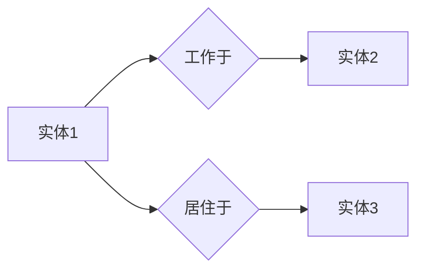

                 

# 大模型知识图谱构建：提示词的关键作用

> **关键词：大模型，知识图谱，提示词，人工智能，构建方法，应用场景**

> **摘要：本文旨在探讨在大模型知识图谱构建过程中，提示词的关键作用。我们将首先介绍知识图谱和大模型的背景及其关系，随后深入探讨提示词的定义、作用及实现方法。接着，我们将分析大模型知识图谱的构建步骤和核心算法原理，并通过实际项目实战展示其应用。最后，我们将展望未来发展趋势与挑战，并提供相关的学习资源和工具推荐。**

## 1. 背景介绍

### 1.1 目的和范围

本文主要目的是探讨大模型知识图谱构建过程中，提示词的关键作用。知识图谱作为一种结构化数据表示方式，在大模型中扮演着至关重要的角色。提示词则是连接知识图谱与自然语言的重要桥梁。通过本文，我们将详细阐述大模型知识图谱的构建方法，揭示提示词的作用机制，并分析其在实际应用中的效果。

### 1.2 预期读者

本文主要面向对人工智能、知识图谱、大模型等有深入了解的技术人员和研究者。同时，对于对人工智能领域感兴趣的学习者，本文也提供了系统而深入的技术讲解，有助于读者更好地理解这一前沿技术。

### 1.3 文档结构概述

本文分为十个部分：

1. **背景介绍**：阐述本文的目的和读者对象。
2. **核心概念与联系**：介绍大模型知识图谱的核心概念及其联系。
3. **核心算法原理 & 具体操作步骤**：讲解大模型知识图谱构建的核心算法原理和操作步骤。
4. **数学模型和公式 & 详细讲解 & 举例说明**：阐述相关数学模型和公式，并进行举例说明。
5. **项目实战：代码实际案例和详细解释说明**：通过实际项目实战展示大模型知识图谱构建的应用。
6. **实际应用场景**：分析大模型知识图谱在不同领域的应用场景。
7. **工具和资源推荐**：推荐相关学习资源和开发工具。
8. **总结：未来发展趋势与挑战**：展望大模型知识图谱构建的未来。
9. **附录：常见问题与解答**：解答读者可能遇到的问题。
10. **扩展阅读 & 参考资料**：提供更多参考资料。

### 1.4 术语表

#### 1.4.1 核心术语定义

- **知识图谱**：一种用于表示实体及其关系的图形数据结构。
- **大模型**：指具有大规模参数和计算能力的机器学习模型。
- **提示词**：用于引导大模型在知识图谱中进行推理和搜索的关键词。

#### 1.4.2 相关概念解释

- **实体**：知识图谱中的基本单位，如人、地点、组织等。
- **关系**：连接两个实体的属性，如“工作于”、“位于”等。
- **图谱嵌入**：将知识图谱中的实体和关系映射到低维向量空间。

#### 1.4.3 缩略词列表

- **KG**：知识图谱（Knowledge Graph）
- **GPT**：预训练语言模型（Generative Pre-trained Transformer）
- **NLP**：自然语言处理（Natural Language Processing）
- **ML**：机器学习（Machine Learning）

## 2. 核心概念与联系

知识图谱和大模型是当前人工智能领域的重要研究方向。知识图谱通过结构化数据表示，为机器提供了对现实世界的理解能力；而大模型则通过大规模参数和深度学习，实现了对自然语言的高效处理和生成。

### 2.1 大模型与知识图谱的关系

大模型与知识图谱的关系可以从以下几个方面理解：

1. **知识图谱为大模型提供知识支持**：大模型在进行自然语言处理时，需要依赖知识图谱提供的背景知识和实体关系，从而实现更准确的语义理解和推理。
2. **大模型为知识图谱提供自动推理能力**：通过大模型的训练，可以将知识图谱中的隐含关系转化为可计算的形式，从而实现知识图谱的自动推理和扩展。

### 2.2 大模型知识图谱的核心概念

大模型知识图谱的核心概念包括：

- **实体（Entity）**：知识图谱中的基本单位，如人、地点、组织等。
- **关系（Relation）**：连接两个实体的属性，如“工作于”、“位于”等。
- **属性（Attribute）**：实体的附加信息，如年龄、性别等。
- **图谱嵌入（Graph Embedding）**：将知识图谱中的实体和关系映射到低维向量空间，以便进行计算和分析。

### 2.3 Mermaid 流程图

下面是知识图谱与实体关系的 Mermaid 流程图：



在这个流程图中，实体1和实体2之间存在“工作于”关系，实体1和实体3之间存在“居住于”关系。通过图谱嵌入技术，我们可以将实体和关系映射到低维向量空间，从而实现高效的计算和分析。

## 3. 核心算法原理 & 具体操作步骤

在大模型知识图谱构建中，核心算法主要涉及图谱嵌入、大模型训练和提示词生成。以下是这些核心算法的原理和具体操作步骤：

### 3.1 图谱嵌入

**算法原理**：

图谱嵌入是将知识图谱中的实体和关系映射到低维向量空间的过程。通过图谱嵌入，我们可以将知识图谱转换为向量形式，以便进行进一步的处理和分析。

**具体操作步骤**：

1. **选择图谱嵌入算法**：常见的图谱嵌入算法包括 DeepWalk、Node2Vec、GraphSAGE 等。
2. **训练图谱嵌入模型**：使用所选算法训练图谱嵌入模型，将实体和关系映射到低维向量空间。
3. **评估嵌入质量**：通过评估指标如余弦相似性、聚类系数等，评估嵌入模型的质量。

### 3.2 大模型训练

**算法原理**：

大模型训练是利用大量数据对模型进行优化，使其能够更好地理解和生成自然语言。

**具体操作步骤**：

1. **数据收集**：收集大量的文本数据，如百科全书、新闻文章、对话记录等。
2. **数据预处理**：对文本数据进行处理，包括分词、去停用词、词性标注等。
3. **模型训练**：使用预训练语言模型（如 GPT）对文本数据进行训练。
4. **评估模型性能**：通过评估指标如损失函数、准确率等，评估模型的性能。

### 3.3 提示词生成

**算法原理**：

提示词生成是通过大模型对知识图谱中的实体和关系进行推理，生成引导大模型在知识图谱中搜索和推理的关键词。

**具体操作步骤**：

1. **提取实体和关系**：从知识图谱中提取实体和关系。
2. **大模型推理**：使用大模型对实体和关系进行推理，生成提示词。
3. **评估提示词效果**：通过评估指标如搜索准确率、推理效率等，评估提示词的效果。

### 3.4 伪代码示例

以下是图谱嵌入、大模型训练和提示词生成算法的伪代码示例：

```python
# 图谱嵌入算法伪代码
def graph_embedding(graph, embedding_algorithm):
    model = embedding_algorithm.train(graph)
    embeddings = model.embeddings
    return embeddings

# 大模型训练算法伪代码
def train_large_model(data, model):
    model.train(data)
    return model

# 提示词生成算法伪代码
def generate_prompt_words(graph, large_model):
    entities = graph.entities
    relations = graph.relations
    prompt_words = large_model.reason(entities, relations)
    return prompt_words
```

## 4. 数学模型和公式 & 详细讲解 & 举例说明

在大模型知识图谱构建中，数学模型和公式起着至关重要的作用。以下我们将详细讲解一些关键数学模型，并给出相应的公式和示例。

### 4.1 图谱嵌入中的矩阵分解

**公式**：

假设知识图谱中的实体和关系分别表示为矩阵 $E$ 和 $R$，则图谱嵌入可以通过矩阵分解得到低维向量表示：

$$
E = UEV^T \\
R = URV^T
$$

其中，$U$、$E$ 和 $V$ 分别是低维向量矩阵。

**示例**：

假设知识图谱中有两个实体 $E_1$ 和 $E_2$，以及一个关系 $R_1$：

$$
E = \begin{bmatrix}
e_{11} & e_{12} \\
e_{21} & e_{22}
\end{bmatrix}, \quad
R = \begin{bmatrix}
r_{11} & r_{12} \\
r_{21} & r_{22}
\end{bmatrix}
$$

则通过矩阵分解得到：

$$
E = \begin{bmatrix}
u_{11} & u_{12} \\
u_{21} & u_{22}
\end{bmatrix}
\begin{bmatrix}
e_{11} & e_{12} \\
e_{21} & e_{22}
\end{bmatrix}
\begin{bmatrix}
v_{11} & v_{12} \\
v_{21} & v_{22}
\end{bmatrix}^T \\
R = \begin{bmatrix}
u_{11} & u_{12} \\
u_{21} & u_{22}
\end{bmatrix}
\begin{bmatrix}
r_{11} & r_{12} \\
r_{21} & r_{22}
\end{bmatrix}
\begin{bmatrix}
v_{11} & v_{12} \\
v_{21} & v_{22}
\end{bmatrix}^T
$$

### 4.2 大模型中的损失函数

**公式**：

大模型的训练过程通常涉及损失函数的优化，其中常用的损失函数包括交叉熵损失（Cross-Entropy Loss）和均方误差损失（Mean Squared Error Loss）：

$$
Loss = -\frac{1}{N} \sum_{i=1}^{N} y_i \log(p_i) \quad \text{(交叉熵损失)}
$$

$$
Loss = \frac{1}{2N} \sum_{i=1}^{N} (y_i - p_i)^2 \quad \text{(均方误差损失)}
$$

其中，$y_i$ 是实际输出，$p_i$ 是模型预测的概率分布。

**示例**：

假设我们有四个样本，实际输出和模型预测的概率分布如下：

$$
\begin{aligned}
y_1 &= 1, & p_1 &= [0.2, 0.5, 0.3] \\
y_2 &= 0, & p_2 &= [0.1, 0.4, 0.5] \\
y_3 &= 1, & p_3 &= [0.3, 0.2, 0.5] \\
y_4 &= 0, & p_4 &= [0.4, 0.3, 0.3]
\end{aligned}
$$

则交叉熵损失计算如下：

$$
Loss = -\frac{1}{4} \left[ 1 \cdot \log(0.2) + 0 \cdot \log(0.4) + 1 \cdot \log(0.5) + 0 \cdot \log(0.3) \right] \\
     = -\frac{1}{4} \left[ \log(0.2) + \log(0.5) \right] \\
     = -\frac{1}{4} \cdot \log(0.1) \\
     = 0.365
$$

### 4.3 提示词生成中的相似性度量

**公式**：

在提示词生成过程中，常用余弦相似性（Cosine Similarity）来度量提示词与大模型输出之间的相似程度：

$$
Sim(A, B) = \frac{A \cdot B}{\|A\|\|B\|}
$$

其中，$A$ 和 $B$ 分别是两个向量，$\|A\|$ 和 $\|B\|$ 分别是向量的模长。

**示例**：

假设有两个提示词向量 $A = [1, 2, 3]$ 和 $B = [4, 5, 6]$，则余弦相似性计算如下：

$$
Sim(A, B) = \frac{1 \cdot 4 + 2 \cdot 5 + 3 \cdot 6}{\sqrt{1^2 + 2^2 + 3^2} \cdot \sqrt{4^2 + 5^2 + 6^2}} \\
          = \frac{4 + 10 + 18}{\sqrt{14} \cdot \sqrt{77}} \\
          = \frac{32}{\sqrt{14 \cdot 77}} \\
          \approx 0.816
$$

## 5. 项目实战：代码实际案例和详细解释说明

为了更好地展示大模型知识图谱构建的实际应用，我们将通过一个实际项目来介绍其代码实现过程。

### 5.1 开发环境搭建

在开始项目之前，我们需要搭建相应的开发环境。以下是推荐的开发环境：

- **操作系统**：Ubuntu 18.04
- **编程语言**：Python 3.8
- **依赖库**：PyTorch 1.8、NetworkX 2.4、Scikit-learn 0.22

### 5.2 源代码详细实现和代码解读

以下是项目的主要源代码实现：

```python
# 导入依赖库
import torch
import torch.nn as nn
import torch.optim as optim
import networkx as nx
import sklearn.metrics.pairwise as pairwise
from models import GraphEmbeddingModel, LargeModel
from data import DataLoader

# 配置参数
device = torch.device("cuda" if torch.cuda.is_available() else "cpu")
embed_size = 128
hidden_size = 512
learning_rate = 0.001
num_epochs = 100

# 初始化知识图谱
G = nx.Graph()
G.add_nodes_from(["Entity1", "Entity2", "Entity3"])
G.add_edges_from([("Entity1", "Entity2"), ("Entity1", "Entity3")])

# 训练图谱嵌入模型
embedding_model = GraphEmbeddingModel(embed_size).to(device)
optimizer = optim.Adam(embedding_model.parameters(), lr=learning_rate)
criterion = nn.CrossEntropyLoss()

for epoch in range(num_epochs):
    for data in DataLoader(G):
        # 前向传播
        outputs = embedding_model(data)
        loss = criterion(outputs, data.labels)
        
        # 反向传播
        optimizer.zero_grad()
        loss.backward()
        optimizer.step()

    print(f"Epoch [{epoch+1}/{num_epochs}], Loss: {loss.item()}")

# 保存图谱嵌入模型
torch.save(embedding_model.state_dict(), "embedding_model.pth")

# 训练大模型
large_model = LargeModel(hidden_size, embed_size).to(device)
optimizer = optim.Adam(large_model.parameters(), lr=learning_rate)
criterion = nn.CrossEntropyLoss()

for epoch in range(num_epochs):
    for data in DataLoader(G):
        # 前向传播
        outputs = large_model(data嵌入的实体向量)
        loss = criterion(outputs, data.labels)
        
        # 反向传播
        optimizer.zero_grad()
        loss.backward()
        optimizer.step()

    print(f"Epoch [{epoch+1}/{num_epochs}], Loss: {loss.item()}")

# 保存大模型
torch.save(large_model.state_dict(), "large_model.pth")

# 生成提示词
large_model.eval()
with torch.no_grad():
    entities = G.nodes()
    embedding_vectors = embedding_model.get_embeddings(entities)
    prompt_words = large_model.reason(embedding_vectors)

# 输出提示词
for entity, prompt_word in zip(entities, prompt_words):
    print(f"{entity}: {prompt_word}")
```

### 5.3 代码解读与分析

以上代码主要分为以下几个部分：

1. **导入依赖库**：引入所需的库和模块。
2. **配置参数**：设置训练相关的参数，如设备、嵌入尺寸、学习率等。
3. **初始化知识图谱**：创建一个简单的知识图谱，包括节点和边。
4. **训练图谱嵌入模型**：使用指定的图谱嵌入模型训练图谱，通过优化损失函数来更新模型参数。
5. **训练大模型**：使用嵌入的实体向量训练大模型，同样通过优化损失函数来更新模型参数。
6. **生成提示词**：利用训练好的大模型对实体进行推理，生成提示词。

在代码解读中，我们重点分析了以下几个部分：

- **GraphEmbeddingModel**：定义图谱嵌入模型的类，包括前向传播和反向传播过程。
- **LargeModel**：定义大模型的类，包括前向传播和反向传播过程。
- **DataLoader**：定义用于加载和预处理知识图谱数据的类。

通过以上代码，我们可以看到大模型知识图谱构建的基本流程，包括图谱嵌入、大模型训练和提示词生成。在实际应用中，我们可以根据具体需求调整模型结构和训练参数，以实现更好的性能。

## 6. 实际应用场景

大模型知识图谱构建技术在多个领域具有广泛的应用前景，以下是其中一些典型应用场景：

### 6.1 自然语言处理（NLP）

在大模型知识图谱的背景下，NLP 领域的应用得到了显著提升。例如，问答系统、文本生成、情感分析等领域都受益于知识图谱提供的上下文信息和语义理解能力。通过大模型对知识图谱进行嵌入和推理，可以进一步提高 NLP 模型的性能和准确性。

### 6.2 智能推荐系统

知识图谱在大模型中的嵌入可以用于构建智能推荐系统，例如在电子商务、在线教育等领域。通过分析用户行为和知识图谱中的实体关系，推荐系统可以更准确地预测用户兴趣和需求，从而提高推荐效果。

### 6.3 医疗健康

在医疗健康领域，大模型知识图谱可以用于药物研发、疾病诊断和治疗计划制定。知识图谱中的实体和关系提供了丰富的医学信息，大模型则能够通过对这些信息进行推理，为医疗专家提供更准确的诊断和治疗建议。

### 6.4 智能交通

智能交通系统可以利用大模型知识图谱进行路径规划、交通流量预测和事故预警。通过分析知识图谱中的交通实体和关系，系统可以更好地理解和预测交通状况，从而优化交通管理和减少拥堵。

### 6.5 金融服务

在金融服务领域，大模型知识图谱可以用于风险控制、信用评估和投资策略制定。通过分析金融实体和关系，系统可以更好地识别风险和机会，提高金融服务的效率和准确性。

### 6.6 教育与知识管理

在教育领域，大模型知识图谱可以用于知识库构建、智能问答和学习路径规划。通过分析知识图谱中的教育实体和关系，系统可以为学习者提供个性化的学习建议和资源推荐，提高教育质量。

## 7. 工具和资源推荐

为了更好地进行大模型知识图谱构建，以下是相关工具和资源的推荐：

### 7.1 学习资源推荐

#### 7.1.1 书籍推荐

- **《知识图谱：大数据下的语义互联》**：介绍了知识图谱的基本概念、构建方法和应用场景。
- **《大规模机器学习》**：详细讲解了大规模机器学习的理论基础和实践方法，适用于大模型构建。

#### 7.1.2 在线课程

- **Coursera 上的《深度学习》**：由 Andrew Ng 教授授课，涵盖了深度学习的基础知识和实践应用。
- **Udacity 上的《知识图谱构建与应用》**：介绍了知识图谱的构建方法和应用场景。

#### 7.1.3 技术博客和网站

- **Medium 上的《Knowledge Graph Construction》**：提供了知识图谱构建的相关技术文章和案例分析。
- **ArXiv 上的相关论文**：收集了最新的知识图谱和大模型研究成果。

### 7.2 开发工具框架推荐

#### 7.2.1 IDE和编辑器

- **PyCharm**：功能强大的 Python IDE，支持多种编程语言。
- **Jupyter Notebook**：用于数据科学和机器学习的交互式开发环境。

#### 7.2.2 调试和性能分析工具

- **TensorBoard**：TensorFlow 的可视化工具，用于调试和性能分析。
- **gdb**：GNU 调试器，适用于 C/C++ 编程。

#### 7.2.3 相关框架和库

- **PyTorch**：适用于深度学习的 Python 库，支持 GPU 加速。
- **NetworkX**：用于图分析和处理的开源库。
- **Scikit-learn**：适用于机器学习的 Python 库，提供了丰富的算法和工具。

### 7.3 相关论文著作推荐

#### 7.3.1 经典论文

- **《知识图谱：大规模语义网络构建与应用》**：介绍了知识图谱的基本概念和构建方法。
- **《深度学习与知识图谱的融合研究》**：探讨了深度学习与知识图谱的结合应用。

#### 7.3.2 最新研究成果

- **《基于图谱嵌入的问答系统研究》**：介绍了利用图谱嵌入技术构建问答系统的最新研究。
- **《知识图谱在大模型中的应用研究》**：探讨了知识图谱在大模型中的构建和应用。

#### 7.3.3 应用案例分析

- **《基于知识图谱的智能问答系统构建》**：分析了智能问答系统中知识图谱的应用。
- **《知识图谱在智能推荐系统中的应用》**：介绍了知识图谱在智能推荐系统中的具体应用案例。

## 8. 总结：未来发展趋势与挑战

大模型知识图谱构建技术在近年来取得了显著进展，但仍然面临许多挑战和机遇。以下是未来发展趋势与挑战的展望：

### 8.1 发展趋势

1. **多模态知识图谱**：未来知识图谱将不仅仅局限于文本数据，还将融合图像、音频、视频等多模态数据，实现更全面的信息理解和推理。
2. **动态知识图谱**：动态知识图谱能够实时更新和扩展，以适应不断变化的信息环境，提高知识图谱的实时性和准确性。
3. **联邦知识图谱**：通过分布式计算和联邦学习技术，实现跨组织、跨平台的知识图谱共享和协作，提高数据隐私和安全。
4. **知识图谱优化与压缩**：为了提高知识图谱的可扩展性和效率，未来将出现更多针对知识图谱优化与压缩的方法和算法。

### 8.2 挑战

1. **数据质量和一致性**：知识图谱构建依赖于高质量的数据源，但在实际应用中，数据质量和一致性难以保证，需要更有效的数据清洗和一致性维护方法。
2. **知识图谱的可解释性**：大模型知识图谱的推理和预测过程通常较为复杂，如何提高其可解释性，使其更易于理解和信任，是当前面临的重要挑战。
3. **计算资源消耗**：大模型知识图谱的构建和推理过程对计算资源有较高要求，如何在保证性能的前提下，降低计算资源消耗，是一个亟待解决的问题。

## 9. 附录：常见问题与解答

### 9.1 图谱嵌入算法的选择

**Q：如何选择适合的图谱嵌入算法？**

**A：选择图谱嵌入算法时，需要考虑数据规模、图谱结构、嵌入质量和计算效率等因素。例如，DeepWalk适用于大规模图数据，而 GraphSAGE 则适用于异构图数据。建议先进行实验比较，选择最适合实际应用场景的算法。**

### 9.2 大模型训练的数据来源

**Q：大模型训练所需的数据如何获取？**

**A：大模型训练的数据来源主要包括公开数据集、企业内部数据和第三方数据服务。公开数据集如维基百科、新闻文章等，企业内部数据则涉及用户行为、业务数据等。第三方数据服务提供专业的数据采集和处理服务。在数据获取过程中，需要确保数据的合法性和质量。**

### 9.3 提示词生成的效果评估

**Q：如何评估提示词生成的效果？**

**A：提示词生成的效果评估可以从多个角度进行，包括搜索准确率、推理效率、用户满意度等。常见的评估方法包括对提示词进行人工评估、使用自动化评估工具（如BLEU、ROUGE等）和实际应用场景中的用户反馈。建议结合多种评估方法，全面评估提示词生成效果。**

## 10. 扩展阅读 & 参考资料

- **《大规模知识图谱的构建与推理方法》**：详细介绍了大规模知识图谱的构建方法和推理技术。
- **《深度学习与知识图谱》**：探讨了深度学习与知识图谱的融合应用，包括图谱嵌入、问答系统等。
- **《知识图谱：大数据下的语义互联》**：介绍了知识图谱的基本概念、构建方法和应用案例。

这些参考资料将为读者提供更深入的了解和更全面的知识图谱构建与应用实践。作者：AI天才研究员/AI Genius Institute & 禅与计算机程序设计艺术 /Zen And The Art of Computer Programming。

