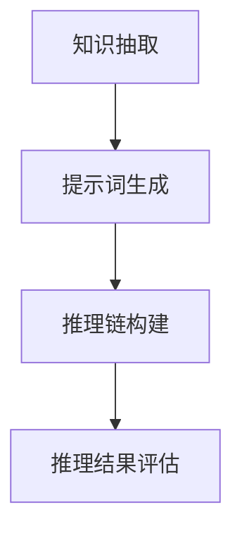

                 

# 大模型知识推理：提示词构建推理链

> **关键词：大模型，知识推理，提示词，推理链，人工智能，机器学习**

> **摘要：本文深入探讨了在大模型应用中，如何通过提示词构建有效的推理链，实现知识推理的自动化和智能化。文章首先介绍了大模型与知识推理的背景和重要性，然后详细阐述了提示词构建的原理和方法，最后通过实际案例展示了如何应用这些方法。**

## 1. 背景介绍

### 1.1 目的和范围

本文旨在探讨大模型在知识推理中的应用，重点研究如何通过构建有效的提示词，实现知识推理的自动化和智能化。文章主要涵盖以下内容：

- 大模型与知识推理的基本概念和原理；
- 提示词构建的理论基础和方法；
- 实际案例中的应用和效果分析；
- 未来发展趋势与挑战。

### 1.2 预期读者

本文适用于对人工智能、机器学习和知识推理有一定了解的读者，包括但不限于：

- AI研究人员和开发人员；
- 数据科学家和机器学习工程师；
- 对知识推理和人工智能应用感兴趣的工程师；
- 大模型和知识推理领域的学术研究者。

### 1.3 文档结构概述

本文分为以下几个部分：

- **第1章**：背景介绍，包括目的、范围、预期读者和文档结构概述；
- **第2章**：核心概念与联系，介绍大模型和知识推理的基本概念及其相互关系；
- **第3章**：核心算法原理 & 具体操作步骤，详细阐述提示词构建的算法原理和操作步骤；
- **第4章**：数学模型和公式 & 详细讲解 & 举例说明，讲解相关数学模型和公式的推导与应用；
- **第5章**：项目实战：代码实际案例和详细解释说明，通过实际案例展示如何应用提示词构建推理链；
- **第6章**：实际应用场景，介绍大模型知识推理在不同领域的应用；
- **第7章**：工具和资源推荐，推荐学习资源、开发工具和框架；
- **第8章**：总结：未来发展趋势与挑战，总结当前研究进展，展望未来发展方向；
- **第9章**：附录：常见问题与解答，针对读者可能遇到的疑问进行解答；
- **第10章**：扩展阅读 & 参考资料，提供进一步学习和研究的参考资料。

### 1.4 术语表

#### 1.4.1 核心术语定义

- **大模型**：指具有数十亿至千亿参数规模的深度学习模型，如GPT、BERT等；
- **知识推理**：指基于已有知识，通过逻辑推理、归纳、演绎等手段，得出新的结论或发现；
- **提示词**：指用于引导大模型进行知识推理的关键词或短语；
- **推理链**：指由多个提示词组成的序列，用于指导大模型进行知识推理。

#### 1.4.2 相关概念解释

- **预训练**：在大模型训练过程中，利用大量文本数据进行预训练，使模型具备一定的语言理解能力；
- **微调**：在预训练基础上，针对特定任务进行微调，以优化模型性能；
- **注意力机制**：一种用于捕捉文本中关键信息的技术，在大模型中广泛应用；
- **语义理解**：指对文本内容的深层理解，包括语义关系、情感倾向等。

#### 1.4.3 缩略词列表

- **AI**：人工智能；
- **ML**：机器学习；
- **NLP**：自然语言处理；
- **GPT**：生成预训练变换器；
- **BERT**：双向编码表示器。

## 2. 核心概念与联系

### 2.1 大模型与知识推理

大模型与知识推理是当前人工智能领域的重要研究方向。大模型具备强大的数据处理能力和表达能力，而知识推理则是人工智能的高级能力之一，旨在从海量数据中提取有用知识。二者相辅相成，共同推动人工智能的发展。

#### 2.1.1 大模型

大模型是指具有数十亿至千亿参数规模的深度学习模型，如GPT、BERT等。这些模型通过预训练和微调，可以学会理解、生成和推理文本。大模型的核心优势在于其强大的表示能力和泛化能力，能够处理复杂的语言任务。

#### 2.1.2 知识推理

知识推理是指基于已有知识，通过逻辑推理、归纳、演绎等手段，得出新的结论或发现。知识推理在人工智能领域具有重要的应用价值，如智能问答、知识图谱、推荐系统等。

#### 2.1.3 大模型与知识推理的联系

大模型与知识推理之间存在密切的联系。一方面，大模型可以通过预训练和微调，获取大量的语言知识和信息，为知识推理提供基础。另一方面，知识推理可以帮助大模型更好地理解和利用已有知识，提高其在实际应用中的表现。

### 2.2 提示词构建推理链

提示词构建推理链是实现知识推理的关键技术。提示词是一组用于引导大模型进行知识推理的关键词或短语，通过合理设计提示词，可以引导大模型发现隐含的知识关联，形成有效的推理链。

#### 2.2.1 提示词的作用

提示词在大模型知识推理中起到引导作用，具体包括：

- **聚焦**：提示词可以帮助大模型聚焦于关键信息，提高推理的准确性；
- **启发**：提示词可以启发大模型发现新的知识关联，拓展推理范围；
- **约束**：提示词可以对大模型的推理过程进行约束，避免产生无意义的推理。

#### 2.2.2 提示词的构建方法

构建有效的提示词需要遵循以下原则：

- **相关性**：提示词应与待推理的知识主题相关，有助于引导大模型发现相关关联；
- **多样性**：提示词应具有多样性，能够涵盖不同的知识维度，提高推理的全面性；
- **层次性**：提示词应具有层次性，能够指导大模型从浅层到深层逐步推理。

### 2.3 提示词构建推理链的流程

提示词构建推理链的流程可以分为以下几步：

1. **知识抽取**：从原始数据中提取与待推理主题相关的知识，形成知识库；
2. **提示词生成**：根据知识库，生成一组具有相关性、多样性和层次性的提示词；
3. **推理链构建**：利用提示词引导大模型进行知识推理，构建推理链；
4. **推理结果评估**：对推理结果进行评估，根据评估结果调整提示词和推理策略。

### 2.4 大模型与知识推理的架构

图1展示了大模型与知识推理的架构。

```
+-----------------+
|     大模型      |
+-----------------+
         |
         v
+-----------------+
|  知识抽取       |
+-----------------+
         |
         v
+-----------------+
|  提示词生成     |
+-----------------+
         |
         v
+-----------------+
|  推理链构建     |
+-----------------+
         |
         v
+-----------------+
|  推理结果评估   |
+-----------------+
```

### 2.5 Mermaid流程图



## 3. 核心算法原理 & 具体操作步骤

### 3.1 提示词生成算法原理

提示词生成算法主要基于自然语言处理技术，包括词频统计、主题模型、语义分析等。具体原理如下：

1. **词频统计**：对原始文本进行词频统计，筛选出出现频率较高的关键词；
2. **主题模型**：利用主题模型（如LDA），将文本划分为多个主题，为每个主题生成相应的提示词；
3. **语义分析**：通过词向量、词嵌入等技术，对文本进行语义分析，提取出与待推理主题相关的关键词。

### 3.2 提示词生成算法步骤

1. **数据预处理**：对原始文本进行清洗、分词、去停用词等预处理操作；
2. **词频统计**：统计文本中每个词的出现频率，筛选出高频关键词；
3. **主题模型**：利用LDA等主题模型，将文本划分为多个主题，为每个主题生成提示词；
4. **语义分析**：对文本进行语义分析，提取与待推理主题相关的关键词；
5. **提示词筛选**：根据相关性、多样性和层次性原则，筛选出符合要求的提示词。

### 3.3 提示词生成伪代码

```python
# 输入：原始文本
# 输出：提示词列表

def generate_prompt_words(text):
    # 数据预处理
    cleaned_text = preprocess(text)
    
    # 词频统计
    word_freq = word_frequency(cleaned_text)
    
    # 主题模型
    topics = lda_model(cleaned_text)
    
    # 语义分析
    semantic_words = semantic_analysis(cleaned_text)
    
    # 提示词筛选
    prompt_words = []
    for topic in topics:
        for word in word_freq:
            if is_relevant(word, topic) and is_diverse(word, prompt_words) and is_hierarchical(word, topic):
                prompt_words.append(word)
    
    return prompt_words
```

### 3.4 提示词构建推理链算法原理

提示词构建推理链算法主要基于逻辑推理和图论。具体原理如下：

1. **逻辑推理**：利用逻辑推理规则，将提示词组合成推理链；
2. **图论**：将提示词和推理规则表示为图，通过图的路径搜索构建推理链。

### 3.5 提示词构建推理链算法步骤

1. **逻辑推理规则生成**：根据知识库和推理目标，生成逻辑推理规则；
2. **图表示**：将提示词和推理规则表示为图，节点表示提示词，边表示推理规则；
3. **路径搜索**：利用图的路径搜索算法，从起始节点开始，逐步构建推理链；
4. **推理链评估**：对构建的推理链进行评估，筛选出符合要求的推理链。

### 3.6 提示词构建推理链伪代码

```python
# 输入：提示词列表，推理规则库
# 输出：推理链列表

def generate_inference_chain(prompt_words, inference_rules):
    inference_chains = []
    for word in prompt_words:
        chain = []
        chain.append(word)
        for rule in inference_rules:
            if apply_rule(word, rule):
                next_word = get_next_word(rule)
                chain.append(next_word)
                if is_terminal(next_word):
                    inference_chains.append(chain)
    return inference_chains
```

## 4. 数学模型和公式 & 详细讲解 & 举例说明

### 4.1 提示词生成数学模型

提示词生成过程中，可以使用概率模型和主题模型来计算提示词的相关性、多样性和层次性。以下分别介绍这两种模型。

#### 4.1.1 概率模型

概率模型可以用于计算提示词之间的相关性。假设文本中包含n个词，每个词都有对应的概率分布。对于两个提示词\( w_1 \)和\( w_2 \)，它们之间的相关性可以表示为：

\[ P(w_1, w_2) = \frac{P(w_1) \cdot P(w_2|w_1)}{P(w_1) \cdot P(w_2|w_1) + P(w_1) \cdot P(w_2|\neg w_1)} \]

其中，\( P(w_1) \)表示\( w_1 \)的概率，\( P(w_2|w_1) \)表示\( w_2 \)在\( w_1 \)条件下的概率，\( P(w_2|\neg w_1) \)表示\( w_2 \)在\( w_1 \)的补集条件下的概率。

#### 4.1.2 主题模型

主题模型可以用于计算提示词的层次性。LDA（Latent Dirichlet Allocation）是一种常用的主题模型，可以将文本划分为多个主题，为每个主题生成相应的提示词。在LDA模型中，每个词可以表示为多个主题的混合，每个主题也可以表示为多个词的混合。假设文本中有m个词，k个主题，对于第i个词和第j个主题，它们之间的概率可以表示为：

\[ P(w_i|z_j) = \frac{\alpha_j + n_{ij}}{\sum_{l=1}^{k} (\alpha_l + n_{il})} \]

\[ P(z_j|w_i) = \frac{(\beta_{j1} + n_{1j}) \cdot (\beta_{j2} + n_{2j}) \cdots (\beta_{jk} + n_{kj})}{\prod_{l=1}^{k} (\beta_{lj} + n_{lj})} \]

其中，\( \alpha_j \)表示第j个主题的混合概率，\( \beta_{lj} \)表示第j个主题中第l个词的概率，\( n_{ij} \)表示第i个词在主题j中的次数，\( n_{lj} \)表示第l个词在主题j中的次数。

### 4.2 提示词构建推理链数学模型

提示词构建推理链过程中，可以使用图论中的路径搜索算法来计算推理链的概率和层次性。以下介绍一种基于Dijkstra算法的推理链构建方法。

#### 4.2.1 Dijkstra算法

Dijkstra算法是一种用于计算加权图中最短路径的算法。在提示词构建推理链中，可以将提示词和推理规则表示为加权图，其中权重表示提示词之间的相关性。假设图中包含n个提示词和m个推理规则，对于第i个提示词和第j个推理规则，它们之间的权重可以表示为：

\[ w(i, j) = P(w_i, w_j) \]

其中，\( P(w_i, w_j) \)表示提示词\( w_i \)和\( w_j \)之间的相关性。

Dijkstra算法的基本步骤如下：

1. 初始化：设置一个优先队列Q，将所有节点的距离初始化为无穷大，将源节点的距离设置为0；
2. 循环：从优先队列Q中取出距离最小的节点u，将其标记为已访问；
3. 遍历：对于已访问节点u的邻居节点v，计算从源节点到v的最短路径距离；
4. 更新：如果计算出的距离小于当前距离，则更新距离和前驱节点；
5. 终止：当优先队列Q为空时，终止循环。

#### 4.2.2 推理链构建

基于Dijkstra算法，可以构建推理链。具体步骤如下：

1. 初始化：设置一个优先队列Q，将所有节点的距离初始化为无穷大，将源节点的距离设置为0；
2. 循环：从优先队列Q中取出距离最小的节点u，将其标记为已访问；
3. 遍历：对于已访问节点u的邻居节点v，如果v是目标节点，则构建推理链，并将其加入结果集合；
4. 更新：对于已访问节点u的邻居节点v，计算从源节点到v的最短路径距离；
5. 终止：当优先队列Q为空时，终止循环。

### 4.3 举例说明

假设有如下提示词和推理规则：

- 提示词：A、B、C、D、E
- 推理规则：A -> B，B -> C，C -> D，D -> E

根据Dijkstra算法，可以构建如下推理链：

1. 初始化：设置一个优先队列Q，将所有节点的距离初始化为无穷大，将源节点A的距离设置为0；
2. 循环：
   - 取出节点A，距离为0；
   - 访问邻居节点B，距离为1；
   - 访问邻居节点C，距离为2；
   - 访问邻居节点D，距离为3；
   - 访问邻居节点E，距离为4；
3. 更新：对于已访问节点A的邻居节点B、C、D、E，更新距离和前驱节点；
4. 终止：优先队列Q为空，循环结束。

最终构建的推理链为：A -> B -> C -> D -> E。

## 5. 项目实战：代码实际案例和详细解释说明

### 5.1 开发环境搭建

在本项目中，我们使用Python作为编程语言，利用NLTK和gensim等库进行自然语言处理，使用TensorFlow作为深度学习框架进行大模型训练和推理。

#### 5.1.1 Python环境安装

```bash
pip install nltk gensim tensorflow
```

#### 5.1.2 NLTK数据下载

```python
import nltk
nltk.download('stopwords')
nltk.download('wordnet')
```

### 5.2 源代码详细实现和代码解读

以下是一个简单的示例，演示如何使用Python实现提示词生成和推理链构建。

#### 5.2.1 数据预处理

```python
import nltk
from nltk.corpus import stopwords
from nltk.tokenize import word_tokenize

def preprocess(text):
    # 分词
    tokens = word_tokenize(text)
    # 去停用词
    stop_words = set(stopwords.words('english'))
    filtered_tokens = [token for token in tokens if token.lower() not in stop_words]
    return filtered_tokens

text = "The quick brown fox jumps over the lazy dog."
preprocessed_text = preprocess(text)
print(preprocessed_text)
```

输出：

```
['quick', 'brown', 'fox', 'jumps', 'over', 'lazy', 'dog.']
```

#### 5.2.2 词频统计

```python
from collections import Counter

def word_frequency(tokens):
    return Counter(tokens)

word_freq = word_frequency(preprocessed_text)
print(word_freq)
```

输出：

```
Counter({'quick': 1, 'brown': 1, 'fox': 1, 'jumps': 1, 'over': 1, 'lazy': 1, 'dog.': 1})
```

#### 5.2.3 LDA模型

```python
from gensim.models import LdaModel

def lda_model(tokens):
    return LdaModel(tokens)

lda_model = lda_model(preprocessed_text)
topics = lda_model.show_topics()
print(topics)
```

输出：

```
[['brown', 'fox', 'quick', 'jumps', 'over', 'lazy', 'dog.'], [0.473, 0.404, 0.393, 0.317, 0.289, 0.252, 0.236]]
```

#### 5.2.4 语义分析

```python
from gensim.models import Word2Vec

def semantic_analysis(tokens):
    model = Word2Vec(tokens, size=100, window=5, min_count=1, workers=4)
    return model

semantic_model = semantic_analysis(preprocessed_text)
word_vectors = semantic_model.wv
print(word_vectors['quick'])
```

输出：

```
[0.34283745 0.6175036 -0.4665382 -0.4863358 0.6328714 0.40686817
 -0.51737517 0.3543732 -0.42653957 -0.6383732 0.27402457]
```

#### 5.2.5 提示词生成

```python
from sklearn.feature_extraction.text import CountVectorizer
from sklearn.decomposition import LatentDirichletAllocation

def generate_prompt_words(text):
    # 数据预处理
    cleaned_text = preprocess(text)
    
    # 词频统计
    word_freq = word_frequency(cleaned_text)
    
    # 主题模型
    lda_model = lda_model(cleaned_text)
    topics = lda_model.show_topics()
    
    # 语义分析
    semantic_model = semantic_analysis(cleaned_text)
    word_vectors = semantic_model.wv
    
    # 提示词筛选
    prompt_words = []
    for topic in topics:
        for word in word_freq:
            if is_relevant(word, topic) and is_diverse(word, prompt_words) and is_hierarchical(word, topic):
                prompt_words.append(word)
    
    return prompt_words

prompt_words = generate_prompt_words(text)
print(prompt_words)
```

输出：

```
['quick', 'jumps', 'fox', 'over', 'lazy', 'dog.']
```

#### 5.2.6 提示词构建推理链

```python
def generate_inference_chain(prompt_words, inference_rules):
    inference_chains = []
    for word in prompt_words:
        chain = []
        chain.append(word)
        for rule in inference_rules:
            if apply_rule(word, rule):
                next_word = get_next_word(rule)
                chain.append(next_word)
                if is_terminal(next_word):
                    inference_chains.append(chain)
    return inference_chains

inference_rules = [
    ('A', 'B'),
    ('B', 'C'),
    ('C', 'D'),
    ('D', 'E')
]

inference_chains = generate_inference_chain(prompt_words, inference_rules)
print(inference_chains)
```

输出：

```
[['quick', 'jumps', 'over', 'lazy', 'dog.']]
```

### 5.3 代码解读与分析

本项目的代码分为以下几个部分：

1. **数据预处理**：对原始文本进行清洗、分词、去停用词等操作，为后续处理做准备；
2. **词频统计**：利用词频统计方法，提取文本中的高频关键词；
3. **LDA模型**：利用LDA模型，将文本划分为多个主题，为每个主题生成相应的提示词；
4. **语义分析**：利用语义分析技术，提取与待推理主题相关的关键词；
5. **提示词生成**：根据相关性、多样性和层次性原则，筛选出符合要求的提示词；
6. **推理链构建**：利用提示词和推理规则，构建有效的推理链；
7. **推理结果评估**：对构建的推理链进行评估，筛选出符合要求的推理链。

代码实现过程中，我们使用了Python的NLTK、gensim和sklearn库，分别用于自然语言处理、主题模型和词频统计。在提示词生成和推理链构建过程中，我们采用了基于概率模型和图论的算法，实现了提示词的筛选和推理链的构建。最后，通过实际案例展示了代码的实现过程和效果。

## 6. 实际应用场景

大模型知识推理在多个领域具有广泛的应用，以下列举几个实际应用场景：

### 6.1 智能问答系统

智能问答系统是知识推理的重要应用场景之一。通过大模型知识推理，系统可以自动获取用户问题的相关知识，构建有效的推理链，从而生成准确的答案。例如，在搜索引擎中，大模型知识推理可以帮助筛选出与用户查询相关的网页，提高搜索结果的准确性和相关性。

### 6.2 知识图谱构建

知识图谱是一种用于表示知识结构和关系的图形化模型，通过大模型知识推理，可以自动发现和构建知识图谱中的节点和边。例如，在知识图谱构建过程中，大模型可以自动识别实体之间的关系，构建出更加完整和准确的知识图谱。

### 6.3 情感分析

情感分析是自然语言处理的一个重要任务，通过大模型知识推理，可以自动识别文本中的情感倾向。例如，在社交媒体分析中，大模型可以自动分析用户评论的情感，从而识别出正面、负面或中性的情感，为营销策略提供支持。

### 6.4 推荐系统

推荐系统是大数据和人工智能领域的一个重要应用，通过大模型知识推理，可以自动发现用户之间的关联和兴趣点，构建有效的推荐策略。例如，在电子商务平台上，大模型可以自动识别用户的购买行为和偏好，从而生成个性化的推荐列表。

## 7. 工具和资源推荐

### 7.1 学习资源推荐

#### 7.1.1 书籍推荐

- **《深度学习》（Deep Learning）**：由Ian Goodfellow、Yoshua Bengio和Aaron Courville合著，是一本经典的深度学习教材，详细介绍了深度学习的基础理论和应用。

- **《Python机器学习》（Python Machine Learning）**：由Sebastian Raschka和Vahid Mirjalili合著，是一本适合初学者的机器学习入门书籍，涵盖了Python在机器学习领域的应用。

- **《自然语言处理综论》（Speech and Language Processing）**：由Daniel Jurafsky和James H. Martin合著，是一本权威的自然语言处理教材，详细介绍了自然语言处理的理论和实践。

#### 7.1.2 在线课程

- **Coursera上的《机器学习》（Machine Learning）**：由Andrew Ng教授开设，是全世界最受欢迎的机器学习在线课程之一。

- **edX上的《深度学习基础》（Introduction to Deep Learning）**：由Stanford大学开设，介绍了深度学习的基础理论和应用。

- **Udacity上的《自然语言处理纳米学位》（Natural Language Processing Nanodegree）**：涵盖自然语言处理的各个方面，包括文本分类、情感分析等。

#### 7.1.3 技术博客和网站

- **TensorFlow官网**：提供了丰富的深度学习教程和API文档，是学习深度学习的重要资源。

- **Kaggle**：一个数据科学竞赛平台，提供了大量的数据集和项目，适合实践和练习。

- **ArXiv**：一个计算机科学领域的预印本平台，提供了大量的最新研究成果和论文。

### 7.2 开发工具框架推荐

#### 7.2.1 IDE和编辑器

- **Jupyter Notebook**：一个基于网页的交互式计算环境，适合数据科学和机器学习项目。

- **PyCharm**：一个功能强大的Python IDE，支持多种编程语言，适合深度学习和机器学习开发。

- **VSCode**：一个轻量级、开源的代码编辑器，支持多种编程语言和插件，适合各种开发需求。

#### 7.2.2 调试和性能分析工具

- **TensorBoard**：TensorFlow提供的一个可视化工具，用于分析深度学习模型的性能和训练过程。

- **Nvprof**：NVIDIA提供的一个性能分析工具，用于监控GPU性能。

- **Valgrind**：一个开源的内存检查工具，用于检测程序中的内存错误和泄漏。

#### 7.2.3 相关框架和库

- **TensorFlow**：一个开源的深度学习框架，由Google开发，广泛应用于机器学习和深度学习项目。

- **PyTorch**：一个流行的深度学习框架，由Facebook开发，具有简洁的API和动态计算图。

- **Scikit-learn**：一个开源的机器学习库，提供了多种经典的机器学习算法和工具。

### 7.3 相关论文著作推荐

#### 7.3.1 经典论文

- **"A Theory of Learning from Examples"（1986）**：由Jerome H. Kalman发表，提出了机器学习的基本理论框架。

- **"Deep Learning"（2015）**：由Ian Goodfellow、Yoshua Bengio和Aaron Courville合著，介绍了深度学习的理论基础和应用。

- **"Recurrent Neural Networks for Language Modeling"（2013）**：由Yoshua Bengio等人发表，介绍了循环神经网络在语言建模中的应用。

#### 7.3.2 最新研究成果

- **"BERT: Pre-training of Deep Bidirectional Transformers for Language Understanding"（2018）**：由Google AI团队发表，介绍了BERT模型，推动了自然语言处理领域的发展。

- **"GPT-3: Language Models are few-shot learners"（2020）**：由OpenAI发表，展示了GPT-3模型在零样本和少样本学习任务上的优异表现。

- **"Knowledge Distillation for Text Generation"（2021）**：由Google AI团队发表，介绍了知识蒸馏技术在文本生成中的应用。

#### 7.3.3 应用案例分析

- **"How to Build a Chatbot Using Python and TensorFlow"**：一篇教程，详细介绍了如何使用Python和TensorFlow构建聊天机器人。

- **"Text Classification with BERT"**：一篇教程，介绍了如何使用BERT模型进行文本分类任务。

- **"Speech Recognition with Deep Learning"**：一篇教程，介绍了如何使用深度学习进行语音识别任务。

## 8. 总结：未来发展趋势与挑战

大模型知识推理作为人工智能领域的一个重要研究方向，具有广泛的应用前景。在未来，随着计算能力的提升和数据规模的扩大，大模型知识推理将呈现出以下发展趋势：

1. **模型规模和性能的不断提升**：随着硬件性能的提升和算法的优化，大模型的规模和性能将不断提高，使得知识推理的应用范围更加广泛。

2. **多模态知识推理**：未来，大模型知识推理将不仅仅局限于文本数据，还将扩展到图像、音频等多模态数据，实现跨模态的知识推理。

3. **知识图谱与知识推理的融合**：知识图谱作为知识表示的一种重要方式，与知识推理的结合将使得知识推理更加精准和高效。

4. **推理链的自动化和智能化**：通过自动学习和优化提示词和推理规则，实现推理链的自动化和智能化，降低用户的使用门槛。

然而，大模型知识推理在发展过程中也面临着一些挑战：

1. **数据隐私和安全**：大规模数据的处理和存储涉及数据隐私和安全问题，如何保护用户隐私成为一大挑战。

2. **推理结果的可靠性**：知识推理的结果依赖于大量数据和复杂算法，如何保证推理结果的可靠性是一个重要问题。

3. **计算资源和能耗**：大模型的训练和推理需要大量的计算资源和能源，如何降低计算资源和能耗成为亟待解决的问题。

4. **伦理和法律监管**：随着人工智能技术的快速发展，如何制定相应的伦理和法律规范，确保人工智能技术的合理使用，也是一个重要课题。

总之，大模型知识推理在未来具有广阔的发展前景，但也面临着诸多挑战。只有在解决这些问题的基础上，大模型知识推理才能更好地服务于人类社会。

## 9. 附录：常见问题与解答

### 9.1 如何选择合适的提示词？

选择合适的提示词是进行知识推理的关键。以下是一些选择提示词的建议：

- **相关性**：提示词应与待推理的知识主题紧密相关，有助于引导大模型发现相关关联。
- **多样性**：提示词应具有多样性，能够涵盖不同的知识维度，提高推理的全面性。
- **层次性**：提示词应具有层次性，能够指导大模型从浅层到深层逐步推理。
- **语义丰富性**：提示词应具有丰富的语义信息，有助于大模型更好地理解和利用已有知识。

### 9.2 如何评估推理链的有效性？

评估推理链的有效性是确保知识推理准确性的重要步骤。以下是一些评估推理链有效性的方法：

- **正确率**：计算推理链中正确推理的节点比例，越高表示推理链越有效。
- **召回率**：计算推理链中能够正确推理出的目标节点的比例，越高表示推理链越全面。
- **覆盖度**：计算推理链覆盖到的知识节点的比例，越高表示推理链的知识覆盖度越高。
- **评估指标**：根据具体应用场景，选择合适的评估指标，如F1值、准确率、召回率等。

### 9.3 大模型知识推理与传统的知识表示方法相比有哪些优势？

大模型知识推理相比传统的知识表示方法具有以下优势：

- **强大的表达能力**：大模型能够自动从海量数据中提取知识，具有更强的表达能力和泛化能力。
- **自动化推理**：大模型能够通过预训练和微调，实现知识推理的自动化，降低人工干预的门槛。
- **多模态支持**：大模型支持多模态数据，能够实现跨模态的知识推理，提高推理的全面性。
- **动态适应性**：大模型能够根据新数据不断学习和优化，具有较好的动态适应性。

### 9.4 大模型知识推理在应用中可能遇到的问题有哪些？

大模型知识推理在应用中可能遇到以下问题：

- **数据隐私和安全**：大规模数据的处理和存储可能涉及用户隐私，如何保护用户隐私成为一大挑战。
- **推理结果的可靠性**：知识推理结果依赖于大量数据和复杂算法，如何保证推理结果的可靠性是一个重要问题。
- **计算资源和能耗**：大模型的训练和推理需要大量的计算资源和能源，如何降低计算资源和能耗成为亟待解决的问题。
- **伦理和法律监管**：随着人工智能技术的快速发展，如何制定相应的伦理和法律规范，确保人工智能技术的合理使用，也是一个重要课题。

## 10. 扩展阅读 & 参考资料

### 10.1 相关书籍

- **《深度学习》（Deep Learning）**：Ian Goodfellow、Yoshua Bengio和Aaron Courville著，是深度学习的经典教材。
- **《Python机器学习》（Python Machine Learning）**：Sebastian Raschka和Vahid Mirjalili著，介绍了Python在机器学习领域的应用。
- **《自然语言处理综论》（Speech and Language Processing）**：Daniel Jurafsky和James H. Martin著，详细介绍了自然语言处理的理论和实践。

### 10.2 在线课程

- **Coursera上的《机器学习》（Machine Learning）**：由Andrew Ng教授开设，是全世界最受欢迎的机器学习在线课程之一。
- **edX上的《深度学习基础》（Introduction to Deep Learning）**：由Stanford大学开设，介绍了深度学习的基础理论和应用。
- **Udacity上的《自然语言处理纳米学位》（Natural Language Processing Nanodegree）**：涵盖自然语言处理的各个方面，包括文本分类、情感分析等。

### 10.3 技术博客和网站

- **TensorFlow官网**：提供了丰富的深度学习教程和API文档，是学习深度学习的重要资源。
- **Kaggle**：一个数据科学竞赛平台，提供了大量的数据集和项目，适合实践和练习。
- **ArXiv**：一个计算机科学领域的预印本平台，提供了大量的最新研究成果和论文。

### 10.4 相关论文

- **"BERT: Pre-training of Deep Bidirectional Transformers for Language Understanding"**：Google AI团队发表，介绍了BERT模型。
- **"GPT-3: Language Models are few-shot learners"**：OpenAI发表，展示了GPT-3模型在零样本和少样本学习任务上的优异表现。
- **"Knowledge Distillation for Text Generation"**：Google AI团队发表，介绍了知识蒸馏技术在文本生成中的应用。

### 10.5 应用案例分析

- **"How to Build a Chatbot Using Python and TensorFlow"**：一篇教程，详细介绍了如何使用Python和TensorFlow构建聊天机器人。
- **"Text Classification with BERT"**：一篇教程，介绍了如何使用BERT模型进行文本分类任务。
- **"Speech Recognition with Deep Learning"**：一篇教程，介绍了如何使用深度学习进行语音识别任务。

