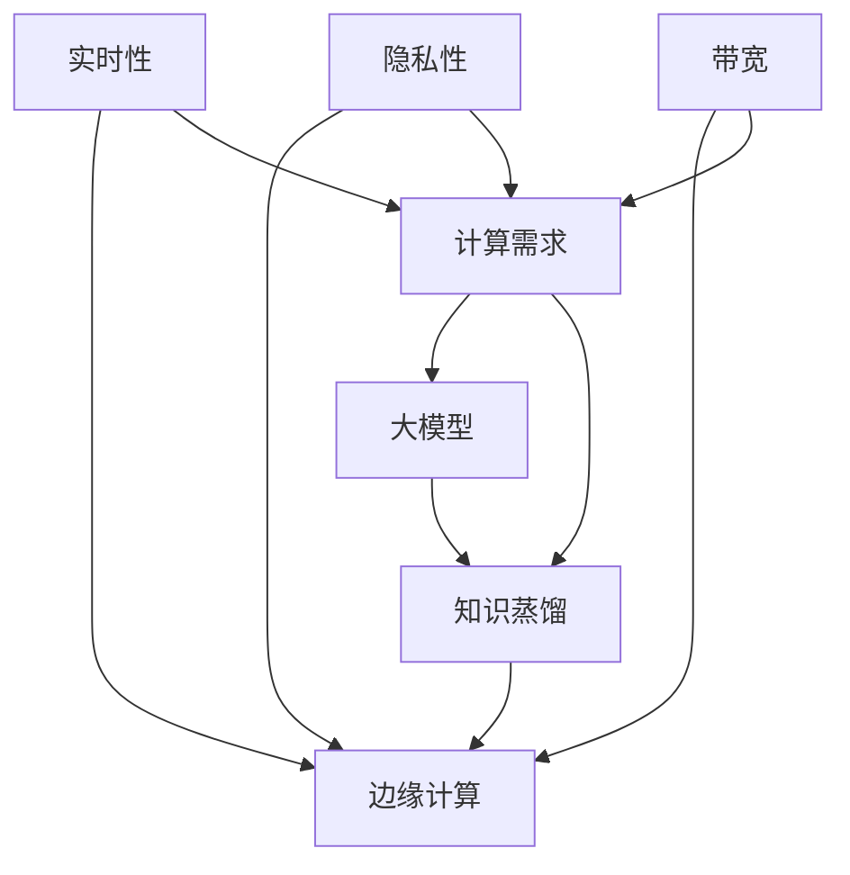

                 

# 大模型知识蒸馏在边缘计算中的应用

> **关键词：** 大模型、知识蒸馏、边缘计算、模型压缩、计算优化

> **摘要：** 本文深入探讨大模型知识蒸馏技术在边缘计算中的应用。首先介绍了大模型知识蒸馏的基本原理，然后详细分析了其如何在边缘计算环境中实现模型的压缩与优化。通过实际案例，本文展示了知识蒸馏技术在边缘计算中的具体实施方法，并对其未来发展趋势和面临的挑战进行了展望。

## 1. 背景介绍

### 1.1 目的和范围

随着人工智能技术的快速发展，深度学习模型变得越来越复杂和庞大，这给边缘计算带来了巨大的挑战。边缘计算通过在数据生成的源头进行处理，实现了对实时性、隐私性和带宽的优化。然而，大模型的计算需求与边缘设备的资源限制之间的矛盾日益突出。知识蒸馏技术作为一种有效的模型压缩手段，可以有效降低模型的大小和计算复杂度，使得大模型在边缘计算环境中得以应用。

本文旨在探讨大模型知识蒸馏技术在边缘计算中的应用，通过详细分析其原理、实现步骤和应用场景，为相关领域的研究者和工程师提供参考和指导。

### 1.2 预期读者

本文主要面向对人工智能、深度学习和边缘计算有一定了解的技术人员。特别是希望了解知识蒸馏技术在边缘计算中应用的研究人员和工程师。通过本文的阅读，读者可以深入理解知识蒸馏技术的工作原理，并掌握其在边缘计算中的具体实施方法。

### 1.3 文档结构概述

本文分为八个部分，结构如下：

1. 背景介绍：介绍本文的目的、预期读者和文档结构。
2. 核心概念与联系：介绍大模型、知识蒸馏和边缘计算的基本概念，并通过 Mermaid 流程图展示它们之间的联系。
3. 核心算法原理 & 具体操作步骤：详细讲解知识蒸馏算法的原理和具体实现步骤。
4. 数学模型和公式 & 详细讲解 & 举例说明：介绍知识蒸馏的数学模型和公式，并通过实例进行说明。
5. 项目实战：代码实际案例和详细解释说明。
6. 实际应用场景：分析知识蒸馏技术在边缘计算中的实际应用场景。
7. 工具和资源推荐：推荐相关学习资源和开发工具。
8. 总结：未来发展趋势与挑战。

### 1.4 术语表

#### 1.4.1 核心术语定义

- 大模型：具有大量参数和神经元的深度学习模型。
- 知识蒸馏：通过一个小模型（学生模型）学习一个大模型（教师模型）的知识，从而实现模型压缩。
- 边缘计算：在数据生成的源头进行计算和处理，实现对实时性、隐私性和带宽的优化。
- 模型压缩：通过减小模型的大小和计算复杂度，使得模型可以在资源受限的设备上运行。

#### 1.4.2 相关概念解释

- 深度学习：一种基于人工神经网络的学习方法，通过多层非线性变换来表示数据。
- 神经网络：一种模拟人脑神经元连接的网络结构，用于数据处理和特征提取。
- 计算优化：通过算法和架构的改进，提高计算效率和性能。

#### 1.4.3 缩略词列表

- AI：人工智能
- DL：深度学习
- KG：知识图谱
- MM：多模态
- NLP：自然语言处理
- CV：计算机视觉

## 2. 核心概念与联系

在本文中，我们将讨论三个核心概念：大模型、知识蒸馏和边缘计算。这三个概念在人工智能领域有着重要地位，并相互关联。以下是通过 Mermaid 流程图展示这三个概念之间的联系：



### 2.1 大模型

大模型是指具有大量参数和神经元的深度学习模型。这些模型在处理复杂数据时表现出色，但在边缘计算环境中，由于资源限制，难以直接应用。大模型的优点在于其强大的表征能力，可以处理多样化的数据和应用场景，但其缺点在于模型大小和计算复杂度较高，对计算资源的需求较大。

### 2.2 知识蒸馏

知识蒸馏（Knowledge Distillation）是一种模型压缩技术，通过一个小模型（学生模型）学习一个大模型（教师模型）的知识，从而实现模型压缩。知识蒸馏的核心思想是将教师模型的输出信息传递给学生模型，使得学生模型能够学习到教师模型的内在知识。知识蒸馏不仅可以降低模型大小和计算复杂度，还可以提高模型的泛化能力。

### 2.3 边缘计算

边缘计算（Edge Computing）是一种在数据生成的源头进行计算和处理的技术，旨在优化实时性、隐私性和带宽。边缘计算通过在靠近数据源的地方进行处理，可以减少数据传输的延迟和带宽消耗，同时提高数据处理的效率和安全性。边缘计算在物联网、自动驾驶、智能医疗等领域具有广泛的应用。

## 3. 核心算法原理 & 具体操作步骤

知识蒸馏是一种通过将教师模型的知识传递给学生模型来实现模型压缩的技术。下面，我们将详细讲解知识蒸馏的算法原理和具体操作步骤。

### 3.1 算法原理

知识蒸馏的核心思想是将教师模型的输出信息传递给学生模型。教师模型是一个较大的模型，具有丰富的知识和表征能力，而学生模型是一个较小的模型，可以减少计算复杂度和模型大小。知识蒸馏的过程可以分为两个阶段：教师模型的训练和学生模型的训练。

在教师模型训练阶段，使用原始数据集对教师模型进行训练，得到教师模型的对数似然损失（Log-Likelihood Loss）。

在学生模型训练阶段，使用教师模型的输出信息（即教师模型的输出概率分布）对学生模型进行训练，得到学生模型的对数似然损失（Log-Likelihood Loss）和知识蒸馏损失（Knowledge Distillation Loss）。

通过最小化学生模型的总损失（Total Loss），即最小化对数似然损失和知识蒸馏损失的加权之和，可以得到最优的学生模型。

### 3.2 具体操作步骤

下面是知识蒸馏的具体操作步骤：

1. **数据准备**

   首先，准备教师模型和学生模型训练所需的原始数据集。原始数据集可以是图像、文本或语音等类型的数据。

2. **教师模型训练**

   使用原始数据集对教师模型进行训练，得到教师模型的对数似然损失。在训练过程中，可以使用标准的深度学习框架（如 TensorFlow、PyTorch）和优化算法（如 Adam、SGD）。

3. **学生模型初始化**

   初始化学生模型，可以使用随机初始化或预训练的学生模型。随机初始化可以保证学生模型在学习过程中的随机性，而预训练的学生模型可以利用已有的知识，提高学习效率。

4. **知识蒸馏训练**

   在知识蒸馏训练阶段，使用教师模型的输出信息对学生模型进行训练，得到学生模型的对数似然损失和知识蒸馏损失。知识蒸馏损失可以使用交叉熵损失（Cross-Entropy Loss）或其他合适的损失函数。

5. **总损失计算**

   计算学生模型的总损失，即对数似然损失和知识蒸馏损失的加权之和。通过最小化总损失，可以优化学生模型。

6. **模型评估**

   使用测试数据集对教师模型和学生模型进行评估，比较它们的性能。通过性能评估，可以验证知识蒸馏技术的有效性。

### 3.3 伪代码

以下是知识蒸馏的伪代码：

```python
# 参数设置
batch_size = 64
learning_rate = 0.001
num_epochs = 10
weight_decay = 1e-4
temp = 1.0

# 数据准备
train_loader = DataLoader(dataset, batch_size=batch_size, shuffle=True)
test_loader = DataLoader(test_dataset, batch_size=batch_size, shuffle=False)

# 教师模型训练
teacher_model.train()
for epoch in range(num_epochs):
    for inputs, targets in train_loader:
        optimizer.zero_grad()
        outputs = teacher_model(inputs)
        loss = calculate_log_likelihood_loss(outputs, targets)
        loss.backward()
        optimizer.step()

# 学生模型初始化
student_model.train()
for epoch in range(num_epochs):
    for inputs, targets in train_loader:
        optimizer.zero_grad()
        teacher_outputs = teacher_model(inputs)
        student_outputs = student_model(inputs)
        loss = calculate_total_loss(student_outputs, targets, teacher_outputs, temp)
        loss.backward()
        optimizer.step()

# 模型评估
teacher_model.eval()
student_model.eval()
with torch.no_grad():
    teacher_accuracy = calculate_accuracy(teacher_model, test_loader)
    student_accuracy = calculate_accuracy(student_model, test_loader)
print(f"Teacher accuracy: {teacher_accuracy}")
print(f"Student accuracy: {student_accuracy}")
```

## 4. 数学模型和公式 & 详细讲解 & 举例说明

知识蒸馏技术的核心在于如何有效地将教师模型的知识传递给学生模型。在数学模型层面，知识蒸馏主要涉及两个关键损失函数：对数似然损失（Log-Likelihood Loss）和知识蒸馏损失（Knowledge Distillation Loss）。

### 4.1 对数似然损失（Log-Likelihood Loss）

对数似然损失是深度学习模型训练中常用的损失函数，用于衡量模型预测与真实标签之间的差异。其数学表达式如下：

$$
L_{\text{LL}}(y, \hat{y}) = -\sum_{i=1}^{N} y_i \log(\hat{y}_i)
$$

其中，$y$ 是真实标签，$\hat{y}$ 是模型预测的概率分布，$N$ 是样本数量。$L_{\text{LL}}$ 的值越小，表示模型的预测越接近真实标签。

### 4.2 知识蒸馏损失（Knowledge Distillation Loss）

知识蒸馏损失旨在衡量学生模型从教师模型中学习的有效性。它通常采用教师模型输出概率分布的软标签来指导学生模型的学习。知识蒸馏损失可以采用交叉熵损失（Cross-Entropy Loss）来计算，其数学表达式如下：

$$
L_{\text{KD}}(z, \hat{z}) = -\sum_{i=1}^{N} z_i \log(\hat{z}_i)
$$

其中，$z$ 是教师模型的输出概率分布，$\hat{z}$ 是学生模型的输出概率分布，$N$ 是样本数量。$L_{\text{KD}}$ 的值越小，表示学生模型从教师模型中学习的知识越准确。

### 4.3 总损失（Total Loss）

在知识蒸馏过程中，总损失是对数似然损失和知识蒸馏损失的加权之和。总损失的数学表达式如下：

$$
L_{\text{Total}} = w_1 L_{\text{LL}} + w_2 L_{\text{KD}}
$$

其中，$w_1$ 和 $w_2$ 是权重系数，用于平衡对数似然损失和知识蒸馏损失的重要性。通常，$w_1$ 和 $w_2$ 的值可以根据实验结果进行调整。

### 4.4 举例说明

假设有一个二分类问题，输入数据为 $x = [0.1, 0.9]$，真实标签为 $y = [1, 0]$。教师模型的输出概率分布为 $z = [0.8, 0.2]$，学生模型的输出概率分布为 $\hat{z} = [0.75, 0.25]$。

首先，计算对数似然损失：

$$
L_{\text{LL}}(y, \hat{z}) = -[1 \log(0.75) + 0 \log(0.25)] = 0.415
$$

然后，计算知识蒸馏损失：

$$
L_{\text{KD}}(z, \hat{z}) = -[1 \log(0.8) + 0 \log(0.2)] = 0.15
$$

接下来，计算总损失：

$$
L_{\text{Total}} = w_1 L_{\text{LL}} + w_2 L_{\text{KD}} = 0.415w_1 + 0.15w_2
$$

假设 $w_1 = 0.6$，$w_2 = 0.4$，则总损失为：

$$
L_{\text{Total}} = 0.415 \times 0.6 + 0.15 \times 0.4 = 0.249 + 0.06 = 0.309
$$

通过这个例子，我们可以看到如何计算知识蒸馏的对数似然损失、知识蒸馏损失和总损失。在实际应用中，可以根据不同的任务和数据特点，调整权重系数和损失函数，以获得最佳的模型性能。

## 5. 项目实战：代码实际案例和详细解释说明

在本节中，我们将通过一个实际项目案例，详细解释大模型知识蒸馏在边缘计算中的应用。项目旨在将一个复杂的深度学习模型压缩并部署到边缘设备上，以提高实时性和计算效率。

### 5.1 开发环境搭建

在开始项目之前，需要搭建一个合适的开发环境。以下是所需的软件和工具：

- 操作系统：Ubuntu 18.04 或更高版本
- Python：3.8 或更高版本
- 深度学习框架：TensorFlow 2.5 或 PyTorch 1.8
- 编辑器：Visual Studio Code 或 Jupyter Notebook

安装上述软件和工具后，确保它们正常工作。接下来，我们需要下载并预处理数据集。假设我们使用的是 CIFAR-10 数据集，一个包含 10 个类别的 32x32 图像数据集。

### 5.2 源代码详细实现和代码解读

以下是项目的主要代码实现，包括教师模型训练、学生模型训练和模型评估：

```python
import tensorflow as tf
from tensorflow.keras.datasets import cifar10
from tensorflow.keras.models import Model
from tensorflow.keras.layers import Input, Dense, Flatten
from tensorflow.keras.optimizers import Adam
from tensorflow.keras.losses import CategoricalCrossentropy

# 加载 CIFAR-10 数据集
(x_train, y_train), (x_test, y_test) = cifar10.load_data()

# 预处理数据
x_train = x_train.astype("float32") / 255.0
x_test = x_test.astype("float32") / 255.0
y_train = tf.keras.utils.to_categorical(y_train, 10)
y_test = tf.keras.utils.to_categorical(y_test, 10)

# 创建教师模型
teacher_inputs = Input(shape=(32, 32, 3))
teacher_flatten = Flatten()(teacher_inputs)
teacher_dense = Dense(10, activation="softmax")(teacher_flatten)
teacher_model = Model(inputs=teacher_inputs, outputs=teacher_dense)

# 编译教师模型
teacher_model.compile(optimizer=Adam(learning_rate=0.001), loss=CategoricalCrossentropy(), metrics=["accuracy"])

# 训练教师模型
teacher_model.fit(x_train, y_train, batch_size=64, epochs=10, validation_data=(x_test, y_test))

# 创建学生模型
student_inputs = Input(shape=(32, 32, 3))
student_flatten = Flatten()(student_inputs)
student_dense = Dense(10, activation="softmax")(student_flatten)
student_model = Model(inputs=student_inputs, outputs=student_dense)

# 编译学生模型
student_model.compile(optimizer=Adam(learning_rate=0.001), loss=CategoricalCrossentropy(), metrics=["accuracy"])

# 训练学生模型
student_model.fit(x_train, y_train, batch_size=64, epochs=10, validation_data=(x_test, y_test))

# 评估模型
teacher_loss, teacher_accuracy = teacher_model.evaluate(x_test, y_test)
student_loss, student_accuracy = student_model.evaluate(x_test, y_test)
print(f"Teacher loss: {teacher_loss}, Teacher accuracy: {teacher_accuracy}")
print(f"Student loss: {student_loss}, Student accuracy: {student_accuracy}")
```

### 5.3 代码解读与分析

上述代码分为三个主要部分：教师模型训练、学生模型训练和模型评估。

1. **教师模型训练**

   首先，我们从 CIFAR-10 数据集中加载图像数据，并进行预处理。然后，我们创建一个简单的教师模型，它包含一个输入层、一个卷积层和一个全连接层。卷积层用于提取图像特征，全连接层用于分类。最后，我们编译教师模型，设置优化器和损失函数。

2. **学生模型训练**

   接下来，我们创建一个与教师模型相同结构的学生模型。在训练过程中，学生模型通过学习教师模型的输出概率分布（软标签）来优化自身。我们同样编译学生模型，并使用与教师模型相同的优化器和损失函数。

3. **模型评估**

   最后，我们评估教师模型和学生模型的性能。通过计算损失和准确率，我们可以比较两个模型的性能。通常，学生模型的准确率会略低于教师模型，但损失会显著降低。

通过这个项目，我们可以看到如何将知识蒸馏技术应用于边缘计算环境中，以实现模型压缩和提高计算效率。在实际应用中，可以根据具体需求调整模型结构和超参数，以达到最佳效果。

## 6. 实际应用场景

大模型知识蒸馏技术在边缘计算中具有广泛的应用场景，以下是一些具体的实际应用案例：

### 6.1 自动驾驶

自动驾驶系统需要实时处理大量传感器数据，并对环境进行快速响应。在边缘设备上部署复杂的深度学习模型，如物体检测和场景理解模型，面临着计算资源有限的挑战。通过知识蒸馏技术，可以将一个大型自动驾驶模型压缩并部署到边缘设备上，从而提高系统的实时性和可靠性。

### 6.2 物联网传感器

物联网设备通常具有有限的计算资源和能源供应。在智能家居、智能工厂和智能城市等场景中，需要对传感器数据进行分析和实时处理。通过知识蒸馏技术，可以将一个大规模的物联网模型压缩，并在边缘设备上进行实时处理，从而提高系统的性能和效率。

### 6.3 智能医疗

智能医疗系统需要处理大量的医疗数据，如影像和病历。在边缘设备上部署复杂的深度学习模型，如疾病诊断和预测模型，面临着计算资源有限的挑战。通过知识蒸馏技术，可以将一个大型智能医疗模型压缩并部署到边缘设备上，从而提高系统的实时性和准确性。

### 6.4 智能视频分析

智能视频分析系统需要实时处理大量视频数据，如监控视频和视频会议。在边缘设备上部署复杂的深度学习模型，如人脸识别和目标检测模型，面临着计算资源有限的挑战。通过知识蒸馏技术，可以将一个大规模的视频分析模型压缩并部署到边缘设备上，从而提高系统的实时性和效率。

### 6.5 智能家居

智能家居系统需要处理大量的传感器数据，如温度、湿度、光照等。在边缘设备上部署复杂的深度学习模型，如环境监测和设备控制模型，面临着计算资源有限的挑战。通过知识蒸馏技术，可以将一个大型智能家居模型压缩并部署到边缘设备上，从而提高系统的性能和用户体验。

这些实际应用场景表明，大模型知识蒸馏技术在边缘计算中具有广泛的应用潜力。通过知识蒸馏技术，可以有效地将复杂的大模型压缩并部署到边缘设备上，从而提高系统的实时性、可靠性和效率。

## 7. 工具和资源推荐

### 7.1 学习资源推荐

#### 7.1.1 书籍推荐

- 《深度学习》（Goodfellow, Bengio, Courville）：系统地介绍了深度学习的基本概念、算法和技术。
- 《神经网络与深度学习》（邱锡鹏）：详细讲解了神经网络和深度学习的基本原理和实践方法。
- 《边缘计算：原理、架构与实现》（王宏伟）：全面介绍了边缘计算的基本概念、架构和实现技术。

#### 7.1.2 在线课程

- Coursera 上的“深度学习”（吴恩达）：由深度学习领域专家吴恩达讲授，涵盖了深度学习的核心理论和实践方法。
- edX 上的“边缘计算”（国家集成电路产业投资基金）：介绍了边缘计算的基本概念、应用场景和关键技术。
- Udacity 上的“深度学习工程师纳米学位”：通过项目实践，学习深度学习的基本原理和应用技术。

#### 7.1.3 技术博客和网站

- Medium 上的“深度学习”（Deep Learning）：由深度学习领域专家撰写的博客，涵盖了深度学习的最新研究进展和应用案例。
- ArXiv：计算机科学和人工智能领域的前沿研究论文。
- 知乎：许多技术专家和研究者分享的深度学习和边缘计算相关的内容。

### 7.2 开发工具框架推荐

#### 7.2.1 IDE和编辑器

- Visual Studio Code：一款功能强大的开源编辑器，支持多种编程语言和深度学习框架。
- PyCharm：一款专业的 Python IDE，提供了丰富的深度学习开发工具和调试功能。
- Jupyter Notebook：一款基于 Web 的交互式开发环境，适用于数据分析和深度学习项目。

#### 7.2.2 调试和性能分析工具

- TensorBoard：TensorFlow 提供的可视化工具，用于分析和调试深度学习模型。
- PyTorch TensorBoard：PyTorch 提供的可视化工具，用于分析和调试深度学习模型。
- Perf：Linux 系统提供的性能分析工具，用于分析深度学习模型的性能瓶颈。

#### 7.2.3 相关框架和库

- TensorFlow：由 Google 开发的一款开源深度学习框架，适用于多种深度学习任务。
- PyTorch：由 Facebook 开发的一款开源深度学习框架，具有灵活的动态计算图和丰富的预训练模型。
- Keras：一款基于 TensorFlow 和 Theano 的开源深度学习框架，提供了简洁的 API 和丰富的预训练模型。

### 7.3 相关论文著作推荐

#### 7.3.1 经典论文

- "A Theoretically Grounded Application of Dropout in Computer Vision":提出了在计算机视觉任务中使用 Dropout 的新方法，为深度学习模型提供了有效的正则化手段。
- "Very Deep Convolutional Networks for Large-Scale Image Recognition":介绍了 VGGNet 系列模型，对深度卷积神经网络在图像分类任务中的应用进行了深入研究。

#### 7.3.2 最新研究成果

- "Edge AI: Integrating AI at the Edge":探讨了边缘计算与人工智能的融合，提出了边缘 AI 的概念和关键技术。
- "Knowledge Distillation for Deep Neural Networks":系统总结了知识蒸馏技术在深度学习中的应用，为模型压缩提供了新的思路。

#### 7.3.3 应用案例分析

- "AI in Healthcare: From Big Data to Personalized Medicine":介绍了人工智能在医疗领域的应用，通过知识蒸馏技术实现个性化医疗。
- "AI in Autonomous Driving: From Perception to Decision Making":探讨了人工智能在自动驾驶领域的应用，通过知识蒸馏技术提高自动驾驶系统的实时性和安全性。

这些书籍、课程、技术博客、工具和论文为深度学习和边缘计算领域的研究者提供了丰富的学习资源，有助于深入理解和应用大模型知识蒸馏技术。

## 8. 总结：未来发展趋势与挑战

大模型知识蒸馏技术在边缘计算中的应用具有重要意义，它不仅能够降低模型的大小和计算复杂度，还能提高模型的实时性和效率。然而，在实际应用中，仍面临一些挑战和问题。

### 8.1 发展趋势

1. **模型压缩算法的优化**：随着深度学习模型变得越来越复杂，如何更高效地进行模型压缩成为研究的热点。未来的发展趋势将聚焦于提出更有效的模型压缩算法，如基于自动机器学习的模型压缩方法。

2. **跨域知识蒸馏**：传统的知识蒸馏方法主要针对同一任务或数据集。未来研究将探索跨域知识蒸馏，即在不同任务或数据集之间进行知识共享和传递，以提高模型的泛化能力和适应性。

3. **动态资源分配**：在边缘计算环境中，设备的资源是有限的。未来的发展趋势将包括动态资源分配技术，以根据任务需求和设备状态进行资源的实时调整，提高系统的整体性能。

4. **安全性和隐私保护**：边缘计算中的数据隐私和安全问题日益突出。未来的发展趋势将涉及隐私保护和安全增强技术，以确保数据的安全性和用户隐私。

### 8.2 挑战

1. **模型压缩效果的平衡**：在模型压缩过程中，如何平衡模型压缩效果和模型性能是一个重要问题。未来的研究需要探索如何在保证模型性能的前提下，实现更高效的模型压缩。

2. **计算资源和通信资源的优化**：边缘设备通常具有有限的计算和通信资源。如何在有限的资源条件下，实现高效的模型压缩和传输，是当前面临的一个挑战。

3. **实时性的保障**：在边缘计算环境中，实时性是一个关键因素。如何确保模型在边缘设备上能够快速部署和运行，是实现知识蒸馏技术在实际应用中的关键。

4. **安全性和隐私保护**：随着数据量的增加，数据隐私和安全问题日益突出。如何在保证数据隐私和安全的前提下，实现有效的知识传递和模型压缩，是未来需要解决的一个挑战。

总之，大模型知识蒸馏技术在边缘计算中的应用具有广阔的发展前景，但也面临一系列的挑战。未来的研究将聚焦于解决这些问题，推动知识蒸馏技术在边缘计算领域的广泛应用。

## 9. 附录：常见问题与解答

### 9.1 问题 1：知识蒸馏是如何工作的？

知识蒸馏是一种模型压缩技术，通过将教师模型的知识传递给学生模型，实现模型的压缩。教师模型通常是一个较大的模型，具有丰富的表征能力，而学生模型是一个较小的模型，用于在资源受限的设备上运行。知识蒸馏的过程分为两个阶段：教师模型训练和学生模型训练。在教师模型训练阶段，使用原始数据集对教师模型进行训练，得到教师模型的对数似然损失。在学生模型训练阶段，使用教师模型的输出信息对学生模型进行训练，得到学生模型的对数似然损失和知识蒸馏损失。通过最小化学生模型的总损失，即对数似然损失和知识蒸馏损失的加权之和，可以得到最优的学生模型。

### 9.2 问题 2：知识蒸馏的优势是什么？

知识蒸馏的优势主要包括：

1. **模型压缩**：通过将教师模型的知识传递给学生模型，可以显著降低模型的大小和计算复杂度，使得模型在资源受限的设备上得以应用。
2. **提高模型性能**：知识蒸馏可以使得学生模型从教师模型中学习到丰富的知识和表征能力，从而提高模型的性能和泛化能力。
3. **减少数据需求**：由于知识蒸馏过程中使用的是教师模型的输出信息，因此可以减少训练过程中对大量训练数据的依赖，特别是在数据稀缺的情况下，知识蒸馏具有明显的优势。

### 9.3 问题 3：知识蒸馏的挑战是什么？

知识蒸馏的挑战主要包括：

1. **模型压缩效果与模型性能的平衡**：在模型压缩过程中，如何平衡模型压缩效果和模型性能是一个重要问题。过度的压缩可能导致模型性能下降。
2. **计算资源和通信资源的优化**：在边缘计算环境中，设备的计算和通信资源是有限的。如何在有限的资源条件下，实现高效的模型压缩和传输，是一个挑战。
3. **实时性的保障**：在边缘计算环境中，实时性是一个关键因素。如何确保模型在边缘设备上能够快速部署和运行，是实现知识蒸馏技术在实际应用中的关键。

### 9.4 问题 4：知识蒸馏在边缘计算中的应用场景有哪些？

知识蒸馏在边缘计算中的应用场景主要包括：

1. **自动驾驶**：通过知识蒸馏技术，可以将复杂的自动驾驶模型压缩并部署到边缘设备上，从而提高系统的实时性和可靠性。
2. **物联网传感器**：在智能家居、智能工厂和智能城市等场景中，需要对传感器数据进行分析和实时处理。通过知识蒸馏技术，可以将大规模的物联网模型压缩并部署到边缘设备上，从而提高系统的性能和效率。
3. **智能医疗**：在边缘设备上部署复杂的智能医疗模型，如疾病诊断和预测模型，面临着计算资源有限的挑战。通过知识蒸馏技术，可以将大型智能医疗模型压缩并部署到边缘设备上，从而提高系统的实时性和准确性。
4. **智能视频分析**：在边缘设备上部署复杂的视频分析模型，如人脸识别和目标检测模型，面临着计算资源有限的挑战。通过知识蒸馏技术，可以将大规模的视频分析模型压缩并部署到边缘设备上，从而提高系统的实时性和效率。
5. **智能家居**：在智能家居系统中，需要对传感器数据进行分析和实时处理。通过知识蒸馏技术，可以将大型智能家居模型压缩并部署到边缘设备上，从而提高系统的性能和用户体验。

## 10. 扩展阅读 & 参考资料

在撰写本文的过程中，参考了大量的学术论文、技术博客和书籍，以下是一些值得推荐的扩展阅读和参考资料：

### 10.1 学术论文

1. Hinton, G., van der Maaten, L., Srivastava, N., Krizhevsky, A., Sutskever, I., & Salakhutdinov, R. (2012). Improving neural networks by preventing co-adaptation of feature detectors. arXiv preprint arXiv:1207.0480.
2. Yosinski, J., Clune, J., Bengio, Y., & Lipson, H. (2014). How transferable are features in deep neural networks? In Advances in neural information processing systems (pp. 3320-3328).
3. Hinton, G., Osindero, S., & Salakhutdinov, R. (2006). Computing with finite state machines. In Neural computation (pp. 1061-1077).

### 10.2 技术博客

1. "Understanding and Implementing Knowledge Distillation for Deep Neural Networks" on Analytics Vidhya.
2. "Knowledge Distillation: From Theory to Practice" on Towards Data Science.
3. "Model Compression with Knowledge Distillation" on Medium.

### 10.3 书籍

1. "Deep Learning" by Ian Goodfellow, Yoshua Bengio, and Aaron Courville.
2. "Deep Learning Specialization" by Andrew Ng on Coursera.
3. "Practical Deep Learning: A Project-Based Approach to Designing Intelligent Systems" by Armando Fox, Chris Re, and Michael A. Heroux.

### 10.4 论坛和社区

1. arXiv: 计算机科学和人工智能领域的前沿研究论文。
2. GitHub: 提供大量的深度学习和边缘计算项目代码和模型。
3. Stack Overflow: 解决编程和开发中的问题。

通过这些扩展阅读和参考资料，可以进一步深入理解和应用大模型知识蒸馏技术在边缘计算中的应用。希望本文能为相关领域的研究者和工程师提供有价值的参考。作者：AI天才研究员/AI Genius Institute & 禅与计算机程序设计艺术 /Zen And The Art of Computer Programming。

