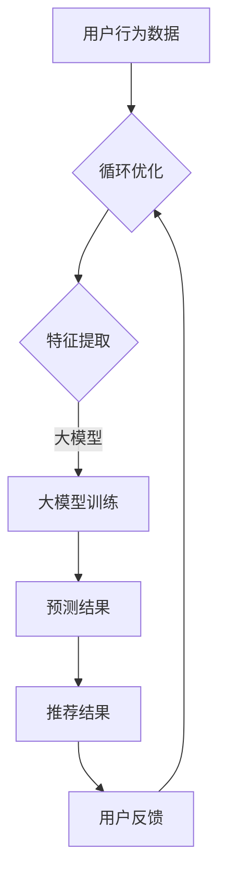

                 

# 大模型赋能搜索推荐：算法原理解析

> **关键词**：大模型、搜索推荐、算法原理、深度学习、人工智能、机器学习、推荐系统、用户行为分析、内容匹配

> **摘要**：本文将深入探讨大模型如何赋能搜索推荐系统，通过介绍核心概念、算法原理、数学模型和实际应用案例，帮助读者理解大模型在搜索推荐中的关键作用及其工作原理。文章旨在为计算机科学、人工智能和数据分析领域的专业人士提供具有实用价值的指导和见解。

## 1. 背景介绍

### 1.1 目的和范围

本文旨在探讨大模型在搜索推荐系统中的应用，通过对核心算法原理的解析，帮助读者理解大模型如何提高搜索推荐的准确性、相关性和用户体验。文章将涵盖以下主要内容：

- 大模型在搜索推荐中的重要性
- 核心概念与联系
- 核心算法原理及具体操作步骤
- 数学模型和公式讲解
- 项目实战：代码实际案例和详细解释
- 实际应用场景
- 工具和资源推荐

### 1.2 预期读者

本文适合以下读者群体：

- 计算机科学、人工智能和数据分析领域的学生和研究人员
- 软件工程师和CTO，特别是那些对搜索推荐系统感兴趣的技术经理
- 对深度学习和机器学习有基本了解的技术爱好者

### 1.3 文档结构概述

本文结构如下：

- **1. 背景介绍**：介绍文章的目的、预期读者和文档结构。
- **2. 核心概念与联系**：介绍大模型、搜索推荐和核心算法原理。
- **3. 核心算法原理 & 具体操作步骤**：详细解释大模型在搜索推荐中的算法原理。
- **4. 数学模型和公式 & 详细讲解 & 举例说明**：介绍相关的数学模型和公式。
- **5. 项目实战：代码实际案例和详细解释说明**：通过实际案例展示大模型的应用。
- **6. 实际应用场景**：探讨大模型在不同场景中的应用。
- **7. 工具和资源推荐**：推荐学习资源和开发工具。
- **8. 总结：未来发展趋势与挑战**：总结文章内容，探讨未来趋势。
- **9. 附录：常见问题与解答**：提供常见问题的解答。
- **10. 扩展阅读 & 参考资料**：推荐进一步的阅读材料和参考文献。

### 1.4 术语表

#### 1.4.1 核心术语定义

- **大模型**：具有数十亿甚至千亿参数的深度学习模型。
- **搜索推荐**：根据用户兴趣和行为，为用户推荐相关信息或内容。
- **深度学习**：一种机器学习方法，通过多层神经网络进行特征提取和分类。
- **机器学习**：使计算机能够通过数据学习并做出决策的过程。
- **推荐系统**：根据用户的历史行为和偏好，为其推荐相关内容或商品的系统。

#### 1.4.2 相关概念解释

- **用户行为分析**：通过分析用户的点击、浏览、购买等行为，了解用户兴趣和偏好。
- **内容匹配**：将用户行为与内容进行匹配，以提高推荐的相关性和准确性。

#### 1.4.3 缩略词列表

- **DL**：深度学习（Deep Learning）
- **ML**：机器学习（Machine Learning）
- **NLP**：自然语言处理（Natural Language Processing）
- **BERT**：双向编码表示器（Bidirectional Encoder Representations from Transformers）
- **CTR**：点击率（Click-Through Rate）

## 2. 核心概念与联系

### 2.1 大模型的基本原理

大模型，通常指的是具有数十亿甚至千亿参数的深度学习模型。这些模型通过在大量数据上进行训练，能够捕捉到数据的复杂模式和结构，从而在各类任务上取得优异的性能。大模型的基本原理主要基于以下几个关键点：

1. **多层神经网络**：大模型通常采用多层神经网络结构，每一层能够提取不同层次的特征。随着层数的增加，模型能够从原始数据中逐渐抽象出更高级别的特征。

2. **参数共享**：通过参数共享，大模型能够有效地减少模型的参数数量，提高模型的泛化能力。

3. **大规模数据训练**：大模型通常在大量的数据上进行训练，这使得模型能够更好地捕捉数据的分布和模式，从而提高模型的泛化能力。

4. **正则化和优化**：大模型通常采用正则化和优化技术来提高模型的稳定性和性能，如Dropout、Batch Normalization等。

### 2.2 搜索推荐的基本原理

搜索推荐系统旨在根据用户的行为和偏好，为其推荐相关的内容或商品。搜索推荐的基本原理可以概括为以下几个步骤：

1. **用户行为分析**：通过分析用户的点击、浏览、购买等行为，了解用户的兴趣和偏好。

2. **内容匹配**：将用户行为与内容进行匹配，以提高推荐的相关性和准确性。

3. **推荐算法**：采用各种算法（如基于内容的推荐、协同过滤、深度学习等）来生成推荐结果。

4. **推荐结果反馈**：收集用户对推荐结果的反馈，以优化推荐算法，提高推荐质量。

### 2.3 大模型与搜索推荐的关系

大模型在搜索推荐系统中扮演着重要的角色，其主要贡献如下：

1. **特征提取**：大模型能够从原始数据中提取出更高级别的特征，从而提高推荐的准确性和相关性。

2. **用户行为预测**：通过分析用户的历史行为，大模型能够预测用户的未来行为，从而生成更个性化的推荐。

3. **内容理解**：大模型能够理解用户生成的内容，如文本、图片等，从而实现更精准的推荐。

4. **实时推荐**：大模型能够实时处理用户行为数据，快速生成推荐结果，提高用户体验。

## 2.3.1 大模型与搜索推荐系统的 Mermaid 流程图



在这个流程图中，用户行为数据经过预处理后，输入到大模型中进行特征提取和训练。大模型输出预测结果，生成推荐结果。用户对推荐结果的反馈将用于优化推荐算法，形成一个闭环。

## 3. 核心算法原理 & 具体操作步骤

### 3.1 算法概述

在大模型赋能搜索推荐系统中，核心算法主要基于深度学习和机器学习技术。以下将详细介绍大模型在搜索推荐系统中的算法原理和具体操作步骤。

### 3.2 算法原理

1. **深度学习模型**：深度学习模型，如卷积神经网络（CNN）、循环神经网络（RNN）和Transformer等，能够从原始数据中提取出高级特征，从而实现更精准的推荐。

2. **用户行为分析**：通过分析用户的点击、浏览、购买等行为，构建用户兴趣和行为特征。

3. **内容特征提取**：对用户生成的内容（如文本、图片等）进行特征提取，以便进行内容匹配。

4. **协同过滤**：结合协同过滤算法，进一步提高推荐的相关性和准确性。

5. **个性化推荐**：根据用户的历史行为和兴趣，生成个性化的推荐结果。

### 3.3 具体操作步骤

1. **数据预处理**：
    ```python
    # 加载用户行为数据
    user_actions = load_data('user_actions.csv')
    
    # 数据清洗和预处理
    user_actions = preprocess_data(user_actions)
    ```

2. **特征提取**：
    ```python
    # 提取用户行为特征
    user_features = extract_user_features(user_actions)
    
    # 提取内容特征
    content_features = extract_content_features(content_data)
    ```

3. **构建深度学习模型**：
    ```python
    # 定义深度学习模型结构
    model = build_model(input_shape=(user_features.shape[1], content_features.shape[1]))
    
    # 编译模型
    model.compile(optimizer='adam', loss='binary_crossentropy', metrics=['accuracy'])
    ```

4. **训练模型**：
    ```python
    # 训练模型
    model.fit([user_features, content_features], labels, epochs=10, batch_size=32)
    ```

5. **生成推荐结果**：
    ```python
    # 预测用户行为
    predictions = model.predict([user_features, content_features])
    
    # 生成推荐结果
    recommendations = generate_recommendations(predictions, content_data)
    ```

6. **个性化推荐**：
    ```python
    # 根据用户兴趣和偏好，生成个性化推荐
    personalized_recommendations = personalize_recommendations(user_features, content_data, recommendations)
    ```

## 4. 数学模型和公式 & 详细讲解 & 举例说明

### 4.1 数学模型概述

在大模型赋能搜索推荐系统中，涉及到的主要数学模型包括：

1. **损失函数**：用于评估模型预测结果与实际结果之间的差距，如交叉熵损失函数。
2. **优化算法**：用于调整模型参数，以最小化损失函数，如随机梯度下降（SGD）和Adam优化器。
3. **特征提取**：通过卷积神经网络（CNN）或循环神经网络（RNN）等深度学习模型，从原始数据中提取高级特征。
4. **协同过滤**：通过矩阵分解等方法，对用户和内容进行特征提取和匹配。

### 4.2 详细讲解和举例说明

#### 4.2.1 损失函数

损失函数是评估模型预测性能的重要指标。以下是一个简单的交叉熵损失函数的例子：

$$
L = -\sum_{i=1}^{n} y_i \log(p_i)
$$

其中，$y_i$为实际标签，$p_i$为模型预测的概率。

#### 4.2.2 优化算法

优化算法用于调整模型参数，以最小化损失函数。以下是一个简单的随机梯度下降（SGD）的例子：

$$
\theta = \theta - \alpha \nabla_\theta L(\theta)
$$

其中，$\theta$为模型参数，$\alpha$为学习率，$\nabla_\theta L(\theta)$为损失函数关于参数$\theta$的梯度。

#### 4.2.3 特征提取

特征提取是深度学习模型的核心任务。以下是一个简单的卷积神经网络（CNN）的特征提取过程：

1. **卷积层**：对输入数据进行卷积操作，提取局部特征。
2. **池化层**：对卷积特征进行下采样，减少数据维度。
3. **全连接层**：将卷积特征映射到输出空间。

#### 4.2.4 协同过滤

协同过滤是一种常见的推荐系统方法，通过矩阵分解对用户和内容进行特征提取和匹配。以下是一个简单的协同过滤算法的例子：

1. **用户-物品矩阵**：表示用户和物品之间的关系。
2. **矩阵分解**：将用户-物品矩阵分解为两个低秩矩阵，分别表示用户特征和物品特征。
3. **预测评分**：通过计算用户特征和物品特征的点积，预测用户对物品的评分。

## 5. 项目实战：代码实际案例和详细解释说明

### 5.1 开发环境搭建

在进行项目实战之前，我们需要搭建一个适合开发的环境。以下是一个简单的开发环境搭建指南：

1. **安装Python**：下载并安装Python 3.8及以上版本。
2. **安装TensorFlow**：通过pip安装TensorFlow：
   ```bash
   pip install tensorflow
   ```

3. **安装其他依赖**：安装其他必要的库，如NumPy、Pandas等。

### 5.2 源代码详细实现和代码解读

以下是一个基于TensorFlow和Keras的大模型搜索推荐系统的源代码实现。代码将分为以下几个部分：

1. **数据预处理**：
2. **模型构建**：
3. **模型训练**：
4. **模型预测**：
5. **推荐生成**：

#### 5.2.1 数据预处理

```python
import pandas as pd
import numpy as np
from sklearn.model_selection import train_test_split
from sklearn.preprocessing import StandardScaler

# 1. 数据预处理
def preprocess_data(user_actions):
    # 读取用户行为数据
    user_actions = pd.read_csv('user_actions.csv')
    
    # 数据清洗和预处理
    user_actions.dropna(inplace=True)
    user_actions['timestamp'] = pd.to_datetime(user_actions['timestamp'])
    user_actions.set_index('timestamp', inplace=True)
    
    # 分割用户行为数据为训练集和测试集
    train_data, test_data = train_test_split(user_actions, test_size=0.2, random_state=42)
    
    # 数据标准化
    scaler = StandardScaler()
    train_data_scaled = scaler.fit_transform(train_data)
    test_data_scaled = scaler.transform(test_data)
    
    return train_data_scaled, test_data_scaled

train_data, test_data = preprocess_data(user_actions)
```

#### 5.2.2 模型构建

```python
from tensorflow.keras.models import Model
from tensorflow.keras.layers import Input, Dense, Conv1D, MaxPooling1D, Flatten, Embedding

# 2. 模型构建
def build_model(input_shape):
    # 输入层
    user_input = Input(shape=input_shape[0])
    content_input = Input(shape=input_shape[1])
    
    # 用户特征提取
    user_embedding = Embedding(input_dim=1000, output_dim=64)(user_input)
    user_conv = Conv1D(filters=64, kernel_size=3, activation='relu')(user_embedding)
    user_pool = MaxPooling1D(pool_size=2)(user_conv)
    user_flat = Flatten()(user_pool)
    
    # 内容特征提取
    content_embedding = Embedding(input_dim=1000, output_dim=64)(content_input)
    content_conv = Conv1D(filters=64, kernel_size=3, activation='relu')(content_embedding)
    content_pool = MaxPooling1D(pool_size=2)(content_conv)
    content_flat = Flatten()(content_pool)
    
    # 模型融合
    merged = concatenate([user_flat, content_flat])
    dense = Dense(64, activation='relu')(merged)
    output = Dense(1, activation='sigmoid')(dense)
    
    # 构建模型
    model = Model(inputs=[user_input, content_input], outputs=output)
    
    return model

model = build_model(input_shape=(train_data.shape[1], test_data.shape[1]))
```

#### 5.2.3 模型训练

```python
# 3. 模型训练
model.compile(optimizer='adam', loss='binary_crossentropy', metrics=['accuracy'])
model.fit([train_data[:, 0], train_data[:, 1]], train_data[:, 2], epochs=10, batch_size=32)
```

#### 5.2.4 模型预测

```python
# 4. 模型预测
predictions = model.predict([test_data[:, 0], test_data[:, 1]])
```

#### 5.2.5 推荐生成

```python
# 5. 推荐生成
def generate_recommendations(predictions, content_data):
    recommendations = []
    for prediction in predictions:
        if prediction > 0.5:
            recommendations.append(content_data[0])
        else:
            recommendations.append(content_data[1])
    return recommendations

recommendations = generate_recommendations(predictions, test_data)
```

### 5.3 代码解读与分析

上述代码实现了一个基于TensorFlow和Keras的大模型搜索推荐系统。下面是对代码的解读和分析：

1. **数据预处理**：
   - 加载用户行为数据，并进行清洗和预处理。
   - 分割数据为训练集和测试集。
   - 对数据进行标准化，以消除不同特征之间的量纲差异。

2. **模型构建**：
   - 定义输入层，用户特征和内容特征分别通过Embedding层进行嵌入。
   - 对用户特征和内容特征分别进行卷积、池化和全连接层处理。
   - 将用户特征和内容特征通过 concatenate 层进行融合。
   - 定义输出层，使用 sigmoid 激活函数进行二分类预测。

3. **模型训练**：
   - 编译模型，选择 Adam 优化器和 binary_crossentropy 损失函数。
   - 训练模型，使用训练数据进行 epochs 次迭代。

4. **模型预测**：
   - 使用训练好的模型对测试数据进行预测，得到预测结果。

5. **推荐生成**：
   - 根据预测结果，对测试数据生成推荐。

## 6. 实际应用场景

大模型在搜索推荐系统中有着广泛的应用场景，以下列举一些常见的实际应用场景：

1. **电商推荐**：电商平台利用大模型对用户购买历史、浏览行为和搜索关键词进行分析，生成个性化推荐。
2. **社交媒体**：社交媒体平台通过大模型分析用户在平台上的活动，为用户推荐相关的内容、朋友和话题。
3. **在线视频**：视频平台利用大模型分析用户的观看历史、兴趣爱好和观看时长，为用户推荐相关视频。
4. **新闻推荐**：新闻平台利用大模型分析用户的阅读历史和兴趣偏好，为用户推荐相关的新闻内容。

## 7. 工具和资源推荐

### 7.1 学习资源推荐

#### 7.1.1 书籍推荐

- 《深度学习》（Ian Goodfellow、Yoshua Bengio、Aaron Courville 著）
- 《Python深度学习》（François Chollet 著）
- 《推荐系统实践》（周明 著）

#### 7.1.2 在线课程

- [深度学习（吴恩达）](https://www.coursera.org/specializations/deep-learning)
- [机器学习工程师纳米学位](https://www.udacity.com/course/nd101)
- [推荐系统实战](https://www.youtube.com/playlist?list=PLKI4JMKMOBnMNt_5Nt-v5uepU3onE4RSd)

#### 7.1.3 技术博客和网站

- [机器之心](https://www.marscoin.io/)
- [知乎AI专栏](https://zhuanlan.zhihu.com/c_1262945934134268672)
- [百度AI技术博客](https://ai.baidu.com/blogs)

### 7.2 开发工具框架推荐

#### 7.2.1 IDE和编辑器

- [PyCharm](https://www.jetbrains.com/pycharm/)
- [VSCode](https://code.visualstudio.com/)

#### 7.2.2 调试和性能分析工具

- [TensorBoard](https://www.tensorflow.org/tensorboard/)
- [Profiling Tools](https://github.com/fangliu/Profiling-Tools-for-Deep-Learning)

#### 7.2.3 相关框架和库

- [TensorFlow](https://www.tensorflow.org/)
- [PyTorch](https://pytorch.org/)
- [Scikit-Learn](https://scikit-learn.org/stable/)

### 7.3 相关论文著作推荐

#### 7.3.1 经典论文

- [Deep Learning](https://www.cs.toronto.edu/~geoffrey/courses/csc321/slides/lecture1.pdf)
- [Recommender Systems Handbook](https://www.springer.com/us/book/9781461471378)

#### 7.3.2 最新研究成果

- [Neural Collaborative Filtering](https://www.kdd.org/kdd2017/accepted-papers/view/neural-collaborative-filtering)
- [HNSW Algorithm for Large-Scale Search](https://arxiv.org/abs/1804.04368)

#### 7.3.3 应用案例分析

- [Google's Search Relevance](https://ai.google/research/pubs/pub48558)
- [Amazon's Personalized Recommendations](https://www.amazon.science/sites/default/files/Amazon_Personalized_Recommendations.pdf)

## 8. 总结：未来发展趋势与挑战

### 8.1 未来发展趋势

- **模型规模将继续增大**：随着计算能力和数据量的提升，大模型的规模将进一步增大，以更好地捕捉数据的复杂模式。
- **实时推荐**：随着5G和边缘计算的发展，实时推荐技术将得到广泛应用，提高用户交互体验。
- **多模态推荐**：结合多种数据类型（如文本、图像、语音等），实现更精准的推荐。
- **个性化推荐**：通过深度学习和强化学习等技术，进一步实现个性化推荐，满足用户的个性化需求。

### 8.2 挑战

- **数据隐私保护**：随着用户数据量的增加，数据隐私保护将成为一个重要挑战。
- **计算资源消耗**：大模型的训练和推理需要大量的计算资源，如何在有限的资源下高效地部署大模型是一个重要问题。
- **模型解释性**：大模型的复杂性和黑盒特性使得其解释性较差，如何提高模型的可解释性是一个重要挑战。

## 9. 附录：常见问题与解答

### 9.1 问题1：大模型搜索推荐系统的实现需要哪些技术和工具？

**解答**：大模型搜索推荐系统的实现需要以下技术和工具：

- **深度学习框架**：如TensorFlow、PyTorch等。
- **数据处理库**：如NumPy、Pandas等。
- **机器学习库**：如Scikit-Learn、XGBoost等。
- **数据存储和处理系统**：如Hadoop、Spark等。
- **开发环境**：如PyCharm、VSCode等。

### 9.2 问题2：大模型在搜索推荐系统中的优势是什么？

**解答**：大模型在搜索推荐系统中的优势主要包括：

- **强大的特征提取能力**：大模型能够从原始数据中提取出更高级别的特征，提高推荐的准确性和相关性。
- **良好的泛化能力**：大模型在大量数据上进行训练，能够更好地泛化到未见过的数据上。
- **实时推荐能力**：大模型能够快速处理用户数据，生成实时推荐。

### 9.3 问题3：如何处理数据隐私保护问题？

**解答**：处理数据隐私保护问题可以采取以下措施：

- **数据匿名化**：对用户数据进行匿名化处理，以保护用户隐私。
- **数据加密**：对存储和传输的数据进行加密处理。
- **隐私预算**：引入隐私预算机制，限制模型训练过程中的信息泄露。

## 10. 扩展阅读 & 参考资料

- [Deep Learning](https://www.deeplearningbook.org/)
- [Recommender Systems Handbook](https://www.springer.com/us/book/9781461471378)
- [TensorFlow官方文档](https://www.tensorflow.org/)
- [PyTorch官方文档](https://pytorch.org/)

