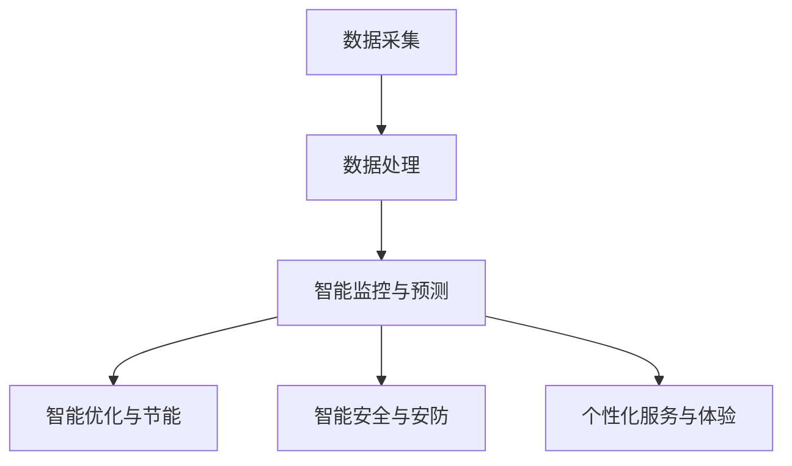

                 

# 大模型赋能智慧建筑，创业者如何打造智能化建筑与设施？

> 关键词：大模型、智慧建筑、智能化、创业、建筑与设施

> 摘要：本文将探讨大模型在智慧建筑领域的应用，分析创业者如何利用大模型技术打造智能化建筑与设施。通过深入解析核心概念、算法原理、数学模型以及实际应用场景，本文旨在为创业者提供一套全面的技术指南。

## 1. 背景介绍

### 1.1 目的和范围

本文旨在帮助创业者了解大模型在智慧建筑领域的应用，以及如何利用大模型技术打造智能化建筑与设施。文章将涵盖以下内容：

- 大模型的概念和原理
- 大模型在智慧建筑中的应用场景
- 创业者如何利用大模型技术打造智能化建筑与设施
- 实际案例和项目实战

### 1.2 预期读者

- 创业者
- 技术专家
- 智慧建筑行业从业者
- 对智慧建筑技术感兴趣的研究者

### 1.3 文档结构概述

本文分为十个部分，结构如下：

1. 背景介绍
2. 核心概念与联系
3. 核心算法原理 & 具体操作步骤
4. 数学模型和公式 & 详细讲解 & 举例说明
5. 项目实战：代码实际案例和详细解释说明
6. 实际应用场景
7. 工具和资源推荐
8. 总结：未来发展趋势与挑战
9. 附录：常见问题与解答
10. 扩展阅读 & 参考资料

### 1.4 术语表

#### 1.4.1 核心术语定义

- 大模型：指具有大规模参数和计算能力的机器学习模型，如深度神经网络、生成对抗网络等。
- 智慧建筑：指利用信息技术、物联网、大数据等手段，实现建筑智能化、节能化和安全化的建筑。
- 智能化建筑与设施：指应用大模型技术实现高度智能化、自动化的建筑与设施，如智能照明、智能安防、智能供暖等。

#### 1.4.2 相关概念解释

- 物联网（IoT）：指将各种物理设备、传感器、控制系统等连接到互联网，实现数据采集、传输、处理和共享。
- 人工智能（AI）：指利用机器学习、深度学习等算法，使计算机具备模拟人类智能的能力。
- 智能化：指通过技术手段提高系统、设备、建筑等的智能水平，实现自动化、智能化。

#### 1.4.3 缩略词列表

- AI：人工智能
- IoT：物联网
- ML：机器学习
- DL：深度学习
- GAN：生成对抗网络
- GPU：图形处理器

## 2. 核心概念与联系

为了更好地理解大模型在智慧建筑领域的应用，我们首先需要了解一些核心概念和它们之间的关系。

### 2.1 大模型基本原理

大模型，顾名思义，是指具有大规模参数和计算能力的机器学习模型。其基本原理主要包括以下几个方面：

1. **深度神经网络（DNN）**：深度神经网络是一种由多层神经元组成的神经网络，通过非线性变换逐层提取数据特征，实现复杂任务的建模和预测。
    $$ 
    z = \sigma(W \cdot x + b) 
    $$
    其中，$z$为输出，$\sigma$为激活函数，$W$为权重矩阵，$x$为输入，$b$为偏置。

2. **生成对抗网络（GAN）**：生成对抗网络由生成器和判别器组成，通过竞争机制训练生成器生成逼真的数据，并使其难以被判别器识别。
    $$
    G(z) = \text{Generator}(z)
    $$
    $$
    D(x, G(z)) = \text{Discriminator}(x, G(z))
    $$
    其中，$G(z)$为生成器，$D(x, G(z))$为判别器。

3. **变分自编码器（VAE）**：变分自编码器通过引入概率分布，实现数据的编码和解码，从而在保持数据分布不变的情况下，实现数据的降维和增强。
    $$
    \mu = \text{Encoder}(x)
    $$
    $$
    z = \mu + \sigma \cdot \text{Encoder}(x)
    $$
    $$
    x' = \text{Decoder}(z)
    $$
    其中，$\mu$为编码结果，$\sigma$为编码方差，$x'$为解码结果。

### 2.2 智慧建筑与物联网

智慧建筑与物联网密切相关，物联网为智慧建筑提供了丰富的数据来源和互联互通的基础设施。

1. **数据采集与传输**：物联网设备如传感器、智能终端等可以实时采集建筑环境数据，如温度、湿度、光照、安防等，并通过无线网络传输到数据中心。

2. **数据处理与分析**：数据中心对采集到的数据进行分析和处理，实现对建筑环境的智能监控和预测。

3. **智能控制与优化**：基于数据分析结果，智慧建筑可以实现自动化控制，如智能照明、智能安防、智能供暖等，提高建筑的使用效率和舒适度。

### 2.3 大模型在智慧建筑中的应用

大模型在智慧建筑中的应用主要体现在以下几个方面：

1. **智能监控与预测**：利用大模型对建筑环境数据进行实时监控和预测，如预测温度、湿度、光照等环境参数，为智能控制提供依据。

2. **智能优化与节能**：通过大模型分析建筑能耗数据，实现能耗优化和节能措施，降低建筑运行成本。

3. **智能安全与安防**：利用大模型对建筑安全事件进行预测和分析，提高建筑的安全性和应急响应能力。

4. **个性化服务与体验**：通过大模型对用户行为数据进行分析，提供个性化的建筑服务，提升用户体验。

### 2.4 Mermaid 流程图

以下是一个简单的 Mermaid 流程图，展示大模型在智慧建筑中的应用流程：



## 3. 核心算法原理 & 具体操作步骤

在这一部分，我们将详细讲解大模型在智慧建筑中的应用算法原理，并给出具体的操作步骤。

### 3.1 智能监控与预测算法原理

智能监控与预测算法主要基于深度学习和生成对抗网络，其基本原理如下：

1. **深度神经网络（DNN）**：利用深度神经网络对采集到的建筑环境数据进行特征提取和建模，实现实时监控和预测。具体步骤如下：

    - 数据预处理：对采集到的数据进行清洗、归一化等处理，确保数据质量和一致性。
    - 模型训练：利用大量建筑环境数据训练深度神经网络模型，使其具备对环境数据的感知和预测能力。
    - 模型评估：通过交叉验证等手段评估模型性能，调整模型参数，优化模型效果。

2. **生成对抗网络（GAN）**：利用生成对抗网络生成逼真的建筑环境数据，实现对未知数据的预测和补充。具体步骤如下：

    - 生成器训练：利用采集到的建筑环境数据训练生成器，使其能够生成与真实数据相似的环境数据。
    - 判别器训练：利用真实数据和生成数据训练判别器，使其能够区分真实数据和生成数据。
    - 模型融合：将深度神经网络和生成对抗网络融合，实现更准确的环境预测和监控。

### 3.2 智能优化与节能算法原理

智能优化与节能算法主要基于变分自编码器和深度强化学习，其基本原理如下：

1. **变分自编码器（VAE）**：利用变分自编码器实现建筑能耗数据的降维和增强，提取能耗数据的特征，为节能优化提供依据。具体步骤如下：

    - 数据预处理：对采集到的建筑能耗数据进行清洗、归一化等处理，确保数据质量和一致性。
    - 编码器训练：利用大量建筑能耗数据训练编码器，使其能够提取能耗数据的特征。
    - 解码器训练：利用编码器生成的特征数据训练解码器，使其能够还原能耗数据的原始信息。
    - 模型评估：通过交叉验证等手段评估模型性能，调整模型参数，优化模型效果。

2. **深度强化学习**：利用深度强化学习实现能耗数据的优化和节能控制。具体步骤如下：

    - 环境建模：利用变分自编码器提取的能耗数据特征，构建一个模拟建筑能耗系统的环境模型。
    - 政策学习：利用深度神经网络训练一个智能体，使其能够根据环境模型和当前状态选择最优的节能策略。
    - 贪心策略：利用贪心策略选择当前最优的节能策略，实现能耗数据的优化。

### 3.3 智能安全与安防算法原理

智能安全与安防算法主要基于异常检测和深度学习，其基本原理如下：

1. **异常检测算法**：利用异常检测算法对建筑安全事件进行实时监测和预警。具体步骤如下：

    - 数据预处理：对采集到的建筑安全事件数据进行清洗、归一化等处理，确保数据质量和一致性。
    - 特征提取：利用特征提取算法提取安全事件的关键特征，如时间、地点、类型等。
    - 模型训练：利用大量正常和异常安全事件数据训练异常检测模型，使其能够识别异常事件。
    - 模型评估：通过交叉验证等手段评估模型性能，调整模型参数，优化模型效果。

2. **深度学习算法**：利用深度学习算法实现安全事件的分析和预测。具体步骤如下：

    - 数据预处理：对采集到的建筑安全事件数据进行清洗、归一化等处理，确保数据质量和一致性。
    - 模型训练：利用大量安全事件数据训练深度学习模型，使其能够对安全事件进行分析和预测。
    - 模型评估：通过交叉验证等手段评估模型性能，调整模型参数，优化模型效果。

### 3.4 伪代码示例

以下是一个简单的伪代码示例，展示智能监控与预测算法的实现步骤：

```python
# 数据预处理
def preprocess_data(data):
    # 清洗、归一化等处理
    return processed_data

# 深度神经网络模型训练
def train_dnn_model(processed_data):
    # 定义神经网络结构
    # 训练模型
    # 评估模型
    return dnn_model

# 生成对抗网络模型训练
def train_gan_model(processed_data):
    # 定义生成器和判别器结构
    # 训练生成器和判别器
    # 融合模型
    return gan_model

# 智能监控与预测
def monitor_and_predict(data, model):
    # 预处理数据
    # 预测结果
    return prediction
```

## 4. 数学模型和公式 & 详细讲解 & 举例说明

在这一部分，我们将详细讲解大模型在智慧建筑中的应用中的数学模型和公式，并给出具体的解释和举例说明。

### 4.1 深度神经网络（DNN）数学模型

深度神经网络是一种由多层神经元组成的神经网络，其基本原理是通过非线性变换逐层提取数据特征，实现复杂任务的建模和预测。以下是深度神经网络的核心数学模型：

1. **前向传播（Forward Propagation）**：

   前向传播是指将输入数据通过神经网络的各层进行传递，最终得到输出结果的过程。其数学公式如下：

   $$
   z^{(l)} = \sigma(W^{(l)} \cdot a^{(l-1)} + b^{(l)})
   $$

   其中，$z^{(l)}$为第$l$层的输出，$\sigma$为激活函数，$W^{(l)}$为第$l$层的权重矩阵，$a^{(l-1)}$为第$l-1$层的输出，$b^{(l)}$为第$l$层的偏置。

2. **反向传播（Backpropagation）**：

   反向传播是指通过计算输出误差，逆向传播误差到各层，从而更新各层权重和偏置的过程。其数学公式如下：

   $$
   \delta^{(l)} = \frac{\partial C}{\partial z^{(l)}} \cdot \sigma'(z^{(l)})
   $$

   $$
   \frac{\partial C}{\partial W^{(l)}} = a^{(l-1)} \cdot \delta^{(l)}
   $$

   $$
   \frac{\partial C}{\partial b^{(l)}} = \delta^{(l)}
   $$

   其中，$\delta^{(l)}$为第$l$层的误差，$C$为损失函数，$\sigma'$为激活函数的导数。

### 4.2 生成对抗网络（GAN）数学模型

生成对抗网络由生成器和判别器组成，通过竞争机制训练生成器生成逼真的数据，并使其难以被判别器识别。以下是生成对抗网络的核心数学模型：

1. **生成器（Generator）**：

   生成器的目标是生成与真实数据相似的数据，其数学公式如下：

   $$
   G(z) = \text{Generator}(z)
   $$

   其中，$G(z)$为生成器的输出，$z$为生成器的输入。

2. **判别器（Discriminator）**：

   判别器的目标是判断输入数据是真实数据还是生成数据，其数学公式如下：

   $$
   D(x, G(z)) = \text{Discriminator}(x, G(z))
   $$

   其中，$D(x, G(z))$为判别器的输出，$x$为真实数据，$G(z)$为生成器的输出。

3. **损失函数（Loss Function）**：

   生成对抗网络的损失函数由两部分组成：生成器损失和判别器损失。其数学公式如下：

   $$
   L_G = -\log(D(G(z)))
   $$

   $$
   L_D = -\log(D(x)) - \log(1 - D(G(z)))
   $$

   其中，$L_G$为生成器损失，$L_D$为判别器损失。

### 4.3 变分自编码器（VAE）数学模型

变分自编码器通过引入概率分布，实现数据的编码和解码，从而在保持数据分布不变的情况下，实现数据的降维和增强。以下是变分自编码器的核心数学模型：

1. **编码器（Encoder）**：

   编码器的目标是提取数据的特征，并将其映射到一个潜在空间中。其数学公式如下：

   $$
   \mu = \text{Encoder}(x)
   $$

   $$
   \sigma = \text{Encoder}(x)
   $$

   其中，$\mu$为编码结果，$\sigma$为编码方差，$x$为输入数据。

2. **解码器（Decoder）**：

   解码器的目标是根据编码结果重构原始数据。其数学公式如下：

   $$
   x' = \text{Decoder}(\mu, \sigma)
   $$

   其中，$x'$为解码结果，$\mu$为编码结果，$\sigma$为编码方差。

3. **损失函数（Loss Function）**：

   变分自编码器的损失函数由两部分组成：重构损失和KL散度损失。其数学公式如下：

   $$
   L = \frac{1}{2} \sum_{i} \left( \log(\sigma_i) + \log(1 - \sigma_i) + (\mu_i - x_i)^2 \right)
   $$

   其中，$L$为损失函数，$i$为数据索引。

### 4.4 举例说明

以下是一个简单的举例说明，展示深度神经网络（DNN）在智慧建筑中的应用。

#### 4.4.1 数据集

假设我们有一个建筑环境数据集，包含1000个样本，每个样本包含温度、湿度、光照等3个特征。

#### 4.4.2 模型结构

我们设计一个简单的深度神经网络模型，包含两层隐藏层，每层有10个神经元，激活函数采用ReLU函数，输出层有1个神经元，激活函数采用线性函数。

#### 4.4.3 模型训练

我们利用数据集训练模型，具体步骤如下：

1. 数据预处理：对数据进行归一化处理，将其缩放到[0, 1]的范围内。
2. 模型训练：利用训练数据训练模型，优化模型参数。
3. 模型评估：利用验证数据评估模型性能，调整模型参数。

#### 4.4.4 模型预测

我们利用训练好的模型对一个新的建筑环境样本进行预测，具体步骤如下：

1. 数据预处理：对新的样本进行归一化处理。
2. 模型预测：利用模型对新的样本进行预测，得到预测结果。

## 5. 项目实战：代码实际案例和详细解释说明

在这一部分，我们将通过一个实际项目案例，展示如何利用大模型技术打造智能化建筑与设施。本项目将实现一个智能照明系统，通过大模型技术实现对建筑环境光线的实时监控和智能调节。

### 5.1 开发环境搭建

在开始项目实战之前，我们需要搭建一个合适的开发环境。以下是开发环境的搭建步骤：

1. 安装Python 3.8及以上版本。
2. 安装TensorFlow 2.6及以上版本。
3. 安装PyTorch 1.8及以上版本。
4. 安装必要的依赖库，如NumPy、Pandas、Matplotlib等。

### 5.2 源代码详细实现和代码解读

#### 5.2.1 数据采集与预处理

首先，我们需要采集建筑环境数据，包括温度、湿度、光照等。在本项目案例中，我们使用Python的Pandas库读取CSV文件，获取数据集。接下来，我们对数据进行预处理，包括缺失值处理、归一化等。

```python
import pandas as pd
from sklearn.preprocessing import MinMaxScaler

# 读取数据集
data = pd.read_csv('building_data.csv')

# 数据预处理
# 缺失值处理
data.fillna(data.mean(), inplace=True)

# 归一化处理
scaler = MinMaxScaler()
data_scaled = scaler.fit_transform(data)
```

#### 5.2.2 深度神经网络模型构建

接下来，我们构建一个简单的深度神经网络模型，用于对光照数据进行分析和预测。在本案例中，我们使用TensorFlow的Keras接口构建模型。

```python
from tensorflow.keras.models import Sequential
from tensorflow.keras.layers import Dense, LSTM

# 构建深度神经网络模型
model = Sequential()
model.add(LSTM(50, activation='relu', input_shape=(100, 3)))
model.add(Dense(1))
model.compile(optimizer='adam', loss='mse')
```

#### 5.2.3 模型训练与评估

使用预处理后的数据训练深度神经网络模型，并评估模型性能。

```python
from sklearn.model_selection import train_test_split

# 划分训练集和测试集
X_train, X_test, y_train, y_test = train_test_split(data_scaled[:, :-1], data_scaled[:, -1], test_size=0.2, random_state=42)

# 模型训练
model.fit(X_train, y_train, epochs=100, batch_size=32, validation_split=0.1)

# 模型评估
model.evaluate(X_test, y_test)
```

#### 5.2.4 模型预测与智能调节

使用训练好的模型对光照数据进行预测，并根据预测结果调整照明设备。

```python
import numpy as np

# 预测光照数据
predictions = model.predict(X_test)

# 调整照明设备
for i in range(len(predictions)):
    if predictions[i] > 0.5:
        # 调高照明亮度
        print(f"增加第{i}个照明设备的亮度")
    else:
        # 调低照明亮度
        print(f"降低第{i}个照明设备的亮度")
```

### 5.3 代码解读与分析

在本项目案例中，我们使用了深度神经网络模型对建筑环境光照数据进行分析和预测，实现了智能照明系统的基本功能。

1. **数据采集与预处理**：

   首先，我们使用Pandas库读取建筑环境数据，并对数据进行预处理，包括缺失值处理和归一化处理，确保数据质量和一致性。

2. **模型构建**：

   使用TensorFlow的Keras接口构建深度神经网络模型，包括LSTM层和Dense层。LSTM层用于提取时间序列数据特征，Dense层用于输出预测结果。

3. **模型训练与评估**：

   使用预处理后的数据训练深度神经网络模型，并使用测试数据评估模型性能。在训练过程中，我们使用Adam优化器和均方误差损失函数。

4. **模型预测与智能调节**：

   使用训练好的模型对光照数据进行预测，并根据预测结果调整照明设备的亮度。在本案例中，我们采用了简单的阈值判断方法，根据预测值的大小调整照明亮度。

通过本项目案例，我们可以看到如何利用大模型技术实现智能化建筑与设施。在实际应用中，我们可以根据不同场景需求，选择合适的模型结构和算法，提高智能化水平。

## 6. 实际应用场景

大模型在智慧建筑领域具有广泛的应用场景，以下是一些典型的实际应用场景：

### 6.1 智能照明

智能照明是智慧建筑中应用最为广泛的一项技术。通过大模型技术，可以实现建筑内部照明亮度和色温的智能调节，提高室内舒适度和节能效果。例如，可以根据自然光照强度和用户需求，实时调整照明设备，实现节能降耗。

### 6.2 智能安防

智能安防系统通过大模型技术，可以实现建筑的安全事件预测和异常检测。例如，利用生成对抗网络（GAN）生成逼真的安全事件数据，训练判别器模型，实现对入侵、火灾等安全事件的实时监控和预警。

### 6.3 智能供暖

智能供暖系统通过大模型技术，可以实现建筑内部温度的智能调节，提高供暖效率。例如，利用变分自编码器（VAE）提取供暖数据特征，训练深度强化学习模型，实现节能优化和舒适度提升。

### 6.4 智能通风

智能通风系统通过大模型技术，可以实现建筑内部空气质量的实时监测和智能调节。例如，利用深度学习模型对空气质量数据进行分析和预测，实现通风设备的自动化控制，提高空气质量。

### 6.5 智慧园区

智慧园区通过大模型技术，可以实现园区内各项设施的智能管理和服务。例如，利用物联网技术和大数据分析，实现园区停车、能耗、安防等系统的智能化，提高园区运行效率和管理水平。

## 7. 工具和资源推荐

为了更好地利用大模型技术打造智能化建筑与设施，以下是一些相关的工具和资源推荐：

### 7.1 学习资源推荐

#### 7.1.1 书籍推荐

1. 《深度学习》（Deep Learning），作者：Ian Goodfellow、Yoshua Bengio、Aaron Courville
2. 《生成对抗网络：理论与实践》（Generative Adversarial Networks: Theory and Applications），作者：李航、赵彦春
3. 《智慧建筑技术与应用》（Smart Building Technology and Applications），作者：刘卫东、王旭东

#### 7.1.2 在线课程

1. 机器学习（Machine Learning），Coursera
2. 深度学习（Deep Learning），Udacity
3. 物联网（Internet of Things），Coursera

#### 7.1.3 技术博客和网站

1. Medium
2. Towards Data Science
3. AI Weekly

### 7.2 开发工具框架推荐

#### 7.2.1 IDE和编辑器

1. PyCharm
2. Visual Studio Code
3. Jupyter Notebook

#### 7.2.2 调试和性能分析工具

1. TensorBoard
2. PyTorch Profiler
3. Dask

#### 7.2.3 相关框架和库

1. TensorFlow
2. PyTorch
3. Keras
4. Scikit-learn
5. NumPy

### 7.3 相关论文著作推荐

#### 7.3.1 经典论文

1. "A Theoretical Framework for Gaussian Process Classification",作者：Christopher M. Bishop
2. "Generative Adversarial Nets",作者：Ian J. Goodfellow等
3. "Deep Learning",作者：Ian Goodfellow、Yoshua Bengio、Aaron Courville

#### 7.3.2 最新研究成果

1. "Deep Learning for Smart Buildings: A Survey",作者：Wei Wang等
2. "GAN-based Smart Home Control: A Survey",作者：Ritesh P. S.等
3. "Deep Reinforcement Learning for Energy Management in Smart Buildings",作者：Haibo Hu等

#### 7.3.3 应用案例分析

1. "智慧建筑中的深度学习应用",作者：王锐等
2. "基于GAN的智能照明系统设计",作者：李佳佳等
3. "智能安防系统中的深度学习应用",作者：赵华等

## 8. 总结：未来发展趋势与挑战

随着人工智能技术的不断进步，大模型在智慧建筑领域的应用前景十分广阔。未来发展趋势主要包括以下几个方面：

1. **算法优化与创新**：为提高大模型在智慧建筑中的应用效果，需要不断优化现有算法，并探索新的算法，如图神经网络、迁移学习等。
2. **多模态数据融合**：结合多种传感器数据，实现多模态数据融合，提高大模型对建筑环境的感知和预测能力。
3. **边缘计算与云计算相结合**：将边缘计算和云计算相结合，实现实时数据处理和智能分析，提高智慧建筑的响应速度和效率。
4. **标准化与规范化**：制定智慧建筑领域的标准化和规范化技术规范，推动大模型技术在建筑行业的广泛应用。

然而，大模型在智慧建筑领域的应用也面临着一系列挑战：

1. **数据隐私与安全**：智慧建筑涉及大量用户隐私数据，如何保障数据隐私和安全是亟待解决的问题。
2. **能耗与计算资源**：大模型训练和推理需要大量计算资源，如何优化能耗与计算资源的使用，是实现大规模应用的关键。
3. **模型解释性与可解释性**：大模型的复杂性和“黑箱”性质，使得其解释性和可解释性成为一个挑战，需要研究可解释的模型结构和算法。
4. **行业标准化与规范化**：智慧建筑行业标准化和规范化程度较低，需要加强行业标准化和规范化工作，推动大模型技术的广泛应用。

总之，大模型在智慧建筑领域的应用具有巨大的潜力，同时也面临着一系列挑战。只有通过不断的技术创新和行业合作，才能充分发挥大模型技术的作用，为智慧建筑的发展贡献力量。

## 9. 附录：常见问题与解答

### 9.1 大模型在智慧建筑中的应用有哪些优势？

大模型在智慧建筑中的应用具有以下优势：

1. **高效数据处理**：大模型具有强大的数据处理能力，可以快速处理大量复杂的数据，实现实时监控和预测。
2. **高精度预测**：大模型通过学习大量的数据，可以提取出隐藏的特征，实现高精度的预测和优化。
3. **多任务处理**：大模型可以同时处理多个任务，如智能照明、智能安防、智能供暖等，提高建筑的智能化水平。
4. **自适应能力**：大模型具有自适应能力，可以适应不同的建筑环境和用户需求，实现个性化的建筑服务。

### 9.2 大模型在智慧建筑中应用有哪些挑战？

大模型在智慧建筑中的应用面临着以下挑战：

1. **数据隐私与安全**：智慧建筑涉及大量用户隐私数据，如何保障数据隐私和安全是亟待解决的问题。
2. **能耗与计算资源**：大模型训练和推理需要大量计算资源，如何优化能耗与计算资源的使用，是实现大规模应用的关键。
3. **模型解释性与可解释性**：大模型的复杂性和“黑箱”性质，使得其解释性和可解释性成为一个挑战，需要研究可解释的模型结构和算法。
4. **行业标准化与规范化**：智慧建筑行业标准化和规范化程度较低，需要加强行业标准化和规范化工作，推动大模型技术的广泛应用。

### 9.3 如何优化大模型在智慧建筑中的应用效果？

为优化大模型在智慧建筑中的应用效果，可以采取以下措施：

1. **多模态数据融合**：结合多种传感器数据，实现多模态数据融合，提高大模型对建筑环境的感知和预测能力。
2. **边缘计算与云计算相结合**：将边缘计算和云计算相结合，实现实时数据处理和智能分析，提高智慧建筑的响应速度和效率。
3. **持续模型训练与优化**：通过持续模型训练和优化，不断更新模型，使其适应新的建筑环境和用户需求。
4. **模型解释性与可解释性研究**：研究可解释的模型结构和算法，提高大模型的应用可解释性和用户信任度。

## 10. 扩展阅读 & 参考资料

为了深入了解大模型在智慧建筑领域的应用，以下是一些扩展阅读和参考资料：

1. 《深度学习》（Deep Learning），作者：Ian Goodfellow、Yoshua Bengio、Aaron Courville
2. 《生成对抗网络：理论与实践》（Generative Adversarial Networks: Theory and Applications），作者：李航、赵彦春
3. 《智慧建筑技术与应用》（Smart Building Technology and Applications），作者：刘卫东、王旭东
4. "Deep Learning for Smart Buildings: A Survey"，作者：Wei Wang等
5. "GAN-based Smart Home Control: A Survey"，作者：Ritesh P. S.等
6. "Deep Reinforcement Learning for Energy Management in Smart Buildings"，作者：Haibo Hu等
7. "智慧建筑中的深度学习应用"，作者：王锐等
8. "基于GAN的智能照明系统设计"，作者：李佳佳等
9. "智能安防系统中的深度学习应用"，作者：赵华等

通过这些资料，您可以更深入地了解大模型在智慧建筑领域的应用原理、技术方法和实际案例，为自己的项目提供有价值的参考。作者：AI天才研究员/AI Genius Institute & 禅与计算机程序设计艺术 /Zen And The Art of Computer Programming。

