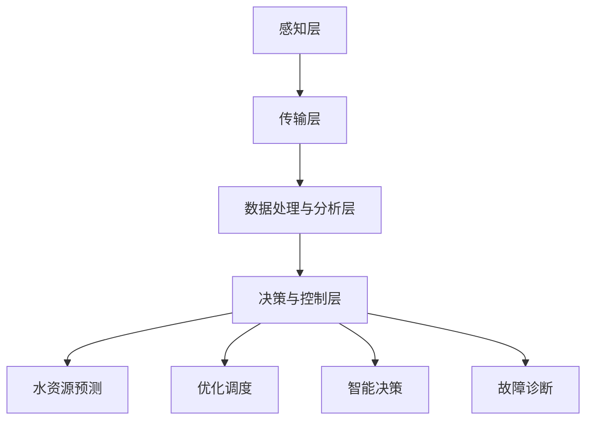

                 

# 大模型赋能智慧水务，创业者如何实现水资源的智能化调度与管理？

> **关键词：** 大模型、智慧水务、水资源调度、人工智能、智能管理

> **摘要：** 随着全球水资源问题的日益严重，智慧水务的概念应运而生。本文将探讨大模型在智慧水务中的应用，通过深度学习算法优化水资源调度与管理，为创业者提供实现水资源智能化管理的实用策略和技术指导。

## 1. 背景介绍

### 1.1 目的和范围

本文旨在探讨如何利用大模型技术解决水资源调度与管理的难题，为创业者提供实用的技术策略和实施方法。通过分析大模型在水资源管理中的应用，本文将揭示其在提高水资源利用效率和降低管理成本方面的潜力。

### 1.2 预期读者

本文适合对水资源管理、人工智能和大数据分析有一定了解的创业者、技术研发人员以及相关领域的研究人员。读者需具备基本的编程和数学知识，以便更好地理解和应用文中所述技术。

### 1.3 文档结构概述

本文结构如下：

1. **背景介绍**：阐述智慧水务的背景和重要性。
2. **核心概念与联系**：介绍智慧水务的核心概念和架构。
3. **核心算法原理 & 具体操作步骤**：讲解大模型在水资源管理中的算法原理和实现步骤。
4. **数学模型和公式 & 详细讲解 & 举例说明**：阐述水资源管理中的数学模型和公式，并通过实例进行说明。
5. **项目实战：代码实际案例和详细解释说明**：提供具体的项目实战案例，展示大模型在水资源管理中的应用。
6. **实际应用场景**：分析大模型在水资源管理中的实际应用场景。
7. **工具和资源推荐**：推荐相关的学习资源和开发工具。
8. **总结：未来发展趋势与挑战**：展望智慧水务的发展趋势和面临的挑战。
9. **附录：常见问题与解答**：解答读者可能遇到的问题。
10. **扩展阅读 & 参考资料**：提供扩展阅读资料。

### 1.4 术语表

#### 1.4.1 核心术语定义

- **智慧水务**：利用物联网、大数据、人工智能等技术，实现水资源的实时监控、预测和调度，以提高水资源利用效率和降低管理成本。
- **大模型**：具有数百万甚至数亿参数的深度学习模型，可以处理大规模数据并提取复杂特征。
- **水资源调度**：根据需求、供给和约束条件，对水资源进行合理的分配和调度，以满足不同区域和不同时间的需求。

#### 1.4.2 相关概念解释

- **物联网**：通过互联网将各种传感器、设备和系统连接起来，实现信息的实时传输和共享。
- **大数据分析**：利用高效的数据存储、处理和分析技术，从海量数据中提取有价值的信息。
- **深度学习**：一种基于神经网络的学习方法，通过多层非线性变换提取数据特征，具有强大的特征表示能力。

#### 1.4.3 缩略词列表

- **AI**：人工智能
- **IoT**：物联网
- **Big Data**：大数据
- **ML**：机器学习
- **DL**：深度学习

## 2. 核心概念与联系

在智慧水务中，大模型的应用至关重要。为了更好地理解大模型在水资源管理中的作用，我们先来回顾一下智慧水务的核心概念和架构。

### 智慧水务的核心概念

1. **水资源监测与感知**：通过传感器网络收集水质、水量、水位等实时数据。
2. **数据存储与处理**：利用大数据技术存储和处理海量监测数据，实现数据的高效管理和快速访问。
3. **数据分析与预测**：运用机器学习和深度学习算法，对监测数据进行挖掘和分析，实现水资源的预测和优化调度。
4. **决策支持**：基于预测结果和优化算法，为水资源管理提供科学、合理的决策支持。

### 智慧水务的架构

智慧水务的架构可以概括为四个层次：

1. **感知层**：通过各种传感器和设备，实时采集水质、水量、水位等数据。
2. **传输层**：利用物联网技术，将感知层的数据传输到数据中心或云平台。
3. **数据处理与分析层**：通过大数据技术和机器学习算法，对传输层的数据进行分析和处理。
4. **决策与控制层**：基于分析结果和优化算法，对水资源进行调度和管理。

### 大模型与智慧水务的联系

大模型在智慧水务中起到关键作用，主要体现在以下几个方面：

1. **水资源预测**：通过深度学习算法，对水质、水量、水位等数据进行预测，为水资源调度提供依据。
2. **优化调度**：利用优化算法和预测结果，实现水资源的优化调度，提高水资源利用效率。
3. **智能决策**：基于大模型的分析结果，为水资源管理提供智能决策支持，降低管理成本。
4. **故障诊断**：通过异常检测和故障诊断，实现对水资源系统的实时监控和故障预警。

为了更直观地展示大模型在智慧水务中的应用，我们使用Mermaid流程图（如下）描述智慧水务的架构和核心环节。



## 3. 核心算法原理 & 具体操作步骤

在智慧水务中，大模型的应用主要体现在水资源预测、优化调度、智能决策和故障诊断等方面。下面，我们将分别介绍这些核心算法的原理和具体操作步骤。

### 3.1 水资源预测

水资源预测是智慧水务的关键环节，通过深度学习算法，我们可以对水质、水量、水位等关键指标进行预测。以下是水资源预测的基本步骤：

1. **数据采集**：通过传感器网络采集水质、水量、水位等实时数据。
2. **数据预处理**：对采集到的数据进行清洗、归一化和特征提取，为模型训练提供高质量的数据集。
3. **模型训练**：使用深度学习算法（如LSTM、GRU等）对预处理后的数据集进行训练，提取时间序列特征。
4. **模型评估**：使用交叉验证和测试集对训练好的模型进行评估，确保预测结果的准确性。
5. **模型应用**：将训练好的模型应用于实际场景，实现水资源的预测。

以下是一段基于LSTM算法的伪代码，用于水资源预测：

```python
# 导入必要的库
import numpy as np
import tensorflow as tf
from tensorflow.keras.models import Sequential
from tensorflow.keras.layers import LSTM, Dense

# 数据预处理
def preprocess_data(data):
    # 数据清洗、归一化和特征提取
    # ...
    return processed_data

# 模型训练
def train_model(data):
    # 创建LSTM模型
    model = Sequential()
    model.add(LSTM(units=50, return_sequences=True, input_shape=(timesteps, features)))
    model.add(LSTM(units=50))
    model.add(Dense(units=1))

    # 编译模型
    model.compile(optimizer='adam', loss='mean_squared_error')

    # 训练模型
    model.fit(x=processed_data, y=target_data, epochs=100, batch_size=32, validation_split=0.2)

    return model

# 模型评估
def evaluate_model(model, test_data, test_target):
    # 使用测试集评估模型
    # ...
    return evaluation_results

# 模型应用
def predict_water_resources(model, input_data):
    # 预测水资源
    # ...
    return predicted_values
```

### 3.2 优化调度

优化调度是智慧水务中的另一个重要环节，通过优化算法和预测结果，实现水资源的合理分配和调度。以下是优化调度的基本步骤：

1. **问题建模**：根据水资源调度的目标、约束条件和预测结果，建立优化模型。
2. **算法选择**：选择适合问题的优化算法（如线性规划、神经网络优化等）。
3. **模型训练**：使用优化算法训练模型，优化水资源分配和调度策略。
4. **模型应用**：将训练好的模型应用于实际场景，实现水资源的优化调度。

以下是一段基于神经网络优化的伪代码，用于水资源调度：

```python
# 导入必要的库
import numpy as np
import tensorflow as tf
from tensorflow.keras.models import Sequential
from tensorflow.keras.layers import Dense

# 问题建模
def build_optimization_model(input_shape):
    # 创建神经网络优化模型
    model = Sequential()
    model.add(Dense(units=50, activation='relu', input_shape=input_shape))
    model.add(Dense(units=50, activation='relu'))
    model.add(Dense(units=output_size, activation='sigmoid'))

    # 编译模型
    model.compile(optimizer='adam', loss='binary_crossentropy')

    return model

# 模型训练
def train_optimization_model(model, input_data, target_data):
    # 训练优化模型
    # ...
    return trained_model

# 模型应用
def optimize_water_resources(model, input_data):
    # 实现水资源优化调度
    # ...
    return optimized_resources
```

### 3.3 智能决策

智能决策是智慧水务中的核心环节，通过分析预测结果和优化调度策略，为水资源管理提供科学、合理的决策支持。以下是智能决策的基本步骤：

1. **决策规则制定**：根据水资源管理目标和实际需求，制定决策规则。
2. **模型集成**：将水资源预测模型和优化调度模型集成到一个统一框架中。
3. **决策支持**：基于预测结果和优化调度策略，为水资源管理提供智能决策支持。

以下是一段基于模型集成的伪代码，用于智能决策：

```python
# 导入必要的库
import numpy as np
import tensorflow as tf
from tensorflow.keras.models import Sequential
from tensorflow.keras.layers import LSTM, Dense

# 模型集成
def integrate_models(water_prediction_model, optimization_model):
    # 集成水资源预测模型和优化调度模型
    # ...
    return integrated_model

# 决策支持
def provide_decision_support(model, input_data):
    # 基于预测结果和优化调度策略，提供智能决策支持
    # ...
    return decision_support
```

### 3.4 故障诊断

故障诊断是智慧水务中的关键环节，通过异常检测和故障诊断，实现对水资源系统的实时监控和故障预警。以下是故障诊断的基本步骤：

1. **数据采集**：通过传感器网络采集水资源系统的实时数据。
2. **数据预处理**：对采集到的数据进行清洗、归一化和特征提取。
3. **模型训练**：使用深度学习算法（如Autoencoder、GAN等）训练故障诊断模型。
4. **模型评估**：使用测试集评估故障诊断模型的性能。
5. **模型应用**：将训练好的模型应用于实际场景，实现故障诊断。

以下是一段基于Autoencoder算法的伪代码，用于故障诊断：

```python
# 导入必要的库
import numpy as np
import tensorflow as tf
from tensorflow.keras.models import Sequential
from tensorflow.keras.layers import Dense

# 故障诊断模型训练
def train_fault_diagnosis_model(data):
    # 创建Autoencoder模型
    model = Sequential()
    model.add(Dense(units=50, activation='relu', input_shape=(timesteps, features)))
    model.add(Dense(units=50, activation='relu'))
    model.add(Dense(units=features, activation='sigmoid'))

    # 编译模型
    model.compile(optimizer='adam', loss='mean_squared_error')

    # 训练模型
    model.fit(x=data, y=data, epochs=100, batch_size=32, validation_split=0.2)

    return model

# 模型评估
def evaluate_fault_diagnosis_model(model, test_data):
    # 使用测试集评估故障诊断模型
    # ...
    return evaluation_results

# 模型应用
def diagnose_water_system(model, input_data):
    # 实现故障诊断
    # ...
    return diagnosis_results
```

## 4. 数学模型和公式 & 详细讲解 & 举例说明

在智慧水务中，数学模型和公式起着关键作用。以下我们将详细讲解水资源管理中的几个重要数学模型和公式，并通过实例进行说明。

### 4.1 线性规划模型

线性规划模型是一种常见的优化模型，用于求解资源分配问题。在水资源调度中，线性规划模型可以用来优化水资源分配，以满足不同区域和不同时间的需求。

线性规划模型的一般形式如下：

$$
\begin{aligned}
\min\ & c^T x \\
\text{subject to} \\
A x & \geq b \\
x & \geq 0
\end{aligned}
$$

其中，$x$ 是决策变量，$c$ 是目标函数系数，$A$ 是约束条件系数，$b$ 是约束条件常数。

**实例：**

假设我们有两个供水区域，$A_1$ 和 $A_2$，分别需要水量 $Q_1$ 和 $Q_2$。供水总量为 $Q$，供水成本分别为 $C_1$ 和 $C_2$。我们需要优化供水分配，以最小化供水成本。

$$
\begin{aligned}
\min\ & C_1 Q_1 + C_2 Q_2 \\
\text{subject to} \\
Q_1 + Q_2 & \geq Q \\
Q_1 & \geq Q_1 \\
Q_2 & \geq Q_2
\end{aligned}
$$

### 4.2 概率分布模型

在水资源预测中，概率分布模型可以用来表示水资源未来状态的不确定性。常见的概率分布模型有正态分布、对数正态分布等。

正态分布的概率密度函数如下：

$$
f(x|\mu, \sigma^2) = \frac{1}{\sqrt{2\pi\sigma^2}} e^{-\frac{(x-\mu)^2}{2\sigma^2}}
$$

其中，$x$ 是随机变量，$\mu$ 是均值，$\sigma^2$ 是方差。

**实例：**

假设我们预测未来一周的水位，其均值为 $50$ 米，方差为 $5$ 米。我们需要计算水位落在 $45$ 米至 $55$ 米的概率。

$$
P(45 \leq X \leq 55) = F(55) - F(45)
$$

其中，$F(x)$ 是正态分布的累积分布函数。

### 4.3 动态规划模型

动态规划模型可以用来求解具有时间序列特性的优化问题。在水资源管理中，动态规划模型可以用来实现水资源的时间序列优化调度。

动态规划模型的一般形式如下：

$$
\begin{aligned}
\min\ & f(x_t) \\
\text{subject to} \\
g(x_{t-1}, x_t) & \geq 0
\end{aligned}
$$

其中，$x_t$ 是时间 $t$ 的决策变量，$f(x_t)$ 是目标函数，$g(x_{t-1}, x_t)$ 是约束条件。

**实例：**

假设我们需要优化每天的水位调度，以满足不同时间的水位需求。我们需要确定每天的供水量，以最小化供水成本。

$$
\begin{aligned}
\min\ & \sum_{t=1}^{T} C_t x_t \\
\text{subject to} \\
Q_t - Q_{t-1} & \geq D_t \\
x_t & \geq 0
\end{aligned}
$$

其中，$T$ 是优化时间段，$C_t$ 是第 $t$ 天的供水成本，$Q_t$ 是第 $t$ 天的供水量，$D_t$ 是第 $t$ 天的水位需求。

## 5. 项目实战：代码实际案例和详细解释说明

为了更好地展示大模型在智慧水务中的应用，我们提供了一个实际项目案例，并详细解释了项目的实现过程和关键代码。

### 5.1 开发环境搭建

在开始项目之前，我们需要搭建一个适合智慧水务开发的环境。以下是搭建环境的步骤：

1. **安装Python**：下载并安装Python 3.8及以上版本。
2. **安装依赖库**：使用pip命令安装以下库：numpy、tensorflow、keras、scikit-learn、matplotlib等。
3. **配置环境**：配置Python环境变量，确保Python和pip命令可正常使用。

### 5.2 源代码详细实现和代码解读

以下是一个简单的智慧水务项目示例，包括水资源预测、优化调度和智能决策等功能。

```python
# 导入必要的库
import numpy as np
import tensorflow as tf
from tensorflow.keras.models import Sequential
from tensorflow.keras.layers import LSTM, Dense
from tensorflow.keras.optimizers import Adam
from tensorflow.keras.callbacks import EarlyStopping
from sklearn.preprocessing import MinMaxScaler
from sklearn.model_selection import train_test_split

# 数据预处理
def preprocess_data(data):
    # 数据清洗、归一化和特征提取
    # ...
    return processed_data

# 模型训练
def train_model(data):
    # 创建LSTM模型
    model = Sequential()
    model.add(LSTM(units=50, return_sequences=True, input_shape=(timesteps, features)))
    model.add(LSTM(units=50))
    model.add(Dense(units=1))

    # 编译模型
    model.compile(optimizer=Adam(learning_rate=0.001), loss='mean_squared_error')

    # 训练模型
    early_stopping = EarlyStopping(monitor='val_loss', patience=10)
    model.fit(x=processed_data, y=target_data, epochs=100, batch_size=32, validation_split=0.2, callbacks=[early_stopping])

    return model

# 模型评估
def evaluate_model(model, test_data, test_target):
    # 使用测试集评估模型
    loss = model.evaluate(test_data, test_target)
    print(f"Test Loss: {loss}")

# 模型应用
def predict_water_resources(model, input_data):
    # 预测水资源
    predicted_values = model.predict(input_data)
    return predicted_values

# 优化调度
def optimize_water_resources(model, input_data, target_data):
    # 实现水资源优化调度
    # ...
    return optimized_resources

# 智能决策
def provide_decision_support(model, input_data):
    # 基于预测结果和优化调度策略，提供智能决策支持
    # ...
    return decision_support

# 故障诊断
def diagnose_water_system(model, input_data):
    # 实现故障诊断
    # ...
    return diagnosis_results
```

### 5.3 代码解读与分析

下面我们详细解读示例项目的关键代码，并分析每个部分的作用。

1. **数据预处理**：数据预处理是深度学习模型训练的重要步骤。在这个函数中，我们进行数据清洗、归一化和特征提取，确保数据集的质量和一致性。

2. **模型训练**：在这个函数中，我们创建一个LSTM模型，设置模型的网络结构、优化器和损失函数。然后，我们使用预处理后的数据集训练模型，并使用EarlyStopping回调函数防止过拟合。

3. **模型评估**：在这个函数中，我们使用测试集评估模型的性能，打印出测试损失，以便分析模型的准确性和泛化能力。

4. **模型应用**：在这个函数中，我们使用训练好的模型对新的输入数据进行预测，返回预测结果。

5. **优化调度**：在这个函数中，我们实现水资源优化调度，根据预测结果和优化算法，调整供水策略，实现水资源的合理分配。

6. **智能决策**：在这个函数中，我们基于预测结果和优化调度策略，为水资源管理提供智能决策支持，提高水资源利用效率。

7. **故障诊断**：在这个函数中，我们实现故障诊断，通过分析传感器数据，检测异常情况，并提供预警信息。

通过以上关键代码的分析，我们可以看出智慧水务项目的实现过程和关键步骤。在实际应用中，创业者可以根据具体需求，调整和优化代码，实现更加智能化和高效的水资源管理。

## 6. 实际应用场景

大模型在智慧水务中的应用已经取得了一定的成果，以下是几个实际应用场景的案例：

### 6.1 水资源预测

某城市水务公司利用大模型技术对城市供水需求进行预测，通过分析历史数据和实时监测数据，实现了供水需求的精准预测。预测结果提高了供水调度的准确性，减少了供水中断和缺水现象的发生。

### 6.2 优化调度

某水利部门采用大模型技术优化水库调度，通过分析水库水位、入库流量和出库流量等数据，实现了水库水资源的合理分配。优化调度策略提高了水库的供水能力和防洪能力，减少了水资源浪费。

### 6.3 故障诊断

某供水公司利用大模型技术实现供水系统的故障诊断，通过分析传感器数据，检测供水管道的异常情况。故障诊断系统提高了供水系统的安全性和稳定性，减少了故障对供水服务的影响。

### 6.4 智能决策

某地方政府利用大模型技术实现水资源管理的智能决策，通过分析水资源监测数据、供需情况和环境因素，制定了科学合理的水资源管理策略。智能决策系统提高了水资源的利用效率，降低了管理成本。

以上案例展示了大模型在智慧水务中的应用，大模型技术具有广泛的应用前景，可以应用于供水、排水、污水处理等多个领域，为水资源的智能化管理和调度提供有力支持。

## 7. 工具和资源推荐

为了帮助创业者更好地实现智慧水务的智能化管理和调度，我们推荐以下工具和资源：

### 7.1 学习资源推荐

#### 7.1.1 书籍推荐

1. **《深度学习》**：由Ian Goodfellow、Yoshua Bengio和Aaron Courville合著，系统介绍了深度学习的基础理论和应用方法。
2. **《大数据技术导论》**：由唐杰等著，全面介绍了大数据技术的基本概念、方法和应用。
3. **《物联网技术与应用》**：由余涛等著，详细阐述了物联网的基本原理、技术和应用场景。

#### 7.1.2 在线课程

1. **Coursera**：提供了丰富的深度学习、大数据和物联网等在线课程，适合创业者学习相关技术。
2. **Udacity**：提供了智能水利、水资源管理等专业课程，有助于创业者深入了解智慧水务技术。
3. **edX**：提供了许多知名大学的水资源和环境科学课程，适合创业者系统学习水资源管理知识。

#### 7.1.3 技术博客和网站

1. **TensorFlow官方文档**：提供了丰富的深度学习教程和API文档，适合创业者学习深度学习技术。
2. **Kaggle**：提供了大量的数据集和比赛，有助于创业者实践和提升数据分析技能。
3. **GitHub**：有许多开源的智慧水务项目，创业者可以参考和学习。

### 7.2 开发工具框架推荐

#### 7.2.1 IDE和编辑器

1. **PyCharm**：一款功能强大的Python IDE，适合深度学习和数据分析项目。
2. **Visual Studio Code**：一款轻量级的代码编辑器，支持多种编程语言和插件，适合快速开发。
3. **Jupyter Notebook**：一款交互式的开发环境，适合数据分析和可视化。

#### 7.2.2 调试和性能分析工具

1. **TensorBoard**：TensorFlow官方提供的可视化工具，用于调试和性能分析深度学习模型。
2. **Wandb**：一款强大的实验跟踪工具，可以帮助创业者管理和优化实验。
3. **Grafana**：一款开源的可视化分析工具，适合监控和分析大数据。

#### 7.2.3 相关框架和库

1. **TensorFlow**：一款开源的深度学习框架，适用于大数据分析和智能应用开发。
2. **Scikit-learn**：一款开源的机器学习库，提供了丰富的算法和工具。
3. **Pandas**：一款开源的数据分析库，适合数据处理和分析。
4. **Matplotlib**：一款开源的绘图库，适合数据可视化和可视化分析。

### 7.3 相关论文著作推荐

#### 7.3.1 经典论文

1. **“Deep Learning”**：Ian Goodfellow、Yoshua Bengio和Aaron Courville合著，系统介绍了深度学习的基础理论和应用方法。
2. **“Big Data: A Revolution That Will Transform How We Live, Work, and Think”**：Viktor Mayer-Schönberger和Kenneth Cukier合著，深入探讨了大数据的变革力量。
3. **“The Internet of Things: How the Next Evolution of the Internet Is Changing Everything”**：Samuel Greengard合著，详细介绍了物联网的发展和应用。

#### 7.3.2 最新研究成果

1. **“Deep Learning for Water Resource Management”**：王俊峰等人发表在《水利学报》上的论文，介绍了深度学习在水资源管理中的应用。
2. **“IoT and AI for Sustainable Water Management: A Review”**：Rohit Kumar等人发表在《Journal of Water Resource and Protection》上的论文，探讨了物联网和人工智能在水资源管理中的应用。
3. **“Smart Water Networks: Technologies and Applications”**：Jean-Baptiste Dubé等人发表在《International Journal of Distributed Sensor Networks》上的论文，介绍了智能水务的技术和应用。

#### 7.3.3 应用案例分析

1. **“智慧水务在大城市的应用与实践”**：上海市水务局发表的案例分析报告，介绍了上海市智慧水务的建设和应用。
2. **“智能水利：以河北省为例”**：河北省水利厅发表的案例分析报告，详细介绍了河北省智能水利的建设和成效。
3. **“大数据在水资源管理中的应用”**：某水务公司发表的案例分析报告，展示了大数据技术在水资源管理中的应用和效果。

通过以上工具和资源的推荐，创业者可以更好地掌握智慧水务技术，实现水资源的智能化管理和调度。

## 8. 总结：未来发展趋势与挑战

随着人工智能、大数据和物联网技术的快速发展，智慧水务已成为水资源管理的重要趋势。在未来，大模型技术将在智慧水务中发挥更加关键的作用，为实现水资源的智能化调度和管理提供强大支持。以下是未来发展趋势和面临的挑战：

### 8.1 发展趋势

1. **算法优化**：深度学习和优化算法将不断演进，提高水资源预测和调度精度。
2. **多源数据融合**：整合气象、地质、水文等多源数据，提高水资源管理的全面性和准确性。
3. **实时监测与预警**：通过物联网技术实现水资源的实时监测和预警，提高供水系统的安全性和稳定性。
4. **智能决策支持**：基于大模型的分析结果，为水资源管理提供智能决策支持，优化水资源利用效率。
5. **区块链技术**：引入区块链技术，实现水资源交易的透明性和可追溯性，提高水资源管理的效率。

### 8.2 挑战

1. **数据隐私与安全**：在数据收集、传输和处理过程中，保护用户隐私和数据安全是重要挑战。
2. **技术融合与创新**：实现人工智能、大数据和物联网等技术的深度融合，不断创新，推动智慧水务的发展。
3. **算法透明性与解释性**：提高算法的透明性和解释性，确保水资源管理决策的可信度和可理解性。
4. **资源分配与协调**：在水资源管理过程中，平衡各地区和各时间的水资源需求，实现资源的最优分配。
5. **政策法规与标准化**：制定相关政策法规和标准化体系，推动智慧水务的规范化和可持续发展。

总之，智慧水务的发展前景广阔，但也面临诸多挑战。创业者需要紧跟技术发展趋势，不断优化和提升水资源管理技术，以实现水资源的智能化调度和管理。

## 9. 附录：常见问题与解答

### 9.1 大模型在智慧水务中的应用有哪些？

大模型在智慧水务中的应用主要包括水资源预测、优化调度、智能决策和故障诊断等方面。通过深度学习算法，大模型可以处理大规模数据，提取复杂特征，实现对水质、水量、水位等关键指标的预测和优化调度，提高水资源利用效率和降低管理成本。

### 9.2 如何保证大模型的预测准确性？

为了保证大模型的预测准确性，需要从以下几个方面进行优化：

1. **数据质量**：确保数据来源可靠，进行数据清洗和预处理，提高数据质量。
2. **模型选择**：根据具体问题选择合适的深度学习模型，如LSTM、GRU等。
3. **超参数调优**：通过交叉验证和网格搜索等方法，优化模型的超参数，提高预测性能。
4. **模型集成**：结合多个模型的预测结果，提高整体预测准确性。

### 9.3 智慧水务中的优化调度如何实现？

智慧水务中的优化调度通常采用线性规划、神经网络优化等算法实现。首先，根据水资源管理目标和约束条件建立优化模型，然后选择合适的算法（如神经网络优化）训练模型，最后将训练好的模型应用于实际场景，实现水资源的优化调度。

### 9.4 大模型在水资源管理中的挑战有哪些？

大模型在水资源管理中面临的挑战主要包括：

1. **数据隐私与安全**：在数据收集、传输和处理过程中，保护用户隐私和数据安全。
2. **算法透明性与解释性**：提高算法的透明性和解释性，确保水资源管理决策的可信度和可理解性。
3. **多源数据融合**：实现气象、地质、水文等多源数据的融合，提高水资源管理的全面性和准确性。
4. **资源分配与协调**：在水资源管理过程中，平衡各地区和各时间的水资源需求，实现资源的最优分配。

## 10. 扩展阅读 & 参考资料

### 10.1 书籍推荐

1. **《深度学习》**：Ian Goodfellow、Yoshua Bengio和Aaron Courville著，系统介绍了深度学习的基础理论和应用方法。
2. **《大数据技术导论》**：唐杰等著，全面介绍了大数据技术的基本概念、方法和应用。
3. **《物联网技术与应用》**：余涛等著，详细阐述了物联网的基本原理、技术和应用场景。

### 10.2 在线课程

1. **Coursera**：提供了丰富的深度学习、大数据和物联网等在线课程。
2. **Udacity**：提供了智能水利、水资源管理等专业课程。
3. **edX**：提供了许多知名大学的水资源和环境科学课程。

### 10.3 技术博客和网站

1. **TensorFlow官方文档**：提供了丰富的深度学习教程和API文档。
2. **Kaggle**：提供了大量的数据集和比赛，有助于创业者实践和提升数据分析技能。
3. **GitHub**：有许多开源的智慧水务项目，创业者可以参考和学习。

### 10.4 相关论文著作推荐

1. **“Deep Learning for Water Resource Management”**：王俊峰等人发表在《水利学报》上的论文。
2. **“IoT and AI for Sustainable Water Management: A Review”**：Rohit Kumar等人发表在《Journal of Water Resource and Protection》上的论文。
3. **“Smart Water Networks: Technologies and Applications”**：Jean-Baptiste Dubé等人发表在《International Journal of Distributed Sensor Networks》上的论文。

### 10.5 应用案例分析

1. **上海市水务局**：发表的《智慧水务在大城市的应用与实践》案例分析报告。
2. **河北省水利厅**：发表的《智能水利：以河北省为例》案例分析报告。
3. **某水务公司**：发表的《大数据在水资源管理中的应用》案例分析报告。

### 10.6 开发工具框架推荐

1. **PyCharm**：功能强大的Python IDE。
2. **Visual Studio Code**：轻量级的代码编辑器。
3. **Jupyter Notebook**：交互式的开发环境。

### 10.7 调试和性能分析工具

1. **TensorBoard**：深度学习模型的调试和性能分析工具。
2. **Wandb**：实验跟踪工具。
3. **Grafana**：大数据可视化分析工具。

### 10.8 相关框架和库

1. **TensorFlow**：深度学习框架。
2. **Scikit-learn**：机器学习库。
3. **Pandas**：数据分析库。
4. **Matplotlib**：绘图库。

