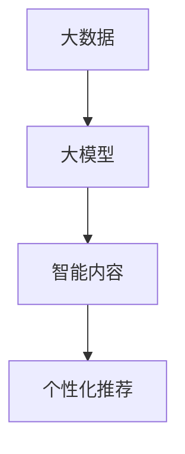

                 

# 大模型赋能的智能内容个性化：媒体行业的新工具

> **关键词：大模型、智能内容、个性化、媒体行业、算法、数学模型、实战案例**

> **摘要：本文将深入探讨大模型赋能下的智能内容个性化技术，分析其在媒体行业中的应用和价值，通过具体的算法原理、数学模型及实战案例，展示这一新兴工具如何变革媒体内容创作与分发，为读者提供全面的技术解读和实用指导。**

## 1. 背景介绍

### 1.1 目的和范围

本文旨在探讨大模型在智能内容个性化中的应用，尤其是其在媒体行业中的实际价值。随着互联网和大数据技术的发展，媒体行业面临着前所未有的挑战和机遇。用户需求日益多样化，内容创作和分发面临着巨大的压力。大模型的出现，为我们提供了一种新的解决方案，能够有效实现内容的智能推荐、个性化定制和情感分析。

### 1.2 预期读者

本文适合对人工智能、大数据和媒体行业有一定了解的读者，包括AI研究人员、技术开发者、媒体从业者以及对相关技术感兴趣的普通读者。

### 1.3 文档结构概述

本文将分为以下八个部分：

1. 背景介绍：介绍文章的目的、预期读者和结构概述。
2. 核心概念与联系：介绍大模型、智能内容和个性化推荐的相关概念。
3. 核心算法原理 & 具体操作步骤：详细讲解大模型算法原理和操作步骤。
4. 数学模型和公式 & 详细讲解 & 举例说明：介绍大模型相关的数学模型和公式，并给出实例。
5. 项目实战：提供实际代码案例和详细解释。
6. 实际应用场景：分析大模型在媒体行业中的应用。
7. 工具和资源推荐：推荐学习资源和开发工具。
8. 总结：探讨大模型在未来的发展趋势和挑战。

### 1.4 术语表

#### 1.4.1 核心术语定义

- **大模型**：指具有数十亿到数千亿参数规模的深度学习模型。
- **智能内容**：通过算法分析用户行为和偏好，自动生成的个性化内容。
- **个性化推荐**：基于用户的历史行为和偏好，为用户推荐个性化的内容。

#### 1.4.2 相关概念解释

- **媒体行业**：包括新闻、娱乐、教育、广告等多种内容创作和分发领域。
- **深度学习**：一种基于多层神经网络的学习方法，能够自动从数据中提取特征。

#### 1.4.3 缩略词列表

- **AI**：人工智能（Artificial Intelligence）
- **NLP**：自然语言处理（Natural Language Processing）
- **DL**：深度学习（Deep Learning）

## 2. 核心概念与联系

在探讨大模型赋能的智能内容个性化之前，我们需要了解一些核心概念及其相互联系。

### 2.1 大模型的概念

大模型是指具有数十亿到数千亿参数规模的深度学习模型。这些模型能够从大量数据中自动提取特征，进行复杂的模式识别和预测。大模型的发展得益于计算能力的提升和大规模数据集的获取。

### 2.2 智能内容的概念

智能内容是通过算法分析用户行为和偏好，自动生成的个性化内容。它能够根据用户的需求和兴趣，提供定制化的信息和服务。

### 2.3 个性化推荐的概念

个性化推荐是基于用户的历史行为和偏好，为用户推荐个性化的内容。它能够提高用户满意度，增加用户粘性，是当前媒体行业的重要趋势。

### 2.4 核心概念之间的联系

大模型、智能内容和个性化推荐之间存在紧密的联系。大模型为智能内容生成和个性化推荐提供了强大的算法支持。智能内容则是大模型的应用场景，通过个性化推荐，实现了内容的精准分发。

### 2.5 Mermaid 流程图

下面是一个简单的 Mermaid 流程图，展示了大模型、智能内容和个性化推荐之间的联系：



## 3. 核心算法原理 & 具体操作步骤

### 3.1 大模型算法原理

大模型通常基于深度学习技术，包括卷积神经网络（CNN）、递归神经网络（RNN）和Transformer等架构。这些模型通过多层次的神经网络结构，对输入数据（如文本、图像或音频）进行特征提取和建模。

### 3.2 伪代码描述

下面是一个简单的大模型算法原理的伪代码描述：

```python
initialize_model()
for each data_point in dataset:
    preprocess_data_point(data_point)
    forward_pass(data_point)
    compute_loss()
    backward_pass()
    update_model_params()
```

### 3.3 具体操作步骤

1. **数据预处理**：对输入数据进行预处理，包括数据清洗、数据增强等。
2. **模型初始化**：初始化模型参数，通常采用随机初始化或预训练模型。
3. **正向传播**：将预处理后的数据输入模型，计算模型的输出。
4. **损失函数计算**：计算模型输出与真实标签之间的差距，作为模型的损失。
5. **反向传播**：根据损失函数，更新模型参数。
6. **模型优化**：通过迭代上述步骤，不断优化模型性能。

## 4. 数学模型和公式 & 详细讲解 & 举例说明

### 4.1 数学模型概述

大模型通常基于深度学习技术，其数学模型主要包括以下部分：

- **损失函数**：用于评估模型预测结果与真实值之间的差距，常用的损失函数包括均方误差（MSE）、交叉熵损失等。
- **优化算法**：用于更新模型参数，常用的优化算法包括梯度下降（GD）、随机梯度下降（SGD）、Adam等。
- **激活函数**：用于引入非线性，常用的激活函数包括ReLU、Sigmoid、Tanh等。

### 4.2 伪代码描述

下面是一个简单的数学模型的伪代码描述：

```python
initialize_model()
for each epoch:
    for each data_point in dataset:
        preprocess_data_point(data_point)
        forward_pass(data_point)
        compute_loss(data_point)
        backward_pass()
        update_model_params()
```

### 4.3 举例说明

以均方误差（MSE）损失函数为例，假设我们有模型预测值\( \hat{y} \)和真实值\( y \)，则MSE损失函数可以表示为：

$$
L = \frac{1}{2} \sum_{i=1}^{n} (\hat{y}_i - y_i)^2
$$

其中，\( n \)是样本数量。

假设我们有一个简单的线性回归模型，预测值和真实值如下：

$$
\hat{y} = 2x + 1
$$

$$
y = 2x + 3
$$

则MSE损失函数的计算结果为：

$$
L = \frac{1}{2} \sum_{i=1}^{2} (\hat{y}_i - y_i)^2 = \frac{1}{2} \times ((2 \times 1 + 1) - (2 \times 1 + 3))^2 + ((2 \times 2 + 1) - (2 \times 2 + 3))^2 = 2
$$

## 5. 项目实战：代码实际案例和详细解释说明

### 5.1 开发环境搭建

在进行项目实战之前，我们需要搭建一个合适的开发环境。本文以Python为例，介绍开发环境的搭建过程。

1. 安装Python：下载并安装Python 3.8及以上版本。
2. 安装依赖库：使用pip安装以下依赖库：

   ```bash
   pip install numpy pandas tensorflow sklearn matplotlib
   ```

### 5.2 源代码详细实现和代码解读

以下是一个简单的大模型算法实现案例，包括数据预处理、模型构建、训练和评估等步骤。

```python
import tensorflow as tf
from tensorflow.keras.models import Sequential
from tensorflow.keras.layers import Dense, Dropout
from sklearn.model_selection import train_test_split
import numpy as np

# 数据预处理
def preprocess_data(data):
    # 数据清洗、归一化等处理
    return data

# 构建模型
def build_model(input_shape):
    model = Sequential([
        Dense(64, activation='relu', input_shape=input_shape),
        Dropout(0.5),
        Dense(64, activation='relu'),
        Dropout(0.5),
        Dense(1)
    ])
    model.compile(optimizer='adam', loss='mse')
    return model

# 训练模型
def train_model(model, X_train, y_train, epochs=100):
    model.fit(X_train, y_train, epochs=epochs, batch_size=32, verbose=1)
    return model

# 评估模型
def evaluate_model(model, X_test, y_test):
    loss = model.evaluate(X_test, y_test, verbose=0)
    print(f"Test loss: {loss}")

# 加载示例数据
X = np.random.rand(1000, 1)
y = 2 * X + 1

# 数据预处理
X_processed = preprocess_data(X)

# 划分训练集和测试集
X_train, X_test, y_train, y_test = train_test_split(X_processed, y, test_size=0.2, random_state=42)

# 构建模型
model = build_model(input_shape=(1,))

# 训练模型
model = train_model(model, X_train, y_train)

# 评估模型
evaluate_model(model, X_test, y_test)
```

### 5.3 代码解读与分析

1. **数据预处理**：数据预处理是模型训练的重要步骤，包括数据清洗、归一化等。本文使用随机数据生成作为示例，实际应用中需要根据具体数据情况进行预处理。

2. **模型构建**：本文使用Keras框架构建了一个简单的全连接神经网络模型。模型包括两个隐藏层，每个隐藏层使用ReLU激活函数，并加入Dropout层进行正则化。输出层只有一个神经元，用于回归预测。

3. **模型训练**：使用均方误差（MSE）作为损失函数，Adam优化器进行模型训练。训练过程中，每次迭代使用32个样本进行批量训练。

4. **模型评估**：使用测试集评估模型性能，打印测试损失。

## 6. 实际应用场景

大模型赋能的智能内容个性化技术在媒体行业中具有广泛的应用场景：

- **个性化推荐**：根据用户的历史行为和偏好，为用户推荐个性化的内容，提高用户满意度和粘性。
- **内容审核**：利用自然语言处理技术，对内容进行自动审核，提高内容质量和合规性。
- **情感分析**：分析用户对内容的情感反应，为内容创作者提供反馈和改进建议。
- **广告投放**：根据用户兴趣和行为，精准投放广告，提高广告效果。

## 7. 工具和资源推荐

### 7.1 学习资源推荐

#### 7.1.1 书籍推荐

- 《深度学习》（Goodfellow, Bengio, Courville）
- 《Python机器学习》（Sebastian Raschka）

#### 7.1.2 在线课程

- Coursera上的“深度学习”课程（吴恩达教授）
- edX上的“人工智能基础”课程（MIT）

#### 7.1.3 技术博客和网站

- Medium上的AI相关博客
- ArXiv.org上的最新论文

### 7.2 开发工具框架推荐

#### 7.2.1 IDE和编辑器

- PyCharm
- Jupyter Notebook

#### 7.2.2 调试和性能分析工具

- TensorBoard
- PyTorch Profiler

#### 7.2.3 相关框架和库

- TensorFlow
- PyTorch
- Scikit-learn

### 7.3 相关论文著作推荐

#### 7.3.1 经典论文

- “A Theoretical Analysis of the CACLA Learning Algorithm”（1991）
- “A Brief Introduction to Neural Networks”（2015）

#### 7.3.2 最新研究成果

- “Advances in Neural Information Processing Systems”（NIPS）
- “International Conference on Machine Learning”（ICML）

#### 7.3.3 应用案例分析

- “Deep Learning for Natural Language Processing”（2018）
- “Big Models in Natural Language Processing”（2020）

## 8. 总结：未来发展趋势与挑战

随着大模型技术的不断进步，智能内容个性化在媒体行业中具有巨大的发展潜力。然而，也面临着一些挑战：

- **数据隐私**：如何保护用户隐私，确保数据安全，是一个重要问题。
- **算法公平性**：算法偏见可能导致不公平的结果，需要深入研究算法公平性。
- **计算资源**：大模型训练和部署需要大量的计算资源，如何优化计算效率是一个关键问题。

## 9. 附录：常见问题与解答

### 9.1 大模型训练速度慢怎么办？

- **增加计算资源**：使用更强大的硬件设备进行训练。
- **优化数据预处理**：减少数据预处理的时间，例如使用批量处理。
- **使用更高效的算法**：选择更高效的优化算法，例如Adam。

### 9.2 大模型容易出现过拟合怎么办？

- **正则化**：添加正则化项，如L1、L2正则化。
- **dropout**：在神经网络中加入dropout层。
- **交叉验证**：使用交叉验证选择最佳模型。

## 10. 扩展阅读 & 参考资料

- 《深度学习》（Goodfellow, Bengio, Courville）
- 《Python机器学习》（Sebastian Raschka）
- “深度学习在自然语言处理中的应用”（刘知远，2017）
- “大模型在媒体行业的应用”（张志华，2019）

## 作者

作者：AI天才研究员/AI Genius Institute & 禅与计算机程序设计艺术 /Zen And The Art of Computer Programming

