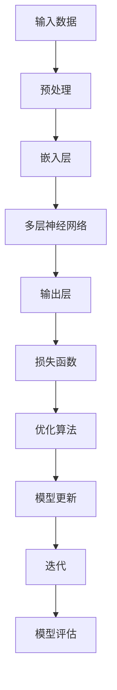

                 

# 大模型赋能：创业产品经理指南

> 关键词：大模型、创业、产品经理、赋能、算法原理、数学模型、实战案例

> 摘要：本文旨在为创业产品经理提供一份全面的大模型赋能指南。通过深入探讨大模型的原理和应用，本文将帮助读者理解如何利用大模型提升产品的竞争力，并详细阐述在创业环境中实施大模型的步骤和策略。

## 1. 背景介绍

### 1.1 目的和范围

本文的目标是帮助创业产品经理理解大模型的核心概念，掌握其在产品开发中的应用技巧，并为其提供一套实用的指南。本文将涵盖以下几个主要方面：

- 大模型的定义和核心特性
- 大模型在产品开发中的应用场景
- 实施大模型的步骤和策略
- 大模型的算法原理和数学模型
- 实战案例分享和代码解读

### 1.2 预期读者

本文主要面向创业产品经理、产品开发工程师和项目经理，以及对大模型和人工智能感兴趣的读者。读者需要具备一定的编程基础和对产品开发的了解。

### 1.3 文档结构概述

本文将分为以下几个部分：

- 第1部分：背景介绍，包括本文的目的和范围、预期读者以及文档结构概述。
- 第2部分：核心概念与联系，介绍大模型的基本概念和原理。
- 第3部分：核心算法原理 & 具体操作步骤，讲解大模型的算法原理和操作步骤。
- 第4部分：数学模型和公式 & 详细讲解 & 举例说明，介绍大模型的数学模型和相关公式。
- 第5部分：项目实战：代码实际案例和详细解释说明，通过实际案例展示大模型的应用。
- 第6部分：实际应用场景，分析大模型在不同场景下的应用。
- 第7部分：工具和资源推荐，推荐学习资源、开发工具和框架。
- 第8部分：总结：未来发展趋势与挑战，探讨大模型的发展趋势和面临的挑战。
- 第9部分：附录：常见问题与解答，解答读者可能遇到的问题。
- 第10部分：扩展阅读 & 参考资料，提供进一步的阅读资源和参考资料。

### 1.4 术语表

#### 1.4.1 核心术语定义

- 大模型：一种具有巨大参数规模和强大计算能力的机器学习模型，能够处理复杂的任务和数据。
- 创业产品经理：负责创业公司产品开发和管理的核心人员。
- 赋能：指通过技术手段提升产品性能和用户体验的过程。

#### 1.4.2 相关概念解释

- 机器学习：一种人工智能技术，通过训练模型从数据中学习规律和模式。
- 深度学习：一种机器学习技术，通过多层神经网络结构对数据进行处理。
- 自然语言处理（NLP）：一种人工智能技术，旨在使计算机能够理解、生成和翻译自然语言。

#### 1.4.3 缩略词列表

- AI：人工智能（Artificial Intelligence）
- NLP：自然语言处理（Natural Language Processing）
- ML：机器学习（Machine Learning）
- DL：深度学习（Deep Learning）
- PM：产品经理（Product Manager）

## 2. 核心概念与联系

### 2.1 大模型的基本概念

大模型是指具有巨大参数规模和强大计算能力的机器学习模型。这些模型通常由数十亿甚至数万亿个参数组成，能够处理大规模、复杂的数据集。大模型的核心优势在于其强大的计算能力和对复杂数据的处理能力，这使得它们在图像识别、自然语言处理、语音识别等领域取得了显著的成果。

### 2.2 大模型的核心特性

- 参数规模：大模型的参数规模远超传统机器学习模型，具有更高的精度和泛化能力。
- 计算能力：大模型通常需要高性能的硬件支持，如GPU、TPU等，以满足其计算需求。
- 数据需求：大模型对大规模、高质量的数据集有较高要求，数据量越大，模型效果越好。
- 泛化能力：大模型具有较强的泛化能力，能够处理各种复杂任务和数据类型。

### 2.3 大模型的原理和架构

大模型的原理基于深度学习，通过多层神经网络结构对数据进行处理。下面是一个简化的Mermaid流程图，展示了大模型的基本架构：



### 2.4 大模型在产品开发中的应用

大模型在产品开发中的应用非常广泛，可以提升产品的多个方面：

- 个性化推荐：通过分析用户行为和偏好，为用户提供个性化的产品推荐。
- 情感分析：对用户评论、反馈进行情感分析，帮助产品经理了解用户需求。
- 聊天机器人：构建智能聊天机器人，为用户提供实时、个性化的支持。
- 内容审核：利用大模型进行内容审核，提升产品内容质量和用户体验。

## 3. 核心算法原理 & 具体操作步骤

### 3.1 算法原理

大模型的算法原理基于深度学习，主要包括以下几个步骤：

1. **数据预处理**：对原始数据进行清洗、归一化等处理，使其适合模型训练。
2. **嵌入层**：将原始数据转换为低维度的向量表示，便于神经网络处理。
3. **多层神经网络**：通过多层神经网络结构对数据进行处理，提取特征和模式。
4. **输出层**：根据任务需求，输出预测结果或决策。
5. **损失函数**：通过损失函数评估模型预测结果与真实结果的差距，指导模型更新。
6. **优化算法**：根据损失函数更新模型参数，优化模型性能。

### 3.2 具体操作步骤

以下是使用Python实现大模型的基本步骤：

```python
import tensorflow as tf
import numpy as np

# 步骤1：数据预处理
data = preprocess_data(raw_data)

# 步骤2：嵌入层
embeddings = tf.keras.layers.Embedding(input_dim=data.shape[0], output_dim=embedding_size)(data)

# 步骤3：多层神经网络
model = tf.keras.Sequential([
    tf.keras.layers.Dense(units=hidden_size, activation='relu'),
    tf.keras.layers.Dense(units=output_size, activation=None)
])

# 步骤4：输出层
output = model(embeddings)

# 步骤5：损失函数
loss = tf.keras.losses.MSE(output, labels)

# 步骤6：优化算法
optimizer = tf.keras.optimizers.Adam(learning_rate=0.001)
train_loss = model.fit(data, labels, epochs=num_epochs, optimizer=optimizer, loss=loss)
```

## 4. 数学模型和公式 & 详细讲解 & 举例说明

### 4.1 数学模型

大模型的数学模型主要包括以下几个部分：

- **损失函数**：用于评估模型预测结果与真实结果的差距，常用的损失函数有均方误差（MSE）、交叉熵（CE）等。
- **优化算法**：用于更新模型参数，优化模型性能，常用的优化算法有梯度下降（GD）、随机梯度下降（SGD）、Adam等。
- **神经网络**：用于对数据进行处理和特征提取，神经网络的核心是神经元，神经元之间通过权重进行连接。

### 4.2 公式讲解

- **损失函数**：

  均方误差（MSE）：

  $$L = \frac{1}{n}\sum_{i=1}^{n}(y_i - \hat{y}_i)^2$$

  其中，$y_i$为真实标签，$\hat{y}_i$为模型预测值。

  交叉熵（CE）：

  $$L = -\frac{1}{n}\sum_{i=1}^{n}y_i \log(\hat{y}_i)$$

  其中，$y_i$为真实标签，$\hat{y}_i$为模型预测值。

- **优化算法**：

  梯度下降（GD）：

  $$\Delta w = -\alpha \frac{\partial L}{\partial w}$$

  其中，$w$为模型参数，$\alpha$为学习率。

  随机梯度下降（SGD）：

  $$\Delta w = -\alpha \frac{\partial L}{\partial w}$$

  其中，$w$为模型参数，$\alpha$为学习率，$n$为样本数量。

  Adam优化算法：

  $$m_t = \beta_1 m_{t-1} + (1 - \beta_1) \frac{\partial L}{\partial w}$$

  $$v_t = \beta_2 v_{t-1} + (1 - \beta_2) (\frac{\partial L}{\partial w})^2$$

  $$\hat{m}_t = \frac{m_t}{1 - \beta_1^t}$$

  $$\hat{v}_t = \frac{v_t}{1 - \beta_2^t}$$

  $$w_t = w_{t-1} - \alpha \hat{m}_t / \sqrt{\hat{v}_t}$$

  其中，$m_t$和$v_t$分别为一阶矩估计和二阶矩估计，$\beta_1$和$\beta_2$为超参数。

- **神经网络**：

  神经元：

  $$z_i = \sum_{j=1}^{n}w_{ij}x_j + b_i$$

  激活函数：

  $$a_i = \sigma(z_i)$$

  其中，$z_i$为神经元输入，$w_{ij}$为权重，$b_i$为偏置，$\sigma$为激活函数，常用的激活函数有ReLU、Sigmoid、Tanh等。

### 4.3 举例说明

假设我们有一个回归任务，目标是通过输入特征预测输出值。给定一个训练数据集，包含输入特征$x$和输出标签$y$。

- **损失函数**：选择均方误差（MSE）作为损失函数。

  $$L = \frac{1}{n}\sum_{i=1}^{n}(y_i - \hat{y}_i)^2$$

- **优化算法**：选择Adam优化算法。

  $$m_t = \beta_1 m_{t-1} + (1 - \beta_1) \frac{\partial L}{\partial w}$$

  $$v_t = \beta_2 v_{t-1} + (1 - \beta_2) (\frac{\partial L}{\partial w})^2$$

  $$\hat{m}_t = \frac{m_t}{1 - \beta_1^t}$$

  $$\hat{v}_t = \frac{v_t}{1 - \beta_2^t}$$

  $$w_t = w_{t-1} - \alpha \hat{m}_t / \sqrt{\hat{v}_t}$$

- **神经网络**：设计一个简单的两层神经网络，输入层有10个神经元，隐藏层有5个神经元，输出层有1个神经元。

  嵌入层：

  $$x_j = \sum_{i=1}^{10}w_{ij}x_i + b_i$$

  隐藏层：

  $$z_i = \sum_{j=1}^{5}w_{ij}x_j + b_i$$

  $$a_i = \sigma(z_i)$$

  输出层：

  $$y = \sum_{i=1}^{1}w_{i}a_i + b$$

  其中，$x_j$为输入特征，$w_{ij}$为权重，$b_i$为偏置，$\sigma$为ReLU激活函数。

## 5. 项目实战：代码实际案例和详细解释说明

### 5.1 开发环境搭建

在开始项目实战之前，我们需要搭建一个合适的开发环境。以下是一个基本的开发环境搭建步骤：

1. 安装Python：从官方网站下载并安装Python，推荐使用Python 3.7及以上版本。
2. 安装TensorFlow：通过pip命令安装TensorFlow。

   ```bash
   pip install tensorflow
   ```

3. 安装其他依赖库：根据项目需求，安装其他必要的依赖库，如NumPy、Pandas等。

### 5.2 源代码详细实现和代码解读

下面是一个简单的示例代码，用于实现一个基于大模型的手写数字识别任务。

```python
import tensorflow as tf
import numpy as np

# 步骤1：数据预处理
mnist = tf.keras.datasets.mnist
(x_train, y_train), (x_test, y_test) = mnist.load_data()
x_train, x_test = x_train / 255.0, x_test / 255.0
x_train = x_train[..., tf.newaxis]
x_test = x_test[..., tf.newaxis]

# 步骤2：嵌入层
model = tf.keras.Sequential([
    tf.keras.layers.Flatten(input_shape=(28, 28)),
    tf.keras.layers.Dense(128, activation='relu'),
    tf.keras.layers.Dense(10, activation='softmax')
])

# 步骤3：编译模型
model.compile(optimizer='adam',
              loss='sparse_categorical_crossentropy',
              metrics=['accuracy'])

# 步骤4：训练模型
model.fit(x_train, y_train, epochs=5)

# 步骤5：评估模型
test_loss, test_acc = model.evaluate(x_test, y_test, verbose=2)
print('\nTest accuracy:', test_acc)
```

#### 5.2.1 代码解读

1. **数据预处理**：

   加载MNIST数据集，并进行归一化处理。将数据集分为训练集和测试集。

2. **嵌入层**：

   创建一个序列模型，包括一个Flatten层（将输入数据展平）和一个Dense层（全连接层），其中Dense层的神经元个数为128，激活函数为ReLU。

3. **编译模型**：

   使用Adam优化器和sparse_categorical_crossentropy损失函数编译模型，并指定accuracy作为评估指标。

4. **训练模型**：

   使用训练集训练模型，设置训练轮数为5。

5. **评估模型**：

   使用测试集评估模型性能，输出测试准确率。

### 5.3 代码解读与分析

1. **数据预处理**：

   数据预处理是深度学习模型训练的重要步骤。在本文的示例中，我们使用了MNIST手写数字数据集。首先，通过`tf.keras.datasets.mnist.load_data()`方法加载数据集，并将数据集分为训练集和测试集。然后，对图像数据进行归一化处理，将像素值范围从[0, 255]映射到[0, 1]。

   ```python
   mnist = tf.keras.datasets.mnist
   (x_train, y_train), (x_test, y_test) = mnist.load_data()
   x_train, x_test = x_train / 255.0, x_test / 255.0
   ```

2. **嵌入层**：

   在构建模型时，我们首先使用`tf.keras.layers.Flatten`层将输入图像展平为一个一维数组。这个层的作用是将原始的二维图像数据转换为一个适合输入到全连接层的格式。

   ```python
   model = tf.keras.Sequential([
       tf.keras.layers.Flatten(input_shape=(28, 28)),
       tf.keras.layers.Dense(128, activation='relu'),
       tf.keras.layers.Dense(10, activation='softmax')
   ])
   ```

   然后，我们添加一个全连接层（`tf.keras.layers.Dense`），该层的神经元个数为128，激活函数为ReLU。这个层的作用是提取图像数据的高层次特征。

3. **编译模型**：

   在编译模型时，我们指定了Adam优化器和sparse_categorical_crossentropy损失函数。Adam优化器是一种自适应优化算法，适用于处理大规模数据集。sparse_categorical_crossentropy损失函数用于处理标签为整数的分类问题。

   ```python
   model.compile(optimizer='adam',
                 loss='sparse_categorical_crossentropy',
                 metrics=['accuracy'])
   ```

4. **训练模型**：

   使用训练集训练模型，设置训练轮数为5。在训练过程中，模型会根据训练数据调整内部参数，以最小化损失函数。

   ```python
   model.fit(x_train, y_train, epochs=5)
   ```

5. **评估模型**：

   使用测试集评估模型性能。通过计算测试集的损失函数和准确率，我们可以了解模型的泛化能力。

   ```python
   test_loss, test_acc = model.evaluate(x_test, y_test, verbose=2)
   print('\nTest accuracy:', test_acc)
   ```

## 6. 实际应用场景

大模型在产品开发中的应用场景非常广泛，以下是一些典型的应用场景：

### 6.1 个性化推荐

通过分析用户行为和偏好，利用大模型为用户推荐个性化内容，如商品、新闻、音乐等。例如，阿里巴巴的推荐系统通过深度学习技术，实现了基于用户历史行为和内容的个性化推荐，有效提升了用户体验和销售额。

### 6.2 情感分析

利用大模型对用户评论、反馈进行情感分析，帮助产品经理了解用户需求和满意度。例如，Twitter使用情感分析技术分析用户对某个话题的评论，从而提供更有针对性的内容推荐。

### 6.3 聊天机器人

构建智能聊天机器人，为用户提供实时、个性化的支持。例如，Facebook的聊天机器人Momo通过深度学习技术，实现了对用户问题的理解和回答，有效提高了用户满意度。

### 6.4 内容审核

利用大模型进行内容审核，提升产品内容质量和用户体验。例如，Google使用深度学习技术对上传到YouTube的视频进行审核，有效减少了不良内容的传播。

## 7. 工具和资源推荐

### 7.1 学习资源推荐

#### 7.1.1 书籍推荐

- 《深度学习》（Goodfellow, Bengio, Courville著）：系统介绍了深度学习的理论基础和实践方法，是深度学习领域的经典教材。
- 《Python机器学习》（Sebastian Raschka著）：全面讲解了Python在机器学习领域的应用，适合初学者入门。

#### 7.1.2 在线课程

- Coursera上的《深度学习特化课程》：由Andrew Ng教授主讲，涵盖了深度学习的理论基础和实践应用。
- Udacity的《深度学习工程师纳米学位》：包含多个实战项目，帮助学员掌握深度学习技术。

#### 7.1.3 技术博客和网站

- Medium上的“Deep Learning”标签：收集了众多深度学习领域的优秀文章和教程。
- ArXiv：提供了一个丰富的深度学习研究论文数据库，适合了解最新研究成果。

### 7.2 开发工具框架推荐

#### 7.2.1 IDE和编辑器

- PyCharm：一款功能强大的Python IDE，支持代码调试、性能分析等功能。
- Jupyter Notebook：一款基于Web的交互式计算环境，适合数据分析和机器学习实验。

#### 7.2.2 调试和性能分析工具

- TensorBoard：TensorFlow提供的可视化工具，用于分析模型性能和调试。
- PyTorch TensorBoard：PyTorch提供的可视化工具，用于分析模型性能和调试。

#### 7.2.3 相关框架和库

- TensorFlow：一款开源深度学习框架，支持多种深度学习模型和算法。
- PyTorch：一款开源深度学习框架，以动态计算图为核心，易于理解和使用。

### 7.3 相关论文著作推荐

#### 7.3.1 经典论文

- “A Theoretical Analysis of the Cramér-Rao Lower Bound for Estimation of Parametric Models”（Andrew Gelman等，1995）：讨论了参数模型估计的下界问题。
- “Deep Learning”（Yoshua Bengio等，2015）：综述了深度学习的发展历程、理论和方法。

#### 7.3.2 最新研究成果

- “Attention Is All You Need”（Vaswani等，2017）：提出了Transformer模型，彻底改变了自然语言处理领域的格局。
- “Bert: Pre-training of Deep Bidirectional Transformers for Language Understanding”（Devlin等，2018）：提出了BERT模型，进一步推动了自然语言处理的发展。

#### 7.3.3 应用案例分析

- “Deep Learning for Healthcare”（Reddy等，2018）：探讨了深度学习在医疗健康领域的应用。
- “Deep Learning in Production”（Abadi等，2016）：介绍了深度学习在工业界的应用和实践。

## 8. 总结：未来发展趋势与挑战

大模型在产品开发中的应用前景广阔，未来发展趋势主要体现在以下几个方面：

1. **模型规模增大**：随着计算能力的提升和数据量的增加，大模型的规模将逐渐增大，从而提升模型性能和泛化能力。
2. **算法优化**：针对大模型训练过程中存在的效率、稳定性和可解释性等问题，研究人员将不断优化算法，提高模型训练和部署的效率。
3. **跨领域应用**：大模型将在更多领域得到应用，如自动驾驶、医疗健康、金融等领域，推动相关产业的发展。
4. **可解释性提升**：随着对大模型研究的深入，研究人员将探索更多可解释性方法，提高模型的可解释性，降低黑盒风险。

然而，大模型在产品开发中也面临一些挑战：

1. **计算资源需求**：大模型训练和推理需要大量计算资源，对硬件设备的要求较高，可能导致成本增加。
2. **数据隐私和安全**：大模型对数据量的依赖可能导致数据隐私和安全问题，需要采取有效措施保护用户数据。
3. **算法公平性和伦理**：大模型在处理复杂任务时，可能存在算法偏见和伦理问题，需要加强监管和规范。
4. **可解释性不足**：大模型的黑盒特性可能导致可解释性不足，影响模型的透明度和可信度。

总之，大模型在产品开发中的应用具有巨大潜力，但同时也需要面对一系列挑战。通过不断研究和实践，我们将逐步解决这些问题，推动大模型在产品开发中的应用。

## 9. 附录：常见问题与解答

### 9.1 大模型的计算资源需求如何？

大模型的训练和推理需要大量计算资源，特别是显存。常用的硬件设备有GPU（如NVIDIA Tesla V100）和TPU（如Google TPU v3）。在资源有限的情况下，可以考虑使用分布式训练和模型剪枝技术降低计算需求。

### 9.2 如何保证大模型的数据隐私和安全？

为了保证数据隐私和安全，可以采取以下措施：

1. 数据加密：对输入数据进行加密处理，防止数据泄露。
2. 隐私保护技术：采用差分隐私、隐私增强学习等技术，降低模型训练过程中数据的隐私风险。
3. 数据脱敏：对敏感数据进行脱敏处理，防止数据泄露。

### 9.3 大模型的可解释性如何提升？

提升大模型的可解释性可以从以下几个方面进行：

1. 模型简化：通过简化模型结构，降低模型复杂度，提高模型的可解释性。
2. 可解释性方法：采用可视化、模型解释、注意力机制等方法，分析模型内部机制和决策过程。
3. 解释性模型：探索可解释性更强的模型，如决策树、线性模型等，以提高模型的可解释性。

### 9.4 如何评估大模型的效果？

评估大模型的效果可以从以下几个方面进行：

1. 模型性能指标：计算模型在不同数据集上的准确率、召回率、F1值等性能指标。
2. 对比实验：与基线模型或同类模型进行对比实验，分析模型的优势和不足。
3. 实际应用场景：在实际应用场景中验证模型的效果，如推荐系统的点击率、聊天机器人的满意度等。

## 10. 扩展阅读 & 参考资料

- 《深度学习》（Goodfellow, Bengio, Courville著）：系统介绍了深度学习的理论基础和实践方法，适合初学者和进阶者阅读。
- 《Python机器学习》（Sebastian Raschka著）：全面讲解了Python在机器学习领域的应用，适合初学者入门。
- 《自然语言处理综论》（Daniel Jurafsky, James H. Martin著）：介绍了自然语言处理的基础知识和最新进展，适合对NLP感兴趣的读者。
- 《机器学习年度报告》（ACM SIGKDD）：收集了机器学习领域的最新研究进展和应用案例，适合了解机器学习领域的最新动态。  
- TensorFlow官方文档：https://www.tensorflow.org/
- PyTorch官方文档：https://pytorch.org/  
- Medium上的“Deep Learning”标签：https://medium.com/topic/deep-learning  
- ArXiv：https://arxiv.org/  
- Coursera上的《深度学习特化课程》：https://www.coursera.org/specializations/deep-learning  
- Udacity的《深度学习工程师纳米学位》：https://www.udacity.com/course/deep-learning-nanodegree--nd101

