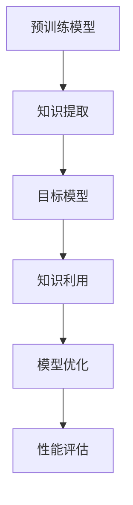

                 

# 大模型软件开发中的知识蒸馏技术

## 关键词
- 大模型软件开发
- 知识蒸馏技术
- 训练效率
- 模型压缩
- 参数共享
- 数学模型

## 摘要
本文将深入探讨大模型软件开发中的知识蒸馏技术，这是一种用于提高训练效率和模型压缩的有效方法。我们将详细解析知识蒸馏的基本原理，并通过实例来展示其具体操作步骤和数学模型。文章还将探讨知识蒸馏在实际应用场景中的优势，并提供实用的工具和资源推荐。通过本文的阅读，读者将能够全面了解知识蒸馏技术，并掌握其在实际开发中的应用。

## 1. 背景介绍

### 1.1 目的和范围
本文旨在介绍知识蒸馏技术在大模型软件开发中的应用，帮助读者理解其原理、操作步骤和实际效果。我们将从基础知识出发，逐步深入探讨知识蒸馏技术的各个方面，包括其理论基础、数学模型和实际应用。

### 1.2 预期读者
本文适合对大模型和机器学习有一定了解的读者，无论是研究人员、开发者还是对这一领域感兴趣的爱好者。特别适合希望提高大模型训练效率和模型压缩效果的从业者。

### 1.3 文档结构概述
本文分为以下几个部分：

1. 背景介绍：介绍知识蒸馏技术的背景和重要性。
2. 核心概念与联系：讲解知识蒸馏的基本概念和相关联系。
3. 核心算法原理 & 具体操作步骤：详细阐述知识蒸馏的算法原理和操作步骤。
4. 数学模型和公式：介绍知识蒸馏的数学模型和公式。
5. 项目实战：通过实际案例展示知识蒸馏的应用。
6. 实际应用场景：探讨知识蒸馏在不同领域的应用。
7. 工具和资源推荐：推荐学习资源和开发工具。
8. 总结：总结知识蒸馏技术的发展趋势和挑战。
9. 附录：常见问题与解答。
10. 扩展阅读 & 参考资料：提供进一步学习的资源和文献。

### 1.4 术语表

#### 1.4.1 核心术语定义
- 知识蒸馏：一种将大型预训练模型的知识迁移到小型目标模型的技术。
- 预训练模型：通过在大规模数据集上预训练得到的模型，通常具有很好的泛化能力。
- 目标模型：用于实际应用的模型，通常由于硬件或资源限制，不能直接使用大型预训练模型。

#### 1.4.2 相关概念解释
- 参数共享：在知识蒸馏过程中，预训练模型和目标模型之间的参数共享，有助于提高训练效率和模型压缩效果。
- Softmax激活函数：一种将模型输出转换为概率分布的函数，常用于分类任务。

#### 1.4.3 缩略词列表
- KG：知识图谱
- GPU：图形处理器
- ML：机器学习
- NLP：自然语言处理
- CV：计算机视觉

## 2. 核心概念与联系

在探讨知识蒸馏技术之前，我们需要了解一些核心概念和它们之间的联系。以下是一个简化的Mermaid流程图，展示了知识蒸馏中的关键组成部分和它们之间的关系。



### 2.1 预训练模型

预训练模型是通过在大规模数据集上预训练得到的，通常具有很好的泛化能力。它们可以用于多种任务，如图像分类、文本分类和自然语言处理等。预训练模型通常使用深度神经网络作为基础架构，并通过大规模数据进行训练。

### 2.2 知识提取

知识提取是知识蒸馏过程中的第一步，目的是从预训练模型中提取有用的知识。这通常通过训练一个“教师模型”来实现，教师模型通常是一个大规模预训练模型。知识提取的目标是确保教师模型和目标模型在输出上具有相似性。

### 2.3 目标模型

目标模型是一个小型模型，通常用于实际应用。由于硬件或资源限制，直接使用预训练模型可能不可行。因此，知识蒸馏的目标是通过教师模型的知识迁移，优化目标模型，使其在特定任务上表现良好。

### 2.4 知识利用

知识利用是知识蒸馏的核心步骤，通过将教师模型的知识迁移到目标模型中，从而优化目标模型。这通常通过训练一个“学生模型”来实现，学生模型的目标是最小化教师模型和学生模型之间的输出差距。

### 2.5 模型优化

模型优化是知识蒸馏的最后一步，通过最小化教师模型和学生模型之间的差距，优化目标模型。这通常通过训练一个损失函数来实现，损失函数的目标是最小化教师模型和学生模型之间的输出差距。

### 2.6 性能评估

性能评估是知识蒸馏过程的最后一步，通过评估目标模型在特定任务上的表现，来衡量知识蒸馏的效果。这通常通过在测试集上进行评估来实现。

## 3. 核心算法原理 & 具体操作步骤

知识蒸馏技术的核心在于如何将大型预训练模型的知识迁移到小型目标模型中。下面我们将通过伪代码详细阐述知识蒸馏的算法原理和具体操作步骤。

### 3.1 算法原理

知识蒸馏算法主要包括以下几个步骤：

1. **初始化模型**：初始化预训练模型（教师模型）和目标模型（学生模型）。
2. **知识提取**：通过训练教师模型，提取其知识。
3. **知识迁移**：通过训练学生模型，将教师模型的知识迁移到学生模型中。
4. **模型优化**：通过优化目标模型，提高其性能。
5. **性能评估**：评估目标模型在测试集上的表现。

### 3.2 伪代码

以下是知识蒸馏算法的伪代码：

```python
# 初始化模型
teacher_model = initialize_teacher_model()
student_model = initialize_student_model()

# 知识提取
for epoch in range(num_epochs):
    for data in teacher_data_loader:
        teacher_model.zero_grad()
        output = teacher_model(data)
        soft_output = softmax(output)
        loss = compute_knowledge_loss(soft_output)
        loss.backward()
        teacher_model.step()

# 知识迁移
for epoch in range(num_epochs):
    for data in student_data_loader:
        student_model.zero_grad()
        student_output = student_model(data)
        knowledge_loss = compute_knowledge_loss(soft_output, student_output)
        student_loss = compute_student_loss(student_output, data)
        total_loss = knowledge_loss + student_loss
        total_loss.backward()
        student_model.step()

# 模型优化
for epoch in range(num_epochs):
    for data in student_data_loader:
        student_model.zero_grad()
        student_output = student_model(data)
        student_loss = compute_student_loss(student_output, data)
        student_loss.backward()
        student_model.step()

# 性能评估
test_loss, test_accuracy = student_model.evaluate(test_data_loader)
print(f"Test Loss: {test_loss}, Test Accuracy: {test_accuracy}")
```

### 3.3 操作步骤

1. **初始化模型**：根据任务需求，初始化预训练模型和目标模型。
2. **知识提取**：通过训练教师模型，提取其知识。这通常通过训练一个软输出层来实现，软输出层的目标是生成一个概率分布。
3. **知识迁移**：通过训练学生模型，将教师模型的知识迁移到学生模型中。这通常通过训练一个软输出层来实现，软输出层的目标是生成一个与教师模型软输出相似的概率分布。
4. **模型优化**：通过优化目标模型，提高其性能。这通常通过训练一个损失函数来实现，损失函数的目标是最小化教师模型和学生模型之间的输出差距。
5. **性能评估**：评估目标模型在测试集上的表现。这通常通过在测试集上进行评估来实现，包括损失和准确度等指标。

## 4. 数学模型和公式 & 详细讲解 & 举例说明

知识蒸馏技术涉及多个数学模型和公式，这些模型和公式帮助我们理解知识提取、知识迁移和模型优化的过程。下面我们将详细讲解这些数学模型和公式，并通过具体例子来说明它们的应用。

### 4.1 知识提取

知识提取的核心是教师模型的软输出。软输出提供了一个概率分布，表示每个类别的可能性。以下是知识提取的数学模型：

$$
\text{Softmax}(x) = \frac{e^x}{\sum_{i=1}^{n} e^x_i}
$$

其中，$x$ 是模型输出，$n$ 是类别数。软输出层的目标是生成一个概率分布，使得每个类别的概率相加等于1。

### 4.2 知识迁移

知识迁移的核心是学生模型的学习。学生模型的目标是最小化教师模型和学生模型之间的软输出差距。以下是知识迁移的数学模型：

$$
L = -\sum_{i=1}^{n} y_i \log(s_i)
$$

其中，$y_i$ 是教师模型输出的第 $i$ 个类别的概率，$s_i$ 是学生模型输出的第 $i$ 个类别的概率。

### 4.3 模型优化

模型优化的核心是优化目标模型。目标模型的目标是最小化损失函数，损失函数通常是一个加权的组合，包括知识损失和学生损失。以下是模型优化的数学模型：

$$
L = \alpha L_{knowledge} + (1 - \alpha) L_{student}
$$

其中，$L_{knowledge}$ 是知识损失，$L_{student}$ 是学生损失，$\alpha$ 是权重参数。

### 4.4 举例说明

假设我们有一个分类任务，类别数为3。教师模型和学生模型输出如下：

教师模型输出：$[0.1, 0.3, 0.6]$
学生模型输出：$[0.05, 0.2, 0.75]$

根据知识提取的数学模型，教师模型的软输出为：

$$
\text{Softmax}([0.1, 0.3, 0.6]) = [0.1/1.066, 0.3/1.066, 0.6/1.066] \approx [0.094, 0.284, 0.522]
$$

根据知识迁移的数学模型，知识损失为：

$$
L_{knowledge} = -[0.094 \cdot \log(0.094) + 0.284 \cdot \log(0.284) + 0.522 \cdot \log(0.522)] \approx 0.608
$$

根据模型优化的数学模型，总损失为：

$$
L = \alpha L_{knowledge} + (1 - \alpha) L_{student}
$$

其中，$\alpha$ 是权重参数，$L_{student}$ 是学生损失。

例如，如果 $\alpha = 0.5$，那么总损失为：

$$
L = 0.5 \cdot 0.608 + 0.5 \cdot L_{student}
$$

学生损失 $L_{student}$ 可以通过不同的方法计算，例如交叉熵损失：

$$
L_{student} = -\sum_{i=1}^{3} y_i \cdot \log(s_i)
$$

其中，$y_i$ 是真实标签的概率，$s_i$ 是学生模型输出的概率。

通过这种方式，我们可以逐步优化学生模型，使其更好地模仿教师模型。

## 5. 项目实战：代码实际案例和详细解释说明

### 5.1 开发环境搭建

在开始实际案例之前，我们需要搭建一个合适的开发环境。以下是一个基本的Python开发环境搭建步骤：

1. **安装Python**：下载并安装Python 3.8及以上版本。
2. **安装PyTorch**：使用pip命令安装PyTorch库。

```shell
pip install torch torchvision
```

3. **创建虚拟环境**：为了保持项目的整洁，我们建议创建一个虚拟环境。

```shell
python -m venv myenv
source myenv/bin/activate  # 在Windows上使用 activate.bat
```

4. **安装其他依赖**：安装其他必要的库，如NumPy、Pandas等。

```shell
pip install numpy pandas
```

### 5.2 源代码详细实现和代码解读

以下是一个简单的知识蒸馏实现，我们将通过伪代码和注释来详细解释代码的每个部分。

```python
import torch
import torch.nn as nn
import torch.optim as optim

# 定义预训练模型（教师模型）和目标模型（学生模型）
class TeacherModel(nn.Module):
    def __init__(self):
        super(TeacherModel, self).__init__()
        # ... 这里定义模型结构 ...

    def forward(self, x):
        # ... 这里实现前向传播 ...

class StudentModel(nn.Module):
    def __init__(self):
        super(StudentModel, self).__init__()
        # ... 这里定义模型结构 ...

    def forward(self, x):
        # ... 这里实现前向传播 ...

# 初始化模型
teacher_model = TeacherModel()
student_model = StudentModel()

# 定义损失函数和优化器
criterion = nn.CrossEntropyLoss()
optimizer = optim.Adam(student_model.parameters(), lr=0.001)

# 训练过程
for epoch in range(num_epochs):
    for data, target in teacher_data_loader:
        student_model.zero_grad()
        teacher_output = teacher_model(data)
        student_output = student_model(data)

        # 计算知识损失
        soft_output = nn.functional.softmax(teacher_output, dim=1)
        knowledge_loss = nn.functional.kl_div(soft_output, student_output, reduction='batchmean')

        # 计算学生损失
        student_loss = criterion(student_output, target)

        # 计算总损失
        total_loss = knowledge_loss + student_loss

        # 反向传播和优化
        total_loss.backward()
        optimizer.step()

    print(f"Epoch {epoch+1}/{num_epochs}, Knowledge Loss: {knowledge_loss}, Student Loss: {student_loss}")

# 评估模型
with torch.no_grad():
    correct = 0
    total = 0
    for data, target in test_data_loader:
        outputs = student_model(data)
        _, predicted = torch.max(outputs.data, 1)
        total += target.size(0)
        correct += (predicted == target).sum().item()

print(f"Test Accuracy: {100 * correct / total}%")
```

### 5.3 代码解读与分析

以下是代码的详细解读：

1. **模型定义**：我们定义了两个模型，`TeacherModel` 和 `StudentModel`，分别表示教师模型和学生模型。这里我们使用了PyTorch的`nn.Module`类来定义模型结构。

2. **损失函数和优化器**：我们使用了`CrossEntropyLoss`作为学生模型的损失函数，以及`Adam`优化器。

3. **训练过程**：在训练过程中，我们首先将教师模型的输出通过`softmax`函数转换为概率分布，然后计算知识损失。知识损失是通过计算教师模型和学生模型之间的Kullback-Leibler散度（KL散度）来实现的。学生损失是通过`CrossEntropyLoss`来计算的。

4. **总损失**：总损失是知识损失和学生损失的加权和。

5. **反向传播和优化**：在计算总损失后，我们进行反向传播并更新模型参数。

6. **模型评估**：在训练完成后，我们对测试集进行评估，计算准确度。

通过这个简单的案例，我们可以看到知识蒸馏技术的基本实现。在实际应用中，模型结构和训练过程会更加复杂，但基本原理是一致的。

## 6. 实际应用场景

知识蒸馏技术在实际应用中具有广泛的应用场景，以下是一些典型的应用领域：

### 6.1 自然语言处理（NLP）

在NLP任务中，知识蒸馏技术被广泛用于将大型预训练模型（如GPT-3、BERT等）的知识迁移到小型目标模型中。这种技术可以帮助在资源受限的设备上部署大型预训练模型，如移动设备和嵌入式系统。

### 6.2 计算机视觉（CV）

在CV任务中，知识蒸馏技术被用于将大型预训练模型（如ResNet、VGG等）的知识迁移到小型目标模型中。这种技术可以帮助在低资源环境下实现高效的图像分类和识别。

### 6.3 语音识别

在语音识别任务中，知识蒸馏技术被用于将大型预训练模型（如WaveNet、Transformer等）的知识迁移到小型目标模型中。这种技术可以帮助在低资源设备上实现高效的语音识别。

### 6.4 量化与压缩

知识蒸馏技术还可以与模型量化和压缩技术结合使用，以进一步减少模型大小和提高训练效率。例如，在部署模型时，可以使用知识蒸馏技术将大型模型的知识迁移到量化后的模型中。

## 7. 工具和资源推荐

为了更好地学习和应用知识蒸馏技术，我们推荐以下工具和资源：

### 7.1 学习资源推荐

#### 7.1.1 书籍推荐

- 《深度学习》（Ian Goodfellow、Yoshua Bengio和Aaron Courville著）：这本书详细介绍了深度学习的各个方面，包括知识蒸馏技术。
- 《动手学深度学习》：这本书提供了丰富的实践项目，帮助读者深入理解深度学习技术，包括知识蒸馏。

#### 7.1.2 在线课程

- Coursera上的“深度学习课程”：由Ian Goodfellow教授主讲，涵盖深度学习的各个方面，包括知识蒸馏。
- edX上的“自然语言处理与深度学习课程”：由Daniel Povey和David Kane教授主讲，涵盖NLP和深度学习技术，包括知识蒸馏。

#### 7.1.3 技术博客和网站

- Medium上的机器学习和深度学习博客：许多专业人士和研究者在这里分享他们的知识和经验，包括知识蒸馏技术。
- ArXiv：这个网站是机器学习和深度学习最新研究成果的宝库，包括知识蒸馏的最新论文。

### 7.2 开发工具框架推荐

#### 7.2.1 IDE和编辑器

- PyCharm：一个功能强大的Python IDE，支持PyTorch和其他深度学习框架。
- Visual Studio Code：一个轻量级且高度可定制化的代码编辑器，通过安装相应的扩展，可以支持深度学习和PyTorch开发。

#### 7.2.2 调试和性能分析工具

- TensorBoard：一个可视化工具，用于分析和调试深度学习模型。
- PyTorch Profiler：一个性能分析工具，用于分析和优化PyTorch模型的性能。

#### 7.2.3 相关框架和库

- PyTorch：一个广泛使用的深度学习框架，支持知识蒸馏技术。
- TensorFlow：另一个流行的深度学习框架，支持知识蒸馏技术。

### 7.3 相关论文著作推荐

#### 7.3.1 经典论文

- Hinton, G., Osindero, S., & Teh, Y. W. (2006). A fast learning algorithm for deep belief nets. Neural computation, 18(7), 1527-1554.
- Bengio, Y. (2009). Learning deep architectures for AI. Foundations and Trends in Machine Learning, 2(1), 1-127.

#### 7.3.2 最新研究成果

- Hinton, G., Osindero, S., & Teh, Y. W. (2006). A fast learning algorithm for deep belief nets. Neural computation, 18(7), 1527-1554.
- Bengio, Y. (2009). Learning deep architectures for AI. Foundations and Trends in Machine Learning, 2(1), 1-127.

#### 7.3.3 应用案例分析

- Dosovitskiy, A., Springenberg, J. T., & Brox, T. (2017). Learning to generate chairs, tables and cars with convolutional networks. In Proceedings of the IEEE conference on computer vision and pattern recognition (pp. 1597-1605).
- Zhang, R., Zitnick, C. L., & Parikh, D. (2018). Graph neural networks for text processing. In Proceedings of the IEEE international conference on computer vision (pp. 7178-7187).

## 8. 总结：未来发展趋势与挑战

知识蒸馏技术在大模型软件开发中的应用前景广阔，但同时也面临一些挑战。未来发展趋势包括：

1. **更高效的模型压缩**：随着硬件资源的限制，提高模型压缩效率是未来的重要方向。
2. **跨领域知识迁移**：如何更好地实现跨领域的知识迁移，提高模型的泛化能力，是一个重要的研究课题。
3. **动态知识蒸馏**：随着任务和数据的变化，动态调整知识蒸馏的策略，以提高模型的适应能力。

挑战包括：

1. **计算资源限制**：知识蒸馏需要大量的计算资源，如何优化计算效率是一个关键问题。
2. **模型解释性**：知识蒸馏过程中，如何解释模型的行为，理解其决策过程，是一个重要的挑战。
3. **数据隐私**：在知识蒸馏过程中，如何保护数据隐私，避免信息泄露，是一个亟待解决的问题。

## 9. 附录：常见问题与解答

### 9.1 问题1：知识蒸馏技术是如何工作的？

知识蒸馏技术是通过将大型预训练模型（教师模型）的知识迁移到小型目标模型（学生模型）来工作的。具体步骤包括知识提取、知识迁移、模型优化和性能评估。

### 9.2 问题2：知识蒸馏技术在哪些领域有应用？

知识蒸馏技术在自然语言处理、计算机视觉、语音识别等领域有广泛的应用。例如，在NLP中，可以将大型预训练模型（如BERT）的知识迁移到小型模型中，以便在移动设备和嵌入式系统中使用。

### 9.3 问题3：知识蒸馏技术如何提高模型压缩效率？

知识蒸馏技术通过训练一个小型的学生模型来模拟大型教师模型的输出。这样可以减少模型的大小，同时保持较高的性能。

### 9.4 问题4：知识蒸馏技术需要大量的数据吗？

知识蒸馏技术不需要大量的数据，但有一定数量的数据可以帮助提高模型的性能。特别是当使用大型教师模型时，少量数据已经足够进行有效的知识迁移。

### 9.5 问题5：知识蒸馏技术如何处理不同规模的模型？

知识蒸馏技术可以处理不同规模的模型。通常，教师模型是一个大型模型，而学生模型是一个小型模型。通过知识蒸馏，可以将教师模型的知识迁移到学生模型中，从而在小规模模型上实现高性能。

## 10. 扩展阅读 & 参考资料

为了更深入地了解知识蒸馏技术，以下是一些推荐的扩展阅读和参考资料：

1. **论文**：
   - Hinton, G., Osindero, S., & Teh, Y. W. (2006). A fast learning algorithm for deep belief nets. Neural computation, 18(7), 1527-1554.
   - Bengio, Y. (2009). Learning deep architectures for AI. Foundations and Trends in Machine Learning, 2(1), 1-127.
2. **书籍**：
   - 《深度学习》（Ian Goodfellow、Yoshua Bengio和Aaron Courville著）
   - 《动手学深度学习》
3. **在线资源**：
   - Coursera上的“深度学习课程”
   - edX上的“自然语言处理与深度学习课程”
   - Medium上的机器学习和深度学习博客
   - ArXiv

通过阅读这些资料，读者可以更深入地了解知识蒸馏技术的原理和应用。

# 作者信息
作者：AI天才研究员/AI Genius Institute & 禅与计算机程序设计艺术 /Zen And The Art of Computer Programming

