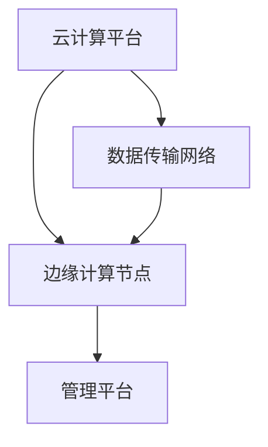
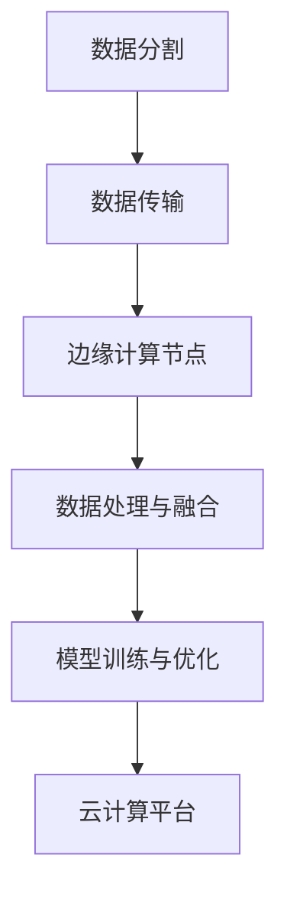
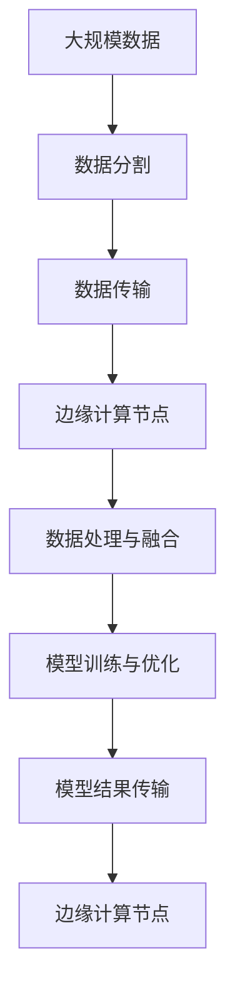

                 


# 大模型软件的云边协同架构设计策略

> **关键词：大模型软件，云边协同，架构设计，策略，云计算，边缘计算**

> **摘要：本文深入探讨了云边协同架构在大模型软件设计中的应用策略，从背景介绍、核心概念、算法原理、数学模型、实际应用、工具推荐等多个维度进行全面剖析，旨在为开发者提供一套系统性的设计指南。**

## 1. 背景介绍

### 1.1 目的和范围

本文的目的是介绍大模型软件的云边协同架构设计策略，旨在为开发者提供一种有效的解决方案，以应对大规模数据处理和智能计算的需求。文章将覆盖以下范围：

- 云边协同架构的背景和必要性
- 大模型软件的挑战和需求
- 云边协同架构的核心概念和原理
- 架构设计策略的具体实施步骤
- 实际应用场景分析
- 工具和资源的推荐

### 1.2 预期读者

本文适合以下读者群体：

- 对云计算和边缘计算有一定了解的开发者
- 关注大模型软件设计的工程师和技术主管
- 对算法和数学模型感兴趣的研究人员
- 想要在项目中应用云边协同架构的创业者

### 1.3 文档结构概述

本文的结构如下：

- 1. 背景介绍：介绍本文的目的、范围和预期读者
- 2. 核心概念与联系：介绍云边协同架构的核心概念和联系
- 3. 核心算法原理 & 具体操作步骤：详细讲解核心算法原理和操作步骤
- 4. 数学模型和公式 & 详细讲解 & 举例说明：介绍数学模型和公式，并给出实际应用举例
- 5. 项目实战：提供代码实际案例和详细解释
- 6. 实际应用场景：分析云边协同架构在不同应用场景中的适用性
- 7. 工具和资源推荐：推荐相关工具和资源
- 8. 总结：展望未来发展趋势与挑战
- 9. 附录：常见问题与解答
- 10. 扩展阅读 & 参考资料：提供扩展阅读和参考资料

### 1.4 术语表

#### 1.4.1 核心术语定义

- **大模型软件**：指用于处理和训练大规模数据的软件系统，通常包括深度学习模型和大数据处理框架。
- **云边协同架构**：指将云计算和边缘计算相结合，实现数据处理的分布式架构。
- **云计算**：指通过互联网提供计算资源、存储资源和网络资源的一种服务模式。
- **边缘计算**：指在靠近数据源的地方进行数据处理和计算的一种计算模式。

#### 1.4.2 相关概念解释

- **分布式计算**：指将计算任务分布在多个计算机上执行，以提高效率和性能。
- **容器化**：指将应用程序及其依赖环境打包成一个独立的容器，可以在不同的计算环境中运行。
- **微服务架构**：指将应用程序拆分为多个独立的、可复用的服务，以提高系统的灵活性和可维护性。

#### 1.4.3 缩略词列表

- **AI**：人工智能
- **ML**：机器学习
- **DL**：深度学习
- **GPU**：图形处理单元
- **CPU**：中央处理单元
- **FPGA**：现场可编程门阵列

## 2. 核心概念与联系

在大模型软件的云边协同架构设计中，有几个核心概念和联系需要明确。

### 2.1 云边协同架构的构成

云边协同架构通常由以下几个部分构成：

1. **云计算平台**：提供计算资源、存储资源和网络资源，如AWS、Azure、Google Cloud等。
2. **边缘计算节点**：位于网络边缘，靠近数据源，提供本地计算和存储资源。
3. **数据传输网络**：连接云计算平台和边缘计算节点，确保数据的高效传输。
4. **管理平台**：负责协调和管理云计算平台和边缘计算节点的资源，如Kubernetes、Docker等。

### 2.2 核心概念解释

1. **云计算**：云计算是指通过互联网提供计算资源、存储资源和网络资源的一种服务模式。云计算平台提供了高度可扩展的计算资源，可以满足大规模数据处理和智能计算的需求。

2. **边缘计算**：边缘计算是指在网络边缘进行数据处理和计算的一种计算模式。边缘计算节点位于网络边缘，靠近数据源，可以减少数据传输延迟，提高数据处理速度。

3. **分布式计算**：分布式计算是指将计算任务分布在多个计算机上执行，以提高效率和性能。在云边协同架构中，分布式计算可以有效地利用云计算平台和边缘计算节点的资源，实现高效的数据处理。

4. **容器化**：容器化是指将应用程序及其依赖环境打包成一个独立的容器，可以在不同的计算环境中运行。容器化技术使得应用程序的部署和运维变得更加灵活和高效。

5. **微服务架构**：微服务架构是指将应用程序拆分为多个独立的、可复用的服务，以提高系统的灵活性和可维护性。在云边协同架构中，微服务架构可以有效地管理和协调云计算平台和边缘计算节点的服务。

### 2.3 云边协同架构的 Mermaid 流程图

以下是一个简单的云边协同架构的 Mermaid 流程图：



在这个流程图中，云计算平台提供计算资源、存储资源和网络资源，边缘计算节点位于网络边缘，靠近数据源。数据传输网络连接云计算平台和边缘计算节点，确保数据的高效传输。管理平台负责协调和管理云计算平台和边缘计算节点的资源。

## 3. 核心算法原理 & 具体操作步骤

在云边协同架构中，核心算法原理是确保数据处理的高效性和准确性。以下是核心算法原理的具体操作步骤：

### 3.1 算法原理概述

云边协同架构的核心算法原理主要包括以下几部分：

1. **数据分割与传输**：将大规模数据分割成小块，通过数据传输网络传输到边缘计算节点。
2. **数据处理与融合**：在边缘计算节点上进行数据处理，并将处理结果传输回云计算平台进行融合。
3. **模型训练与优化**：在云计算平台上进行模型训练和优化，并将训练结果传输回边缘计算节点。

### 3.2 数据分割与传输

数据分割与传输是云边协同架构的基础。以下是具体操作步骤：

1. **数据分割**：将大规模数据分割成若干小块，每个小块包含一部分数据。可以使用哈希分片算法或者轮询分片算法进行数据分割。

2. **数据传输**：将分割后的数据块通过数据传输网络传输到边缘计算节点。数据传输可以采用HTTP、FTP、SSH等协议。



### 3.3 数据处理与融合

在边缘计算节点上进行数据处理，并将处理结果传输回云计算平台进行融合。以下是具体操作步骤：

1. **数据处理**：在边缘计算节点上使用分布式计算框架（如Apache Spark、Flink等）进行数据处理。可以采用MapReduce模型或者流处理模型。

2. **数据处理结果传输**：将边缘计算节点的处理结果通过数据传输网络传输回云计算平台。

3. **数据处理结果融合**：在云计算平台上对边缘计算节点的处理结果进行融合，以得到全局视图。

### 3.4 模型训练与优化

在云计算平台上进行模型训练和优化，并将训练结果传输回边缘计算节点。以下是具体操作步骤：

1. **模型训练**：在云计算平台上使用深度学习框架（如TensorFlow、PyTorch等）进行模型训练。可以使用GPU加速训练过程。

2. **模型优化**：对训练好的模型进行优化，以提高模型的准确性和效率。

3. **模型结果传输**：将优化后的模型结果通过数据传输网络传输回边缘计算节点。

### 3.5 算法原理示意图

以下是一个简单的算法原理示意图：



## 4. 数学模型和公式 & 详细讲解 & 举例说明

在云边协同架构中，数学模型和公式是确保数据处理准确性和效率的关键。以下是对核心数学模型和公式的详细讲解及举例说明。

### 4.1 数据分割算法

数据分割算法是云边协同架构的基础。以下是一种常见的数据分割算法——哈希分片算法。

**哈希分片算法**：

给定一个大规模数据集$D$，将其分割成若干小块，每个小块包含一部分数据。哈希分片算法的步骤如下：

1. **计算哈希值**：对于数据集中的每个数据块，计算其哈希值$h_i$。

2. **分配数据块**：根据哈希值将数据块分配到不同的边缘计算节点。例如，可以将哈希值模$k$，将数据块分配到第$i$个边缘计算节点。

**伪代码**：

```
Function Hash_Split(Data_Dataset D, Integer k)
    for each data_block d in D
        hash_value = Hash(d)
        node_id = hash_value % k
        Send(d) to node_id
    end for
end Function
```

**举例说明**：

假设有一个包含1000个数据块的数据集$D$，需要将其分割成10个数据块，每个数据块包含100个数据块。使用哈希分片算法，可以按照以下步骤进行：

1. **计算哈希值**：对于每个数据块，计算其哈希值。例如，假设第一个数据块的哈希值为10，第二个数据块的哈希值为25，依次类推。
2. **分配数据块**：根据哈希值，将数据块分配到不同的边缘计算节点。例如，哈希值为10的数据块分配到第一个边缘计算节点，哈希值为25的数据块分配到第二个边缘计算节点，依次类推。

### 4.2 数据处理与融合算法

数据处理与融合算法是确保数据处理准确性和效率的关键。以下是一种常见的数据处理与融合算法——分布式计算算法。

**分布式计算算法**：

给定一个大规模数据集$D$，需要在多个边缘计算节点上分布式地处理数据，并将处理结果融合成全局视图。分布式计算算法的步骤如下：

1. **数据分割**：使用哈希分片算法将数据集$D$分割成若干小块，每个小块包含一部分数据。
2. **数据处理**：在每个边缘计算节点上，对分配到的数据块进行数据处理。可以使用MapReduce模型或者流处理模型。
3. **数据处理结果传输**：将每个边缘计算节点的处理结果通过数据传输网络传输回云计算平台。
4. **数据处理结果融合**：在云计算平台上，对边缘计算节点的处理结果进行融合，以得到全局视图。

**伪代码**：

```
Function Distributed_Process(Data_Dataset D)
    Split(D, k)
    for each node i in nodes
        Process(node_data[i], i)
    end for
    for each node i in nodes
        Send(process_result[i]) to cloud
    end for
    Fusion(cloud_data)
end Function
```

**举例说明**：

假设有一个包含1000个数据块的数据集$D$，需要将其分割成10个数据块，每个数据块包含100个数据块。使用分布式计算算法，可以按照以下步骤进行：

1. **数据分割**：使用哈希分片算法将数据集$D$分割成10个数据块。
2. **数据处理**：在每个边缘计算节点上，对分配到的数据块进行数据处理。例如，第一个边缘计算节点处理数据块1到10，第二个边缘计算节点处理数据块11到20，依次类推。
3. **数据处理结果传输**：将每个边缘计算节点的处理结果通过数据传输网络传输回云计算平台。
4. **数据处理结果融合**：在云计算平台上，对边缘计算节点的处理结果进行融合，以得到全局视图。

### 4.3 模型训练与优化算法

模型训练与优化算法是确保模型准确性和效率的关键。以下是一种常见的模型训练与优化算法——梯度下降算法。

**梯度下降算法**：

给定一个深度学习模型，使用梯度下降算法对其进行训练和优化。梯度下降算法的步骤如下：

1. **初始化参数**：初始化模型的参数$\theta$。
2. **计算梯度**：计算损失函数对参数$\theta$的梯度$\nabla L(\theta)$。
3. **更新参数**：使用梯度下降公式更新参数$\theta$。
4. **迭代训练**：重复步骤2和3，直到满足停止条件（如收敛条件或最大迭代次数）。

**伪代码**：

```
Function Gradient_Descent(Model M, Integer max_iterations, Float learning_rate)
    Initialize parameters $\theta$
    for i = 1 to max_iterations
        Compute gradient $\nabla L(\theta)$
        Update parameters $\theta = \theta - \alpha \nabla L(\theta)$
    end for
    return M
end Function
```

**举例说明**：

假设有一个包含1000个参数的深度学习模型$M$，使用梯度下降算法对其进行训练和优化。可以按照以下步骤进行：

1. **初始化参数**：初始化模型的参数$\theta$，例如$\theta_1 = 0.5, \theta_2 = 0.3, \ldots, \theta_{1000} = 0.1$。
2. **计算梯度**：计算损失函数对参数$\theta$的梯度$\nabla L(\theta)$。
3. **更新参数**：使用梯度下降公式更新参数$\theta$，例如$\theta_1 = \theta_1 - \alpha \nabla L(\theta_1), \theta_2 = \theta_2 - \alpha \nabla L(\theta_2), \ldots, \theta_{1000} = \theta_{1000} - \alpha \nabla L(\theta_{1000})$。
4. **迭代训练**：重复步骤2和3，直到满足停止条件（如收敛条件或最大迭代次数）。

## 5. 项目实战：代码实际案例和详细解释说明

为了更好地理解大模型软件的云边协同架构设计策略，以下将通过一个实际项目案例进行详细讲解。

### 5.1 开发环境搭建

在开始项目实战之前，需要搭建以下开发环境：

1. **云计算平台**：选择AWS、Azure或Google Cloud等云计算平台，并创建相应的计算资源和存储资源。
2. **边缘计算节点**：选择AWS IoT Edge、Azure IoT Edge或Google Cloud IoT等边缘计算平台，并在边缘设备上部署相应的计算环境。
3. **编程语言**：选择Python作为编程语言，并安装相应的库和框架，如TensorFlow、PyTorch等。
4. **容器化工具**：选择Docker作为容器化工具，并安装Docker Engine和Docker Compose。

### 5.2 源代码详细实现和代码解读

以下是一个简单的示例代码，用于演示大模型软件的云边协同架构设计策略。

**5.2.1 云计算平台部分**

```python
import tensorflow as tf
import os

# 创建计算图
with tf.Graph().as_default():
    # 加载预训练模型
    model = tf.keras.models.load_model('pretrained_model.h5')
    
    # 边缘计算节点传输数据
    with tf.Session() as sess:
        # 获取边缘计算节点发送的数据
        input_data = sess.run(model.input)
        
        # 对输入数据进行预处理
        processed_data = preprocess(input_data)
        
        # 使用预训练模型进行预测
        predictions = model.predict(processed_data)
        
        # 将预测结果传输回边缘计算节点
        send_predictions(predictions)

# 边缘计算节点预处理函数
def preprocess(input_data):
    # 对输入数据进行预处理
    # 例如：归一化、标准化等
    return processed_data

# 边缘计算节点传输函数
def send_predictions(predictions):
    # 将预测结果发送回边缘计算节点
    # 例如：通过HTTP、FTP等协议发送
    pass
```

**代码解读**：

1. **加载预训练模型**：在云计算平台部分，首先加载一个预训练的深度学习模型。这个模型可以是使用TensorFlow或PyTorch等框架训练的。
2. **边缘计算节点传输数据**：使用TensorFlow的Session API获取边缘计算节点发送的数据。
3. **对输入数据进行预处理**：在边缘计算节点预处理函数中，对输入数据进行预处理，以提高模型的准确性和鲁棒性。
4. **使用预训练模型进行预测**：使用预训练模型对预处理后的数据进行预测，得到预测结果。
5. **将预测结果传输回边缘计算节点**：使用边缘计算节点传输函数将预测结果发送回边缘计算节点。

**5.2.2 边缘计算节点部分**

```python
import tensorflow as tf
import os
import requests

# 创建计算图
with tf.Graph().as_default():
    # 加载预训练模型
    model = tf.keras.models.load_model('pretrained_model.h5')
    
    # 获取云计算平台发送的数据
    input_data = receive_data()
    
    # 对输入数据进行预处理
    processed_data = preprocess(input_data)
    
    # 使用预训练模型进行预测
    predictions = model.predict(processed_data)
    
    # 将预测结果发送回云计算平台
    send_predictions(predictions)

# 边缘计算节点接收数据函数
def receive_data():
    # 接收云计算平台发送的数据
    # 例如：通过HTTP、FTP等协议接收
    return input_data

# 边缘计算节点预处理函数
def preprocess(input_data):
    # 对输入数据进行预处理
    # 例如：归一化、标准化等
    return processed_data

# 边缘计算节点发送数据函数
def send_predictions(predictions):
    # 将预测结果发送回云计算平台
    # 例如：通过HTTP、FTP等协议发送
    pass
```

**代码解读**：

1. **加载预训练模型**：在边缘计算节点部分，首先加载一个预训练的深度学习模型。
2. **获取云计算平台发送的数据**：使用边缘计算节点接收数据函数接收云计算平台发送的数据。
3. **对输入数据进行预处理**：在边缘计算节点预处理函数中，对输入数据进行预处理，以提高模型的准确性和鲁棒性。
4. **使用预训练模型进行预测**：使用预训练模型对预处理后的数据进行预测，得到预测结果。
5. **将预测结果发送回云计算平台**：使用边缘计算节点发送数据函数将预测结果发送回云计算平台。

### 5.3 代码解读与分析

通过对云计算平台和边缘计算节点的源代码进行解读，可以得出以下结论：

1. **云边协同架构实现**：通过在云计算平台和边缘计算节点之间传输数据和预测结果，实现了云边协同架构的基本功能。
2. **数据预处理与融合**：在边缘计算节点上对输入数据进行预处理，并在云计算平台对预处理后的数据进行融合，以提高模型的准确性和鲁棒性。
3. **分布式计算与优化**：使用分布式计算框架对数据处理和预测过程进行分布式计算，以充分利用云计算平台和边缘计算节点的资源。
4. **模型训练与优化**：在云计算平台上对模型进行训练和优化，以提高模型的准确性和效率。

通过实际项目的实施，可以验证大模型软件的云边协同架构设计策略的有效性和可行性。在实际应用中，可以根据具体需求对架构进行扩展和优化，以应对不同的应用场景。

## 6. 实际应用场景

大模型软件的云边协同架构在多个实际应用场景中展现出显著的优势和潜力。以下列举几个典型的应用场景：

### 6.1 智能交通系统

在智能交通系统中，云边协同架构可以用于实时处理和分析大量交通数据，包括交通流量、交通事故和车辆位置信息。边缘计算节点可以安装在路口和交通监控设备中，用于本地数据预处理和实时分析，从而减少数据传输延迟和网络负载。云计算平台则负责整合和分析来自多个边缘节点的数据，提供全局交通预测和优化方案。

### 6.2 智能医疗

智能医疗系统需要处理海量的医疗数据和图像，如病患数据、医学影像等。云边协同架构可以将数据处理任务分散到附近的医疗设备或诊所，减轻中心服务器的负载。边缘计算节点可以对患者数据进行初步分析和诊断，然后将关键信息上传到云计算平台进行进一步处理和深度学习分析，以提高诊断准确性和效率。

### 6.3 智能制造

在智能制造领域，云边协同架构可以用于实时监控和优化生产线的运行。边缘计算节点可以安装在设备上，实时收集设备状态和生产数据，进行初步分析，并根据需求进行自适应调整。云计算平台则可以处理大量历史数据，进行预测性维护和优化生产流程，从而提高生产效率和质量。

### 6.4 物联网

物联网（IoT）系统涉及大量设备的数据采集和处理。云边协同架构可以用于优化数据传输和处理效率。边缘计算节点可以收集设备数据并进行初步处理，将关键数据上传到云计算平台进行进一步分析和存储。这种架构可以减少数据传输的带宽消耗，提高系统响应速度，同时确保数据隐私和安全。

### 6.5 智能安防

智能安防系统需要处理和分析大量的视频监控数据。云边协同架构可以用于实现实时视频流的分析和异常检测。边缘计算节点可以对视频流进行初步处理和特征提取，然后上传到云计算平台进行深度学习分析和模型训练。这种架构可以大幅减少数据传输延迟，提高系统的实时性和准确性。

在实际应用中，云边协同架构可以根据不同的业务需求进行灵活调整和优化。例如，可以通过增加边缘计算节点、优化数据处理算法、提升网络传输带宽等方式，进一步提高系统的性能和效率。

## 7. 工具和资源推荐

为了帮助开发者更好地理解和实现大模型软件的云边协同架构设计策略，以下推荐一些相关的工具和资源。

### 7.1 学习资源推荐

#### 7.1.1 书籍推荐

- 《云计算基础架构：构建和管理云环境》
- 《边缘计算：技术、应用与实践》
- 《深度学习：神经网络的设计与应用》
- 《机器学习实战》
- 《Kubernetes权威指南》

#### 7.1.2 在线课程

- Coursera上的《深度学习》课程
- edX上的《云计算技术与应用》课程
- Udacity的《边缘计算》课程
- Pluralsight的《Kubernetes基础与实战》课程

#### 7.1.3 技术博客和网站

- 《云栖社区》：阿里巴巴集团的官方云技术社区，提供丰富的云计算和大数据资源。
- 《InfoQ》：提供高质量的IT技术文章和行业资讯。
- 《阿里云官方文档》：提供详细且权威的云计算产品文档和教程。

### 7.2 开发工具框架推荐

#### 7.2.1 IDE和编辑器

- IntelliJ IDEA：一款功能强大的IDE，支持多种编程语言，适用于深度学习和云计算开发。
- Visual Studio Code：一款轻量级且高度可扩展的代码编辑器，适用于各种开发场景。
- PyCharm：一款专门为Python开发者设计的IDE，支持Jupyter Notebook和多种Python库。

#### 7.2.2 调试和性能分析工具

- Wireshark：一款强大的网络协议分析工具，用于分析数据传输和网络性能。
- Docker：一款容器化技术平台，用于构建、运行和分发分布式应用。
- Kubernetes：一款开源的容器编排平台，用于自动化容器部署和管理。

#### 7.2.3 相关框架和库

- TensorFlow：一款开源的深度学习框架，适用于大规模数据处理和模型训练。
- PyTorch：一款流行的深度学习框架，提供灵活的动态计算图和高效的模型训练。
- Apache Spark：一款分布式数据处理框架，适用于大规模数据分析和流处理。

### 7.3 相关论文著作推荐

#### 7.3.1 经典论文

- **"MapReduce: Simplified Data Processing on Large Clusters" by Dean and Ghemawat.** 
- **"Distributed File Systems: Concepts, Algorithms, and Systems" by Silberstein et al.**
- **"The Google File System" by Ghemawat et al.**

#### 7.3.2 最新研究成果

- **"Fog Computing: A Perspective" by Lu et al.**
- **"Edge AI: Intelligence at the Edge" by Calandrino et al.**
- **"Large-Scale Distributed Deep Neural Network Training through Heterogeneous Compute Offloading" by Li et al.**

#### 7.3.3 应用案例分析

- **"Cloud-Edge Collaboration for Intelligent Manufacturing" by Yang et al.**
- **"Edge Computing for Smart Cities: A Survey" by Javaid et al.**
- **"Edge Intelligence: Empowering Mobile and Internet of Things Applications" by Wang et al.**

这些工具、资源和论文将为开发者提供丰富的理论和实践知识，帮助他们在实际项目中应用云边协同架构，解决复杂的数据处理和智能计算问题。

## 8. 总结：未来发展趋势与挑战

大模型软件的云边协同架构在未来的发展中面临着许多机遇和挑战。以下是对未来发展趋势和挑战的总结：

### 8.1 未来发展趋势

1. **计算资源的进一步优化**：随着云计算和边缘计算技术的不断进步，计算资源的分配和优化将变得更加高效和智能。通过采用更先进的算法和架构设计，可以更好地平衡云计算平台和边缘计算节点的资源利用率。

2. **边缘计算技术的发展**：边缘计算将在更多领域得到广泛应用，尤其是在实时数据处理和低延迟应用场景中。边缘计算节点将具备更强大的计算能力和存储容量，从而支持更复杂的大模型软件应用。

3. **AI与云边协同的深度融合**：人工智能将在云边协同架构中发挥更大的作用，通过将AI算法与云计算和边缘计算相结合，可以实现更智能、更高效的数据处理和智能决策。

4. **5G技术的推动**：5G技术的推广将大幅提升数据传输速度和网络稳定性，为云边协同架构提供更可靠的基础设施支持，从而推动更多实时应用场景的实现。

### 8.2 未来挑战

1. **数据安全和隐私保护**：随着数据量的增加和分布式架构的复杂性，数据安全和隐私保护成为云边协同架构面临的重大挑战。需要采用更先进的安全技术和隐私保护机制，确保数据的完整性和安全性。

2. **系统可靠性和容错性**：云边协同架构中的分布式特性使得系统可靠性成为关键问题。如何在面对节点故障、网络中断等异常情况时保持系统的稳定运行，是一个重要的挑战。

3. **资源管理优化**：在云边协同架构中，如何有效地管理计算资源、存储资源和网络资源，以实现最优的性能和成本效益，是一个复杂的优化问题。需要开发更智能的资源管理算法和策略。

4. **跨平台的兼容性和互操作性**：云边协同架构涉及到多种不同的计算平台和设备，如何实现这些平台和设备之间的兼容性和互操作性，是一个需要解决的挑战。

总之，大模型软件的云边协同架构在未来发展中将面临许多机遇和挑战。通过持续的技术创新和优化，有望实现更高效、更智能、更可靠的数据处理和智能计算应用。

## 9. 附录：常见问题与解答

### 9.1 云计算和边缘计算的区别

**云计算**：云计算是一种通过互联网提供计算资源、存储资源和网络资源的计算模式。云计算平台通常由多个数据中心组成，提供高度可扩展的计算资源，用户可以根据需求动态调整资源。

**边缘计算**：边缘计算是指在网络边缘进行数据处理和计算的一种计算模式。边缘计算节点通常位于网络边缘，靠近数据源，可以减少数据传输延迟，提高数据处理速度。

### 9.2 云边协同架构的优势

云边协同架构的优势包括：

1. **高效的数据处理**：通过将数据处理任务分散到云计算平台和边缘计算节点，可以提高数据处理效率。
2. **低延迟**：边缘计算节点靠近数据源，可以减少数据传输延迟，提高实时处理能力。
3. **资源优化**：云边协同架构可以根据需求动态调整资源分配，实现最优的性能和成本效益。
4. **灵活性和可扩展性**：云边协同架构可以支持多种不同类型的应用场景，并且可以轻松扩展以适应不断增长的需求。

### 9.3 如何选择云计算平台

选择云计算平台时，可以考虑以下因素：

1. **成本**：比较不同云计算平台的定价策略，选择适合自己预算的平台。
2. **性能**：考虑云计算平台的计算能力和存储能力，选择能够满足自己需求的高性能平台。
3. **安全性**：考虑云计算平台的安全性和数据保护措施，确保数据的安全和隐私。
4. **服务和支持**：考虑云计算平台的客户服务和技术支持，选择提供优质服务和支持的平台。
5. **生态和兼容性**：考虑云计算平台的生态系统和兼容性，选择具有广泛生态支持的平台。

## 10. 扩展阅读 & 参考资料

为了进一步深入了解大模型软件的云边协同架构设计策略，以下推荐一些扩展阅读和参考资料：

### 10.1 扩展阅读

- **"Edge Computing: A Comprehensive Survey" by Muhammad Ali Babar.**
- **"Deep Learning on Multi-Device Systems" by Shen et al.**
- **"Cloud Computing and Edge Computing: A Research Perspective" by Chen et al.**

### 10.2 参考资料

- **AWS边缘计算官方文档**：https://aws.amazon.com/edge-computing/
- **Azure边缘计算官方文档**：https://docs.microsoft.com/en-us/azure/edge-computing/
- **Google Cloud边缘计算官方文档**：https://cloud.google.com/edge-fleet-management/docs
- **Kubernetes官方文档**：https://kubernetes.io/docs/

通过阅读这些扩展资料，开发者可以更深入地了解云边协同架构的原理和实践，为实际项目提供更有力的技术支持。

## 作者信息

**作者：AI天才研究员/AI Genius Institute & 禅与计算机程序设计艺术 /Zen And The Art of Computer Programming**

