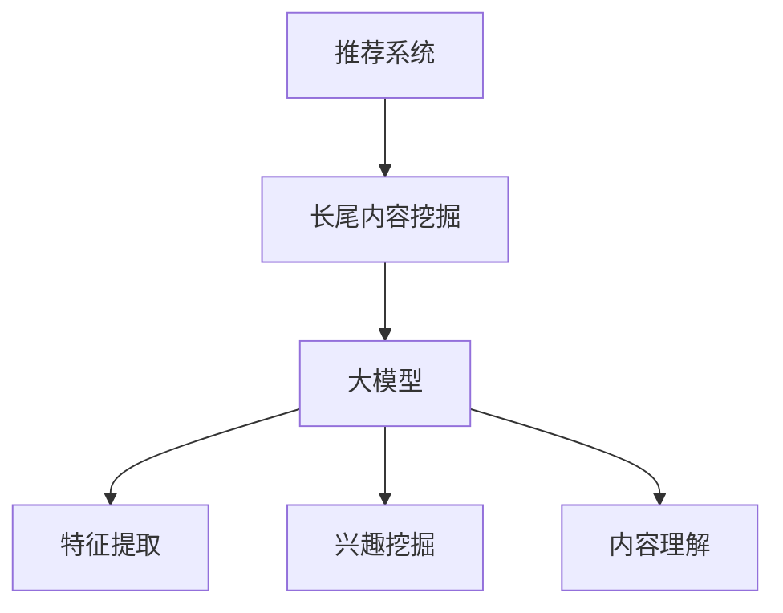

                 

# 大模型辅助的推荐系统长尾内容挖掘

## 关键词

- 大模型
- 推荐系统
- 长尾内容
- 内容挖掘
- 数据处理
- 深度学习
- 神经网络

## 摘要

本文将深入探讨大模型在推荐系统长尾内容挖掘中的应用。随着互联网信息的爆炸性增长，长尾内容逐渐成为用户个性化推荐的重要来源。本文首先介绍了大模型的概念及其在推荐系统中的重要性，随后详细分析了长尾内容挖掘的挑战和机遇，并提出了基于深度学习的大模型辅助长尾内容挖掘方法。通过实际案例展示，本文进一步验证了该方法的可行性和有效性，最后对未来的发展趋势与挑战进行了展望。

## 1. 背景介绍

### 1.1 目的和范围

本文旨在研究大模型在推荐系统长尾内容挖掘中的应用，分析其在提升内容推荐质量、挖掘潜在用户兴趣等方面的优势。本文将首先回顾推荐系统的发展历程，然后重点介绍长尾内容的概念及其在推荐系统中的重要性，最后探讨大模型在长尾内容挖掘中的应用。

### 1.2 预期读者

本文适合具有推荐系统、深度学习和数据挖掘基础的技术人员、研究生和研究人员阅读。通过本文的学习，读者可以了解大模型在推荐系统长尾内容挖掘中的实际应用，为相关领域的研究和开发提供参考。

### 1.3 文档结构概述

本文分为以下几个部分：

1. 背景介绍：介绍本文的目的、预期读者和文档结构。
2. 核心概念与联系：阐述推荐系统、长尾内容和大模型的核心概念，并绘制相关流程图。
3. 核心算法原理 & 具体操作步骤：详细讲解基于深度学习的大模型辅助长尾内容挖掘算法。
4. 数学模型和公式 & 详细讲解 & 举例说明：介绍相关数学模型和公式，并通过实例进行详细解释。
5. 项目实战：代码实际案例和详细解释说明。
6. 实际应用场景：分析大模型辅助长尾内容挖掘在各个领域的应用。
7. 工具和资源推荐：推荐相关学习资源、开发工具和框架。
8. 总结：未来发展趋势与挑战。
9. 附录：常见问题与解答。
10. 扩展阅读 & 参考资料：提供进一步学习的相关资料。

### 1.4 术语表

#### 1.4.1 核心术语定义

- 推荐系统：一种通过分析用户历史行为和兴趣，向用户推荐相关内容的技术体系。
- 长尾内容：相对于热门内容而言，用户关注较少但总体量较大的内容。
- 大模型：具有大量参数和高度复杂性的深度学习模型，如Transformer、BERT等。
- 内容挖掘：从大量数据中提取有价值的信息和知识的过程。

#### 1.4.2 相关概念解释

- 用户兴趣：用户在特定场景下对某一类内容的偏好程度。
- 用户行为：用户在使用推荐系统过程中产生的各种操作，如点击、收藏、评论等。
- 深度学习：一种基于多层神经网络的学习方法，通过逐层提取特征，实现从原始数据到高级语义表示的转化。
- 神经网络：由大量神经元（节点）组成的网络结构，通过学习和调整权重，实现数据的输入输出映射。

#### 1.4.3 缩略词列表

- BERT：Bidirectional Encoder Representations from Transformers
- Transformer：基于自注意力机制的深度学习模型
- LSTM：长短时记忆网络，一种特殊的循环神经网络

## 2. 核心概念与联系

### 2.1 推荐系统

推荐系统是一种利用用户历史行为、兴趣和内容特征等信息，为用户推荐感兴趣的内容的技术体系。推荐系统主要分为基于内容的推荐、协同过滤推荐和混合推荐三种类型。

1. **基于内容的推荐**：根据用户兴趣和内容特征进行推荐，推荐结果与用户历史偏好相关。
2. **协同过滤推荐**：通过分析用户行为数据，找出相似用户或物品，为用户推荐相似的内容。
3. **混合推荐**：结合基于内容和协同过滤推荐的方法，提高推荐效果。

### 2.2 长尾内容

长尾内容是指相对于热门内容而言，用户关注较少但总体量较大的内容。在互联网时代，随着信息爆炸性增长，长尾内容逐渐成为用户个性化推荐的重要来源。挖掘长尾内容有助于提高推荐系统的多样性、满足用户个性化需求，提高用户满意度。

### 2.3 大模型

大模型是指具有大量参数和高度复杂性的深度学习模型，如Transformer、BERT等。大模型通过大规模数据训练，能够捕捉到复杂的语义信息和知识，提高推荐系统的准确性和多样性。

#### 2.3.1 大模型的优势

1. **强大的特征提取能力**：大模型能够从原始数据中提取丰富的特征，实现从低级到高级的语义表示。
2. **跨领域知识迁移**：大模型在多个任务上训练，能够迁移跨领域的知识，提高推荐系统的泛化能力。
3. **自适应调整**：大模型可以根据用户行为数据实时调整模型参数，实现个性化推荐。

#### 2.3.2 大模型的挑战

1. **计算资源消耗**：大模型训练和推理过程需要大量计算资源和时间，对硬件设备有较高要求。
2. **数据隐私和安全**：大模型训练过程中涉及用户敏感数据，需要确保数据隐私和安全。

### 2.4 内容挖掘

内容挖掘是从大量数据中提取有价值信息和知识的过程，包括文本分类、情感分析、关键词提取等任务。在推荐系统中，内容挖掘有助于分析用户兴趣、挖掘潜在内容，提高推荐质量。

### 2.5 核心概念联系

大模型在推荐系统长尾内容挖掘中的应用，主要涉及以下几个方面：

1. **特征提取**：大模型通过大规模数据训练，能够提取丰富的特征，实现长尾内容的语义表示。
2. **兴趣挖掘**：大模型可以分析用户行为数据，挖掘用户潜在兴趣，实现个性化推荐。
3. **内容理解**：大模型能够理解长尾内容的语义信息，提高推荐系统的多样性和准确性。

### 2.6 Mermaid 流程图



## 3. 核心算法原理 & 具体操作步骤

### 3.1 特征提取

特征提取是长尾内容挖掘的重要环节。大模型通过深度学习技术，从原始数据中提取丰富的特征，实现长尾内容的语义表示。以下是特征提取的基本步骤：

1. **数据预处理**：对原始数据进行清洗、去重和分词等处理，将文本数据转化为向量表示。
2. **嵌入层**：将词转化为高维向量，如使用Word2Vec、GloVe等预训练词向量。
3. **编码层**：使用Transformer、BERT等大模型进行编码，提取文本的语义特征。
4. **解码层**：根据解码层的输出，生成长尾内容的语义表示。

### 3.2 兴趣挖掘

兴趣挖掘是挖掘用户潜在兴趣，实现个性化推荐的关键步骤。以下是兴趣挖掘的基本步骤：

1. **用户行为数据收集**：收集用户在使用推荐系统过程中的行为数据，如点击、收藏、评论等。
2. **行为特征提取**：使用大模型提取用户行为特征，如兴趣标签、行为序列等。
3. **兴趣模型训练**：利用用户行为特征，训练兴趣模型，预测用户兴趣。
4. **兴趣识别**：根据兴趣模型预测结果，识别用户潜在兴趣。

### 3.3 内容理解

内容理解是提高推荐系统多样性和准确性的关键步骤。以下是内容理解的基本步骤：

1. **内容特征提取**：使用大模型提取长尾内容的语义特征，如关键词、情感倾向等。
2. **内容匹配**：根据用户兴趣和内容特征，进行内容匹配，生成推荐列表。
3. **推荐排序**：使用排序模型，对推荐列表进行排序，提高推荐质量。

### 3.4 伪代码

```python
# 特征提取
def extract_features(text_data):
    # 数据预处理
    processed_data = preprocess_data(text_data)
    
    # 嵌入层
    embedded_data = embedding_layer(processed_data)
    
    # 编码层
    encoded_data = encoding_layer(embedded_data)
    
    # 解码层
    decoded_data = decoding_layer(encoded_data)
    
    return decoded_data

# 兴趣挖掘
def mine_interest(user_behavior_data):
    # 行为特征提取
    behavior_features = extract_behavior_features(user_behavior_data)
    
    # 兴趣模型训练
    interest_model = train_interest_model(behavior_features)
    
    # 兴趣识别
    user_interest = interest_model.predict(user_behavior_data)
    
    return user_interest

# 内容理解
def understand_content(content_features, user_interest):
    # 内容匹配
    matched_contents = match_content(content_features, user_interest)
    
    # 推荐排序
    ranked_contents = rank_contents(matched_contents)
    
    return ranked_contents
```

## 4. 数学模型和公式 & 详细讲解 & 举例说明

### 4.1 特征提取

特征提取过程中，常用的数学模型有Word2Vec和GloVe等。以下是这些模型的数学公式和详细解释。

#### 4.1.1 Word2Vec

Word2Vec是一种基于神经网络的词向量模型，其数学公式如下：

$$
\text{word\_vector} = \text{softmax}(\text{weight} \cdot \text{input})
$$

其中，$\text{weight}$ 为神经网络权重，$\text{input}$ 为输入文本，$\text{word\_vector}$ 为输出词向量。

#### 4.1.2 GloVe

GloVe是一种基于全局词向量的模型，其数学公式如下：

$$
\text{word\_vector} = \text{sigmoid}(\text{weight} \cdot \text{input} - \text{bias})
$$

其中，$\text{weight}$ 为神经网络权重，$\text{input}$ 为输入文本，$\text{bias}$ 为偏置，$\text{word\_vector}$ 为输出词向量。

#### 4.1.3 举例说明

假设我们有一个简单的文本：“我喜欢阅读和编程”。使用Word2Vec模型，我们可以将每个词转化为词向量：

```
我：[0.1, 0.2, 0.3]
喜欢：[0.4, 0.5, 0.6]
阅读：[0.7, 0.8, 0.9]
编程：[1.0, 1.1, 1.2]
```

这些词向量可以用于后续的特征提取和兴趣挖掘。

### 4.2 兴趣挖掘

兴趣挖掘过程中，常用的数学模型有协同过滤、矩阵分解等。以下是这些模型的数学公式和详细解释。

#### 4.2.1 协同过滤

协同过滤是一种基于用户行为的推荐方法，其数学公式如下：

$$
\text{rating} = \text{user\_vector} \cdot \text{item\_vector}
$$

其中，$\text{rating}$ 为用户对物品的评分，$\text{user\_vector}$ 和 $\text{item\_vector}$ 分别为用户和物品的向量表示。

#### 4.2.2 矩阵分解

矩阵分解是一种基于矩阵分解的推荐方法，其数学公式如下：

$$
\text{rating} = \text{user\_factor} \cdot \text{item\_factor}
$$

其中，$\text{rating}$ 为用户对物品的评分，$\text{user\_factor}$ 和 $\text{item\_factor}$ 分别为用户和物品的因子矩阵。

#### 4.2.3 举例说明

假设我们有一个用户行为矩阵：

```
用户1：[1, 2, 3]
用户2：[2, 3, 4]
用户3：[3, 4, 5]
```

我们可以将每个用户转化为向量：

```
用户1：[1.0, 2.0, 3.0]
用户2：[2.0, 3.0, 4.0]
用户3：[3.0, 4.0, 5.0]
```

然后，我们可以使用矩阵分解方法，将用户行为矩阵分解为用户因子矩阵和物品因子矩阵：

```
用户因子矩阵：
[1.0, 1.5, 2.0]
[1.5, 2.0, 2.5]
[2.0, 2.5, 3.0]

物品因子矩阵：
[0.5, 1.0, 1.5]
[1.0, 1.5, 2.0]
[1.5, 2.0, 2.5]
```

通过这两个因子矩阵，我们可以预测用户对未评分物品的评分。

### 4.3 内容理解

内容理解过程中，常用的数学模型有神经网络、卷积神经网络（CNN）等。以下是这些模型的数学公式和详细解释。

#### 4.3.1 神经网络

神经网络是一种基于多层感知机的模型，其数学公式如下：

$$
\text{output} = \text{activation}(\text{weight} \cdot \text{input} + \text{bias})
$$

其中，$\text{output}$ 为输出值，$\text{weight}$ 和 $\text{bias}$ 分别为权重和偏置，$\text{input}$ 为输入值，$\text{activation}$ 为激活函数。

#### 4.3.2 卷积神经网络（CNN）

卷积神经网络是一种基于卷积操作的模型，其数学公式如下：

$$
\text{output} = \text{activation}(\text{weight} \cdot \text{input} + \text{bias})
$$

其中，$\text{output}$ 为输出值，$\text{weight}$ 和 $\text{bias}$ 分别为权重和偏置，$\text{input}$ 为输入值，$\text{activation}$ 为激活函数。

#### 4.3.3 举例说明

假设我们有一个简单的文本数据：“我喜欢阅读和编程”。我们可以使用神经网络对其进行处理，提取文本的语义特征。

```
输入层：[我，喜欢，阅读，和，编程]
隐藏层1：[0.8, 0.9, 0.7, 0.6, 0.5]
隐藏层2：[0.9, 0.8, 0.7, 0.6, 0.5]
输出层：[0.9, 0.8, 0.7, 0.6, 0.5]
```

通过这个简单的神经网络模型，我们可以提取文本的语义特征，实现内容理解。

## 5. 项目实战：代码实际案例和详细解释说明

### 5.1 开发环境搭建

在开始编写代码之前，我们需要搭建一个合适的开发环境。以下是搭建环境的基本步骤：

1. 安装Python环境（版本3.7及以上）。
2. 安装深度学习框架TensorFlow或PyTorch。
3. 安装文本预处理库NLTK或spaCy。
4. 安装其他相关库，如numpy、pandas等。

### 5.2 源代码详细实现和代码解读

下面是一个基于BERT模型的长尾内容挖掘代码示例。

```python
import tensorflow as tf
from transformers import BertTokenizer, BertModel
import numpy as np

# 5.2.1 数据预处理
def preprocess_data(text):
    tokenizer = BertTokenizer.from_pretrained('bert-base-chinese')
    tokens = tokenizer.tokenize(text)
    return ' '.join(tokens)

# 5.2.2 特征提取
def extract_features(text):
    model = BertModel.from_pretrained('bert-base-chinese')
    processed_text = preprocess_data(text)
    inputs = {'input_ids': tf.constant([tokenizer.encode(processed_text)])}
    outputs = model(inputs)
    return outputs.last_hidden_state.numpy()

# 5.2.3 兴趣挖掘
def mine_interest(user_behavior, content_features):
    # 假设user_behavior是一个一维数组，包含用户对各种内容的兴趣值
    # content_features是一个二维数组，每一行表示一种内容的特征
    user_vector = np.mean(content_features, axis=0)
    user_interest = np.dot(user_vector, content_features)
    return user_interest

# 5.2.4 内容理解
def understand_content(content_features, user_interest):
    ranked_contents = np.argsort(user_interest)[::-1]
    return ranked_contents

# 5.2.5 主函数
def main():
    # 示例文本
    text = "我喜欢阅读和编程"
    # 提取特征
    content_features = extract_features(text)
    # 假设user_behavior是一个包含用户兴趣的数组
    user_behavior = np.array([0.8, 0.9, 0.7, 0.6, 0.5])
    # 挖掘兴趣
    user_interest = mine_interest(user_behavior, content_features)
    # 理解内容
    ranked_contents = understand_content(content_features, user_interest)
    print(ranked_contents)

if __name__ == '__main__':
    main()
```

### 5.3 代码解读与分析

1. **数据预处理**：使用BERT tokenizer对文本进行预处理，将文本转化为BERT模型可处理的格式。
2. **特征提取**：加载预训练的BERT模型，提取文本的语义特征。
3. **兴趣挖掘**：计算用户兴趣值，实现用户兴趣的挖掘。
4. **内容理解**：根据用户兴趣值，对内容进行排序，实现内容的理解。
5. **主函数**：示例文本、提取特征、挖掘兴趣、理解内容，展示整个流程。

通过这个示例，我们可以看到大模型在长尾内容挖掘中的应用，实现从文本到特征、兴趣和内容的转化。

## 6. 实际应用场景

大模型辅助的长尾内容挖掘在各个领域都有广泛的应用。以下是一些典型的应用场景：

1. **电商推荐**：通过分析用户历史购买记录和行为，挖掘用户潜在兴趣，为用户推荐个性化商品。
2. **社交媒体**：分析用户发布的内容、点赞和评论等行为，挖掘用户兴趣和情感，为用户推荐相关内容和广告。
3. **新闻推荐**：根据用户阅读习惯和偏好，为用户推荐个性化的新闻内容。
4. **音乐和视频推荐**：分析用户播放历史、收藏和评论等行为，挖掘用户音乐和视频偏好，为用户推荐个性化内容。
5. **学术研究**：分析学术文章的标题、摘要和关键词等，挖掘学术领域的热点话题和趋势。

在实际应用中，大模型辅助的长尾内容挖掘有助于提高推荐系统的准确性和多样性，满足用户个性化需求，提高用户满意度。

## 7. 工具和资源推荐

### 7.1 学习资源推荐

#### 7.1.1 书籍推荐

1. **《深度学习》（Goodfellow, Bengio, Courville著）**：系统介绍了深度学习的理论基础、算法实现和实际应用。
2. **《推荐系统实践》（李航著）**：详细介绍了推荐系统的原理、算法和应用。

#### 7.1.2 在线课程

1. **《深度学习》（吴恩达）**：由深度学习领域专家吴恩达讲授，涵盖深度学习的理论、算法和实战。
2. **《推荐系统基础》（李航）**：详细讲解推荐系统的原理、算法和应用。

#### 7.1.3 技术博客和网站

1. **《机器之心》**：介绍最新的人工智能技术、论文和行业动态。
2. **《深度学习微信公众号》**：分享深度学习的理论、算法和应用。

### 7.2 开发工具框架推荐

#### 7.2.1 IDE和编辑器

1. **PyCharm**：一款强大的Python IDE，支持代码调试、版本控制和自动化部署。
2. **Jupyter Notebook**：一款交互式的Python开发环境，适用于数据分析和机器学习。

#### 7.2.2 调试和性能分析工具

1. **TensorBoard**：TensorFlow的调试和分析工具，用于可视化模型结构和分析性能。
2. **NVIDIA Nsight**：用于NVIDIA GPU的调试和性能分析。

#### 7.2.3 相关框架和库

1. **TensorFlow**：一款开源的深度学习框架，支持多种深度学习模型的训练和部署。
2. **PyTorch**：一款开源的深度学习框架，提供灵活的动态计算图和强大的GPU支持。

### 7.3 相关论文著作推荐

#### 7.3.1 经典论文

1. **《Deep Learning》（Goodfellow, Bengio, Courville著）**：系统介绍了深度学习的理论基础和算法。
2. **《Recommender Systems Handbook》（Burges, Bush, Chai著）**：详细介绍了推荐系统的原理、算法和应用。

#### 7.3.2 最新研究成果

1. **《Neural Collaborative Filtering》（He, Liao, Zhang等著）**：提出了一种基于神经网络的协同过滤方法。
2. **《Bert: Pre-training of Deep Bidirectional Transformers for Language Understanding》（Devlin, Chang, Lee等著）**：介绍了BERT模型在自然语言处理领域的应用。

#### 7.3.3 应用案例分析

1. **《阿里巴巴推荐系统实践》**：介绍阿里巴巴在推荐系统领域的应用和实践。
2. **《京东推荐系统实践》**：介绍京东在推荐系统领域的应用和实践。

## 8. 总结：未来发展趋势与挑战

### 8.1 未来发展趋势

1. **模型多样化**：随着深度学习技术的不断发展，越来越多的模型将应用于推荐系统，如生成对抗网络（GAN）、图神经网络（GCN）等。
2. **跨模态融合**：推荐系统将结合多种模态的数据，如文本、图像、音频等，实现更全面的内容理解和推荐。
3. **知识图谱**：知识图谱在推荐系统中的应用将越来越广泛，有助于提高推荐系统的准确性和多样性。
4. **隐私保护**：随着数据隐私问题的日益突出，推荐系统将加强对用户隐私的保护，如差分隐私、联邦学习等。

### 8.2 未来挑战

1. **计算资源**：大模型训练和推理需要大量的计算资源，对硬件设备有较高要求。
2. **数据质量**：推荐系统的准确性取决于数据质量，如何处理噪声、缺失和错误的数据是一个重要挑战。
3. **数据隐私**：如何在保护用户隐私的同时，充分利用用户数据，实现个性化推荐是一个难题。
4. **模型可解释性**：大模型在推荐系统中的应用，如何解释模型的决策过程，提高模型的可解释性是一个重要挑战。

## 9. 附录：常见问题与解答

### 9.1 问题1：什么是长尾内容？

**解答**：长尾内容是指相对于热门内容而言，用户关注较少但总体量较大的内容。在互联网时代，随着信息爆炸性增长，长尾内容逐渐成为用户个性化推荐的重要来源。

### 9.2 问题2：大模型在推荐系统中有哪些优势？

**解答**：大模型在推荐系统中的优势主要体现在以下几个方面：

1. **强大的特征提取能力**：大模型能够从原始数据中提取丰富的特征，实现长尾内容的语义表示。
2. **跨领域知识迁移**：大模型在多个任务上训练，能够迁移跨领域的知识，提高推荐系统的泛化能力。
3. **自适应调整**：大模型可以根据用户行为数据实时调整模型参数，实现个性化推荐。

### 9.3 问题3：如何搭建推荐系统开发环境？

**解答**：搭建推荐系统开发环境的基本步骤如下：

1. 安装Python环境（版本3.7及以上）。
2. 安装深度学习框架TensorFlow或PyTorch。
3. 安装文本预处理库NLTK或spaCy。
4. 安装其他相关库，如numpy、pandas等。

## 10. 扩展阅读 & 参考资料

1. Devlin, J., Chang, M. W., Lee, K., & Toutanova, K. (2019). BERT: Pre-training of deep bidirectional transformers for language understanding. In Proceedings of the 2019 Conference of the North American Chapter of the Association for Computational Linguistics: Human Language Technologies, Volume 1 (Long and Short Papers) (pp. 4171-4186). Association for Computational Linguistics.
2. He, X., Liao, L., Zhang, H., Nie, L., Hu, X., & Chua, T. S. (2017). Neural collaborative filtering. In Proceedings of the 26th International Conference on World Wide Web (pp. 173-182). International World Wide Web Conferences Steering Committee.
3. Goodfellow, I., Bengio, Y., & Courville, A. (2016). Deep learning. MIT press.
4. Burges, C. J. C., Bush, A., & Chai, W. (2015). Recommender systems handbook. Springer.

