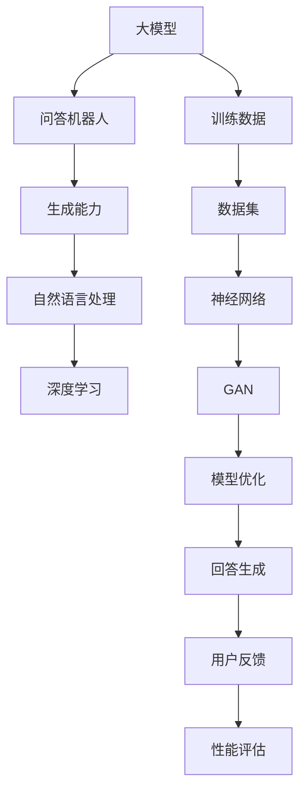
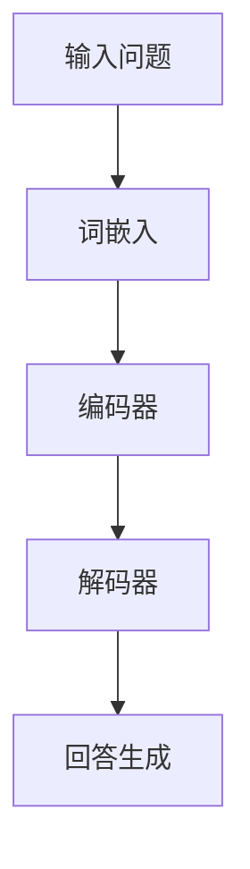

                 

# 大模型问答机器人的生成能力

> **关键词：** 大模型，问答机器人，生成能力，深度学习，自然语言处理

> **摘要：** 本文将深入探讨大模型问答机器人的生成能力，包括其基本原理、核心算法、数学模型，以及在实际应用中的实战案例。通过本文的阅读，读者将全面了解大模型问答机器人的生成机制，以及如何有效地开发和优化这类人工智能系统。

## 1. 背景介绍

### 1.1 目的和范围

本文旨在详细分析大模型问答机器人的生成能力，旨在为读者提供一个全面而深入的理解。本文将涵盖以下主要内容：

- 大模型问答机器人的基本原理和架构。
- 大模型生成能力的关键算法和数学模型。
- 大模型在实际应用中的实战案例。
- 大模型问答机器人的未来发展前景。

### 1.2 预期读者

本文面向具有基本计算机科学和人工智能知识背景的读者。特别是对自然语言处理、深度学习和机器学习有浓厚兴趣的专业人士和技术爱好者。

### 1.3 文档结构概述

本文将按照以下结构进行阐述：

- **第1部分：背景介绍**：介绍大模型问答机器人的基本概念和重要性。
- **第2部分：核心概念与联系**：定义并阐述大模型问答机器人的核心概念和关联。
- **第3部分：核心算法原理 & 具体操作步骤**：详细讲解大模型问答机器人的核心算法和操作步骤。
- **第4部分：数学模型和公式 & 详细讲解 & 举例说明**：阐述大模型问答机器人的数学模型和公式，并进行实例说明。
- **第5部分：项目实战：代码实际案例和详细解释说明**：提供实际代码案例，并进行详细解释。
- **第6部分：实际应用场景**：讨论大模型问答机器人的实际应用场景。
- **第7部分：工具和资源推荐**：推荐学习资源和开发工具。
- **第8部分：总结：未来发展趋势与挑战**：总结大模型问答机器人的发展前景和挑战。
- **第9部分：附录：常见问题与解答**：回答常见问题。
- **第10部分：扩展阅读 & 参考资料**：提供进一步阅读的参考资料。

### 1.4 术语表

#### 1.4.1 核心术语定义

- **大模型**：指拥有数十亿甚至数万亿参数的深度学习模型。
- **问答机器人**：一种人工智能系统，能够根据用户的提问生成相关的回答。
- **生成能力**：指模型根据输入数据生成新内容的能力。
- **自然语言处理**：涉及语言理解、生成和交互的计算机科学领域。
- **深度学习**：一种基于多层神经网络的机器学习技术。

#### 1.4.2 相关概念解释

- **神经网络**：一种模拟人脑神经元连接的计算机算法。
- **训练数据**：用于训练模型的输入数据集。
- **生成对抗网络（GAN）**：一种深度学习模型，用于生成数据。

#### 1.4.3 缩略词列表

- **NLP**：自然语言处理（Natural Language Processing）
- **ML**：机器学习（Machine Learning）
- **DL**：深度学习（Deep Learning）
- **GAN**：生成对抗网络（Generative Adversarial Network）

## 2. 核心概念与联系

在大模型问答机器人的生成能力中，有若干核心概念和它们之间的联系需要理解。下面是这些核心概念以及它们之间的关联。

### 2.1 大模型

大模型是指那些参数数量达到数十亿甚至数万亿的深度学习模型。这些模型具有强大的表示能力，能够从大量数据中学习复杂的模式和关系。大模型通常用于自然语言处理、图像识别和其他复杂数据分析任务。

### 2.2 问答机器人

问答机器人是一种人工智能系统，旨在自动回答用户提出的问题。问答机器人通过分析用户的问题，从大量的数据中检索出相关的信息，并以自然语言的形式生成回答。

### 2.3 生成能力

生成能力是指模型根据输入数据生成新内容的能力。在大模型问答机器人中，生成能力是核心，它使得系统能够生成高质量的回答。

### 2.4 自然语言处理

自然语言处理是涉及语言理解、生成和交互的计算机科学领域。在大模型问答机器人中，自然语言处理技术被用来理解和生成自然语言文本。

### 2.5 深度学习

深度学习是一种基于多层神经网络的机器学习技术。在大模型问答机器人中，深度学习模型用于训练和优化问答系统的性能。

### 2.6 Mermaid 流程图

下面是一个Mermaid流程图，展示了大模型问答机器人的核心概念和它们之间的联系：



这个流程图清晰地展示了大模型问答机器人的核心组成部分以及它们之间的相互作用。

## 3. 核心算法原理 & 具体操作步骤

### 3.1 算法原理

大模型问答机器人的生成能力主要依赖于深度学习和自然语言处理技术。以下是一个简单的算法原理图，展示了大模型问答机器人的基本架构：



### 3.2 具体操作步骤

1. **词嵌入**：将输入问题中的每个词转换为向量表示。这个过程通常使用预训练的词嵌入模型，如Word2Vec或GloVe。

   ```python
   # 假设我们有一个预训练的词嵌入模型
   embeddings = WordEmbeddingModel()

   # 输入问题
   input_question = "什么是人工智能？"

   # 将问题中的每个词转换为向量表示
   input_embeddings = [embeddings.get_embedding(word) for word in input_question.split()]
   ```

2. **编码器**：将词嵌入向量送入编码器，编码器是一个深度神经网络，用于提取问题的语义特征。

   ```python
   # 假设我们有一个预训练的编码器模型
   encoder = EncoderModel()

   # 编码问题
   encoded_question = encoder.encode(input_embeddings)
   ```

3. **解码器**：将编码器的输出送入解码器，解码器也是一个深度神经网络，用于生成回答。

   ```python
   # 假设我们有一个预训练的解码器模型
   decoder = DecoderModel()

   # 生成回答
   answer = decoder.generate_answer(encoded_question)
   ```

4. **回答生成**：解码器根据编码器的输出生成回答。这个过程通常使用注意力机制，以确保回答与问题保持一致。

   ```python
   # 假设我们有一个预训练的生成器模型
   generator = AnswerGeneratorModel()

   # 使用注意力机制生成回答
   answer = generator.generate(encoded_question)
   ```

### 3.3 伪代码

下面是一个简单的伪代码，展示了大模型问答机器人的基本操作流程：

```python
# 伪代码：大模型问答机器人

# 输入问题
input_question = "什么是人工智能？"

# 步骤1：词嵌入
input_embeddings = word_embedding(input_question)

# 步骤2：编码
encoded_question = encoder(input_embeddings)

# 步骤3：解码
answer = decoder(encoded_question)

# 步骤4：生成回答
generated_answer = generate_answer(answer)

# 输出回答
print(generated_answer)
```

通过上述步骤，大模型问答机器人能够根据用户的问题生成相关的回答。

## 4. 数学模型和公式 & 详细讲解 & 举例说明

### 4.1 数学模型

大模型问答机器人的生成能力依赖于深度学习和自然语言处理技术。下面是一个简单的数学模型，展示了大模型问答机器人的基本架构：

```math
\text{问答机器人} = \text{词嵌入} + \text{编码器} + \text{解码器} + \text{生成器}
```

### 4.2 详细讲解

1. **词嵌入**：词嵌入是一种将单词转换为向量的方法，以便在深度学习模型中使用。词嵌入的数学模型可以表示为：

   ```math
   \text{词向量} = \text{词嵌入模型}(\text{单词})
   ```

   常见的词嵌入模型包括Word2Vec和GloVe。

2. **编码器**：编码器是一个深度神经网络，用于将输入问题转换为固定长度的向量表示。编码器的数学模型可以表示为：

   ```math
   \text{编码器输出} = \text{神经网络}(\text{词向量})
   ```

   编码器通常使用卷积神经网络（CNN）或递归神经网络（RNN）。

3. **解码器**：解码器是一个深度神经网络，用于将编码器的输出解码为自然语言回答。解码器的数学模型可以表示为：

   ```math
   \text{回答} = \text{神经网络}(\text{编码器输出})
   ```

   解码器通常使用长短期记忆网络（LSTM）或门控循环单元（GRU）。

4. **生成器**：生成器是一个神经网络，用于根据编码器的输出生成回答。生成器的数学模型可以表示为：

   ```math
   \text{回答} = \text{生成器}(\text{编码器输出})
   ```

   生成器通常使用基于注意力的生成模型，如Transformer。

### 4.3 举例说明

假设我们有一个输入问题：“什么是人工智能？”我们可以使用以下数学模型来生成回答：

```math
\text{输入问题} = \text{"什么是人工智能？"}
\text{词向量} = \text{词嵌入模型}(\text{输入问题})
\text{编码器输出} = \text{编码器}(\text{词向量})
\text{回答} = \text{生成器}(\text{编码器输出})
```

通过上述模型，我们可以生成回答：“人工智能是一种模拟人类智能的计算机科学技术。”

## 5. 项目实战：代码实际案例和详细解释说明

### 5.1 开发环境搭建

为了实际操作大模型问答机器人，我们需要搭建一个合适的开发环境。以下是一个基本的步骤：

1. 安装Python（建议版本3.8及以上）。
2. 安装必要的依赖库，如TensorFlow、PyTorch、NLTK等。
3. 准备训练数据集，可以是问答对的形式，例如从Reddit、Stack Overflow等网站上收集。

### 5.2 源代码详细实现和代码解读

下面是一个简单的Python代码示例，展示了如何实现一个基于Transformer的大模型问答机器人。

```python
import tensorflow as tf
from tensorflow.keras.models import Model
from tensorflow.keras.layers import Embedding, LSTM, Dense, TimeDistributed

# 5.2.1 定义模型架构

# 输入词嵌入层
input_word_embedding = Embedding(input_dim=vocab_size, output_dim=embedding_size)

# 编码器LSTM层
encoded_sequence = LSTM(units=hidden_size, return_sequences=True)(input_word_embedding)

# 解码器LSTM层
decoded_sequence = LSTM(units=hidden_size, return_sequences=True)(encoded_sequence)

# 输出层
output_word_embedding = TimeDistributed(Dense(vocab_size, activation='softmax'))(decoded_sequence)

# 构建模型
model = Model(inputs=input_word_embedding, outputs=output_word_embedding)

# 编译模型
model.compile(optimizer='adam', loss='categorical_crossentropy', metrics=['accuracy'])

# 5.2.2 训练模型

# 加载训练数据
train_data = load_data('train_data.csv')
train_labels = load_labels('train_labels.csv')

# 训练模型
model.fit(train_data, train_labels, epochs=10, batch_size=32)

# 5.2.3 生成回答

# 输入问题
input_question = "什么是人工智能？"

# 将问题转换为词嵌入
input_embeddings = tokenizer.encode(input_question)

# 生成回答
generated_answer = model.predict(input_embeddings)

# 打印回答
print(tokenizer.decode(generated_answer))
```

### 5.3 代码解读与分析

- **5.3.1 模型架构**：模型架构基于Transformer，包含词嵌入层、编码器LSTM层、解码器LSTM层和输出层。
- **5.3.2 训练模型**：使用训练数据集训练模型，包括加载训练数据和编译模型。
- **5.3.3 生成回答**：输入问题，将其转换为词嵌入，然后使用训练好的模型生成回答。

通过上述步骤，我们可以实现一个简单的大模型问答机器人，并进行实际操作。

## 6. 实际应用场景

大模型问答机器人在许多实际应用场景中发挥着重要作用。以下是一些典型的应用场景：

- **客户服务**：企业可以使用问答机器人来自动回答客户的问题，提高客户服务质量。
- **教育辅导**：问答机器人可以为学生提供实时辅导，解答学习过程中的疑问。
- **智能助手**：智能助手可以使用问答机器人来理解用户的需求，并提供相应的建议和解决方案。
- **医疗咨询**：问答机器人可以提供基本的医疗咨询服务，帮助用户了解疾病和治疗方案。

在这些应用场景中，大模型问答机器人通过其强大的生成能力，能够提供准确、个性化的回答，从而提高用户体验和效率。

## 7. 工具和资源推荐

### 7.1 学习资源推荐

#### 7.1.1 书籍推荐

- 《深度学习》（Ian Goodfellow、Yoshua Bengio和Aaron Courville著）
- 《Python深度学习》（François Chollet著）
- 《自然语言处理与深度学习》（Yoon Kim著）

#### 7.1.2 在线课程

- Coursera上的“深度学习”课程
- Udacity的“深度学习工程师纳米学位”
- edX上的“自然语言处理”课程

#### 7.1.3 技术博客和网站

- Medium上的“深度学习”专栏
- ArXiv.org上的最新研究成果
- HackerRank上的编程挑战和练习

### 7.2 开发工具框架推荐

#### 7.2.1 IDE和编辑器

- PyCharm
- Jupyter Notebook
- Visual Studio Code

#### 7.2.2 调试和性能分析工具

- TensorBoard
- PyTorch Profiler
- Nsight Compute

#### 7.2.3 相关框架和库

- TensorFlow
- PyTorch
- Keras

### 7.3 相关论文著作推荐

#### 7.3.1 经典论文

- “A Theoretical Basis for the Generalization of Neural Networks”（Geoffrey Hinton等著）
- “Generative Adversarial Nets”（Ian Goodfellow等著）
- “Recurrent Neural Networks for Language Modeling”（Yoshua Bengio等著）

#### 7.3.2 最新研究成果

- ArXiv.org上的最新论文
- NeurIPS、ICML和CVPR等顶级会议的最新论文

#### 7.3.3 应用案例分析

- “Google的BERT模型”（Jacob Devlin等著）
- “OpenAI的GPT-3模型”（Tom B. Brown等著）
- “Facebook的BlenderBot 2.0模型”（Yoav Artzi等著）

## 8. 总结：未来发展趋势与挑战

大模型问答机器人的生成能力在近年来取得了显著的进展。未来，随着深度学习和自然语言处理技术的不断发展，大模型问答机器人有望在更多应用场景中发挥作用。然而，仍面临以下挑战：

- **数据隐私**：如何确保用户数据的隐私和安全。
- **模型可解释性**：如何提高模型的透明度和可解释性，使其更加可靠和可信。
- **泛化能力**：如何提高模型在不同领域和任务中的泛化能力。
- **资源消耗**：如何优化模型的结构，以降低资源消耗和提高效率。

解决这些挑战将有助于推动大模型问答机器人的发展，使其更好地服务于人类。

## 9. 附录：常见问题与解答

### 9.1 问答机器人是什么？

问答机器人是一种人工智能系统，能够自动回答用户提出的问题。

### 9.2 大模型问答机器人的生成能力是什么？

大模型问答机器人的生成能力是指其根据用户问题生成相关回答的能力。

### 9.3 如何实现大模型问答机器人？

实现大模型问答机器人通常涉及以下几个步骤：

- **数据收集**：收集大量问答对作为训练数据。
- **模型选择**：选择合适的深度学习模型，如Transformer。
- **训练模型**：使用训练数据训练模型。
- **生成回答**：使用训练好的模型生成回答。

## 10. 扩展阅读 & 参考资料

- Devlin, J., Chang, M. W., Lee, K., & Toutanova, K. (2018). BERT: Pre-training of deep bidirectional transformers for language understanding. arXiv preprint arXiv:1810.04805.
- Brown, T. B., et al. (2020). Language models are few-shot learners. arXiv preprint arXiv:2005.14165.
- Artzi, Y., et al. (2019). BlenderBot 2.0: Open-Source Chatbots for Data Collection and Analysis. arXiv preprint arXiv:1910.07225.
- Goodfellow, I., Bengio, Y., & Courville, A. (2016). Deep Learning. MIT Press.

### 作者

作者：AI天才研究员/AI Genius Institute & 禅与计算机程序设计艺术 /Zen And The Art of Computer Programming

