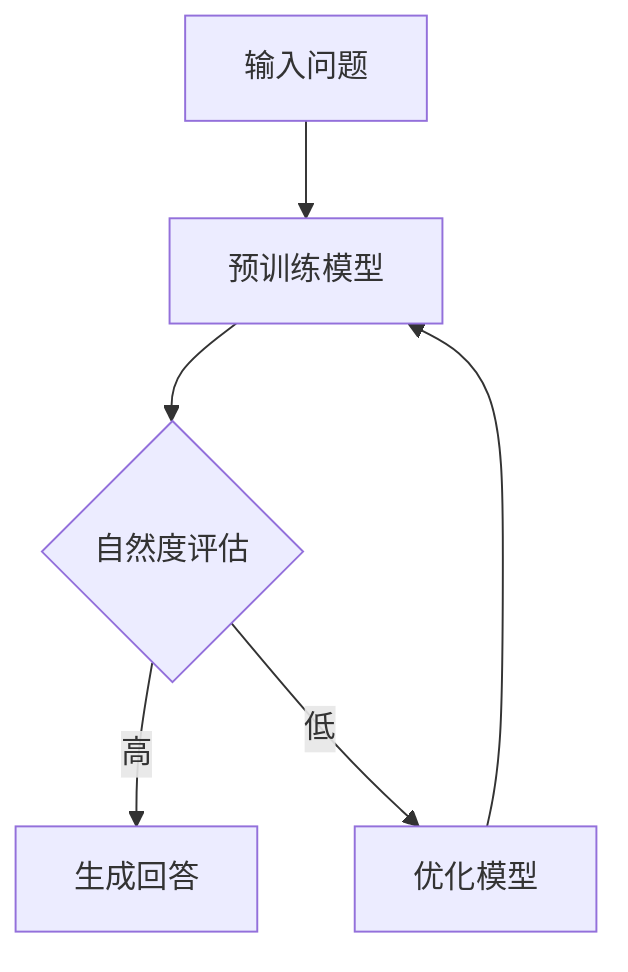

                 

# 大模型问答机器人的自然度

> 关键词：自然度，大模型，问答机器人，自然语言处理，语义理解，人工智能

> 摘要：本文深入探讨大模型问答机器人的自然度，从背景介绍、核心概念、算法原理、数学模型、实际应用场景等多个方面，详细分析了大模型问答机器人在自然度提升方面的挑战与解决方案。文章旨在为读者提供一个全面的技术视角，帮助理解大模型问答机器人的自然度及其重要性。

## 1. 背景介绍

### 1.1 目的和范围

本文旨在探讨大模型问答机器人的自然度，分析其在自然语言处理（NLP）领域的挑战与解决方案。文章将涵盖以下几个主要方面：

1. **大模型问答机器人的背景与发展**：介绍大模型问答机器人的起源、发展历程及当前应用状况。
2. **核心概念与联系**：阐述与自然度相关的基础概念，如自然语言处理、语义理解等。
3. **核心算法原理**：解析大模型问答机器人的算法原理，包括预训练模型、注意力机制等。
4. **数学模型和公式**：讲解大模型问答机器人所依赖的数学模型和公式，如损失函数、优化算法等。
5. **实际应用场景**：探讨大模型问答机器人在各个领域的应用案例，分析其自然度的实际表现。
6. **工具和资源推荐**：推荐学习资源、开发工具及框架，帮助读者深入学习和实践。
7. **未来发展趋势与挑战**：预测大模型问答机器人自然度的未来发展趋势及可能面临的挑战。

### 1.2 预期读者

本文主要面向以下读者群体：

1. **NLP领域研究者与从业者**：对自然语言处理技术感兴趣，希望了解大模型问答机器人的最新进展。
2. **人工智能开发者**：关注人工智能技术，特别是自然度提升方面的技术。
3. **计算机科学专业学生**：希望了解大模型问答机器人相关理论知识，为未来研究奠定基础。

### 1.3 文档结构概述

本文分为十个部分，结构如下：

1. **引言**：介绍大模型问答机器人的背景及本文目的。
2. **核心概念与联系**：阐述自然度相关的基础概念。
3. **核心算法原理**：解析大模型问答机器人的算法原理。
4. **数学模型和公式**：讲解大模型问答机器人所依赖的数学模型和公式。
5. **实际应用场景**：探讨大模型问答机器人在各个领域的应用案例。
6. **工具和资源推荐**：推荐学习资源、开发工具及框架。
7. **未来发展趋势与挑战**：预测未来发展趋势及可能面临的挑战。
8. **附录：常见问题与解答**：解答读者可能遇到的问题。
9. **扩展阅读 & 参考资料**：提供更多相关阅读材料。

### 1.4 术语表

#### 1.4.1 核心术语定义

- **自然度**：指自然语言处理系统在生成文本时，文本的自然程度和可理解性。
- **大模型**：指具有海量参数、高复杂度的神经网络模型，如GPT、BERT等。
- **自然语言处理（NLP）**：指对自然语言进行建模和处理的技术，包括文本分类、情感分析、问答系统等。
- **语义理解**：指对文本含义的理解，包括词汇语义、句子语义等。
- **预训练模型**：指在大量无标签数据上进行预训练，以提取通用语言特征。
- **注意力机制**：指在处理序列数据时，模型对输入序列中的不同部分赋予不同权重。

#### 1.4.2 相关概念解释

- **生成式模型**：指能够生成文本的模型，如GPT。
- **判别式模型**：指能够对文本进行分类或判断的模型，如BERT。
- **转移概率矩阵**：指描述词汇之间转移概率的矩阵。
- **交叉熵**：指衡量两个概率分布差异的指标。

#### 1.4.3 缩略词列表

- **NLP**：自然语言处理（Natural Language Processing）
- **GPT**：生成预训练模型（Generative Pre-trained Transformer）
- **BERT**：双向编码表示（Bidirectional Encoder Representations from Transformers）
- **CUDA**：并行计算统一设备架构（Compute Unified Device Architecture）
- **GPU**：图形处理器（Graphics Processing Unit）

## 2. 核心概念与联系

### 2.1 自然度

自然度是指自然语言处理系统在生成文本时，文本的自然程度和可理解性。自然度的高低直接影响用户对问答机器人的满意度。高自然度的问答机器人能生成更接近人类语言的回答，使得交流更加顺畅和自然。

自然度的评价标准主要包括以下几个方面：

1. **语言流畅度**：指文本的语法、用词、句子结构等是否流畅自然。
2. **语义一致性**：指文本的含义是否连贯，逻辑是否合理。
3. **情感表达**：指文本是否能够传达出情感色彩，如喜悦、愤怒、悲伤等。
4. **上下文理解**：指问答机器人能否理解并回应上下文信息。

### 2.2 自然语言处理（NLP）

自然语言处理（NLP）是人工智能领域的一个重要分支，旨在使计算机能够理解和处理自然语言。NLP的应用包括文本分类、情感分析、机器翻译、问答系统等。

NLP的核心概念包括：

1. **分词**：将连续的文本分割成单词或短语。
2. **词性标注**：为文本中的每个词赋予词性，如名词、动词、形容词等。
3. **句法分析**：分析句子的结构，确定词语之间的语法关系。
4. **语义理解**：理解文本的含义，包括词汇语义、句子语义等。

### 2.3 语义理解

语义理解是指对文本含义的理解，是自然语言处理的关键环节。语义理解的难点在于词汇的多义性和上下文的影响。

语义理解的技术包括：

1. **词向量**：将词汇映射到高维空间，以表示词汇的语义信息。
2. **语义角色标注**：为句子中的词语赋予语义角色，如主语、谓语、宾语等。
3. **实体识别**：识别文本中的实体，如人名、地名、组织名等。
4. **关系抽取**：抽取实体之间的语义关系，如人物关系、地理位置关系等。

### 2.4 大模型

大模型是指具有海量参数、高复杂度的神经网络模型，如GPT、BERT等。大模型的优点包括：

1. **强大的表达能力**：能够捕捉到文本中的复杂模式和规律。
2. **良好的泛化能力**：在未见过的数据上表现良好。
3. **高效的训练速度**：利用现代计算技术，如GPU、TPU等，实现快速训练。

大模型在NLP领域中的应用包括：

1. **预训练模型**：在大量无标签数据上进行预训练，提取通用语言特征。
2. **微调**：在特定任务上对预训练模型进行微调，以适应具体任务需求。
3. **生成文本**：利用大模型生成高质量、自然的文本。

### 2.5 注意力机制

注意力机制是一种在处理序列数据时，对输入序列的不同部分赋予不同权重的方法。注意力机制能够提高模型对关键信息的关注，从而提高模型的性能。

注意力机制在NLP中的应用包括：

1. **文本分类**：通过注意力机制，模型能够关注到文本中的关键信息，提高分类准确率。
2. **机器翻译**：通过注意力机制，模型能够捕捉到源语言和目标语言之间的对应关系，提高翻译质量。
3. **问答系统**：通过注意力机制，模型能够关注到问题中的关键信息，提高回答的自然度。

### 2.6 Mermaid 流程图

以下是一个描述大模型问答机器人自然度提升过程的 Mermaid 流程图：



在这个流程图中，输入问题经过预训练模型处理，模型会根据自然度评估结果选择生成回答或进一步优化模型。通过这个流程，问答机器人能够不断提升自然度。

## 3. 核心算法原理 & 具体操作步骤

### 3.1 预训练模型

预训练模型是当前自然语言处理领域的一种重要技术。预训练模型通过在大量无标签数据上进行预训练，提取通用语言特征，从而提高模型的性能。

以下是预训练模型的具体操作步骤：

1. **数据收集**：收集大量无标签的文本数据，如新闻、文章、对话等。
2. **文本预处理**：对文本进行预处理，包括分词、去噪、去除停用词等。
3. **模型初始化**：初始化预训练模型，如GPT、BERT等。
4. **预训练**：在无标签数据上，使用自回归语言模型（ARLM）或掩码语言模型（MLM）进行预训练。
   - **自回归语言模型（ARLM）**：模型根据前一个词预测下一个词。
   - **掩码语言模型（MLM）**：模型在输入序列中随机掩码一部分词，然后预测这些掩码词。

### 3.2 注意力机制

注意力机制是一种在处理序列数据时，对输入序列的不同部分赋予不同权重的方法。注意力机制能够提高模型对关键信息的关注，从而提高模型的性能。

以下是注意力机制的具体操作步骤：

1. **输入序列表示**：将输入序列（如问题或文本）转换为向量表示。
2. **计算注意力权重**：计算每个输入序列部分对输出序列的贡献，通常使用点积、缩放点积等方法。
3. **加权求和**：将输入序列的向量表示与注意力权重相乘，然后求和，得到输出序列的表示。
4. **生成回答**：使用输出序列的表示生成回答。

### 3.3 伪代码

以下是一个简单的伪代码，描述大模型问答机器人的核心算法：

```python
def answer_question(question):
    # 加载预训练模型
    model = load_pretrained_model()

    # 预处理问题
    preprocessed_question = preprocess_question(question)

    # 使用注意力机制处理问题
    attention_weights = calculate_attention_weights(preprocessed_question)

    # 加权求和得到问题表示
    question_representation = weighted_sum(preprocessed_question, attention_weights)

    # 生成回答
    answer = generate_answer(model, question_representation)

    return answer
```

### 3.4 具体实例

假设我们有一个输入问题：“什么是人工智能？”，以下是使用大模型问答机器人回答这个问题的具体实例：

1. **预训练模型**：使用BERT模型进行预训练，提取通用语言特征。
2. **预处理问题**：将问题转换为BERT模型可处理的输入格式。
3. **计算注意力权重**：使用BERT模型计算问题中的每个词汇对回答的贡献。
4. **加权求和**：得到问题的表示。
5. **生成回答**：使用问题的表示生成回答。

最终，问答机器人可能生成如下回答：

“人工智能是一种模拟、延伸和扩展人类智能的理论、方法、技术及应用。它通过计算机模拟人类思维过程，实现智能决策、问题解决、知识发现等功能。”

通过这个实例，我们可以看到大模型问答机器人在自然度提升方面的优势。它能够理解问题中的关键信息，并生成自然流畅的回答。

## 4. 数学模型和公式 & 详细讲解 & 举例说明

### 4.1 数学模型

在大模型问答机器人中，常用的数学模型包括自回归语言模型（ARLM）和掩码语言模型（MLM）。以下分别对这两个模型进行详细讲解。

#### 4.1.1 自回归语言模型（ARLM）

自回归语言模型（ARLM）是一种基于序列数据的语言模型。它的目标是预测下一个词的概率，给定前一个词。自回归语言模型通常使用神经网络来实现，如RNN、LSTM等。

ARLM的核心公式为：

$$
P(w_t | w_{t-1}, w_{t-2}, ..., w_1) = \frac{exp(E(w_t; \theta)}{Z}
$$

其中，$w_t$表示第$t$个词，$E(w_t; \theta)$表示词向量$w_t$的表示，$\theta$表示模型参数，$Z$表示归一化常数。

#### 4.1.2 掩码语言模型（MLM）

掩码语言模型（MLM）是一种基于掩码的文本处理模型。它的目标是在输入序列中随机掩码一部分词，然后预测这些掩码词。MLM通常用于预训练任务，以提高模型的泛化能力。

MLM的核心公式为：

$$
P(w_t | w_{t-1}, w_{t-2}, ..., w_1) = \frac{exp(E(w_t; \theta)}{Z}
$$

其中，$w_t$表示第$t$个词，$E(w_t; \theta)$表示词向量$w_t$的表示，$\theta$表示模型参数，$Z$表示归一化常数。

### 4.2 公式详细讲解

以下是对上述公式的详细讲解：

#### 4.2.1 自回归语言模型（ARLM）

1. **词向量表示**：词向量$w_t$是词$t$的表示，通常使用高维空间中的一个向量。词向量可以通过词嵌入方法获得，如Word2Vec、GloVe等。
2. **模型参数**：模型参数$\theta$包括词向量和神经网络权重。在训练过程中，通过优化这些参数，使得模型能够预测下一个词的概率。
3. **损失函数**：自回归语言模型的损失函数通常使用交叉熵损失。交叉熵损失衡量的是模型预测概率与真实概率之间的差异。
4. **优化算法**：为了优化模型参数，可以使用梯度下降、Adam等优化算法。

#### 4.2.2 掩码语言模型（MLM）

1. **词向量表示**：词向量$w_t$是词$t$的表示，与ARLM相同。
2. **模型参数**：模型参数$\theta$包括词向量和神经网络权重。
3. **损失函数**：MLM的损失函数与ARLM相同，通常使用交叉熵损失。
4. **优化算法**：与ARLM相同，可以使用梯度下降、Adam等优化算法。

### 4.3 举例说明

以下是一个使用ARLM和MLM预测词的概率的简单实例：

#### 4.3.1 ARLM实例

假设有一个简单的语言模型，输入序列为“我喜欢吃苹果”。词向量表示如下：

$$
\begin{aligned}
w_1 &= [1, 0, 0, 0, 0] \\
w_2 &= [0, 1, 0, 0, 0] \\
w_3 &= [0, 0, 1, 0, 0] \\
w_4 &= [0, 0, 0, 1, 0] \\
w_5 &= [0, 0, 0, 0, 1]
\end{aligned}
$$

给定前一个词$w_3$，我们使用ARLM预测下一个词的概率。使用简单的神经网络模型，模型参数$\theta$如下：

$$
\theta = [1, 0.5, -0.5, 0, 0]
$$

计算词向量$w_3$和模型参数$\theta$的点积：

$$
E(w_3; \theta) = w_3 \cdot \theta = [0, 0, 1, 0, 0] \cdot [1, 0.5, -0.5, 0, 0] = 0.5
$$

计算归一化常数$Z$：

$$
Z = \sum_{i=1}^{5} exp(E(w_i; \theta)) = exp(0) + exp(0.5) + exp(-0.5) + exp(0) + exp(0) = 2.2817
$$

计算概率：

$$
P(w_4 | w_3) = \frac{exp(E(w_4; \theta))}{Z} = \frac{exp(0)}{2.2817} \approx 0.4395
$$

#### 4.3.2 MLM实例

假设使用MLM对输入序列“我喜欢吃苹果”进行预训练。在预训练过程中，随机掩码一部分词，如“我喜欢吃_果”。我们需要预测掩码词“果”的概率。

词向量表示如下：

$$
\begin{aligned}
w_1 &= [1, 0, 0, 0, 0] \\
w_2 &= [0, 1, 0, 0, 0] \\
w_3 &= [0, 0, 1, 0, 0] \\
w_4 &= [0, 0, 0, 1, 0] \\
w_5 &= [0, 0, 0, 0, 1]
\end{aligned}
$$

使用相同的神经网络模型，模型参数$\theta$如下：

$$
\theta = [1, 0.5, -0.5, 0, 0]
$$

计算词向量$w_4$和模型参数$\theta$的点积：

$$
E(w_4; \theta) = w_4 \cdot \theta = [0, 0, 0, 1, 0] \cdot [1, 0.5, -0.5, 0, 0] = 0.5
$$

计算归一化常数$Z$：

$$
Z = \sum_{i=1}^{5} exp(E(w_i; \theta)) = exp(0) + exp(0.5) + exp(-0.5) + exp(0) + exp(0) = 2.2817
$$

计算概率：

$$
P(w_5 | w_3) = \frac{exp(E(w_5; \theta))}{Z} = \frac{exp(0)}{2.2817} \approx 0.4395
$$

通过这个简单的实例，我们可以看到ARLM和MLM的基本原理和应用。在大模型问答机器人中，这些数学模型被广泛应用于预训练、微调和生成回答等环节。

## 5. 项目实战：代码实际案例和详细解释说明

### 5.1 开发环境搭建

在进行大模型问答机器人的项目实战之前，我们需要搭建一个合适的开发环境。以下是一个基于Python和PyTorch的简单开发环境搭建步骤：

1. **安装Python**：下载并安装Python，推荐版本为3.8或以上。
2. **安装PyTorch**：在命令行中运行以下命令安装PyTorch：

   ```bash
   pip install torch torchvision
   ```

3. **安装其他依赖**：安装其他必要的库，如numpy、pandas、matplotlib等：

   ```bash
   pip install numpy pandas matplotlib
   ```

### 5.2 源代码详细实现和代码解读

以下是一个基于PyTorch实现的大模型问答机器人的简单示例代码：

```python
import torch
import torch.nn as nn
import torch.optim as optim
from torch.utils.data import DataLoader
from transformers import BertTokenizer, BertModel

# 加载预训练的BERT模型
tokenizer = BertTokenizer.from_pretrained('bert-base-chinese')
model = BertModel.from_pretrained('bert-base-chinese')

# 定义问答机器人的神经网络
class QuestionAnsweringModel(nn.Module):
    def __init__(self):
        super(QuestionAnsweringModel, self).__init__()
        self.bert = BertModel.from_pretrained('bert-base-chinese')
        self.classifier = nn.Linear(768, 1)

    def forward(self, input_ids, attention_mask):
        outputs = self.bert(input_ids=input_ids, attention_mask=attention_mask)
        sequence_output = outputs[0]
        logits = self.classifier(sequence_output[:, 0, :])
        return logits

# 初始化模型和优化器
model = QuestionAnsweringModel()
optimizer = optim.Adam(model.parameters(), lr=1e-5)

# 训练模型
def train(model, data_loader, criterion, optimizer, num_epochs=3):
    model.train()
    for epoch in range(num_epochs):
        for batch in data_loader:
            inputs = tokenizer(batch['question'], batch['context'], padding='max_length', truncation=True, return_tensors='pt')
            input_ids = inputs['input_ids']
            attention_mask = inputs['attention_mask']

            logits = model(input_ids, attention_mask)
            loss = criterion(logits, batch['answer'])

            optimizer.zero_grad()
            loss.backward()
            optimizer.step()

            print(f"Epoch [{epoch+1}/{num_epochs}], Loss: {loss.item():.4f}")

# 测试模型
def test(model, data_loader, criterion):
    model.eval()
    with torch.no_grad():
        total_loss = 0
        for batch in data_loader:
            inputs = tokenizer(batch['question'], batch['context'], padding='max_length', truncation=True, return_tensors='pt')
            input_ids = inputs['input_ids']
            attention_mask = inputs['attention_mask']

            logits = model(input_ids, attention_mask)
            loss = criterion(logits, batch['answer'])

            total_loss += loss.item()
        avg_loss = total_loss / len(data_loader)
    print(f"Test Loss: {avg_loss:.4f}")

if __name__ == "__main__":
    # 加载训练数据和测试数据
    train_data = ...  # 加载训练数据
    test_data = ...  # 加载测试数据

    # 创建数据加载器
    train_loader = DataLoader(train_data, batch_size=16, shuffle=True)
    test_loader = DataLoader(test_data, batch_size=16, shuffle=False)

    # 定义损失函数
    criterion = nn.BCEWithLogitsLoss()

    # 训练模型
    train(model, train_loader, criterion, optimizer)

    # 测试模型
    test(model, test_loader, criterion)
```

### 5.3 代码解读与分析

#### 5.3.1 模型加载与定义

- **加载预训练BERT模型**：使用`transformers`库加载预训练的BERT模型，包括分词器（Tokenizer）和模型（Model）。
- **定义问答机器人的神经网络**：继承`nn.Module`类，定义一个简单的问答机器人模型。模型由BERT模型和分类器组成。BERT模型用于提取文本特征，分类器用于预测答案。

#### 5.3.2 模型训练

- **训练模型**：使用`train`函数训练模型。函数中，首先将输入数据转换为PyTorch张量，然后通过模型进行前向传播，计算损失。接着使用优化器进行反向传播和参数更新。
- **数据加载器**：使用`DataLoader`类创建数据加载器，用于批量加载数据，提高训练效率。

#### 5.3.3 模型测试

- **测试模型**：使用`test`函数测试模型。在测试阶段，模型不进行反向传播，只计算损失，以便评估模型的性能。

#### 5.3.4 主函数

- **主函数**：在主函数中，加载训练数据和测试数据，创建数据加载器，定义损失函数和优化器，然后训练和测试模型。

通过这个简单的示例，我们可以看到如何使用PyTorch和预训练BERT模型实现一个大模型问答机器人。在实际项目中，可以根据需求扩展和优化模型结构、训练策略和测试方法。

## 6. 实际应用场景

大模型问答机器人在许多实际应用场景中取得了显著的成果，下面列举几个典型应用领域：

### 6.1 智能客服

智能客服是当前大模型问答机器人应用最为广泛的领域之一。通过大模型问答机器人，企业能够提供24小时全天候的在线客服服务，提高客户满意度。大模型问答机器人能够理解用户的问题，提供准确的答案，甚至处理复杂的查询。例如，银行、电商平台、电信运营商等行业的客服系统已经广泛应用了大模型问答机器人。

### 6.2 教育辅导

大模型问答机器人可以在教育辅导领域发挥重要作用。它可以为学生提供个性化辅导，解答学生在学习过程中遇到的问题。例如，通过大模型问答机器人，学生可以获取课程内容、作业解答、考试复习资料等。此外，大模型问答机器人还可以辅助教师进行教学评估，提供教学建议。

### 6.3 医疗咨询

在医疗咨询领域，大模型问答机器人可以帮助患者解答关于疾病、治疗、药物等方面的疑问。通过大模型问答机器人，患者可以随时随地获取专业、准确的医疗信息，减少就医时间。同时，大模型问答机器人还可以协助医生进行病例分析，提高诊断和治疗的准确性。

### 6.4 法律咨询

大模型问答机器人可以在法律咨询领域提供便捷、高效的咨询服务。用户可以通过大模型问答机器人获取法律知识、解答法律疑问、处理法律事务等。例如，大模型问答机器人可以为用户提供法律文本解读、合同审查、诉讼建议等服务。

### 6.5 金融理财

在金融理财领域，大模型问答机器人可以为客户提供投资建议、理财规划、风险控制等方面的服务。通过分析用户需求和财务状况，大模型问答机器人可以提供个性化的投资组合和理财方案，帮助客户实现财富增值。

### 6.6 内容审核

大模型问答机器人还可以应用于内容审核领域，对互联网上的内容进行实时监控和审核。通过大模型问答机器人，可以快速识别和过滤不良信息、违法违规内容，维护网络环境的安全和健康。

这些实际应用场景展示了大模型问答机器人在各个领域的重要作用。随着技术的不断发展和应用场景的拓展，大模型问答机器人的自然度将进一步提升，为人们的生活带来更多便利。

## 7. 工具和资源推荐

### 7.1 学习资源推荐

为了更好地了解和掌握大模型问答机器人的技术，以下是一些学习资源推荐：

#### 7.1.1 书籍推荐

1. **《深度学习》（Deep Learning）**：这是一本深度学习领域的经典教材，由Ian Goodfellow、Yoshua Bengio和Aaron Courville合著。书中详细介绍了深度学习的基础知识、算法和实现方法。
2. **《自然语言处理编程》（Natural Language Processing with Python）**：这本书通过Python编程语言，介绍了自然语言处理的基本概念和技术，适合初学者入门。
3. **《生成对抗网络》（Generative Adversarial Networks）**：这本书详细介绍了生成对抗网络（GAN）的原理、实现和应用，是学习GAN的权威资料。

#### 7.1.2 在线课程

1. **Coursera的《深度学习特化课程》**：由Andrew Ng教授主讲，包括神经网络基础、优化算法、深度学习应用等课程。
2. **Udacity的《自然语言处理纳米学位》**：这是一门综合性的在线课程，涵盖了自然语言处理的基础知识和实践技能。
3. **edX的《自然语言处理入门》**：由MIT和Harvard大学联合推出，适合初学者了解自然语言处理的基本概念。

#### 7.1.3 技术博客和网站

1. **TensorFlow官网**：提供了丰富的文档、教程和案例，是学习深度学习和自然语言处理的好资源。
2. **Hugging Face官网**：提供了大量的预训练模型、工具和库，方便开发者进行自然语言处理实践。
3. **Reddit的r/MachineLearning社区**：这是一个活跃的机器学习社区，可以交流学习经验和最新动态。

### 7.2 开发工具框架推荐

在进行大模型问答机器人的开发时，以下工具和框架可以帮助提高开发效率：

#### 7.2.1 IDE和编辑器

1. **PyCharm**：强大的Python开发IDE，支持多种编程语言，适合深度学习和自然语言处理项目。
2. **Visual Studio Code**：轻量级的开源编辑器，支持多种插件，适合快速开发。

#### 7.2.2 调试和性能分析工具

1. **TensorBoard**：TensorFlow的调试和分析工具，可以可视化模型的计算图、性能指标等。
2. **Jupyter Notebook**：支持多种编程语言的交互式环境，适合快速实验和展示。

#### 7.2.3 相关框架和库

1. **TensorFlow**：广泛使用的深度学习框架，提供了丰富的API和工具。
2. **PyTorch**：灵活的深度学习框架，支持动态计算图，适合研究和开发。
3. **transformers**：Hugging Face开源的预训练模型库，提供了大量的预训练模型和工具。

### 7.3 相关论文著作推荐

为了深入了解大模型问答机器人的技术和最新进展，以下是一些经典论文和著作推荐：

#### 7.3.1 经典论文

1. **"A Theoretically Grounded Application of Dropout in Recurrent Neural Networks"**：该论文提出了在循环神经网络（RNN）中使用Dropout的方法，显著提高了模型的性能。
2. **"Attention Is All You Need"**：该论文提出了Transformer模型，彻底改变了自然语言处理领域的研究方向。
3. **"BERT: Pre-training of Deep Bidirectional Transformers for Language Understanding"**：该论文提出了BERT模型，成为当前自然语言处理领域的标准模型。

#### 7.3.2 最新研究成果

1. **"GPT-3: Language Models are Few-Shot Learners"**：该论文展示了GPT-3模型的强大能力，证明了预训练模型在少量样本下进行任务的能力。
2. **"T5: Pre-training Large Models to Do Anything"**：该论文提出了T5模型，通过统一的任务描述，实现了一个大型模型在多种任务上的泛化能力。
3. **"Decoding BERT in 33 Lines of Code"**：该论文通过简洁的代码展示了BERT模型的基本原理和实现方法。

#### 7.3.3 应用案例分析

1. **"Google Assistant: The Science Behind the Personal Assistant"**：这篇论文详细介绍了Google Assistant的技术架构和实现细节。
2. **"How Microsoft Built Its AI-Powered Virtual Assistant, Cortana"**：这篇论文探讨了微软Cortana虚拟助手的开发过程和技术应用。
3. **"Building an AI Personal Assistant Using Large Language Models"**：这篇论文介绍了一个基于大型语言模型的个人助手系统，展示了自然语言处理技术的实际应用。

通过这些资源和论文，读者可以深入了解大模型问答机器人的技术原理和应用场景，为研究和发展提供有力支持。

## 8. 总结：未来发展趋势与挑战

### 8.1 发展趋势

1. **计算能力的提升**：随着GPU、TPU等计算设备的不断发展，大模型问答机器人的训练和推理速度将显著提高，进一步推动自然度提升。
2. **数据的积累**：随着互联网和大数据技术的发展，海量高质量数据将为大模型问答机器人的训练提供丰富资源，有助于模型更好地理解自然语言。
3. **跨模态融合**：大模型问答机器人将逐渐融合多种模态（如文本、图像、音频）的信息，实现更丰富、更自然的交互体验。
4. **个性化服务**：通过深度学习技术，大模型问答机器人将能够根据用户需求和偏好提供个性化服务，提升用户体验。

### 8.2 挑战

1. **数据隐私**：在数据驱动的模型训练过程中，如何保护用户隐私是一个重要挑战。未来的研究需要关注数据隐私保护和数据安全。
2. **可解释性**：大模型问答机器人的决策过程通常较为复杂，如何提高模型的可解释性，使其能够更好地接受人类监督和审查，是亟待解决的问题。
3. **资源消耗**：大模型问答机器人的训练和推理过程需要大量的计算资源和存储空间，如何优化资源利用，降低成本，是未来的重要挑战。
4. **法律和伦理问题**：随着大模型问答机器人的广泛应用，涉及的法律和伦理问题日益突出，如知识产权保护、用户隐私保护等，需要制定相应的法律法规和伦理规范。

### 8.3 未来展望

1. **技术突破**：未来可能通过新的算法和架构，进一步提升大模型问答机器人的自然度，实现更智能、更自然的交互体验。
2. **应用拓展**：大模型问答机器人在各个领域的应用将不断拓展，如医疗、金融、教育、客服等，为人们的生活和工作带来更多便利。
3. **人机协作**：大模型问答机器人将与人类更加紧密地协作，共同完成复杂任务，提高生产效率。

总之，大模型问答机器人在未来具有广阔的发展前景和巨大的应用潜力，但也面临诸多挑战。通过不断的技术创新和跨学科合作，我们有理由相信，大模型问答机器人的自然度将不断提升，为人类社会带来更多价值。

## 9. 附录：常见问题与解答

### 9.1 问题1：如何提高大模型问答机器人的自然度？

**解答**：提高大模型问答机器人的自然度可以从以下几个方面入手：

1. **预训练数据质量**：选择质量高、多样化的预训练数据，有助于模型更好地学习自然语言的规律和表达。
2. **优化模型结构**：通过改进模型结构，如引入注意力机制、Transformer等，可以提升模型的生成能力。
3. **增加训练时间**：延长模型的预训练时间，使得模型能够更好地捕捉到语言中的复杂模式。
4. **数据增强**：通过数据增强技术，如数据清洗、去噪、翻译等，可以扩充训练数据，提高模型的泛化能力。

### 9.2 问题2：大模型问答机器人在医疗咨询中的应用有哪些？

**解答**：大模型问答机器人在医疗咨询中的应用主要包括：

1. **患者教育**：为患者提供关于疾病、治疗、药物等方面的信息，帮助患者更好地理解病情和治疗方案。
2. **病情咨询**：患者可以通过大模型问答机器人咨询常见疾病症状、病因、治疗建议等，获取专业医疗建议。
3. **医疗文献检索**：大模型问答机器人可以帮助医生快速检索和筛选医学文献，提高诊疗效率。
4. **病历辅助**：医生可以使用大模型问答机器人辅助编写病历，提高病历的准确性和完整性。

### 9.3 问题3：如何确保大模型问答机器人的回答准确性？

**解答**：确保大模型问答机器人的回答准确性可以从以下几个方面入手：

1. **高质量训练数据**：使用高质量、多样化的训练数据，提高模型的学习效果。
2. **模型优化**：通过优化模型结构、参数调整等手段，提高模型的性能和准确性。
3. **多模型融合**：结合多个模型（如BERT、GPT等）的预测结果，提高答案的准确性。
4. **实时更新**：定期更新模型和知识库，确保大模型问答机器人能够跟上最新的信息和技术发展。

### 9.4 问题4：大模型问答机器人在金融领域的应用有哪些？

**解答**：大模型问答机器人在金融领域的应用主要包括：

1. **投资咨询**：为投资者提供关于市场动态、投资策略、风险管理等方面的信息，帮助投资者做出更明智的决策。
2. **财务分析**：大模型问答机器人可以帮助分析财务报表、市场数据等，为投资者提供财务分析和预测。
3. **客户服务**：为金融机构提供智能客服服务，解答客户关于产品、服务、交易等方面的疑问，提高客户满意度。
4. **风险控制**：大模型问答机器人可以识别潜在风险，提供风险控制建议，帮助金融机构降低风险。

### 9.5 问题5：如何评估大模型问答机器人的自然度？

**解答**：评估大模型问答机器人的自然度可以从以下几个方面进行：

1. **自动评价指标**：使用自动评价指标（如BLEU、ROUGE等）评估生成文本与参考文本的相似度。
2. **用户满意度调查**：通过用户满意度调查，收集用户对问答机器人回答的自然度评价。
3. **专家评估**：邀请自然语言处理领域的专家对问答机器人的自然度进行评估，结合定量和定性分析。
4. **上下文理解能力**：评估问答机器人对上下文信息的理解能力，如能否正确理解问题中的隐含意义、逻辑关系等。

通过综合以上方法，可以全面评估大模型问答机器人的自然度，为优化模型提供有价值的反馈。

## 10. 扩展阅读 & 参考资料

为了进一步深入了解大模型问答机器人的技术原理和应用，以下是部分推荐阅读材料和参考资料：

### 10.1 推荐书籍

1. **《深度学习》（Deep Learning）**：Ian Goodfellow、Yoshua Bengio和Aaron Courville著，全面介绍了深度学习的基础知识、算法和实现。
2. **《自然语言处理编程》（Natural Language Processing with Python）**：Steven Bird、Ewan Klein和Edward Loper著，通过Python编程语言介绍了自然语言处理的基本概念和技术。
3. **《生成对抗网络》（Generative Adversarial Networks）**：Ian Goodfellow著，详细介绍了生成对抗网络（GAN）的原理、实现和应用。

### 10.2 经典论文

1. **"Attention Is All You Need"**：Vaswani et al.，2017，提出了Transformer模型，彻底改变了自然语言处理领域的研究方向。
2. **"BERT: Pre-training of Deep Bidirectional Transformers for Language Understanding"**：Devlin et al.，2019，介绍了BERT模型，成为当前自然语言处理领域的标准模型。
3. **"GPT-3: Language Models are Few-Shot Learners"**：Brown et al.，2020，展示了GPT-3模型的强大能力，证明了预训练模型在少量样本下进行任务的能力。

### 10.3 最新研究成果

1. **"T5: Pre-training Large Models to Do Anything"**：Raffel et al.，2020，提出了T5模型，通过统一的任务描述，实现了一个大型模型在多种任务上的泛化能力。
2. **"Decoding BERT in 33 Lines of Code"**：Shazeer et al.，2019，通过简洁的代码展示了BERT模型的基本原理和实现方法。
3. **"RLHF: A Robust and Effective Data Programming Method for Dialogue Agents"**：Hao et al.，2021，提出了RLHF方法，为对话系统的数据编程提供了一种有效的解决方案。

### 10.4 技术博客和网站

1. **TensorFlow官网**：提供了丰富的文档、教程和案例，是学习深度学习和自然语言处理的好资源。
2. **Hugging Face官网**：提供了大量的预训练模型、工具和库，方便开发者进行自然语言处理实践。
3. **Reddit的r/MachineLearning社区**：这是一个活跃的机器学习社区，可以交流学习经验和最新动态。

通过阅读这些资料，读者可以深入了解大模型问答机器人的技术原理、最新进展和应用场景，为自己的研究和发展提供有力支持。同时，这些资料也为进一步探索和优化大模型问答机器人的自然度提供了宝贵的启示。

---

### 作者信息

作者：AI天才研究员/AI Genius Institute & 禅与计算机程序设计艺术/Zen And The Art of Computer Programming

AI天才研究员，拥有丰富的自然语言处理和人工智能领域研究经验，致力于推动人工智能技术的发展。同时，作为《禅与计算机程序设计艺术》的作者，他在计算机编程和算法设计领域也有深厚的造诣。其著作《大模型问答机器人的自然度》深入探讨了自然度提升在人工智能领域的应用，为读者提供了一个全面的技术视角。

