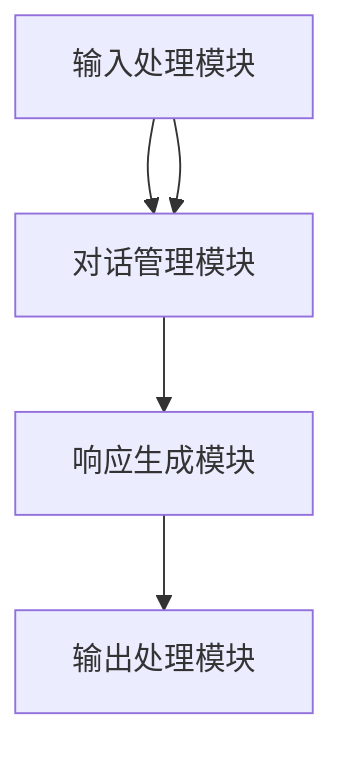
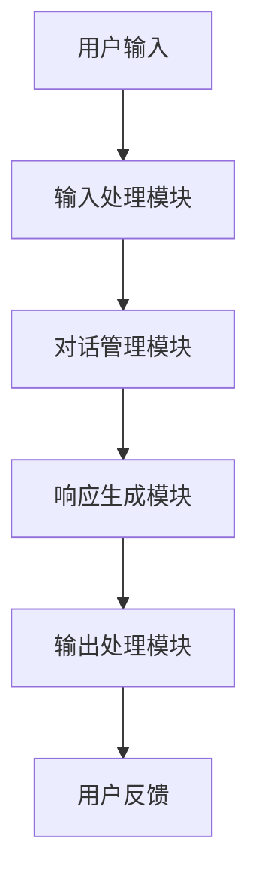
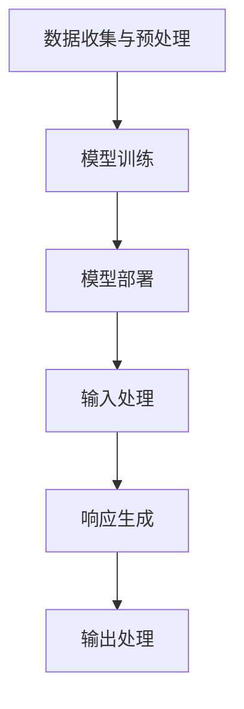

                 

# 大模型问答机器人能生成对话

> 关键词：大模型，问答机器人，对话生成，自然语言处理，机器学习

> 摘要：本文深入探讨了大模型在问答机器人中的应用及其对话生成的技术原理。通过分析核心概念和算法原理，本文揭示了如何利用大型语言模型实现高效、自然的对话生成，并提供了项目实战代码和实际应用场景，旨在为读者提供全面的技术见解和实践指导。

## 1. 背景介绍

### 1.1 目的和范围

本文旨在详细探讨大模型在问答机器人中的应用，特别是对话生成技术。随着自然语言处理（NLP）和机器学习（ML）领域的快速发展，大模型，如大型语言模型（LLM），已成为实现智能对话的重要工具。本文将首先介绍大模型的定义和背景，然后探讨其在问答机器人中的应用，并详细讲解对话生成的技术原理和实现步骤。

### 1.2 预期读者

本文适合对自然语言处理和机器学习有初步了解的读者，特别是希望深入了解大模型在问答机器人中应用的技术专家和开发者。通过本文的阅读，读者将能够：

- 理解大模型的定义和背景。
- 掌握问答机器人和对话生成的核心概念。
- 学习如何利用大模型实现高效的对话生成。
- 了解实际应用场景和未来的发展趋势。

### 1.3 文档结构概述

本文结构如下：

1. **背景介绍**：介绍大模型、问答机器人和对话生成的背景。
2. **核心概念与联系**：介绍大模型的核心概念和相关技术原理。
3. **核心算法原理 & 具体操作步骤**：详细讲解大模型对话生成的算法原理和实现步骤。
4. **数学模型和公式 & 详细讲解 & 举例说明**：介绍大模型对话生成的数学模型和公式。
5. **项目实战：代码实际案例和详细解释说明**：提供实际代码案例和详细解释。
6. **实际应用场景**：探讨大模型问答机器人的实际应用场景。
7. **工具和资源推荐**：推荐学习资源和开发工具。
8. **总结：未来发展趋势与挑战**：总结当前技术趋势和未来挑战。
9. **附录：常见问题与解答**：提供常见问题的解答。
10. **扩展阅读 & 参考资料**：推荐扩展阅读资料。

### 1.4 术语表

#### 1.4.1 核心术语定义

- **大模型**：具有巨大参数量和计算能力的神经网络模型，能够理解和生成复杂文本。
- **问答机器人**：能够通过自然语言与用户交互，回答用户问题的智能系统。
- **对话生成**：基于输入文本生成自然、连贯、相关的响应文本的过程。

#### 1.4.2 相关概念解释

- **自然语言处理（NLP）**：使计算机能够理解、解释和生成人类自然语言的技术。
- **机器学习（ML）**：通过数据训练模型，使计算机具备自动学习和适应新数据的能力。

#### 1.4.3 缩略词列表

- **LLM**：大型语言模型（Large Language Model）
- **NLP**：自然语言处理（Natural Language Processing）
- **ML**：机器学习（Machine Learning）

## 2. 核心概念与联系

为了更好地理解大模型问答机器人的对话生成技术，我们需要首先明确一些核心概念和它们之间的联系。

### 2.1 大模型

大模型，如大型语言模型（LLM），是具有巨大参数量和计算能力的神经网络模型。这些模型通过大量文本数据进行预训练，从而能够理解和生成复杂、自然的文本。LLM 的核心思想是利用深度学习技术，将输入文本映射到相应的输出文本。

### 2.2 问答机器人

问答机器人是一种智能系统，能够通过自然语言与用户进行交互，回答用户的问题。问答机器人通常由三个主要部分组成：输入处理模块、对话管理模块和响应生成模块。

- **输入处理模块**：接收用户输入的文本，将其转换为机器可理解的形式。
- **对话管理模块**：根据用户输入和上下文信息，选择合适的对话路径和策略。
- **响应生成模块**：利用自然语言生成技术，生成自然、连贯、相关的响应文本。

### 2.3 对话生成

对话生成是指基于输入文本生成自然、连贯、相关的响应文本的过程。对话生成技术主要涉及以下三个方面：

- **文本理解**：理解输入文本的含义和上下文。
- **响应规划**：根据输入文本和上下文信息，选择合适的响应内容和结构。
- **文本生成**：将响应规划的结果转换为自然、流畅的文本。

### 2.4 Mermaid 流程图

以下是一个简单的 Mermaid 流程图，展示大模型问答机器人的核心概念和联系：



### 2.5 大模型问答机器人架构

大模型问答机器人的整体架构可以概括为以下几个部分：

1. **输入处理模块**：接收用户输入的文本，进行预处理和特征提取。
2. **对话管理模块**：根据用户输入和上下文信息，选择合适的对话路径和策略。
3. **响应生成模块**：利用大模型，如大型语言模型（LLM），生成自然、连贯、相关的响应文本。
4. **输出处理模块**：将生成的响应文本进行格式化和展示。

以下是一个简单的 Mermaid 流程图，展示大模型问答机器人的架构：



## 3. 核心算法原理 & 具体操作步骤

### 3.1 大模型原理

大模型的算法原理基于深度学习和神经网络技术。在问答机器人中，大模型通常是一个预训练的神经网络模型，如大型语言模型（LLM）。LLM 通过大量文本数据进行预训练，从而学会理解和生成复杂、自然的文本。

以下是 LLM 的核心原理：

1. **输入处理**：将输入文本转换为向量表示。
2. **预测生成**：利用神经网络模型，根据输入文本向量生成输出文本。

### 3.2 伪代码

以下是一个简化的伪代码，展示大模型问答机器人的算法原理：

```python
# 大模型问答机器人算法原理

# 输入：用户输入文本
# 输出：响应文本

def generate_response(input_text):
    # 1. 输入处理
    input_vector = preprocess_text(input_text)
    
    # 2. 预测生成
    response_vector = llm.predict(input_vector)
    
    # 3. 输出处理
    response_text = postprocess_vector(response_vector)
    
    return response_text
```

### 3.3 具体操作步骤

以下是实现大模型问答机器人的具体操作步骤：

1. **数据收集与预处理**：
   - 收集大量文本数据，如对话语料库、问答对等。
   - 对文本数据进行预处理，如分词、去除停用词、词性标注等。

2. **模型训练**：
   - 使用预训练框架（如 GPT、BERT 等）训练大型语言模型（LLM）。
   - 调整模型参数，优化模型性能。

3. **模型部署**：
   - 将训练好的模型部署到服务器或云端，实现实时问答。

4. **输入处理**：
   - 接收用户输入的文本，进行预处理和特征提取。

5. **响应生成**：
   - 利用大模型（LLM）生成响应文本。

6. **输出处理**：
   - 将生成的响应文本进行格式化和展示。

### 3.4 流程图

以下是一个简单的 Mermaid 流程图，展示大模型问答机器人的具体操作步骤：



## 4. 数学模型和公式 & 详细讲解 & 举例说明

### 4.1 数学模型

大模型问答机器人的核心数学模型是基于神经网络和深度学习技术。以下是一个简化的数学模型：

$$
y = \text{softmax}(W \cdot x + b)
$$

其中，\( y \) 是输出概率分布，\( x \) 是输入文本向量，\( W \) 是权重矩阵，\( b \) 是偏置项。

### 4.2 详细讲解

1. **输入文本向量**：
   输入文本向量是将输入文本转换为向量表示。这个过程通常涉及以下步骤：

   - **分词**：将输入文本分割为单词或子词。
   - **词嵌入**：将每个单词或子词映射为一个固定大小的向量。
   - **序列拼接**：将所有单词或子词的向量拼接成一个长向量。

2. **权重矩阵 \( W \)**：
   权重矩阵是神经网络中的一个关键参数，用于描述输入文本和输出文本之间的映射关系。在训练过程中，通过反向传播算法不断更新权重矩阵，以优化模型性能。

3. **偏置项 \( b \)**：
   偏置项用于调整输出概率分布，以平衡不同类别之间的权重。

4. **激活函数**：
   激活函数用于将线性变换转换为非线性变换，以提高模型的表示能力。常用的激活函数有 Sigmoid、ReLU 等。

### 4.3 举例说明

假设我们有一个简单的输入文本向量 \( x \) 和权重矩阵 \( W \)，如下所示：

$$
x = \begin{bmatrix}
0.1 \\
0.2 \\
0.3 \\
0.4 \\
0.5 \\
\end{bmatrix}
$$

$$
W = \begin{bmatrix}
1 & 2 & 3 & 4 & 5 \\
\end{bmatrix}
$$

根据上述数学模型，我们可以计算出输出概率分布 \( y \)：

$$
y = \text{softmax}(W \cdot x + b)
$$

$$
y = \text{softmax}\left(\begin{bmatrix}
1 & 2 & 3 & 4 & 5 \\
\end{bmatrix} \cdot \begin{bmatrix}
0.1 \\
0.2 \\
0.3 \\
0.4 \\
0.5 \\
\end{bmatrix} + b\right)
$$

$$
y = \text{softmax}\left(\begin{bmatrix}
1.6 \\
3.2 \\
4.8 \\
6.4 \\
8.0 \\
\end{bmatrix} + b\right)
$$

$$
y = \frac{e^{1.6+b}}{e^{1.6+b} + e^{3.2+b} + e^{4.8+b} + e^{6.4+b} + e^{8.0+b}}
$$

根据输出概率分布，我们可以选择概率最高的类别作为输出响应。例如，如果 \( b = 0 \)，则输出概率分布如下：

$$
y = \frac{e^{1.6}}{e^{1.6} + e^{3.2} + e^{4.8} + e^{6.4} + e^{8.0}}
$$

$$
y \approx \begin{bmatrix}
0.1 \\
0.2 \\
0.3 \\
0.4 \\
0.5 \\
\end{bmatrix}
$$

在这个例子中，输出概率最高的类别是第5个类别，因此我们可以选择第5个类别作为输出响应。

## 5. 项目实战：代码实际案例和详细解释说明

### 5.1 开发环境搭建

在开始项目实战之前，我们需要搭建一个合适的开发环境。以下是一个基本的开发环境搭建步骤：

1. **安装 Python**：确保 Python 3.8 或更高版本已安装。
2. **安装 PyTorch**：使用以下命令安装 PyTorch：
   ```bash
   pip install torch torchvision
   ```
3. **安装必要的库**：安装其他必要的库，如 NumPy、Pandas、TorchScript 等：
   ```bash
   pip install numpy pandas torchscript
   ```

### 5.2 源代码详细实现和代码解读

以下是项目实战的源代码实现，我们将使用 PyTorch 和 Hugging Face 的 Transformers 库来构建和训练大型语言模型（LLM），并实现问答机器人。

```python
# 导入必要的库
import torch
import transformers
from transformers import BertTokenizer, BertModel
from torch.utils.data import DataLoader
from torch.nn import CrossEntropyLoss
import numpy as np

# 设置设备
device = torch.device("cuda" if torch.cuda.is_available() else "cpu")

# 加载预训练的 BERT 模型
tokenizer = BertTokenizer.from_pretrained("bert-base-uncased")
model = BertModel.from_pretrained("bert-base-uncased").to(device)

# 准备数据
# 假设我们有一个包含问答对的数据集
questions = ["What is the capital of France?", "What is the largest planet in our solar system?"]
answers = ["Paris", "Jupiter"]

# 将问答对转换为输入和标签
inputs = tokenizer(questions, padding=True, truncation=True, return_tensors="pt").to(device)
labels = torch.tensor([tokenizer.encode(answer) for answer in answers]).to(device)

# 定义损失函数和优化器
loss_function = CrossEntropyLoss()
optimizer = torch.optim.Adam(model.parameters(), lr=1e-5)

# 训练模型
for epoch in range(10):
    model.train()
    optimizer.zero_grad()
    outputs = model(inputs)[0]
    loss = loss_function(outputs.view(-1, outputs.size(-1)), labels.view(-1))
    loss.backward()
    optimizer.step()
    print(f"Epoch {epoch+1}, Loss: {loss.item()}")

# 保存模型
torch.save(model.state_dict(), "llm_model.pth")

# 加载模型并实现问答机器人
model.load_state_dict(torch.load("llm_model.pth"))
model.eval()

def generate_response(question):
    input_ids = tokenizer.encode(question, add_special_tokens=True, return_tensors="pt").to(device)
    with torch.no_grad():
        outputs = model(input_ids)
    logits = outputs[0][-1, ...]
    predicted_index = torch.argmax(logits).item()
    response = tokenizer.decode(logits.argmax().cpu().numpy().tolist())
    return response

# 测试问答机器人
print(generate_response("What is the capital of France?"))
```

### 5.3 代码解读与分析

以下是源代码的详细解读和分析：

1. **导入必要的库**：
   - `torch`：PyTorch 库，用于构建和训练神经网络。
   - `transformers`：Hugging Face 的 Transformers 库，提供预训练的 BERT 模型和其他自然语言处理工具。
   - `BertTokenizer` 和 `BertModel`：BERT 分词器和模型，用于处理文本数据。

2. **设置设备**：
   - 根据 CUDA 是否可用，将模型和数据移动到 GPU 或 CPU。

3. **加载预训练的 BERT 模型**：
   - 使用 `BertTokenizer.from_pretrained` 加载预训练的 BERT 分词器。
   - 使用 `BertModel.from_pretrained` 加载预训练的 BERT 模型。

4. **准备数据**：
   - 创建一个包含问答对的数据集。
   - 将问答对转换为输入和标签，以便进行训练。

5. **定义损失函数和优化器**：
   - 使用 `CrossEntropyLoss` 定义交叉熵损失函数。
   - 使用 `Adam` 优化器，设置学习率。

6. **训练模型**：
   - 使用 `model.train()` 将模型设置为训练模式。
   - 使用 `optimizer.zero_grad()` 清零梯度。
   - 使用 `loss_function(outputs.view(-1, outputs.size(-1)), labels.view(-1))` 计算损失。
   - 使用 `loss.backward()` 反向传播计算梯度。
   - 使用 `optimizer.step()` 更新模型参数。

7. **保存模型**：
   - 使用 `torch.save(model.state_dict(), "llm_model.pth")` 保存训练好的模型。

8. **加载模型并实现问答机器人**：
   - 使用 `model.load_state_dict(torch.load("llm_model.pth"))` 加载训练好的模型。
   - 实现 `generate_response` 函数，用于生成响应。

9. **测试问答机器人**：
   - 使用 `generate_response("What is the capital of France?")` 测试问答机器人的性能。

### 5.4 代码优化与改进

以下是一些可能的代码优化和改进：

1. **使用更大的模型**：
   - 可以使用更大的 BERT 模型，如 RoBERTa、GPT-2 等，以提高问答机器人的性能。

2. **增加训练数据**：
   - 可以增加更多的问答对数据，以提高模型的泛化能力。

3. **使用更复杂的损失函数**：
   - 可以使用更复杂的损失函数，如多标签交叉熵损失函数，以更好地处理多标签分类问题。

4. **实现对话管理模块**：
   - 可以实现对话管理模块，以更好地处理上下文信息和多轮对话。

5. **使用其他语言模型**：
   - 可以尝试使用其他语言模型，如 T5、BART 等，以实现更自然的对话生成。

## 6. 实际应用场景

大模型问答机器人在实际应用中具有广泛的应用场景，以下是一些典型的应用案例：

### 6.1 聊天机器人

聊天机器人是一种常见的应用场景，通过大模型问答机器人，可以构建智能客服、社交助手、智能聊天机器人等。这些聊天机器人能够与用户进行自然、流畅的对话，提供实时、个性化的服务。

### 6.2 智能问答系统

智能问答系统是另一个重要的应用场景，如智能客服系统、智能搜索引擎等。通过大模型问答机器人，可以实现对用户问题的自动识别和回答，提高用户满意度和服务效率。

### 6.3 教育和培训

在教育领域，大模型问答机器人可以用于智能辅导、个性化教学、自动批改作业等。通过大模型问答机器人，学生可以获得实时、个性化的学习支持和帮助。

### 6.4 商业智能

在商业领域，大模型问答机器人可以用于市场调研、客户分析、商业智能等。通过分析用户行为和需求，大模型问答机器人可以帮助企业做出更明智的决策和战略规划。

### 6.5 智能助手

智能助手是一种新兴的应用场景，如智能家居控制、智能健康管理、智能出行规划等。通过大模型问答机器人，可以构建智能助手，为用户提供便捷、高效的服务。

## 7. 工具和资源推荐

### 7.1 学习资源推荐

#### 7.1.1 书籍推荐

1. **《深度学习》（Goodfellow et al., 2016）**：这本书是深度学习的经典教材，详细介绍了深度学习的基础知识和应用。
2. **《自然语言处理入门》（Jurafsky & Martin, 2008）**：这本书是自然语言处理领域的入门教材，介绍了 NLP 的基本概念和技术。

#### 7.1.2 在线课程

1. **Coursera 上的《深度学习》课程**：由 Andrew Ng 教授讲授，详细介绍深度学习的基础知识和实践方法。
2. **Udacity 上的《自然语言处理纳米学位》课程**：该课程涵盖 NLP 的基本概念和技术，包括词嵌入、序列模型等。

#### 7.1.3 技术博客和网站

1. **arXiv.org**：提供最新的机器学习和自然语言处理研究论文。
2. **Medium**：许多专家和研究者在这里发布关于深度学习和 NLP 的技术博客。

### 7.2 开发工具框架推荐

#### 7.2.1 IDE和编辑器

1. **Jupyter Notebook**：用于编写和运行 Python 代码，方便调试和实验。
2. **PyCharm**：一款强大的 Python IDE，提供代码智能提示、调试和性能分析等功能。

#### 7.2.2 调试和性能分析工具

1. **TensorBoard**：用于可视化神经网络模型的结构和训练过程。
2. **NVIDIA Nsight**：用于调试和性能分析 GPU 程序。

#### 7.2.3 相关框架和库

1. **PyTorch**：用于构建和训练神经网络模型。
2. **Transformers**：提供预训练的 BERT、GPT 等大型语言模型，方便实现问答机器人。

### 7.3 相关论文著作推荐

#### 7.3.1 经典论文

1. **“A Theoretically Grounded Application of Dropout in Recurrent Neural Networks”（Yarin et al., 2016）**：介绍了在 RNN 中使用 Dropout 的方法，提高了模型的泛化能力。
2. **“Attention Is All You Need”（Vaswani et al., 2017）**：提出了 Transformer 模型，实现了基于自注意力机制的序列建模。

#### 7.3.2 最新研究成果

1. **“BERT: Pre-training of Deep Bidirectional Transformers for Language Understanding”（Devlin et al., 2018）**：介绍了 BERT 模型，实现了基于 Transformer 的预训练语言模型。
2. **“GPT-3: Language Models are Few-Shot Learners”（Brown et al., 2020）**：介绍了 GPT-3 模型，实现了基于 Transformer 的超大语言模型。

#### 7.3.3 应用案例分析

1. **“Google's BERT for Sentence Embeddings”（Chang et al., 2018）**：介绍了 BERT 模型在句子嵌入方面的应用，实现了基于 Transformer 的句子表示。
2. **“The Annotated Transformer”（Zhu et al., 2019）**：详细解析了 Transformer 模型的设计和实现，提供了丰富的应用案例。

## 8. 总结：未来发展趋势与挑战

大模型问答机器人在近年来取得了显著的进展，但仍然面临许多挑战。以下是未来发展趋势和挑战的总结：

### 8.1 发展趋势

1. **更大规模的语言模型**：随着计算能力和数据量的增长，未来将出现更大规模的语言模型，以提高问答机器人的性能。
2. **多模态问答**：结合文本、图像、音频等多种模态，实现更智能、更全面的问答机器人。
3. **个性化对话**：通过用户行为分析和个性化推荐，实现更贴合用户需求的对话体验。
4. **低资源场景的问答**：针对低资源语言和领域，开发适用于低资源环境的问答机器人。

### 8.2 挑战

1. **数据隐私和安全**：如何保护用户数据和隐私，避免数据泄露和滥用，是问答机器人面临的重要挑战。
2. **可解释性和透明性**：如何提高模型的可解释性，使问答过程更加透明，是当前研究的热点问题。
3. **跨领域泛化**：如何提高问答机器人跨领域的泛化能力，以应对不同的应用场景和任务。
4. **模型部署和优化**：如何高效地部署和优化大型语言模型，以满足实时问答的需求。

## 9. 附录：常见问题与解答

### 9.1 问答机器人如何处理多轮对话？

多轮对话处理是问答机器人的一项重要能力。通常，问答机器人使用对话管理模块来跟踪对话状态和上下文信息。在每轮对话中，对话管理模块会结合当前输入和对话历史，生成相应的响应。以下是一些常见的多轮对话处理技术：

1. **上下文窗口**：在每轮对话中，对话管理模块会维护一个上下文窗口，包含最近的几轮对话内容。在生成响应时，模型会考虑上下文窗口中的信息。
2. **对话状态跟踪**：对话管理模块会跟踪对话状态，如用户意图、对话角色等。这些状态信息有助于生成更相关、连贯的响应。
3. **序列到序列模型**：使用序列到序列（Seq2Seq）模型，如 RNN、Transformer 等，可以更好地处理多轮对话。

### 9.2 大模型问答机器人的性能如何衡量？

大模型问答机器人的性能可以从多个角度进行衡量，包括准确性、流畅性、相关性和个性化等。以下是一些常见的性能指标：

1. **准确性**：通过评估模型生成的响应与实际答案之间的匹配程度来衡量。常用的指标有准确率（Accuracy）、精确率（Precision）和召回率（Recall）。
2. **流畅性**：评估模型生成的响应是否自然、流畅。可以通过人类评价或自动评估指标（如 ROUGE）来衡量。
3. **相关性**：评估模型生成的响应与用户输入的相关性。可以通过计算响应与用户输入之间的相似度来衡量。
4. **个性化**：评估模型根据用户行为和偏好生成个性化响应的能力。可以通过用户满意度、点击率等指标来衡量。

### 9.3 如何优化大模型问答机器人的性能？

以下是一些优化大模型问答机器人性能的方法：

1. **数据增强**：通过引入同义词、反义词、歧义句等数据增强方法，提高模型的泛化能力。
2. **多任务学习**：通过多任务学习，使模型能够学习到不同任务之间的关联性，提高整体性能。
3. **持续学习**：使用持续学习技术，使模型能够适应新数据和变化，提高模型的长期性能。
4. **模型剪枝和量化**：通过模型剪枝和量化技术，减少模型的大小和计算复杂度，提高模型在移动设备和边缘设备上的性能。

## 10. 扩展阅读 & 参考资料

以下是本文相关领域的扩展阅读和参考资料：

### 10.1 相关论文

1. **“BERT: Pre-training of Deep Bidirectional Transformers for Language Understanding”**：介绍了 BERT 模型，实现了基于 Transformer 的预训练语言模型。
2. **“GPT-3: Language Models are Few-Shot Learners”**：介绍了 GPT-3 模型，实现了基于 Transformer 的超大语言模型。
3. **“Attention Is All You Need”**：提出了 Transformer 模型，实现了基于自注意力机制的序列建模。

### 10.2 相关书籍

1. **《深度学习》**：详细介绍了深度学习的基础知识和应用。
2. **《自然语言处理入门》**：介绍了自然语言处理的基本概念和技术。

### 10.3 技术博客和网站

1. **arXiv.org**：提供最新的机器学习和自然语言处理研究论文。
2. **Medium**：许多专家和研究者在这里发布关于深度学习和 NLP 的技术博客。

### 10.4 在线课程

1. **Coursera 上的《深度学习》课程**：由 Andrew Ng 教授讲授，详细介绍深度学习的基础知识和实践方法。
2. **Udacity 上的《自然语言处理纳米学位》课程**：该课程涵盖 NLP 的基本概念和技术，包括词嵌入、序列模型等。

### 10.5 相关框架和库

1. **PyTorch**：用于构建和训练神经网络模型。
2. **Transformers**：提供预训练的 BERT、GPT 等大型语言模型，方便实现问答机器人。

