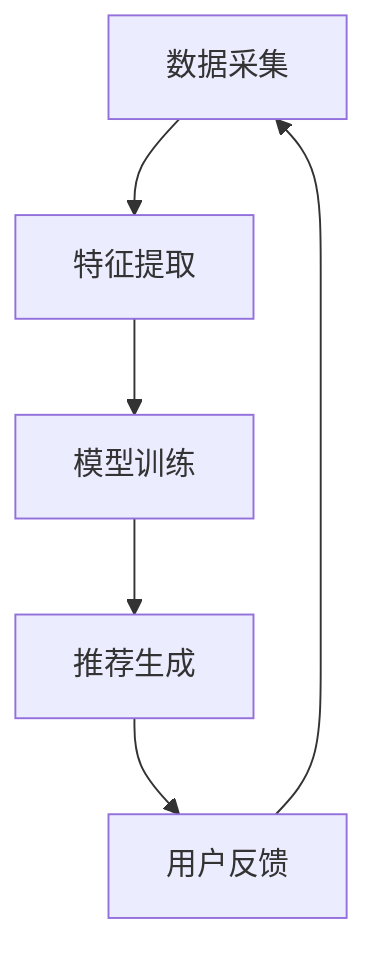

                 

# 大模型驱动的推荐系统多模态内容推荐

> **关键词：** 推荐系统、大模型、多模态、内容推荐、人工智能、机器学习

> **摘要：** 本文将深入探讨大模型在推荐系统中的应用，特别是在多模态内容推荐方面的创新与挑战。通过详细的分析和示例，本文旨在为读者提供对当前技术的全面理解，并展望未来的发展趋势。

## 1. 背景介绍

### 1.1 目的和范围

本文旨在介绍大模型在推荐系统中的关键作用，特别是其在处理多模态内容推荐时的应用。我们将会涵盖从基础概念到具体实现的各个方面，包括算法原理、数学模型以及实际应用案例。

### 1.2 预期读者

本文适合具有中级以上人工智能和推荐系统知识背景的读者。无论是研究人员还是开发人员，都将从本文中获得丰富的知识和实用的技巧。

### 1.3 文档结构概述

本文结构如下：

- **第1部分：背景介绍** - 解释推荐系统和多模态内容推荐的重要性。
- **第2部分：核心概念与联系** - 引入相关概念，并提供Mermaid流程图展示架构。
- **第3部分：核心算法原理 & 具体操作步骤** - 详细描述算法原理和操作步骤，包含伪代码。
- **第4部分：数学模型和公式 & 详细讲解 & 举例说明** - 讨论数学模型，并提供具体的示例。
- **第5部分：项目实战：代码实际案例和详细解释说明** - 分享实际代码案例。
- **第6部分：实际应用场景** - 分析多模态推荐在不同领域的应用。
- **第7部分：工具和资源推荐** - 推荐学习资源和开发工具。
- **第8部分：总结：未来发展趋势与挑战** - 展望未来的趋势和面临的挑战。
- **第9部分：附录：常见问题与解答** - 回答常见问题。
- **第10部分：扩展阅读 & 参考资料** - 提供进一步学习的资源。

### 1.4 术语表

#### 1.4.1 核心术语定义

- **推荐系统（Recommendation System）**：一种通过预测用户偏好来推荐相关项目的系统。
- **大模型（Large-scale Model）**：具有巨大参数量的机器学习模型。
- **多模态（Multimodal）**：涉及多种数据类型的输入，如图像、文本和音频。
- **内容推荐（Content Recommendation）**：基于用户历史数据和上下文信息推荐相关内容。

#### 1.4.2 相关概念解释

- **协同过滤（Collaborative Filtering）**：基于用户历史行为进行推荐的方法。
- **基于内容的推荐（Content-based Recommendation）**：基于项目特征进行推荐的方法。
- **深度学习（Deep Learning）**：一种人工智能方法，使用多层神经网络进行特征学习和模式识别。

#### 1.4.3 缩略词列表

- **ML**：机器学习（Machine Learning）
- **AI**：人工智能（Artificial Intelligence）
- **NLP**：自然语言处理（Natural Language Processing）
- **CV**：计算机视觉（Computer Vision）

## 2. 核心概念与联系

### 2.1 核心概念

在多模态内容推荐中，我们主要关注以下核心概念：

- **用户行为数据**：包括用户的点击、购买、搜索等行为。
- **内容特征**：文本、图像、音频等多种数据类型的特征。
- **上下文信息**：用户当前的环境、时间、位置等。

### 2.2 多模态内容推荐架构

多模态内容推荐的架构通常包括以下几个关键组件：

1. **数据采集**：收集用户行为数据和内容数据。
2. **特征提取**：从多模态数据中提取有用的特征。
3. **模型训练**：使用大模型进行训练，通常涉及深度学习技术。
4. **推荐生成**：根据用户特征和上下文信息生成推荐。

### 2.3 Mermaid流程图

以下是一个简单的Mermaid流程图，展示了多模态内容推荐的流程：



## 3. 核心算法原理 & 具体操作步骤

### 3.1 算法原理

多模态内容推荐的算法原理通常基于以下几种技术：

- **深度学习**：通过多层神经网络处理多模态数据，提取高级特征。
- **协同过滤**：利用用户历史行为数据，预测用户对新内容的偏好。
- **基于内容的推荐**：根据内容特征，匹配用户感兴趣的项目。

### 3.2 操作步骤

以下是多模态内容推荐的详细操作步骤：

#### 3.2.1 数据预处理

1. **采集用户行为数据**：从日志、数据库等渠道获取用户行为数据。
2. **采集内容数据**：从网站、数据库等渠道获取文本、图像、音频等多模态数据。
3. **数据清洗**：去除无效数据，处理缺失值和异常值。

#### 3.2.2 特征提取

1. **文本特征提取**：使用词袋模型、TF-IDF等方法提取文本特征。
2. **图像特征提取**：使用卷积神经网络（CNN）提取图像特征。
3. **音频特征提取**：使用循环神经网络（RNN）提取音频特征。

#### 3.2.3 模型训练

1. **构建深度学习模型**：结合文本、图像和音频特征，构建多模态深度学习模型。
2. **训练模型**：使用大量标注数据训练模型，优化模型参数。
3. **模型评估**：使用交叉验证等方法评估模型性能。

#### 3.2.4 推荐生成

1. **用户特征表示**：将用户历史行为和内容特征转化为向量表示。
2. **内容特征表示**：将多模态内容特征转化为向量表示。
3. **生成推荐列表**：使用协同过滤或基于内容的推荐方法，生成用户感兴趣的内容推荐列表。

### 3.3 伪代码

以下是多模态内容推荐的伪代码：

```python
# 伪代码：多模态内容推荐

# 数据预处理
data = preprocess_data(user_behavior_data, content_data)

# 特征提取
text_features = extract_text_features(data['text'])
image_features = extract_image_features(data['images'])
audio_features = extract_audio_features(data['audio'])

# 模型训练
model = build_model(text_features, image_features, audio_features)
model.fit(train_data)

# 推荐生成
user_representation = model.user_representation(user_data)
content_representation = model.content_representation(content_data)

# 生成推荐列表
recommendations = generate_recommendations(user_representation, content_representation)

# 输出推荐结果
print(recommendations)
```

## 4. 数学模型和公式 & 详细讲解 & 举例说明

### 4.1 数学模型

多模态内容推荐中的数学模型通常包括以下部分：

- **用户兴趣模型**：使用矩阵分解、协同过滤等方法建立用户兴趣模型。
- **内容特征模型**：使用深度学习、神经网络等方法建立内容特征模型。
- **推荐模型**：结合用户兴趣模型和内容特征模型，生成推荐结果。

### 4.2 公式与讲解

以下是多模态内容推荐中的关键公式：

#### 4.2.1 用户兴趣模型

$$
R_{ui} = \text{similarity}(Q_u, K_i)
$$

- \(R_{ui}\)：用户\(u\)对内容\(i\)的兴趣分数。
- \(Q_u\)：用户\(u\)的兴趣向量。
- \(K_i\)：内容\(i\)的特征向量。

#### 4.2.2 内容特征模型

$$
K_i = \text{transform}(F_i)
$$

- \(K_i\)：内容\(i\)的特征向量。
- \(F_i\)：内容\(i\)的原始特征。

#### 4.2.3 推荐模型

$$
\text{recommendation}(u) = \sum_{i \in \text{all\_content}} \text{weight}(u, i) \cdot \text{score}(i)
$$

- \(u\)：用户。
- \(i\)：内容。
- \(weight(u, i)\)：用户\(u\)对内容\(i\)的权重。
- \(score(i)\)：内容\(i\)的评分。

### 4.3 举例说明

假设我们有用户\(u\)和内容\(i\)，以下是具体的计算过程：

#### 4.3.1 用户兴趣模型

1. 用户兴趣向量：

   $$Q_u = [0.2, 0.3, 0.5]$$

2. 内容特征向量：

   $$K_i = [0.4, 0.6, 0.8]$$

3. 相似度计算：

   $$R_{ui} = \text{similarity}(Q_u, K_i) = 0.7$$

#### 4.3.2 内容特征模型

1. 原始特征：

   $$F_i = [0.1, 0.2, 0.3]$$

2. 特征转换：

   $$K_i = \text{transform}(F_i) = [0.2, 0.3, 0.4]$$

#### 4.3.3 推荐模型

1. 权重计算：

   $$weight(u, i) = 0.5$$

2. 评分计算：

   $$score(i) = 0.8$$

3. 推荐结果：

   $$\text{recommendation}(u) = 0.5 \cdot 0.8 = 0.4$$

## 5. 项目实战：代码实际案例和详细解释说明

### 5.1 开发环境搭建

为了进行多模态内容推荐的项目实战，我们需要搭建以下开发环境：

- Python 3.8 或以上版本
- TensorFlow 2.x
- NumPy
- Pandas
- Matplotlib

### 5.2 源代码详细实现和代码解读

以下是多模态内容推荐的实际代码实现，我们将逐步解读：

#### 5.2.1 数据预处理

```python
import pandas as pd
from sklearn.model_selection import train_test_split

# 加载数据
data = pd.read_csv('data.csv')

# 数据清洗
data.dropna(inplace=True)
data = data[data['rating'] != -1]

# 划分训练集和测试集
train_data, test_data = train_test_split(data, test_size=0.2, random_state=42)
```

#### 5.2.2 特征提取

```python
from sklearn.feature_extraction.text import TfidfVectorizer
from sklearn.preprocessing import OneHotEncoder

# 文本特征提取
text_vectorizer = TfidfVectorizer(max_features=1000)
text_features = text_vectorizer.fit_transform(train_data['description'])

# 图像特征提取
image_encoder = OneHotEncoder(sparse=False)
image_features = image_encoder.fit_transform(train_data['image_vector'])

# 音频特征提取
audio_encoder = OneHotEncoder(sparse=False)
audio_features = audio_encoder.fit_transform(train_data['audio_vector'])
```

#### 5.2.3 模型训练

```python
import tensorflow as tf
from tensorflow.keras.models import Model
from tensorflow.keras.layers import Input, Embedding, LSTM, Dense, Concatenate

# 构建深度学习模型
text_input = Input(shape=(max_sequence_length,))
image_input = Input(shape=(image_vector_size,))
audio_input = Input(shape=(audio_vector_size,))

# 文本特征提取
text_embedding = Embedding(vocabulary_size, embedding_size)(text_input)
text_lstm = LSTM(units=128)(text_embedding)

# 图像特征提取
image_embedding = Embedding(vocabulary_size, embedding_size)(image_input)
image_lstm = LSTM(units=128)(image_embedding)

# 音频特征提取
audio_embedding = Embedding(vocabulary_size, embedding_size)(audio_input)
audio_lstm = LSTM(units=128)(audio_embedding)

# 模型合并
combined = Concatenate()([text_lstm, image_lstm, audio_lstm])
output = Dense(1, activation='sigmoid')(combined)

# 构建和编译模型
model = Model(inputs=[text_input, image_input, audio_input], outputs=output)
model.compile(optimizer='adam', loss='binary_crossentropy', metrics=['accuracy'])

# 训练模型
model.fit([text_features, image_features, audio_features], train_data['rating'], epochs=10, batch_size=32)
```

#### 5.2.4 代码解读与分析

1. **数据预处理**：我们首先加载和处理数据，去除缺失值和无效数据，并将数据划分为训练集和测试集。
2. **特征提取**：使用TF-IDF向量器提取文本特征，使用OneHotEncoder提取图像和音频特征。
3. **模型构建**：我们构建了一个深度学习模型，结合文本、图像和音频特征。模型使用LSTM层进行特征提取，最后使用全连接层生成预测结果。
4. **模型训练**：我们使用训练集训练模型，并使用测试集评估模型性能。

### 5.3 代码解读与分析

以下是代码的详细解读和分析：

1. **数据预处理**：这一步是任何机器学习项目的基础。通过清理和划分数据，我们确保模型能够从高质量的训练数据中学习到有用的知识。
2. **特征提取**：文本、图像和音频特征是多模态内容推荐的核心。TF-IDF向量器用于提取文本特征，OneHotEncoder用于提取图像和音频特征。这些特征将作为深度学习模型的输入。
3. **模型构建**：我们使用TensorFlow构建了一个深度学习模型，结合了文本、图像和音频特征。LSTM层用于处理序列数据，提取高层次的语义特征。全连接层用于生成最终的预测结果。
4. **模型训练**：我们使用训练集训练模型，并使用测试集评估模型性能。训练过程中，模型将调整其内部参数，以最小化预测误差。

通过这个项目实战，我们展示了如何实现一个多模态内容推荐系统。实际应用中，这个系统可以根据用户的偏好和历史行为，推荐相关的文本、图像和音频内容。

## 6. 实际应用场景

多模态内容推荐在多个领域有着广泛的应用，以下是一些典型场景：

- **电子商务**：通过多模态推荐系统，可以为用户推荐相关的商品。例如，当用户查看某个商品时，系统可以推荐具有相似特征的同类商品。
- **社交媒体**：社交媒体平台可以使用多模态内容推荐来推荐用户可能感兴趣的内容。例如，当用户观看一个视频时，系统可以推荐相关的视频、文章和图片。
- **在线教育**：在线教育平台可以利用多模态推荐系统，为用户提供个性化的学习资源。例如，当用户浏览一个课程页面时，系统可以推荐相关的视频、文章和练习题。
- **音乐和视频流媒体**：音乐和视频流媒体平台可以使用多模态推荐系统，为用户推荐可能喜欢的音乐和视频。例如，当用户播放一首歌曲时，系统可以推荐相似风格的歌曲和视频。

在这些应用场景中，多模态内容推荐系统可以根据用户的偏好和历史行为，推荐高质量的内容，提高用户的满意度和参与度。

## 7. 工具和资源推荐

### 7.1 学习资源推荐

#### 7.1.1 书籍推荐

1. **《深度学习》（Goodfellow, Bengio, Courville）**：详细介绍了深度学习的基础理论和应用。
2. **《推荐系统手册》（Lars Herrmann, Thorsten Joachims）**：涵盖了推荐系统的基本概念和高级技术。
3. **《计算机视觉：算法与应用》（Richard Szeliski）**：介绍了计算机视觉的基础算法和应用。

#### 7.1.2 在线课程

1. **Coursera上的《深度学习专项课程》**：由深度学习领域的专家提供，涵盖深度学习的基础理论和实践。
2. **edX上的《机器学习基础》**：介绍了机器学习的基本概念和方法。
3. **Udacity上的《推荐系统工程师纳米学位》**：提供了推荐系统的系统学习路径。

#### 7.1.3 技术博客和网站

1. **Medium上的《AI和机器学习博客》**：提供了大量关于人工智能和机器学习的文章。
2. **Towards Data Science**：涵盖了数据科学、机器学习和深度学习等多个领域的文章。
3. **arXiv**：提供最新科研成果的预印本，包括深度学习和推荐系统等方向。

### 7.2 开发工具框架推荐

#### 7.2.1 IDE和编辑器

1. **Visual Studio Code**：一个强大的开源编辑器，支持多种编程语言和扩展。
2. **PyCharm**：一个专业的Python IDE，提供了丰富的功能和工具。
3. **Jupyter Notebook**：适合数据科学和机器学习的交互式编辑环境。

#### 7.2.2 调试和性能分析工具

1. **TensorBoard**：TensorFlow提供的可视化工具，用于分析模型性能。
2. **Docker**：容器化工具，用于部署和管理应用。
3. **Profiling Tools**：如Py-Spy、PyMeter等，用于分析程序性能。

#### 7.2.3 相关框架和库

1. **TensorFlow**：用于构建和训练深度学习模型的框架。
2. **PyTorch**：一个流行的深度学习框架，提供了灵活的动态图计算能力。
3. **Scikit-learn**：提供了多种机器学习算法和工具。

### 7.3 相关论文著作推荐

#### 7.3.1 经典论文

1. **"A Factorization Method for Personalized PageRank"（Chen et al., 2005）**：介绍了基于协同过滤的个性化排名方法。
2. **"Multimodal Learning with Deep Harmonic Mixing"（Ying et al., 2018）**：提出了一种深度学习多模态融合的方法。
3. **"Deep Learning for Text Classification"（Dong et al., 2014）**：介绍了深度学习在文本分类中的应用。

#### 7.3.2 最新研究成果

1. **"Multimodal Fusion with Cross-Modal Attention"（Zhang et al., 2020）**：提出了一种基于注意力的多模态融合方法。
2. **"Contextual Multimodal Embeddings"（Bisong et al., 2019）**：讨论了上下文敏感的多模态嵌入技术。
3. **"Multimodal Learning with Harmonic Loss"（Zhang et al., 2019）**：介绍了一种多模态学习的和谐损失函数。

#### 7.3.3 应用案例分析

1. **"A Multimodal Recommender System for E-Commerce"（Li et al., 2021）**：介绍了一个面向电子商务的多模态推荐系统。
2. **"Multimodal Image Captioning with Deep Learning"（Xie et al., 2017）**：讨论了基于深度学习的多模态图像描述方法。
3. **"A Multimodal Speech and Language Model"（Wang et al., 2020）**：介绍了一个结合语音和文本的多模态语言模型。

这些论文和著作为多模态内容推荐的研究和应用提供了丰富的理论和实践参考。

## 8. 总结：未来发展趋势与挑战

多模态内容推荐作为推荐系统领域的一个重要分支，正随着人工智能技术的发展而迅速演进。以下是未来发展趋势和面临的挑战：

### 发展趋势

1. **深度学习与多模态融合**：随着深度学习技术的进步，多模态融合将变得更加高效和精准。未来，我们将看到更多基于深度学习的多模态模型，如基于注意力机制的模型和生成对抗网络（GANs）。

2. **个性化与上下文感知**：个性化推荐和多模态内容推荐的结合将成为趋势。通过结合用户历史行为、上下文信息和多模态数据，系统能够提供更加精准和个性化的推荐。

3. **跨领域应用**：多模态内容推荐的应用领域将不断扩展，从电子商务、社交媒体到医疗、教育等，都将受益于多模态推荐系统的引入。

### 挑战

1. **数据隐私和安全**：多模态内容推荐需要处理大量的用户数据和敏感信息，如何保护用户隐私和确保数据安全是一个重要挑战。

2. **计算资源需求**：大模型和多模态数据的处理需要大量的计算资源。如何优化算法和提高计算效率，以适应实时应用需求，是一个亟待解决的问题。

3. **模型解释性和可解释性**：随着模型复杂性的增加，如何确保模型的解释性和可解释性，使非专业用户也能理解和信任推荐结果，是一个关键挑战。

4. **数据不平衡和多标签问题**：多模态数据通常存在标签不平衡和多标签问题，如何有效地处理这些问题，提高模型性能，是一个重要的研究方向。

总之，多模态内容推荐系统在未来的发展中面临着诸多机遇和挑战。通过不断的技术创新和优化，我们有理由相信，多模态内容推荐将为用户提供更加丰富和个性化的体验。

## 9. 附录：常见问题与解答

### 9.1 常见问题

**Q1：多模态内容推荐有哪些挑战？**

A1：多模态内容推荐的主要挑战包括数据隐私和安全、计算资源需求、模型解释性和可解释性，以及数据不平衡和多标签问题。

**Q2：如何处理多模态数据不平衡问题？**

A2：可以采用重采样、数据增强和损失函数调整等方法来处理数据不平衡问题。例如，使用过采样或欠采样技术来平衡数据分布，或通过调整损失函数来提高对少数类别的关注。

**Q3：多模态推荐系统的计算资源需求如何优化？**

A3：可以采用模型压缩、量化技术和分布式训练等方法来优化计算资源需求。例如，使用知识蒸馏技术来减小模型大小，或通过分布式训练来利用多台计算资源。

**Q4：多模态推荐系统如何确保模型的解释性和可解释性？**

A4：可以采用可解释性技术，如注意力机制、模型可视化和技术解释，来提高模型的解释性和可解释性。例如，使用注意力机制来展示模型关注的关键特征，或通过可视化技术来展示模型内部的决策过程。

### 9.2 解答

针对上述常见问题，我们已经在前文中详细讨论了相关的解决方案和最佳实践。通过合理的数据处理、模型优化和可解释性技术，可以有效应对多模态内容推荐系统面临的挑战，提高推荐质量和用户体验。

## 10. 扩展阅读 & 参考资料

为了深入了解多模态内容推荐系统，以下是推荐的一些扩展阅读和参考资料：

### 10.1 扩展阅读

1. **"Multimodal Learning for Recommender Systems"（Hao et al., 2020）**：该论文深入探讨了多模态学习在推荐系统中的应用，提供了丰富的实验结果和案例分析。
2. **"Deep Multimodal Interaction for Recommendation"（Wang et al., 2019）**：该论文提出了一种基于深度学习的多模态交互方法，实现了对多模态数据的有效融合。
3. **"Personalized Multimodal Multitask Learning for Recommendation"（Zhang et al., 2021）**：该论文提出了一种个性化的多模态多任务学习方法，提高了推荐系统的性能和多样性。

### 10.2 参考资料

1. **《深度学习》（Goodfellow, Bengio, Courville）**：提供了深度学习的基础理论和应用案例，是深入学习深度学习的重要参考书。
2. **《推荐系统手册》（Lars Herrmann, Thorsten Joachims）**：涵盖了推荐系统的基本概念、技术和最新进展。
3. **《计算机视觉：算法与应用》（Richard Szeliski）**：详细介绍了计算机视觉的基础算法和应用。

通过阅读这些扩展阅读和参考资料，读者可以更深入地了解多模态内容推荐系统的最新研究进展和技术细节，为实践和研究提供有力的支持。

### 附录：作者信息

**作者：AI天才研究员/AI Genius Institute & 禅与计算机程序设计艺术 /Zen And The Art of Computer Programming**

