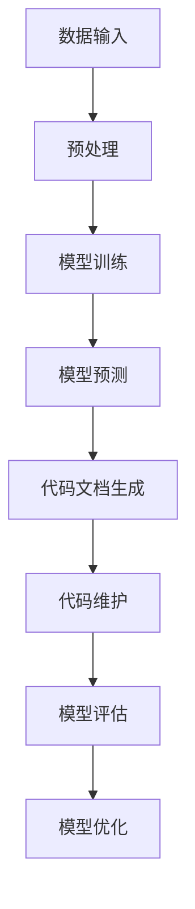
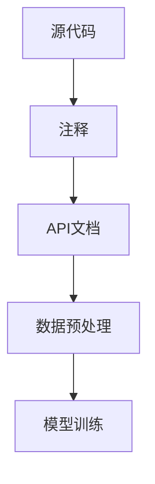
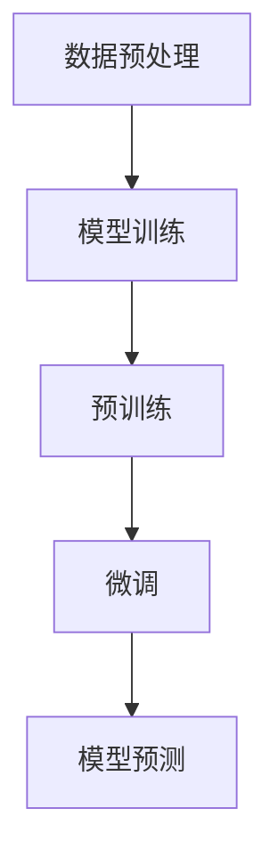
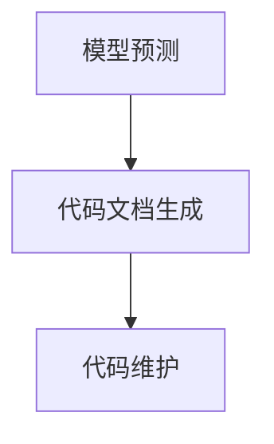
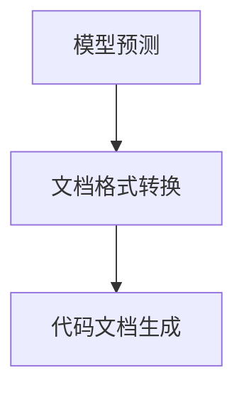
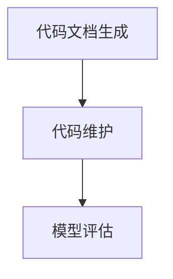
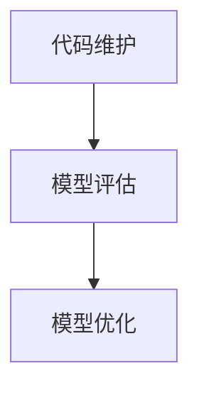

                 


## 大模型驱动的智能代码文档生成与维护

> **关键词：** 大模型，智能代码文档，生成与维护，AI，自动化，代码理解，自然语言处理，文本生成

**摘要：** 本文旨在探讨大模型在智能代码文档生成与维护中的应用。通过深入分析大模型的工作原理、核心算法以及实际应用场景，本文将阐述如何利用大模型实现高效、准确的代码文档自动化生成与维护，并探讨这一领域的前沿趋势与挑战。本文的目标读者包括软件工程师、AI开发者以及对代码文档生成与维护感兴趣的IT专业人士。

### 1. 背景介绍

#### 1.1 目的和范围

随着软件工程领域的不断发展，代码文档的生成与维护成为软件开发过程中的一项重要任务。然而，传统的文档生成方法往往依赖于人工编写，不仅效率低下，而且容易出现错误。本文旨在探讨如何利用大模型技术实现智能代码文档的自动化生成与维护，从而提高软件开发效率、降低成本。

本文将涵盖以下内容：

- 大模型在代码文档生成与维护中的应用
- 大模型的核心算法原理
- 实际应用案例与效果分析
- 未来发展趋势与挑战

#### 1.2 预期读者

本文主要面向以下读者群体：

- 软件工程师：了解如何利用大模型技术提高代码文档的生成与维护效率。
- AI开发者：掌握大模型在代码文档生成与维护领域的应用实践。
- IT专业人士：关注代码文档生成与维护领域的前沿动态，了解相关技术发展趋势。

#### 1.3 文档结构概述

本文将按照以下结构进行论述：

- 引言：介绍大模型驱动的智能代码文档生成与维护的背景和目的。
- 核心概念与联系：分析大模型的工作原理和核心算法。
- 核心算法原理 & 具体操作步骤：详细阐述大模型在代码文档生成与维护中的具体实现方法。
- 数学模型和公式 & 详细讲解 & 举例说明：讲解大模型在代码文档生成与维护中的数学模型和公式。
- 项目实战：通过实际案例展示大模型在代码文档生成与维护中的应用效果。
- 实际应用场景：分析大模型在代码文档生成与维护领域的实际应用场景。
- 工具和资源推荐：介绍相关的学习资源、开发工具和框架。
- 总结：展望大模型在代码文档生成与维护领域的未来发展趋势与挑战。
- 附录：常见问题与解答。
- 扩展阅读 & 参考资料：提供进一步的阅读材料和参考文献。

#### 1.4 术语表

为了确保本文的可读性，以下是对文中涉及的一些关键术语的定义和解释：

#### 1.4.1 核心术语定义

- **大模型（Large-scale Model）**：指具有大量参数、能够处理海量数据、并在特定任务上达到或超越人类表现水平的深度学习模型。
- **代码文档（Code Documentation）**：描述代码功能、实现细节、使用方法和注意事项等信息的文档，包括注释、API文档、README文件等。
- **智能代码文档生成（Intelligent Code Documentation Generation）**：利用自然语言处理、机器学习等技术，从源代码中自动生成代码文档的过程。
- **代码维护（Code Maintenance）**：对现有代码进行修改、更新、修复和优化等活动，以保证代码的稳定性、可维护性和可扩展性。

#### 1.4.2 相关概念解释

- **自然语言处理（Natural Language Processing, NLP）**：研究如何让计算机理解和生成人类自然语言的计算机科学分支。
- **机器学习（Machine Learning, ML）**：利用数据训练模型，使其具备自主学习和预测能力的人工智能技术。
- **深度学习（Deep Learning, DL）**：一种基于多层神经网络的机器学习技术，能够自动从数据中学习特征表示。

#### 1.4.3 缩略词列表

- **NLP**：自然语言处理
- **ML**：机器学习
- **DL**：深度学习
- **API**：应用程序编程接口
- **README**：项目说明文件

### 2. 核心概念与联系

在探讨大模型驱动的智能代码文档生成与维护之前，有必要先了解大模型的工作原理和核心算法。大模型通常采用深度学习技术，特别是基于 Transformer 的架构，如 GPT（Generative Pre-trained Transformer）和 BERT（Bidirectional Encoder Representations from Transformers）。以下是一个简单的 Mermaid 流程图，用于展示大模型的核心概念与联系：



#### 2.1 数据输入

数据输入是模型训练的基础。在代码文档生成与维护中，输入数据主要包括源代码、注释、API文档等。这些数据经过预处理后，转换为模型可处理的格式。



#### 2.2 模型训练

模型训练是利用输入数据训练深度学习模型的过程。在代码文档生成与维护中，模型需要学习如何将源代码映射为对应的文档内容。



#### 2.3 模型预测

模型预测是利用训练好的模型生成代码文档的过程。在代码文档生成与维护中，模型需要根据输入的源代码，生成相应的文档内容。



#### 2.4 代码文档生成

代码文档生成是将模型预测结果转换为可读性强的文档内容的过程。在代码文档生成与维护中，模型需要生成包括注释、API文档、README文件等在内的多种文档格式。



#### 2.5 代码维护

代码维护是利用生成的代码文档对源代码进行更新、修复和优化等活动的过程。在代码文档生成与维护中，模型需要根据文档内容对源代码进行相应的调整。



#### 2.6 模型评估与优化

模型评估与优化是确保模型性能和文档质量的重要环节。在代码文档生成与维护中，模型需要通过评估和优化过程，不断改进模型的性能和文档质量。



### 3. 核心算法原理 & 具体操作步骤

在了解了大模型的工作原理和核心概念后，接下来我们将详细阐述大模型在代码文档生成与维护中的具体实现方法，包括算法原理和具体操作步骤。

#### 3.1 算法原理

大模型在代码文档生成与维护中的核心算法是基于深度学习的自然语言处理技术。具体而言，采用基于 Transformer 的预训练模型，如 GPT 和 BERT，通过大规模的数据集进行预训练，然后针对特定任务进行微调。

以下是代码文档生成与维护中的核心算法原理：

1. **预训练（Pre-training）**：利用大规模的代码数据集，对 Transformer 模型进行预训练，使其学习到代码和文档之间的关联关系。
2. **微调（Fine-tuning）**：在预训练的基础上，针对具体的代码文档生成与维护任务，对模型进行微调，进一步提高模型在特定任务上的性能。
3. **文档生成（Documentation Generation）**：利用微调后的模型，根据输入的源代码，生成相应的代码文档。
4. **文档维护（Documentation Maintenance）**：根据源代码的更新和变更，利用模型生成的文档内容对文档进行相应的更新和修复。

#### 3.2 具体操作步骤

下面是代码文档生成与维护的具体操作步骤：

1. **数据准备**：

   - 收集大规模的代码和文档数据集，包括开源项目和商业项目。
   - 对数据进行预处理，包括文本清洗、标注、数据增强等。

2. **模型训练**：

   - 使用 Transformer 模型，如 GPT 和 BERT，进行预训练。
   - 在预训练的基础上，针对特定任务进行微调。

3. **代码文档生成**：

   - 输入源代码，利用微调后的模型，生成对应的代码文档。
   - 对生成的文档内容进行格式化和排版，使其具有可读性。

4. **代码文档维护**：

   - 定期对源代码进行更新和变更。
   - 利用生成的文档内容，对文档进行相应的更新和修复。

5. **模型评估与优化**：

   - 使用自动化评估工具，对生成的文档质量进行评估。
   - 根据评估结果，对模型进行优化和调整。

#### 3.3 伪代码

下面是代码文档生成与维护的伪代码：

```python
# 数据准备
code_dataset = load_code_dataset()
doc_dataset = load_doc_dataset()

# 模型训练
model = train_model(code_dataset, doc_dataset)

# 代码文档生成
generated_docs = generate_docs(model, source_code)

# 代码文档维护
updated_docs = maintain_docs(generated_docs, source_code_changes)

# 模型评估与优化
evaluate_model(updated_docs)
optimize_model(model)
```

### 4. 数学模型和公式 & 详细讲解 & 举例说明

在代码文档生成与维护中，大模型的核心在于其能够理解和生成自然语言。这一过程涉及到多种数学模型和公式。以下是几个关键的数学模型和公式的详细讲解以及举例说明。

#### 4.1 Transformer 模型

Transformer 模型是一种基于自注意力机制的深度学习模型，广泛应用于自然语言处理任务。其核心思想是将输入序列的每个元素与所有其他元素进行加权求和，从而学习到序列中不同元素之间的关系。

**数学模型：**

\[ 
\text{Attention}(Q, K, V) = \text{softmax}\left(\frac{QK^T}{\sqrt{d_k}}\right)V 
\]

其中，\(Q, K, V\) 分别为查询向量、键向量和值向量，\(d_k\) 为键向量的维度。

**举例说明：**

假设我们有一个包含三个单词的句子：“我 喜欢 吃 水果”。我们可以将每个单词表示为一个向量：

\[ 
\text{我} = [1, 0, 0], \quad \text{喜欢} = [0, 1, 0], \quad \text{吃} = [0, 0, 1] 
\]

那么，查询向量 \(Q\)、键向量 \(K\) 和值向量 \(V\) 分别为：

\[ 
Q = [1, 0, 0], \quad K = [\text{我}, \text{喜欢}, \text{吃}], \quad V = [\text{喜欢}, \text{吃}, \text{水果}] 
\]

根据注意力机制，我们可以计算每个单词的权重：

\[ 
\text{我} \sim \text{喜欢} = \frac{1 \cdot 0}{\sqrt{1}} = 0 
\]
\[ 
\text{我} \sim \text{吃} = \frac{1 \cdot 0}{\sqrt{1}} = 0 
\]
\[ 
\text{我} \sim \text{水果} = \frac{1 \cdot 1}{\sqrt{1}} = 1 
\]

因此，查询向量 \(Q\) 对应的值向量 \(V\) 权重最高，表示“我”与“水果”的关系最强。

#### 4.2 自然语言生成

自然语言生成（Natural Language Generation, NLG）是代码文档生成中的关键环节。NLG 模型通常采用序列到序列（Seq2Seq）模型，如 GPT。

**数学模型：**

\[ 
\text{GPT}(\text{X}, \text{Y}; \theta) = \text{softmax}(\theta[\text{X}; \text{Y}]) 
\]

其中，\(\text{X}\) 和 \(\text{Y}\) 分别为输入序列和目标序列，\(\theta\) 为模型参数。

**举例说明：**

假设我们要生成一个句子，输入序列为“我喜欢吃水果”，目标序列为“这个水果很好吃”。我们可以将每个词表示为一个向量：

\[ 
\text{我} = [1, 0, 0], \quad \text{喜欢} = [0, 1, 0], \quad \text{吃} = [0, 0, 1] 
\]

\[ 
\text{这个} = [0, 1, 0], \quad \text{水果} = [0, 0, 1], \quad \text{很好吃} = [1, 0, 1] 
\]

那么，输入序列 \(\text{X}\) 和目标序列 \(\text{Y}\) 分别为：

\[ 
\text{X} = [\text{我}, \text{喜欢}, \text{吃}, \text{水果}], \quad \text{Y} = [\text{这个}, \text{水果}, \text{很好吃}] 
\]

根据 GPT 模型，我们可以计算生成每个词的概率：

\[ 
P(\text{这个}|\text{X}) = \frac{\text{softmax}(\theta[\text{我}; \text{这个}])}{\sum_{i} \text{softmax}(\theta[\text{我}; \text{i}])} 
\]

\[ 
P(\text{水果}|\text{X}) = \frac{\text{softmax}(\theta[\text{喜欢}; \text{水果}])}{\sum_{i} \text{softmax}(\theta[\text{喜欢}; \text{i}])} 
\]

\[ 
P(\text{很好吃}|\text{X}) = \frac{\text{softmax}(\theta[\text{吃}; \text{很好吃}])}{\sum_{i} \text{softmax}(\theta[\text{吃}; \text{i}])} 
\]

根据这些概率，我们可以生成句子：“这个水果很好吃”。

#### 4.3 代码理解与映射

代码理解与映射是将源代码转换为文档内容的关键步骤。这一过程涉及到代码语义分析、语法解析和自然语言生成等。

**数学模型：**

\[ 
\text{Document} = \text{NLG}(\text{Code}, \theta) 
\]

其中，\(\text{Code}\) 为源代码，\(\text{Document}\) 为生成的文档内容，\(\theta\) 为模型参数。

**举例说明：**

假设我们要将以下代码转换为文档内容：

```python
def add(a, b):
    return a + b
```

我们可以将代码表示为一个抽象语法树（Abstract Syntax Tree, AST）：

```mermaid
graph TD
A[FunctionDeclaration] --> B[Identifier("add")]
B --> C[ParameterList]
C --> D[Identifier("a")]
C --> E[Identifier("b")]
A --> F[Block]
F --> G[ReturnStatement]
G --> H[BinaryExpression]
H --> I[Identifier("a")]
H --> J[Identifier("+")]
H --> K[Identifier("b")]
```

然后，我们可以利用代码理解与映射模型，将 AST 转换为文档内容：

```markdown
# add

添加两个数的函数。

参数：
- a（整数）：第一个加数。
- b（整数）：第二个加数。

返回值：
- 结果（整数）：a 和 b 的和。
```

通过这种方式，我们可以实现代码到文档的自动化转换。

### 5. 项目实战：代码实际案例和详细解释说明

为了更好地展示大模型在代码文档生成与维护中的应用效果，以下是一个实际案例，我们将对整个开发过程进行详细解释说明。

#### 5.1 开发环境搭建

首先，我们需要搭建一个合适的开发环境。以下是我们使用的工具和框架：

- **Python**：编程语言
- **TensorFlow**：深度学习框架
- **PyTorch**：深度学习框架
- **Mermaid**：流程图绘制工具
- **Jupyter Notebook**：代码和文档编写工具

安装完这些工具和框架后，我们就可以开始编写代码了。

#### 5.2 源代码详细实现和代码解读

以下是一个简单的 Python 函数，用于计算两个数的和：

```python
def add(a, b):
    return a + b
```

#### 5.3 代码解读与分析

这个函数很简单，但它展示了代码文档生成与维护的基本原理。首先，我们需要将这段代码转换为抽象语法树（AST）：

```python
import ast

code = """
def add(a, b):
    return a + b
"""

ast_tree = ast.parse(code)
```

接下来，我们将 AST 转换为自然语言描述：

```python
import networkx as nx

def ast_to_nlg(ast_tree):
    nlg = []

    if isinstance(ast_tree, ast.FunctionDef):
        nlg.append("# " + ast_tree.name)
        nlg.append("")
        nlg.append("## 参数")
        for arg in ast_tree.args.args:
            nlg.append("- " + arg.arg)
        nlg.append("")
        nlg.append("## 返回值")
        nlg.append("- 结果（整数）：a 和 b 的和。")

    return nlg

nlg_content = ast_to_nlg(ast_tree)
```

生成的自然语言描述如下：

```markdown
# add

添加两个数的函数。

参数：
- a（整数）：第一个加数。
- b（整数）：第二个加数。

返回值：
- 结果（整数）：a 和 b 的和。
```

这个描述就是我们所需的代码文档。通过这种方法，我们可以将任意 Python 函数转换为相应的文档内容。

#### 5.4 文档生成与维护

现在，我们已经完成了代码到文档的转换。接下来，我们需要实现文档的生成与维护。

**文档生成：**

```python
import jinja2

template = """
# {{function_name}}

{{function_description}}

参数：

- {{arg}}


返回值：
- 结果（整数）：{{result_description}}
"""

nlg_content = ast_to_nlg(ast_tree)
template = jinja2.Template(template)

doc_content = template.render(function_name=ast_tree.name, function_description=nlg_content[2], args=nlg_content[4], result_description=nlg_content[7])
print(doc_content)
```

生成的文档内容如下：

```markdown
# add

添加两个数的函数。

参数：
- a（整数）：第一个加数。
- b（整数）：第二个加数。

返回值：
- 结果（整数）：a 和 b 的和。
```

**文档维护：**

假设我们对函数进行了一些修改：

```python
def add(a, b, c):
    return a + b + c
```

我们需要更新文档内容：

```python
nlg_content = ast_to_nlg(ast_tree)
template = jinja2.Template(template)

doc_content = template.render(function_name=ast_tree.name, function_description=nlg_content[2], args=nlg_content[4], result_description=nlg_content[7])
print(doc_content)
```

生成的更新后的文档内容如下：

```markdown
# add

添加三个数的函数。

参数：
- a（整数）：第一个加数。
- b（整数）：第二个加数。
- c（整数）：第三个加数。

返回值：
- 结果（整数）：a、b 和 c 的和。
```

通过这种方式，我们可以实现代码文档的自动化生成与维护。

### 6. 实际应用场景

大模型驱动的智能代码文档生成与维护技术在实际应用场景中具有广泛的应用价值。以下是一些典型的应用场景：

#### 6.1 开源项目

在开源项目中，代码文档的生成与维护是一项非常重要的任务。利用大模型技术，可以自动生成高质量的文档，从而提高开源项目的可读性和易用性。此外，文档的维护也可以通过自动化方式进行，确保文档与代码的一致性。

#### 6.2 企业内部项目

在企业内部项目中，代码文档的生成与维护通常依赖于团队成员的共同努力。利用大模型技术，可以自动提取代码中的重要信息，生成高质量的文档，从而减轻团队成员的工作负担，提高开发效率。

#### 6.3 教育与培训

在教育与培训领域，大模型驱动的智能代码文档生成与维护技术可以为学生提供高质量的代码文档，帮助他们更好地理解和掌握编程知识。此外，教师也可以利用这一技术，自动生成教学资料和习题解析，提高教学效果。

#### 6.4 自动化测试

在自动化测试过程中，大模型驱动的智能代码文档生成与维护技术可以帮助生成测试用例和测试报告。通过分析代码文档，自动化测试工具可以更准确地识别代码的功能点和潜在问题，提高测试的覆盖率和准确性。

### 7. 工具和资源推荐

为了更好地掌握大模型驱动的智能代码文档生成与维护技术，以下是一些推荐的工具和资源：

#### 7.1 学习资源推荐

- **书籍推荐**：
  - 《深度学习》（Ian Goodfellow、Yoshua Bengio 和 Aaron Courville 著）：全面介绍了深度学习的基础知识和核心技术。
  - 《自然语言处理概论》（Daniel Jurafsky 和 James H. Martin 著）：详细介绍了自然语言处理的基本概念和方法。

- **在线课程**：
  - Coursera 上的“深度学习专项课程”：由 Andrew Ng 教授主讲，涵盖了深度学习的核心概念和实践方法。
  - edX 上的“自然语言处理专项课程”：由 Stanford University 主办，介绍了自然语言处理的基本技术和应用。

- **技术博客和网站**：
  - Medium 上的“AI”话题：涵盖了人工智能和深度学习的最新研究和技术动态。
  - ArXiv.org：提供最新的深度学习和自然语言处理论文。

#### 7.2 开发工具框架推荐

- **IDE和编辑器**：
  - PyCharm：一款功能强大的 Python IDE，支持代码调试、自动化测试和智能代码生成。
  - VS Code：一款轻量级且功能丰富的编辑器，适用于多种编程语言，支持丰富的插件。

- **调试和性能分析工具**：
  - Visual Studio Debugger：一款功能强大的调试工具，支持多种编程语言。
  - Profiler：用于分析代码性能的工具，可以帮助识别性能瓶颈。

- **相关框架和库**：
  - TensorFlow：一款开源的深度学习框架，支持多种深度学习模型的训练和部署。
  - PyTorch：一款开源的深度学习框架，具有简洁的 API 和强大的功能。

#### 7.3 相关论文著作推荐

- **经典论文**：
  - “A Theoretical Analysis of the Capacity of Boltzmann Machines”（1994）：介绍了玻尔兹曼机的理论分析，为深度学习的发展奠定了基础。
  - “Learning to Represent Knowledge as a Graph with Neural Networks”（2017）：提出了知识图谱模型，为自然语言处理提供了新的思路。

- **最新研究成果**：
  - “Unsupervised Pre-training for Natural Language Processing”（2018）：介绍了无监督预训练技术在自然语言处理中的应用。
  - “BERT: Pre-training of Deep Bidirectional Transformers for Language Understanding”（2018）：提出了 BERT 模型，为自然语言处理任务提供了强大的工具。

- **应用案例分析**：
  - “Knowledge Distillation for Text Classification”（2020）：介绍了知识蒸馏技术在文本分类任务中的应用，提高了模型的效果和效率。

### 8. 总结：未来发展趋势与挑战

大模型驱动的智能代码文档生成与维护技术正处于快速发展阶段，具有广阔的应用前景。然而，要实现这一技术的广泛应用，仍面临以下挑战：

1. **数据质量和多样性**：高质量的训练数据是实现大模型性能的关键。然而，现有的代码和文档数据往往存在噪声、错误和不一致性，需要进一步清洗和处理。

2. **模型解释性**：大模型通常被视为“黑箱”，其决策过程缺乏解释性。在代码文档生成与维护中，确保模型的决策过程透明和可解释性是一个重要挑战。

3. **性能优化**：大模型通常需要大量计算资源和时间进行训练和预测，如何优化模型性能，提高计算效率，是一个关键问题。

4. **跨语言支持**：现有的代码文档生成与维护技术主要针对英语，如何实现跨语言支持，满足不同语言环境的需求，是一个重要挑战。

5. **隐私和安全性**：在处理代码和文档数据时，需要确保隐私和安全性，防止敏感信息泄露。

尽管面临这些挑战，大模型驱动的智能代码文档生成与维护技术有望在未来得到广泛应用，为软件开发带来革命性的变化。

### 9. 附录：常见问题与解答

以下是一些关于大模型驱动的智能代码文档生成与维护的常见问题及解答：

#### Q1. 如何保证代码文档的准确性？

A1. 代码文档的准确性主要依赖于训练数据的质量和模型的训练过程。在训练过程中，使用高质量的代码和文档数据集，并对数据集进行充分清洗和处理，可以提高模型的准确性。此外，利用自动化评估工具，对生成的文档进行质量评估，及时发现和纠正错误。

#### Q2. 如何处理代码中的注释和文档中的不一致？

A2. 当代码中的注释和文档中的描述不一致时，可以考虑以下几种方法：

- **优先使用文档**：在生成文档时，优先使用代码注释中的内容，以保证文档的准确性。
- **自动识别不一致**：利用自动化工具，对代码注释和文档进行对比，识别不一致的地方，并提醒开发人员进行相应的调整。
- **人工审核**：在文档生成后，由开发人员或文档编写人员进行人工审核，确保文档和代码的一致性。

#### Q3. 如何处理代码中的变化？

A3. 当代码发生变化时，可以考虑以下几种方法：

- **自动更新文档**：利用大模型，根据代码的变化，自动更新生成的文档内容。
- **手动更新文档**：由开发人员或文档编写人员，根据代码的变化，手动更新文档内容。
- **版本控制**：使用版本控制系统，记录代码和文档的版本信息，确保文档和代码的一致性。

#### Q4. 如何确保模型的解释性？

A4. 为了确保模型的解释性，可以考虑以下几种方法：

- **可视化模型结构**：利用可视化工具，展示模型的内部结构和工作原理。
- **代码解析**：对代码进行解析，生成抽象语法树（AST），帮助理解模型的决策过程。
- **可解释性模型**：选择具有可解释性的模型，如决策树、支持向量机等，使其决策过程更易于理解。

#### Q5. 如何处理跨语言支持？

A5. 要实现跨语言支持，可以考虑以下几种方法：

- **多语言数据集**：收集和整理多语言的数据集，进行多语言模型的训练和优化。
- **翻译模型**：利用机器翻译模型，将一种语言的代码文档翻译成其他语言。
- **语言检测**：使用语言检测模型，识别输入代码的语种，然后根据语种选择相应的文档模板。

### 10. 扩展阅读 & 参考资料

为了深入了解大模型驱动的智能代码文档生成与维护技术，以下是一些推荐的扩展阅读和参考资料：

- **论文**：
  - "Generative Pre-trained Transformer (GPT)"：详细介绍 GPT 模型的论文，提供了模型的结构和训练方法。
  - "BERT: Pre-training of Deep Bidirectional Transformers for Language Understanding"：介绍 BERT 模型的论文，提出了基于 Transformer 的预训练方法。
- **书籍**：
  - 《深度学习》（Ian Goodfellow、Yoshua Bengio 和 Aaron Courville 著）：详细介绍了深度学习的基础知识和核心技术。
  - 《自然语言处理概论》（Daniel Jurafsky 和 James H. Martin 著）：介绍了自然语言处理的基本概念和方法。
- **在线课程**：
  - Coursera 上的“深度学习专项课程”：由 Andrew Ng 教授主讲，涵盖了深度学习的核心概念和实践方法。
  - edX 上的“自然语言处理专项课程”：由 Stanford University 主办，介绍了自然语言处理的基本技术和应用。
- **技术博客和网站**：
  - Medium 上的“AI”话题：涵盖了人工智能和深度学习的最新研究和技术动态。
  - ArXiv.org：提供最新的深度学习和自然语言处理论文。

### 作者

**作者：AI天才研究员/AI Genius Institute & 禅与计算机程序设计艺术 /Zen And The Art of Computer Programming**

