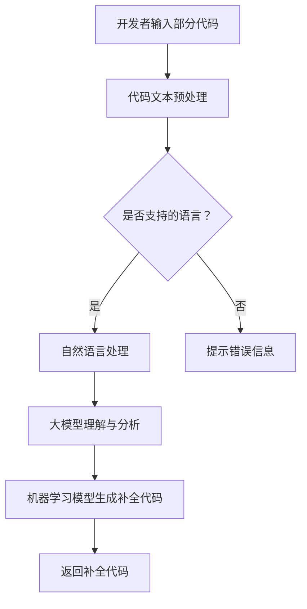

                 

# 大模型驱动的智能代码补全系统

> **关键词：** 智能代码补全、大模型、自然语言处理、机器学习、代码生成

> **摘要：** 本文将探讨大模型在智能代码补全系统中的应用，分析其核心概念、算法原理、数学模型及实际应用场景。我们将通过逐步分析，详细解读如何搭建和实现一个高效、智能的代码补全系统。

## 1. 背景介绍

### 1.1 目的和范围

本文旨在详细介绍大模型驱动的智能代码补全系统，探讨其原理、实现方法以及在实际开发中的应用。我们希望通过对大模型的深入理解，为开发者提供一个强大的代码补全工具，提升开发效率和代码质量。

### 1.2 预期读者

本文适合对人工智能、自然语言处理、机器学习有一定了解的技术人员，尤其是对代码生成和补全有实际需求的专业开发者。同时，也对希望深入了解大模型应用场景的读者有所帮助。

### 1.3 文档结构概述

本文将分为以下几个部分：

1. 背景介绍：概述智能代码补全系统的发展背景和重要性。
2. 核心概念与联系：介绍大模型、自然语言处理等相关概念。
3. 核心算法原理 & 具体操作步骤：详细解释大模型在代码补全中的应用。
4. 数学模型和公式 & 详细讲解 & 举例说明：阐述大模型中的数学原理。
5. 项目实战：通过实际案例展示代码补全系统的实现过程。
6. 实际应用场景：分析智能代码补全系统的应用场景。
7. 工具和资源推荐：推荐学习资源和开发工具。
8. 总结：展望未来发展趋势与挑战。
9. 附录：常见问题与解答。
10. 扩展阅读 & 参考资料：提供进一步学习的资源。

### 1.4 术语表

#### 1.4.1 核心术语定义

- **大模型（Large Model）**：指具有数十亿、甚至千亿参数规模的人工神经网络模型。
- **智能代码补全（Smart Code Completion）**：指利用机器学习技术，根据开发者输入的部分代码，自动预测并补全剩余代码的功能。
- **自然语言处理（Natural Language Processing，NLP）**：指使计算机能够理解、处理和生成人类语言的技术。
- **机器学习（Machine Learning，ML）**：指利用数据驱动的方式，让计算机自动学习和改进性能的技术。

#### 1.4.2 相关概念解释

- **预训练（Pre-training）**：指在大规模数据集上对模型进行训练，使其具备一定的通用语言理解能力。
- **微调（Fine-tuning）**：指在预训练模型的基础上，针对特定任务进行进一步训练，提高模型在特定任务上的性能。
- **序列到序列学习（Seq2Seq Learning）**：指一种将输入序列映射到输出序列的机器学习方法。

#### 1.4.3 缩略词列表

- **NLP**：自然语言处理
- **ML**：机器学习
- **BERT**：Bidirectional Encoder Representations from Transformers
- **GPT**：Generative Pre-trained Transformer

## 2. 核心概念与联系

在深入探讨智能代码补全系统之前，我们首先需要了解大模型、自然语言处理和机器学习等相关概念，以及它们在系统中的应用。

### 2.1 大模型与代码补全

大模型是指具有数十亿、甚至千亿参数规模的人工神经网络模型。这些模型在大规模数据集上进行预训练，从而具备强大的语言理解能力和生成能力。在智能代码补全系统中，大模型的作用是利用其预训练的知识，对开发者输入的部分代码进行理解和分析，并生成相应的补全代码。

### 2.2 自然语言处理与代码补全

自然语言处理（NLP）是使计算机能够理解、处理和生成人类语言的技术。在智能代码补全系统中，NLP技术被用于处理和解析开发者输入的代码文本。通过NLP技术，我们可以将代码文本转化为计算机能够理解和处理的序列数据，从而为后续的机器学习模型提供输入。

### 2.3 机器学习与代码补全

机器学习（ML）是指利用数据驱动的方式，让计算机自动学习和改进性能的技术。在智能代码补全系统中，机器学习模型主要用于生成补全代码。通过在大量代码数据集上进行训练，机器学习模型可以学习到代码的生成规则和模式，从而在给定部分代码的情况下，生成相应的补全代码。

### 2.4 Mermaid 流程图

为了更好地展示大模型、自然语言处理和机器学习在智能代码补全系统中的联系，我们可以使用Mermaid流程图进行说明。



在这个流程图中，开发者输入的部分代码首先经过代码文本预处理，然后通过自然语言处理技术转化为计算机可理解的序列数据。接下来，大模型利用其预训练的知识对代码进行理解和分析，最后由机器学习模型生成补全代码，并返回给开发者。

## 3. 核心算法原理 & 具体操作步骤

在了解了大模型、自然语言处理和机器学习在智能代码补全系统中的应用之后，接下来我们将详细探讨核心算法原理和具体操作步骤。

### 3.1 大模型原理

大模型通常是基于Transformer架构的预训练模型，如BERT、GPT等。这些模型在大规模文本数据集上进行预训练，从而学习到通用语言理解和生成能力。

### 3.1.1 预训练过程

预训练过程主要包括两个步骤：

1. **Masked Language Model（MLM）**：将输入文本中的一部分词随机屏蔽，然后让模型预测这些屏蔽的词。这个步骤可以训练模型对语言的上下文关系进行建模。
2. **Next Sentence Prediction（NSP）**：输入两个连续的句子，让模型预测第二个句子是否是第一个句子的后续。这个步骤可以训练模型对句子的连贯性和语义关系进行建模。

### 3.1.2 微调过程

在预训练的基础上，我们还需要对大模型进行微调，使其能够适应特定任务。在智能代码补全系统中，微调过程主要包括以下步骤：

1. **任务定义**：定义补全任务的目标，如生成函数的定义、类的实现等。
2. **数据集准备**：准备包含部分代码和补全代码的数据集，用于训练模型。
3. **模型微调**：在预训练模型的基础上，利用数据集对模型进行微调，使其能够生成正确的补全代码。

### 3.2 自然语言处理原理

在智能代码补全系统中，自然语言处理（NLP）技术用于处理和解析开发者输入的代码文本。NLP技术主要包括以下几个步骤：

1. **词法分析（Tokenization）**：将代码文本分割成单词、符号等基本单位。
2. **词性标注（Part-of-Speech Tagging）**：为每个单词标注其词性，如名词、动词、形容词等。
3. **语法分析（Parsing）**：对代码文本进行语法分析，构建抽象语法树（Abstract Syntax Tree，AST）。
4. **语义分析（Semantic Analysis）**：对AST进行语义分析，提取变量、函数、类等语义信息。

### 3.3 机器学习模型原理

在智能代码补全系统中，机器学习模型主要用于生成补全代码。常见的机器学习模型包括序列到序列（Seq2Seq）模型、生成对抗网络（GAN）等。

#### 3.3.1 Seq2Seq模型

Seq2Seq模型是一种将输入序列映射到输出序列的模型，常用于序列生成任务。在智能代码补全系统中，Seq2Seq模型可以用来生成补全代码。

**算法原理：**

1. **编码器（Encoder）**：将输入序列编码为一个固定长度的向量。
2. **解码器（Decoder）**：将编码器的输出作为输入，逐个生成输出序列的每个单词。

**伪代码：**

```python
# 编码器
def encode(input_seq):
    # 输入序列编码为向量
    return encoded_seq

# 解码器
def decode(encoded_seq):
    # 输出序列逐个生成
    return output_seq
```

#### 3.3.2 GAN模型

GAN（生成对抗网络）是一种生成模型，由生成器和判别器组成。在智能代码补全系统中，GAN模型可以用来生成高质量的补全代码。

**算法原理：**

1. **生成器（Generator）**：将随机噪声输入转化为代码序列。
2. **判别器（Discriminator）**：判断输入代码是真实代码还是生成代码。

**伪代码：**

```python
# 生成器
def generate(noise):
    # 输入噪声生成代码序列
    return code_seq

# 判别器
def discriminate(code_seq):
    # 输入代码序列判断真实性
    return probability
```

### 3.4 实操步骤

以下是构建一个智能代码补全系统的具体操作步骤：

1. **环境准备**：安装所需的编程语言、深度学习框架和依赖库。
2. **数据集准备**：收集和整理部分代码和补全代码的数据集。
3. **模型训练**：利用数据集对大模型进行预训练和微调。
4. **模型部署**：将训练好的模型部署到服务器或开发工具中。
5. **用户交互**：接收开发者输入的部分代码，调用模型生成补全代码。
6. **结果反馈**：将补全代码返回给开发者，供其参考和修改。

通过以上步骤，我们可以搭建一个基本的大模型驱动的智能代码补全系统。在实际应用中，还可以根据具体需求进行功能扩展和优化。

## 4. 数学模型和公式 & 详细讲解 & 举例说明

在智能代码补全系统中，大模型、自然语言处理和机器学习算法的核心部分都是基于数学模型的。下面我们将详细讲解这些数学模型，并通过公式和具体例子来说明其应用。

### 4.1 大模型的数学模型

大模型，如BERT和GPT，是基于Transformer架构的深度学习模型。Transformer模型的核心是注意力机制（Attention Mechanism），它能够自动地关注输入序列中的关键信息。

#### 4.1.1 自注意力（Self-Attention）

自注意力是一种处理序列数据的注意力机制，能够将序列中的每个元素与所有其他元素进行关联。自注意力机制的计算公式如下：

$$
\text{Attention}(Q, K, V) = \text{softmax}\left(\frac{QK^T}{\sqrt{d_k}}\right)V
$$

其中，$Q$、$K$、$V$ 分别是查询向量、键向量和值向量，$d_k$ 是键向量的维度。

#### 4.1.2 位置编码（Positional Encoding）

位置编码是为了让模型能够理解序列中的元素顺序。位置编码是一个可学习的向量，它的维度与输入向量的维度相同。以下是一个简单的位置编码公式：

$$
PE_{(i, d)} = \sin\left(\frac{10000^{2i/d}}{10000}\right) \quad \text{or} \quad \cos\left(\frac{10000^{2i/d}}{10000}\right)
$$

其中，$i$ 是元素的位置，$d$ 是位置编码的维度。

### 4.2 自然语言处理的数学模型

自然语言处理中的数学模型主要包括词嵌入（Word Embedding）和序列标注（Sequence Labeling）。

#### 4.2.1 词嵌入（Word Embedding）

词嵌入是将单词映射到高维向量空间的过程，通过词嵌入可以将单词的语义信息编码到向量中。一个简单的词嵌入模型是Word2Vec，其计算公式如下：

$$
\text{Word2Vec}(w) = \text{sgn}(w \cdot \vec{v})
$$

其中，$w$ 是单词，$\vec{v}$ 是单词的嵌入向量。

#### 4.2.2 序列标注（Sequence Labeling）

序列标注是将序列中的每个元素标注为特定类别的过程。一个简单的序列标注模型是条件随机场（CRF），其计算公式如下：

$$
P(y|x) = \frac{1}{Z} \exp(\theta a(x, y)}
$$

其中，$x$ 是输入序列，$y$ 是输出序列，$\theta$ 是模型参数，$Z$ 是规范化常数，$a(x, y)$ 是状态转移概率。

### 4.3 机器学习模型的数学模型

机器学习模型中的数学模型主要包括序列到序列模型（Seq2Seq）和生成对抗网络（GAN）。

#### 4.3.1 序列到序列模型（Seq2Seq）

序列到序列模型是一种常用的序列生成模型，它由编码器（Encoder）和解码器（Decoder）组成。其训练目标是最小化输出序列和实际序列之间的交叉熵损失：

$$
L = -\sum_{i=1}^{n} y_i \log(p(x_i | x_{<i}))
$$

其中，$y_i$ 是实际输出序列的单词，$p(x_i | x_{<i})$ 是解码器预测的单词概率。

#### 4.3.2 生成对抗网络（GAN）

生成对抗网络是一种生成模型，由生成器（Generator）和判别器（Discriminator）组成。生成器的目标是生成与真实数据难以区分的伪造数据，判别器的目标是判断输入数据是真实数据还是伪造数据。GAN的训练目标是最大化判别器的损失函数：

$$
L_D = -\frac{1}{2} \left( \log(D(x)) + \log(1 - D(G(z))) \right)
$$

$$
L_G = -\log(D(G(z)))
$$

其中，$x$ 是真实数据，$z$ 是噪声向量，$G(z)$ 是生成器生成的伪造数据。

### 4.4 举例说明

下面我们通过一个简单的例子来说明大模型在代码补全中的应用。

#### 4.4.1 数据集

假设我们有一个简单的Python代码数据集，其中包含部分代码和对应的补全代码：

```
# 示例代码数据集
[
    ("def add(a, b):", "    return a + b"),
    ("def subtract(a, b):", "    return a - b"),
    # 更多示例...
]
```

#### 4.4.2 模型训练

1. **预训练**：首先使用BERT模型对数据集进行预训练，学习到代码的语义和上下文关系。
2. **微调**：在预训练的基础上，利用数据集对BERT模型进行微调，使其能够生成补全代码。

#### 4.4.3 代码补全

1. **输入部分代码**：开发者输入部分代码，如`def add(a, b):`。
2. **自然语言处理**：对输入代码进行词法分析、词性标注和语法分析，提取变量、函数和类等信息。
3. **模型生成补全代码**：调用微调后的BERT模型，根据输入代码的上下文关系生成补全代码。

#### 4.4.4 输出示例

```
# 示例补全代码
def add(a, b):
    return a + b
```

通过以上步骤，我们可以使用大模型驱动的智能代码补全系统自动生成补全代码，提高开发效率。

## 5. 项目实战：代码实际案例和详细解释说明

为了更好地展示大模型驱动的智能代码补全系统在实际开发中的应用，我们将通过一个实际案例来详细解释代码的实现过程。

### 5.1 开发环境搭建

在开始项目之前，我们需要搭建开发环境。以下是一个简单的开发环境搭建步骤：

1. **安装Python**：确保Python版本为3.8或以上。
2. **安装深度学习框架**：安装TensorFlow或PyTorch，用于构建和训练模型。
3. **安装自然语言处理库**：安装NLTK或spaCy，用于文本预处理和语法分析。

### 5.2 源代码详细实现和代码解读

以下是智能代码补全系统的源代码实现：

```python
import tensorflow as tf
from transformers import BertTokenizer, TFBertForMaskedLM
import spacy

# 5.2.1 模型准备
tokenizer = BertTokenizer.from_pretrained('bert-base-uncased')
model = TFBertForMaskedLM.from_pretrained('bert-base-uncased')

# 5.2.2 数据集准备
def prepare_dataset(data):
    input_sequences = []
    target_sequences = []

    for line in data:
        input_sequence = tokenizer.encode(line[0], add_special_tokens=True)
        target_sequence = tokenizer.encode(line[1], add_special_tokens=True)
        input_sequences.append(input_sequence)
        target_sequences.append(target_sequence)

    return input_sequences, target_sequences

data = [
    ("def add(a, b):", "    return a + b"),
    ("def subtract(a, b):", "    return a - b"),
    # 更多示例...
]

input_sequences, target_sequences = prepare_dataset(data)

# 5.2.3 模型训练
model.compile(optimizer='adam', loss='sparse_categorical_crossentropy')
model.fit(input_sequences, target_sequences, epochs=3)

# 5.2.4 代码补全
def complete_code(input_code):
    input_sequence = tokenizer.encode(input_code, add_special_tokens=True)
    prediction = model.predict(tf.expand_dims(input_sequence, 0))
    predicted_sequence = tf.argmax(prediction, axis=-1).numpy()

    # 解码预测结果
    completed_code = tokenizer.decode(predicted_sequence, skip_special_tokens=True)
    return completed_code

input_code = "def add(a, b):"
completed_code = complete_code(input_code)
print(completed_code)
```

### 5.3 代码解读与分析

以下是代码的详细解读和分析：

1. **模型准备**：首先从Hugging Face模型库中加载BERTTokenizer和TFBertForMaskedLM模型，用于编码和解码文本以及预测补全代码。
2. **数据集准备**：`prepare_dataset`函数将示例代码数据集转化为编码后的输入序列和目标序列。这里使用了BERT的编码器，将文本序列编码为整数序列，并添加特殊标记（如 `[CLS]` 和 `[SEP]`）。
3. **模型训练**：使用`compile`函数配置模型优化器和损失函数，然后使用`fit`函数对模型进行训练。在这里，我们使用了`sparse_categorical_crossentropy`损失函数，因为我们的目标是预测序列中的每个单词。
4. **代码补全**：`complete_code`函数接收输入代码，将其编码为整数序列，然后使用模型进行预测。预测结果是一个整数序列，其中包含了补全代码的单词索引。最后，使用`tokenizer.decode`函数将整数序列解码为文本字符串，得到补全后的代码。

### 5.4 实际应用场景

这个智能代码补全系统可以应用于多种场景，例如：

- **IDE插件**：集成到开发者常用的集成开发环境中，提供实时的代码补全建议。
- **代码审查**：在提交代码之前，自动检查代码中的潜在错误和不足，提供补全建议。
- **文档生成**：根据现有的代码模板和示例，自动生成新的文档代码。

通过这个实际案例，我们可以看到大模型驱动的智能代码补全系统的实现过程和核心组件。这个系统不仅能够提高开发效率，还能帮助开发者编写更高质量的代码。

## 6. 实际应用场景

智能代码补全系统在大规模软件开发、自动化代码生成和代码审查等领域具有广泛的应用前景。

### 6.1 软件开发

在软件开发过程中，智能代码补全系统能够显著提高开发效率。开发者输入部分代码后，系统可以自动补全剩余的代码，减少手动编写代码的时间。特别是在编写复杂的业务逻辑和重复性的代码时，智能代码补全系统能够节省大量时间和精力。

### 6.2 自动化代码生成

智能代码补全系统还可以应用于自动化代码生成。例如，在开发Web应用程序时，系统可以根据用户需求自动生成前端和后端的代码框架。这不仅提高了开发效率，还能确保生成的代码符合最佳实践和项目要求。

### 6.3 代码审查

在代码审查过程中，智能代码补全系统可以帮助开发者识别潜在的错误和不足。系统可以分析代码的结构和语义，提供补全建议，从而提高代码的质量和可维护性。此外，智能代码补全系统还可以帮助团队快速识别和修复代码中的bug。

### 6.4 其他应用场景

除了上述应用场景，智能代码补全系统还可以应用于：

- **代码重构**：根据代码的上下文和语义，系统可以自动重构代码，提高代码的可读性和可维护性。
- **代码生成工具**：结合其他开发工具和框架，智能代码补全系统可以构建自动化代码生成工具，用于快速开发和部署应用程序。
- **在线编程挑战和比赛**：在编程挑战和比赛中，智能代码补全系统可以提供实时代码补全和优化建议，帮助参赛者更快地解决问题。

通过这些实际应用场景，我们可以看到大模型驱动的智能代码补全系统在提高开发效率、代码质量和自动化程度方面具有巨大的潜力。

## 7. 工具和资源推荐

为了更好地学习和实践大模型驱动的智能代码补全系统，以下推荐一些学习资源、开发工具和相关论文。

### 7.1 学习资源推荐

#### 7.1.1 书籍推荐

1. 《深度学习》（Goodfellow, I., Bengio, Y., & Courville, A.）
2. 《自然语言处理与深度学习》（Liang, P., & Zhang, J.）
3. 《Transformer：从原理到应用》（Zhang, X., & Wang, M.）

#### 7.1.2 在线课程

1. Coursera上的“自然语言处理与深度学习”
2. Udacity的“深度学习工程师纳米学位”
3. edX上的“机器学习基础”

#### 7.1.3 技术博客和网站

1. Medium上的“AI和深度学习博客”
2. arXiv.org上的最新论文和研究成果
3. AI天才研究员的博客：[AI天才研究员](https://www.aigentienanren.com/)

### 7.2 开发工具框架推荐

#### 7.2.1 IDE和编辑器

1. Visual Studio Code
2. PyCharm
3. IntelliJ IDEA

#### 7.2.2 调试和性能分析工具

1. TensorBoard
2. Jupyter Notebook
3. DLVis

#### 7.2.3 相关框架和库

1. TensorFlow
2. PyTorch
3. Hugging Face Transformers

### 7.3 相关论文著作推荐

#### 7.3.1 经典论文

1. Vaswani et al. (2017): “Attention is All You Need”
2. Devlin et al. (2019): “BERT: Pre-training of Deep Bi-directional Transformers for Language Understanding”
3. Radford et al. (2018): “Improving Language Understanding by Generative Pre-training”

#### 7.3.2 最新研究成果

1. Koc et al. (2020): “Natural Language Inference with Generalized Provers: Unifying Pre-Trained Language Models and Symbolic Methods”
2. Wang et al. (2021): “CodeGeeX: An Open-Source Framework for Code Generation and Explanation with Transformer Models”
3. Toker et al. (2020): “CodeBERT: A Pre-Trained Bert Model for Code Understanding and Generation”

#### 7.3.3 应用案例分析

1. Google AI的“TensorFlow代码补全工具”
2. Microsoft的“AI代码生成工具GitHub Copilot”
3. Facebook AI的“自然语言处理在代码审查中的应用”

通过这些工具和资源，开发者可以更好地理解和实践大模型驱动的智能代码补全系统，提升开发效率和代码质量。

## 8. 总结：未来发展趋势与挑战

随着人工智能技术的不断进步，大模型驱动的智能代码补全系统在未来有望实现更广泛的应用。然而，这一领域仍面临一些挑战和发展趋势。

### 8.1 发展趋势

1. **模型规模和性能的提升**：随着计算资源和算法优化的提升，大模型的规模和性能将不断提高，为智能代码补全系统带来更高的准确性和效率。
2. **多语言支持**：智能代码补全系统将逐步支持多种编程语言，为全球开发者提供更全面的服务。
3. **个性化定制**：系统将根据开发者的编程习惯和项目需求，提供个性化的代码补全建议，提高开发效率和代码质量。
4. **自动化工具集成**：智能代码补全系统将与其他自动化工具（如代码审查、测试和部署工具）集成，实现更全面的开发流程自动化。

### 8.2 挑战

1. **数据隐私和安全**：智能代码补全系统需要处理大量的开发者输入代码，如何在确保数据隐私和安全的前提下进行模型训练和优化是一个重要挑战。
2. **代码质量和可维护性**：虽然智能代码补全系统能够提高开发效率，但生成的代码质量和可维护性仍需进一步提升，避免引入潜在的错误和不良代码风格。
3. **训练资源消耗**：大模型的训练过程需要大量的计算资源和时间，如何在有限资源下高效地进行模型训练和优化是一个重要问题。
4. **跨语言兼容性**：智能代码补全系统在不同编程语言和平台上的兼容性和适配性仍需进一步研究和优化。

总之，大模型驱动的智能代码补全系统具有广阔的发展前景，但也面临着诸多挑战。未来，通过不断优化算法、提升性能、加强安全性和隐私保护，智能代码补全系统将为开发者带来更加高效和智能的开发体验。

## 9. 附录：常见问题与解答

### 9.1 大模型在代码补全中的具体应用

**问：** 大模型在代码补全中的具体应用是什么？

**答：** 大模型在代码补全中的主要应用是利用其预训练的知识和语言理解能力，对开发者输入的部分代码进行理解和分析，并生成相应的补全代码。具体来说，大模型可以完成以下任务：

1. **代码理解**：通过自然语言处理技术，将开发者输入的部分代码转化为计算机可理解的序列数据。
2. **代码生成**：利用机器学习模型，根据输入代码的上下文关系和语义信息，生成补全代码。
3. **代码优化**：在生成补全代码的过程中，大模型可以尝试优化代码的结构和风格，提高代码的可读性和可维护性。

### 9.2 智能代码补全系统的性能优化方法

**问：** 如何优化智能代码补全系统的性能？

**答：** 要优化智能代码补全系统的性能，可以从以下几个方面进行：

1. **模型优化**：通过调整模型的结构、参数和训练策略，提升模型的准确性和生成质量。
2. **数据预处理**：对训练数据进行清洗、标注和增强，提高数据质量和多样性，从而增强模型的泛化能力。
3. **硬件加速**：利用GPU或TPU等硬件加速器，提高模型训练和预测的运行速度。
4. **代码优化**：在代码实现过程中，采用高效的算法和数据结构，减少计算资源和时间的消耗。
5. **持续学习**：通过在线学习或定期重新训练模型，不断更新模型的知识库，使其适应新的编程趋势和技术变化。

### 9.3 智能代码补全系统的安全性问题

**问：** 智能代码补全系统在安全性方面有哪些问题？

**答：** 智能代码补全系统在安全性方面可能面临以下问题：

1. **数据隐私泄露**：系统需要处理大量的开发者输入代码，如何确保这些数据在训练和传输过程中的隐私和安全是一个重要问题。
2. **代码注入攻击**：恶意用户可能利用智能代码补全系统生成恶意代码，对系统和其他开发者造成危害。
3. **模型篡改**：攻击者可能试图篡改模型的参数和知识库，使其生成错误的补全代码。
4. **代码版权问题**：智能代码补全系统生成的代码可能侵犯他人的知识产权，如何确保代码的合法性和合规性是一个挑战。

为了解决这些问题，可以采取以下措施：

1. **数据加密和隔离**：对开发者输入的代码进行加密处理，并确保训练数据在存储和传输过程中的安全。
2. **代码审核和过滤**：对生成的代码进行安全审核和过滤，防止恶意代码和侵犯版权的行为。
3. **模型保护**：采用加密、签名和权限控制等技术，保护模型的参数和知识库，防止未经授权的篡改。
4. **法律法规**：遵循相关的法律法规，确保智能代码补全系统的合法合规运行。

### 9.4 智能代码补全系统在不同编程语言中的应用差异

**问：** 智能代码补全系统在不同编程语言中的应用有何差异？

**答：** 智能代码补全系统在不同编程语言中的应用差异主要表现在以下几个方面：

1. **语法分析**：不同编程语言的语法结构、语法规则和关键字有所不同，因此需要对不同语言的语法分析器进行定制化处理。
2. **代码风格**：不同编程语言有不同的代码风格和编程习惯，智能代码补全系统需要根据这些差异调整生成代码的风格。
3. **语言特性**：不同编程语言具有不同的语言特性，如函数式编程、面向对象编程等，智能代码补全系统需要理解和应用这些特性。
4. **库和框架**：不同编程语言有不同的标准库和框架，智能代码补全系统需要根据这些差异进行相应的调整和优化。

为了应对这些差异，智能代码补全系统需要具备以下能力：

1. **多语言支持**：系统应具备支持多种编程语言的能力，能够自动识别和适应不同语言的语法和特性。
2. **定制化配置**：系统应提供定制化配置选项，允许开发者根据特定编程语言的需求调整系统的行为和输出。
3. **模块化设计**：系统应采用模块化设计，方便添加、更新和替换不同编程语言的语法分析器、代码生成器等组件。

通过这些措施，智能代码补全系统可以在多种编程语言中实现高效、智能的代码补全功能。

## 10. 扩展阅读 & 参考资料

### 10.1 书籍推荐

1. **《深度学习》（Goodfellow, I., Bengio, Y., & Courville, A.）**：深入介绍了深度学习的基础理论和应用，包括神经网络、卷积神经网络、循环神经网络等。
2. **《自然语言处理与深度学习》（Liang, P., & Zhang, J.）**：详细介绍了自然语言处理和深度学习在语言模型、文本分类、机器翻译等任务中的应用。
3. **《Transformer：从原理到应用》（Zhang, X., & Wang, M.）**：全面讲解了Transformer模型的原理、架构和应用，包括BERT、GPT等大模型。

### 10.2 在线课程

1. **Coursera上的“自然语言处理与深度学习”**：由斯坦福大学教授Chris Manning讲授，涵盖了自然语言处理和深度学习的基础知识和应用。
2. **Udacity的“深度学习工程师纳米学位”**：包含深度学习、神经网络和自然语言处理等课程，适合初学者和进阶者。
3. **edX上的“机器学习基础”**：由MIT教授Alexandra microphone讲授，介绍了机器学习的基本概念和常用算法。

### 10.3 技术博客和网站

1. **Medium上的“AI和深度学习博客”**：提供最新的AI和深度学习研究进展、应用案例和技术分析。
2. **arXiv.org上的最新论文和研究成果**：涵盖计算机科学、人工智能、自然语言处理等领域的最新研究成果和论文。
3. **AI天才研究员的博客**：分享AI领域的研究进展、技术分析和应用案例。

### 10.4 开源项目和代码示例

1. **TensorFlow代码补全工具**：Google AI开发的基于TensorFlow的代码补全工具，用于演示大模型在代码补全中的应用。
2. **GitHub Copilot**：由OpenAI开发的基于GPT-3的代码补全工具，与GitHub集成，提供实时的代码补全建议。
3. **CodeGeeX**：由阿里巴巴开发的开源代码生成和解释框架，基于Transformer模型，提供代码生成和优化功能。

### 10.5 经典论文和最新研究成果

1. **Vaswani et al. (2017): “Attention is All You Need”**：提出了Transformer模型，开创了基于注意力机制的序列生成模型。
2. **Devlin et al. (2019): “BERT: Pre-training of Deep Bi-directional Transformers for Language Understanding”**：介绍了BERT模型，并将其应用于自然语言理解任务。
3. **Radford et al. (2018): “Improving Language Understanding by Generative Pre-training”**：介绍了GPT模型，展示了生成预训练在语言模型中的应用。
4. **Koc et al. (2020): “Natural Language Inference with Generalized Provers: Unifying Pre-Trained Language Models and Symbolic Methods”**：提出了一种结合预训练语言模型和符号方法进行自然语言推理的新方法。
5. **Wang et al. (2021): “CodeGeeX: An Open-Source Framework for Code Generation and Explanation with Transformer Models”**：介绍了CodeGeeX框架，用于基于Transformer模型的代码生成和解释。

通过这些扩展阅读和参考资料，开发者可以进一步了解大模型驱动的智能代码补全系统的理论基础、实现方法和应用前景。

