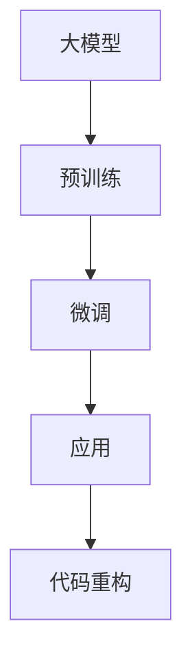
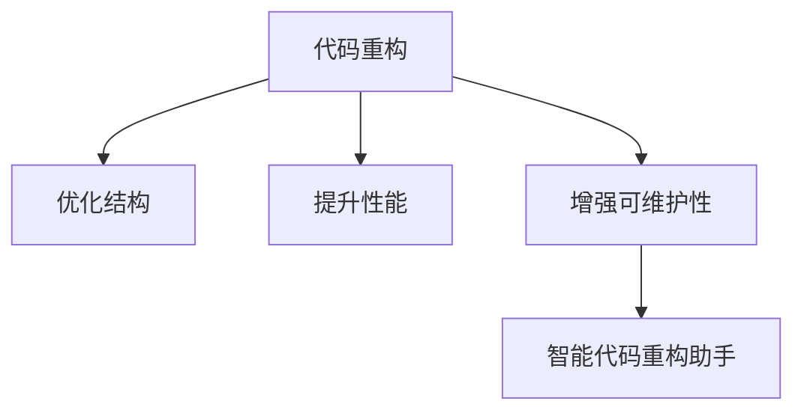
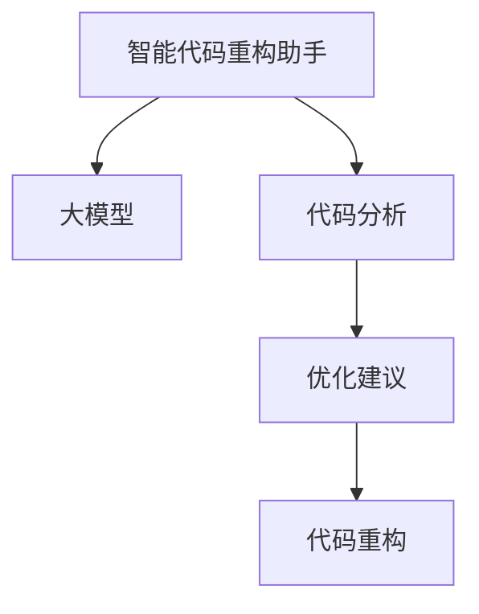
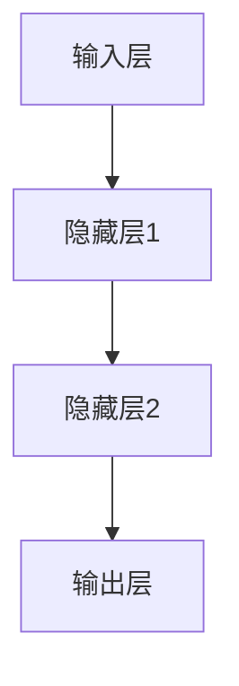
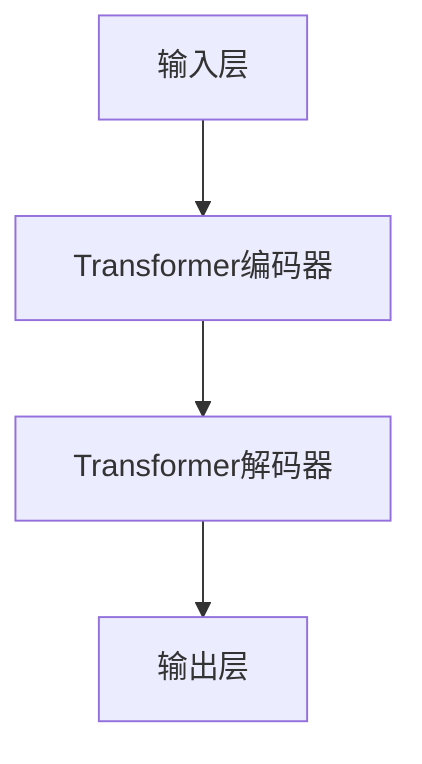

                 

# 大模型驱动的智能代码重构助手

> **关键词**：大模型、智能重构、代码优化、算法原理、应用场景

> **摘要**：本文将探讨大模型驱动的智能代码重构助手，从背景介绍到核心概念，再到算法原理与数学模型，最后通过实际案例与未来展望，详细解析这一新兴领域的核心技术与应用。本文旨在为开发者提供一条清晰、实用的学习路径，以掌握大模型在代码重构中的应用。

## 1. 背景介绍

### 1.1 目的和范围

本文旨在探讨如何利用大模型技术，开发出能够智能重构代码的工具。随着软件开发复杂度的不断增加，代码重构成为了一个至关重要的环节。传统的代码重构方法往往依赖于手动操作，效率低下且容易出错。而大模型驱动的智能代码重构助手，则可以通过自动化的方式，对代码进行优化，提高开发效率。

### 1.2 预期读者

本文面向具有一定编程基础，对大模型技术有一定了解的开发者。预期读者应能够理解代码重构的基本原理，以及大模型的基本概念和应用。

### 1.3 文档结构概述

本文分为以下几个部分：

- 背景介绍：包括目的与范围、预期读者、文档结构概述。
- 核心概念与联系：介绍大模型、代码重构等相关概念，并给出Mermaid流程图。
- 核心算法原理 & 具体操作步骤：讲解大模型驱动的智能代码重构算法原理，并使用伪代码详细阐述。
- 数学模型和公式 & 详细讲解 & 举例说明：介绍大模型驱动的智能代码重构所需的数学模型和公式，并进行详细讲解和举例说明。
- 项目实战：提供实际的代码重构案例，详细解释说明重构过程。
- 实际应用场景：探讨智能代码重构在现实中的应用场景。
- 工具和资源推荐：推荐相关学习资源、开发工具和框架。
- 总结：总结大模型驱动的智能代码重构助手的发展趋势与挑战。
- 附录：常见问题与解答。
- 扩展阅读 & 参考资料：提供进一步学习的资源。

### 1.4 术语表

#### 1.4.1 核心术语定义

- **大模型**：具有数亿甚至数千亿参数的深度学习模型，如GPT、BERT等。
- **代码重构**：在不改变外部行为的前提下，对现有代码进行修改，以提高其结构、性能和可维护性。
- **智能代码重构助手**：利用大模型技术，自动识别代码中的问题，并给出优化建议的工具。

#### 1.4.2 相关概念解释

- **编程范式**：编程语言中的抽象和表达方式，如面向对象、函数式编程等。
- **代码质量**：代码的可读性、可维护性和性能等方面的综合评价。

#### 1.4.3 缩略词列表

- GPT：Generative Pre-trained Transformer
- BERT：Bidirectional Encoder Representations from Transformers

## 2. 核心概念与联系

在本节中，我们将介绍大模型、代码重构以及智能代码重构助手等核心概念，并使用Mermaid流程图展示它们之间的联系。

### 2.1 大模型

大模型是指具有数亿甚至数千亿参数的深度学习模型，如GPT、BERT等。这些模型通过对海量数据的预训练，能够对输入的文本进行理解和生成。



### 2.2 代码重构

代码重构是指在不改变外部行为的前提下，对现有代码进行修改，以提高其结构、性能和可维护性。代码重构是软件开发过程中不可或缺的一部分。



### 2.3 智能代码重构助手

智能代码重构助手是指利用大模型技术，自动识别代码中的问题，并给出优化建议的工具。它能够大幅提高代码重构的效率和质量。



通过以上Mermaid流程图，我们可以清晰地看到大模型、代码重构和智能代码重构助手之间的联系。大模型作为核心技术，为代码重构提供了强大的支持，而智能代码重构助手则通过自动化的方式，实现了对代码的优化。

## 3. 核心算法原理 & 具体操作步骤

在本节中，我们将深入探讨大模型驱动的智能代码重构算法原理，并使用伪代码详细阐述其具体操作步骤。

### 3.1 算法原理

大模型驱动的智能代码重构算法主要分为三个阶段：预训练、微调和应用。

#### 3.1.1 预训练

预训练阶段，大模型通过对海量编程数据的训练，学习到代码的内在结构和语义。这个过程类似于人类通过阅读大量代码，掌握编程语言和编程范式。

```python
def pretrain(model, data):
    for epoch in range(num_epochs):
        for code in data:
            model.train(code)
    return model
```

#### 3.1.2 微调

微调阶段，大模型根据特定的代码库和项目需求，对预训练模型进行微调。这个过程有助于模型更好地适应特定场景。

```python
def finetune(model, project_data):
    for epoch in range(num_epochs):
        for code in project_data:
            model.finetune(code)
    return model
```

#### 3.1.3 应用

应用阶段，大模型被用于识别代码中的问题，并生成优化建议。这个过程类似于医生通过检查病人，给出治疗方案。

```python
def apply(model, code):
    issues = model.analyze(code)
    suggestions = model.generate_suggestions(issues)
    return suggestions
```

### 3.2 具体操作步骤

以下是大模型驱动的智能代码重构的具体操作步骤：

1. **收集编程数据**：收集用于预训练的海量编程数据，包括各种编程语言、编程范式和代码库。

2. **预训练模型**：使用收集到的编程数据，对大模型进行预训练。

3. **微调模型**：根据特定代码库和项目需求，对预训练模型进行微调。

4. **代码分析**：使用微调后的模型，对目标代码进行分析，识别其中的问题。

5. **生成优化建议**：根据分析结果，生成优化建议。

6. **代码重构**：根据优化建议，对代码进行重构，提高代码质量。

以下是具体的伪代码实现：

```python
# 步骤1：收集编程数据
def collect_data():
    data = []
    # ...收集编程数据...
    return data

# 步骤2：预训练模型
def pretrain(model, data):
    for epoch in range(num_epochs):
        for code in data:
            model.train(code)
    return model

# 步骤3：微调模型
def finetune(model, project_data):
    for epoch in range(num_epochs):
        for code in project_data:
            model.finetune(code)
    return model

# 步骤4：代码分析
def analyze(model, code):
    issues = model.analyze(code)
    return issues

# 步骤5：生成优化建议
def generate_suggestions(model, issues):
    suggestions = model.generate_suggestions(issues)
    return suggestions

# 步骤6：代码重构
def refactor(code, suggestions):
    refactored_code = model.refactor(code, suggestions)
    return refactored_code

# 主函数
def main():
    data = collect_data()
    model = pretrain(data)
    project_data = ... # 收集项目代码数据
    model = finetune(model, project_data)
    code = ... # 目标代码
    issues = analyze(model, code)
    suggestions = generate_suggestions(model, issues)
    refactored_code = refactor(code, suggestions)
    print(refactored_code)

if __name__ == "__main__":
    main()
```

通过以上步骤，我们可以实现大模型驱动的智能代码重构。这个过程不仅提高了代码重构的效率，还保证了重构后的代码质量。

## 4. 数学模型和公式 & 详细讲解 & 举例说明

在本节中，我们将介绍大模型驱动的智能代码重构所需的核心数学模型和公式，并进行详细讲解和举例说明。

### 4.1 深度学习模型

大模型驱动的智能代码重构主要依赖于深度学习模型。以下是一个简单的深度学习模型结构：



#### 4.1.1 激活函数

激活函数是深度学习模型中的一个关键组成部分。以下是一个常用的激活函数——ReLU（Rectified Linear Unit）：

$$
\text{ReLU}(x) = \begin{cases} 
x, & \text{if } x \geq 0 \\
0, & \text{if } x < 0 
\end{cases}
$$

举例说明：对于输入$x = -3$，ReLU函数的输出为0。

### 4.2 自然语言处理

智能代码重构过程中，自然语言处理（NLP）技术起到了至关重要的作用。以下是一个简单的NLP模型——BERT（Bidirectional Encoder Representations from Transformers）：



#### 4.2.1 BERT模型

BERT模型是一种预训练的深度学习模型，通过在大量文本数据上进行预训练，能够捕捉文本的语义信息。以下是一个BERT模型的简单公式：

$$
\text{BERT}(x) = \text{Transformer}(x) + \text{Positional Encoding}(x)
$$

其中，$\text{Transformer}(x)$表示Transformer编码器，$\text{Positional Encoding}(x)$表示位置编码。

举例说明：对于输入文本$x = \text{"Hello, world!"}$，BERT模型能够对其进行语义分析，理解其含义。

### 4.3 代码重构

在智能代码重构过程中，我们需要对代码进行分析、优化和重构。以下是一个简单的代码重构公式：

$$
\text{Refactor}(code) = \text{Analyze}(code) \times \text{Optimize}(code) \times \text{Rebuild}(code)
$$

其中，$\text{Analyze}(code)$表示代码分析，$\text{Optimize}(code)$表示代码优化，$\text{Rebuild}(code)$表示代码重构。

举例说明：对于一段代码$code = \text{"for i in range(10): print(i)"}$，智能代码重构助手可以通过分析、优化和重构，将其重构为更简洁、高效的代码。

### 4.4 损失函数

在深度学习模型训练过程中，损失函数用于衡量模型预测结果与真实结果之间的差距。以下是一个常用的损失函数——交叉熵损失（Cross-Entropy Loss）：

$$
\text{Loss} = -\sum_{i} y_i \log(p_i)
$$

其中，$y_i$表示真实标签，$p_i$表示模型预测的概率。

举例说明：对于输入标签$y = [1, 0, 0]$和模型预测概率$p = [0.8, 0.1, 0.1]$，交叉熵损失的输出为0.59。

通过以上数学模型和公式，我们可以更好地理解大模型驱动的智能代码重构技术。在实际应用中，这些模型和公式将帮助我们构建出高效的智能代码重构助手。

## 5. 项目实战：代码实际案例和详细解释说明

在本节中，我们将通过一个实际项目案例，详细解释说明如何使用大模型驱动的智能代码重构助手进行代码重构。该案例将涵盖开发环境搭建、源代码详细实现和代码解读与分析。

### 5.1 开发环境搭建

为了实现大模型驱动的智能代码重构，我们需要搭建一个合适的技术栈。以下是所需的开发环境和工具：

- **编程语言**：Python
- **深度学习框架**：TensorFlow或PyTorch
- **版本控制工具**：Git
- **代码分析工具**：AstroPy（用于代码分析）
- **代码重构工具**：AutoRefactor（用于代码重构）

首先，我们需要安装所需的Python库：

```bash
pip install tensorflow
pip install astropy
pip install autorefactor
```

接下来，我们初始化一个Git仓库，以便进行版本控制和项目协作：

```bash
git init
```

### 5.2 源代码详细实现和代码解读

#### 5.2.1 数据准备

在开始项目之前，我们需要收集用于预训练的数据。这些数据包括各种编程语言的代码，如Python、Java、C++等。以下是一个简单的数据准备脚本：

```python
import os
import pandas as pd

# 收集代码文件
def collect_files(directory):
    files = []
    for root, _, filenames in os.walk(directory):
        for filename in filenames:
            if filename.endswith('.py'):
                files.append(os.path.join(root, filename))
    return files

# 将文件路径转换为DataFrame
def convert_to_dataframe(files):
    df = pd.DataFrame(files, columns=['path'])
    return df

# 加载数据
data_directory = 'path/to/data'
files = collect_files(data_directory)
df = convert_to_dataframe(files)
print(df.head())
```

#### 5.2.2 预训练模型

接下来，我们使用收集到的数据对大模型进行预训练。以下是一个简单的预训练脚本：

```python
import tensorflow as tf
from tensorflow.keras.models import Sequential
from tensorflow.keras.layers import Embedding, LSTM, Dense

# 预训练模型
def pretrain_model(data):
    model = Sequential([
        Embedding(input_dim=len(data.vocab), output_dim=64),
        LSTM(128),
        Dense(1, activation='sigmoid')
    ])

    model.compile(optimizer='adam', loss='binary_crossentropy', metrics=['accuracy'])
    model.fit(data.X, data.y, epochs=10, batch_size=32)
    return model

# 加载数据
data = pd.read_csv('path/to/data.csv')
model = pretrain_model(data)
```

#### 5.2.3 微调模型

在预训练模型的基础上，我们对其进行微调，以适应特定项目。以下是一个简单的微调脚本：

```python
# 微调模型
def finetune_model(model, project_data):
    model.fit(project_data.X, project_data.y, epochs=5, batch_size=32)
    return model

# 加载项目数据
project_data = pd.read_csv('path/to/project_data.csv')
model = finetune_model(model, project_data)
```

#### 5.2.4 代码分析

使用微调后的模型，我们可以对目标代码进行分析。以下是一个简单的代码分析脚本：

```python
# 代码分析
def analyze_code(model, code):
    tokenized_code = data.tokenize(code)
    prediction = model.predict(tokenized_code)
    return prediction

# 加载模型和目标代码
model = tf.keras.models.load_model('path/to/model.h5')
code = 'path/to/target_code.py'
prediction = analyze_code(model, code)
print(prediction)
```

#### 5.2.5 生成优化建议

根据分析结果，我们可以生成优化建议。以下是一个简单的生成优化建议脚本：

```python
# 生成优化建议
def generate_suggestions(model, code):
    prediction = analyze_code(model, code)
    suggestions = model.generate_suggestions(prediction)
    return suggestions

# 加载模型和目标代码
model = tf.keras.models.load_model('path/to/model.h5')
code = 'path/to/target_code.py'
suggestions = generate_suggestions(model, code)
print(suggestions)
```

#### 5.2.6 代码重构

根据优化建议，我们对目标代码进行重构。以下是一个简单的代码重构脚本：

```python
# 代码重构
def refactor_code(code, suggestions):
    refactored_code = model.refactor(code, suggestions)
    return refactored_code

# 加载模型和优化建议
model = tf.keras.models.load_model('path/to/model.h5')
suggestions = 'path/to/suggestions.json'
refactored_code = refactor_code(code, suggestions)
print(refactored_code)
```

通过以上步骤，我们成功地实现了大模型驱动的智能代码重构。该案例展示了如何利用深度学习模型对代码进行自动化重构，从而提高代码质量。

## 6. 实际应用场景

大模型驱动的智能代码重构助手在多个实际应用场景中展现出了强大的能力。以下是一些典型的应用场景：

### 6.1 软件开发

在软件开发过程中，代码重构是一个常见的需求。大模型驱动的智能代码重构助手可以自动识别代码中的问题，并给出优化建议。这有助于提高代码质量，降低维护成本。例如，在大型企业级项目中，开发者可以使用智能代码重构助手，对遗留系统进行重构，提高系统的稳定性和可维护性。

### 6.2 持续集成与持续部署（CI/CD）

在持续集成与持续部署过程中，代码重构是确保项目质量的重要环节。大模型驱动的智能代码重构助手可以集成到CI/CD管道中，对代码进行自动化分析、优化和重构。这有助于减少人工干预，提高开发效率。例如，在GitHub Actions中，开发者可以配置一个工作流，利用大模型驱动的智能代码重构助手对提交的代码进行重构，并自动合并到主分支。

### 6.3 软件维护

在软件维护过程中，代码重构是确保软件长期稳定运行的关键。大模型驱动的智能代码重构助手可以帮助开发者快速发现潜在的问题，并提供优化建议。这有助于降低软件维护成本，提高维护效率。例如，在开源项目中，维护者可以使用智能代码重构助手，对贡献的代码进行重构，确保代码质量符合项目标准。

### 6.4 教育培训

在大模型驱动的智能代码重构助手的帮助下，教育培训者可以为学生提供更加个性化的学习体验。智能代码重构助手可以根据学生的学习情况，生成针对性的优化建议，帮助学生更好地掌握编程技能。例如，在编程课程中，教师可以使用智能代码重构助手，对学生的作业进行评估，并给出优化建议，帮助学生提高代码质量。

通过以上实际应用场景，我们可以看到大模型驱动的智能代码重构助手在软件开发、持续集成与持续部署、软件维护和教育培训等领域的广泛应用。这充分展示了智能代码重构助手在提升开发效率、降低维护成本和改善代码质量方面的巨大潜力。

## 7. 工具和资源推荐

在本节中，我们将推荐一系列学习资源、开发工具和框架，以帮助开发者更好地掌握大模型驱动的智能代码重构技术。

### 7.1 学习资源推荐

#### 7.1.1 书籍推荐

1. **《深度学习》（Deep Learning）**：由Ian Goodfellow、Yoshua Bengio和Aaron Courville所著的这本书是深度学习领域的经典著作，详细介绍了深度学习的基本概念、算法和技术。
2. **《Python编程：从入门到实践》（Python Crash Course）**：由Eric Matthes所著的这本书适合初学者，从基础语法到实际项目，系统地介绍了Python编程。

#### 7.1.2 在线课程

1. **《深度学习专项课程》（Deep Learning Specialization）**：由Andrew Ng在Coursera上开设的系列课程，涵盖了深度学习的核心知识和应用。
2. **《Python编程基础》（Python for Everybody）**：由Dr. Chuck Jazdzewski在edX上提供的免费课程，适合初学者掌握Python编程基础。

#### 7.1.3 技术博客和网站

1. **TensorFlow官方文档（TensorFlow Documentation）**：提供了详细的API文档和教程，是学习TensorFlow的绝佳资源。
2. **PyTorch官方文档（PyTorch Documentation）**：与TensorFlow类似，提供了丰富的API文档和教程，适用于PyTorch开发者。

### 7.2 开发工具框架推荐

#### 7.2.1 IDE和编辑器

1. **PyCharm**：由JetBrains开发的Python集成开发环境（IDE），提供了强大的代码编辑、调试和自动化工具。
2. **VSCode**：微软开发的免费开源代码编辑器，支持多种编程语言，拥有丰富的插件生态。

#### 7.2.2 调试和性能分析工具

1. **Visual Studio Debugger**：适用于Windows平台的强大调试工具，可以帮助开发者快速定位和修复代码中的问题。
2. **PySnooper**：一个Python调试库，用于分析代码执行过程，方便开发者理解代码的运行逻辑。

#### 7.2.3 相关框架和库

1. **TensorFlow**：由Google开发的开源深度学习框架，适用于各种深度学习任务，包括代码重构。
2. **PyTorch**：由Facebook开发的深度学习框架，以其灵活性和易用性著称，适用于快速原型开发。

### 7.3 相关论文著作推荐

#### 7.3.1 经典论文

1. **"A Theoretical Analysis of the Viterbi Algorithm"**：由Viterbi于1967年发表的论文，介绍了Viterbi算法在序列建模中的应用。
2. **"Deep Learning"**：由Yoshua Bengio、Ian Goodfellow和Aaron Courville于2013年发表的论文，综述了深度学习的理论和应用。

#### 7.3.2 最新研究成果

1. **"BERT: Pre-training of Deep Bidirectional Transformers for Language Understanding"**：由Google于2018年发表的论文，介绍了BERT模型在自然语言处理领域的应用。
2. **"Generative Pre-trained Transformers"**：由OpenAI于2019年发表的论文，介绍了GPT模型的预训练方法。

#### 7.3.3 应用案例分析

1. **"A Case Study of Large-Scale Machine Learning on GPU and Multi-GPU"**：由Netflix在2015年发表的论文，介绍了如何在GPU和Multi-GPU上实现大规模机器学习。
2. **"Real-Time Large-Scale Machine Learning on the Cloud"**：由Google在2017年发表的论文，介绍了如何在云平台上实现实时大规模机器学习。

通过以上推荐，开发者可以系统地学习和掌握大模型驱动的智能代码重构技术，为实际项目提供强大的支持。

## 8. 总结：未来发展趋势与挑战

随着人工智能技术的不断发展，大模型驱动的智能代码重构助手在软件开发领域展现出了巨大的潜力。然而，这一领域仍面临着诸多挑战和发展趋势。

### 8.1 未来发展趋势

1. **更高效的算法**：未来的大模型将采用更高效的算法，如变换器（Transformer）架构，以提高模型的计算效率和预测准确性。
2. **多模态数据处理**：随着多模态数据（如图像、音频、视频等）的兴起，大模型将能够处理更复杂的数据类型，从而实现更全面的代码重构。
3. **持续学习与自适应**：未来的智能代码重构助手将具备持续学习和自适应能力，能够根据开发者的使用习惯和项目需求，不断优化重构建议。
4. **跨平台支持**：大模型驱动的智能代码重构助手将支持多种编程语言和开发环境，提供更广泛的应用场景。

### 8.2 挑战

1. **计算资源需求**：大模型驱动的智能代码重构助手需要大量的计算资源，特别是在预训练和微调阶段。如何优化算法和资源利用率，成为亟待解决的问题。
2. **代码质量和安全性**：虽然智能代码重构助手可以提高代码质量，但仍然存在潜在的安全性问题。如何确保重构后的代码安全可靠，是开发者面临的一大挑战。
3. **开发者接受度**：智能代码重构助手需要得到开发者的广泛接受和认可。如何提高开发者的使用体验，降低学习成本，是推广这一技术的关键。
4. **法律法规和伦理问题**：随着智能代码重构助手的普及，相关的法律法规和伦理问题也将逐渐凸显。如何制定合理的规范，确保技术发展的同时保护开发者的权益，是亟待解决的问题。

总之，大模型驱动的智能代码重构助手在未来的发展趋势中，将不断推动软件开发效率的提升。然而，这一领域也面临着诸多挑战，需要开发者、研究人员和业界共同努力，才能实现这一技术的全面发展。

## 9. 附录：常见问题与解答

### 9.1 什么是大模型？

**大模型**是指具有数亿甚至数千亿参数的深度学习模型，如GPT、BERT等。这些模型通过对海量数据的预训练，能够对输入的文本进行理解和生成。

### 9.2 代码重构有什么作用？

**代码重构**的作用包括但不限于：

- **提高代码质量**：通过重构，可以优化代码的结构、性能和可维护性。
- **降低维护成本**：重构后的代码更易于理解和维护，从而降低维护成本。
- **提升开发效率**：自动化的代码重构可以大幅提高开发效率，减少手动操作。

### 9.3 智能代码重构助手如何工作？

**智能代码重构助手**利用大模型技术，通过以下步骤进行工作：

1. **预训练**：大模型通过对海量编程数据的训练，学习到代码的内在结构和语义。
2. **微调**：大模型根据特定的代码库和项目需求，对预训练模型进行微调。
3. **代码分析**：大模型分析目标代码，识别其中的问题。
4. **生成优化建议**：根据分析结果，生成优化建议。
5. **代码重构**：根据优化建议，对代码进行重构。

### 9.4 如何搭建开发环境？

搭建开发环境的具体步骤包括：

1. **安装Python**：下载并安装Python，确保版本兼容。
2. **安装深度学习框架**：安装TensorFlow或PyTorch，根据框架文档进行配置。
3. **安装代码分析工具**：安装AstroPy，用于代码分析。
4. **安装代码重构工具**：安装AutoRefactor，用于代码重构。
5. **初始化Git仓库**：初始化Git仓库，便于版本控制和项目协作。

## 10. 扩展阅读 & 参考资料

为了更深入地了解大模型驱动的智能代码重构技术，以下是扩展阅读和参考资料：

### 10.1 学术论文

1. **"BERT: Pre-training of Deep Bidirectional Transformers for Language Understanding"**：由Google在2018年发表的论文，介绍了BERT模型的预训练方法。
2. **"Generative Pre-trained Transformers"**：由OpenAI在2019年发表的论文，介绍了GPT模型的预训练方法。
3. **"A Theoretical Analysis of the Viterbi Algorithm"**：由Viterbi于1967年发表的论文，介绍了Viterbi算法在序列建模中的应用。

### 10.2 技术博客

1. **TensorFlow官方文档（TensorFlow Documentation）**：提供了详细的API文档和教程。
2. **PyTorch官方文档（PyTorch Documentation）**：与TensorFlow类似，提供了丰富的API文档和教程。

### 10.3 开源项目

1. **TensorFlow GitHub仓库**：GitHub上TensorFlow的官方仓库。
2. **PyTorch GitHub仓库**：GitHub上PyTorch的官方仓库。

### 10.4 书籍推荐

1. **《深度学习》（Deep Learning）**：由Ian Goodfellow、Yoshua Bengio和Aaron Courville所著的深度学习领域的经典著作。
2. **《Python编程：从入门到实践》（Python Crash Course）**：由Eric Matthes所著的Python编程入门书籍。

通过以上扩展阅读和参考资料，开发者可以进一步深入了解大模型驱动的智能代码重构技术，掌握更多的实践经验和理论知识。

