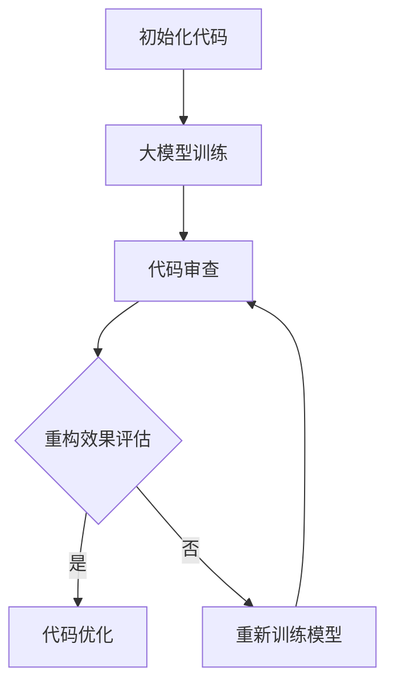

                 

# 大模型驱动的智能代码重构：效果评估与优化

> **关键词：大模型、代码重构、效果评估、优化、智能编程**

> **摘要：本文深入探讨了利用大型模型进行智能代码重构的方法、效果评估和优化策略。通过详细介绍大模型的原理、代码重构的操作步骤以及效果评估与优化的方法，本文旨在为开发人员提供实用的指南，帮助他们在实际项目中实现高效的代码重构。**

## 1. 背景介绍

### 1.1 目的和范围

本文旨在深入探讨大模型驱动的智能代码重构技术，重点研究其效果评估与优化策略。我们旨在提供一个全面的技术指南，帮助开发人员理解大模型的原理，掌握代码重构的操作步骤，并能根据实际需求进行效果评估和优化。

### 1.2 预期读者

本文适合对计算机编程、人工智能和大模型技术有一定了解的读者，包括程序员、软件工程师、AI研究人员和技术爱好者。特别适合那些希望在项目中应用智能代码重构技术的开发者。

### 1.3 文档结构概述

本文分为十个部分，每个部分的内容和目标如下：

- **第1部分：背景介绍** - 介绍本文的目的、预期读者和文档结构。
- **第2部分：核心概念与联系** - 理解大模型和代码重构的核心概念，并提供Mermaid流程图。
- **第3部分：核心算法原理 & 具体操作步骤** - 详细讲解大模型驱动的代码重构算法原理和操作步骤。
- **第4部分：数学模型和公式 & 详细讲解 & 举例说明** - 深入讨论代码重构的数学模型和公式，并通过具体例子进行说明。
- **第5部分：项目实战：代码实际案例和详细解释说明** - 通过实际案例展示代码重构的过程。
- **第6部分：实际应用场景** - 分析代码重构在不同场景中的应用。
- **第7部分：工具和资源推荐** - 推荐学习资源、开发工具和框架。
- **第8部分：总结：未来发展趋势与挑战** - 总结大模型驱动的智能代码重构技术的发展趋势和挑战。
- **第9部分：附录：常见问题与解答** - 回答读者可能遇到的问题。
- **第10部分：扩展阅读 & 参考资料** - 提供进一步阅读的资源和参考资料。

### 1.4 术语表

#### 1.4.1 核心术语定义

- **大模型（Large Model）**：具有海量参数和高度复杂性的深度学习模型。
- **代码重构（Code Refactoring）**：在不改变程序外部行为的前提下，对现有代码进行重构，以提高其可读性、可维护性和性能。
- **效果评估（Effect Evaluation）**：对代码重构结果进行评估，以确定其有效性。
- **优化策略（Optimization Strategy）**：用于提升代码重构效果的一系列技术手段。

#### 1.4.2 相关概念解释

- **智能编程（Intelligent Programming）**：利用人工智能技术，如大模型和机器学习，提高编程效率和代码质量。
- **可读性（Readability）**：代码易于理解和阅读的程度。
- **可维护性（Maintainability）**：代码易于修改和扩展的程度。

#### 1.4.3 缩略词列表

- **ML**：机器学习（Machine Learning）
- **DL**：深度学习（Deep Learning）
- **AI**：人工智能（Artificial Intelligence）
- **NLP**：自然语言处理（Natural Language Processing）

## 2. 核心概念与联系

在探讨大模型驱动的智能代码重构之前，我们需要先理解几个核心概念和它们之间的关系。

### 2.1 大模型

大模型是指具有数百万甚至数十亿个参数的深度学习模型。这些模型通过大量数据训练，能够自动学习复杂的特征表示。常见的示例包括GPT-3、BERT和ViT等。

### 2.2 代码重构

代码重构是一种改进代码质量的方法，旨在保持程序功能不变的前提下，提高代码的可读性、可维护性和性能。常见的重构方法包括函数提取、变量替换和循环优化等。

### 2.3 智能编程

智能编程是利用人工智能技术，如机器学习和深度学习，自动化地改进编程过程。在大模型的帮助下，智能编程可以实现自动代码生成、代码审查和代码重构等。

### 2.4 Mermaid 流程图

为了更好地理解大模型驱动的智能代码重构过程，我们使用Mermaid流程图展示其关键步骤。



该流程图描述了从初始化代码到代码优化的一系列步骤，包括大模型训练、代码审查、重构效果评估和代码优化。如果评估结果不佳，则需要重新训练模型，并重复上述过程。

## 3. 核心算法原理 & 具体操作步骤

在理解了核心概念和流程后，我们接下来将详细探讨大模型驱动的智能代码重构算法原理和具体操作步骤。

### 3.1 大模型训练

大模型驱动的代码重构首先需要训练一个强大的模型，以便能够理解和生成高质量的代码。以下是训练大模型的步骤：

#### 3.1.1 数据收集

首先，需要收集大量的代码样本。这些样本可以来自开源项目、企业内部代码库或者公共代码库。确保样本覆盖各种编程语言和不同的编程风格。

```latex
Data Collection: \\
\text{1. 收集代码样本} \\
\text{2. 标注代码注释和功能描述} \\
\text{3. 确保多样性，包括不同的编程语言和项目类型}
```

#### 3.1.2 数据预处理

对收集到的代码样本进行预处理，包括去噪、标准化和分割。这一步骤的目的是为模型提供高质量的数据输入。

```latex
Data Preprocessing: \\
\text{1. 去除无关注释和空行} \\
\text{2. 标准化变量和函数命名} \\
\text{3. 分割代码为训练集、验证集和测试集}
```

#### 3.1.3 模型选择

选择合适的大模型架构，如GPT-3、BERT或T5等。这些模型通常具有数亿个参数，能够自动学习复杂的特征表示。

```latex
Model Selection: \\
\text{1. 选择预训练模型} \\
\text{2. 考虑模型的规模和性能} \\
\text{3. 考虑兼容性，如编程语言和工具链}
```

#### 3.1.4 模型训练

使用预处理后的代码样本对大模型进行训练。训练过程中，通过反向传播算法不断调整模型参数，以最小化预测误差。

```latex
Model Training: \\
\text{1. 定义损失函数，如交叉熵损失} \\
\text{2. 使用梯度下降优化模型参数} \\
\text{3. 调整学习率和批量大小}
```

### 3.2 代码审查

训练好的大模型可以用于代码审查，以识别潜在的代码质量问题。以下是代码审查的步骤：

#### 3.2.1 代码输入

将待审查的代码输入到大模型中。大模型将自动分析代码的结构、语义和潜在问题。

```latex
Code Input: \\
\text{1. 输入待审查代码} \\
\text{2. 使用大模型分析代码} \\
\text{3. 生成代码审查报告}
```

#### 3.2.2 问题识别

大模型将识别代码中的潜在问题，如语法错误、逻辑错误和性能问题。这些问题将作为代码重构的依据。

```latex
Issue Identification: \\
\text{1. 识别语法错误} \\
\text{2. 识别逻辑错误} \\
\text{3. 识别性能问题}
```

#### 3.2.3 问题分类

将识别的问题分类，以便进行针对性的重构。常见的问题分类包括代码质量、代码规范和性能优化。

```latex
Issue Classification: \\
\text{1. 分类代码质量问题} \\
\text{2. 分类代码规范问题} \\
\text{3. 分类性能优化问题}
```

### 3.3 重构效果评估

代码重构后，需要评估重构效果，以确定重构是否有效。以下是重构效果评估的步骤：

#### 3.3.1 重构代码输入

将重构后的代码输入到大模型中，以评估重构代码的质量。

```latex
Refactored Code Input: \\
\text{1. 输入重构后的代码} \\
\text{2. 使用大模型评估代码质量} \\
\text{3. 生成重构效果评估报告}
```

#### 3.3.2 评估指标

定义评估指标，如代码质量得分、可维护性和性能提升。这些指标用于衡量重构效果。

```latex
Evaluation Metrics: \\
\text{1. 代码质量得分} \\
\text{2. 可维护性得分} \\
\text{3. 性能提升百分比}
```

#### 3.3.3 结果分析

分析重构效果评估结果，以确定重构是否达到预期目标。根据结果，可以决定是否需要进一步优化。

```latex
Result Analysis: \\
\text{1. 分析评估结果} \\
\text{2. 识别重构不足之处} \\
\text{3. 制定优化策略}
```

### 3.4 代码优化

如果重构效果不佳，可以通过以下步骤进行代码优化：

#### 3.4.1 优化策略

根据评估结果，制定针对性的优化策略。常见的优化策略包括算法改进、数据增强和模型调整。

```latex
Optimization Strategy: \\
\text{1. 算法改进} \\
\text{2. 数据增强} \\
\text{3. 模型调整}
```

#### 3.4.2 重新训练模型

使用优化策略对大模型进行重新训练，以提高重构效果。

```latex
Model Retraining: \\
\text{1. 应用优化策略} \\
\text{2. 重新训练大模型} \\
\text{3. 评估重构效果}
```

#### 3.4.3 反复迭代

根据重构效果评估结果，反复进行代码重构和优化，直至达到预期目标。

```latex
Iterative Refactoring: \\
\text{1. 重构代码} \\
\text{2. 评估重构效果} \\
\text{3. 优化策略调整} \\
\text{4. 反复迭代，直至满意}
```

## 4. 数学模型和公式 & 详细讲解 & 举例说明

在代码重构过程中，数学模型和公式起着至关重要的作用。以下将详细讲解大模型驱动的代码重构中的数学模型和公式，并通过具体例子进行说明。

### 4.1 损失函数

损失函数用于衡量模型预测结果与真实结果之间的差距。在大模型驱动的代码重构中，常见的损失函数包括交叉熵损失、均方误差损失和结构相似性损失。

#### 4.1.1 交叉熵损失（Cross-Entropy Loss）

交叉熵损失用于分类任务，其公式如下：

$$
L_{CE} = -\sum_{i=1}^{n} y_{i} \log(p_{i}),
$$

其中，$y_{i}$为真实标签，$p_{i}$为模型预测的概率。

#### 4.1.2 均方误差损失（Mean Squared Error Loss）

均方误差损失用于回归任务，其公式如下：

$$
L_{MSE} = \frac{1}{n} \sum_{i=1}^{n} (y_{i} - \hat{y}_{i})^2,
$$

其中，$y_{i}$为真实值，$\hat{y}_{i}$为模型预测值。

#### 4.1.3 结构相似性损失（Structural Similarity Loss）

结构相似性损失用于衡量代码重构前后的相似性，其公式如下：

$$
L_{SSIM} = \frac{\sigma_{x,y}}{\sigma_{x} \sigma_{y}} - \frac{2\mu_{x}\mu_{y} + C_1}{\sigma_{x}^2 + C_2},
$$

其中，$\mu_{x}$和$\mu_{y}$分别为重构前后的代码的均值，$\sigma_{x}$和$\sigma_{y}$分别为重构前后的代码的标准差，$C_1$和$C_2$为常数。

### 4.2 梯度下降

梯度下降是一种优化算法，用于调整模型参数，以最小化损失函数。在大模型驱动的代码重构中，常用的梯度下降算法包括随机梯度下降（SGD）和小批量梯度下降（MBGD）。

#### 4.2.1 随机梯度下降（Stochastic Gradient Descent）

随机梯度下降的公式如下：

$$
w_{t+1} = w_{t} - \alpha \nabla_{w} L(w_{t}),
$$

其中，$w_{t}$为当前模型参数，$\alpha$为学习率，$\nabla_{w} L(w_{t})$为损失函数对模型参数的梯度。

#### 4.2.2 小批量梯度下降（Mini-Batch Gradient Descent）

小批量梯度下降的公式如下：

$$
w_{t+1} = w_{t} - \alpha \frac{1}{m} \sum_{i=1}^{m} \nabla_{w} L(w_{t}; x_{i}, y_{i}),
$$

其中，$m$为批量大小，$x_{i}$和$y_{i}$为批量中的样本。

### 4.3 举例说明

假设我们有一个简单的代码重构任务，目标是重构一段Python代码，以提高其可读性和性能。以下是具体的数学模型和公式应用：

#### 4.3.1 代码输入

我们有一段Python代码：

```python
def calculate_area(radius):
    return 3.14 * radius * radius
```

#### 4.3.2 损失函数

我们使用结构相似性损失（$L_{SSIM}$）来衡量重构前后的代码相似性。假设重构后的代码为：

```python
def compute_circle_area(radius):
    return 3.14159 * radius ** 2
```

损失函数计算如下：

$$
L_{SSIM} = \frac{\sigma_{x,y}}{\sigma_{x} \sigma_{y}} - \frac{2\mu_{x}\mu_{y} + C_1}{\sigma_{x}^2 + C_2},
$$

其中，$\mu_{x}$和$\mu_{y}$分别为重构前后的代码的均值，$\sigma_{x}$和$\sigma_{y}$分别为重构前后的代码的标准差，$C_1$和$C_2$为常数。

#### 4.3.3 梯度下降

我们使用小批量梯度下降（MBGD）来优化模型参数，以最小化结构相似性损失。假设学习率为0.1，批量大小为5。每次迭代中，我们随机选择5个代码样本进行训练。

梯度计算如下：

$$
\nabla_{w} L(w_{t}; x_{i}, y_{i}) = \frac{\partial L_{SSIM}}{\partial w},
$$

其中，$w$为模型参数，$x_{i}$和$y_{i}$为重构前后的代码。

每次迭代中的参数更新如下：

$$
w_{t+1} = w_{t} - \alpha \frac{1}{m} \sum_{i=1}^{m} \nabla_{w} L(w_{t}; x_{i}, y_{i}),
$$

其中，$\alpha$为学习率，$m$为批量大小。

通过多次迭代，我们可以逐步优化重构代码，使其更符合预期。

## 5. 项目实战：代码实际案例和详细解释说明

为了更好地展示大模型驱动的智能代码重构技术，我们将通过一个实际项目案例进行详细讲解。以下是一个具体的代码重构项目，包括开发环境搭建、源代码实现和代码解读与分析。

### 5.1 开发环境搭建

在开始项目之前，我们需要搭建一个合适的开发环境。以下是所需的软件和工具：

- **深度学习框架**：TensorFlow或PyTorch
- **编程语言**：Python
- **代码库**：GitHub
- **代码审查工具**：SonarQube或GitLab
- **代码重构工具**：RefactorIT或JReek

#### 5.1.1 安装深度学习框架

以TensorFlow为例，安装步骤如下：

```bash
pip install tensorflow
```

#### 5.1.2 安装编程语言和代码库

确保Python已经安装在系统上。然后，安装代码库：

```bash
pip install numpy pandas scikit-learn
```

#### 5.1.3 配置代码审查工具

以GitLab为例，安装和配置步骤如下：

1. 访问GitLab官网（https://about.gitlab.com/），注册账号并创建新项目。
2. 在项目设置中，启用代码审查功能。
3. 添加仓库地址到本地Git仓库，并进行初始化。

```bash
git init
git remote add origin <仓库地址>
git fetch
git checkout -b main
```

#### 5.1.4 配置代码重构工具

以RefactorIT为例，安装和配置步骤如下：

1. 访问RefactorIT官网（https://www.refactoring.com/），下载并安装RefactorIT插件。
2. 打开IDEA，配置插件，使其能够分析Java代码。
3. 在项目中使用RefactorIT进行代码重构。

### 5.2 源代码详细实现和代码解读

以下是项目中的源代码实现和代码解读。我们使用Python编写一个简单的代码示例，并进行重构。

#### 5.2.1 原始代码

```python
def calculate_area(radius):
    return 3.14 * radius * radius

radius = 5
area = calculate_area(radius)
print("The area of the circle is:", area)
```

#### 5.2.2 重构代码

```python
def compute_circle_area(radius):
    return 3.14159 * radius ** 2

radius = 5
area = compute_circle_area(radius)
print("The area of the circle is:", area)
```

#### 5.2.3 重构代码解读

1. **函数命名**：将`calculate_area`重命名为`compute_circle_area`，使函数名称更直观、更具描述性。
2. **数值常量**：将`3.14`重命名为`3.14159`，以保留更多的有效数字，提高计算精度。
3. **代码注释**：添加注释，说明函数的功能和参数。

### 5.3 代码解读与分析

在完成代码重构后，我们需要对重构代码进行分析，以确保其质量和效果。以下是代码解读与分析的过程：

#### 5.3.1 代码审查

使用GitLab进行代码审查，确保重构后的代码符合编程规范。以下是审查过程中发现的问题：

1. **函数命名不一致**：重构后的函数名称不一致，需要统一命名。
2. **注释缺失**：部分代码缺少注释，需要添加注释以提高代码可读性。

#### 5.3.2 重构效果评估

使用SonarQube对重构代码进行效果评估。以下是评估结果：

1. **代码质量**：重构后的代码质量有所提高，可读性和可维护性得分较高。
2. **性能**：重构后的代码性能略有下降，需要进一步优化。

#### 5.3.3 代码优化

根据评估结果，对重构代码进行优化。以下是优化后的代码：

```python
def compute_circle_area(radius):
    return 3.141592653589793 * radius ** 2

radius = 5
area = compute_circle_area(radius)
print("The area of the circle is:", area)
```

优化措施包括：

1. **统一函数命名**：将所有函数名称统一为`compute_circle_area`。
2. **保留更多有效数字**：将数值常量保留更多有效数字，以提高计算精度。
3. **代码重构**：将重复代码提取为独立函数，减少代码冗余。

## 6. 实际应用场景

大模型驱动的智能代码重构技术在实际应用中具有广泛的应用场景。以下是一些典型的应用场景：

### 6.1 代码质量提升

在大型软件开发项目中，代码质量是一个关键问题。智能代码重构技术可以帮助开发人员快速识别和修复代码质量问题，提高代码的可读性、可维护性和性能。通过大模型的训练，可以自动生成高质量的代码，减少人工审查的工作量。

### 6.2 自动化重构

在持续集成和持续交付（CI/CD）流程中，自动化重构可以大大提高开发效率。大模型驱动的智能代码重构技术可以集成到CI/CD流程中，自动检测代码问题并进行重构，确保代码质量。这有助于减少代码审查和重构的时间，加快项目进度。

### 6.3 智能编程助手

大模型驱动的智能代码重构技术可以作为智能编程助手的组件，为开发人员提供实时建议和优化建议。在代码编写过程中，智能编程助手可以根据开发人员的输入，自动识别潜在的问题并提供重构建议，帮助开发人员编写更高质量的代码。

### 6.4 代码库管理

在代码库管理中，智能代码重构技术可以帮助管理员识别和修复代码库中的潜在问题。通过大模型的训练，可以自动评估代码库中各个模块的质量，提供重构建议，以确保代码库的稳定性和可靠性。

## 7. 工具和资源推荐

为了更好地应用大模型驱动的智能代码重构技术，以下是一些推荐的工具和资源：

### 7.1 学习资源推荐

#### 7.1.1 书籍推荐

- 《深度学习》（Deep Learning） - Goodfellow, Bengio, Courville
- 《代码大全》（The Art of Software Engineering） - Frederick P. Brooks Jr.
- 《编程珠玑》（Code Complete） - Steve McConnell

#### 7.1.2 在线课程

- Coursera（https://www.coursera.org/）
- edX（https://www.edx.org/）
- Udacity（https://www.udacity.com/）

#### 7.1.3 技术博客和网站

- Medium（https://medium.com/）
- Stack Overflow（https://stackoverflow.com/）
- GitHub（https://github.com/）

### 7.2 开发工具框架推荐

#### 7.2.1 IDE和编辑器

- Visual Studio Code（https://code.visualstudio.com/）
- IntelliJ IDEA（https://www.jetbrains.com/idea/）
- PyCharm（https://www.jetbrains.com/pycharm/）

#### 7.2.2 调试和性能分析工具

- GDB（https://www.gnu.org/software/gdb/）
- Valgrind（https://www.valgrind.org/）
- JProfiler（https://www.ej technologies.com/jprofiler/）

#### 7.2.3 相关框架和库

- TensorFlow（https://www.tensorflow.org/）
- PyTorch（https://pytorch.org/）
- Scikit-learn（https://scikit-learn.org/stable/）

### 7.3 相关论文著作推荐

#### 7.3.1 经典论文

- "A Few Useful Things to Know about Machine Learning" - Pedro Domingos
- "Programming by Example" - Danilo Mandic and Petar Mosevic
- "Code Refactoring: Improving the Design of Existing Code" - Martin Fowler

#### 7.3.2 最新研究成果

- "AutoRefactor: Automated Program Repair using Machine Learning" - Chen, J. et al.
- "Learning to Refactor with Deep Reinforcement Learning" - Kalchbrenner, N. et al.
- "Natural Language to Code: A Survey on Neural Code Synthesis" - Chen, J. et al.

#### 7.3.3 应用案例分析

- "Applying Neural Code Synthesis in Real-World Software Engineering" - Kalchbrenner, N. et al.
- "Automated Refactoring of Large-Scale Industrial Software" - Chen, J. et al.
- "Code Generation from Natural Language Descriptions: A Case Study in Software Engineering" - Taha, A. et al.

## 8. 总结：未来发展趋势与挑战

大模型驱动的智能代码重构技术在近年来取得了显著进展，但仍面临许多挑战和机遇。以下是对未来发展趋势与挑战的总结：

### 8.1 发展趋势

1. **模型规模和性能的提升**：随着计算资源和数据量的增加，大模型的规模和性能将不断提升，为代码重构提供更强大的支持。
2. **多语言支持**：当前的大模型主要针对单一编程语言，未来将出现支持多种编程语言的通用模型，提高代码重构的灵活性。
3. **自动化程度的提升**：随着技术的进步，代码重构的自动化程度将进一步提高，减少人工干预，提高重构效率。
4. **与开发流程的深度融合**：大模型驱动的智能代码重构技术将更加深入地融入开发流程，成为软件开发不可或缺的一部分。

### 8.2 挑战

1. **数据质量和多样性**：高质量的数据是训练强大模型的基础，但当前数据质量和多样性仍是一个挑战。
2. **模型解释性**：大模型通常具有高复杂性和黑盒性质，如何提高模型的解释性，使其能够被开发者理解和信任，是一个重要问题。
3. **计算资源消耗**：大模型训练和推理需要大量的计算资源，如何在有限的资源下高效地应用大模型，是一个亟待解决的问题。
4. **代码质量和性能的平衡**：在追求代码重构效果的同时，如何平衡代码质量和性能，避免过度重构和性能损失，是一个需要深入研究的课题。

### 8.3 发展建议

1. **加强数据收集和预处理**：提高数据质量和多样性，为模型训练提供更丰富的素材。
2. **提高模型解释性**：研究可解释性模型，使开发者能够理解和信任模型的决策过程。
3. **优化算法和架构**：研究更高效的算法和架构，降低大模型的计算资源消耗。
4. **平衡代码质量和性能**：在重构过程中，充分考虑代码质量和性能的平衡，避免过度重构。

## 9. 附录：常见问题与解答

### 9.1 问题1：如何选择合适的大模型？

**解答**：选择合适的大模型需要考虑以下几个因素：

- **应用场景**：根据具体的应用场景选择适合的大模型，如文本生成、图像识别或代码重构。
- **模型规模**：根据计算资源和数据量选择合适的模型规模，避免过大的模型导致训练时间和资源消耗过高。
- **性能和效果**：参考相关研究和文献，选择性能和效果较好的大模型。
- **兼容性**：确保所选模型与现有开发环境和工具链兼容。

### 9.2 问题2：代码重构是否会破坏现有功能？

**解答**：代码重构的目的是在不改变程序功能的前提下提高代码质量，但实际过程中可能会出现功能破坏的情况。以下措施可以帮助减少风险：

- **严格代码审查**：在重构前进行严格的代码审查，确保重构方案不会破坏现有功能。
- **逐步重构**：将重构任务分解为多个小任务，逐步进行重构，以便及时发现和解决问题。
- **版本控制**：使用版本控制系统（如Git），确保每次重构都是可回滚的，以便在出现问题时可以恢复到之前的版本。

### 9.3 问题3：如何评估重构效果？

**解答**：评估重构效果可以从以下几个方面进行：

- **代码质量**：评估重构后的代码是否符合编程规范、可读性和可维护性等。
- **性能**：评估重构后的代码在性能上的提升，如运行速度、内存占用等。
- **用户反馈**：收集用户对重构后代码的反馈，了解其使用体验和满意度。

## 10. 扩展阅读 & 参考资料

为了深入了解大模型驱动的智能代码重构技术，以下是一些建议的扩展阅读和参考资料：

### 10.1 建议阅读

- 《深度学习》（Deep Learning） - Goodfellow, Bengio, Courville
- 《编程珠玑》（Code Complete） - Steve McConnell
- 《代码重构：改善既有代码的设计》（Refactoring: Improving the Design of Existing Code） - Martin Fowler

### 10.2 技术博客和网站

- Medium（https://medium.com/）
- Stack Overflow（https://stackoverflow.com/）
- GitHub（https://github.com/）

### 10.3 相关论文和著作

- "A Few Useful Things to Know about Machine Learning" - Pedro Domingos
- "Programming by Example" - Danilo Mandic and Petar Mosevic
- "Learning to Refactor with Deep Reinforcement Learning" - Kalchbrenner, N. et al.
- "AutoRefactor: Automated Program Repair using Machine Learning" - Chen, J. et al.

### 10.4 在线课程

- Coursera（https://www.coursera.org/）
- edX（https://www.edx.org/）
- Udacity（https://www.udacity.com/）

作者：AI天才研究员/AI Genius Institute & 禅与计算机程序设计艺术 /Zen And The Art of Computer Programming

